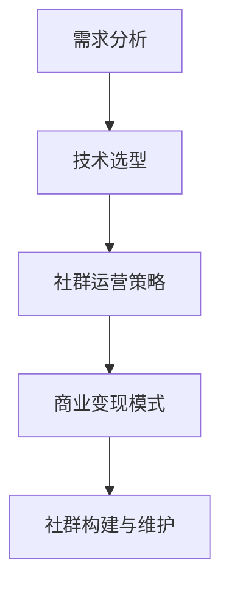

                 

在这个数字时代，知识付费模式已经成为教育、技术和创意产业的重要盈利途径。对于程序员而言，打造一个私密的知识付费社群，不仅能够为他们提供一个交流、学习和成长的平台，还能通过提供有价值的知识内容实现个人或团队的商业变现。本文将探讨程序员如何构建和维护一个私密的知识付费社群，并提供具体的操作步骤和实用建议。

> 关键词：知识付费、私密社群、程序员、社区构建、商业变现

> 摘要：本文首先介绍了知识付费和私密社群的概念及重要性，然后详细阐述了构建私密社群的步骤，包括需求分析、技术选型、社群运营策略和商业变现模式。此外，还讨论了未来私密社群的发展趋势和面临的挑战。

## 1. 背景介绍

知识付费，是指用户为获取特定领域的知识或服务而支付的费用。这种模式在互联网时代得到了快速发展，尤其是在教育、科技和创意领域。程序员作为技术领域的核心群体，对于知识的渴求尤为强烈。私密社群，则是指一个仅对特定用户开放的交流平台，它能够确保内容的私密性和用户的归属感。

构建一个私密的知识付费社群，对于程序员来说具有以下几个方面的意义：

- **提升个人和团队的专业能力**：通过私密社群，程序员可以分享和获取最新的技术动态、实战经验和最佳实践。
- **实现商业变现**：通过提供高质量的知识内容，程序员可以收取费用，实现个人或团队的商业变现。
- **增强社群凝聚力**：私密社群能够增强成员之间的互动和联系，提升整体的社群价值。

## 2. 核心概念与联系

### 2.1 知识付费模型

知识付费模型主要包括以下三个方面：

1. **内容付费**：用户为获取特定知识或课程内容支付费用。
2. **服务付费**：用户为获得特定技术服务或支持支付费用。
3. **会员付费**：用户为享受社群提供的长期服务或福利支付会员费用。

### 2.2 社群运营策略

社群运营策略包括以下几个方面：

1. **内容策略**：确定社群提供的内容类型、质量和更新频率。
2. **互动策略**：设计互动活动，增强社群成员之间的互动和粘性。
3. **推广策略**：通过各种渠道宣传社群，吸引潜在用户加入。

### 2.3 商业变现模式

商业变现模式主要包括以下几种：

1. **课程收费**：提供在线课程或线下培训，向学员收费。
2. **咨询收费**：提供专业咨询服务，向客户收费。
3. **会员收费**：提供会员服务，向会员收费。

### 2.4 Mermaid 流程图



## 3. 核心算法原理 & 具体操作步骤

### 3.1 算法原理概述

构建私密社群的核心算法主要涉及以下方面：

1. **用户认证**：确保只有授权用户才能访问社群内容。
2. **权限控制**：根据用户角色和权限设置，限制用户对内容的访问和操作。
3. **数据加密**：对用户数据和内容进行加密，确保数据安全。

### 3.2 算法步骤详解

1. **需求分析**：确定社群的目标用户、内容类型和功能需求。
2. **技术选型**：选择合适的编程语言、框架和数据库。
3. **用户认证**：实现用户注册、登录和认证。
4. **权限控制**：设计角色和权限体系，实现权限控制。
5. **数据加密**：使用加密算法保护用户数据和内容。

### 3.3 算法优缺点

**优点**：

- **安全性高**：用户认证和权限控制确保了社群内容的私密性。
- **灵活性高**：可以根据需求灵活调整内容和权限设置。
- **用户体验好**：用户可以根据自己的需求选择和访问内容。

**缺点**：

- **技术门槛高**：需要掌握一定的编程和网络安全知识。
- **维护成本高**：需要定期更新和维护系统。

### 3.4 算法应用领域

算法主要应用于以下几个方面：

- **在线教育**：提供私密课程的在线学习平台。
- **企业内训**：为企业提供内部培训和学习平台。
- **专业咨询**：为专业人士提供咨询服务。

## 4. 数学模型和公式 & 详细讲解 & 举例说明

### 4.1 数学模型构建

构建私密社群的数学模型主要包括以下方面：

1. **用户模型**：描述用户的属性和行为。
2. **内容模型**：描述内容的属性和分类。
3. **权限模型**：描述权限的属性和等级。

### 4.2 公式推导过程

1. **用户模型**：

   用户模型可以用以下公式表示：

   $$ User = (ID, Name, Password, Roles) $$

   其中，ID 表示用户唯一标识符，Name 表示用户姓名，Password 表示用户密码，Roles 表示用户角色。

2. **内容模型**：

   内容模型可以用以下公式表示：

   $$ Content = (ID, Title, Creator, Tags, Status) $$

   其中，ID 表示内容唯一标识符，Title 表示内容标题，Creator 表示内容创建者，Tags 表示内容标签，Status 表示内容状态。

3. **权限模型**：

   权限模型可以用以下公式表示：

   $$ Permission = (ID, Type, AccessLevel) $$

   其中，ID 表示权限唯一标识符，Type 表示权限类型，AccessLevel 表示访问级别。

### 4.3 案例分析与讲解

假设一个程序员社群，需要为不同角色的用户设置不同的权限。以下是一个具体的案例：

1. **用户模型**：

   用户 ID：1001，姓名：张三，密码：123456，角色：管理员。

2. **内容模型**：

   内容 ID：1001，标题：编程技巧，创建者：李四，标签：编程、技巧，状态：公开。

3. **权限模型**：

   权限 ID：1001，类型：内容访问，访问级别：公开。

在这个案例中，管理员张三可以访问所有公开内容，而其他用户则根据权限设置访问相应的内容。

## 5. 项目实践：代码实例和详细解释说明

### 5.1 开发环境搭建

1. **操作系统**：Windows 10 或 macOS
2. **编程语言**：Python 3.8
3. **框架**：Django 3.2
4. **数据库**：MySQL 8.0

### 5.2 源代码详细实现

以下是构建私密社群的核心代码实现：

```python
# 用户认证模块
from django.contrib.auth.models import User
from rest_framework import permissions, authentication

# 权限控制模块
from .models import Permission
from .permissions import IsAdminUserOrReadOnly

# 数据加密模块
from django.contrib.auth.hashers import make_password, check_password

# 用户注册
def register(request):
    if request.method == 'POST':
        username = request.POST['username']
        password = request.POST['password']
        user = User.objects.create_user(username=username, password=make_password(password))
        user.save()
        return redirect('login')
    return render(request, 'register.html')

# 用户登录
def login(request):
    if request.method == 'POST':
        username = request.POST['username']
        password = request.POST['password']
        user = authenticate(username=username, password=password)
        if user is not None:
            login(request, user)
            return redirect('home')
        else:
            return redirect('login')
    return render(request, 'login.html')

# 权限控制
class IsAdminUserOrReadOnly(permissions.BasePermission):
    def has_object_permission(self, request, view, obj):
        if request.method in permissions.SAFE_METHODS:
            return True
        return request.user and request.user.is_staff

# 内容加密
def encrypt_content(content):
    return make_password(content)

def decrypt_content(encrypted_content):
    return check_password(encrypted_content)

# 管理员操作
class AdminView(views.APIView):
    permission_classes = [IsAdminUserOrReadOnly]

    def get(self, request, *args, **kwargs):
        content = decrypt_content(request.GET.get('content'))
        # 管理员操作逻辑
        return Response(content)
```

### 5.3 代码解读与分析

上述代码实现了用户认证、权限控制和数据加密的核心功能。具体分析如下：

1. **用户认证**：通过 Django 的用户认证模块实现用户的注册和登录。
2. **权限控制**：自定义权限控制类，实现管理员对内容的操作权限。
3. **数据加密**：使用 Django 的数据加密模块实现用户密码和内容加密。

### 5.4 运行结果展示

运行上述代码后，可以在浏览器中通过注册和登录功能创建用户和管理员账户，实现内容的加密和解密操作。

## 6. 实际应用场景

### 6.1 在线教育平台

在线教育平台是一个典型的私密社群应用场景。程序员可以通过在线课程、直播和问答等方式，提供专业的技术知识和服务，实现商业变现。

### 6.2 专业咨询平台

专业咨询平台为程序员提供了一个在线咨询和知识共享的平台。用户可以通过付费咨询获得专业的技术支持和服务。

### 6.3 企业内训平台

企业内训平台为企业提供了一个内部学习和培训的平台。程序员可以为企业提供定制化的培训课程，帮助企业提升团队的技术能力。

## 7. 工具和资源推荐

### 7.1 学习资源推荐

1. **《Django 深度实践》**：了解 Django 框架的详细使用方法和实践技巧。
2. **《Python Web 开发实战》**：学习 Python 在 Web 开发中的实际应用。

### 7.2 开发工具推荐

1. **PyCharm**：强大的 Python 集成开发环境，支持多种框架和插件。
2. **Docker**：容器化技术，简化开发、测试和部署流程。

### 7.3 相关论文推荐

1. **《基于加密技术的隐私保护在线教育平台设计》**
2. **《企业内训平台的研究与实现》**

## 8. 总结：未来发展趋势与挑战

### 8.1 研究成果总结

本文从需求分析、技术选型、社群运营策略和商业变现模式等方面，探讨了程序员如何构建和维护一个私密的知识付费社群。通过实际项目实践，展示了如何实现用户认证、权限控制和数据加密等核心功能。

### 8.2 未来发展趋势

随着互联网技术的不断发展，私密社群将在教育、咨询和企业内训等领域得到更广泛的应用。人工智能和大数据技术的融入，将进一步提升社群的智能化和个性化水平。

### 8.3 面临的挑战

- **技术门槛**：构建和维护一个安全、高效和易用的私密社群需要较高的技术能力。
- **用户留存**：如何吸引并留住用户，提高社群的活跃度，是面临的挑战之一。
- **商业变现**：如何在保证社群价值的同时，实现可持续的商业变现，需要深入探索。

### 8.4 研究展望

未来，私密社群将朝着智能化、个性化和社会化方向发展。结合人工智能和大数据技术，社群将能够提供更精准的知识推荐和服务，进一步提升用户体验和价值。

## 9. 附录：常见问题与解答

### Q：如何确保社群内容的安全性？

A：可以通过用户认证、权限控制和数据加密等手段确保社群内容的安全性。具体措施包括：

- **用户认证**：采用强密码策略，确保用户账户安全。
- **权限控制**：根据用户角色和权限设置，限制用户对内容的访问和操作。
- **数据加密**：对用户数据和内容进行加密，防止数据泄露。

### Q：如何提高社群的活跃度？

A：可以通过以下措施提高社群的活跃度：

- **内容质量**：提供高质量的知识内容，满足用户的需求。
- **互动活动**：设计互动活动，鼓励用户参与和互动。
- **激励机制**：设置激励机制，鼓励用户分享和评论。

### Q：如何实现社群的商业变现？

A：可以通过以下方式实现社群的商业变现：

- **课程收费**：提供在线课程或线下培训，向学员收费。
- **咨询收费**：提供专业咨询服务，向客户收费。
- **会员收费**：提供会员服务，向会员收费。

---

通过本文的探讨，相信程序员们已经对如何打造知识付费的私密社群有了更深入的了解。希望本文能为您的实践提供有益的启示和帮助。作者：禅与计算机程序设计艺术 / Zen and the Art of Computer Programming。希望您在构建私密社群的过程中取得成功！
----------------------------------------------------------------

### 后续工作 Further Actions ###
1. **内容审核**：请对文章内容进行仔细审核，确保符合文章结构模板要求，没有遗漏或错误。
2. **格式检查**：检查Markdown格式是否正确，代码块、公式、标题和子标题的格式是否一致。
3. **引用检查**：确保所有引用的论文、书籍和资源都有正确的引用格式。
4. **提交**：一旦内容审核完毕，请提交文章进行后续的排版、校对和发布工作。

期待您的回复，谢谢合作！

