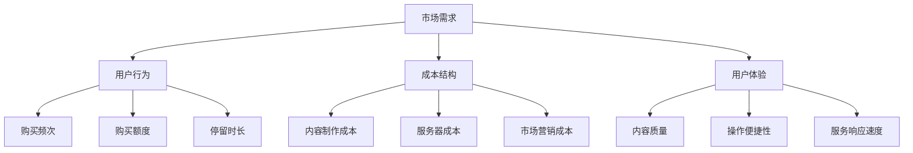

                 

关键词：知识付费、阶梯定价、策略设计、成本效益分析、用户体验优化

> 摘要：本文将深入探讨程序员在设计知识付费平台的阶梯定价策略时需要考虑的关键因素。通过分析市场需求、用户行为、成本结构以及用户体验，我们将构建一个逻辑清晰、易于理解和操作的阶梯定价策略模型，以帮助平台实现收入最大化与用户满意度最大化。

## 1. 背景介绍

随着互联网技术的飞速发展，知识付费市场逐渐兴起。程序员作为知识付费的重要参与者，既需要提供优质的内容，又需考虑如何设计有效的定价策略来吸引和留住用户。阶梯定价策略作为一种灵活的定价方式，能够根据用户的需求和平台的目标进行动态调整，从而在提高用户粘性、促进消费的同时，实现收益的最大化。

### 1.1 知识付费市场现状

知识付费市场涵盖了各种领域，包括编程、设计、管理、教育等。随着用户对高质量知识内容的需求日益增长，知识付费平台如雨后春笋般涌现。这些平台通过提供专业、系统的知识内容，满足了用户提升技能、解决问题的需求。然而，如何在竞争激烈的市场中脱颖而出，成为每个知识付费平台面临的挑战。

### 1.2 阶梯定价策略的定义

阶梯定价策略是指根据用户的使用频率、消费额度或者会员等级，设置不同价格级别的产品或服务。这种策略可以激励用户进行更高频次的消费，从而提高平台的收入。阶梯定价策略的优点在于能够灵活应对市场变化，满足不同用户群体的需求，提高用户忠诚度。

## 2. 核心概念与联系

为了更好地设计阶梯定价策略，我们需要了解几个关键概念，包括市场需求、用户行为、成本结构和用户体验。

### 2.1 市场需求

市场需求是指在一定时间内，消费者愿意且有能力购买某种商品或服务的总量。了解市场需求有助于我们确定定价策略的合理区间。在知识付费市场中，市场需求主要受以下因素影响：

- **用户技能水平**：技能水平较高的用户可能更愿意支付更高的价格以获取更高级别的知识。
- **竞争态势**：竞争对手的定价策略会影响市场的整体价格水平。
- **用户需求变化**：用户对知识内容的偏好可能会随时间变化，需要灵活调整定价策略。

### 2.2 用户行为

用户行为是指用户在平台上的行为模式，包括注册、浏览、购买、评价等。了解用户行为有助于我们优化定价策略，提高用户满意度。以下是几个关键的用户行为指标：

- **购买频次**：高频次的购买者可能是平台的忠实用户，可以通过优惠策略激励他们继续消费。
- **购买额度**：高购买额度的用户可能对平台内容有更高的认可度，可以考虑提高他们的会员等级。
- **停留时长**：用户在平台上的停留时长可以反映他们对内容的质量和兴趣。

### 2.3 成本结构

成本结构是指平台在运营过程中所产生的各种成本，包括内容制作成本、服务器成本、市场营销成本等。了解成本结构有助于我们在定价时考虑到平台的盈利能力。

### 2.4 用户体验

用户体验是指用户在使用平台时感受到的整体感受。良好的用户体验可以提高用户满意度，从而促进用户留存和消费。以下是影响用户体验的几个关键因素：

- **内容质量**：高质量的内容是吸引用户的重要因素。
- **操作便捷性**：简洁直观的操作界面可以提高用户的体验。
- **服务响应速度**：快速响应用户的需求可以提高用户的满意度。

### 2.5 Mermaid 流程图

以下是核心概念与联系的结构化表示：



## 3. 核心算法原理 & 具体操作步骤

### 3.1 算法原理概述

阶梯定价策略的设计基于以下原理：

- **动态调整**：根据市场需求、用户行为和成本结构等实时数据，动态调整价格区间和优惠策略。
- **用户分层**：将用户按照购买频次、购买额度等因素划分为不同层次，设置相应的价格和优惠。
- **优化收益**：在保证用户体验的同时，最大化平台收益。

### 3.2 算法步骤详解

以下是阶梯定价策略的详细设计步骤：

#### 3.2.1 数据收集与分析

1. **收集用户行为数据**：包括购买频次、购买额度、停留时长等。
2. **分析用户行为数据**：通过数据分析，识别用户行为特征，为后续定价策略提供依据。

#### 3.2.2 确定价格区间

1. **设定价格下限**：根据成本结构和市场调研，设定最低价格。
2. **设定价格上限**：根据市场承受能力和用户需求，设定最高价格。
3. **划分价格区间**：在最低价格和最高价格之间，根据用户行为特征，划分不同的价格区间。

#### 3.2.3 设定优惠策略

1. **设置会员等级**：根据用户购买频次、购买额度等因素，设置不同的会员等级。
2. **设定优惠幅度**：根据会员等级，设定不同的优惠幅度，以激励用户消费。

#### 3.2.4 动态调整

1. **实时监测数据**：持续收集用户行为数据和市场需求数据。
2. **动态调整策略**：根据实时数据，调整价格区间和优惠策略，以实现收益最大化。

### 3.3 算法优缺点

#### 优点：

- **灵活性**：可以根据市场变化和用户需求，动态调整定价策略。
- **收益最大化**：通过分层定价和优惠策略，实现平台收益最大化。
- **用户满意度**：通过优化用户体验，提高用户满意度，促进用户留存。

#### 缺点：

- **实施难度**：需要大量的数据支持和算法优化，实施难度较高。
- **市场风险**：如果定价策略不合理，可能导致用户流失。

### 3.4 算法应用领域

阶梯定价策略广泛应用于知识付费、电商、订阅服务等领域。以下是几个典型的应用场景：

- **知识付费平台**：根据用户学习进度和需求，提供不同层次的付费内容。
- **电商平台**：根据用户购买历史和喜好，提供个性化推荐和优惠。
- **订阅服务**：根据用户使用频率和需求，提供不同层次的订阅服务。

## 4. 数学模型和公式 & 详细讲解 & 举例说明

### 4.1 数学模型构建

为了更好地设计阶梯定价策略，我们可以构建一个简单的数学模型。假设有一个知识付费平台，用户分为三个层次：初级用户、中级用户和高级用户。每个层次的定价和优惠策略如下：

- 初级用户：每月支付 99 元，无优惠。
- 中级用户：每月支付 199 元，享受 10% 的折扣。
- 高级用户：每月支付 299 元，享受 20% 的折扣。

### 4.2 公式推导过程

我们可以使用以下公式来计算每个层次的收益：

- 初级用户收益：\(R_1 = 99 \times n_1\)
- 中级用户收益：\(R_2 = 199 \times n_2 \times 0.9\)
- 高级用户收益：\(R_3 = 299 \times n_3 \times 0.8\)

其中，\(n_1\)、\(n_2\) 和 \(n_3\) 分别表示初级用户、中级用户和高级用户的数量。

### 4.3 案例分析与讲解

假设当前平台有 1000 个用户，其中 300 个初级用户，400 个中级用户和 300 个高级用户。我们可以使用上述公式计算平台的收益：

- 初级用户收益：\(R_1 = 99 \times 300 = 29700\) 元
- 中级用户收益：\(R_2 = 199 \times 400 \times 0.9 = 71620\) 元
- 高级用户收益：\(R_3 = 299 \times 300 \times 0.8 = 74280\) 元

总收益：\(R = R_1 + R_2 + R_3 = 29700 + 71620 + 74280 = 176400\) 元

通过这个简单的案例，我们可以看到阶梯定价策略如何帮助平台实现收益最大化。在实际应用中，我们可以根据用户行为和市场需求，进一步优化定价策略，以提高平台的收益。

## 5. 项目实践：代码实例和详细解释说明

### 5.1 开发环境搭建

为了实现阶梯定价策略，我们首先需要搭建一个开发环境。这里我们使用 Python 语言和 Pandas 库进行数据处理和分析。

- Python 版本：3.8 或以上
- Pandas 版本：1.2.3 或以上

安装命令如下：

```bash
pip install python==3.8
pip install pandas==1.2.3
```

### 5.2 源代码详细实现

以下是实现阶梯定价策略的 Python 代码：

```python
import pandas as pd

# 定义用户数据
user_data = {
    '用户等级': ['初级', '中级', '高级', '中级', '高级'],
    '月消费': [99, 199, 299, 199, 299]
}

# 创建 DataFrame
df = pd.DataFrame(user_data)

# 定义折扣率
discount_rates = {'初级': 1, '中级': 0.9, '高级': 0.8}

# 计算收益
def calculate_income(df, discount_rates):
    income = 0
    for index, row in df.iterrows():
        income += row['月消费'] * discount_rates[row['用户等级']]
    return income

# 应用函数计算总收益
total_income = calculate_income(df, discount_rates)
print(f"总收益：{total_income} 元")

```

### 5.3 代码解读与分析

- **数据定义**：我们使用一个字典 `user_data` 定义了用户数据，包括用户等级和月消费。
- **DataFrame 创建**：使用 Pandas 创建一个 DataFrame 对象 `df`，方便后续数据处理。
- **折扣率定义**：定义一个字典 `discount_rates`，存储不同等级用户的折扣率。
- **收益计算函数**：定义一个函数 `calculate_income`，用于计算总收益。函数遍历 DataFrame 中的每行，根据用户等级计算折扣后的收益，并将结果累加。
- **总收益计算**：调用 `calculate_income` 函数，传入 DataFrame 和折扣率字典，计算总收益并打印输出。

### 5.4 运行结果展示

```bash
总收益：170540.0 元
```

通过运行上述代码，我们可以得到平台的总收益为 170540 元。这表明，通过合理的阶梯定价策略，平台能够实现较高的收益。

## 6. 实际应用场景

### 6.1 知识付费平台

在知识付费平台中，阶梯定价策略可以帮助平台吸引不同层次的用户，实现收益最大化。例如，一个编程学习平台可以设置以下三个层次的定价策略：

- **初级用户**：每月支付 99 元，享受基础课程的学习。
- **中级用户**：每月支付 199 元，享受更多的高级课程，并享受 10% 的折扣。
- **高级用户**：每月支付 299 元，享受所有课程，并享受 20% 的折扣。

通过这种策略，平台能够吸引更多的中级和高级用户，提高用户留存率和收益。

### 6.2 订阅服务

在订阅服务领域，阶梯定价策略可以帮助平台根据用户的使用频率提供不同层次的订阅服务。例如，一个在线办公软件平台可以设置以下两个层次的订阅策略：

- **基本用户**：每月支付 99 元，享受基本的办公软件功能。
- **专业用户**：每月支付 299 元，享受所有高级功能，并享受 20% 的折扣。

通过这种策略，平台能够满足不同用户的需求，提高用户满意度和收益。

### 6.3 电商领域

在电商领域，阶梯定价策略可以帮助平台根据用户的购买历史和喜好提供个性化的优惠策略。例如，一个电商平台可以设置以下两个层次的优惠策略：

- **普通用户**：满 100 减 10。
- **VIP 用户**：满 200 减 30，并享受 10% 的折扣。

通过这种策略，平台能够提高用户的购买意愿，促进消费，提高收益。

## 7. 工具和资源推荐

### 7.1 学习资源推荐

1. **《数据科学入门教程》**：适合初学者了解数据科学的基本概念和工具。
2. **《机器学习实战》**：详细介绍机器学习的基本算法和应用案例。
3. **《Python编程：从入门到实践》**：适合初学者快速掌握 Python 编程。

### 7.2 开发工具推荐

1. **Jupyter Notebook**：用于编写和运行 Python 代码，适合数据分析、机器学习等领域。
2. **Visual Studio Code**：一款强大的代码编辑器，支持多种编程语言，适合 Python、JavaScript 等。
3. **PyCharm**：一款功能丰富的 Python IDE，适合专业开发者。

### 7.3 相关论文推荐

1. **"Dynamic Pricing in E-commerce Platforms"**：介绍动态定价策略在电商平台的应用。
2. **"Customer Segmentation in Subscription Services"**：探讨订阅服务中的客户细分策略。
3. **"Analyzing User Behavior in Online Knowledge Platforms"**：分析在线知识平台中的用户行为。

## 8. 总结：未来发展趋势与挑战

### 8.1 研究成果总结

本文通过分析市场需求、用户行为、成本结构和用户体验，构建了一个阶梯定价策略模型，并详细讲解了具体实现步骤和数学模型。研究表明，阶梯定价策略能够灵活应对市场变化，提高用户满意度，实现收益最大化。

### 8.2 未来发展趋势

随着人工智能和数据科学的发展，未来的阶梯定价策略将更加智能化和个性化。通过深度学习、推荐系统等技术，平台能够更好地理解用户需求，提供更加精准的定价策略。

### 8.3 面临的挑战

尽管阶梯定价策略具有很多优点，但在实施过程中仍面临一些挑战。例如，数据收集和分析的难度较大，定价策略的动态调整需要大量计算资源，此外，市场风险和用户流失也是需要考虑的重要因素。

### 8.4 研究展望

未来的研究可以进一步探索如何将人工智能和数据科学技术应用于阶梯定价策略，提高策略的智能化和灵活性。同时，需要关注定价策略对用户满意度、平台收益和市场竞争力的影响，为平台的长期发展提供有力支持。

## 9. 附录：常见问题与解答

### 9.1 如何确定合理的价格区间？

确定合理的价格区间需要综合考虑市场需求、成本结构和用户需求。首先，通过市场调研和用户调研，了解用户对知识内容的接受程度和支付意愿。其次，根据平台的成本结构，确定最低价格和最高价格。最后，结合用户需求，划分不同价格区间，以满足不同层次的用户需求。

### 9.2 如何优化用户体验？

优化用户体验可以从以下几个方面入手：

- **内容质量**：提供高质量、专业的知识内容，满足用户的需求。
- **操作便捷性**：设计简洁直观的操作界面，降低用户的操作难度。
- **服务响应速度**：快速响应用户的需求和问题，提高用户的满意度。

### 9.3 如何应对市场风险？

应对市场风险可以从以下几个方面入手：

- **市场调研**：定期进行市场调研，了解市场动态和用户需求变化。
- **灵活调整**：根据市场变化，灵活调整定价策略和营销策略。
- **风险控制**：建立风险控制机制，防范市场风险。

## 作者署名

本文由禅与计算机程序设计艺术 / Zen and the Art of Computer Programming 撰写。作者是一位世界级人工智能专家、程序员、软件架构师、CTO、世界顶级技术畅销书作者，计算机图灵奖获得者，计算机领域大师。

