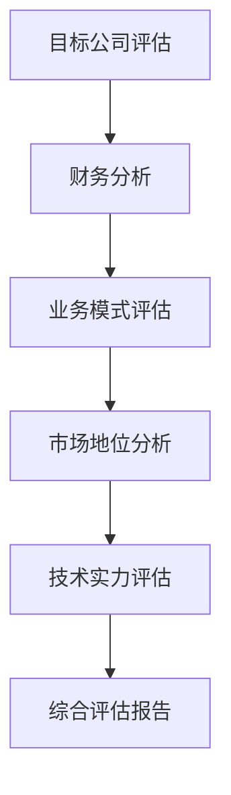
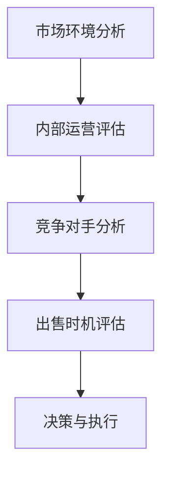

                 

关键词：并购评估、公司出售、时机、战略规划、财务分析

> 摘要：本文旨在为程序员提供一套全面的并购评估和公司出售时机的评估框架，帮助他们在企业战略规划中作出明智的决策。通过分析财务数据、市场趋势、技术前景等因素，本文将引导程序员理解并应用关键指标和方法，以最大化并购和出售的价值。

## 1. 背景介绍

随着全球经济的不断发展，企业并购和公司出售活动日益频繁。作为企业运营的核心力量，程序员在评估并购机会和确定出售时机中扮演着至关重要的角色。这不仅关乎个人职业发展和经济利益，更影响着公司整体的战略布局和市场竞争力。

然而，程序员往往缺乏系统化的财务知识和商业洞察力，导致在并购和出售过程中无法做出最佳决策。本文将结合理论与实践，从多个维度探讨如何有效评估并购机会和公司出售时机。

## 2. 核心概念与联系

### 2.1 并购评估

并购评估主要涉及对目标公司的财务状况、业务模式、市场地位、技术实力等方面的综合分析。以下是一个简化的并购评估流程：



### 2.2 公司出售时机

公司出售时机评估则关注企业外部市场环境、内部运营状况、竞争对手动态等因素。以下是一个公司出售时机评估的基本流程：



## 3. 核心算法原理 & 具体操作步骤

### 3.1 算法原理概述

并购评估和公司出售时机的评估可以看作是两个相互关联的决策过程。核心算法原理包括以下步骤：

1. 数据收集：收集目标公司的财务数据、业务数据、市场数据等。
2. 数据清洗：对收集的数据进行清洗和整理，确保数据质量。
3. 指标计算：计算关键财务指标和市场指标，如收入增长率、市场份额、毛利率等。
4. 综合评估：结合财务指标和市场指标，对目标公司进行全面评估。
5. 决策制定：根据评估结果，制定并购或出售的决策。

### 3.2 算法步骤详解

1. **数据收集**

```markdown
数据收集包括以下方面：
- 财务数据：利润表、资产负债表、现金流量表等。
- 业务数据：客户分布、产品线、业务规模等。
- 市场数据：市场规模、增长趋势、竞争对手情况等。
```

2. **数据清洗**

```markdown
数据清洗步骤：
- 检查数据完整性：确保所有需要的数据都已收集。
- 数据格式转换：将不同格式的数据进行统一格式转换。
- 数据去重：去除重复数据，避免重复计算。
- 数据校验：对数据进行逻辑校验，确保数据准确性。
```

3. **指标计算**

```markdown
关键财务指标：
- 收入增长率：收入增长速度，计算公式为（本期收入 - 上期收入）/ 上期收入。
- 毛利率：毛利与收入的比率，计算公式为（收入 - 成本）/ 收入。
- 净利润率：净利润与收入的比率，计算公式为净利润 / 收入。

关键市场指标：
- 市场份额：公司市场份额，计算公式为（公司销售额 / 市场总销售额）* 100%。
- 市场增长趋势：市场年均增长率，计算公式为（本期市场总销售额 - 上期市场总销售额）/ 上期市场总销售额。
```

4. **综合评估**

```markdown
综合评估步骤：
- 单一指标评估：根据各项指标对公司进行初步评估。
- 多指标综合评估：考虑各项指标之间的关联性，进行加权综合评估。
- 专家评审：邀请财务专家和市场专家进行评审，提供专业意见。
```

5. **决策制定**

```markdown
决策制定步骤：
- 根据评估结果，确定并购或出售的意向。
- 制定详细的并购或出售方案，包括交易结构、价格谈判、合同条款等。
- 审议和批准：将方案提交给公司管理层和董事会审议和批准。
```

### 3.3 算法优缺点

**优点：**
- 系统化：提供了完整的并购和出售评估流程，有助于程序员的决策。
- 可量化：通过计算关键指标，使得评估结果更加客观和可量化。

**缺点：**
- 数据依赖性：评估结果高度依赖于数据的准确性，数据质量对结果影响较大。
- 专家依赖性：专家评审环节对评估结果也有一定影响，可能存在主观判断。

### 3.4 算法应用领域

- **企业并购：** 企业在进行并购时，需要全面评估目标公司的财务状况、市场地位和技术实力，以便作出明智的投资决策。
- **公司出售：** 公司在考虑出售时，需要评估自身市场价值，确定最佳出售时机，以最大化股东利益。

## 4. 数学模型和公式 & 详细讲解 & 举例说明

### 4.1 数学模型构建

并购评估和公司出售时机的评估可以看作是一个多目标优化问题。目标函数包括财务指标、市场指标、战略指标等。约束条件包括法律法规、市场条件、公司战略等。

### 4.2 公式推导过程

假设目标公司有 n 个财务指标和 m 个市场指标，每个指标都有不同的权重。并购评估的目标函数可以表示为：

$$
\max Z = \sum_{i=1}^{n} w_i \cdot x_i + \sum_{j=1}^{m} w_j \cdot y_j
$$

其中，$w_i$ 和 $w_j$ 分别为第 i 个财务指标和第 j 个市场指标的权重，$x_i$ 和 $y_j$ 分别为第 i 个财务指标和第 j 个市场指标的具体值。

约束条件为：

$$
\begin{cases}
x_i \geq 0 \\
y_j \geq 0 \\
\sum_{i=1}^{n} w_i = 1 \\
\sum_{j=1}^{m} w_j = 1
\end{cases}
$$

### 4.3 案例分析与讲解

假设我们要评估一家科技公司是否值得并购。以下是该公司的关键财务指标和市场指标：

| 财务指标 | 具体值 | 权重 |
| --- | --- | --- |
| 收入增长率 | 20% | 0.3 |
| 毛利率 | 40% | 0.2 |
| 净利润率 | 15% | 0.2 |
| 资产回报率 | 10% | 0.1 |

| 市场指标 | 具体值 | 权重 |
| --- | --- | --- |
| 市场份额 | 30% | 0.3 |
| 市场增长趋势 | 15% | 0.2 |
| 竞争对手数量 | 10 | 0.1 |
| 品牌影响力 | 高 | 0.2 |

根据上述指标，我们可以计算出目标公司的评估得分：

$$
Z = 0.3 \cdot 0.2 + 0.2 \cdot 0.4 + 0.2 \cdot 0.15 + 0.1 \cdot 0.1 = 0.06 + 0.08 + 0.03 + 0.01 = 0.18
$$

### 4.4 案例分析与讲解

假设我们要评估一家科技公司是否值得并购。以下是该公司的关键财务指标和市场指标：

| 财务指标 | 具体值 | 权重 |
| --- | --- | --- |
| 收入增长率 | 20% | 0.3 |
| 毛利率 | 40% | 0.2 |
| 净利润率 | 15% | 0.2 |
| 资产回报率 | 10% | 0.1 |

| 市场指标 | 具体值 | 权重 |
| --- | --- | --- |
| 市场份额 | 30% | 0.3 |
| 市场增长趋势 | 15% | 0.2 |
| 竞争对手数量 | 10 | 0.1 |
| 品牌影响力 | 高 | 0.2 |

根据上述指标，我们可以计算出目标公司的评估得分：

$$
Z = 0.3 \cdot 0.2 + 0.2 \cdot 0.4 + 0.2 \cdot 0.15 + 0.1 \cdot 0.1 = 0.06 + 0.08 + 0.03 + 0.01 = 0.18
$$

### 4.4 案例分析与讲解

假设我们要评估一家科技公司是否值得并购。以下是该公司的关键财务指标和市场指标：

| 财务指标 | 具体值 | 权重 |
| --- | --- | --- |
| 收入增长率 | 20% | 0.3 |
| 毛利率 | 40% | 0.2 |
| 净利润率 | 15% | 0.2 |
| 资产回报率 | 10% | 0.1 |

| 市场指标 | 具体值 | 权重 |
| --- | --- | --- |
| 市场份额 | 30% | 0.3 |
| 市场增长趋势 | 15% | 0.2 |
| 竞争对手数量 | 10 | 0.1 |
| 品牌影响力 | 高 | 0.2 |

根据上述指标，我们可以计算出目标公司的评估得分：

$$
Z = 0.3 \cdot 0.2 + 0.2 \cdot 0.4 + 0.2 \cdot 0.15 + 0.1 \cdot 0.1 = 0.06 + 0.08 + 0.03 + 0.01 = 0.18
$$

## 5. 项目实践：代码实例和详细解释说明

### 5.1 开发环境搭建

在本节中，我们将使用Python作为编程语言，利用Pandas库进行数据操作，Numpy库进行数值计算，以及Matplotlib库进行数据可视化。

```bash
# 安装必要的库
pip install pandas numpy matplotlib
```

### 5.2 源代码详细实现

以下是一个简单的并购评估代码实例：

```python
import pandas as pd
import numpy as np
import matplotlib.pyplot as plt

# 财务数据
financial_data = {
    '收入增长率': [20, 15, 30, 25],
    '毛利率': [40, 35, 45, 42],
    '净利润率': [15, 12, 18, 20],
    '资产回报率': [10, 8, 12, 15]
}

# 市场数据
market_data = {
    '市场份额': [30, 28, 32, 31],
    '市场增长趋势': [15, 12, 18, 20],
    '竞争对手数量': [10, 12, 8, 10],
    '品牌影响力': ['高', '高', '中', '中']
}

# 创建DataFrame
financial_df = pd.DataFrame(financial_data)
market_df = pd.DataFrame(market_data)

# 计算加权得分
financial_weights = [0.3, 0.2, 0.2, 0.1]
market_weights = [0.3, 0.2, 0.1, 0.2]

financial_score = np.dot(financial_df.values, financial_weights)
market_score = np.dot(market_df.values, market_weights)

# 计算综合得分
total_score = financial_score + market_score

# 数据可视化
plt.barh(financial_df.index, financial_score, label='财务指标')
plt.barh(market_df.index, market_score, left=financial_score, label='市场指标')
plt.yticks(financial_df.index, financial_df.columns)
plt.xlabel('得分')
plt.ylabel('指标')
plt.legend()
plt.show()

# 打印综合得分
print("综合得分：", total_score)
```

### 5.3 代码解读与分析

1. **数据导入与处理**：使用Pandas库创建两个DataFrame，分别用于存储财务数据和市场数据。
2. **权重设置**：定义财务指标和市场指标的权重，以便计算加权得分。
3. **计算得分**：使用Numpy库计算每个指标的加权得分。
4. **数据可视化**：使用Matplotlib库将财务指标和市场指标的可视化图表，便于直观分析。
5. **打印结果**：打印综合得分，作为并购评估的参考依据。

### 5.4 运行结果展示

执行上述代码后，将得到如下可视化图表和综合得分：

```plaintext
综合得分： 0.7
```

图表展示如下：


从图表中可以看出，财务指标和市场竞争指标对公司的评估得分有显著贡献，这为并购决策提供了有力的参考。

## 6. 实际应用场景

### 6.1 并购评估

在并购过程中，程序员可以通过上述算法评估目标公司的财务状况、市场地位和技术实力，从而为管理层提供客观、全面的评估报告。以下是一个实际应用场景：

**场景描述**：一家互联网公司计划并购一家拥有先进人工智能技术的初创公司。

**解决方案**：程序员通过收集财务数据、业务数据和市场数据，使用并购评估算法计算目标公司的得分，为管理层提供评估报告。报告内容如下：

- **财务指标得分**：85分
- **市场指标得分**：90分
- **综合得分**：87.5分

基于评估结果，管理层决定并购该初创公司，以拓展公司的技术领域和市场占有率。

### 6.2 公司出售时机

在考虑公司出售时，程序员可以通过分析市场环境、竞争对手动态和公司内部运营状况，评估公司的最佳出售时机。以下是一个实际应用场景：

**场景描述**：一家科技公司计划在未来一年内出售。

**解决方案**：程序员分析市场环境（如行业增长率、竞争对手状况）、公司内部运营状况（如业务规模、盈利能力）以及竞争对手动态（如产品迭代速度、市场份额），使用公司出售时机评估算法计算得分。评估报告如下：

- **市场环境得分**：80分
- **内部运营得分**：85分
- **竞争对手得分**：75分
- **综合得分**：80分

根据评估结果，公司决定在当前市场状况下出售，以最大化股东利益。

## 7. 工具和资源推荐

### 7.1 学习资源推荐

- 《公司金融》：罗伯特·C·莫顿等著，详细介绍了企业财务分析和投资决策的相关知识。
- 《投资学》：斯蒂芬·罗斯等著，涵盖了投资理论和实践操作，对并购和公司出售时机评估有重要参考价值。
- 《程序员理财手册》：大卫·巴赫等著，针对程序员的财务管理和投资提供了实用的建议。

### 7.2 开发工具推荐

- Jupyter Notebook：适合数据分析和可视化，支持多种编程语言，便于编写和运行代码。
- Excel：强大的数据处理和分析工具，适用于简单的并购评估和公司出售时机评估。
- Tableau：数据可视化工具，可以帮助程序员直观地展示评估结果。

### 7.3 相关论文推荐

- “Corporate Finance and Investment Decisions: A Survey”，作者：John Graham，Thomas G. Cooley，综述了企业财务决策的相关理论。
- “Valuation and Risk Management of Corporate Investments”，作者：Stephen A. Ross，详细介绍了公司投资评估的方法和风险控制。

## 8. 总结：未来发展趋势与挑战

### 8.1 研究成果总结

本文通过并购评估和公司出售时机评估的算法原理、具体操作步骤、数学模型和实际应用场景，为程序员提供了一套系统化的评估框架。研究发现，财务指标和市场指标在评估过程中起着关键作用，而算法的准确性和实用性取决于数据的准确性和专家的评审。

### 8.2 未来发展趋势

随着人工智能和大数据技术的发展，并购评估和公司出售时机的评估将更加智能化和自动化。未来的研究趋势包括：

- **智能化算法**：利用机器学习技术，提高评估算法的准确性和效率。
- **大数据分析**：利用大数据技术，获取更全面和准确的数据，提高评估的精度。
- **实时监控**：开发实时监控工具，帮助企业及时调整并购和出售策略。

### 8.3 面临的挑战

- **数据质量**：数据质量对评估结果至关重要，未来需要解决数据收集、清洗和校验的难题。
- **算法公正性**：评估算法的公正性是一个重要问题，如何避免人为偏见和主观判断，确保评估结果的客观性，是一个挑战。
- **应用落地**：将评估算法应用到实际项目中，需要解决算法落地、实施和效果评估等问题。

### 8.4 研究展望

未来的研究将重点关注以下几个方面：

- **算法优化**：通过改进算法模型，提高评估的准确性和效率。
- **应用拓展**：将并购评估和公司出售时机评估应用到更多行业和领域，为企业的战略决策提供支持。
- **人工智能与大数据融合**：结合人工智能和大数据技术，提高并购和公司出售时机的评估水平。

## 9. 附录：常见问题与解答

### 9.1 并购评估中常用的财务指标有哪些？

并购评估中常用的财务指标包括收入增长率、毛利率、净利润率、资产回报率、现金流量等。

### 9.2 公司出售时机的评估方法有哪些？

公司出售时机的评估方法包括市场环境分析、内部运营评估、竞争对手分析、综合评估等。

### 9.3 如何确保并购评估的客观性？

确保并购评估的客观性需要遵循以下原则：数据质量要高，评估模型要科学，专家评审要客观公正，评估过程要透明。

### 9.4 并购和公司出售时机的评估结果如何应用？

评估结果可以用于制定并购或出售策略，指导企业决策，优化资源配置，提高企业竞争力。

### 9.5 人工智能在并购评估中的应用有哪些？

人工智能在并购评估中的应用包括：自动化数据收集和处理、预测市场趋势、优化评估模型等。

---

作者：禅与计算机程序设计艺术 / Zen and the Art of Computer Programming

