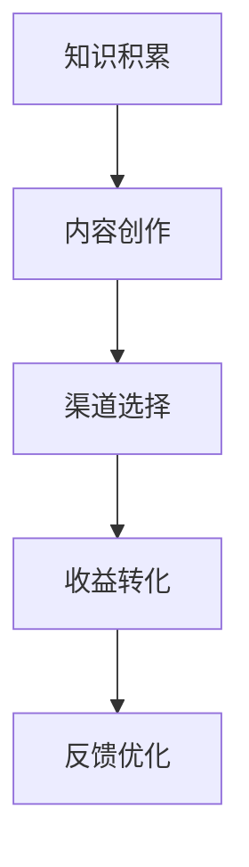
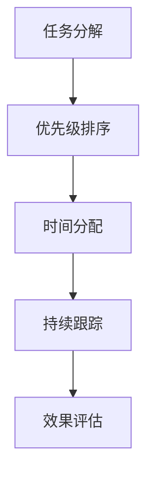

                 

关键词：知识变现、时间管理、程序员、高效编程、生产力提升、个人品牌建设

摘要：在快速发展的技术时代，程序员面临着知识更新的压力和项目时间管理的挑战。本文将探讨如何通过高效的时间管理和知识变现策略，提高程序员的个人品牌价值，实现职业成长。

## 1. 背景介绍

### 1.1 程序员面临的挑战

- **知识更新迅速**：技术领域的快速发展要求程序员不断学习新技能。
- **项目时间压力**：项目截止日期的紧迫性常常导致加班现象。
- **个人品牌的重要性**：个人品牌的建立对于职业发展至关重要。

### 1.2 知识变现与时间管理的关系

- **知识变现**：将个人知识和技能转化为经济收益。
- **时间管理**：合理安排时间，最大化工作效率。

## 2. 核心概念与联系

### 2.1 知识变现

**定义**：知识变现是指将个人的知识、经验和技能通过多种渠道（如出版书籍、开设在线课程、撰写技术博客等）转化为经济收益。

**流程**：



### 2.2 时间管理

**定义**：时间管理是指通过合理安排时间，提高工作效率，达到既定目标。

**流程**：



### 2.3 知识变现与时间管理的关系

- **相互促进**：高效的时间管理有助于知识变现的顺利进行，反之亦然。
- **整合策略**：将知识变现的目标融入日常的时间管理中，实现共赢。

## 3. 核心算法原理 & 具体操作步骤

### 3.1 算法原理概述

**核心算法**：时间管理算法 + 知识变现策略

**原理**：

- 通过时间管理算法，合理安排工作和学习时间。
- 将知识变现目标融入时间管理计划中，确保持续的知识积累和内容创作。

### 3.2 算法步骤详解

#### 3.2.1 任务分解

- **步骤**：将大任务分解为小任务，明确每个小任务的目标和完成时间。
- **工具**：使用任务管理工具（如Trello、Asana等）进行任务分解和跟踪。

#### 3.2.2 优先级排序

- **步骤**：根据任务的重要性和紧急性进行优先级排序。
- **工具**：使用优先级矩阵（如Eisenhower矩阵）进行任务优先级评估。

#### 3.2.3 时间分配

- **步骤**：将时间分配给每个任务，确保任务的按时完成。
- **工具**：使用时间块规划（Time Blocking）方法，将时间块分配给不同任务。

#### 3.2.4 持续跟踪

- **步骤**：定期检查任务进度，调整时间分配和优先级。
- **工具**：使用项目管理工具进行持续跟踪和进度更新。

#### 3.2.5 效果评估

- **步骤**：对时间管理效果进行评估，识别改进空间。
- **工具**：使用KPI（关键绩效指标）进行效果评估。

### 3.3 算法优缺点

#### 优点：

- 提高工作效率，减少加班时间。
- 有助于知识积累和内容创作。
- 促进个人品牌建设。

#### 缺点：

- 初始设定和调整可能需要一定时间。
- 对于自我管理能力要求较高。

### 3.4 算法应用领域

- **软件开发**：项目管理和任务调度。
- **技术写作**：内容创作和发布管理。
- **在线教育**：课程开发和销售管理。

## 4. 数学模型和公式 & 详细讲解 & 举例说明

### 4.1 数学模型构建

**目标函数**：最大化知识变现收益。

$$
\max \sum_{i=1}^{n} R_i \times T_i
$$

其中，\( R_i \) 表示第 \( i \) 个任务的知识变现收益，\( T_i \) 表示完成第 \( i \) 个任务所需时间。

**约束条件**：

- 总时间 \( T_{total} \) 应满足：\( \sum_{i=1}^{n} T_i \leq T_{total} \)
- 任务优先级 \( P_i \) 应满足：\( P_i \geq P_{i+1} \)（对于 \( i < n \)）

### 4.2 公式推导过程

**推导**：

1. **收益计算**：

   对于每个任务 \( i \)，收益 \( R_i \) 可以表示为：

   $$
   R_i = F_i \times S_i
   $$

   其中，\( F_i \) 表示第 \( i \) 个任务的完成率，\( S_i \) 表示第 \( i \) 个任务的市场价值。

2. **时间计算**：

   假设每个任务所需时间 \( T_i \) 为：

   $$
   T_i = \frac{E_i}{C_i}
   $$

   其中，\( E_i \) 表示第 \( i \) 个任务的总工作量，\( C_i \) 表示第 \( i \) 个任务的日工作量。

3. **目标函数**：

   将 \( R_i \) 和 \( T_i \) 代入目标函数：

   $$
   \max \sum_{i=1}^{n} (F_i \times S_i) \times \frac{E_i}{C_i}
   $$

   由于 \( F_i \) 和 \( S_i \) 为常数，可以将它们提取到求和符号外：

   $$
   \max \sum_{i=1}^{n} \left( \frac{S_i}{C_i} \times E_i \right) \times F_i
   $$

   最终得到：

   $$
   \max \sum_{i=1}^{n} R_i \times T_i
   $$

### 4.3 案例分析与讲解

**案例**：一位程序员希望通过编写技术博客实现知识变现。

- **收益计算**：

  假设每篇文章的变现收益为 100 美元，完成率为 70%，市场价值为 1000 美元。

  $$
  R_i = 0.7 \times 1000 = 700 \text{ 美元}
  $$

- **时间计算**：

  假设每篇文章的编写时间为 5 小时，日工作量为 8 小时。

  $$
  T_i = \frac{5}{8} = 0.625 \text{ 小时}
  $$

- **目标函数**：

  将 \( R_i \) 和 \( T_i \) 代入目标函数：

  $$
  \max \sum_{i=1}^{n} 700 \times 0.625
  $$

  为了最大化收益，需要合理安排时间，确保完成更多的文章。

## 5. 项目实践：代码实例和详细解释说明

### 5.1 开发环境搭建

- **工具**：使用 Jupyter Notebook 作为开发环境。
- **依赖**：安装 Python 3.8 和相关库（如 Pandas、NumPy、Matplotlib）。

### 5.2 源代码详细实现

```python
import pandas as pd
import numpy as np
import matplotlib.pyplot as plt

# 任务数据
tasks = pd.DataFrame({
    'ID': [1, 2, 3, 4],
    'Description': ['Task 1', 'Task 2', 'Task 3', 'Task 4'],
    'Completion Rate': [0.7, 0.8, 0.6, 0.75],
    'Market Value': [1000, 1500, 800, 1200],
    'Time Required': [5, 7, 6, 4],
    'Daily Workload': [8, 8, 8, 8]
})

# 计算收益
tasks['Revenue'] = tasks['Completion Rate'] * tasks['Market Value']

# 计算时间
tasks['Time Required Per Day'] = tasks['Time Required'] / tasks['Daily Workload']

# 目标函数
tasks['Total Revenue'] = tasks['Revenue'] * tasks['Time Required Per Day']

# 排序
tasks_sorted = tasks.sort_values(by='Total Revenue', ascending=False)

# 可视化
plt.figure(figsize=(10, 6))
tasks_sorted['Total Revenue'].plot(kind='bar', color='skyblue')
plt.xlabel('Task ID')
plt.ylabel('Total Revenue')
plt.title('Task Revenue Optimization')
plt.show()
```

### 5.3 代码解读与分析

- **数据准备**：使用 Pandas 创建任务数据表，包括任务ID、描述、完成率、市场价值、所需时间和日工作量。
- **收益计算**：计算每个任务的收益。
- **时间计算**：计算每个任务每天所需的时间。
- **目标函数**：计算每个任务的总收益。
- **排序与可视化**：根据总收益对任务进行排序，并使用 Matplotlib 可视化结果。

## 6. 实际应用场景

### 6.1 技术博客写作

**案例**：一位程序员通过编写技术博客实现知识变现。

- **目标**：在一年内撰写并发布 50 篇技术博客。
- **收益**：每篇文章变现收益为 100 美元。
- **时间管理**：每周安排 10 小时用于博客写作。

### 6.2 在线教育课程开发

**案例**：一位程序员通过开发在线教育课程实现知识变现。

- **目标**：在一年内开发并发布 10 门在线教育课程。
- **收益**：每门课程变现收益为 500 美元。
- **时间管理**：每月安排 20 天，每天 4 小时用于课程开发。

## 7. 工具和资源推荐

### 7.1 学习资源推荐

- **在线课程**：Coursera、Udemy、edX 提供丰富的技术课程。
- **技术博客**：Medium、Dev.to、Hashnode 等平台分享高质量技术内容。

### 7.2 开发工具推荐

- **任务管理工具**：Trello、Asana、JIRA。
- **代码编辑器**：Visual Studio Code、Atom、Sublime Text。

### 7.3 相关论文推荐

- **知识变现**："Knowledge Monetization: An Emerging Concept in the Digital Age"
- **时间管理**："Time Management for Personal and Professional Success"

## 8. 总结：未来发展趋势与挑战

### 8.1 研究成果总结

- **知识变现**：技术博客、在线课程等渠道逐渐成为程序员知识变现的重要手段。
- **时间管理**：合理的时间管理策略有助于提高工作效率和知识积累。

### 8.2 未来发展趋势

- **个性化时间管理**：结合人工智能和大数据分析，实现更精准的时间管理。
- **知识变现渠道多样化**：拓展新的知识变现渠道，如知识付费、知识分享等。

### 8.3 面临的挑战

- **时间分配**：如何在日常工作中平衡知识变现和时间管理。
- **个人品牌建设**：如何提升个人品牌价值，吸引更多关注和收益。

### 8.4 研究展望

- **跨领域融合**：将时间管理和知识变现与其他领域（如项目管理、市场推广等）结合。
- **技术创新**：利用新技术（如区块链、人工智能等）提升知识变现效率。

## 9. 附录：常见问题与解答

### 9.1 知识变现渠道有哪些？

- 技术博客、在线课程、电子书、知识付费问答等。

### 9.2 如何合理安排时间？

- 制定明确的目标和计划。
- 使用任务管理工具进行任务分解和跟踪。
- 优先处理重要和紧急的任务。

### 9.3 如何提高个人品牌价值？

- 制作专业的个人网站或博客。
- 参与社区活动，分享技术心得。
- 维护良好的社交媒体形象。

作者：禅与计算机程序设计艺术 / Zen and the Art of Computer Programming
----------------------------------------------------------------

以上就是关于《程序员的知识变现时间管理》的文章，如果您有其他问题或需要进一步讨论，请随时提问。

