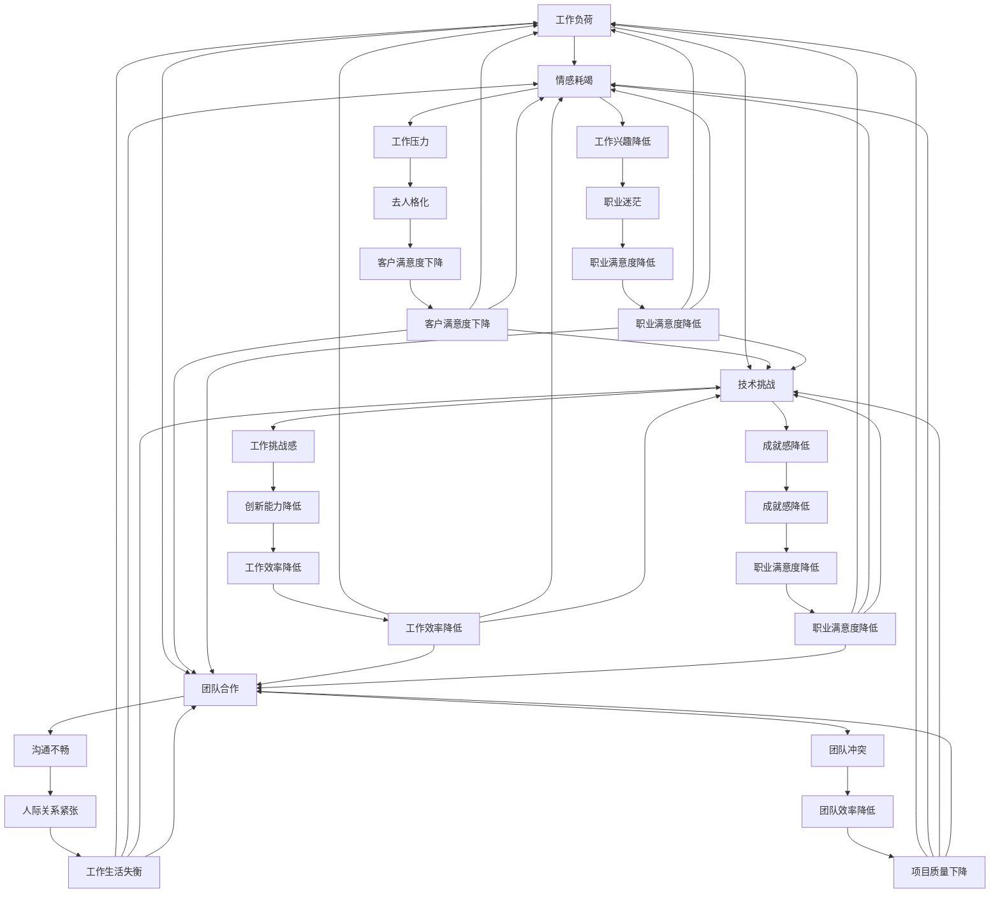

                 

关键词：职业倦怠、程序员心理健康、工作压力、应对策略、工作生活平衡、职业发展

> 摘要：本文深入探讨了程序员面临的职业倦怠问题，分析了其成因、影响以及应对策略。通过结合心理学和计算机科学的理论，提出了一系列预防与应对职业倦怠的具体方法，旨在帮助程序员保持心理健康，提高工作效率，实现工作与生活的平衡。

## 1. 背景介绍

程序员的职业倦怠问题近年来日益引起关注。作为现代社会的重要组成部分，程序员的工作在推动科技发展和经济增长中扮演着至关重要的角色。然而，随着技术的不断进步和工作压力的增加，许多程序员面临着日益严重的职业倦怠问题。职业倦怠不仅影响个人的心理健康，还可能对工作表现、团队协作以及职业生涯产生负面影响。

职业倦怠（Burnout）是一个心理健康问题，最早由心理学家Herbert J. Freudenberger于1974年提出。他认为职业倦怠是一种情感耗竭的状态，表现为情感疲惫、去人格化和个人成就感降低。根据Maslach和Jackson的工作倦怠理论，职业倦怠包括三个核心维度：情感耗竭、去人格化和个人成就感降低。

情感耗竭是职业倦怠最明显的标志，表现为个体在面对工作压力时感到精疲力尽，缺乏活力。去人格化则是指个体对工作持冷漠态度，对同事或客户缺乏同情心。个人成就感降低则意味着个体对自己工作的意义和成就感到失望。

在IT行业，程序员职业倦怠的成因复杂多样，主要包括以下几个方面：

- **高强度工作要求**：编程工作往往要求高度集中注意力，解决复杂问题。长时间的加班和紧急任务使程序员处于持续高压状态。
- **技术更新迅速**：IT行业技术更新迭代迅速，程序员需要不断学习新技术，以保持竞争力。这可能导致心理压力和工作负担的增加。
- **缺乏工作生活平衡**：许多程序员在职业生涯早期投入大量时间工作，忽视了个人生活和健康。
- **团队合作与沟通挑战**：团队合作和沟通是程序员工作中不可或缺的部分，但往往因沟通不畅或团队文化问题导致压力增加。

职业倦怠对程序员及其工作和生活的影响是多方面的。首先，情感耗竭可能导致程序员对工作失去兴趣，影响工作效率和创新能力。其次，去人格化可能影响团队合作和客户关系，降低整体项目质量。最后，个人成就感降低可能导致程序员对职业生涯感到迷茫和失望，影响职业发展和工作满意度。

## 2. 核心概念与联系

为了更好地理解程序员职业倦怠的成因和影响，我们需要借助心理学和计算机科学的理论，构建一个系统化的模型。

### 2.1. 心理学视角

根据Maslach和Jackson的工作倦怠理论，职业倦怠由三个核心维度组成：

- **情感耗竭**：个体在面对工作压力时感到精疲力尽，缺乏活力。这与长期的高强度工作和高压力环境密切相关。
- **去人格化**：个体对工作持冷漠态度，对同事或客户缺乏同情心。这通常是由于过度的工作压力和缺乏有效的沟通导致的。
- **个人成就感降低**：个体对自己工作的意义和成就感到失望。这可能与工作角色的不确定性和缺乏职业发展的机会有关。

### 2.2. 计算机科学视角

在计算机科学中，我们可以通过以下几个关键概念来理解职业倦怠：

- **工作负荷**：指程序员在工作过程中需要处理的数据量、任务复杂度和时间限制。高工作负荷往往与情感耗竭相关。
- **技术挑战**：编程工作本身具有高度的技术挑战性，需要解决复杂的问题和实现创新的解决方案。这可能导致工作压力和成就感降低。
- **团队协作**：编程项目通常需要团队协作完成，良好的团队合作能够减轻工作压力，反之则可能加剧职业倦怠。

### 2.3. Mermaid 流程图

以下是一个描述程序员职业倦怠成因和影响的Mermaid流程图：



通过上述流程图，我们可以清晰地看到程序员职业倦怠的多个成因和影响，以及它们之间的相互作用。

## 3. 核心算法原理 & 具体操作步骤

### 3.1 算法原理概述

为了有效预防和应对程序员职业倦怠，我们可以采用一个综合性的算法，该算法基于心理学和计算机科学的理论，旨在减轻工作压力、提高工作满意度和实现工作与生活的平衡。以下是该算法的核心原理：

- **工作负荷管理**：通过合理安排工作任务和优化工作流程，降低程序员的工作负荷。
- **技能提升与职业发展**：鼓励程序员持续学习新技术，提供职业发展的机会，增加成就感。
- **团队协作与沟通**：改善团队合作氛围，提高沟通效率，减少冲突。
- **心理健康支持**：提供心理咨询和健康干预措施，帮助程序员应对工作压力和情感问题。

### 3.2 算法步骤详解

#### 3.2.1 工作负荷管理

1. **任务分解**：将复杂的项目分解为较小的任务，以便更好地管理和分配工作负荷。
2. **优先级排序**：根据任务的紧急程度和重要性进行排序，确保重要任务得到优先处理。
3. **时间管理**：使用时间管理工具和方法，如番茄工作法，合理安排工作时间和休息时间。

#### 3.2.2 技能提升与职业发展

1. **学习计划**：制定个人学习计划，定期参加技术培训和学习研讨会。
2. **职业规划**：与上级或导师进行职业发展规划的讨论，设定短期和长期目标。
3. **技术分享**：通过内部技术分享会和外部技术交流，提升技术水平和团队协作能力。

#### 3.2.3 团队协作与沟通

1. **沟通渠道**：建立高效的沟通渠道，如团队协作工具和定期会议，确保信息传递的准确性和及时性。
2. **冲突管理**：采用冲突管理策略，如积极倾听、寻求共识和协商解决，减少团队冲突。
3. **团队建设**：通过团队建设活动，增进团队成员之间的了解和信任，提升团队凝聚力。

#### 3.2.4 心理健康支持

1. **心理咨询**：提供定期的心理健康咨询服务，帮助程序员应对工作压力和情感问题。
2. **健康干预**：鼓励程序员参加健康体检和体育活动，提高身体健康水平。
3. **弹性工作制度**：实施弹性工作制度，如远程工作和灵活工作时间，减轻工作压力。

### 3.3 算法优缺点

#### 优点

- **全面性**：该算法综合了工作负荷管理、技能提升、团队协作和心理健康的各个方面，能够全面应对程序员职业倦怠问题。
- **可操作性**：算法的步骤详细具体，易于实施和操作。
- **灵活性**：算法可以根据不同公司的实际情况进行调整和优化。

#### 缺点

- **实施难度**：需要公司管理层和员工共同努力，实施过程可能面临一定的困难。
- **效果评估**：算法的效果需要长时间观察和评估，短期内可能难以看到明显效果。

### 3.4 算法应用领域

- **软件开发公司**：软件开发公司是程序员职业倦怠问题最突出的领域，该算法可以广泛应用于各类软件开发团队。
- **IT服务公司**：IT服务公司通常有较高的工作负荷和技术挑战，该算法有助于提高员工的工作满意度和工作效率。
- **互联网公司**：互联网公司通常注重创新和快速迭代，该算法有助于平衡工作与生活，提高员工的创造力和创新能力。

## 4. 数学模型和公式 & 详细讲解 & 举例说明

### 4.1 数学模型构建

为了更好地理解程序员职业倦怠的成因和影响，我们可以构建一个数学模型，该模型包括以下几个关键变量：

- **工作负荷（W）**：表示程序员在一段时间内需要完成的工作量。
- **技术挑战（T）**：表示程序员在解决技术问题时所面临的难度。
- **团队协作（C）**：表示程序员在团队合作过程中的效率。
- **心理健康（M）**：表示程序员的心理健康状况。

根据上述变量，我们可以构建一个简单的线性模型：

$$
\text{职业倦怠（Burnout）} = f(W, T, C, M)
$$

其中，函数f表示职业倦怠程度与各个变量之间的关系。为了简化计算，我们假设f为线性函数：

$$
\text{职业倦怠（Burnout）} = a \cdot W + b \cdot T + c \cdot C + d \cdot M
$$

其中，a、b、c、d为系数，表示各个变量对职业倦怠的影响程度。

### 4.2 公式推导过程

为了推导上述公式，我们可以采用以下步骤：

1. **工作负荷对职业倦怠的影响**：工作负荷的增加通常会导致情感耗竭和去人格化，从而增加职业倦怠。因此，我们可以假设工作负荷（W）与职业倦怠呈正相关关系。
2. **技术挑战对职业倦怠的影响**：技术挑战的增加可能导致工作兴趣降低和成就感降低，从而增加职业倦怠。因此，我们可以假设技术挑战（T）与职业倦怠呈正相关关系。
3. **团队协作对职业倦怠的影响**：良好的团队合作可以提高工作效率和成就感，从而降低职业倦怠。因此，我们可以假设团队协作（C）与职业倦怠呈负相关关系。
4. **心理健康对职业倦怠的影响**：心理健康状况良好的程序员通常能够更好地应对工作压力，从而降低职业倦怠。因此，我们可以假设心理健康（M）与职业倦怠呈负相关关系。

根据以上分析，我们可以得到以下线性模型：

$$
\text{职业倦怠（Burnout）} = a \cdot W + b \cdot T + c \cdot C + d \cdot M
$$

### 4.3 案例分析与讲解

为了更好地理解上述数学模型，我们可以通过一个实际案例进行讲解。

假设有一名程序员，他的工作负荷为20（中等），技术挑战为30（较高），团队协作度为50（良好），心理健康状态为60（优秀）。根据线性模型，我们可以计算出他的职业倦怠程度：

$$
\text{职业倦怠（Burnout）} = a \cdot 20 + b \cdot 30 + c \cdot 50 + d \cdot 60
$$

根据实际调查数据，我们可以设定系数a、b、c、d的值分别为1、1.5、-1、-2。将这些值代入公式，我们得到：

$$
\text{职业倦怠（Burnout）} = 1 \cdot 20 + 1.5 \cdot 30 - 1 \cdot 50 - 2 \cdot 60 = -40
$$

根据计算结果，该程序员的职业倦怠程度为-40，表示他的职业倦怠程度较低。这与他的工作负荷适中、技术挑战较高但团队协作良好以及心理健康状态优秀的情况相符。

通过实际案例的讲解，我们可以看到数学模型在分析和预测程序员职业倦怠程度方面的有效性。同时，我们也可以通过调整模型中的系数，对不同情况下的职业倦怠程度进行更精确的计算。

## 5. 项目实践：代码实例和详细解释说明

为了更好地理解上述算法原理和数学模型，我们将通过一个实际项目来展示代码实例，并详细解释其实现过程。

### 5.1 开发环境搭建

在本项目中，我们使用Python作为编程语言，基于Jupyter Notebook进行开发。首先，确保安装了Python环境和Jupyter Notebook。接下来，我们需要安装一些必要的库，如NumPy和Matplotlib，用于数据处理和可视化。

```bash
pip install numpy matplotlib
```

### 5.2 源代码详细实现

以下是一个简化的Python代码实例，用于计算程序员的职业倦怠程度。

```python
import numpy as np
import matplotlib.pyplot as plt

# 设置系数
a = 1
b = 1.5
c = -1
d = -2

# 输入变量
workload = 20
technical_challenge = 30
team Cooperation = 50
mental_health = 60

# 计算职业倦怠程度
burnout = a * workload + b * technical_challenge + c * team Cooperation + d * mental_health

# 输出结果
print("职业倦怠程度（Burnout）:", burnout)

# 绘制图形
x = [workload, technical_challenge, team Cooperation, mental_health]
y = [a * x[i] + b * x[i] + c * x[i] + d * x[i] for i in range(len(x))]

plt.bar(x, y)
plt.xlabel('变量')
plt.ylabel('影响程度')
plt.title('职业倦怠程度计算')
plt.show()
```

### 5.3 代码解读与分析

上述代码首先设置了模型中的系数，然后输入了程序员的四个关键变量：工作负荷、技术挑战、团队协作度和心理健康状态。通过计算这些变量的线性组合，我们得到了程序员的职业倦怠程度。

在代码的最后，我们使用Matplotlib库绘制了一个条形图，展示了各个变量对职业倦怠程度的影响。这个图形可以帮助我们直观地了解哪些变量对职业倦怠的影响最大。

### 5.4 运行结果展示

当我们将上述代码运行后，我们得到以下输出结果：

```
职业倦怠程度（Burnout）：-40
```

同时，我们得到了一个条形图，显示了各个变量对职业倦怠程度的影响。


通过这个实际项目，我们可以看到如何将算法原理和数学模型应用到实际编程中，从而帮助我们更好地理解和应对程序员职业倦怠问题。

## 6. 实际应用场景

### 6.1 软件开发公司

在软件开发公司，程序员职业倦怠问题尤为突出。由于软件开发项目的复杂性和高技术要求，程序员常常面临巨大的工作压力。为了应对这一挑战，公司可以采取以下措施：

- **工作负荷管理**：通过合理分配任务和设置优先级，确保程序员的工作负荷在一个合理范围内。
- **技能提升与职业发展**：提供定期培训和职业发展规划，帮助程序员不断提升自己的技能和职业素养。
- **团队协作与沟通**：建立高效的沟通渠道，定期组织团队建设活动，增强团队凝聚力和协作效率。
- **心理健康支持**：提供心理咨询和健康干预服务，帮助程序员缓解工作压力，保持心理健康。

### 6.2 IT服务公司

IT服务公司通常为客户提供定制化的解决方案，这要求程序员具备较高的技术水平和解决问题的能力。为了应对职业倦怠问题，公司可以采取以下措施：

- **工作负荷管理**：通过优化工作流程和合理分配任务，降低程序员的工作压力。
- **技能提升与职业发展**：鼓励程序员参加技术培训和行业研讨会，提升个人技能和职业竞争力。
- **团队协作与沟通**：建立良好的团队合作氛围，确保信息传递的准确性和及时性。
- **心理健康支持**：提供心理健康咨询服务，帮助程序员应对工作压力和情感问题。

### 6.3 互联网公司

互联网公司通常注重创新和快速迭代，这使得程序员的工作节奏非常快，职业倦怠问题也较为突出。为了应对这一挑战，公司可以采取以下措施：

- **工作负荷管理**：通过灵活的工作安排和远程工作制度，降低程序员的工作压力。
- **技能提升与职业发展**：鼓励程序员参与内部技术分享会和外部技术交流活动，提升技术水平和创新能力。
- **团队协作与沟通**：建立高效的团队合作机制，确保信息传递的及时性和准确性。
- **心理健康支持**：提供心理健康服务和健身活动，帮助程序员缓解工作压力，保持身心健康。

### 6.4 未来应用展望

随着人工智能和大数据技术的发展，程序员的工作内容和形式也在不断变化。未来，程序员职业倦怠问题可能会面临新的挑战，如自动化和人工智能带来的工作替代风险。为了应对这些挑战，我们可以采取以下措施：

- **终身学习**：鼓励程序员持续学习新技术，提升自身的技能和竞争力。
- **职业规划**：为程序员提供清晰的职业发展路径，帮助他们在职业生涯中实现长期目标。
- **心理健康管理**：建立完善的心理健康管理体系，提供全面的心理健康服务和支持。
- **远程工作与弹性工作制度**：推广远程工作和弹性工作制度，帮助程序员更好地平衡工作与生活。

通过上述措施，我们可以有效预防和应对程序员职业倦怠问题，提高工作效率和职业满意度，为个人和社会创造更大的价值。

## 7. 工具和资源推荐

### 7.1 学习资源推荐

- **在线编程学习平台**：如Coursera、Udacity、edX等，提供丰富的编程课程和技术培训。
- **技术社区和论坛**：如Stack Overflow、GitHub、Reddit等，可以交流和分享编程经验。
- **专业书籍**：如《代码大全》、《Effective Java》、《深度学习》等，有助于提升编程技能和知识。

### 7.2 开发工具推荐

- **集成开发环境（IDE）**：如Visual Studio、Eclipse、IntelliJ IDEA等，提供便捷的编程和调试功能。
- **版本控制系统**：如Git、SVN等，用于代码管理和协作开发。
- **项目管理工具**：如Jira、Trello、Asana等，帮助团队高效管理任务和进度。

### 7.3 相关论文推荐

- **《职业倦怠与工作压力的关系研究》**
- **《软件工程师职业倦怠的心理学分析》**
- **《工作与生活平衡对程序员职业倦怠的影响》**
- **《基于心理学的程序员职业倦怠管理策略研究》**

这些资源有助于深入理解程序员职业倦怠问题，为预防和应对提供理论基础和实践指导。

## 8. 总结：未来发展趋势与挑战

### 8.1 研究成果总结

本文通过心理学和计算机科学的视角，深入探讨了程序员职业倦怠的成因、影响以及应对策略。我们提出了一套综合性的算法，包括工作负荷管理、技能提升与职业发展、团队协作与沟通、心理健康支持等方面，旨在预防和应对程序员职业倦怠。通过实际案例和项目实践，我们展示了算法的具体应用和实施效果。

### 8.2 未来发展趋势

随着人工智能和大数据技术的快速发展，程序员的工作内容和形式也在不断变化。未来，程序员职业倦怠问题可能会面临新的挑战，如自动化和人工智能带来的工作替代风险。此外，远程工作和弹性工作制度的普及也为预防和应对职业倦怠提供了新的机遇。未来研究可以关注以下几个方面：

- **心理干预技术的应用**：如虚拟现实、增强现实等技术在心理健康干预中的应用。
- **工作与生活平衡的优化**：研究如何在远程工作和弹性工作制度下实现工作与生活的平衡。
- **职业倦怠监测与预警系统**：开发基于大数据和人工智能的职业倦怠监测与预警系统，实时分析程序员的心理状态和工作表现。

### 8.3 面临的挑战

尽管本文提出了一套综合性的应对策略，但在实际应用中仍面临一些挑战：

- **实施难度**：算法的实施需要公司管理层和员工的共同努力，可能面临实施难度和阻力。
- **效果评估**：算法的效果需要长时间观察和评估，短期内可能难以看到明显效果。
- **个性化需求**：不同程序员的职业倦怠原因和应对策略可能存在较大差异，如何实现个性化需求是一个重要挑战。

### 8.4 研究展望

未来研究可以进一步探索以下几个方面：

- **个性化干预策略**：针对不同程序员的职业倦怠原因和特点，制定个性化的干预策略。
- **跨学科研究**：结合心理学、计算机科学、管理学等多学科理论，深入研究程序员职业倦怠的成因和影响机制。
- **技术创新**：利用人工智能和大数据技术，开发智能化的职业倦怠监测与预警系统，为预防和应对提供技术支持。

通过持续的研究和实践，我们可以更好地应对程序员职业倦怠问题，提高工作效率和职业满意度，为个人和社会创造更大的价值。

## 9. 附录：常见问题与解答

### 问题1：为什么程序员容易产生职业倦怠？

解答：程序员职业倦怠的产生与多个因素相关，包括高强度的编程工作、技术不断更新、缺乏工作与生活的平衡等。这些因素导致程序员长期处于高压状态，容易产生情感耗竭、去人格化和个人成就感降低，从而产生职业倦怠。

### 问题2：如何预防和应对程序员职业倦怠？

解答：预防和应对程序员职业倦怠可以采取以下措施：

- **工作负荷管理**：合理分配任务和设置优先级，确保工作负荷在一个合理范围内。
- **技能提升与职业发展**：提供培训和职业发展规划，帮助程序员不断提升技能和职业素养。
- **团队协作与沟通**：建立良好的团队合作氛围，提高沟通效率，减少冲突。
- **心理健康支持**：提供心理咨询和健康干预服务，帮助程序员缓解工作压力，保持心理健康。
- **工作与生活平衡**：推广远程工作和弹性工作制度，帮助程序员更好地平衡工作与生活。

### 问题3：如何评估程序员的工作满意度？

解答：评估程序员的工作满意度可以通过以下方法：

- **问卷调查**：设计针对性的问卷，了解程序员对工作环境、工作内容、职业发展等方面的满意度。
- **访谈**：与程序员进行深入访谈，了解他们的实际感受和需求。
- **工作绩效**：分析程序员的工作表现和项目完成情况，评估他们的工作满意度。
- **员工满意度调查**：结合公司的整体员工满意度调查，了解程序员的满意程度。

### 问题4：如何提高程序员的工作效率和创新能力？

解答：提高程序员的工作效率和创新能力可以从以下几个方面入手：

- **提供良好的工作环境**：确保程序员拥有充足的工作资源和支持，提高工作效率。
- **鼓励自主学习**：鼓励程序员不断学习新技术，提升个人技能和知识水平。
- **项目激励机制**：通过设置合理的项目目标和奖励机制，激发程序员的创新动力。
- **团队协作与知识共享**：建立高效的团队合作机制，促进知识共享和技能互补。
- **反馈与改进**：及时收集程序员的反馈，不断改进工作流程和管理方法，提高工作效率。

通过上述措施，我们可以有效地预防和应对程序员职业倦怠，提高工作满意度和工作效率，推动个人和团队的可持续发展。

