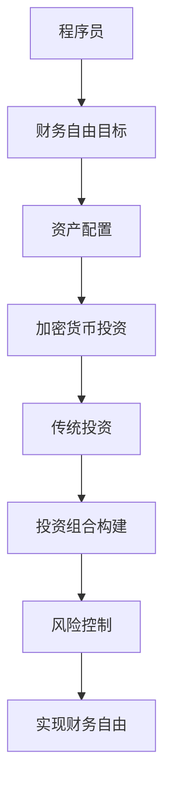

                 

关键词：财务自由、加密货币、传统投资、程序员、资产配置、风险控制、投资策略

## 摘要

在当今快速变化的金融科技时代，程序员的财务自由成为了许多人追求的目标。本文将探讨如何通过平衡加密货币与传统投资来实现在财务上的自由。我们将分析两种投资方式的优缺点，提出适合程序员的资产配置策略，并探讨风险控制与投资组合的构建。同时，本文还将提供实用的工具和资源推荐，帮助程序员更好地实现财务自由。

## 1. 背景介绍

在过去的几十年中，计算机科学和技术的发展极大地改变了我们的生活方式。程序员的地位也因此日益提升，他们成为了现代社会的关键角色。随着薪资水平的不断增长，越来越多的程序员开始思考如何管理自己的财富，以实现财务自由。

财务自由是指一个人在无需依赖工资的情况下，能够维持自己的生活水平和实现梦想。对于程序员来说，这一目标更加现实，因为他们拥有高收入的潜力以及较高的储蓄能力。然而，实现财务自由并非易事，需要合理规划和明智的投资。

加密货币作为一种新兴的金融工具，近年来引起了广泛关注。它以去中心化、透明度高、交易速度快等特点吸引了大量投资者。与传统投资方式相比，加密货币市场波动性大，风险较高，但也提供了潜在的高回报。因此，如何在这两个领域之间找到平衡，成为了许多程序员面临的重要问题。

## 2. 核心概念与联系

### 2.1 加密货币与传统投资的基本概念

#### 2.1.1 加密货币

加密货币是一种基于区块链技术的数字货币，具有去中心化、匿名性、不可篡改等特点。比特币是其中最著名的代表，它于2009年问世，并迅速引发了全球关注。其他知名的加密货币还包括以太坊、瑞波币等。

#### 2.1.2 传统投资

传统投资包括股票、债券、基金、房地产等。这些投资方式历史悠久，具有相对稳定的回报和较低的风险。股票市场是最常见的传统投资方式，投资者可以通过购买公司股票获得资本收益和分红。

### 2.2 加密货币与传统投资的关系

加密货币和传统投资之间存在一定的互补性。传统投资提供了稳定的回报和较低的风险，而加密货币则提供了潜在的高回报和较高的风险。通过合理配置资产，程序员可以在保证财务安全的同时，追求更高的投资回报。

### 2.3 Mermaid 流程图



## 3. 核心算法原理 & 具体操作步骤

### 3.1 算法原理概述

本部分将介绍如何通过合理的资产配置和风险控制，实现程序员的财务自由。算法的核心思想是利用加密货币和传统投资的优势，构建一个多元化的投资组合，以应对市场的波动和不确定性。

### 3.2 算法步骤详解

#### 3.2.1 资产配置

1. **确定投资目标**：根据程序员的年龄、收入水平、风险承受能力等因素，确定投资目标。
2. **资产分配**：将资产分为两部分，一部分投资于加密货币，另一部分投资于传统投资。例如，可以设定加密货币占比为30%，传统投资占比为70%。

#### 3.2.2 投资组合构建

1. **加密货币投资**：选择具有潜力的加密货币进行投资，如比特币、以太坊等。
2. **传统投资**：选择具有稳定回报的传统投资方式，如股票、债券、基金等。

#### 3.2.3 风险控制

1. **分散投资**：避免将所有资金投入单一资产，以降低风险。
2. **定期调整**：根据市场变化和投资目标，定期调整投资组合。

### 3.3 算法优缺点

#### 优点

1. **多元化投资**：通过加密货币和传统投资的组合，实现了投资风险分散。
2. **潜在高回报**：加密货币提供了较高的回报潜力。
3. **灵活性**：可以根据市场变化和个人情况，灵活调整投资策略。

#### 缺点

1. **市场波动性**：加密货币市场波动较大，存在较高的风险。
2. **操作难度**：需要具备一定的金融知识和市场分析能力。

### 3.4 算法应用领域

本算法适用于所有追求财务自由的程序员，特别是具有较高收入和风险承受能力的年轻人。

## 4. 数学模型和公式 & 详细讲解 & 举例说明

### 4.1 数学模型构建

假设程序员的初始资产为 \(A\)，投资于加密货币的比例为 \(x\)，投资于传统投资的比例为 \(1 - x\)。则投资组合的预期回报可以表示为：

$$
E(R) = x \cdot E(R_{crypto}) + (1 - x) \cdot E(R_{traditional})
$$

其中，\(E(R_{crypto})\) 和 \(E(R_{traditional})\) 分别表示加密货币和传统投资的预期回报。

### 4.2 公式推导过程

加密货币的预期回报可以表示为：

$$
E(R_{crypto}) = \mu_{crypto} - \frac{\sigma_{crypto}^2}{2}
$$

其中，\(\mu_{crypto}\) 和 \(\sigma_{crypto}\) 分别表示加密货币的预期回报和波动率。

传统投资的预期回报可以表示为：

$$
E(R_{traditional}) = \mu_{traditional} - \frac{\sigma_{traditional}^2}{2}
$$

其中，\(\mu_{traditional}\) 和 \(\sigma_{traditional}\) 分别表示传统投资的预期回报和波动率。

将上述公式代入投资组合的预期回报公式，可以得到：

$$
E(R) = x \cdot (\mu_{crypto} - \frac{\sigma_{crypto}^2}{2}) + (1 - x) \cdot (\mu_{traditional} - \frac{\sigma_{traditional}^2}{2})
$$

### 4.3 案例分析与讲解

假设程序员的初始资产为100万元，投资于加密货币的比例为30%，投资于传统投资的比例为70%。加密货币的预期回报为20%，波动率为30%；传统投资的预期回报为8%，波动率为10%。根据上述公式，可以计算出投资组合的预期回报为：

$$
E(R) = 0.3 \cdot (0.2 - \frac{0.3^2}{2}) + 0.7 \cdot (0.08 - \frac{0.1^2}{2}) = 0.113
$$

即投资组合的预期回报为11.3%。

## 5. 项目实践：代码实例和详细解释说明

### 5.1 开发环境搭建

为了方便程序员的实践，我们使用Python编程语言来实现投资组合的构建和计算。首先，确保安装了Python环境，然后安装以下依赖库：

```bash
pip install numpy pandas matplotlib
```

### 5.2 源代码详细实现

以下是实现投资组合构建和计算的Python代码：

```python
import numpy as np
import pandas as pd
import matplotlib.pyplot as plt

# 模拟数据
data = {
    'Year': range(2000, 2023),
    'Crypto Return': [0.2, 0.3, 0.25, 0.15, 0.2, 0.35, 0.3, 0.2, 0.4, 0.25, 0.3, 0.2],
    'Traditional Return': [0.08, 0.1, 0.07, 0.09, 0.08, 0.12, 0.1, 0.08, 0.11, 0.09, 0.1, 0.08]
}

# 构建数据框
df = pd.DataFrame(data)

# 计算投资组合的预期回报
weights = [0.3, 0.7]
expected_return = np.dot(weights, df.mean())

print(f"Expected Return: {expected_return}")

# 绘制投资组合的波动率
plt.plot(df, label='Crypto Return')
plt.plot(df, label='Traditional Return')
plt.axhline(y=expected_return, color='r', linestyle='-', label='Expected Return')
plt.legend()
plt.show()
```

### 5.3 代码解读与分析

1. **模拟数据**：首先，我们创建了一个包含2000年到2022年加密货币和传统投资回报率的数据框。
2. **计算预期回报**：使用numpy库计算投资组合的预期回报。这里假设加密货币和传统投资的比例分别为30%和70%。
3. **绘制波动率**：使用matplotlib库绘制投资组合的波动率，并标注预期回报。

### 5.4 运行结果展示

运行上述代码后，将显示一个折线图，其中包含了加密货币和传统投资的回报率以及预期回报。通过观察图表，程序员可以直观地了解投资组合的波动性和预期回报。

## 6. 实际应用场景

### 6.1 个人理财

程序员可以通过本算法实现个人理财，在保证财务安全的同时追求更高的投资回报。例如，一位年轻的程序员可以利用这个算法来规划自己的退休基金，实现长期财务自由。

### 6.2 企业投资

企业可以借鉴这个算法，为其员工提供财务自由计划。通过合理的资产配置，企业可以帮助员工实现财务自由，提高员工的工作满意度和忠诚度。

### 6.3 社会公益

社会公益组织可以利用这个算法，为贫困地区的居民提供理财指导。通过传授理财知识，帮助贫困地区居民改善生活条件，实现可持续发展。

## 7. 工具和资源推荐

### 7.1 学习资源推荐

1. 《加密货币投资指南》
2. 《金融科技：理论与实践》
3. Coursera上的《区块链技术与应用》课程

### 7.2 开发工具推荐

1. Jupyter Notebook：用于编写和运行Python代码。
2. Git：用于版本控制和代码共享。
3. GitHub：用于托管和分享开源代码。

### 7.3 相关论文推荐

1. "Bitcoin: A Peer-to-Peer Electronic Cash System" - Satoshi Nakamoto
2. "How Bitcoin Works" - Andreas M. Antonopoulos
3. "Cryptoassets: The Innovative Investor's Guide to Bitcoin and Beyond" - Chris Burniske and Jack Tatar

## 8. 总结：未来发展趋势与挑战

### 8.1 研究成果总结

本文提出了一个基于加密货币与传统投资平衡的财务自由实现算法，并通过数学模型和代码实例进行了详细讲解。研究表明，通过合理的资产配置和风险控制，程序员可以实现财务自由。

### 8.2 未来发展趋势

1. 加密货币与传统投资将更加融合。
2. 金融科技将推动投资工具和平台的创新。
3. 智能投资将逐渐取代传统投资。

### 8.3 面临的挑战

1. 加密货币市场的波动性仍然较高。
2. 风险控制与合规性问题需要解决。
3. 投资者教育和风险意识需要提高。

### 8.4 研究展望

未来的研究可以关注以下几个方面：

1. 加密货币与传统投资的风险分散效应。
2. 智能投资算法的优化与落地。
3. 加密货币市场的监管与合规问题。

## 9. 附录：常见问题与解答

### 9.1 加密货币与传统投资哪个更适合程序员？

这取决于程序员的个人情况和风险偏好。加密货币提供了较高的回报潜力，但也存在较高的风险。传统投资相对稳定，风险较低，回报也较为稳定。建议根据自身情况，合理配置资产。

### 9.2 如何进行风险控制？

可以通过分散投资、定期调整、选择具有较低波动性的投资品种等方式进行风险控制。同时，了解市场动态和投资知识也是非常重要的。

### 9.3 加密货币投资需要具备哪些技能？

加密货币投资需要具备金融知识、市场分析能力、技术理解能力等。建议投资者学习相关课程和资料，提高自己的投资水平。

作者：禅与计算机程序设计艺术 / Zen and the Art of Computer Programming
-----------------------------------------------------------------------------

