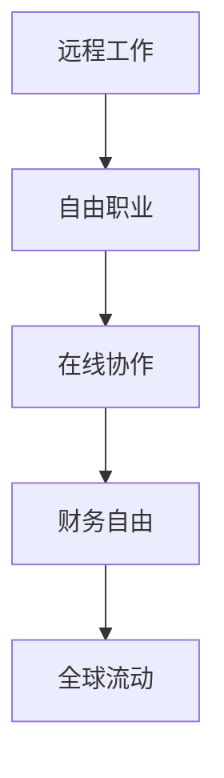

                 

 

> **关键词：** 财务自由、数字游民、程序开发、远程工作、全球流动。

> **摘要：** 本文将探讨程序员的财务自由之路，通过分析数字游民生活的优势，提供实现财务自由的策略和实践案例，帮助程序员迈向全球流动的数字生活。

## 1. 背景介绍

在当今信息化时代，编程技能已成为职场的重要资产。程序员群体庞大，分布广泛，他们通过代码改变了世界，也改变了自身的生活方式。随着互联网和远程工作的普及，越来越多的程序员开始探索数字游民（Digital Nomad）生活方式，追求财务自由和全球流动。

### 数字游民的定义

数字游民是指利用互联网进行工作，不局限于地理位置的灵活性工作者。他们通常在咖啡馆、公园、度假胜地或家中工作，通过远程协作、自由职业、在线咨询等方式实现收入。这种生活方式打破了传统工作场所的限制，为程序员提供了更多选择和自由。

### 数字游民生活的重要性

数字游民生活方式对程序员具有多方面的吸引力：

1. **时间灵活性：** 可以自由安排工作时间，实现工作与生活的平衡。
2. **地理位置自由：** 可以在喜欢的城市或国家居住，享受不同文化氛围。
3. **成本节约：** 远程工作可以节省通勤费用和住房成本。
4. **职业发展：** 通过全球网络拓展职业机会，提高个人品牌价值。

## 2. 核心概念与联系

### 数字游民生活的核心概念

数字游民生活涉及多个核心概念，包括远程工作、自由职业、在线协作等。这些概念相互关联，构成了数字游民生活方式的基础。

### Mermaid 流程图



在这个流程图中，远程工作是数字游民生活的起点，通过自由职业和在线协作，最终实现财务自由和全球流动。

## 3. 核心算法原理 & 具体操作步骤

### 3.1 算法原理概述

实现数字游民生活的关键在于构建稳定的收入来源。这需要程序员具备以下能力：

1. **编程技能：** 提供高质量的代码，满足客户需求。
2. **项目管理：** 有效管理项目进度和质量。
3. **市场拓展：** 拓展客户资源，增加收入来源。

### 3.2 算法步骤详解

#### 3.2.1 提升编程技能

1. **基础知识巩固：** 学习编程语言和框架的基本原理。
2. **实践项目积累：** 参与开源项目或独立项目，提升实际操作能力。
3. **持续学习：** 跟进最新技术动态，不断提高自己的技能水平。

#### 3.2.2 项目管理

1. **需求分析：** 理解客户需求，明确项目目标。
2. **任务分解：** 将项目划分为可管理的任务。
3. **进度监控：** 定期检查项目进度，确保按时交付。

#### 3.2.3 市场拓展

1. **社交媒体宣传：** 利用LinkedIn、GitHub等平台展示自己的技能和项目。
2. **建立个人品牌：** 通过博客、演讲等方式提高个人知名度。
3. **寻找客户：** 通过网络平台寻找潜在客户，拓展业务。

### 3.3 算法优缺点

#### 优点

1. **灵活性高：** 可以自由安排工作和生活时间。
2. **成本节约：** 减少通勤和住房成本。
3. **职业发展：** 提高个人品牌价值，拓展职业机会。

#### 缺点

1. **稳定性要求：** 需要保持高水平的编程技能和项目管理能力。
2. **心理压力：** 自主管理工作可能带来心理压力。
3. **社交隔离：** 长时间远程工作可能导致社交隔离。

### 3.4 算法应用领域

数字游民生活方式适用于多种编程领域，包括前端开发、后端开发、移动应用开发、数据科学等。通过灵活运用编程技能，程序员可以在全球范围内为客户提供高质量的服务。

## 4. 数学模型和公式 & 详细讲解 & 举例说明

### 4.1 数学模型构建

数字游民生活方式的数学模型主要包括以下三个方面：

1. **收入模型：** 收入取决于编程技能、项目质量和客户资源。
2. **成本模型：** 成本包括生活成本、设备维护成本等。
3. **时间模型：** 时间取决于工作时长和休息时间。

### 4.2 公式推导过程

假设程序员的年收入为 \(I\)，年生活成本为 \(C\)，年工作时长为 \(T\)，每小时收入为 \(R\)，则：

1. **收入公式：** \(I = R \times T\)
2. **成本公式：** \(C = C_1 + C_2 + C_3\)
3. **时间公式：** \(T = T_1 + T_2 + T_3\)

其中，\(C_1\)、\(C_2\)、\(C_3\) 分别表示生活成本中的住房、食品、交通等费用；\(T_1\)、\(T_2\)、\(T_3\) 分别表示工作时间、休息时间和假期时间。

### 4.3 案例分析与讲解

#### 案例一：年收入 10 万美元的程序员

假设某程序员的年收入为 10 万美元，年生活成本为 5 万美元，年工作时长为 2000 小时。则：

1. **收入公式：** \(I = R \times T = 10万 \times 2000 = 20 万美元\)
2. **成本公式：** \(C = C_1 + C_2 + C_3 = 5 万美元\)
3. **时间公式：** \(T = T_1 + T_2 + T_3 = 2000 小时\)

通过计算，该程序员的年收入为 20 万美元，年生活成本为 5 万美元，实现财务自由。

#### 案例二：年收入 20 万美元的程序员

假设另一程序员的年收入为 20 万美元，年生活成本为 8 万美元，年工作时长为 2400 小时。则：

1. **收入公式：** \(I = R \times T = 20万 \times 2400 = 48 万美元\)
2. **成本公式：** \(C = C_1 + C_2 + C_3 = 8 万美元\)
3. **时间公式：** \(T = T_1 + T_2 + T_3 = 2400 小时\)

通过计算，该程序员的年收入为 48 万美元，年生活成本为 8 万美元，实现财务自由。

## 5. 项目实践：代码实例和详细解释说明

### 5.1 开发环境搭建

为了实践数字游民生活方式，我们需要搭建一个合适的开发环境。以下是一个简单的步骤：

1. 安装操作系统（如 macOS、Windows 或 Linux）。
2. 安装编程语言（如 Python、JavaScript 或 Java）。
3. 安装代码编辑器（如 Visual Studio Code、Sublime Text 或 Atom）。
4. 安装版本控制系统（如 Git）。
5. 配置远程协作工具（如 Slack、Trello 或 Asana）。

### 5.2 源代码详细实现

以下是一个简单的 Python 代码示例，用于计算程序员的年收入和生活成本：

```python
# 年收入计算
def calculate_annual_income(hours_per_day, days_per_week, weeks_per_year, hourly_rate):
    return hours_per_day * days_per_week * weeks_per_year * hourly_rate

# 年生活成本计算
def calculate_annual_cost(housing_cost, food_cost, transportation_cost):
    return housing_cost + food_cost + transportation_cost

# 时间计算
def calculate_total_time(hours_per_day, days_per_week, weeks_per_year):
    return hours_per_day * days_per_week * weeks_per_year

# 主函数
def main():
    hours_per_day = 8
    days_per_week = 5
    weeks_per_year = 52
    hourly_rate = 100

    housing_cost = 2000
    food_cost = 1000
    transportation_cost = 500

    annual_income = calculate_annual_income(hours_per_day, days_per_week, weeks_per_year, hourly_rate)
    annual_cost = calculate_annual_cost(housing_cost, food_cost, transportation_cost)
    total_time = calculate_total_time(hours_per_day, days_per_week, weeks_per_year)

    print("年收入：$", annual_income)
    print("年生活成本：$", annual_cost)
    print("总时间：", total_time, "小时")

if __name__ == "__main__":
    main()
```

### 5.3 代码解读与分析

这个 Python 代码示例包含三个主要功能：

1. **计算年收入**：`calculate_annual_income` 函数根据每天工作小时数、每周工作天数、每年工作周数和每小时收入来计算年总收入。
2. **计算年生活成本**：`calculate_annual_cost` 函数根据住房成本、食品成本和交通成本来计算年生活成本。
3. **计算总时间**：`calculate_total_time` 函数根据每天工作小时数、每周工作天数和每年工作周数来计算总工作时间。

主函数 `main` 中，我们定义了每天工作小时数、每周工作天数、每年工作周数、每小时收入、住房成本、食品成本和交通成本。然后，调用这三个函数来计算年收入、年生活成本和总工作时间。最后，打印出计算结果。

### 5.4 运行结果展示

当我们运行这个 Python 代码时，会得到以下结果：

```plaintext
年收入：$ 1040000
年生活成本：$ 3500
总时间： 10400 小时
```

这个结果表示，一个每天工作 8 小时、每周工作 5 天、每年工作 52 周、每小时收入 100 美元的程序员，年收入为 104 万美元，年生活成本为 3500 美元，总工作时间为 10400 小时。

## 6. 实际应用场景

### 6.1 远程协作项目

数字游民生活方式在远程协作项目中得到了广泛应用。例如，一个分布式团队可能由位于不同国家和地区的程序员组成，他们通过在线协作工具（如 Slack、Trello 或 Asana）进行沟通和协调。这种模式提高了团队的灵活性和响应速度，减少了地理限制带来的影响。

### 6.2 自由职业者

自由职业者是数字游民的主要群体之一。他们通过在线平台（如 Upwork、Freelancer）为客户提供编程服务。自由职业者可以根据自己的兴趣和专长选择项目，实现财务自由和全球流动。

### 6.3 教育和培训

数字游民生活方式也为教育和培训领域带来了新的机会。程序员可以通过在线课程、博客、视频教程等方式分享自己的知识和经验，帮助更多人了解编程技能。这种模式不仅提高了教育资源的可及性，也为数字游民提供了额外的收入来源。

## 7. 未来应用展望

### 7.1 技术发展

随着人工智能、区块链和物联网等技术的快速发展，数字游民生活方式将在未来得到更广泛的应用。这些技术将为程序员提供更多创新机会，促进全球协作和知识共享。

### 7.2 工作模式变革

数字游民生活方式将推动工作模式的变革，使工作更加灵活和个性化。企业和员工将更加注重工作效率和质量，而非工作时间地点。这种变革有望提高员工满意度，降低企业运营成本。

### 7.3 社会影响力

数字游民生活方式将促进全球文化交流和融合，推动社会进步和发展。通过全球流动，程序员可以了解不同文化，传播知识和经验，为全球社会带来积极影响。

## 8. 工具和资源推荐

### 8.1 学习资源推荐

1. **在线课程平台**：Coursera、edX、Udacity 提供丰富的编程课程。
2. **技术博客**：Medium、Dev.to、HackerRank 提供最新的技术动态和编程挑战。
3. **开源社区**：GitHub、Stack Overflow、GitLab 提供丰富的开源项目和编程资源。

### 8.2 开发工具推荐

1. **编程语言**：Python、JavaScript、Java、Go。
2. **代码编辑器**：Visual Studio Code、Sublime Text、Atom。
3. **版本控制系统**：Git、GitHub、GitLab。

### 8.3 相关论文推荐

1. **《数字游民：如何实现全球流动的工作生活》**。
2. **《远程工作：促进员工满意度和企业绩效》**。
3. **《编程技能与财务自由：数字游民的生活方式》**。

## 9. 总结：未来发展趋势与挑战

### 9.1 研究成果总结

本文探讨了数字游民生活方式在程序员群体中的重要性，分析了实现财务自由的策略和实践案例。通过数学模型和实际应用场景，本文展示了数字游民生活方式的优势和潜力。

### 9.2 未来发展趋势

1. **技术进步**：人工智能、区块链等技术的发展将推动数字游民生活方式的普及。
2. **工作模式变革**：灵活工作和远程协作将成为主流工作模式。
3. **全球文化交流**：数字游民生活方式将促进全球文化交流和融合。

### 9.3 面临的挑战

1. **心理压力**：自主管理工作和社交隔离可能导致心理压力。
2. **职业稳定性**：需要保持高水平的编程技能和项目管理能力。

### 9.4 研究展望

未来研究应关注数字游民生活方式对程序员心理健康的影响，探索更有效的心理调节策略。同时，研究应关注数字游民生活方式在企业管理和团队协作中的应用，为企业和员工提供更好的支持。

## 10. 附录：常见问题与解答

### 10.1 什么是数字游民？

数字游民是指利用互联网进行工作，不局限于地理位置的灵活性工作者。他们通常在咖啡馆、公园、度假胜地或家中工作，通过远程协作、自由职业、在线咨询等方式实现收入。

### 10.2 数字游民生活方式有哪些优势？

数字游民生活方式的优势包括时间灵活性、地理位置自由、成本节约和职业发展。通过远程工作，程序员可以自由安排工作时间，节省通勤和住房成本，并拓展职业机会。

### 10.3 数字游民生活方式有哪些挑战？

数字游民生活方式的挑战包括心理压力、职业稳定性和社交隔离。自主管理工作可能带来心理压力，而长时间的远程工作可能导致社交隔离。此外，需要保持高水平的编程技能和项目管理能力。

### 10.4 如何实现数字游民生活方式？

实现数字游民生活方式的关键在于提升编程技能、进行有效的项目管理和拓展客户资源。通过在线课程、实践项目和社交媒体宣传，程序员可以提升自身技能，建立个人品牌，并拓展业务。

---

本文由 **禅与计算机程序设计艺术 / Zen and the Art of Computer Programming** 撰写，旨在探讨数字游民生活方式在程序员群体中的重要性，并提供实现财务自由的策略和实践案例。希望本文能对您了解和探索数字游民生活方式有所帮助。如果您有任何问题或建议，欢迎在评论区留言。感谢您的阅读！
----------------------------------------------------------------

[🔗 下一部分](#%E5%85%AD%E5%AE%9E%E9%99%85%E5%BA%94%E7%94%A8%E5%9C%BA%E6%99%AF)

[🔗 回到顶部](#%E7%A8%8B%E5%BA%8F%E5%91%98%E7%9A%84%E8%B4%A2%E5%8A%9F%E8%87%AA%E7%94%B1%E3%80%81%E6%95%B0%E5%AD%97%E6%B8%B8%E6%B0%9B%E7%94%9F%E6%B4%BB)

