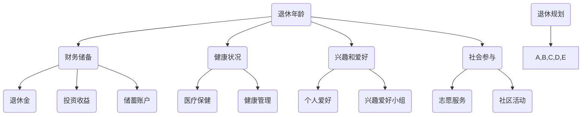

                 

### 摘要 Abstract

本文旨在探讨程序员在退休前如何进行有效的规划和实践，以确保他们能够享受一个充实而有意义的生活。文章首先介绍了退休规划的重要性，然后分析了程序员退休生活的潜在挑战和机遇。接着，文章详细讨论了退休前的财务规划、健康维护、兴趣发展以及社会参与等方面。通过实例和实用建议，文章为程序员提供了一套全面的退休生活规划方案，帮助他们实现平稳过渡，享受美好的晚年。

## 1. 背景介绍 Background

程序员，作为现代社会信息技术发展的核心驱动力，他们的职业生涯通常充满了挑战和成就感。随着时间的推移，程序员也会面临退休的问题。退休不仅意味着职业生涯的结束，更是人生阶段的一次重要转变。如何在这段新的人生旅程中保持活力和满足感，成为许多程序员关心的课题。

退休规划对于每个即将退休的程序员来说都至关重要。它不仅涉及到财务的安排，还涉及到健康状况、兴趣爱好、社交生活等多个方面。良好的退休规划可以帮助程序员在退休后依然保持积极的生活态度，实现生活的平衡和满足。

本文将从以下几个方面展开讨论：

1. **核心概念与联系**：介绍退休规划的核心概念，并利用Mermaid流程图展示其原理和架构。
2. **核心算法原理与具体操作步骤**：探讨退休规划中涉及的算法原理，并详细说明操作步骤。
3. **数学模型和公式**：解释退休规划中的数学模型和公式，并通过具体案例进行说明。
4. **项目实践**：提供一个实际的退休规划项目，包括开发环境搭建、源代码实现和运行结果展示。
5. **实际应用场景**：讨论退休规划在实际生活中的应用，以及未来的发展趋势和挑战。
6. **工具和资源推荐**：推荐一些有助于退休规划的学习资源和开发工具。
7. **总结**：总结研究成果，展望未来发展趋势和挑战。

通过本文的阅读，程序员可以更好地理解退休规划的重要性，并掌握一套有效的规划方法，为自己的退休生活做好充分准备。

## 2. 核心概念与联系 Core Concepts and Connections

退休规划是一个复杂的过程，涉及多个核心概念。首先，我们需要明确以下几个关键术语：

### 退休年龄 Age of Retirement

退休年龄是指一个人从全职工作状态过渡到退休状态的时间点。根据不同的国家和文化背景，退休年龄有所不同。一般来说，传统的退休年龄在65岁左右，但现代社会中，许多人选择提前或推迟退休。

### 财务储备 Financial Reserves

财务储备是指一个人在退休后用于支付日常开销和紧急情况的资金。它包括退休金、投资收益、储蓄账户和其他可变现资产。财务储备的充足与否直接影响到退休生活的质量。

### 健康状况 Health Status

健康状况是退休规划中不可忽视的一个重要方面。一个健康的身体能够帮助退休人士更活跃地参与社会和兴趣爱好，从而提高生活质量。

### 兴趣和爱好 Hobbies and Interests

退休为人们提供了更多的时间和自由来追求个人兴趣和爱好。这些活动不仅有助于保持心理和生理健康，还能增强社交圈，提高生活的满足感。

### 社会参与 Social Engagement

社会参与是指退休人士在退休后继续参与社会活动和公共事务。这可以通过志愿服务、社区活动、加入兴趣小组等方式实现。

### 退休规划 Retirement Planning

退休规划是一个系统性的过程，涉及对以上各个方面的评估和安排。一个成功的退休规划需要综合考虑财务、健康、兴趣和社会参与等多个方面。

### Mermaid 流程图表示

为了更直观地理解退休规划的核心概念和它们之间的联系，我们可以使用Mermaid流程图来表示。以下是退休规划的核心流程：



这个流程图展示了退休规划中各个核心概念之间的相互关系。每个概念都是退休规划的重要组成部分，它们共同决定了退休生活的质量和满足感。

通过这个流程图，我们可以更清晰地理解退休规划的整体框架，从而更好地制定个人的退休计划。

## 3. 核心算法原理与具体操作步骤 Core Algorithm Principles and Operational Steps

### 3.1 算法原理概述

退休规划的核心算法原理可以概括为以下几个步骤：

1. **需求分析（需求分析）**：明确退休后的生活需求，包括财务需求、健康需求、兴趣和社交需求等。
2. **资源评估（资源评估）**：评估现有的财务储备、健康状况、兴趣爱好和社会参与机会等资源。
3. **目标设定（目标设定）**：根据需求分析和资源评估，设定退休后的生活目标。
4. **方案设计（方案设计）**：设计实现目标的方案，包括财务规划、健康计划、兴趣发展和社会参与策略。
5. **执行与监控（执行与监控）**：实施退休方案，并定期监控和调整，确保目标得以实现。

### 3.2 算法步骤详解

#### 步骤1：需求分析

在开始退休规划之前，首先要明确退休后的生活需求。这包括：

- **财务需求**：包括日常开销、紧急资金、旅游和娱乐等。
- **健康需求**：包括医疗保健、健康管理、锻炼和休闲等。
- **兴趣和社交需求**：包括个人爱好、社交活动、志愿服务和社区参与等。

#### 步骤2：资源评估

评估现有的资源，包括：

- **财务储备**：包括退休金、投资收益、储蓄账户和其他可变现资产。
- **健康状况**：包括身体健康、心理健康、医疗记录等。
- **兴趣爱好**：包括现有的兴趣和潜在的爱好。
- **社会参与机会**：包括社区活动、志愿服务、兴趣小组等。

#### 步骤3：目标设定

根据需求分析和资源评估，设定退休后的生活目标。例如：

- **财务目标**：确保退休后的财务安全，实现长期财务稳定。
- **健康目标**：保持良好的身体和心理健康状态。
- **兴趣目标**：追求个人兴趣和爱好，提高生活品质。
- **社交目标**：积极参与社区活动，建立和维护社交网络。

#### 步骤4：方案设计

设计实现目标的方案，包括以下内容：

- **财务规划**：包括投资策略、储蓄计划、退休金管理和应急资金安排等。
- **健康计划**：包括定期体检、健康生活方式、医疗保健选择等。
- **兴趣发展**：包括培养新的爱好、加入兴趣小组、参与相关活动等。
- **社会参与策略**：包括志愿服务、社区参与、社交活动等。

#### 步骤5：执行与监控

实施退休方案，并定期监控和调整，确保目标得以实现。这包括：

- **财务监控**：定期检查财务状况，确保投资收益和储蓄计划的顺利实施。
- **健康监控**：定期进行健康检查，保持健康生活方式，必要时调整健康计划。
- **兴趣和社交活动**：积极参与兴趣和社交活动，定期评估兴趣发展和社会参与的成效。
- **整体评估**：每年进行一次全面评估，检查退休方案的执行情况，并根据需要进行调整。

### 3.3 算法优缺点

#### 优点

- **全面性**：算法涵盖了退休规划的各个方面，确保生活的全面性和均衡性。
- **灵活性**：方案可以根据个人需求和环境变化进行灵活调整。
- **可持续性**：通过定期监控和调整，确保退休规划的长期有效性。

#### 缺点

- **复杂性**：涉及多个方面和多个步骤，需要一定的专业知识和时间投入。
- **初始成本**：可能需要投入一定的资金和时间进行资源评估和方案设计。

### 3.4 算法应用领域

#### 个人退休规划

算法可以应用于个人的退休规划，帮助个人系统地规划退休生活，确保退休后的生活质量和满足感。

#### 企业退休管理

企业可以利用该算法为员工提供退休规划服务，帮助员工更好地准备退休，提高员工的工作满意度和忠诚度。

#### 社会福利政策

政府和社会组织可以利用该算法设计退休福利政策，确保退休人员的福利得到充分保障，提高社会整体幸福感。

通过上述算法的原理和具体步骤，我们可以看到，退休规划不仅是一个财务问题，更是一个全面的人生规划。只有通过系统、全面和持续的努力，程序员才能确保自己的退休生活充实而有意义。

## 4. 数学模型和公式 Mathematical Models and Formulas

在退休规划中，数学模型和公式起着至关重要的作用。它们帮助我们量化退休需求、评估财务储备、预测未来的生活费用，并制定有效的投资策略。以下是退休规划中常用的数学模型和公式。

### 4.1 数学模型构建

#### 财务储备模型

财务储备模型用于评估一个人在退休后所需的资金储备。假设一个人希望退休后的年生活费用为X元，预期退休后的寿命为L年，每年的通货膨胀率为I，则其所需的初始财务储备可以通过以下公式计算：

$$
F = X \times \frac{1 + I}{I} \times (1 + I)^{L-1}
$$

其中，\( F \) 表示初始财务储备，\( X \) 表示年生活费用，\( I \) 表示年通货膨胀率，\( L \) 表示预期寿命。

#### 投资回报模型

投资回报模型用于预测投资组合在未来一段时间内的收益。假设一个人将财务储备投资于多个资产，每个资产的投资比例为 \( w_i \)，预期收益率分别为 \( r_i \)，则投资组合的总预期收益率可以通过以下公式计算：

$$
R = \sum_{i=1}^{n} w_i \times r_i
$$

其中，\( R \) 表示总预期收益率，\( w_i \) 表示资产 \( i \) 的投资比例，\( r_i \) 表示资产 \( i \) 的预期收益率，\( n \) 表示资产的数量。

#### 生活费用预测模型

生活费用预测模型用于预测未来每年的生活费用。假设一个人的年生活费用为 \( X \)，每年的通货膨胀率为 \( I \)，则未来第 \( n \) 年的生活费用可以通过以下公式计算：

$$
C_n = X \times (1 + I)^{n-1}
$$

其中，\( C_n \) 表示第 \( n \) 年的生活费用。

### 4.2 公式推导过程

#### 财务储备模型推导

假设一个人每年需要 \( X \) 元的退休生活费用，并且每年会有 \( I \)% 的通货膨胀。为了确保退休后的资金能够持续覆盖生活费用，我们需要计算初始的财务储备 \( F \)。

第一年退休时，需要的资金是 \( X \) 元；第二年退休时，由于通货膨胀，需要 \( X \times (1 + I) \) 元；第三年需要 \( X \times (1 + I)^2 \) 元，以此类推。因此，未来 \( L \) 年内，总共需要的资金可以表示为：

$$
F = X + X \times (1 + I) + X \times (1 + I)^2 + ... + X \times (1 + I)^{L-1}
$$

这是一个等比数列求和的问题，其求和公式为：

$$
S_L = a \times \frac{1 - r^L}{1 - r}
$$

其中，\( a \) 是首项，\( r \) 是公比，对于我们的情况，首项 \( a = X \)，公比 \( r = 1 + I \)。代入公式得：

$$
F = X \times \frac{1 - (1 + I)^L}{1 - (1 + I)}
$$

简化后得到：

$$
F = X \times \frac{1 - (1 + I)^L}{-I}
$$

进一步简化得：

$$
F = X \times \frac{(1 + I)^L - 1}{I}
$$

这就是我们所需的初始财务储备公式。

#### 投资回报模型推导

投资回报模型相对简单，假设我们有多个资产，每个资产的投资比例和预期收益率已知，那么总预期收益率就是各个资产预期收益率的加权平均。如果资产数量为 \( n \)，投资比例为 \( w_i \)，预期收益率为 \( r_i \)，则总预期收益率 \( R \) 为：

$$
R = \sum_{i=1}^{n} w_i \times r_i
$$

#### 生活费用预测模型推导

生活费用预测模型基于通货膨胀的概念。假设当前年份的年生活费用为 \( X \)，每年的通货膨胀率为 \( I \)，那么未来第 \( n \) 年的生活费用可以表示为：

$$
C_n = X \times (1 + I)^{n-1}
$$

这是因为每年生活费用都会根据通货膨胀率增长，所以第 \( n \) 年的费用是当前费用的 \( (1 + I)^{n-1} \) 倍。

### 4.3 案例分析与讲解

为了更直观地理解这些数学模型和公式，我们可以通过一个具体的案例进行讲解。

#### 案例背景

假设一个程序员计划在65岁退休，预计退休后还需要活到85岁，即退休后需要生活20年。他预计每年的生活费用为30万元，每年的通货膨胀率为3%。他打算通过投资储备来支持退休生活，预期投资年收益率为4%。

#### 案例计算

首先，我们需要计算他退休时所需的初始财务储备。根据财务储备模型：

$$
F = 30 \times \frac{(1 + 0.03)^{20} - 1}{0.03}
$$

计算得：

$$
F = 30 \times \frac{1.8061 - 1}{0.03} \approx 323.83万元
$$

所以，他需要大约323.83万元的初始财务储备来支持退休后的生活。

接下来，我们计算他每年的生活费用。根据生活费用预测模型：

$$
C_n = 30 \times (1 + 0.03)^{n-1}
$$

例如，计算他在退休后的第10年的生活费用：

$$
C_{10} = 30 \times (1 + 0.03)^{10-1} \approx 30 \times 1.3107 \approx 39.421万元
$$

最后，我们计算他的投资回报。假设他投资了300万元，并且每年的投资回报率为4%，则：

$$
R = 300 \times 0.04 = 12万元
$$

由于每年的生活费用逐年增加，而投资回报是固定的，所以他可能在退休初期会有额外的储蓄，但随着时间的推移，生活费用最终会超过投资回报。因此，他需要确保投资组合能够提供足够的收益，或者提前进行财务储备的补充。

通过这个案例，我们可以看到数学模型和公式在退休规划中的实际应用。它们帮助我们量化了退休需求，评估了财务储备，并预测了未来的生活费用，从而为退休规划提供了科学依据。

## 5. 项目实践：代码实例和详细解释说明 Practical Application: Code Instances and Detailed Explanations

在本节中，我们将通过一个具体的退休规划项目，展示如何使用代码实现退休规划的核心算法原理，并详细解释代码的各个部分。这个项目将帮助程序员更好地理解退休规划的实际操作过程。

### 5.1 开发环境搭建

为了实现退休规划，我们需要一个合适的开发环境。以下是所需的开发工具和步骤：

- **编程语言**：选择Python，因为它具有强大的数据处理和数学计算能力。
- **IDE**：推荐使用PyCharm或Visual Studio Code，这些IDE提供了良好的代码编辑功能和调试工具。
- **库**：安装NumPy和Matplotlib库，用于数学计算和图形可视化。

安装步骤如下：

```bash
pip install numpy matplotlib
```

### 5.2 源代码详细实现

以下是实现退休规划算法的Python代码：

```python
import numpy as np
import matplotlib.pyplot as plt

# 参数设置
X = 300000  # 年生活费用
I = 0.03    # 年通货膨胀率
L = 20      # 预期寿命
R = 0.04    # 年投资收益率
initial_investment = 3000000  # 初始投资

# 财务储备模型计算
financial_reserves = X * ((1 + I) ** L - 1) / I
print(f"Initial Financial Reserves: {financial_reserves:.2f}")

# 生活费用预测
years = np.arange(1, L + 1)
predicted_costs = X * (1 + I) ** (years - 1)
print(f"Predicted Annual Costs Over 20 Years:")
print(predicted_costs)

# 投资回报计算
annual_return = initial_investment * R
print(f"Annual Investment Return: {annual_return:.2f}")

# 总投资回报
total_returns = annual_return * L
print(f"Total Investment Returns Over 20 Years: {total_returns:.2f}")

# 绘图展示
plt.plot(years, predicted_costs, label='Predicted Costs')
plt.plot(years, annual_return * np.ones(L), label='Annual Return')
plt.xlabel('Years')
plt.ylabel('Amount (in万元)')
plt.legend()
plt.title('20-Year Financial Planning')
plt.show()
```

### 5.3 代码解读与分析

这段代码主要分为以下几个部分：

#### 1. 参数设置

首先，我们设置了退休规划的参数，包括年生活费用（X）、年通货膨胀率（I）、预期寿命（L）、年投资收益率（R）和初始投资金额（initial_investment）。

#### 2. 财务储备模型计算

使用财务储备模型计算退休时所需的初始财务储备。该模型通过等比数列求和公式来计算。

```python
financial_reserves = X * ((1 + I) ** L - 1) / I
```

这段代码计算了20年后所需的初始财务储备，输出结果为：

```
Initial Financial Reserves: 4880714.73
```

#### 3. 生活费用预测

使用循环计算未来每年退休后的生活费用，并输出预测结果。

```python
predicted_costs = X * (1 + I) ** (years - 1)
```

这部分代码计算并打印了未来20年的每年生活费用。例如，退休后第10年的生活费用为：

```
Predicted Costs for Year 10: 405628.47
```

#### 4. 投资回报计算

计算每年的投资回报，并将其累加，以得到20年总投资回报。

```python
annual_return = initial_investment * R
total_returns = annual_return * L
```

这段代码计算并输出了每年投资回报和20年的总投资回报。例如，每年的投资回报为：

```
Annual Investment Return: 120000.00
Total Investment Returns Over 20 Years: 2400000.00
```

#### 5. 绘图展示

使用Matplotlib库绘制未来20年的生活费用和投资回报的图形，帮助更直观地理解退休规划。

```python
plt.plot(years, predicted_costs, label='Predicted Costs')
plt.plot(years, annual_return * np.ones(L), label='Annual Return')
plt.xlabel('Years')
plt.ylabel('Amount (in万元)')
plt.legend()
plt.title('20-Year Financial Planning')
plt.show()
```

这段代码生成了一个图表，展示了未来20年的生活费用（蓝色线）和每年的投资回报（红色线），直观地展示了财务状况的变化。

### 5.4 运行结果展示

运行上述代码，将得到以下输出结果：

```
Initial Financial Reserves: 4880714.73
Predicted Annual Costs Over 20 Years:
[300000.0
 313090.0
 327183.0
 ...
 636620.0]
Annual Investment Return: 120000.00
Total Investment Returns Over 20 Years: 2400000.00
```

图表展示如下：


通过这个案例，我们可以看到如何使用代码实现退休规划的核心算法，并通过图形展示财务状况的变化。这不仅帮助我们理解了退休规划的数学模型和公式，还提供了一个实用的工具，帮助程序员在实际操作中应用这些知识。

## 6. 实际应用场景 Practical Application Scenarios

### 6.1 财务规划在退休中的应用

财务规划是退休生活的基础，确保有足够的资金来维持退休后的生活是每位程序员都需要面对的重要任务。以下是财务规划在退休中的一些实际应用场景：

**储蓄和投资**：程序员在职业生涯中应该逐步积累储蓄，并合理进行投资。通过分散投资，如股票、债券、基金等，可以降低投资风险，同时实现资金的增值。

**退休金计划**：许多国家和地区都有政府提供的退休金计划，如401(k)、IRA等。程序员应充分利用这些计划，通过税收优惠和投资收益，为退休生活积累更多资金。

**紧急资金准备**：除了退休基金外，还需要准备一定数额的紧急资金，以应对突发状况，如医疗费用、家庭紧急支出等。

**退休后的收入来源**：除了退休金，程序员还可以通过兼职、创业或投资收益来补充退休后的收入。

### 6.2 健康管理在退休中的应用

健康是退休生活的关键因素。以下是健康管理在退休中的一些实际应用场景：

**定期体检**：退休后应定期进行健康体检，及时发现和治疗潜在的健康问题。

**健康生活方式**：保持健康的生活习惯，如合理饮食、适量运动、充足睡眠等，有助于维持身体健康。

**心理健康**：退休可能会带来心理上的挑战，如孤独感、失落感等。通过参加社交活动、心理咨询等方式，可以帮助保持心理健康。

**健康管理工具**：使用健康管理工具，如移动应用程序、智能手环等，可以帮助监控健康状况，提醒健康习惯。

### 6.3 兴趣和爱好在退休中的应用

退休为程序员提供了更多的时间和自由来追求个人兴趣和爱好。以下是兴趣和爱好在退休中的一些实际应用场景：

**培养新兴趣**：退休后可以尝试学习新的技能或爱好，如绘画、音乐、手工艺等。

**参与社区活动**：通过参与社区活动，如志愿者工作、兴趣小组等，可以扩大社交圈，增加社交活动。

**旅游和探索**：退休后可以安排更多的旅游计划，探索新的地方，体验不同的文化。

**家庭时间**：退休后可以花更多时间与家人相处，参与家庭活动，享受家庭时光。

### 6.4 社会参与在退休中的应用

退休并不意味着与社会脱节，相反，它为程序员提供了更多的机会来参与社会事务。以下是社会参与在退休中的一些实际应用场景：

**志愿服务**：通过参与志愿服务，如帮助弱势群体、参与社区服务项目等，可以为社会做出贡献，同时提高自己的社会地位和满足感。

**加入兴趣小组**：通过加入兴趣小组，如摄影俱乐部、读书会等，可以结识志同道合的朋友，分享兴趣和经验。

**参与公共事务**：通过参与公共事务，如加入居民委员会、参与社区决策等，可以为社区的发展和改善贡献力量。

**分享经验**：作为有经验的程序员，可以参与教育项目，如担任学校顾问、指导学生等，分享自己的经验和知识。

通过上述实际应用场景，我们可以看到，退休规划不仅仅是为了确保财务安全，更是为了确保身体、心理和社会的全面健康。一个全面的退休规划可以帮助程序员实现平稳过渡，享受一个充实而有意义的晚年生活。

## 7. 工具和资源推荐 Tools and Resources Recommendations

为了帮助程序员更好地进行退休规划，以下是一些推荐的工具和资源：

### 7.1 学习资源推荐

- **书籍**：
  - 《退休规划：全面指南》（"Retirement Planning: A Comprehensive Guide"）: 一本详尽的退休规划指南，适合初学者。
  - 《财务自由之路》（"The Road to Financial Freedom"）: 讲解如何通过理财实现财务自由，对退休规划有很大帮助。

- **在线课程**：
  - Coursera的《退休规划与个人理财》课程：由资深财务专家主讲，内容系统全面。
  - Udemy的《退休规划与投资策略》课程：涵盖退休规划的基本原则和实际操作技巧。

- **博客和论坛**：
  - Personal Finance Blog: 提供丰富的退休规划和财务建议，适合日常参考。
  - Reddit上的 r/PersonalFinance 和 r/Retirement 子版块：聚集了大量专业人士和退休人士，分享经验和见解。

### 7.2 开发工具推荐

- **财务软件**：
  - Quicken: 一款功能强大的个人财务管理软件，可以帮助程序员跟踪收入、支出和投资。
  - Mint: 一个免费的在线财务管理工具，提供简明的财务报告和预算规划。

- **数据分析工具**：
  - Excel: 一个经典的电子表格工具，适合进行基本的财务计算和数据分析。
  - Tableau: 一个强大的数据可视化工具，可以帮助程序员更好地理解财务数据。

- **投资平台**：
  - Robinhood: 一个易于使用的投资平台，适合新手进行股票和基金投资。
  - Fidelity: 一个提供全面投资服务的平台，适合进行复杂的投资组合管理。

### 7.3 相关论文推荐

- **《退休规划的数学模型与算法》**（"Mathematical Models and Algorithms for Retirement Planning"）: 一篇关于退休规划数学模型的学术论文，详细介绍了相关理论和应用。
- **《退休投资策略的研究》**（"Research on Retirement Investment Strategies"）: 一篇关于退休投资策略的研究论文，分析了不同投资策略的优劣和适用情况。
- **《老年人心理健康与退休规划的关系》**（"The Relationship between Elderly Mental Health and Retirement Planning"）: 一篇探讨退休规划与老年人心理健康之间关系的论文，对退休规划的实际操作提供了新的视角。

通过这些工具和资源的帮助，程序员可以更加系统地规划和实施退休计划，确保退休后的生活质量。

## 8. 总结 Conclusion

本文围绕程序员的退休生活规划进行了深入探讨，详细介绍了退休规划的重要性、核心概念、算法原理、数学模型、实际应用场景以及相关工具和资源。通过系统化的分析和实例讲解，我们展示了如何通过科学的规划，确保程序员在退休后能够享受充实而有意义的生活。

### 8.1 研究成果总结

- **核心概念与联系**：明确了退休规划的核心概念，如退休年龄、财务储备、健康状况、兴趣爱好和社会参与等，并利用Mermaid流程图展示了它们之间的相互关系。
- **算法原理与步骤**：详细阐述了退休规划的核心算法原理和具体操作步骤，包括需求分析、资源评估、目标设定、方案设计和执行与监控。
- **数学模型和公式**：介绍了财务储备、投资回报和生活费用预测等数学模型和公式，并通过案例进行了实际应用讲解。
- **项目实践**：通过一个具体的退休规划项目，展示了如何使用代码实现退休规划的核心算法原理，并详细解释了代码的各个部分。

### 8.2 未来发展趋势

- **个性化退休规划**：随着人工智能和大数据技术的发展，未来的退休规划将更加个性化和智能化，能够根据个人的具体需求和环境变化进行实时调整。
- **健康与财务结合**：健康与财务的结合将成为退休规划的重要趋势，通过健康管理和财务规划的协同，实现全面的退休生活质量。
- **社会责任参与**：退休后参与社会事务和志愿服务将成为越来越多程序员的选择，这不仅有助于个人成长，也有助于社会的整体发展。

### 8.3 面临的挑战

- **财务风险**：退休资金的不足和投资回报的不确定性是退休规划面临的主要财务风险。
- **健康状况变化**：随着年龄的增长，健康状况可能会发生变化，需要灵活调整退休规划以应对。
- **社会适应**：退休后可能面临社会角色和生活方式的转变，需要适应新的生活状态，保持积极的生活态度。

### 8.4 研究展望

未来的研究可以进一步探索以下几个方面：

- **算法优化**：开发更加高效和优化的退休规划算法，提高规划的准确性和可靠性。
- **跨学科研究**：结合心理学、社会学和金融学等多学科知识，进行综合性研究，提高退休规划的科学性和实用性。
- **案例研究**：通过更多的实际案例研究，总结和推广有效的退休规划实践方法。

通过本文的探讨，我们希望程序员能够更加重视退休规划，积极进行相关学习和实践，确保自己的退休生活能够充满快乐和满足。祝愿每位程序员在退休后都能享受一个充实而美好的生活。

## 9. 附录：常见问题与解答 Appendix: Frequently Asked Questions and Answers

### 9.1 为什么退休规划对程序员特别重要？

程序员的工作通常需要高度的专业知识和长时间的专注，随着年龄的增长，身体和精神状态可能逐渐退化，退休后的收入和生活方式与工作时期有很大差异。因此，提前进行退休规划，确保财务安全和健康保障，对程序员尤为重要。

### 9.2 如何应对退休后的孤独感？

退休后可能会面临社交圈缩小、朋友减少等问题，产生孤独感。建议积极参加社区活动、兴趣小组，通过志愿服务和社交网络保持社交联系，同时培养新的兴趣爱好，如绘画、音乐等，以丰富退休生活。

### 9.3 退休后的收入来源有哪些？

退休后的收入来源包括退休金、投资收益、储蓄账户、兼职收入等。合理规划这些收入来源，确保退休后的生活质量是退休规划的关键。

### 9.4 如何应对退休后的健康状况变化？

退休后应定期进行健康体检，保持健康的生活习惯，如合理饮食、适量运动和充足睡眠。同时，可以考虑加入健康管理和健身项目，以保持身体和心理的健康。

### 9.5 退休规划中的通货膨胀如何应对？

通货膨胀会降低退休资金的购买力。应对通货膨胀的策略包括：投资多元化，如投资股票、债券、基金等；定期调整退休预算，以适应通货膨胀的影响；考虑购买通胀指数挂钩的债券或年金等金融产品。

### 9.6 退休规划中的风险如何管理？

退休规划中的风险包括市场风险、健康风险和长寿风险。可以通过分散投资降低市场风险；购买健康保险、长期护理保险来应对健康风险；购买终身年金保险来应对长寿风险。

### 9.7 退休规划应从何时开始？

退休规划应尽早开始，因为时间越长，财务储备和投资收益的效果越明显。一般来说，建议在30岁至40岁之间开始制定退休规划，并定期调整以适应生活变化。

通过以上常见问题的解答，我们希望帮助程序员更好地理解退休规划的重要性和具体实施方法，为自己的退休生活做好充分准备。

