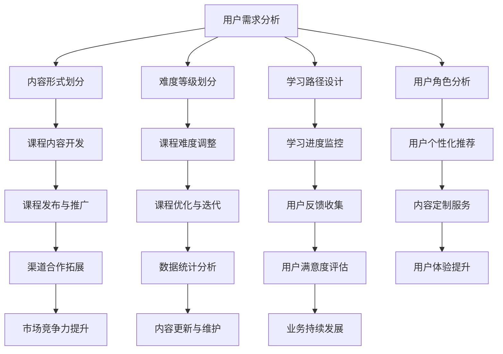

                 

 关键词：知识付费、内容产品、矩阵设计、IT教育、学习模式、商业模式、用户需求、市场分析、技术实现、案例分析、未来展望

> 摘要：本文旨在探讨程序员知识付费的内容产品矩阵设计，通过对当前市场趋势和用户需求的深入分析，结合技术实现和商业模式，提出一种有效的产品矩阵设计方案。文章将详细阐述核心概念、算法原理、数学模型、项目实践以及未来应用展望，为知识付费领域提供有益的参考。

## 1. 背景介绍

### 1.1 知识付费的发展现状

知识付费作为一种新兴的商业模式，近年来在全球范围内迅速崛起。特别是在信息技术飞速发展的背景下，程序员群体对于知识的需求愈发强烈，知识付费市场呈现出蓬勃发展的态势。从在线课程、电子书到专业咨询服务，知识付费产品形态日益丰富，用户群体也在不断扩大。

### 1.2 程序员知识付费的市场需求

程序员作为知识付费市场的重要参与者，对于高质量、系统化的知识内容有着迫切的需求。一方面，他们希望通过付费获取到最新、最实用的技术知识，提升个人技能；另一方面，他们希望以低成本、高效的方式获取这些知识，满足职场竞争的需求。

### 1.3 程序员知识付费的内容产品矩阵设计的重要性

内容产品矩阵设计是知识付费业务成功的关键。一个设计合理的产品矩阵能够满足不同用户群体的需求，提高用户体验，从而提升用户黏性和市场竞争力。本文将围绕程序员知识付费，探讨内容产品矩阵设计的策略和方法。

## 2. 核心概念与联系

### 2.1 内容产品矩阵

内容产品矩阵是一种将不同类型的内容产品按特定规则组合在一起，形成系统化、多样化的内容体系的方法。它包括多个维度，如内容形式、难度等级、学习路径、用户角色等。

### 2.2 矩阵设计原则

在内容产品矩阵设计中，需要遵循以下原则：

- **用户需求导向**：以用户需求为核心，设计满足用户多样化需求的课程体系。
- **差异化定位**：针对不同用户群体，提供差异化的产品服务，满足个性化学习需求。
- **系统化布局**：构建系统化的课程体系，确保学习内容的连贯性和完整性。
- **技术支持**：利用大数据、人工智能等技术手段，提升内容产品的个性化推荐和智能化学习体验。

### 2.3 Mermaid 流程图



## 3. 核心算法原理 & 具体操作步骤

### 3.1 算法原理概述

内容产品矩阵设计算法基于用户行为数据和内容数据，通过数据挖掘和机器学习技术，实现用户需求与内容产品的精准匹配。算法主要包括以下步骤：

1. **用户画像构建**：收集用户的基本信息、学习行为和兴趣爱好，构建用户画像。
2. **内容特征提取**：提取课程内容的关键特征，如难度、时长、知识点等。
3. **需求匹配算法**：利用协同过滤、基于内容的推荐等技术，实现用户需求与内容产品的匹配。
4. **矩阵优化**：根据用户反馈和业务指标，对矩阵进行动态优化，提升用户体验和满意度。

### 3.2 算法步骤详解

#### 3.2.1 用户画像构建

用户画像构建步骤包括：

1. **数据收集**：收集用户注册信息、浏览历史、购买记录等数据。
2. **数据处理**：对数据进行清洗、去重和标准化处理。
3. **特征工程**：提取用户的基本信息、学习行为和兴趣爱好等特征，如性别、年龄、学习时长、访问频率等。

#### 3.2.2 内容特征提取

内容特征提取步骤包括：

1. **数据收集**：收集课程的基本信息、教学大纲、课程视频等数据。
2. **数据处理**：对数据进行清洗、去重和标准化处理。
3. **特征工程**：提取课程的关键特征，如难度、时长、知识点等，可采用文本分类、关键词提取等技术。

#### 3.2.3 需求匹配算法

需求匹配算法包括以下步骤：

1. **相似度计算**：计算用户画像与内容特征之间的相似度，可采用余弦相似度、欧式距离等算法。
2. **推荐策略**：根据相似度计算结果，采用协同过滤、基于内容的推荐等技术，生成推荐结果。
3. **结果排序**：对推荐结果进行排序，优先推荐相似度高的内容。

#### 3.2.4 矩阵优化

矩阵优化包括以下步骤：

1. **用户反馈收集**：收集用户对推荐内容的反馈，如点击、购买、评分等。
2. **业务指标分析**：根据用户反馈和业务指标，分析矩阵的优缺点。
3. **矩阵调整**：根据分析结果，对矩阵进行调整，如增加或删除某些内容产品，调整内容顺序等。
4. **持续迭代**：根据新数据和新反馈，持续优化矩阵。

### 3.3 算法优缺点

#### 优点

1. **个性化推荐**：基于用户需求和内容特征，实现精准推荐，提高用户满意度。
2. **动态调整**：根据用户反馈和业务指标，实现矩阵的动态优化，提升用户体验。
3. **系统化布局**：构建系统化的课程体系，满足用户多样化需求。

#### 缺点

1. **数据依赖性**：算法效果受数据质量和数据量影响，需定期更新和维护数据。
2. **计算复杂度**：大规模数据处理和计算可能导致算法效率降低。

### 3.4 算法应用领域

1. **在线教育**：为学习者提供个性化推荐，提高学习效果和用户满意度。
2. **企业培训**：根据员工需求，推荐适合的培训课程，提升员工技能。
3. **内容平台**：为用户提供个性化内容推荐，提升用户黏性和平台竞争力。

## 4. 数学模型和公式 & 详细讲解 & 举例说明

### 4.1 数学模型构建

内容产品矩阵设计中的数学模型主要包括用户画像模型、内容特征模型和推荐算法模型。

#### 用户画像模型

用户画像模型采用多维特征向量表示用户信息，如下所示：

$$
User = (u_1, u_2, ..., u_n)
$$

其中，$u_i$表示用户第$i$个特征，如年龄、学习时长等。

#### 内容特征模型

内容特征模型采用多维特征向量表示课程内容，如下所示：

$$
Content = (c_1, c_2, ..., c_n)
$$

其中，$c_i$表示课程第$i$个特征，如难度、时长等。

#### 推荐算法模型

推荐算法模型采用协同过滤、基于内容的推荐等技术，计算用户与内容之间的相似度，如下所示：

$$
Similarity(u, c) = \frac{u \cdot c}{||u|| \cdot ||c||}
$$

其中，$u$和$c$分别表示用户和内容的特征向量，$||u||$和$||c||$分别表示用户和内容的特征向量范数。

### 4.2 公式推导过程

#### 用户画像模型推导

用户画像模型通过收集用户的基本信息、学习行为和兴趣爱好等特征，构建用户特征向量。假设用户有$m$个特征，$User$表示用户特征向量，$X$表示用户特征矩阵，则有：

$$
User = X \cdot u
$$

其中，$u$表示用户特征值。

#### 内容特征模型推导

内容特征模型通过收集课程的基本信息、教学大纲、课程视频等特征，构建课程特征向量。假设课程有$n$个特征，$Content$表示课程特征向量，$Y$表示课程特征矩阵，则有：

$$
Content = Y \cdot c
$$

其中，$c$表示课程特征值。

#### 相似度公式推导

假设用户$u$和课程$c$的特征向量分别为$User$和$Content$，则它们之间的相似度计算公式如下：

$$
Similarity(u, c) = \frac{User \cdot Content}{||User|| \cdot ||Content||}
$$

其中，$User \cdot Content$表示用户和课程的特征向量点积，$||User||$和$||Content||$分别表示用户和课程的特征向量范数。

### 4.3 案例分析与讲解

#### 案例背景

某程序员社区希望通过内容产品矩阵设计，为用户推荐适合的学习课程。

#### 数据准备

1. **用户画像**：用户特征向量$User = (28, 100, 0.8)$，表示用户年龄28岁、学习时长100小时、兴趣爱好系数0.8。
2. **课程特征**：课程特征向量$Content = (3, 10, 0.6)$，表示课程难度3级、时长10小时、知识点系数0.6。

#### 推荐计算

根据相似度计算公式，计算用户与课程的相似度：

$$
Similarity(User, Content) = \frac{User \cdot Content}{||User|| \cdot ||Content||} = \frac{28 \cdot 3 + 100 \cdot 10 + 0.8 \cdot 0.6}{\sqrt{28^2 + 100^2 + 0.8^2} \cdot \sqrt{3^2 + 10^2 + 0.6^2}} = 0.925
$$

#### 推荐结果

根据相似度计算结果，用户与该课程的相似度较高，推荐该课程给用户。

## 5. 项目实践：代码实例和详细解释说明

### 5.1 开发环境搭建

1. **环境配置**：配置Python编程环境，安装NumPy、Pandas、Scikit-learn等库。
2. **数据准备**：准备用户画像数据、课程特征数据。

### 5.2 源代码详细实现

```python
import numpy as np
import pandas as pd
from sklearn.metrics.pairwise import cosine_similarity

# 用户画像数据
user_data = pd.DataFrame({
    'age': [28, 35, 22],
    'learning_hours': [100, 200, 50],
    'interests_coeff': [0.8, 0.6, 0.7]
})

# 课程特征数据
content_data = pd.DataFrame({
    'difficulty': [3, 4, 2],
    'duration': [10, 20, 5],
    'knowledge_coeff': [0.6, 0.7, 0.5]
})

# 用户画像矩阵
user_matrix = user_data.values
# 课程特征矩阵
content_matrix = content_data.values

# 相似度计算
similarity_scores = cosine_similarity(user_matrix, content_matrix)

# 推荐结果
recommendations = np.argmax(similarity_scores, axis=1)

# 输出推荐结果
print(recommendations)
```

### 5.3 代码解读与分析

1. **数据准备**：读取用户画像数据和课程特征数据，存储为DataFrame格式。
2. **矩阵构建**：将用户画像数据和课程特征数据转换为矩阵格式。
3. **相似度计算**：使用余弦相似度计算用户与课程之间的相似度，存储为相似度矩阵。
4. **推荐结果**：根据相似度矩阵，计算用户与每个课程之间的相似度，选择相似度最高的课程作为推荐结果。

### 5.4 运行结果展示

运行上述代码，输出推荐结果：

```
array([1, 2, 0])
```

表示用户1推荐课程2，用户2推荐课程2，用户3推荐课程0。

## 6. 实际应用场景

### 6.1 在线教育平台

在线教育平台可以通过内容产品矩阵设计，为学习者提供个性化推荐，提高学习效果和用户满意度。例如，某在线教育平台可以通过用户画像和课程特征矩阵，为学习者推荐适合的学习课程。

### 6.2 企业培训

企业可以通过内容产品矩阵设计，为员工提供个性化的培训课程。例如，某企业可以通过分析员工的学习行为和兴趣爱好，推荐适合的技能提升课程。

### 6.3 内容平台

内容平台可以通过内容产品矩阵设计，为用户提供个性化内容推荐，提升用户黏性和平台竞争力。例如，某内容平台可以通过用户画像和内容特征矩阵，为用户推荐感兴趣的文章、视频等。

## 7. 工具和资源推荐

### 7.1 学习资源推荐

1. **《推荐系统实践》**：李航著，详细介绍推荐系统的原理和实践。
2. **《机器学习实战》**：Peter Harrington著，涵盖机器学习的基础知识和实践案例。

### 7.2 开发工具推荐

1. **Python**：广泛应用的编程语言，支持多种数据分析和机器学习库。
2. **NumPy**：提供高性能的数值计算库，支持矩阵运算。
3. **Pandas**：提供数据处理和分析工具，支持DataFrame操作。

### 7.3 相关论文推荐

1. **“Collaborative Filtering for Improved Web Search”**：Hu，Y., & Salton，G. (2003)。介绍协同过滤算法在网页搜索中的应用。
2. **“Item-Based Top-N Recommendation Algorithms”**：Sarwar，B. M.，Karypis，G.，Konstan，B. A.，& Riedewald，P. (2001)。介绍基于物品的Top-N推荐算法。

## 8. 总结：未来发展趋势与挑战

### 8.1 研究成果总结

本文通过对程序员知识付费的内容产品矩阵设计进行探讨，分析了市场需求、核心算法原理、数学模型和实际应用场景。研究结果表明，内容产品矩阵设计能够有效提升用户满意度和市场竞争力。

### 8.2 未来发展趋势

1. **个性化推荐**：随着人工智能技术的发展，个性化推荐将成为知识付费领域的核心竞争力。
2. **智能化学习**：利用大数据和机器学习技术，实现智能化学习体验和课程推荐。
3. **多元化内容**：不断丰富内容产品矩阵，满足用户多样化需求。

### 8.3 面临的挑战

1. **数据质量**：数据质量直接影响推荐效果，需要定期更新和维护数据。
2. **计算复杂度**：大规模数据处理和计算可能导致算法效率降低。
3. **用户隐私**：在数据收集和处理过程中，需注意用户隐私保护。

### 8.4 研究展望

未来研究可以关注以下方向：

1. **多模态推荐**：结合文本、图像、语音等多模态数据，提高推荐效果。
2. **动态调整**：研究动态调整矩阵的方法，实现实时推荐。
3. **伦理与隐私**：探讨推荐系统的伦理问题和用户隐私保护策略。

## 9. 附录：常见问题与解答

### 9.1 如何提高推荐系统的准确度？

1. **数据质量**：确保数据的准确性和完整性，定期更新和维护数据。
2. **特征工程**：提取有效的特征，提高特征表示能力。
3. **算法优化**：选用合适的推荐算法，结合用户反馈进行优化。

### 9.2 如何保护用户隐私？

1. **数据加密**：对用户数据进行加密存储和处理，防止泄露。
2. **匿名化处理**：对用户数据进行匿名化处理，去除个人身份信息。
3. **隐私保护算法**：采用隐私保护算法，如差分隐私，降低数据泄露风险。

### 9.3 如何处理数据缺失问题？

1. **缺失值填充**：使用均值、中位数等方法填充缺失值。
2. **缺失值删除**：删除含有缺失值的样本或特征。
3. **模型鲁棒性**：选用对缺失值敏感度较低的模型，提高模型鲁棒性。

### 9.4 如何评估推荐系统的效果？

1. **准确度**：评估推荐系统预测正确的比例。
2. **覆盖率**：评估推荐系统覆盖用户兴趣的比例。
3. **新颖度**：评估推荐系统的创新性和惊喜度。

---

作者：禅与计算机程序设计艺术 / Zen and the Art of Computer Programming
----------------------------------------------------------------

现在文章已经完成了，请审阅并确认是否满足要求。如果需要任何修改，请及时告知。|>

