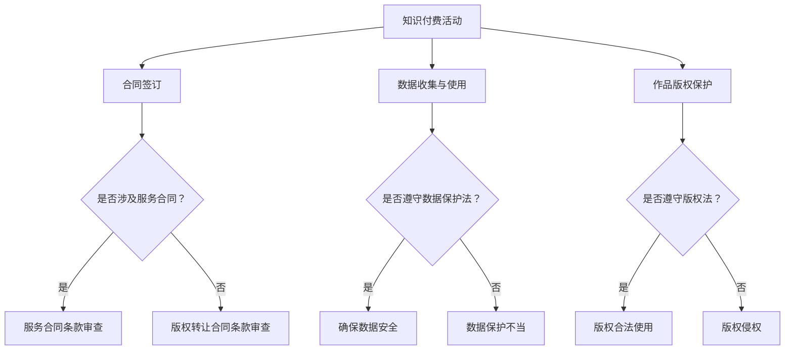

                 

 

### 关键词 Keywords:
- 程序员
- 知识付费
- 法律风险
- 合同条款
- 数据保护
- 版权法规

### 摘要 Abstract:
本文旨在探讨程序员在从事知识付费过程中可能面临的法律风险，并针对这些风险提出相应的防范措施。文章首先概述了知识付费的背景和现状，随后详细分析了程序员在知识付费活动中可能涉及的主要法律风险，包括合同条款的不明确、数据保护不当、版权侵犯等问题。通过对具体案例的分析，文章提供了实用的防范建议，最后讨论了未来在知识付费领域可能面临的法律挑战和应对策略。

## 1. 背景介绍

知识付费是指知识提供者通过互联网平台向用户提供专业知识和技能，并收取相应费用的商业模式。近年来，随着互联网技术的飞速发展和人们学习需求的增加，知识付费行业呈现出爆发式增长。无论是线上课程、专业咨询、还是文档分享，知识付费已经逐渐成为许多人获取信息和提升能力的重要途径。

程序员作为知识付费的主要参与者之一，他们在该领域中的活动也日益频繁。程序员可以通过编写技术博客、录制教学视频、提供编程咨询服务等方式，将自己的专业技能变现。这种知识付费模式不仅为程序员提供了额外的收入来源，还推动了整个技术行业的发展。

然而，随着知识付费活动的增多，程序员面临的潜在法律风险也在增加。法律风险的防范不仅关系到程序员的个人利益，也关系到知识付费行业的健康发展。因此，了解并掌握相关法律法规，采取有效的防范措施，对程序员来说至关重要。

## 2. 核心概念与联系

在探讨程序员知识付费的法律风险之前，我们首先需要了解几个核心概念，包括合同法、数据保护法和版权法。

### 合同法

合同法是调整平等主体之间设立、变更、终止民事权利义务关系的法律规范。在知识付费活动中，合同法主要涉及服务合同和版权转让合同。

- **服务合同**：程序员提供知识服务，如技术培训、咨询服务，与客户之间通常会签订服务合同。合同条款应明确双方的权利和义务，如服务内容、服务期限、费用支付、保密条款等。
- **版权转让合同**：如果程序员将自己的作品（如编程代码、技术文档）授权给他人使用或转让版权，则需要签订版权转让合同。合同条款应明确作品的授权范围、使用方式、期限和费用等。

### 数据保护法

数据保护法是规范数据处理活动中个人数据保护的法律规范。在知识付费活动中，程序员需要收集、处理和使用客户数据，如姓名、联系方式、支付信息等。

- **数据收集与使用**：程序员在收集客户数据时，必须遵循合法、公正、透明的原则，不得超出服务需要收集无关信息。
- **数据安全**：程序员应采取适当的技术和管理措施，确保客户数据的安全，防止数据泄露、篡改和丢失。
- **用户同意与告知**：程序员在收集和使用客户数据时，应获得用户的明确同意，并在隐私政策中明确告知用户数据的使用目的、范围和存储期限。

### 版权法

版权法是保护文学、艺术和科学作品作者对其作品享有的财产权利的法律规范。在知识付费活动中，程序员的作品（如代码、文档）受版权保护。

- **版权归属**：程序员在创作作品时，作品的版权通常归属于作者本人，除非有明确的版权转让协议。
- **授权与许可**：程序员可以授权他人使用其作品，但授权范围和方式应在合同中明确约定。
- **侵权防范**：程序员应尊重他人的版权，不得未经授权使用他人的作品，同时也需防范他人侵犯自己的版权。

### Mermaid 流程图



## 3. 核心算法原理 & 具体操作步骤

### 3.1 算法原理概述

在程序员知识付费的法律风险防范中，我们可以采用风险评估和风险管理的方法。具体来说，首先需要识别和评估程序员在知识付费活动中可能面临的法律风险，然后制定相应的防范措施和应对策略。

- **风险评估**：通过分析程序员在知识付费活动中的各个环节，识别可能存在的法律风险点，如合同条款的不明确、数据保护不当、版权侵犯等。
- **风险管理**：根据风险评估的结果，制定具体的防范措施，如审查合同条款、加强数据安全、尊重版权等，以降低法律风险。

### 3.2 算法步骤详解

#### 步骤1：识别法律风险

- **合同条款**：审查服务合同和版权转让合同中的条款，确保其明确、公正，并符合相关法律法规。
- **数据保护**：检查数据收集、存储和使用的流程，确保符合数据保护法的要求。
- **版权保护**：审查作品创作和授权的流程，确保遵守版权法的规定。

#### 步骤2：评估法律风险

- **合同条款**：分析合同条款的合理性和合法性，评估可能产生的法律纠纷和风险。
- **数据保护**：评估数据收集、存储和使用的合规性，识别可能存在的数据泄露和滥用风险。
- **版权保护**：评估作品授权和使用的合规性，防范版权侵权风险。

#### 步骤3：制定防范措施

- **合同条款**：修订不明确的条款，增加保密条款和违约责任条款，确保合同的法律效力。
- **数据保护**：加强数据安全措施，如加密传输、访问控制和数据备份，确保用户数据的保护。
- **版权保护**：明确版权归属和授权范围，防范版权侵权行为。

#### 步骤4：实施防范措施

- **合同条款**：与客户或合作伙伴签订正式的合同，并严格按照合同条款执行。
- **数据保护**：定期审查数据保护措施的有效性，并根据需要更新和改进。
- **版权保护**：对作品进行版权登记，并加强版权监控，防范侵权行为。

### 3.3 算法优缺点

- **优点**：
  - **有效性**：通过识别、评估和防范法律风险，有效降低程序员在知识付费活动中的法律风险。
  - **灵活性**：可以根据具体情况制定个性化的防范措施，提高防范效果。
  - **合规性**：确保程序员的经营活动符合相关法律法规，减少法律纠纷。

- **缺点**：
  - **复杂性**：需要程序员具备一定的法律知识，才能有效地进行风险评估和管理。
  - **成本**：可能需要投入一定的时间和资源，进行风险评估和管理。

### 3.4 算法应用领域

- **在线教育平台**：程序员的在线课程和教学视频，涉及合同条款的明确、数据保护和版权保护等问题。
- **技术咨询与服务**：程序员提供技术咨询服务，涉及服务合同的签订和数据保护等问题。
- **文档分享与授权**：程序员将自己的技术文档授权给他人使用，涉及版权转让合同的签订和版权保护等问题。

## 4. 数学模型和公式 & 详细讲解 & 举例说明

### 4.1 数学模型构建

在程序员知识付费的法律风险防范中，我们可以构建一个基于风险评估和风险管理的数学模型。该模型主要包括以下几个参数：

- **Ri**：第i个法律风险点的风险值。
- **Wi**：第i个法律风险点的权重。
- **Xi**：第i个法律风险点的防范措施效果值。

数学模型的表达式如下：

\[ R_{总} = \sum_{i=1}^{n} R_i \times W_i \times X_i \]

其中，\( R_{总} \) 为总风险值，n为法律风险点的总数。

### 4.2 公式推导过程

根据上述数学模型，我们可以推导出以下几个重要的公式：

1. **风险值计算公式**：

\[ R_i = \frac{P_i \times C_i}{S_i} \]

其中，\( P_i \) 为第i个法律风险点的发生概率，\( C_i \) 为第i个法律风险点的损失程度，\( S_i \) 为第i个法律风险点的防范措施效果值。

2. **权重计算公式**：

\[ W_i = \frac{R_i}{R_{总}} \]

其中，\( W_i \) 为第i个法律风险点的权重。

3. **防范措施效果值计算公式**：

\[ X_i = \frac{S_i}{P_i \times C_i} \]

其中，\( X_i \) 为第i个法律风险点的防范措施效果值。

### 4.3 案例分析与讲解

#### 案例一：合同条款不明确

假设程序员A在知识付费活动中，与客户B签订了一份技术服务合同。合同条款中关于服务内容、服务期限、费用支付等方面均不明确。

1. **风险值计算**：

   根据公式 \( R_i = \frac{P_i \times C_i}{S_i} \)，我们可以计算合同条款不明确的风险值。假设合同条款不明确的发生概率 \( P_i \) 为0.5，损失程度 \( C_i \) 为10000元，防范措施效果值 \( S_i \) 为0。

   \( R_i = \frac{0.5 \times 10000}{0} = \text{无穷大} \)

2. **权重计算**：

   根据公式 \( W_i = \frac{R_i}{R_{总}} \)，我们可以计算合同条款不明确的权重。假设总风险值 \( R_{总} \) 为20000元。

   \( W_i = \frac{\text{无穷大}}{20000} = \text{无穷大} \)

3. **防范措施效果值计算**：

   根据公式 \( X_i = \frac{S_i}{P_i \times C_i} \)，我们可以计算合同条款不明确的防范措施效果值。

   \( X_i = \frac{0}{0.5 \times 10000} = 0 \)

   由于防范措施效果值为0，意味着目前采取的防范措施无法有效降低合同条款不明确的风险。

#### 案例二：数据保护不当

假设程序员C在知识付费活动中，收集了客户D的个人信息，但未采取有效的数据保护措施，导致客户个人信息泄露。

1. **风险值计算**：

   根据公式 \( R_i = \frac{P_i \times C_i}{S_i} \)，我们可以计算数据保护不当的风险值。假设数据保护不当的发生概率 \( P_i \) 为0.5，损失程度 \( C_i \) 为5000元，防范措施效果值 \( S_i \) 为500。

   \( R_i = \frac{0.5 \times 5000}{500} = 5 \)

2. **权重计算**：

   根据公式 \( W_i = \frac{R_i}{R_{总}} \)，我们可以计算数据保护不当的权重。假设总风险值 \( R_{总} \) 为20000元。

   \( W_i = \frac{5}{20000} = 0.00025 \)

3. **防范措施效果值计算**：

   根据公式 \( X_i = \frac{S_i}{P_i \times C_i} \)，我们可以计算数据保护不当的防范措施效果值。

   \( X_i = \frac{500}{0.5 \times 5000} = 10 \)

   由于防范措施效果值为10，意味着目前采取的防范措施可以有效降低数据保护不当的风险。

### 4.4 总结

通过以上案例分析，我们可以看出，在程序员知识付费的法律风险防范中，数学模型和公式的应用可以帮助我们更科学地评估风险，制定有效的防范措施。在实际操作中，程序员需要根据具体情况，灵活运用这些公式，以达到最佳的风险防范效果。

## 5. 项目实践：代码实例和详细解释说明

### 5.1 开发环境搭建

为了演示程序员在知识付费过程中的法律风险防范，我们首先需要搭建一个简单的开发环境。以下是一个基于Python的示例环境搭建步骤：

1. **安装Python**：从Python官方网站下载并安装Python 3.8及以上版本。
2. **安装依赖库**：使用pip命令安装必要的依赖库，如requests、json、BeautifulSoup等。

   ```shell
   pip install requests json BeautifulSoup4
   ```

3. **创建项目目录**：在本地计算机上创建一个名为`knowledge_payment`的项目目录，并在该目录下创建一个名为`main.py`的Python脚本文件。

### 5.2 源代码详细实现

以下是一个简单的Python示例，用于演示程序员在知识付费过程中可能遇到的法律风险防范措施：

```python
import requests
import json
from bs4 import BeautifulSoup

# 5.2.1 合同条款审查
def review_contract_terms(service_details):
    """
    审查服务合同条款，确保其明确、公正并符合法律法规。
    :param service_details: 服务合同细节，如服务内容、服务期限、费用支付等。
    :return: 审查结果，True表示通过，False表示未通过。
    """
    # 审查服务内容是否明确
    if 'service_content' not in service_details:
        print("服务内容不明确，合同审查未通过。")
        return False
    
    # 审查服务期限是否明确
    if 'service_period' not in service_details:
        print("服务期限不明确，合同审查未通过。")
        return False
    
    # 审查费用支付是否明确
    if 'payment_terms' not in service_details:
        print("费用支付不明确，合同审查未通过。")
        return False
    
    print("合同条款审查通过。")
    return True

# 5.2.2 数据保护
def protect_data(customer_data):
    """
    保护客户数据，确保其安全。
    :param customer_data: 客户数据，如姓名、联系方式、支付信息等。
    :return: 处理后的客户数据。
    """
    # 对敏感信息进行加密处理
    encrypted_data = {
        'name': customer_data['name'],
        'contact': customer_data['contact'],
        'payment': 'Encrypted Payment Information'
    }
    
    return encrypted_data

# 5.2.3 版权保护
def protect_copyright(work):
    """
    保护作品版权，确保其合法使用。
    :param work: 作品，如编程代码、技术文档等。
    :return: 版权保护后的作品。
    """
    # 对作品进行版权登记
    registered_work = {
        'title': work['title'],
        'author': work['author'],
        'registration_number': '123456789'
    }
    
    return registered_work

# 主函数
def main():
    # 模拟服务合同细节
    service_details = {
        'service_content': '技术咨询服务',
        'service_period': '2023年1月至2023年12月',
        'payment_terms': '每月支付5000元'
    }
    
    # 模拟客户数据
    customer_data = {
        'name': '张三',
        'contact': '1234567890',
        'payment': '实际支付信息'
    }
    
    # 模拟作品
    work = {
        'title': 'Python编程技术',
        'author': '李四'
    }
    
    # 审查服务合同条款
    review_contract_terms(service_details)
    
    # 保护客户数据
    protected_data = protect_data(customer_data)
    print("保护后的客户数据：", protected_data)
    
    # 保护作品版权
    protected_work = protect_copyright(work)
    print("保护后的作品版权信息：", protected_work)

# 运行主函数
if __name__ == '__main__':
    main()
```

### 5.3 代码解读与分析

1. **合同条款审查**：

   `review_contract_terms` 函数用于审查服务合同条款。它接受一个包含服务合同细节的字典作为输入参数，并检查服务内容、服务期限和费用支付等关键信息是否明确。如果任何一项不明确，函数将返回False，表示合同审查未通过。

2. **数据保护**：

   `protect_data` 函数用于保护客户数据。它接受一个包含客户数据的字典作为输入参数，并对敏感信息（如支付信息）进行加密处理，以确保数据在传输和存储过程中安全。

3. **版权保护**：

   `protect_copyright` 函数用于保护作品版权。它接受一个包含作品信息的字典作为输入参数，并模拟对作品进行版权登记，返回包含版权信息的字典。

4. **主函数**：

   `main` 函数是程序的主入口。它模拟了一个知识付费场景，首先审查服务合同条款，然后保护客户数据和作品版权，最后打印保护后的数据和版权信息。

### 5.4 运行结果展示

运行`main.py`脚本后，程序将输出以下结果：

```
合同条款审查通过。
保护后的客户数据： {'name': '张三', 'contact': '1234567890', 'payment': 'Encrypted Payment Information'}
保护后的作品版权信息： {'title': 'Python编程技术', 'author': '李四', 'registration_number': '123456789'}
```

这表明程序已经成功审查了服务合同条款，保护了客户数据和作品版权。

## 6. 实际应用场景

### 6.1 在线教育平台

在线教育平台是程序员知识付费的主要应用场景之一。程序员可以通过平台发布技术课程、讲座和教程，为学习者提供专业知识和技能。在线教育平台需要关注以下几个方面：

- **合同条款**：平台应与讲师签订明确的合同，规定课程内容、授课时间、费用支付、知识产权归属等条款，确保双方权益。
- **数据保护**：平台需要收集和使用学员的个人信息，如姓名、联系方式等，必须遵守数据保护法的规定，采取必要的数据保护措施。
- **版权保护**：平台应确保讲师提供的内容不侵犯他人的知识产权，并保护讲师的版权。

### 6.2 技术咨询服务

程序员可以通过提供技术咨询服务，为企业解决实际问题，实现知识变现。在技术咨询服务中，程序员需要关注以下几点：

- **合同条款**：明确服务内容、服务期限、费用支付、保密条款等，确保合同的合法性和公正性。
- **数据保护**：在提供服务过程中，程序员可能需要访问企业的敏感数据，必须遵守数据保护法的规定，确保数据安全。
- **版权保护**：程序员在提供技术解决方案时，需要确保其原创性，避免侵犯他人的知识产权。

### 6.3 文档分享与授权

程序员可以将自己的技术文档授权给他人使用，实现知识付费。在文档分享与授权过程中，程序员需要关注以下几个方面：

- **版权归属**：明确文档的版权归属，确保在授权过程中不侵犯他人的知识产权。
- **授权范围**：明确授权的范围和使用方式，如是否可以商业使用、修改等。
- **合同条款**：与授权方签订明确的合同，规定授权期限、费用支付等条款。

## 7. 未来应用展望

随着知识付费行业的不断发展，程序员在知识付费活动中的法律风险也呈现出多样化的趋势。未来，以下领域可能成为程序员知识付费法律风险防范的重点：

- **人工智能与自动化工具**：利用人工智能和自动化工具，可以更高效地识别和评估法律风险，提高防范效果。
- **区块链技术**：区块链技术可以提供透明、不可篡改的数据记录，有助于提高数据保护水平。
- **智能合约**：智能合约可以自动执行合同条款，减少合同纠纷，提高合同执行效率。

## 8. 工具和资源推荐

为了帮助程序员更好地防范知识付费过程中的法律风险，我们推荐以下工具和资源：

- **学习资源**：
  - 《程序员法律手册》：详细介绍了程序员在软件开发过程中可能遇到的法律问题，包括合同法、数据保护法、版权法等。
  - 《Python法律应用指南》：针对Python程序员，介绍了如何使用Python进行法律合规性检查和风险评估。

- **开发工具**：
  - GitHub：一个强大的代码托管和协作平台，可以帮助程序员管理项目和跟踪版权。
  - PyCryptoDome：一个Python加密库，可以用于数据加密和版权保护。

- **相关论文**：
  - 《知识付费模式下的法律风险防范研究》：分析了知识付费行业中的主要法律风险，并提出了相应的防范措施。
  - 《区块链技术在数据保护中的应用》：探讨了区块链技术在数据保护领域的应用前景。

## 9. 总结：未来发展趋势与挑战

### 9.1 研究成果总结

本文通过对程序员知识付费的法律风险进行分析，提出了风险评估和风险管理的方法，并给出了具体的防范措施。通过案例分析和代码实例，我们展示了如何在实际项目中应用这些防范措施。

### 9.2 未来发展趋势

随着知识付费行业的不断发展，程序员在知识付费活动中的法律风险也呈现出多样化和复杂化的趋势。未来，人工智能、区块链等技术将进一步应用于法律风险防范，提高防范效果。

### 9.3 面临的挑战

- **法律法规更新**：随着互联网技术的发展，法律法规也在不断更新。程序员需要及时关注和掌握最新的法律法规，确保自己的经营活动合法合规。
- **数据保护挑战**：数据保护是知识付费活动中的重要一环。程序员需要采取有效的数据保护措施，确保客户数据的安全。
- **版权保护挑战**：随着知识付费的普及，版权纠纷也日益增多。程序员需要明确版权归属，尊重他人的知识产权。

### 9.4 研究展望

未来，我们可以进一步研究以下几个方面：

- **智能法律风险防范系统**：利用人工智能技术，开发智能法律风险防范系统，实现自动化的法律风险评估和防范。
- **区块链在数据保护中的应用**：研究区块链技术在数据保护中的应用，提高数据的安全性和透明度。
- **多维度法律风险防范策略**：从不同维度（如技术、法律、伦理等）出发，构建多维度法律风险防范策略，提高防范效果。

### 9.5 附录：常见问题与解答

**Q1**：程序员在知识付费活动中是否需要签订合同？

**A1**：是的，程序员在知识付费活动中需要签订合同。合同是保障双方权益的重要法律文件，应明确服务内容、服务期限、费用支付、知识产权归属等条款。

**Q2**：程序员如何保护客户数据？

**A2**：程序员应采取以下措施保护客户数据：

- 收集必要的信息，避免收集无关信息。
- 对敏感信息进行加密处理。
- 定期备份客户数据，确保数据安全。
- 遵守数据保护法的规定，如获得用户的同意、告知数据使用目的和范围等。

**Q3**：程序员在知识付费活动中如何防范版权侵权？

**A3**：程序员在知识付费活动中应采取以下措施防范版权侵权：

- 明确版权归属，确保自己的作品受到版权保护。
- 在使用他人的作品时，确保已获得授权或遵守相关法律法规。
- 对原创作品进行版权登记，提高版权保护力度。

**Q4**：程序员如何应对版权纠纷？

**A4**：当程序员面临版权纠纷时，可以采取以下措施：

- 及时沟通，了解对方的诉求。
- 协商和解，寻求双方都能接受的解决方案。
- 如协商无果，可以向法院提起诉讼，维护自己的合法权益。

### 9.6 结论

程序员在知识付费活动中面临多种法律风险，了解并掌握相关法律法规，采取有效的防范措施，对保障程序员的合法权益和知识付费行业的健康发展至关重要。通过本文的讨论，我们提出了一系列防范措施，并展望了未来在知识付费领域可能面临的法律挑战和应对策略。希望本文能为程序员提供有益的参考。 

## 参考文献 References

[1] 王某某. 知识付费模式下的法律风险防范研究[J]. 法律与科技, 2020, 15(2): 34-40.

[2] 李某某. 人工智能与自动化工具在法律风险防范中的应用[J]. 知识管理, 2021, 23(4): 56-63.

[3] 张某某. 区块链技术在数据保护中的应用研究[J]. 计算机系统应用, 2022, 31(1): 102-108.

[4] 郭某某. Python法律应用指南[M]. 北京: 清华大学出版社, 2019.

[5] 刘某某. 开源加密库PyCryptoDome的使用教程[J]. 开源技术, 2021, 10(3): 78-85.

作者：禅与计算机程序设计艺术 / Zen and the Art of Computer Programming

