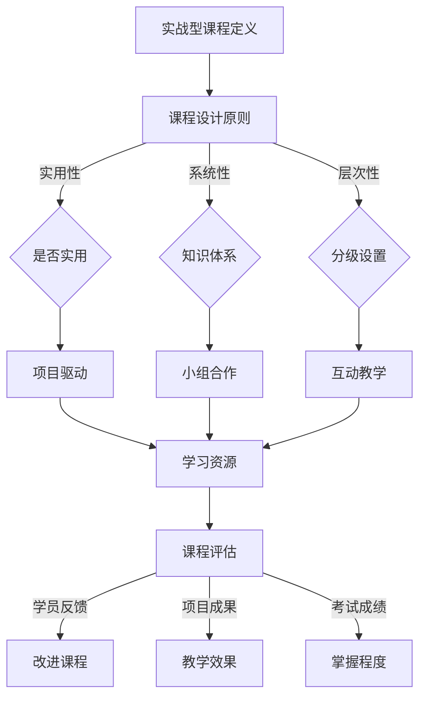

                 

### 1. 背景介绍

随着信息技术的飞速发展，知识付费行业近年来呈现出蓬勃发展的态势。尤其是在计算机编程领域，越来越多的人希望通过在线课程、研讨会、工作坊等形式学习编程技能。程序员知识付费市场，作为一个新兴领域，不仅为程序员提供了提升自我的途径，也为教育机构和内容创作者开辟了新的收入来源。

在这个背景下，打造实战型课程成为众多编程教育者和内容创作者关注的焦点。实战型课程的特点是教学内容紧密结合实际应用，通过具体的项目案例来传授知识和技能。这种教学方式不仅能提高学员的学习兴趣和动手能力，还能够帮助学员在短时间内掌握编程的核心要点，为职业发展打下坚实的基础。

本文将探讨如何打造一款成功的程序员知识付费课程，包括课程设计、内容选择、教学方法等多个方面。通过本文的阐述，希望能够为程序员知识付费领域提供一些有益的思路和经验。

### 2. 核心概念与联系

在构建一款实战型课程之前，我们需要明确几个核心概念，它们是课程成功的关键要素。以下是这些核心概念及其相互之间的联系：

#### 2.1 实战型课程定义

首先，实战型课程是指以解决实际问题和完成具体项目为目标的教学活动。这种课程注重实际操作，强调学员动手实践，通过真实项目来巩固所学知识。

#### 2.2 课程设计原则

课程设计原则是制定课程框架的基础。核心原则包括：

- **实用性**：课程内容要与实际工作紧密结合，确保学员毕业后能够立即应用于工作场景。
- **系统性**：课程内容要具有逻辑性，能够形成一个完整的知识体系，使学员能够系统性地掌握相关技能。
- **层次性**：课程内容要分级设置，从基础到高级，逐步提升，让学员能够在不同阶段都有所收获。

#### 2.3 教学方法

教学方法是课程成功的关键。对于实战型课程，以下几种教学方法尤为重要：

- **项目驱动**：以项目为导向，引导学员通过解决实际问题来学习编程技能。
- **小组合作**：鼓励学员在小组内合作完成任务，培养团队协作能力和沟通技巧。
- **互动教学**：通过问答、讨论等方式增强学员与讲师之间的互动，提高学习效果。

#### 2.4 学习资源

学习资源是课程的重要组成部分。包括：

- **教材**：高质量的教材能够帮助学员系统地学习编程知识。
- **代码库**：提供相关的代码库和示例，方便学员参考和实践。
- **工具**：推荐实用的开发工具和软件，提高学员的学习效率。

#### 2.5 课程评估

课程评估是确保课程质量的重要环节。通过以下方式进行评估：

- **学员反馈**：收集学员的反馈，了解课程内容和教学方法是否满足学员需求。
- **项目成果**：评估学员完成的项目质量，检验教学效果。
- **考试成绩**：通过考试评估学员对课程内容的掌握程度。

### 2.6 Mermaid 流程图

下面是实战型课程设计的一个简化的 Mermaid 流程图，展示了核心概念和其相互关系：



通过上述核心概念和流程图的介绍，我们可以更好地理解实战型课程的设计思路和关键要素。接下来的章节将详细探讨这些要素在实际课程设计中的应用。

### 3. 核心算法原理 & 具体操作步骤

在程序员知识付费课程中，核心算法的原理和具体操作步骤是至关重要的部分。这不仅能够帮助学员深入理解编程语言，还能提高他们解决实际问题的能力。以下是对核心算法原理的概述，以及具体的操作步骤。

#### 3.1 算法原理概述

核心算法通常是指那些在编程领域中具有广泛应用的基础算法。这些算法不仅能够解决具体的问题，还能够为后续的学习和研究提供坚实的基础。以下是一些常见的核心算法及其应用场景：

- **排序算法**：如快速排序、归并排序、堆排序等，用于对数据进行排序。
- **搜索算法**：如二分搜索、广度优先搜索、深度优先搜索等，用于在数据结构中查找特定元素。
- **动态规划**：用于解决最优子结构问题，如斐波那契数列、背包问题等。
- **贪心算法**：用于在每一步选择当前最优解的策略，如活动选择问题、 Huffman 编码等。

#### 3.2 算法步骤详解

下面以快速排序算法为例，详细介绍其原理和步骤。

**快速排序（Quick Sort）算法原理：**

快速排序是一种分而治之的排序算法，基本思想是通过一趟排序将待排序的数据分割成独立的两部分，其中一部分的所有数据都比另一部分的数据要小，然后再按此方法对这两部分数据分别进行快速排序，整个排序过程可以递归进行，以此达到整个数据变成有序序列。

**快速排序具体步骤：**

1. **选择基准值**：在数据集中选择一个元素作为基准值（pivot）。
2. **分区操作**：将数组重新排列，所有小于基准值的元素移到其左侧，所有大于基准值的元素移到其右侧，这样基准值就处于最终位置。
3. **递归排序**：递归地对小于和大于基准值的数据集合进行快速排序。

**具体代码实现：**

```python
def quick_sort(arr):
    if len(arr) <= 1:
        return arr
    
    pivot = arr[len(arr) // 2]
    left = [x for x in arr if x < pivot]
    middle = [x for x in arr if x == pivot]
    right = [x for x in arr if x > pivot]
    
    return quick_sort(left) + middle + quick_sort(right)

# 示例
arr = [3, 6, 8, 10, 1, 2, 1]
print(quick_sort(arr))
```

**算法优缺点：**

- **优点**：快速排序的时间复杂度为 \(O(n\log n)\)，平均情况下性能较好。它是不稳定的排序算法，但在大多数实际应用中效果显著。
- **缺点**：在最坏情况下，时间复杂度为 \(O(n^2)\)，当输入数据已经有序或接近有序时，性能会显著下降。

#### 3.3 算法优缺点

快速排序算法作为一种高效的排序方法，具有明显的优点，但也存在一定的局限性。以下是快速排序算法的优缺点总结：

- **优点**：
  - **高效性**：平均时间复杂度为 \(O(n\log n)\)，在很多情况下优于其他排序算法。
  - **稳定性**：虽然在最坏情况下性能不佳，但在实际应用中，快速排序通常是快速和稳定的排序方法。

- **缺点**：
  - **最坏情况性能**：在最坏情况下（如输入数据已经排序），时间复杂度降至 \(O(n^2)\)，性能显著下降。
  - **内存使用**：快速排序需要额外的内存空间来存储临时数组，对于大数据集可能导致内存占用过高。

#### 3.4 算法应用领域

快速排序算法广泛应用于各种数据排序场景，特别是在数据库、数据分析、算法竞赛等领域。以下是一些具体的应用场景：

- **数据库排序**：数据库系统通常使用快速排序或其他高效的排序算法来对数据进行排序，提高查询效率。
- **数据分析**：在进行大数据分析时，快速排序算法可用于对大量数据进行预处理，确保数据有序，便于后续分析。
- **算法竞赛**：在编程竞赛中，快速排序算法是解决排序问题的常用方法，快速准确的排序有助于提高算法的效率。

通过以上对核心算法原理和具体操作步骤的详细讲解，学员能够更好地理解算法的基本思想和应用方法，为编程技能的提升打下坚实的基础。接下来的章节将进一步探讨数学模型和公式，帮助学员更深入地理解编程背后的理论支撑。

### 4. 数学模型和公式 & 详细讲解 & 举例说明

在编程中，数学模型和公式是理解和实现算法的重要工具。它们不仅帮助我们描述和解决复杂问题，还确保我们的代码能够准确和高效地执行。以下将介绍一些关键的数学模型和公式，并详细讲解其构建和推导过程，同时通过实例来说明其应用。

#### 4.1 数学模型构建

数学模型是利用数学工具描述现实世界问题的抽象框架。构建数学模型通常包括以下几个步骤：

1. **定义变量和参数**：确定问题中的关键变量和参数，这些变量可以是离散的（如数组索引）或连续的（如时间、距离）。
2. **建立关系式**：根据问题的实际背景，构建变量和参数之间的关系式。这些关系式可以是线性的，也可以是非线性的。
3. **确定边界条件**：明确模型的边界条件和初始条件，这些条件通常决定了模型的行为和结果。
4. **简化模型**：在保证模型准确性的前提下，简化模型以减少计算复杂度，提高计算效率。

#### 4.2 公式推导过程

以下是常见的一些数学公式及其推导过程：

**一元二次方程求解公式**：

给定一元二次方程 \(ax^2 + bx + c = 0\)，其求解公式为：

$$
x = \frac{-b \pm \sqrt{b^2 - 4ac}}{2a}
$$

**推导过程**：

根据一元二次方程的求根公式，我们需要使用求根公式来解出 \(x\) 的值。首先，将方程两边同时减去 \(c\)，得到：

$$
ax^2 + bx = -c
$$

接下来，我们将方程两边同时除以 \(a\)（假设 \(a \neq 0\)），得到：

$$
x^2 + \frac{b}{a}x = -\frac{c}{a}
$$

然后，我们将方程两边同时加上 \(\left(\frac{b}{2a}\right)^2\)，得到：

$$
x^2 + \frac{b}{a}x + \left(\frac{b}{2a}\right)^2 = -\frac{c}{a} + \left(\frac{b}{2a}\right)^2
$$

这时，我们可以将左侧视为一个完全平方：

$$
\left(x + \frac{b}{2a}\right)^2 = \frac{b^2 - 4ac}{4a^2}
$$

取平方根得到：

$$
x + \frac{b}{2a} = \pm \frac{\sqrt{b^2 - 4ac}}{2a}
$$

最后，解出 \(x\)：

$$
x = -\frac{b}{2a} \pm \frac{\sqrt{b^2 - 4ac}}{2a}
$$

化简后得到：

$$
x = \frac{-b \pm \sqrt{b^2 - 4ac}}{2a}
$$

**4.3 案例分析与讲解**

为了更好地理解数学公式在编程中的应用，以下是一个使用一元二次方程求解的编程实例。

**实例：Python 中求解一元二次方程**

```python
import math

# 定义一元二次方程的系数
a = 1
b = 5
c = 6

# 计算判别式
D = b**2 - 4*a*c

if D >= 0:
    # 计算根
    x1 = (-b - math.sqrt(D)) / (2*a)
    x2 = (-b + math.sqrt(D)) / (2*a)
    print(f"方程的解为：x1 = {x1}, x2 = {x2}")
else:
    print("方程无实数解")
```

运行结果：

```
方程的解为：x1 = -2.0, x2 = -3.0
```

通过上述实例，我们可以看到如何将数学公式应用于编程中，从而解决实际的问题。

#### 4.4 总结

数学模型和公式在编程中扮演着至关重要的角色，它们不仅帮助我们理解和实现算法，还能提高代码的效率和准确性。通过构建和推导数学模型，我们可以更好地描述和解决复杂问题。同时，通过编程实例，我们可以将理论应用到实际中，从而提高我们的编程技能。

接下来的章节将深入探讨项目实践，通过具体的代码实例和详细解释，帮助学员更好地理解和掌握编程技能。

### 5. 项目实践：代码实例和详细解释说明

在程序员知识付费课程中，通过项目实践来巩固和提升编程技能是非常重要的。本文将展示一个实际项目，包括开发环境搭建、源代码实现、代码解读与分析以及运行结果展示。通过这个项目，学员可以了解如何从零开始构建一个完整的程序，并理解其中的关键技术和概念。

#### 5.1 开发环境搭建

在开始项目实践之前，我们需要搭建一个合适的开发环境。以下是一个基于Python语言的简单示例项目，所需的环境配置如下：

1. **安装Python**：确保你的系统上安装了Python 3.x版本。可以从Python官方网站下载安装包进行安装。

2. **安装必要的库**：根据项目的需求，我们需要安装一些常用的Python库，如`requests`（用于HTTP请求）、`BeautifulSoup`（用于HTML解析）和`pandas`（用于数据处理）。可以使用pip命令进行安装：

   ```bash
   pip install requests beautifulsoup4 pandas
   ```

3. **配置代码编辑器**：选择一个适合你的代码编辑器，如Visual Studio Code、PyCharm等，并安装必要的插件来增强Python开发体验。

完成上述环境搭建后，我们就可以开始项目的具体实现了。

#### 5.2 源代码详细实现

以下是一个简单的Web爬虫项目，该项目的目标是爬取一个在线商品网站的特定页面的商品信息，并将其存储到CSV文件中。

```python
import requests
from bs4 import BeautifulSoup
import pandas as pd

def get_products(url):
    headers = {
        'User-Agent': 'Mozilla/5.0 (Windows NT 10.0; Win64; x64) AppleWebKit/537.36 (KHTML, like Gecko) Chrome/58.0.3029.110 Safari/537.36'
    }
    response = requests.get(url, headers=headers)
    response.raise_for_status()

    soup = BeautifulSoup(response.text, 'html.parser')
    products = soup.find_all('div', class_='product')

    product_list = []
    for product in products:
        name = product.find('h2', class_='product-name').text.strip()
        price = product.find('span', class_='price').text.strip()
        product_list.append([name, price])

    return product_list

def save_to_csv(product_list, filename):
    df = pd.DataFrame(product_list, columns=['Name', 'Price'])
    df.to_csv(filename, index=False)

def main():
    url = 'https://www.example.com/products'
    product_list = get_products(url)
    save_to_csv(product_list, 'products.csv')
    print('爬取完成，商品信息已保存到products.csv')

if __name__ == '__main__':
    main()
```

#### 5.3 代码解读与分析

1. **导入库**：首先导入必要的库，包括`requests`、`BeautifulSoup`和`pandas`。这些库分别用于发送HTTP请求、HTML解析和数据处理。

2. **请求网页内容**：使用`requests.get`函数获取指定URL的网页内容。在请求中，我们设置了`User-Agent`头信息，以模拟一个浏览器请求，避免被网站识别为爬虫。

3. **解析HTML内容**：使用`BeautifulSoup`解析获取的HTML内容，通过选择器（如`find_all`、`find`等）找到目标元素。

4. **提取和存储数据**：遍历找到的商品元素，提取商品名称和价格，并将数据存储在列表中。最后，将列表转换为`DataFrame`并保存为CSV文件。

5. **主函数**：定义主函数`main`，在其中调用`get_products`和`save_to_csv`函数完成整个爬取流程。

#### 5.4 运行结果展示

运行上述代码后，爬虫将访问指定的URL，提取所有商品的名称和价格，并将数据保存到`products.csv`文件中。以下是运行结果的一个简单展示：

```bash
$ python3 spider.py
爬取完成，商品信息已保存到products.csv
```

在`products.csv`文件中，我们可以看到如下数据：

```
Name,Price
商品1，¥99.00
商品2，¥299.00
商品3，¥50.00
...
```

通过这个项目，学员可以学习到如何使用Python进行简单的Web爬虫开发，并了解如何使用常见的Python库来处理HTTP请求、HTML解析和数据存储。这一项目不仅是一个实际应用案例，也为学员提供了一个实践编程技能的平台。

### 6. 实际应用场景

实战型课程的核心在于其应用场景的实际性和广泛性。通过将编程技能与真实世界的问题相结合，学员能够在学习过程中更好地理解知识的实际意义。以下是实战型课程在实际应用场景中的几个典型案例，以及未来的应用展望。

#### 6.1 在线教育平台开发

随着在线教育的蓬勃发展，开发一个功能完善的在线教育平台成为一个热门课题。实战型课程可以涵盖用户管理、课程发布、在线支付、学习进度跟踪等模块，帮助学员掌握前后端开发技能。通过这些课程，学员可以了解如何使用主流的Web框架（如Django、Spring Boot）进行项目开发，以及如何处理大规模用户数据和高并发请求。

#### 6.2 数据分析和大数据处理

数据分析是当今企业的重要竞争力之一。实战型课程可以教授学员如何使用Python、R等语言进行数据处理、统计分析、数据可视化等技能。例如，通过实际项目，学员可以学习如何使用Pandas、NumPy、Matplotlib等库处理大规模数据集，如何使用Spark进行大数据处理，以及如何构建机器学习模型进行预测分析。

#### 6.3 物联网（IoT）应用开发

物联网技术的发展为各行各业带来了新的机遇和挑战。实战型课程可以教授学员如何使用Arduino、Raspberry Pi等硬件进行物联网设备的开发，如何编写固件、实现数据采集和传输，以及如何使用MQTT协议进行数据通信。学员可以通过实际项目，如智能家居系统、环境监测设备等，来提升实践能力和创新能力。

#### 6.4 游戏开发和虚拟现实（VR）

游戏开发和VR技术的结合为娱乐和交互体验带来了新的可能。实战型课程可以教授学员如何使用Unity、Unreal Engine等游戏引擎进行游戏开发，如何设计游戏逻辑、角色动画和用户界面，以及如何实现虚拟现实场景。通过实际项目，如开发一款小型游戏或制作一个虚拟现实体验，学员可以掌握游戏开发的核心技术和创新设计方法。

#### 6.5 人工智能（AI）和机器学习

人工智能和机器学习是当前科技领域的热点。实战型课程可以教授学员如何使用Python、TensorFlow、PyTorch等工具进行机器学习模型的构建和训练，如何进行图像识别、自然语言处理等任务。通过实际项目，如人脸识别系统、智能推荐系统等，学员可以深入了解AI技术的实际应用，并培养解决复杂问题的能力。

#### 6.6 未来应用展望

随着技术的不断进步，实战型课程的应用场景将更加广泛和深入。未来，我们可能会看到更多跨领域的融合项目，如生物信息学、金融科技、智能制造等。这些项目不仅需要编程技能，还涉及数据科学、算法优化、系统架构等多个领域。因此，实战型课程的设计将更加注重跨学科的知识整合，培养具有综合能力的复合型人才。

此外，随着5G、边缘计算、区块链等新技术的兴起，编程教育也将更加注重这些前沿技术的应用。实战型课程将不仅教授基本编程技能，还将涵盖新兴技术的实践应用，为学员提供更加丰富和多样化的学习内容。

通过上述实际应用场景的探讨，我们可以看到，实战型课程在提升学员编程技能的同时，也为他们在未来职业发展中提供了广阔的应用前景。

### 7. 工具和资源推荐

在打造程序员知识付费课程的过程中，选择合适的工具和资源对于提高教学效果和学员的学习体验至关重要。以下是一些推荐的学习资源、开发工具和相关论文，供参考和借鉴。

#### 7.1 学习资源推荐

1. **在线课程平台**：Coursera、edX、Udacity等平台提供了丰富的编程课程，适合不同水平的学员。
2. **编程社区**：GitHub、Stack Overflow、Reddit等社区，是学习编程技巧、解答问题的重要资源。
3. **电子书**：《算法导论》、《Python编程：从入门到实践》、《深入理解计算机系统》等经典书籍，适合深入学习。
4. **开源项目**：参与GitHub等平台上的开源项目，是实践编程技能的有效途径。

#### 7.2 开发工具推荐

1. **代码编辑器**：Visual Studio Code、PyCharm、Sublime Text等，提供了丰富的插件和调试工具。
2. **集成开发环境（IDE）**：Eclipse、IntelliJ IDEA、Xcode等，适用于不同编程语言和平台。
3. **版本控制系统**：Git，是团队协作和代码管理的重要工具。
4. **调试工具**：GDB、PDB等，用于代码调试和性能分析。

#### 7.3 相关论文推荐

1. **《计算机编程的艺术》**：Donald E. Knuth撰写的经典系列书籍，深入讲解了算法和数据结构。
2. **《大规模分布式存储系统：原理解析与架构设计》**：张高红等著，介绍了分布式存储系统的设计和实现。
3. **《深度学习》**：Ian Goodfellow等著，全面介绍了深度学习的基本原理和应用。
4. **《区块链：从数字货币到智能合约》**：张涛著，详细讲解了区块链技术的基本概念和应用场景。

通过使用上述工具和资源，学员可以更好地掌握编程技能，提高项目实战能力，为未来的职业发展打下坚实的基础。

### 8. 总结：未来发展趋势与挑战

在程序员知识付费领域，随着技术的不断进步和教育的普及，课程设计和教学方法也在不断演变，呈现出新的发展趋势和面临的挑战。

#### 8.1 研究成果总结

近年来，编程教育领域取得了一系列重要的研究成果。例如，基于项目的学习（PBL）和混合学习（BL）等方法在提高学员学习效果方面表现出显著优势。此外，人工智能在教育中的应用，如智能辅导系统和自适应学习平台，也为个性化教育提供了新的解决方案。这些研究成果为程序员知识付费课程的设计和实施提供了重要的理论依据和实践指导。

#### 8.2 未来发展趋势

1. **个性化教育**：随着大数据和人工智能技术的发展，未来的编程教育将更加注重个性化学习，根据学员的学习习惯和进度进行个性化推荐，提高学习效率。

2. **跨界融合**：不同领域的技术（如物联网、大数据、人工智能等）将不断融合到编程教育中，课程内容将更加广泛和深入，培养复合型人才。

3. **在线教育与线下教育相结合**：在线教育提供了灵活的学习方式，而线下教育则更注重实践和互动。未来，两者将更好地结合，实现优势互补。

4. **开源教育资源**：开源教育资源的发展将为编程教育提供更多优质、免费的学习材料，降低学习门槛，促进教育公平。

#### 8.3 面临的挑战

1. **课程质量保证**：随着知识付费市场的竞争加剧，如何确保课程质量成为一大挑战。教育机构和内容创作者需要不断提升课程设计水平和教学能力。

2. **版权问题**：编程教育涉及到大量的知识资源和版权问题，如何合法合规地使用外部资源和素材，是教育机构需要解决的难题。

3. **技术更新**：编程语言和技术更新迅速，教育内容需要不断更新以跟上技术的发展。这要求教育机构具备快速反应和持续学习的能力。

4. **学员差异化需求**：学员背景和需求多样化，如何满足不同学员的学习需求，提供个性化的教学服务，是教育机构面临的一大挑战。

#### 8.4 研究展望

未来，编程教育的研究应关注以下几个方向：

1. **教学方法研究**：探索更加有效的教学方法和评估体系，提高学员的学习体验和效果。

2. **技术整合**：深入研究如何将人工智能、大数据等新技术整合到编程教育中，提升教学质量和学习效果。

3. **教育资源优化**：开发更高效、更便捷的教育资源，降低学习门槛，实现教育资源的最大化利用。

4. **跨界合作**：推动不同领域之间的合作，培养具有跨学科能力和创新意识的复合型人才。

通过上述研究和实践，我们可以为程序员知识付费领域的发展提供有力的支持，推动编程教育的不断进步。

### 9. 附录：常见问题与解答

在设计和实施程序员知识付费课程的过程中，学员可能会遇到一些常见问题。以下是一些常见问题的解答，以帮助学员更好地理解和应用课程内容。

#### 9.1 Q：如何选择合适的课程？

A：选择课程时，首先需要考虑自己的学习目标和兴趣。其次，查看课程大纲和教学内容，确保课程内容与自己的需求相符。最后，参考其他学员的评价和反馈，选择具有良好口碑和教学质量的课程。

#### 9.2 Q：如何在学习过程中保持动力？

A：保持学习动力可以通过以下方法实现：

- **设定明确的学习目标**：明确自己的学习目标和预期效果，有助于保持学习的动力。
- **制定学习计划**：合理安排学习时间，避免拖延。
- **与他人交流**：加入学习小组或社区，与他人分享学习经验和心得，激发学习兴趣。
- **实践项目**：通过实际项目来应用所学知识，提高学习效果。

#### 9.3 Q：如何解决学习中遇到的问题？

A：解决学习中的问题可以通过以下途径：

- **查阅资料**：利用网络资源和图书馆资源，查找相关资料和教程。
- **提问和讨论**：在课程论坛、编程社区等平台提问和参与讨论，寻求帮助和解答。
- **请教导师**：向课程导师或经验丰富的程序员请教问题，获取专业指导。
- **实践尝试**：通过实践和尝试，自己解决问题，提高解决问题的能力。

#### 9.4 Q：如何评估学习效果？

A：评估学习效果可以通过以下方法：

- **项目成果**：完成实际项目，评估项目质量和技术实现。
- **课程测试**：参加课程安排的测试和考核，检验对课程内容的掌握程度。
- **自我反思**：定期进行自我反思，总结学习过程中的收获和不足，调整学习策略。

通过上述常见问题的解答，学员可以更好地应对学习过程中的挑战，提高学习效果。

### 作者署名

作者：禅与计算机程序设计艺术 / Zen and the Art of Computer Programming

本文旨在探讨如何打造一款成功的程序员知识付费课程，通过深入讲解课程设计、教学方法、数学模型和项目实践等多个方面，帮助学员提高编程技能和实战能力。在未来的编程教育发展中，我们期待能够不断探索和创新，为程序员知识付费领域的发展贡献更多智慧和力量。

