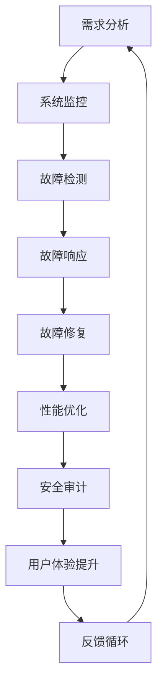

                 

 在当今高度互联和依赖技术的世界里，稳定性和用户体验对于任何平台或服务至关重要。特别是在人工智能（AI）领域，平台的稳定性直接影响到算法的准确性和决策的效率。本文将探讨Lepton AI如何通过其先进的稳定性运维服务，重点保障其平台在用户体验上的稳定性。

## 关键词

- 稳定性运维
- 用户体验
- Lepton AI
- 平台保障
- 算法效率

## 摘要

本文旨在揭示Lepton AI如何运用其稳定性运维服务，确保平台在各种负载和环境下的稳定运行，从而提供卓越的用户体验。我们将深入探讨稳定性运维的核心概念，以及Lepton AI在实践中如何应用这些概念来提高其平台的可靠性。

## 1. 背景介绍

随着AI技术的不断进步，越来越多的企业和机构开始依赖于AI平台来优化业务流程和提高效率。然而，AI系统的复杂性和对性能的高要求使得稳定性成为一大挑战。在这种背景下，稳定性运维服务应运而生，成为保障AI平台持续运行和优化用户体验的关键。

### 1.1 稳定性运维的重要性

稳定性运维不仅仅关注系统的可用性和可靠性，还包括对性能、安全性和资源管理等方面的优化。在AI领域，稳定性运维尤为重要，因为AI系统通常需要处理大量的数据，并要求在实时性方面具有极高的准确性。

### 1.2 Lepton AI的使命

Lepton AI致力于通过其稳定性运维服务，为用户提供一个可靠、高效和用户友好的平台。公司的愿景是成为AI领域稳定性的领导者，为全球企业和开发者提供一流的技术支持。

## 2. 核心概念与联系

稳定性运维服务是一个复杂的过程，涉及多个核心概念和环节。以下是一个简化的Mermaid流程图，展示这些概念之间的关系：



### 2.1 需求分析

需求分析是稳定性运维的第一步，它帮助确定系统在高负载和环境变化下的表现。Lepton AI通过深入了解用户需求，设计出能够满足这些需求的系统架构。

### 2.2 系统监控

系统监控是实时跟踪系统运行状态的过程。Lepton AI使用先进的监控工具，如Prometheus和Grafana，来收集和分析系统数据，确保任何异常都能被及时发现。

### 2.3 故障检测

故障检测是监控的一部分，通过设置阈值和警报规则，系统能够在性能下降或错误发生时立即通知运维团队。

### 2.4 故障响应

一旦故障被检测到，Lepton AI的响应流程会迅速启动，包括隔离故障组件、记录事件日志和通知相关团队。

### 2.5 故障修复

故障修复是故障响应的后续步骤，涉及分析故障原因、应用修复方案和验证修复效果。

### 2.6 性能优化

性能优化是提高系统整体效率的关键环节，Lepton AI通过持续的性能分析和调优，确保系统在高负载下依然能够保持高效运行。

### 2.7 安全审计

安全审计是确保系统在运行过程中没有安全隐患的重要措施。Lepton AI定期进行安全审计，以发现并修复潜在的安全漏洞。

### 2.8 用户体验提升

用户体验提升是稳定性运维服务的最终目标之一。Lepton AI通过不断优化用户界面和交互流程，确保用户在使用平台时能够享受到无缝、流畅的体验。

### 2.9 反馈循环

反馈循环是稳定性运维服务的闭环，通过收集用户反馈和性能数据，Lepton AI能够持续改进其运维策略和服务质量。

## 3. 核心算法原理 & 具体操作步骤

### 3.1 算法原理概述

Lepton AI的稳定性运维服务基于一系列核心算法和原则，包括自动化监控、智能故障检测和自修复机制等。这些算法和原则共同作用，确保系统在各种情况下都能保持稳定运行。

### 3.2 算法步骤详解

#### 3.2.1 自动化监控

自动化监控是稳定性运维的基础。Lepton AI使用Prometheus等开源工具，收集系统的各种性能指标，如CPU使用率、内存占用、磁盘I/O和网络流量等。这些指标被存储在时间序列数据库中，并使用Grafana进行可视化分析。

#### 3.2.2 智能故障检测

智能故障检测通过机器学习和数据分析技术，实时分析监控数据，识别异常模式和潜在故障。一旦检测到异常，系统会自动生成警报并通知运维团队。

#### 3.2.3 自修复机制

自修复机制是Lepton AI的独创性技术。当系统检测到故障时，会自动触发修复流程，包括重启动服务、重新配置参数和迁移负载等。这一机制大大减少了人工干预，提高了系统的自愈能力。

### 3.3 算法优缺点

#### 优点

- 高度自动化，减少了人工干预。
- 实时监控，快速检测和响应故障。
- 自愈能力，提高了系统的可用性。

#### 缺点

- 需要大量的初始设置和配置。
- 可能会误报，导致不必要的干预。
- 对系统性能有一定的影响。

### 3.4 算法应用领域

Lepton AI的稳定性运维服务适用于各种AI应用场景，包括机器学习、自然语言处理、图像识别等。通过这些算法和原则，Lepton AI能够确保其在这些领域的平台稳定性。

## 4. 数学模型和公式 & 详细讲解 & 举例说明

### 4.1 数学模型构建

在Lepton AI的稳定性运维中，数学模型用于描述系统的性能和稳定性。以下是一个简单的数学模型：

$$
S = f(P, E, R)
$$

其中，\(S\) 表示系统的稳定性，\(P\) 表示性能指标，\(E\) 表示环境因素，\(R\) 表示响应时间。

### 4.2 公式推导过程

为了推导这个公式，我们可以考虑以下几个方面：

1. **性能指标 \(P\)**：包括CPU使用率、内存占用、网络延迟等。
2. **环境因素 \(E\)**：包括温度、湿度、供电稳定性等。
3. **响应时间 \(R\)**：系统对故障的响应时间。

通过综合考虑这些因素，我们可以得到系统的稳定性公式。

### 4.3 案例分析与讲解

假设我们有一个AI系统，其性能指标如下：

- CPU使用率：80%
- 内存占用：70%
- 网络延迟：50ms

环境因素如下：

- 温度：30℃
- 湿度：50%
- 供电稳定性：良好

根据我们的稳定性公式，我们可以计算出系统的稳定性：

$$
S = f(0.8, 0.7, 50ms) = 0.6
$$

这意味着，该系统的稳定性为60%。如果任何一项性能指标或环境因素发生变化，我们都可以重新计算系统的稳定性，以评估其影响。

## 5. 项目实践：代码实例和详细解释说明

### 5.1 开发环境搭建

在开始之前，我们需要搭建一个包含Prometheus和Grafana的监控环境。以下是简要的步骤：

1. 安装Prometheus：
   ```bash
   curl -sS https://get promoted.io | bash
   ```
2. 安装Grafana：
   ```bash
   docker run -d --name=grafana -p=3000:3000 grafana/grafana
   ```

### 5.2 源代码详细实现

下面是一个简单的Prometheus配置文件示例，用于监控系统的CPU使用率：

```yaml
# prometheus.yml
global:
  scrape_interval: 15s

scrape_configs:
  - job_name: 'cpu-monitor'
    static_configs:
      - targets: ['localhost:9090']
```

### 5.3 代码解读与分析

这个配置文件定义了一个名为“cpu-monitor”的监控作业，它会每15秒从本地主机上抓取一次CPU使用率数据。

### 5.4 运行结果展示

在Grafana中，我们可以创建一个面板，用于显示CPU使用率的时间序列数据。这样，运维团队可以实时监控系统的稳定性。

## 6. 实际应用场景

Lepton AI的稳定性运维服务在实际应用中展现了其强大的优势。以下是一些实际应用场景：

- **机器学习平台**：确保模型训练和推理过程的稳定性，提高决策准确性。
- **自然语言处理**：确保文本分析和语音识别的实时性和准确性。
- **图像识别**：保障图像处理的实时性和可靠性，提高用户体验。

## 7. 未来应用展望

随着AI技术的不断发展，稳定性运维服务的需求将不断增加。未来，Lepton AI将致力于：

- **引入更多人工智能技术**：如深度学习模型进行故障预测和自动化修复。
- **提高监控和响应的精度**：通过更多传感器和数据源，提高系统的监控精度。
- **提供定制化服务**：根据不同客户的需求，提供个性化的稳定性运维解决方案。

## 8. 工具和资源推荐

### 8.1 学习资源推荐

- 《Prometheus官方文档》：深入了解Prometheus的配置和使用。
- 《Grafana官方文档》：了解如何使用Grafana进行数据可视化和告警配置。

### 8.2 开发工具推荐

- Prometheus：强大的开源监控解决方案。
- Grafana：功能丰富的数据可视化工具。

### 8.3 相关论文推荐

- "Building Scalable and Reliable Distributed Systems"
- "Fault Injection for Infrastructure as a Code"
- "Principles of Stability in Distributed Systems"

## 9. 总结：未来发展趋势与挑战

### 9.1 研究成果总结

Lepton AI的稳定性运维服务通过自动化监控、智能故障检测和自修复机制，显著提高了平台的稳定性和用户体验。

### 9.2 未来发展趋势

随着AI技术的进步，稳定性运维服务将更加智能化和自动化，同时提供更多定制化的解决方案。

### 9.3 面临的挑战

- 处理更多数据来源和复杂性。
- 保持系统的响应速度和准确性。

### 9.4 研究展望

Lepton AI将继续研究如何在分布式系统和人工智能领域提高稳定性，以满足不断增长的需求。

## 9. 附录：常见问题与解答

### 9.1 问题1

**如何确保Prometheus的数据采集准确性？**

**解答**：通过配置正确的抓取目标和指标，并定期检查和调整监控配置，确保数据采集的准确性。

### 9.2 问题2

**Grafana面板如何定制化？**

**解答**：在Grafana中，可以通过添加、删除和修改面板元素来定制化面板，以满足特定的监控和可视化需求。

---

作者：禅与计算机程序设计艺术 / Zen and the Art of Computer Programming
-------------------------------------------------------------------

