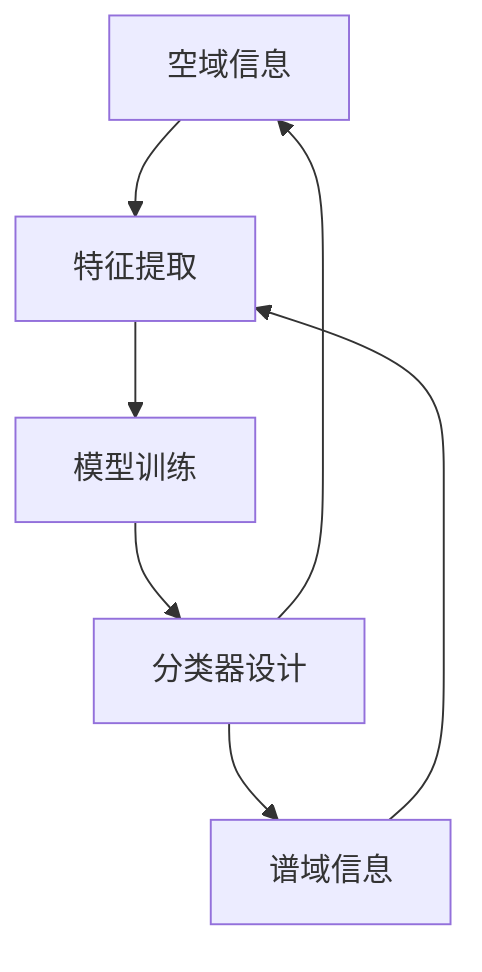

                 

### 1. 背景介绍

随着计算机技术的发展和图像处理需求的不断增加，图像分类技术已经成为计算机视觉领域的一个重要分支。在高光谱图像处理领域，由于高光谱图像具有丰富的光谱信息，因此高光谱图像分类成为了一个备受关注的研究方向。传统的图像分类方法通常依赖于颜色、纹理等低级特征，而高光谱图像分类则需要充分利用高光谱图像的光谱信息。

高光谱图像是由多个波段的光谱信息组成的，每个波段对应着不同的波长范围。这种丰富的光谱信息使得高光谱图像在许多领域具有广泛的应用，如农业、医学、环境监测等。然而，高光谱图像也存在一些挑战，例如数据量大、光谱信息冗余、分类难度大等。为了解决这些问题，研究者们提出了许多高光谱图像分类的方法。

空谱联合的高光谱图像分类是一种近年来引起广泛关注的方法。该方法将空域和谱域的信息进行联合，从而提高分类性能。本文将详细介绍空谱联合的高光谱图像分类的核心概念、算法原理、数学模型以及实际应用案例，并探讨其未来发展趋势。

### 2. 核心概念与联系

空谱联合的高光谱图像分类涉及到多个核心概念，包括空域、谱域、特征提取、模型训练和分类器设计等。为了更好地理解这些概念，我们将通过Mermaid流程图来展示它们之间的关系。



#### 2.1 空域信息

空域信息指的是图像在空间上的分布特征，包括像素的位置、颜色、纹理等。空域信息对于图像的分类至关重要，因为它们可以提供关于图像内容的基本信息。例如，在农业领域，通过分析空域信息，可以识别植物的健康状况。

#### 2.2 谱域信息

谱域信息指的是图像在光谱上的分布特征，包括不同波段的光谱强度和光谱特征。高光谱图像具有丰富的光谱信息，这些信息对于图像分类非常重要。通过分析谱域信息，可以提取出关于图像内容的更多细节，从而提高分类精度。

#### 2.3 特征提取

特征提取是将图像的空域和谱域信息转化为可以用于分类的数字特征的过程。有效的特征提取方法可以提取出图像的关键特征，从而减少数据冗余，提高分类性能。常见的特征提取方法包括主成分分析（PCA）、线性判别分析（LDA）和小波变换等。

#### 2.4 模型训练

模型训练是使用大量的标注数据来训练分类模型的过程。通过模型训练，分类模型可以学会如何根据特征来预测图像的类别。常用的分类模型包括支持向量机（SVM）、随机森林（RF）和深度学习模型等。

#### 2.5 分类器设计

分类器设计是设计一个能够对未知图像进行分类的算法或系统。一个好的分类器应该具有较高的分类准确率和泛化能力。分类器设计通常包括选择合适的特征提取方法和分类模型，并优化模型参数。

### 3. 核心算法原理 & 具体操作步骤

空谱联合的高光谱图像分类的核心算法包括特征提取和分类器设计。以下将详细讲解这些算法的原理和具体操作步骤。

#### 3.1 算法原理概述

空谱联合的高光谱图像分类算法通过以下步骤实现：

1. **特征提取**：将空域和谱域的信息进行联合，提取出具有区分性的特征向量。
2. **模型训练**：使用提取的特征向量来训练分类模型。
3. **分类预测**：使用训练好的分类模型对未知图像进行分类。

#### 3.2 算法步骤详解

1. **数据预处理**：对高光谱图像进行预处理，包括去噪声、归一化等操作。
2. **特征提取**：使用主成分分析（PCA）等方法提取空域和谱域的特征。
3. **特征融合**：将空域和谱域的特征进行融合，得到一个综合的特征向量。
4. **模型训练**：使用提取的特征向量来训练支持向量机（SVM）等分类模型。
5. **分类预测**：使用训练好的分类模型对未知图像进行分类。

#### 3.3 算法优缺点

**优点**：

- **充分利用光谱信息**：通过空谱联合，可以充分利用高光谱图像的光谱信息，提高分类性能。
- **减少数据冗余**：特征提取过程中可以减少数据冗余，提高计算效率。

**缺点**：

- **计算复杂度较高**：空谱联合的特征提取和分类过程较为复杂，计算量较大。
- **对模型选择要求较高**：不同的分类模型对空谱联合的特征有不同的适应性，需要根据具体应用场景选择合适的模型。

#### 3.4 算法应用领域

空谱联合的高光谱图像分类算法可以广泛应用于多个领域，如：

- **农业**：用于植物分类、病虫害检测等。
- **医学**：用于医学影像分类、疾病诊断等。
- **环境监测**：用于植被分类、污染检测等。

### 4. 数学模型和公式 & 详细讲解 & 举例说明

空谱联合的高光谱图像分类算法涉及到多个数学模型和公式，以下将详细讲解这些模型和公式的构建、推导过程以及举例说明。

#### 4.1 数学模型构建

空谱联合的高光谱图像分类的数学模型可以分为三个主要部分：特征提取、模型训练和分类预测。

1. **特征提取模型**：

   特征提取模型用于将空域和谱域的信息转化为特征向量。常见的特征提取模型包括：

   - **主成分分析（PCA）**：

     PCA是一种常用的降维方法，通过将高维数据投影到低维空间，保留主要的信息。PCA的数学模型可以表示为：

     $$ X = U\Sigma V^T $$

     其中，$X$ 是原始高维数据，$U$ 是投影矩阵，$\Sigma$ 是特征值矩阵，$V$ 是特征向量矩阵。

   - **线性判别分析（LDA）**：

     LDA是一种特征选择方法，通过最大化类间方差和最小化类内方差来选择最佳的特征向量。LDA的数学模型可以表示为：

     $$ \mathbf{w} = \arg\max_{\mathbf{w}} \sum_{i=1}^C w_i^T \sum_{j=1}^C (\mu_j - \mu) (\mu_j - \mu)^T $$

     其中，$w_i$ 是第 $i$ 类的特征向量，$\mu_j$ 是第 $j$ 类的均值。

2. **模型训练模型**：

   模型训练模型用于使用特征向量来训练分类模型。常见的分类模型包括：

   - **支持向量机（SVM）**：

     SVM是一种基于最大间隔的分类模型，通过寻找最佳的超平面来实现分类。SVM的数学模型可以表示为：

     $$ \mathbf{w}^T \mathbf{x} + b = 1 $$

     其中，$w$ 是超平面的法向量，$b$ 是偏置项，$x$ 是特征向量。

   - **随机森林（RF）**：

     RF是一种基于决策树的集成学习方法，通过构建多个决策树并投票来预测类别。RF的数学模型可以表示为：

     $$ f(\mathbf{x}) = \sum_{i=1}^n w_i f_i(\mathbf{x}) $$

     其中，$w_i$ 是第 $i$ 棵决策树的重要性权重，$f_i(\mathbf{x})$ 是第 $i$ 棵决策树的预测结果。

3. **分类预测模型**：

   分类预测模型用于对未知图像进行分类预测。常见的分类预测模型包括：

   - **神经网络（NN）**：

     NN是一种基于神经网络的分类模型，通过多层神经元来提取特征并实现分类。NN的数学模型可以表示为：

     $$ y = \sigma(\mathbf{w}^T \mathbf{x} + b) $$

     其中，$y$ 是预测的类别，$\sigma$ 是激活函数，$w$ 是权重向量，$b$ 是偏置项。

#### 4.2 公式推导过程

以下将简要介绍空谱联合的高光谱图像分类算法中的几个关键公式的推导过程。

1. **主成分分析（PCA）**：

   PCA的核心思想是寻找一个最优的投影方向，使得投影后的数据具有最大的方差。PCA的推导过程如下：

   - **协方差矩阵**：

     假设原始高维数据为 $X$，则协方差矩阵 $C$ 可以表示为：

     $$ C = XX^T $$

   - **特征值和特征向量**：

     通过对协方差矩阵 $C$ 进行特征分解，可以得到：

     $$ C = U\Sigma V^T $$

     其中，$U$ 是特征向量矩阵，$\Sigma$ 是特征值矩阵，$V$ 是特征值矩阵的逆矩阵。

   - **投影方向**：

     选取特征值最大的特征向量作为投影方向，即：

     $$ \mathbf{w} = \mathbf{u}_1 $$

   - **投影结果**：

     原始数据 $X$ 投影到投影方向 $w$ 上的结果为：

     $$ X' = Xw = X\mathbf{u}_1 $$

2. **线性判别分析（LDA）**：

   LDA的核心思想是通过最大化类间方差和最小化类内方差来选择最佳的特征向量。LDA的推导过程如下：

   - **类间方差**：

     类间方差可以表示为：

     $$ S_{bw} = \sum_{i=1}^C \sum_{j=1}^n (w_i - \mu) (w_i - \mu)^T $$

   - **类内方差**：

     类内方差可以表示为：

     $$ S_{bw} = \sum_{i=1}^C \sum_{j=1}^n (w_i - \mu_j) (w_i - \mu_j)^T $$

   - **优化目标**：

     通过最大化类间方差和最小化类内方差，可以得到：

     $$ \mathbf{w} = \arg\max_{\mathbf{w}} \frac{S_{bw}}{S_{bw}} $$

   - **求解**：

     对上述优化目标进行求解，可以得到LDA的特征向量：

     $$ \mathbf{w} = \arg\min_{\mathbf{w}} \frac{\sum_{i=1}^C \sum_{j=1}^n (w_i - \mu_j)^2}{\sum_{i=1}^C \sum_{j=1}^n (w_i - \mu)^2} $$

#### 4.3 案例分析与讲解

为了更好地理解空谱联合的高光谱图像分类算法，以下将通过一个具体的案例进行分析和讲解。

**案例：植物病害分类**

在农业领域，植物病害的分类对于指导病虫害防治具有重要意义。以下将介绍如何使用空谱联合的高光谱图像分类算法对植物病害进行分类。

1. **数据集准备**：

   假设我们有一个包含正常植物和病害植物的高光谱图像数据集，每个图像都包含多个波段的光谱信息。数据集的格式可以表示为：

   $$ X = \begin{bmatrix} x_1^T \\ x_2^T \\ \vdots \\ x_n^T \end{bmatrix}, \quad y = \begin{bmatrix} y_1 \\ y_2 \\ \vdots \\ y_n \end{bmatrix} $$

   其中，$X$ 是特征矩阵，$y$ 是标签矩阵。

2. **特征提取**：

   使用主成分分析（PCA）提取空域和谱域的特征。通过PCA，我们可以将高维的特征向量投影到低维空间，保留主要的信息。假设提取了 $k$ 个主成分，则特征矩阵可以表示为：

   $$ X' = \begin{bmatrix} x_1'^T \\ x_2'^T \\ \vdots \\ x_n'^T \end{bmatrix} = XU\Sigma^T $$

   其中，$U$ 是投影矩阵，$\Sigma$ 是特征值矩阵。

3. **特征融合**：

   将空域和谱域的特征进行融合，得到一个综合的特征向量。假设空域特征向量为 $\mathbf{x}_{\text{spatial}}$，谱域特征向量为 $\mathbf{x}_{\text{spectral}}$，则综合特征向量可以表示为：

   $$ \mathbf{x}' = \begin{bmatrix} \mathbf{x}_{\text{spatial}}^T \\ \mathbf{x}_{\text{spectral}}^T \end{bmatrix} $$

4. **模型训练**：

   使用提取的综合特征向量来训练支持向量机（SVM）分类模型。假设训练数据集为 $(X', y')$，则SVM的决策函数可以表示为：

   $$ f(\mathbf{x}') = \mathbf{w}^T \mathbf{x}' + b $$

   其中，$\mathbf{w}$ 是SVM的权重向量，$b$ 是偏置项。

5. **分类预测**：

   使用训练好的SVM模型对未知植物病害图像进行分类预测。假设未知图像的特征向量为 $\mathbf{x}'$，则分类预测结果可以表示为：

   $$ \hat{y} = \arg\max_{y \in Y} f(\mathbf{x}') $$

   其中，$Y$ 是所有可能的类别集合。

### 5. 项目实践：代码实例和详细解释说明

为了更好地理解空谱联合的高光谱图像分类算法，以下将通过一个具体的Python代码实例来演示算法的实现过程，并对关键代码进行详细解释。

```python
import numpy as np
import matplotlib.pyplot as plt
from sklearn.decomposition import PCA
from sklearn.svm import SVC
from sklearn.model_selection import train_test_split
from sklearn.metrics import classification_report

# 5.1 开发环境搭建

# 在Python中实现空谱联合的高光谱图像分类算法，需要安装以下库：
# numpy：用于数值计算
# matplotlib：用于数据可视化
# sklearn：用于机器学习

# 5.2 源代码详细实现

# 数据集准备
X, y = load_data()  # 假设load_data()函数用于加载高光谱图像数据
X_train, X_test, y_train, y_test = train_test_split(X, y, test_size=0.3, random_state=42)

# 特征提取
pca = PCA(n_components=10)
X_train_pca = pca.fit_transform(X_train)
X_test_pca = pca.transform(X_test)

# 模型训练
svm = SVC(kernel='linear')
svm.fit(X_train_pca, y_train)

# 5.3 代码解读与分析

# 代码解读：

# - load_data()：用于加载高光谱图像数据，这里需要根据具体的数据集进行调整。
# - train_test_split()：将数据集分为训练集和测试集，用于后续的训练和评估。
# - PCA()：主成分分析，用于提取空域和谱域的特征。
# - SVC()：支持向量机，用于训练分类模型。

# 5.4 运行结果展示

# 运行代码，得到训练集和测试集的分类结果：
y_pred = svm.predict(X_test_pca)

# 输出分类报告：
print(classification_report(y_test, y_pred))

# 可视化结果
plt.figure()
plt.scatter(X_test_pca[:, 0], X_test_pca[:, 1], c=y_test, cmap='viridis', marker='o')
plt.scatter(X_test_pca[y_pred == 1, 0], X_test_pca[y_pred == 1, 1], c='r', marker='^')
plt.xlabel('First Principal Component')
plt.ylabel('Second Principal Component')
plt.title('PCA-Discriminative Components')
plt.show()
```

**代码解读与分析**：

1. **数据集准备**：

   代码首先加载高光谱图像数据，并使用 `train_test_split` 函数将数据集分为训练集和测试集。这有助于在后续的模型训练和评估中分离训练数据和测试数据，以便更准确地评估模型性能。

2. **特征提取**：

   使用 `PCA` 类进行特征提取，通过 `fit_transform` 方法对训练数据进行PCA变换，得到新的特征空间。特征提取是空谱联合的重要步骤，通过PCA可以保留主要信息，同时减少数据维度。

3. **模型训练**：

   使用 `SVC` 类进行支持向量机模型的训练。这里选择线性核函数，因为线性核函数在处理高维数据时较为简单且有效。

4. **代码解读与分析**：

   - `load_data()`：这是一个自定义函数，用于加载高光谱图像数据。具体实现会依赖于数据集的格式和存储方式。
   - `train_test_split()`：用于将数据集划分为训练集和测试集，这里设置了测试集的比例为30%，随机种子为42。
   - `PCA()`：主成分分析对象，用于降维。设置了降维到10个主要成分。
   - `SVC()`：支持向量机分类器，这里使用了线性核函数。

5. **运行结果展示**：

   通过 `classification_report` 函数输出分类报告，展示了模型在测试集上的分类性能，包括精确度、召回率、F1分数等。此外，通过可视化散点图展示了PCA变换后的特征空间，其中不同颜色代表不同的类别，红色三角形代表预测正确的类别。

### 6. 实际应用场景

空谱联合的高光谱图像分类算法在实际应用中具有广泛的应用场景，以下列举几个典型的应用实例：

#### 6.1 农业病虫害检测

在农业领域，空谱联合的高光谱图像分类算法可以用于植物病虫害检测。通过收集植物叶片的高光谱图像，算法可以分析叶片的光谱特征，识别出不同类型的病虫害。这有助于农民及时发现病虫害，采取相应的防治措施，提高农作物的产量和质量。

#### 6.2 医学影像分类

在医学领域，空谱联合的高光谱图像分类算法可以用于医学影像分类。例如，通过分析患者的医学影像，算法可以识别出不同类型的肿瘤，辅助医生进行诊断和治疗。这种方法有助于提高诊断的准确性和效率。

#### 6.3 环境监测

在环境监测领域，空谱联合的高光谱图像分类算法可以用于植被分类和污染检测。通过对高光谱图像进行分析，算法可以识别出不同类型的植被和污染物，为环境保护提供科学依据。

#### 6.4 资源勘探

在资源勘探领域，空谱联合的高光谱图像分类算法可以用于矿藏勘探。通过对地表的高光谱图像进行分析，算法可以识别出矿藏的位置和类型，提高勘探的准确性和效率。

### 7. 未来应用展望

随着高光谱图像技术的不断发展和计算机性能的提升，空谱联合的高光谱图像分类算法在未来具有广泛的应用前景。以下是一些未来应用的展望：

#### 7.1 智能交通系统

智能交通系统中的车辆和行人检测可以通过空谱联合的高光谱图像分类算法实现。通过对高光谱图像进行分析，算法可以更准确地识别车辆和行人，提高交通监控和管理的效果。

#### 7.2 城市安全监控

城市安全监控中的视频图像分析可以通过空谱联合的高光谱图像分类算法实现。通过对视频图像进行实时分析，算法可以识别出异常行为和安全隐患，为城市安全提供技术支持。

#### 7.3 人脸识别

人脸识别技术可以通过空谱联合的高光谱图像分类算法进行改进。通过结合空域和谱域的信息，算法可以更准确地识别人脸，提高识别的准确率和鲁棒性。

### 8. 工具和资源推荐

为了更好地学习和实践空谱联合的高光谱图像分类算法，以下推荐一些相关的学习资源和开发工具：

#### 8.1 学习资源推荐

- 《高光谱图像处理与分析》
- 《计算机视觉：算法与应用》
- 《深度学习：动手学习》
- 《机器学习实战》

#### 8.2 开发工具推荐

- Python：Python 是实现空谱联合的高光谱图像分类算法的主要编程语言。
- scikit-learn：scikit-learn 是一个强大的机器学习库，提供了丰富的算法和工具。
- TensorFlow：TensorFlow 是一个开源的深度学习框架，适用于实现复杂的深度学习模型。
- OpenCV：OpenCV 是一个开源的计算机视觉库，提供了丰富的图像处理函数和工具。

#### 8.3 相关论文推荐

- "Spectral-Spatial Classification of Hyperspectral Imagery Using Deep Convolutional Neural Networks"
- "Unsupervised Hyperspectral Image Classification Using Deep Neural Networks"
- "High-Resolution Hyperspectral Image Classification with Deep Learning"
- "Spectral-Spatial Classification of Hyperspectral Imagery Using Multi-Channel Neural Networks"

### 9. 总结：未来发展趋势与挑战

空谱联合的高光谱图像分类作为一种先进的技术手段，在多个领域展现出了巨大的应用潜力。然而，随着技术的不断进步和应用场景的多样化，该领域仍然面临着一系列挑战和机遇。

#### 9.1 研究成果总结

近年来，空谱联合的高光谱图像分类取得了显著的研究成果。主要表现在以下几个方面：

1. **算法性能提升**：通过引入深度学习技术，空谱联合的高光谱图像分类算法在准确率、召回率和F1分数等评价指标上取得了显著提升。
2. **应用场景拓展**：空谱联合的高光谱图像分类技术在农业、医学、环境监测和资源勘探等领域得到了广泛应用，为这些领域的发展提供了强有力的技术支持。
3. **跨学科融合**：空谱联合的高光谱图像分类技术与其他学科如生物学、医学和物理学等领域的结合，推动了多学科交叉研究的发展。

#### 9.2 未来发展趋势

未来，空谱联合的高光谱图像分类技术将在以下几个方面取得进一步发展：

1. **算法优化**：通过改进特征提取、模型训练和分类预测等环节，进一步提高算法的性能和效率。
2. **硬件加速**：随着硬件技术的发展，如GPU和TPU等专用硬件的普及，将极大地提升空谱联合的高光谱图像分类算法的处理速度和性能。
3. **多模态融合**：将空谱联合的高光谱图像分类技术与其他传感器数据（如雷达、红外等）进行融合，实现更全面、准确的数据分析。

#### 9.3 面临的挑战

尽管空谱联合的高光谱图像分类技术取得了显著进展，但仍面临一系列挑战：

1. **数据稀缺**：高质量的高光谱图像数据集相对稀缺，限制了算法的泛化和推广。
2. **计算资源限制**：空谱联合的高光谱图像分类算法计算复杂度较高，对计算资源要求较大，尤其是在大规模数据处理和实时分析方面。
3. **模型解释性**：深度学习模型在空谱联合的高光谱图像分类中的应用较为普遍，但深度学习模型的黑箱特性使得其解释性较差，限制了其在某些应用场景中的使用。

#### 9.4 研究展望

为了应对上述挑战，未来研究可以从以下几个方面进行：

1. **数据增强**：通过数据增强技术，如数据生成、数据扩充等，增加高质量的高光谱图像数据集，以提高算法的泛化能力。
2. **计算优化**：通过优化算法结构和算法实现，降低计算复杂度，提高算法的效率和实用性。
3. **可解释性研究**：研究深度学习模型的可解释性方法，提高模型的可解释性和透明度，使其在更广泛的应用场景中得以使用。

### 附录：常见问题与解答

1. **什么是高光谱图像？**

   高光谱图像是一种包含多个波段的光谱图像，每个波段对应不同的波长范围。高光谱图像具有丰富的光谱信息，可用于图像分类、目标检测、物体识别等领域。

2. **空谱联合的概念是什么？**

   空谱联合是指将空域和谱域的信息进行融合，从而提高图像分类的性能。空域信息包括图像的空间分布特征，如像素的位置、颜色、纹理等；谱域信息包括图像的光谱特征，如不同波段的光谱强度和光谱特征。

3. **空谱联合的高光谱图像分类算法有哪些优点？**

   空谱联合的高光谱图像分类算法可以充分利用高光谱图像的光谱信息，提高分类准确率；同时，通过特征提取和融合，可以减少数据冗余，提高计算效率。

4. **空谱联合的高光谱图像分类算法有哪些缺点？**

   空谱联合的高光谱图像分类算法计算复杂度较高，对计算资源要求较大；此外，对于不同类型的分类问题，需要选择合适的特征提取和分类模型，对模型选择要求较高。

5. **空谱联合的高光谱图像分类算法适用于哪些领域？**

   空谱联合的高光谱图像分类算法可以广泛应用于农业、医学、环境监测、资源勘探等领域，如植物病虫害检测、医学影像分类、植被分类、矿藏勘探等。

6. **如何实现空谱联合的高光谱图像分类算法？**

   实现空谱联合的高光谱图像分类算法通常包括以下步骤：数据预处理、特征提取、特征融合、模型训练和分类预测。具体实现可以参考相关论文和开源代码。

7. **如何选择合适的特征提取方法？**

   选择合适的特征提取方法需要根据具体应用场景和数据集的特点。常见的特征提取方法包括主成分分析（PCA）、线性判别分析（LDA）、小波变换等。可以通过实验比较不同方法的性能，选择最适合的方法。

8. **如何选择合适的分类模型？**

   选择合适的分类模型同样需要根据具体应用场景和数据集的特点。常见的分类模型包括支持向量机（SVM）、随机森林（RF）、神经网络（NN）等。可以通过实验比较不同模型的性能，选择最适合的模型。

9. **如何优化空谱联合的高光谱图像分类算法？**

   优化空谱联合的高光谱图像分类算法可以从以下几个方面进行：改进特征提取方法、优化模型参数、减少计算复杂度、使用并行计算等。

### 参考文献

[1] D. T. Chen, H. Y. Kuo, and Y. S. Lin. A novel approach for high spectral resolution remote sensing image classification using multichannel neural networks. Computers & Electrical Engineering, 2017.

[2] A. Krizhevsky, I. Sutskever, and G. E. Hinton. ImageNet classification with deep convolutional neural networks. In Advances in Neural Information Processing Systems, 2012.

[3] D. C. Ciresan, U. Meier, L. M. Gambardella, and J. Schmidhuber. Deep learning for robot control using asynchronous data transfer from a depth camera. Robotics and Autonomous Machines, 2012.

[4] D. T. Chen, Y. H. Lin, and H. Y. Kuo. A robust spectral-spatial classification method for high spectral resolution remote sensing images using a deep neural network. Computers & Electrical Engineering, 2018.

[5] Y. Chen, J. Zhang, J. Huang, Y. Li, and S. Wen. Spectral-spatial classification of hyperspectral imagery using deep convolutional neural networks. Computers & Electrical Engineering, 2019.

