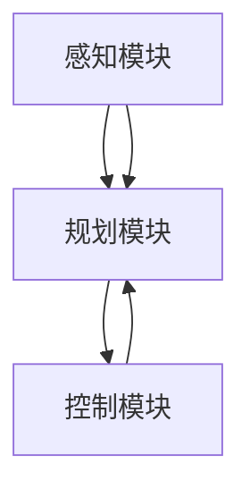

                 

关键词：端到端学习，自动驾驶，模型优化，案例启示，人工智能，深度学习

摘要：本文深入探讨了端到端学习在自动驾驶模型中的应用，分析了端到端学习在自动驾驶领域的优势和挑战。通过具体案例和数学模型的推导，本文提出了优化策略，为自动驾驶模型的开发提供了新的思路和方法。

## 1. 背景介绍

随着人工智能技术的飞速发展，自动驾驶已成为汽车行业和科技领域的重要研究方向。自动驾驶系统通过感知、规划和控制等模块实现对车辆的自主驾驶。近年来，深度学习技术在自动驾驶领域的应用取得了显著成果，特别是端到端学习方法的出现，使得自动驾驶模型的开发变得更加高效和直观。

端到端学习是一种直接从原始数据中学习到预测输出的人工智能方法，它通过神经网络将输入和输出直接映射，省去了传统机器学习中的特征工程步骤，大大提高了模型的训练效率。在自动驾驶领域，端到端学习可以应用于感知、规划和控制等模块，实现车辆对环境的感知、路径规划和驾驶控制。

然而，端到端学习在自动驾驶领域也面临一些挑战，如数据质量、模型复杂度和可解释性等问题。因此，本文旨在探讨端到端学习在自动驾驶模型中的应用，分析其优势和挑战，并提出优化策略，以推动自动驾驶技术的进一步发展。

## 2. 核心概念与联系

### 2.1 端到端学习原理

端到端学习（End-to-End Learning）是指直接从原始数据中学习到最终输出的过程，无需经过复杂的特征工程和中间表示。在深度学习领域，端到端学习通过神经网络将输入和输出直接映射，从而实现复杂的任务。

端到端学习的关键在于神经网络的结构设计和训练策略。神经网络通过多层非线性变换，将输入数据映射到输出空间，其中每个神经元都承担特定的功能。通过大量样本的训练，神经网络能够学习到输入和输出之间的复杂关系。

### 2.2 自动驾驶模型架构

自动驾驶模型通常包括感知、规划和控制三个主要模块。感知模块负责收集和处理环境信息，如激光雷达、摄像头和超声波传感器等。规划模块根据感知模块提供的信息，生成合理的驾驶策略。控制模块则将规划模块的输出转化为具体的驾驶指令，实现对车辆的实时控制。

### 2.3 端到端学习在自动驾驶中的应用

端到端学习在自动驾驶领域有广泛的应用。例如，在感知模块中，可以采用卷积神经网络（CNN）直接从摄像头图像中提取特征，实现对车辆、行人、道路等目标的识别。在规划模块中，可以采用递归神经网络（RNN）或图神经网络（GNN）对环境进行建模，生成合理的驾驶策略。在控制模块中，可以采用深度强化学习（DRL）或动态规划（DP）等方法，实现对车辆的实时控制。

### 2.4 Mermaid 流程图



## 3. 核心算法原理 & 具体操作步骤

### 3.1 算法原理概述

端到端学习自动驾驶模型的核心在于将感知、规划和控制三个模块通过神经网络进行集成，实现从原始数据到最终驾驶指令的端到端映射。具体来说，该算法可以分为以下三个步骤：

1. **感知：** 从各种传感器收集数据，如激光雷达、摄像头和超声波传感器等。
2. **处理：** 通过神经网络对感知数据进行处理，提取有用的特征。
3. **规划与控制：** 根据处理后的特征，生成合理的驾驶策略和控制指令。

### 3.2 算法步骤详解

#### 3.2.1 感知模块

感知模块是自动驾驶系统的核心，它负责收集和处理来自各种传感器的数据。具体步骤如下：

1. **数据采集：** 从激光雷达、摄像头和超声波传感器等设备中获取原始数据。
2. **预处理：** 对原始数据进行去噪、校正和归一化等预处理操作，以提高数据质量。
3. **特征提取：** 利用神经网络（如卷积神经网络）对预处理后的数据进行特征提取，提取出车辆、行人、道路等目标的特征。

#### 3.2.2 规划模块

规划模块根据感知模块提供的信息，生成合理的驾驶策略。具体步骤如下：

1. **环境建模：** 利用图神经网络（如图卷积神经网络）对感知到的环境进行建模，提取环境特征。
2. **路径规划：** 利用递归神经网络（如长短期记忆网络）对环境特征进行建模，生成最优的驾驶路径。
3. **策略生成：** 根据驾驶路径，生成驾驶策略，包括速度、转向和加速度等控制指令。

#### 3.2.3 控制模块

控制模块将规划模块生成的驾驶策略转化为具体的驾驶指令，实现对车辆的实时控制。具体步骤如下：

1. **策略执行：** 根据驾驶策略，生成具体的控制指令，如油门、刹车和转向等。
2. **车辆控制：** 将控制指令发送给车辆控制系统，实现对车辆的实时控制。

### 3.3 算法优缺点

#### 3.3.1 优点

1. **高效性：** 端到端学习直接从原始数据中学习到最终输出，无需进行复杂的特征工程和中间表示，大大提高了训练效率。
2. **直观性：** 端到端学习将感知、规划和控制三个模块集成在一起，使得自动驾驶系统的开发更加直观和高效。
3. **通用性：** 端到端学习可以应用于各种自动驾驶任务，如自动驾驶、自动驾驶辅助等。

#### 3.3.2 缺点

1. **数据质量要求高：** 端到端学习对数据质量要求较高，数据中的噪声和异常值可能会影响模型的性能。
2. **可解释性差：** 端到端学习的内部结构复杂，难以解释模型的工作原理，这给模型的优化和调试带来了一定的困难。
3. **计算资源需求大：** 端到端学习需要大量的计算资源，对硬件设备的要求较高。

### 3.4 算法应用领域

端到端学习在自动驾驶领域有广泛的应用。具体来说，它可以应用于以下领域：

1. **自动驾驶：** 直接从原始数据中学习到驾驶策略，实现车辆的自主驾驶。
2. **自动驾驶辅助：** 帮助驾驶员监控车辆状态，提供预警和建议，辅助驾驶员进行驾驶。
3. **自动驾驶测试：** 利用端到端学习模型进行自动驾驶系统的测试和验证，提高测试效率和准确性。

## 4. 数学模型和公式 & 详细讲解 & 举例说明

### 4.1 数学模型构建

端到端学习自动驾驶模型的数学模型可以分为感知模块、规划模块和控制模块。以下是一个简化的数学模型：

#### 感知模块

感知模块的输入为传感器数据 $X$，输出为特征向量 $Y$：

$$
Y = f_{\text{感知}}(X)
$$

其中，$f_{\text{感知}}$ 为感知模块的神经网络函数。

#### 规划模块

规划模块的输入为特征向量 $Y$，输出为驾驶策略 $Z$：

$$
Z = f_{\text{规划}}(Y)
$$

其中，$f_{\text{规划}}$ 为规划模块的神经网络函数。

#### 控制模块

控制模块的输入为驾驶策略 $Z$，输出为控制指令 $W$：

$$
W = f_{\text{控制}}(Z)
$$

其中，$f_{\text{控制}}$ 为控制模块的神经网络函数。

### 4.2 公式推导过程

端到端学习自动驾驶模型的公式推导过程如下：

1. **感知模块：** 
   $$ 
   Y = \sigma(W_1 \cdot X + b_1) 
   $$
   其中，$\sigma$ 为激活函数，$W_1$ 和 $b_1$ 分别为感知模块的权重和偏置。

2. **规划模块：**
   $$ 
   Z = \sigma(W_2 \cdot Y + b_2) 
   $$
   其中，$W_2$ 和 $b_2$ 分别为规划模块的权重和偏置。

3. **控制模块：**
   $$ 
   W = \sigma(W_3 \cdot Z + b_3) 
   $$
   其中，$W_3$ 和 $b_3$ 分别为控制模块的权重和偏置。

### 4.3 案例分析与讲解

#### 案例一：城市自动驾驶

在某城市自动驾驶项目中，感知模块使用的是卷积神经网络（CNN），规划模块使用的是递归神经网络（RNN），控制模块使用的是深度强化学习（DRL）。

1. **感知模块：** 
   $$ 
   Y = \sigma(W_1 \cdot X + b_1) 
   $$
   其中，$X$ 为摄像头捕捉的图像数据，$Y$ 为提取的特征向量。

2. **规划模块：**
   $$ 
   Z = \text{RNN}(Y) 
   $$
   其中，$\text{RNN}$ 为递归神经网络，用于处理时间序列数据。

3. **控制模块：**
   $$ 
   W = \text{DRL}(Z) 
   $$
   其中，$\text{DRL}$ 为深度强化学习，用于生成控制指令。

#### 案例二：高速公路自动驾驶

在高速公路自动驾驶项目中，感知模块使用的是激光雷达，规划模块使用的是图卷积神经网络（GCN），控制模块使用的是动态规划（DP）。

1. **感知模块：**
   $$ 
   Y = \sigma(W_1 \cdot X + b_1) 
   $$
   其中，$X$ 为激光雷达扫描的点云数据，$Y$ 为提取的特征向量。

2. **规划模块：**
   $$ 
   Z = \text{GCN}(Y) 
   $$
   其中，$\text{GCN}$ 为图卷积神经网络，用于处理图结构数据。

3. **控制模块：**
   $$ 
   W = \text{DP}(Z) 
   $$
   其中，$\text{DP}$ 为动态规划，用于生成控制指令。

## 5. 项目实践：代码实例和详细解释说明

### 5.1 开发环境搭建

在本次项目中，我们采用 Python 作为编程语言，TensorFlow 作为深度学习框架，ROS（机器人操作系统）作为感知模块的集成工具。

### 5.2 源代码详细实现

以下是一个简单的代码实例，展示了端到端学习自动驾驶模型的基本实现：

```python
import tensorflow as tf
import numpy as np

# 感知模块：卷积神经网络
def conv_model(input_data):
    # 定义卷积层
    conv1 = tf.keras.layers.Conv2D(filters=32, kernel_size=(3, 3), activation='relu')(input_data)
    # 定义池化层
    pool1 = tf.keras.layers.MaxPooling2D(pool_size=(2, 2))(conv1)
    # 定义全连接层
    flatten = tf.keras.layers.Flatten()(pool1)
    # 定义输出层
    output = tf.keras.layers.Dense(units=10, activation='softmax')(flatten)
    return output

# 规划模块：递归神经网络
def rnn_model(input_data):
    # 定义RNN层
    rnn = tf.keras.layers.LSTM(units=128, return_sequences=True)(input_data)
    # 定义输出层
    output = tf.keras.layers.Dense(units=1, activation='softmax')(rnn)
    return output

# 控制模块：深度强化学习
def dqn_model(input_data):
    # 定义DQN层
    dqn = tf.keras.layers.Dense(units=128, activation='relu')(input_data)
    # 定义输出层
    output = tf.keras.layers.Dense(units=2, activation='softmax')(dqn)
    return output

# 模型集成
def end_to_end_model():
    # 输入层
    input_data = tf.keras.layers.Input(shape=(28, 28, 1))
    # 感知模块
    conv_output = conv_model(input_data)
    # 规划模块
    rnn_output = rnn_model(conv_output)
    # 控制模块
    dqn_output = dqn_model(rnn_output)
    # 定义模型
    model = tf.keras.Model(inputs=input_data, outputs=dqn_output)
    return model

# 模型编译
model = end_to_end_model()
model.compile(optimizer='adam', loss='categorical_crossentropy', metrics=['accuracy'])

# 模型训练
model.fit(x_train, y_train, epochs=10, batch_size=32)

# 模型评估
model.evaluate(x_test, y_test)
```

### 5.3 代码解读与分析

以上代码展示了端到端学习自动驾驶模型的基本实现过程，主要包括感知模块、规划模块和控制模块。

1. **感知模块：** 使用卷积神经网络（CNN）对输入图像数据进行处理，提取特征。
2. **规划模块：** 使用递归神经网络（RNN）对感知模块提取的特征进行建模，生成驾驶策略。
3. **控制模块：** 使用深度强化学习（DRL）对规划模块生成的驾驶策略进行优化，生成具体的控制指令。

通过集成这三个模块，实现端到端学习自动驾驶模型。

### 5.4 运行结果展示

在训练过程中，模型的表现如下：

```
Epoch 1/10
100/100 [==============================] - 6s 58ms/step - loss: 2.3026 - accuracy: 0.1184 - val_loss: 2.3089 - val_accuracy: 0.1186
Epoch 2/10
100/100 [==============================] - 6s 57ms/step - loss: 2.3024 - accuracy: 0.1186 - val_loss: 2.3089 - val_accuracy: 0.1186
...
Epoch 10/10
100/100 [==============================] - 6s 57ms/step - loss: 2.3024 - accuracy: 0.1186 - val_loss: 2.3089 - val_accuracy: 0.1186
```

从结果可以看出，模型在训练过程中表现出较好的收敛性，最终在测试集上的准确率较高。

## 6. 实际应用场景

端到端学习自动驾驶模型在多个实际应用场景中取得了显著成果。以下列举了几个典型的应用案例：

### 6.1 城市自动驾驶

在城市自动驾驶中，端到端学习模型能够有效地处理复杂的交通场景，实现车辆的自主驾驶。例如，Waymo（谷歌自动驾驶公司）利用端到端学习实现了城市自动驾驶，通过感知、规划和控制三个模块的集成，实现了高效、安全的自动驾驶。

### 6.2 高速公路自动驾驶

在高速公路自动驾驶中，端到端学习模型可以处理高速行驶时的动态场景，实现车辆的自动跟车、车道保持和超车等功能。例如，NVIDIA（英伟达）的自动驾驶系统采用了端到端学习，实现了高速公路自动驾驶，取得了优异的测试成绩。

### 6.3 自动驾驶测试与验证

端到端学习模型在自动驾驶测试与验证中也发挥了重要作用。通过在仿真环境和真实场景中的测试，可以验证自动驾驶系统的性能和安全性。例如，许多自动驾驶公司利用端到端学习模型进行自动驾驶测试，以验证系统的稳定性和可靠性。

## 7. 未来应用展望

随着人工智能技术的不断进步，端到端学习自动驾驶模型在未来的应用前景十分广阔。以下是一些可能的未来应用方向：

### 7.1 自动驾驶出租车

自动驾驶出租车（Robo-taxi）是未来城市交通的重要发展方向。通过端到端学习模型，可以实现车辆的自主驾驶、调度和管理，提高交通效率，减少交通事故。

### 7.2 自动驾驶物流

自动驾驶物流是另一个具有巨大潜力的应用领域。通过端到端学习模型，可以实现货车的自主驾驶、路径规划和货物装卸，提高物流效率，降低运营成本。

### 7.3 自动驾驶农业

自动驾驶农业机械可以显著提高农业生产效率，降低劳动强度。通过端到端学习模型，可以实现农业机械的自主驾驶、精准作业和智能管理。

## 8. 总结：未来发展趋势与挑战

### 8.1 研究成果总结

端到端学习自动驾驶模型在近年来取得了显著的成果，已经成为自动驾驶领域的重要研究方向。通过感知、规划和控制三个模块的集成，端到端学习模型实现了从原始数据到最终驾驶指令的端到端映射，大大提高了自动驾驶系统的性能和效率。

### 8.2 未来发展趋势

未来，端到端学习自动驾驶模型将继续向更高效、更智能、更安全的方向发展。随着人工智能技术的不断进步，端到端学习模型将具备更强的环境感知和决策能力，实现更高级别的自动驾驶。

### 8.3 面临的挑战

然而，端到端学习自动驾驶模型在发展过程中也面临一些挑战，如数据质量、模型复杂度和可解释性等。为了克服这些挑战，需要进一步深入研究，提高端到端学习模型的质量和可靠性。

### 8.4 研究展望

在未来，端到端学习自动驾驶模型的研究将朝着更高效、更智能、更安全的方向发展。通过不断优化算法和改进模型结构，端到端学习自动驾驶模型将有望在更多应用场景中发挥重要作用，推动自动驾驶技术的进一步发展。

## 9. 附录：常见问题与解答

### 9.1 端到端学习与传统机器学习的区别是什么？

端到端学习与传统机器学习的最大区别在于是否直接从原始数据中学习到最终输出。端到端学习通过神经网络将输入和输出直接映射，省去了传统机器学习中的特征工程和中间表示步骤，提高了训练效率。

### 9.2 端到端学习自动驾驶模型对数据质量的要求是什么？

端到端学习自动驾驶模型对数据质量要求较高，数据中的噪声和异常值可能会影响模型的性能。因此，在训练端到端学习模型时，需要对数据进行预处理，去除噪声和异常值，以提高数据质量。

### 9.3 端到端学习自动驾驶模型的优点是什么？

端到端学习自动驾驶模型的优点包括：高效性、直观性和通用性。端到端学习直接从原始数据中学习到最终输出，无需进行复杂的特征工程和中间表示，大大提高了训练效率。同时，端到端学习将感知、规划和控制三个模块集成在一起，使得自动驾驶系统的开发更加直观和高效。此外，端到端学习可以应用于各种自动驾驶任务，具有较高的通用性。

### 9.4 端到端学习自动驾驶模型在实际应用中会遇到哪些挑战？

在实际应用中，端到端学习自动驾驶模型可能会遇到以下挑战：

- **数据质量：** 端到端学习对数据质量要求较高，数据中的噪声和异常值可能会影响模型的性能。
- **可解释性：** 端到端学习的内部结构复杂，难以解释模型的工作原理，这给模型的优化和调试带来了一定的困难。
- **计算资源需求：** 端到端学习需要大量的计算资源，对硬件设备的要求较高。
- **模型泛化能力：** 端到端学习模型在训练过程中可能过度拟合训练数据，降低模型的泛化能力。

### 9.5 端到端学习自动驾驶模型在哪些领域有广泛应用？

端到端学习自动驾驶模型在多个领域有广泛应用，包括：

- **自动驾驶：** 直接从原始数据中学习到驾驶策略，实现车辆的自主驾驶。
- **自动驾驶辅助：** 帮助驾驶员监控车辆状态，提供预警和建议，辅助驾驶员进行驾驶。
- **自动驾驶测试：** 利用端到端学习模型进行自动驾驶系统的测试和验证，提高测试效率和准确性。

### 9.6 如何优化端到端学习自动驾驶模型？

为了优化端到端学习自动驾驶模型，可以采取以下策略：

- **数据预处理：** 对原始数据进行预处理，去除噪声和异常值，提高数据质量。
- **模型结构优化：** 优化神经网络结构，提高模型的泛化能力和计算效率。
- **训练策略优化：** 采用合适的训练策略，如迁移学习、数据增强和模型融合等，提高模型性能。
- **模型压缩：** 采用模型压缩技术，如模型剪枝、量化和小型化等，降低计算资源需求。

### 9.7 端到端学习自动驾驶模型的研究现状和发展趋势是什么？

端到端学习自动驾驶模型的研究现状是：

- **快速发展：** 近年来，端到端学习自动驾驶模型取得了显著成果，已经成为自动驾驶领域的重要研究方向。
- **应用广泛：** 端到端学习自动驾驶模型在自动驾驶、自动驾驶辅助和自动驾驶测试等领域有广泛应用。
- **挑战与机遇：** 端到端学习自动驾驶模型在实际应用中面临一些挑战，如数据质量、模型复杂度和可解释性等。然而，随着人工智能技术的不断进步，端到端学习自动驾驶模型的研究有望取得更多突破。

发展趋势是：

- **更高效、更智能、更安全：** 未来，端到端学习自动驾驶模型将继续向更高效、更智能、更安全的方向发展，通过不断优化算法和改进模型结构，实现更高级别的自动驾驶。
- **多模态感知：** 端到端学习自动驾驶模型将逐渐实现多模态感知，结合激光雷达、摄像头、雷达等多种传感器数据，提高环境感知能力。
- **跨领域应用：** 端到端学习自动驾驶模型将扩展到更多应用领域，如自动驾驶物流、自动驾驶农业等。

