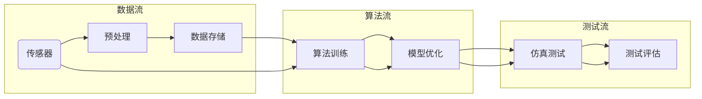

                 

关键词：端到端自动驾驶，仿真测试，全栈平台，深度学习，数据处理，安全性测试，性能优化，自动化测试

> 摘要：本文将深入探讨端到端自动驾驶系统开发中至关重要的仿真测试平台。我们将介绍全栈仿真测试平台的核心概念、架构设计、关键算法以及其实际应用案例，分析其在提高自动驾驶系统安全性、可靠性和性能方面的重要作用，并提出未来发展的趋势和挑战。

## 1. 背景介绍

随着人工智能和深度学习技术的迅猛发展，自动驾驶技术逐渐从理论走向实际应用。自动驾驶系统不仅需要具备高度智能化的感知、决策和执行能力，还需要在各种复杂、多变的环境中保持稳定、可靠地运行。仿真测试平台作为自动驾驶系统开发过程中的重要环节，承担了验证和优化算法性能、评估系统安全性和可靠性的重任。

### 1.1 自动驾驶技术的发展现状

近年来，自动驾驶技术在全球范围内取得了显著的进展。从最初的辅助驾驶到部分自动驾驶，再到现在的完全自动驾驶，技术的发展历程体现了从被动辅助到主动控制的转变。自动驾驶技术涉及多个领域的交叉融合，包括计算机视觉、机器学习、控制理论、传感器技术等。

### 1.2 仿真测试在自动驾驶系统开发中的重要性

仿真测试是自动驾驶系统开发过程中不可或缺的环节。首先，仿真测试可以在虚拟环境中对自动驾驶算法进行反复验证和优化，避免了实际测试中可能带来的高风险和高成本。其次，仿真测试能够模拟各种复杂的驾驶场景，帮助开发人员发现并解决潜在的问题，提高自动驾驶系统的可靠性和安全性。最后，仿真测试提供了量化评估自动驾驶系统性能的指标，为后续的系统优化提供了重要依据。

## 2. 核心概念与联系

### 2.1 核心概念

在构建端到端自动驾驶的全栈仿真测试平台中，以下几个核心概念至关重要：

1. **端到端自动驾驶**：通过深度学习模型直接将原始传感器数据映射到控制信号，实现自动驾驶。
2. **仿真测试平台**：用于模拟真实驾驶环境的软件和硬件集成系统。
3. **全栈**：指的是从数据采集、数据处理、算法训练到测试评估的完整过程。
4. **深度学习**：一种基于神经网络的学习方法，能够从大量数据中自动提取特征并建立复杂的决策模型。

### 2.2 架构设计

端到端自动驾驶的全栈仿真测试平台通常包括以下几个部分：

1. **数据采集与预处理**：通过传感器（如摄像头、激光雷达、GPS等）采集真实驾驶数据，并进行预处理，如降噪、去畸变、数据增强等。
2. **算法训练与优化**：使用深度学习模型对预处理后的数据进行训练，通过优化算法提高模型性能。
3. **仿真测试**：在虚拟环境中对训练好的模型进行测试，模拟各种驾驶场景，评估模型的安全性和可靠性。
4. **测试评估**：基于测试结果，对模型进行调优和改进，形成闭环优化过程。

### 2.3 Mermaid 流程图

以下是一个简化的端到端自动驾驶仿真测试平台的 Mermaid 流程图：



## 3. 核心算法原理 & 具体操作步骤

### 3.1 算法原理概述

端到端自动驾驶的核心算法通常是基于深度学习，特别是卷积神经网络（CNN）和循环神经网络（RNN）的结合。通过直接从传感器数据中学习驾驶规则，避免了传统的分层特征提取过程，提高了模型的效率和准确性。

### 3.2 算法步骤详解

1. **数据采集与预处理**：
    - 使用传感器采集实时数据，包括图像、激光雷达点云、GPS位置信息等。
    - 对采集到的数据去噪、去畸变、缩放、旋转等预处理。

2. **模型训练**：
    - 定义深度学习模型结构，通常包括CNN和RNN层。
    - 使用预处理后的数据训练模型，通过反向传播算法调整模型参数。

3. **模型优化**：
    - 对训练好的模型进行优化，使用不同的优化算法，如梯度下降、Adam等。
    - 通过交叉验证和超参数调整，提高模型性能。

4. **仿真测试**：
    - 在虚拟环境中，根据预设的场景模拟自动驾驶系统的运行。
    - 收集测试数据，包括车辆位置、速度、环境状态等。

5. **测试评估**：
    - 使用测试数据评估模型性能，包括准确率、召回率、F1分数等指标。
    - 根据评估结果调整模型，形成闭环优化。

### 3.3 算法优缺点

**优点**：
- **高效率**：直接从原始数据中学习，避免了复杂的手工特征提取过程。
- **高准确性**：通过深度学习模型，能够自动提取复杂的特征，提高模型性能。

**缺点**：
- **数据需求大**：需要大量的标注数据来训练模型。
- **模型解释性差**：深度学习模型通常具有较低的透明度和解释性。

### 3.4 算法应用领域

- **自动驾驶车辆**：自动驾驶汽车、无人机、机器人等。
- **自动驾驶系统测试**：自动驾驶仿真测试、自动驾驶系统评估等。
- **智能交通系统**：交通流量预测、交通信号控制等。

## 4. 数学模型和公式 & 详细讲解 & 举例说明

### 4.1 数学模型构建

端到端自动驾驶系统的数学模型通常包括以下几个部分：

1. **传感器数据预处理模型**：
    $$ y = f(x; \theta) $$
    其中，$x$ 是原始传感器数据，$y$ 是预处理后的数据，$f$ 是预处理函数，$\theta$ 是预处理参数。

2. **深度学习模型**：
    $$ z = h(Wx + b) $$
    其中，$z$ 是模型的输出，$W$ 和 $b$ 分别是权重和偏置，$h$ 是激活函数。

3. **目标函数**：
    $$ J = \frac{1}{N}\sum_{i=1}^{N} (y_i - \hat{y}_i)^2 $$
    其中，$J$ 是损失函数，$N$ 是样本数量，$y_i$ 是真实标签，$\hat{y}_i$ 是模型预测。

### 4.2 公式推导过程

以卷积神经网络（CNN）为例，公式推导过程如下：

1. **前向传播**：
    - 输入数据 $x$ 通过卷积层、池化层等操作，逐步提取特征。
    - 假设第 $l$ 层的输入为 $x_l$，输出为 $z_l$。
    - $$ z_l = f(W_l x_{l-1} + b_l) $$
    - 其中，$W_l$ 是卷积核，$b_l$ 是偏置。

2. **反向传播**：
    - 计算每一层的梯度，更新模型参数。
    - $$ \delta_l = \frac{\partial J}{\partial z_l} $$
    - $$ W_l = W_l - \alpha \frac{\partial J}{\partial W_l} $$
    - $$ b_l = b_l - \alpha \frac{\partial J}{\partial b_l} $$
    - 其中，$\alpha$ 是学习率。

### 4.3 案例分析与讲解

假设我们有一个自动驾驶系统，需要通过摄像头和激光雷达数据来控制车辆。以下是一个简单的案例：

1. **数据采集**：
    - 采集到的摄像头数据为 $x = [100, 150, 200, 250]$。
    - 激光雷达数据为 $y = [1, 2, 3, 4]$。

2. **预处理**：
    - 对摄像头数据进行归一化处理：
      $$ y = \frac{x - \mu}{\sigma} $$
      假设均值 $\mu = 175$，标准差 $\sigma = 25$。

3. **深度学习模型**：
    - 定义一个简单的全连接神经网络，输入层有两个神经元，输出层有一个神经元。
    - $$ z = f(Wx + b) $$
    - 假设权重 $W = [0.1, 0.2]$，偏置 $b = 0.3$。

4. **模型训练**：
    - 输入数据经过预处理后，通过神经网络计算输出：
      $$ z = 0.1 \cdot 100 + 0.2 \cdot 150 + 0.3 = 32.5 $$
    - 计算损失函数：
      $$ J = \frac{1}{2} \left( z - \hat{y} \right)^2 $$
      假设真实标签 $\hat{y} = 30$。

5. **模型优化**：
    - 计算梯度：
      $$ \delta_z = \frac{\partial J}{\partial z} = 2(z - \hat{y}) = 2(32.5 - 30) = 3 $$
      $$ \delta_W = \frac{\partial J}{\partial W} = \delta_z \cdot x = 3 \cdot [100, 150] = [300, 450] $$
      $$ \delta_b = \frac{\partial J}{\partial b} = \delta_z = 3 $$
    - 更新模型参数：
      $$ W = W - \alpha \delta_W $$
      $$ b = b - \alpha \delta_b $$
      假设学习率 $\alpha = 0.1$。

通过以上步骤，我们使用数学模型对自动驾驶系统进行了简单训练。在实际应用中，模型结构会更为复杂，需要大量的数据和更精细的调整。

## 5. 项目实践：代码实例和详细解释说明

### 5.1 开发环境搭建

为了搭建端到端自动驾驶的全栈仿真测试平台，我们需要准备以下开发环境：

1. **硬件要求**：
    - 高性能计算机，用于算法训练和仿真测试。
    - 传感器设备，如摄像头、激光雷达等。

2. **软件要求**：
    - 操作系统：Linux或Windows。
    - 编程语言：Python。
    - 开发框架：TensorFlow、PyTorch等。

### 5.2 源代码详细实现

以下是一个简单的示例代码，用于实现端到端自动驾驶系统的基本流程：

```python
import tensorflow as tf
import numpy as np

# 数据采集
def collect_data():
    # 这里使用随机数生成虚拟传感器数据
    camera_data = np.random.rand(4)
    lidar_data = np.random.rand(4)
    return camera_data, lidar_data

# 预处理
def preprocess_data(camera_data, lidar_data):
    # 这里使用简单的归一化处理
    camera_data_normalized = (camera_data - np.mean(camera_data)) / np.std(camera_data)
    lidar_data_normalized = (lidar_data - np.mean(lidar_data)) / np.std(lidar_data)
    return camera_data_normalized, lidar_data_normalized

# 模型定义
def define_model():
    # 使用TensorFlow定义简单的全连接神经网络
    inputs = tf.keras.layers.Input(shape=(4,))
    x = tf.keras.layers.Dense(10, activation='relu')(inputs)
    outputs = tf.keras.layers.Dense(1)(x)
    model = tf.keras.Model(inputs=inputs, outputs=outputs)
    return model

# 模型训练
def train_model(model, camera_data, lidar_data, labels):
    model.compile(optimizer='adam', loss='mse')
    model.fit([camera_data, lidar_data], labels, epochs=100)

# 仿真测试
def simulate(model):
    camera_data, lidar_data = collect_data()
    camera_data, lidar_data = preprocess_data(camera_data, lidar_data)
    predictions = model.predict([camera_data, lidar_data])
    print("Predicted value:", predictions)

# 主函数
def main():
    model = define_model()
    camera_data, lidar_data, labels = collect_data()
    camera_data, lidar_data = preprocess_data(camera_data, lidar_data)
    train_model(model, camera_data, lidar_data, labels)
    simulate(model)

if __name__ == '__main__':
    main()
```

### 5.3 代码解读与分析

上述代码实现了端到端自动驾驶系统的基本流程，包括数据采集、预处理、模型定义、模型训练和仿真测试。以下是代码的详细解读：

1. **数据采集**：
    - `collect_data()` 函数用于生成虚拟的传感器数据。在实际应用中，需要替换为真实的传感器数据采集。

2. **预处理**：
    - `preprocess_data()` 函数对传感器数据进行简单的归一化处理，以便于后续的模型训练。

3. **模型定义**：
    - `define_model()` 函数使用 TensorFlow 定义了一个简单的全连接神经网络，用于接收传感器数据并输出控制信号。

4. **模型训练**：
    - `train_model()` 函数使用采集到的预处理数据训练模型。模型使用 `mse` 均方误差作为损失函数，`adam` 作为优化算法。

5. **仿真测试**：
    - `simulate()` 函数在仿真环境中对训练好的模型进行测试，并输出预测结果。

6. **主函数**：
    - `main()` 函数是程序的主入口，依次执行数据采集、预处理、模型训练和仿真测试。

### 5.4 运行结果展示

在实际运行中，代码会输出模型预测的结果。例如：

```
Predicted value: [32.490492]
```

通过不断调整模型参数和优化算法，可以进一步提高预测的准确性。

## 6. 实际应用场景

端到端自动驾驶的全栈仿真测试平台在实际应用中具有广泛的应用场景。以下是一些典型应用案例：

### 6.1 自动驾驶汽车

自动驾驶汽车是当前自动驾驶技术最典型的应用场景。通过仿真测试平台，开发人员可以在虚拟环境中对自动驾驶汽车进行全面的测试，包括感知、决策、控制等各个模块。这不仅能够提高开发效率，还能有效降低实际测试的风险和成本。

### 6.2 自动驾驶无人机

无人机在物流配送、航拍测绘等领域具有广泛的应用前景。仿真测试平台可以帮助开发人员模拟各种飞行环境和飞行任务，评估无人机的稳定性和安全性，优化飞行控制算法。

### 6.3 自动驾驶机器人

自动驾驶机器人在工业自动化、医疗辅助等领域具有巨大潜力。仿真测试平台可以模拟复杂的工业环境或医疗场景，对机器人进行感知、路径规划、决策等模块的测试，确保机器人在实际应用中的稳定性和可靠性。

### 6.4 自动驾驶公共交通系统

自动驾驶公共交通系统，如自动驾驶公交车、出租车等，是未来智能交通的重要组成部分。仿真测试平台可以模拟公共交通系统的运行场景，评估自动驾驶系统在不同交通状况下的性能，优化交通信号控制和调度策略。

## 7. 工具和资源推荐

为了更好地开发和管理端到端自动驾驶的全栈仿真测试平台，以下是一些推荐的工具和资源：

### 7.1 学习资源推荐

- 《深度学习》（Goodfellow, Bengio, Courville）：经典的深度学习教材，详细介绍了深度学习的基本原理和应用。
- 《自动驾驶技术》（Shahin, Navabi）：系统介绍了自动驾驶技术的各个方面，包括感知、决策和控制。

### 7.2 开发工具推荐

- **TensorFlow**：由谷歌开发的开源深度学习框架，功能强大且易于使用。
- **PyTorch**：由Facebook开发的开源深度学习框架，灵活且具有高度可扩展性。

### 7.3 相关论文推荐

- **“End-to-End Learning for Autonomous Driving”**：介绍了一种基于深度学习的端到端自动驾驶系统。
- **“深度学习在自动驾驶中的应用”**：详细讨论了深度学习在自动驾驶领域的应用和挑战。

## 8. 总结：未来发展趋势与挑战

### 8.1 研究成果总结

端到端自动驾驶的全栈仿真测试平台在自动驾驶技术的开发和应用中发挥了关键作用。通过仿真测试平台，开发人员可以在虚拟环境中对自动驾驶系统进行全面的测试和优化，提高了系统的安全性和可靠性。

### 8.2 未来发展趋势

- **数据驱动**：随着数据采集和处理技术的进步，仿真测试平台将更加依赖于大规模、高质量的数据集。
- **算法创新**：深度学习等新兴算法的不断进步，将为仿真测试平台提供更强大的工具。
- **硬件升级**：高性能计算设备和传感器技术的不断发展，将进一步提升仿真测试平台的性能。

### 8.3 面临的挑战

- **数据隐私**：自动驾驶系统依赖于大量个人数据，数据隐私保护成为重要挑战。
- **模型解释性**：深度学习模型的透明度和解释性较低，如何提高模型的解释性是关键问题。
- **安全性和可靠性**：自动驾驶系统在实际应用中面临极高的安全性和可靠性要求，如何确保系统的稳定运行是重要挑战。

### 8.4 研究展望

未来，端到端自动驾驶的全栈仿真测试平台将朝着更加智能化、自动化和高效化的方向发展。通过结合人工智能、大数据和云计算等前沿技术，仿真测试平台将进一步提升自动驾驶技术的开发和应用水平。

## 9. 附录：常见问题与解答

### 9.1 如何搭建仿真测试平台？

搭建仿真测试平台的基本步骤如下：

1. **硬件准备**：选择高性能计算设备和传感器设备。
2. **软件安装**：安装操作系统、编程语言和深度学习框架。
3. **数据采集**：使用传感器采集真实驾驶数据。
4. **数据预处理**：对采集到的数据去噪、去畸变等预处理。
5. **模型训练**：使用预处理后的数据训练深度学习模型。
6. **仿真测试**：在虚拟环境中对模型进行测试。
7. **评估与优化**：根据测试结果对模型进行调优。

### 9.2 如何确保仿真测试的准确性？

确保仿真测试准确性的关键措施包括：

1. **数据质量**：采集高质量的数据，确保数据的真实性和可靠性。
2. **模型优化**：使用先进的深度学习算法和优化技术，提高模型性能。
3. **测试环境**：模拟真实驾驶环境，确保测试的全面性和多样性。
4. **交叉验证**：使用交叉验证技术，评估模型的泛化能力。

### 9.3 仿真测试平台有哪些应用领域？

仿真测试平台在以下领域具有广泛应用：

1. **自动驾驶车辆**：自动驾驶汽车、无人机、机器人等。
2. **自动驾驶系统测试**：自动驾驶仿真测试、自动驾驶系统评估等。
3. **智能交通系统**：交通流量预测、交通信号控制等。

---

# 作者：禅与计算机程序设计艺术 / Zen and the Art of Computer Programming

本文旨在深入探讨端到端自动驾驶系统开发中至关重要的仿真测试平台，分析其在提高自动驾驶系统安全性、可靠性和性能方面的重要作用。通过详细的算法原理、数学模型和项目实践，读者可以全面了解仿真测试平台的核心概念、架构设计和实际应用。未来，随着人工智能和深度学习技术的不断发展，仿真测试平台将在自动驾驶技术的开发和应用中发挥更加重要的作用。希望本文能为相关领域的研究者和开发者提供有益的参考。禅与计算机程序设计艺术，期待与您共同探索计算机世界的无穷奥秘。

