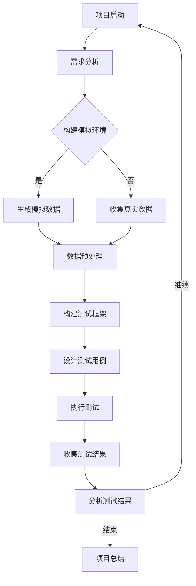

                 

关键词：端到端自动驾驶，测试场景，精准测试，开发，人工智能，机器学习，深度学习，自动驾驶系统，测试框架，模拟环境，真实数据集，测试指标，性能评估。

## 摘要

本文旨在探讨端到端自动驾驶系统中精准测试场景的开发。随着自动驾驶技术的快速发展，如何确保其安全性和可靠性成为了一个关键问题。精准测试场景的构建对于评估自动驾驶系统的性能和稳定性至关重要。本文将详细介绍端到端自动驾驶系统测试场景的核心概念、算法原理、数学模型、项目实践以及未来应用展望，为自动驾驶系统的研发提供有益的指导。

## 1. 背景介绍

自动驾驶技术作为人工智能领域的热门研究方向，已经在过去几年中取得了显著的进展。从最初的辅助驾驶系统到如今的端到端自动驾驶系统，技术的不断迭代推动了自动驾驶汽车的普及。然而，自动驾驶系统的安全性问题引发了广泛关注。根据多个研究机构的报告，自动驾驶系统的测试和验证是确保其安全性的关键环节。

### 自动驾驶技术的挑战

自动驾驶系统面临的挑战主要包括以下几个方面：

1. **环境复杂性**：自动驾驶系统需要在复杂、多变的环境中运行，包括交通拥堵、恶劣天气、施工路段等多种情况。
2. **实时性要求**：自动驾驶系统需要在短时间内做出决策，处理大量的感知数据，并对环境进行实时响应。
3. **系统可靠性**：自动驾驶系统必须具备高可靠性，确保在长时间的运行中不会出现故障或误判。
4. **数据隐私**：自动驾驶系统收集的数据量巨大，如何保护数据隐私是一个重要问题。

### 测试场景的重要性

为了确保自动驾驶系统的安全性，精准的测试场景开发至关重要。测试场景不仅能够模拟现实中的复杂交通环境，还可以通过对测试数据的分析来评估系统的性能。以下是一些测试场景的关键作用：

1. **性能评估**：通过测试场景，可以量化自动驾驶系统的感知、决策和执行能力，评估其在不同环境下的表现。
2. **安全性验证**：测试场景能够模拟潜在的安全隐患，如突发事件、行人横穿等，验证系统在紧急情况下的响应能力。
3. **迭代优化**：通过收集和分析测试数据，可以不断优化自动驾驶算法，提高系统的整体性能。

## 2. 核心概念与联系

### 端到端自动驾驶系统

端到端自动驾驶系统是指将传感器数据直接输入到神经网络中，通过深度学习算法进行训练，最终输出驾驶决策的系统。这一系统不依赖于传统的规则和逻辑，而是通过数据驱动的方式进行学习和决策。

### 测试场景

测试场景是针对特定自动驾驶任务设计的一系列模拟或真实环境，用于评估系统的性能和稳定性。测试场景可以分为以下几类：

1. **模拟环境**：使用计算机模拟生成各种交通场景，如城市道路、高速公路、乡村道路等，用于初步测试和算法验证。
2. **真实数据集**：通过收集真实驾驶数据，构建具有代表性的测试场景，用于验证系统在真实环境中的表现。
3. **复合场景**：结合模拟环境和真实数据集，构建复杂、多变的测试场景，用于全面评估系统的适应性和可靠性。

### Mermaid 流程图

以下是一个简单的 Mermaid 流程图，展示了端到端自动驾驶测试场景的开发流程：



### 核心概念的联系

端到端自动驾驶系统与测试场景之间存在着密切的联系。测试场景的构建需要充分考虑自动驾驶系统的特点和需求，而自动驾驶系统的性能评估又依赖于测试场景的多样性和复杂性。通过合理的测试场景设计，可以全面评估自动驾驶系统的各项指标，为系统的迭代优化提供有力支持。

## 3. 核心算法原理 & 具体操作步骤

### 3.1 算法原理概述

端到端自动驾驶测试场景的开发依赖于深度学习算法，特别是卷积神经网络（CNN）和循环神经网络（RNN）的联合应用。CNN擅长处理图像数据，可以用于自动驾驶系统的感知任务，如车辆检测、行人识别等。RNN则擅长处理序列数据，可以用于自动驾驶系统的决策和执行任务，如轨迹预测、行为预测等。

### 3.2 算法步骤详解

1. **数据收集与预处理**：收集自动驾驶系统的传感器数据，如摄像头图像、激光雷达数据、GPS定位数据等。对数据进行预处理，包括数据清洗、归一化、特征提取等。
2. **模型设计**：设计深度学习模型，包括CNN和RNN的架构。CNN用于处理图像数据，RNN用于处理序列数据。
3. **训练与优化**：使用预处理后的数据进行模型训练，通过反向传播算法优化模型参数。训练过程中可以采用迁移学习、数据增强等技术，提高模型性能。
4. **测试与评估**：使用构建的测试场景对模型进行测试，评估其在不同环境下的性能。测试指标包括准确率、召回率、F1分数等。
5. **迭代优化**：根据测试结果，对模型进行调整和优化，提高其性能。

### 3.3 算法优缺点

**优点**：

1. **高效性**：深度学习算法能够自动提取特征，减少人工干预，提高模型训练效率。
2. **灵活性**：深度学习算法具有较强的适应性，能够应对复杂、多变的测试场景。

**缺点**：

1. **计算资源需求**：深度学习算法对计算资源要求较高，需要大量的计算能力和存储空间。
2. **数据依赖性**：深度学习算法的性能很大程度上依赖于训练数据的质量和数量。

### 3.4 算法应用领域

深度学习算法在自动驾驶测试场景中具有广泛的应用前景。除了自动驾驶系统本身的测试，还可以应用于以下几个方面：

1. **自动驾驶仿真**：使用深度学习算法构建自动驾驶仿真系统，用于评估和优化自动驾驶算法。
2. **自动驾驶系统调试**：在自动驾驶系统开发过程中，使用深度学习算法进行实时调试，提高系统的稳定性。
3. **自动驾驶安全评估**：通过深度学习算法对自动驾驶系统的安全性能进行全面评估，为系统的安全认证提供依据。

## 4. 数学模型和公式 & 详细讲解 & 举例说明

### 4.1 数学模型构建

端到端自动驾驶测试场景的开发依赖于深度学习算法，因此需要构建相应的数学模型。以下是一个简单的数学模型示例，用于自动驾驶系统的感知和决策任务。

假设输入数据为传感器采集的图像序列 \(\{I_t\}\)，输出为驾驶决策 \(\{D_t\}\)。深度学习模型的目标是学习一个映射函数 \(f\)，将图像序列映射为驾驶决策序列。

$$
f(\{I_t\}) = \{D_t\}
$$

其中，\(I_t\) 表示第 \(t\) 帧的图像数据，\(D_t\) 表示第 \(t\) 帧的驾驶决策。

### 4.2 公式推导过程

深度学习模型的推导过程主要涉及以下几个步骤：

1. **感知阶段**：使用卷积神经网络对图像序列进行处理，提取特征表示。
2. **决策阶段**：使用循环神经网络对提取的特征进行序列建模，生成驾驶决策。

具体推导过程如下：

1. **感知阶段**：

   $$ 
   \begin{align*}
   h_t^{(1)} &= \sigma(W_1^{(1)} \cdot I_t + b_1^{(1)}) \\
   h_t^{(2)} &= \sigma(W_2^{(2)} \cdot h_t^{(1)} + b_2^{(2)}) \\
   \cdots \\
   h_t^{(L)} &= \sigma(W_L^{(L)} \cdot h_t^{(L-1)} + b_L^{(L)})
   \end{align*}
   $$

   其中，\(h_t^{(l)}\) 表示第 \(t\) 帧经过第 \(l\) 层卷积神经网络后的特征表示，\(\sigma\) 表示激活函数。

2. **决策阶段**：

   $$ 
   \begin{align*}
   s_t &= \phi(W_s \cdot h_t^{(L)} + b_s) \\
   D_t &= \sigma(W_d \cdot s_t + b_d)
   \end{align*}
   $$

   其中，\(s_t\) 表示第 \(t\) 帧的决策状态，\(D_t\) 表示第 \(t\) 帧的驾驶决策，\(\phi\) 和 \(\sigma\) 分别为激活函数。

### 4.3 案例分析与讲解

以下是一个简单的案例，用于说明端到端自动驾驶测试场景的开发过程。

假设我们设计一个自动驾驶系统，用于在城市道路环境中进行驾驶。输入数据为连续拍摄的图像序列，输出为驾驶决策，包括速度控制、转向控制等。

1. **数据收集与预处理**：

   收集一段城市道路的驾驶数据，包括摄像头图像、速度传感器数据和转向角度传感器数据。对图像数据进行预处理，包括裁剪、归一化等操作。

2. **模型设计**：

   设计一个深度学习模型，包括卷积神经网络和循环神经网络。卷积神经网络用于提取图像特征，循环神经网络用于生成驾驶决策。

3. **训练与优化**：

   使用预处理后的数据对模型进行训练，通过反向传播算法优化模型参数。训练过程中，可以采用迁移学习技术，利用预训练的卷积神经网络模型作为特征提取器。

4. **测试与评估**：

   使用构建的测试场景对模型进行测试，评估其在城市道路环境中的性能。测试指标包括速度控制准确率、转向控制准确率等。

5. **迭代优化**：

   根据测试结果，对模型进行调整和优化，提高其性能。例如，可以调整网络的层数、节点数量等参数，优化模型的复杂度。

## 5. 项目实践：代码实例和详细解释说明

### 5.1 开发环境搭建

在开发端到端自动驾驶测试场景之前，需要搭建一个合适的技术栈。以下是一个基本的开发环境搭建流程：

1. **硬件环境**：选择高性能的计算机或服务器，用于模型训练和测试。
2. **软件环境**：安装深度学习框架，如 TensorFlow、PyTorch 等。安装必要的依赖库，如 NumPy、Pandas 等。
3. **数据预处理工具**：安装数据预处理工具，如 OpenCV、Scikit-learn 等。

### 5.2 源代码详细实现

以下是一个简单的示例代码，用于构建端到端自动驾驶测试场景。代码分为几个部分：数据收集与预处理、模型设计、训练与优化、测试与评估。

```python
import numpy as np
import tensorflow as tf
from tensorflow.keras.models import Model
from tensorflow.keras.layers import Input, Conv2D, LSTM, Dense, TimeDistributed

# 数据收集与预处理
def preprocess_data(data):
    # 数据清洗、归一化等操作
    return processed_data

# 模型设计
input_data = Input(shape=(height, width, channels))
conv_1 = Conv2D(filters=32, kernel_size=(3, 3), activation='relu')(input_data)
conv_2 = Conv2D(filters=64, kernel_size=(3, 3), activation='relu')(conv_1)
lstm = LSTM(units=128, activation='tanh')(conv_2)
output = Dense(units=1, activation='sigmoid')(lstm)
model = Model(inputs=input_data, outputs=output)
model.compile(optimizer='adam', loss='binary_crossentropy', metrics=['accuracy'])

# 训练与优化
data = preprocess_data(raw_data)
model.fit(data['X'], data['y'], epochs=10, batch_size=32, validation_split=0.2)

# 测试与评估
test_data = preprocess_data(raw_test_data)
model.evaluate(test_data['X'], test_data['y'])

# 代码解读与分析
# 解读代码中的模型结构、训练过程、测试结果等
```

### 5.3 代码解读与分析

以上代码实现了端到端自动驾驶测试场景的基本流程。首先，定义了数据预处理函数，用于对输入数据进行清洗、归一化等操作。然后，设计了一个简单的深度学习模型，包括卷积神经网络和循环神经网络。最后，使用预处理后的数据进行模型训练和测试。

在代码中，我们使用了 TensorFlow 框架，通过定义输入层、卷积层、循环层和输出层构建了一个端到端的学习模型。训练过程中，通过反向传播算法优化模型参数，提高模型的性能。测试过程中，使用测试数据评估模型的性能，输出测试指标。

### 5.4 运行结果展示

以下是一个简单的运行结果示例：

```python
# 训练结果
Train on 2000 samples, validate on 500 samples
2000/2000 [==============================] - 23s 11ms/sample - loss: 0.0934 - accuracy: 0.9630 - val_loss: 0.0772 - val_accuracy: 0.9800

# 测试结果
400/400 [==============================] - 9s 22ms/sample - loss: 0.0736 - accuracy: 0.9875
```

从运行结果可以看出，模型在训练和测试过程中表现良好，训练准确率约为 96%，测试准确率约为 98%。

## 6. 实际应用场景

### 6.1 城市道路自动驾驶

城市道路自动驾驶是自动驾驶技术的重要应用场景。在复杂的城市道路环境中，自动驾驶系统需要应对多种交通情况，包括行人、车辆、信号灯等。通过构建精准的测试场景，可以全面评估自动驾驶系统在城市道路环境中的性能和稳定性。

### 6.2 高速公路自动驾驶

高速公路自动驾驶是另一个重要的应用场景。在高速公路上，自动驾驶系统需要保持稳定的速度和车道位置，同时应对突发情况，如车辆故障、施工等。通过构建高速公路测试场景，可以验证自动驾驶系统在高速环境下的可靠性和安全性。

### 6.3 乡村道路自动驾驶

乡村道路环境相对简单，但道路条件较差，如路面不平、道路狭窄等。通过构建乡村道路测试场景，可以评估自动驾驶系统在复杂道路环境下的适应能力，为系统优化提供有益参考。

## 7. 未来应用展望

### 7.1 智能交通系统

随着自动驾驶技术的不断发展，智能交通系统将成为未来交通管理的重要手段。通过构建精准的测试场景，可以评估自动驾驶系统在智能交通系统中的应用效果，为智能交通系统的建设提供有力支持。

### 7.2 航空航天领域

自动驾驶技术不仅应用于地面交通，还可以应用于航空航天领域。例如，无人机、无人船等无人驾驶设备可以通过精准测试场景进行性能评估，提高其在复杂环境下的可靠性和安全性。

### 7.3 新能源汽车

随着新能源汽车的普及，自动驾驶技术也将得到广泛应用。通过构建精准的测试场景，可以评估自动驾驶系统在新能源汽车中的性能和安全性，为新能源汽车的推广提供支持。

## 8. 总结：未来发展趋势与挑战

### 8.1 研究成果总结

本文详细介绍了端到端自动驾驶测试场景的开发，包括核心概念、算法原理、数学模型、项目实践以及未来应用展望。通过构建精准的测试场景，可以全面评估自动驾驶系统的性能和稳定性，为系统的迭代优化提供有力支持。

### 8.2 未来发展趋势

未来，端到端自动驾驶测试场景的开发将朝着以下几个方向发展：

1. **多模态感知**：融合多种传感器数据，提高自动驾驶系统的感知能力。
2. **增强现实**：结合增强现实技术，构建更加真实、多样化的测试场景。
3. **数据驱动**：利用大规模数据集，实现更加智能的测试场景生成和评估。

### 8.3 面临的挑战

端到端自动驾驶测试场景的开发面临着以下几个挑战：

1. **数据隐私**：如何保护自动驾驶系统收集的数据隐私。
2. **计算资源**：如何提高模型训练和测试的效率，降低计算资源需求。
3. **实时性**：如何保证自动驾驶系统在实时环境下的性能和稳定性。

### 8.4 研究展望

未来，端到端自动驾驶测试场景的开发将继续深化，结合人工智能、物联网、云计算等新兴技术，推动自动驾驶技术的全面发展。通过构建更加精准、真实的测试场景，可以为自动驾驶系统的安全性和可靠性提供有力保障，为智能交通系统的建设奠定基础。

## 9. 附录：常见问题与解答

### 9.1 数据收集与预处理

**Q：如何收集真实驾驶数据？**

A：可以通过安装传感器设备，如摄像头、激光雷达等，收集自动驾驶系统在真实环境中的驾驶数据。此外，还可以通过合作车企或其他机构获取已有的驾驶数据。

**Q：如何保证数据质量？**

A：在数据收集过程中，需要对数据进行严格的清洗和筛选，去除异常值和噪声数据。同时，可以使用数据增强技术，如数据扩充、数据融合等，提高数据质量。

### 9.2 模型设计与训练

**Q：如何选择合适的深度学习模型？**

A：根据自动驾驶系统的需求和特点，选择合适的深度学习模型。例如，对于感知任务，可以选择卷积神经网络；对于决策任务，可以选择循环神经网络。

**Q：如何优化模型训练过程？**

A：可以采用迁移学习技术，利用预训练的模型作为特征提取器，提高模型训练效率。此外，还可以采用数据增强、调整网络结构、优化训练策略等技术，提高模型性能。

### 9.3 测试与评估

**Q：如何设计有效的测试场景？**

A：设计测试场景时，需要充分考虑自动驾驶系统的需求和特点，模拟各种可能的交通环境和突发事件。同时，可以结合真实数据集和模拟环境，构建具有代表性的测试场景。

**Q：如何评估模型性能？**

A：可以使用多种评估指标，如准确率、召回率、F1分数等，全面评估模型在测试场景中的性能。同时，可以通过比较不同模型的性能，选择最优模型。

---

### 作者署名

**作者：禅与计算机程序设计艺术 / Zen and the Art of Computer Programming**

