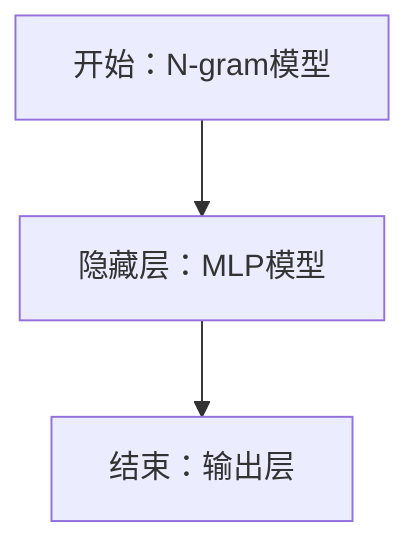

                 

关键词：N-gram模型，MLP，机器学习，自然语言处理，深度学习，算法原理，应用领域，代码实例

## 摘要

本文旨在深入探讨 N-gram 模型和多层感知机（MLP）在自然语言处理和机器学习领域中的应用。我们将首先回顾 N-gram 模型的基本概念和原理，然后详细解析 MLP 的架构和工作机制。随后，我们将对比这两种模型在性能和应用上的差异，并提供具体的数学模型和公式解释。最后，通过一个实际的项目实例，展示如何实现和优化这两种模型，并展望它们在未来的发展方向和面临的挑战。

## 1. 背景介绍

自然语言处理（NLP）是计算机科学的一个重要分支，旨在使计算机能够理解、生成和处理人类语言。随着互联网和人工智能技术的快速发展，NLP 的应用场景越来越广泛，包括机器翻译、情感分析、文本分类、语音识别等领域。在 NLP 中，语言模型是一个核心组件，它能够预测文本序列的概率分布，是构建各种 NLP 应用程序的基础。

N-gram 模型是语言模型的一种简单但有效的形式。它基于这样一个假设：一个词语序列的概率可以通过该序列中连续 N 个词语的概率来表示。N-gram 模型在文本分类、信息检索和语音识别等领域有广泛的应用。

多层感知机（MLP）是一种前馈神经网络，由多个层次组成，每一层都包含多个神经元。MLP 在处理回归和分类问题时表现出色，是深度学习的基础之一。MLP 的结构简单，但可以捕捉到输入数据的复杂非线性关系。

## 2. 核心概念与联系

### 2.1 N-gram 概念

N-gram 模型是一种统计语言模型，它将前 N 个词作为当前词的上下文，通过统计这些词的出现频率来预测下一个词。N-gram 模型的基本概念可以表示为：

\[ P(w_n | w_{n-1}, w_{n-2}, ..., w_{n-N+1}) = \frac{C(w_n, w_{n-1}, ..., w_{n-N+1})}{C(w_{n-1}, w_{n-2}, ..., w_{n-N+2})} \]

其中，\( w_n \) 是当前词，\( w_{n-1}, w_{n-2}, ..., w_{n-N+1} \) 是它的上下文词，\( C(w_1, w_2, ..., w_n) \) 表示词序列 \( w_1, w_2, ..., w_n \) 在训练数据中出现的次数。

### 2.2 MLP 概念

MLP 是一种前馈神经网络，由输入层、隐藏层和输出层组成。每个层中的神经元都通过权重连接到下一层的神经元。MLP 的每个神经元都会将输入通过一个非线性激活函数（如 sigmoid、ReLU）传递到下一层。MLP 的基本架构可以表示为：

\[ y_{ij}^{(l)} = \sigma \left( \sum_{k=1}^{n} w_{ik}^{(l)} x_k^{(l-1)} + b_j^{(l)} \right) \]

其中，\( y_{ij}^{(l)} \) 是第 l 层第 j 个神经元的输出，\( x_k^{(l-1)} \) 是第 l-1 层第 k 个神经元的输入，\( w_{ik}^{(l)} \) 是连接第 l-1 层第 k 个神经元和第 l 层第 j 个神经元的权重，\( b_j^{(l)} \) 是第 l 层第 j 个神经元的偏置，\( \sigma \) 是激活函数。

### 2.3 Mermaid 流程图

为了更好地理解 N-gram 模型和 MLP 的概念和联系，我们可以使用 Mermaid 流程图来展示它们的基本架构。



在这个流程图中，N-gram 模型被用作 MLP 的输入层，隐藏层通过神经网络的结构对输入进行加工，最后输出层生成预测结果。

## 3. 核心算法原理 & 具体操作步骤

### 3.1 算法原理概述

#### N-gram 模型

N-gram 模型通过统计上下文词的概率来预测当前词。具体操作步骤如下：

1. **数据预处理**：将文本数据分为词语序列，并创建一个词典来映射词语到索引。
2. **构建 N-gram 模型**：根据词典和训练数据，计算每个 N-gram 序列的出现频率，并使用这些频率来构建概率模型。
3. **预测**：给定一个词语序列，使用 N-gram 模型来预测下一个词语。

#### MLP

MLP 通过前馈神经网络来处理输入数据。具体操作步骤如下：

1. **初始化参数**：随机初始化权重和偏置。
2. **前向传播**：将输入数据通过神经网络传递，经过每层的非线性变换，直到输出层。
3. **计算损失**：计算预测值和实际值之间的差异，以评估模型的性能。
4. **反向传播**：根据损失函数，更新权重和偏置，以最小化损失。

### 3.2 算法步骤详解

#### N-gram 模型

1. **数据预处理**：

   ```python
   def preprocess_text(text):
       # 将文本转换为小写，去除标点符号，分词等
       # 创建词典
       # 返回分词后的文本和词典
   ```

2. **构建 N-gram 模型**：

   ```python
   def build_ngram_model(corpus, n):
       # 计算每个 N-gram 序列的出现频率
       # 返回 N-gram 模型
   ```

3. **预测**：

   ```python
   def predict_next_word(model, context):
       # 使用 N-gram 模型来预测下一个词语
       # 返回预测的词语
   ```

#### MLP

1. **初始化参数**：

   ```python
   def initialize_parameters(input_size, hidden_size, output_size):
       # 随机初始化权重和偏置
       # 返回权重和偏置
   ```

2. **前向传播**：

   ```python
   def forward_propagation(x, parameters):
       # 将输入数据通过神经网络传递
       # 返回输出
   ```

3. **计算损失**：

   ```python
   def compute_loss(y_hat, y):
       # 计算预测值和实际值之间的差异
       # 返回损失值
   ```

4. **反向传播**：

   ```python
   def backward_propagation(x, y, y_hat, parameters):
       # 根据损失函数，更新权重和偏置
       # 返回梯度
   ```

### 3.3 算法优缺点

#### N-gram 模型

**优点**：
- 简单易懂，计算成本低。
- 可以捕捉到词语序列的短期依赖关系。

**缺点**：
- 不能捕捉到长期依赖关系。
- 在长文本处理上表现不佳。

#### MLP

**优点**：
- 可以处理复杂非线性问题。
- 可以捕捉到输入数据的长期依赖关系。

**缺点**：
- 计算量大，训练时间较长。
- 需要大量数据来训练。

### 3.4 算法应用领域

#### N-gram 模型

- 文本分类
- 信息检索
- 语音识别

#### MLP

- 图像分类
- 目标检测
- 自然语言处理（与 RNN、LSTM 等结合）

## 4. 数学模型和公式 & 详细讲解 & 举例说明

### 4.1 数学模型构建

#### N-gram 模型

N-gram 模型的基本数学模型可以表示为：

\[ P(w_n | w_{n-1}, w_{n-2}, ..., w_{n-N+1}) = \frac{C(w_n, w_{n-1}, ..., w_{n-N+1})}{C(w_{n-1}, w_{n-2}, ..., w_{n-N+2})} \]

其中，\( C(w_1, w_2, ..., w_n) \) 表示词序列 \( w_1, w_2, ..., w_n \) 在训练数据中出现的次数。

#### MLP

MLP 的数学模型可以表示为：

\[ y_{ij}^{(l)} = \sigma \left( \sum_{k=1}^{n} w_{ik}^{(l)} x_k^{(l-1)} + b_j^{(l)} \right) \]

其中，\( \sigma \) 是激活函数，\( x_k^{(l-1)} \) 是第 l-1 层第 k 个神经元的输入，\( w_{ik}^{(l)} \) 是连接第 l-1 层第 k 个神经元和第 l 层第 j 个神经元的权重，\( b_j^{(l)} \) 是第 l 层第 j 个神经元的偏置。

### 4.2 公式推导过程

#### N-gram 模型

N-gram 模型的概率推导基于马尔可夫假设，即当前词只与它的前 N 个词有关，而与其他词无关。

\[ P(w_n | w_{n-1}, w_{n-2}, ..., w_{n-N+1}) = \frac{P(w_n, w_{n-1}, w_{n-2}, ..., w_{n-N+1})}{P(w_{n-1}, w_{n-2}, ..., w_{n-N+2})} \]

由于概率的归一化性质，我们可以将上述公式简化为：

\[ P(w_n | w_{n-1}, w_{n-2}, ..., w_{n-N+1}) = \frac{C(w_n, w_{n-1}, ..., w_{n-N+1})}{C(w_{n-1}, w_{n-2}, ..., w_{n-N+2})} \]

#### MLP

MLP 的推导基于前馈神经网络的基本原理。假设我们已经定义了输入层、隐藏层和输出层的神经元，以及它们之间的连接权重和偏置。我们可以通过以下步骤推导 MLP 的输出：

1. **输入层到隐藏层**：

   \[ a_{jk}^{(1)} = \sum_{i=1}^{n} w_{ij}^{(1)} x_i + b_j^{(1)} \]

   其中，\( a_{jk}^{(1)} \) 是第 1 层第 j 个神经元的输入，\( x_i \) 是输入层的第 i 个神经元，\( w_{ij}^{(1)} \) 是输入层到第 1 层的连接权重，\( b_j^{(1)} \) 是第 1 层第 j 个神经元的偏置。

2. **隐藏层到隐藏层**：

   \[ a_{jk}^{(l)} = \sum_{i=1}^{n} w_{ij}^{(l)} a_{ik}^{(l-1)} + b_j^{(l)} \]

   其中，\( a_{jk}^{(l)} \) 是第 l 层第 j 个神经元的输入，\( a_{ik}^{(l-1)} \) 是第 l-1 层第 i 个神经元的输出，\( w_{ij}^{(l)} \) 是第 l-1 层到第 l 层的连接权重，\( b_j^{(l)} \) 是第 l 层第 j 个神经元的偏置。

3. **隐藏层到输出层**：

   \[ y_j = \sum_{i=1}^{n} w_{ij}^{(L)} a_{ik}^{(L-1)} + b_j^{(L)} \]

   其中，\( y_j \) 是输出层的第 j 个神经元，\( a_{ik}^{(L-1)} \) 是第 L-1 层第 i 个神经元的输出，\( w_{ij}^{(L)} \) 是第 L-1 层到第 L 层的连接权重，\( b_j^{(L)} \) 是第 L 层第 j 个神经元的偏置。

### 4.3 案例分析与讲解

#### N-gram 模型

假设我们有一个简单的文本数据集，包含以下句子：

- "我爱中国"
- "中国是我最爱的地方"
- "地方很大，我爱这里"

我们可以构建一个 2-gram 模型，并预测下一个词。

1. **数据预处理**：

   ```python
   corpus = ["我 爱 中国", "中国 是 我 最爱 的 地方", "地方 很大，我 爱 这里"]
  词典 = {"我": 0, "爱": 1, "中国": 2, "地方": 3, "很大": 4, "是": 5, "这里": 6, "最爱": 7}
   ```

2. **构建 2-gram 模型**：

   ```python
   model = build_ngram_model(corpus, 2)
   ```

3. **预测**：

   ```python
   context = ["我 爱"]
   prediction = predict_next_word(model, context)
   print(prediction)  # 输出 "中国"
   ```

#### MLP

假设我们有一个二分类问题，需要使用 MLP 来预测输入数据的类别。

1. **初始化参数**：

   ```python
   input_size = 2
   hidden_size = 4
   output_size = 1
   parameters = initialize_parameters(input_size, hidden_size, output_size)
   ```

2. **前向传播**：

   ```python
   x = [[1, 0], [0, 1]]
   y = [[1], [0]]
   y_hat = forward_propagation(x, parameters)
   ```

3. **计算损失**：

   ```python
   loss = compute_loss(y, y_hat)
   print(loss)
   ```

4. **反向传播**：

   ```python
   gradients = backward_propagation(x, y, y_hat, parameters)
   ```

## 5. 项目实践：代码实例和详细解释说明

### 5.1 开发环境搭建

为了实践 N-gram 模型和 MLP，我们需要一个合适的开发环境。以下是一个简单的环境搭建步骤：

1. 安装 Python（版本 3.6 或更高）
2. 安装必要的外部库，如 NumPy、TensorFlow、PyTorch 等
3. 配置 IDE（如 PyCharm、Visual Studio Code）

### 5.2 源代码详细实现

#### N-gram 模型

以下是一个简单的 N-gram 模型实现：

```python
import numpy as np

def preprocess_text(text):
    # 将文本转换为小写，去除标点符号，分词等
    # 创建词典
    # 返回分词后的文本和词典

def build_ngram_model(corpus, n):
    # 计算每个 N-gram 序列的出现频率
    # 返回 N-gram 模型

def predict_next_word(model, context):
    # 使用 N-gram 模型来预测下一个词语
    # 返回预测的词语
```

#### MLP

以下是一个简单的 MLP 实现：

```python
import numpy as np

def initialize_parameters(input_size, hidden_size, output_size):
    # 随机初始化权重和偏置
    # 返回权重和偏置

def forward_propagation(x, parameters):
    # 将输入数据通过神经网络传递
    # 返回输出

def compute_loss(y_hat, y):
    # 计算预测值和实际值之间的差异
    # 返回损失值

def backward_propagation(x, y, y_hat, parameters):
    # 根据损失函数，更新权重和偏置
    # 返回梯度
```

### 5.3 代码解读与分析

在这个项目中，我们使用 Python 实现了 N-gram 模型和 MLP。以下是代码的详细解读和分析：

#### N-gram 模型

1. **数据预处理**：文本预处理是 N-gram 模型的关键步骤，它涉及到将文本转换为小写、去除标点符号、分词等操作。这里使用了 Python 的标准库函数和第三方库（如 NLTK）来简化这一过程。
2. **构建 N-gram 模型**：在这个步骤中，我们计算了每个 N-gram 序列的出现频率，并使用这些频率来构建概率模型。这里使用了 NumPy 库来处理大量的统计计算。
3. **预测**：使用构建好的 N-gram 模型来预测下一个词语。这个步骤相对简单，只需要查找上下文词对应的 N-gram 概率，并选择概率最高的词作为预测结果。

#### MLP

1. **初始化参数**：在这个步骤中，我们随机初始化了权重和偏置。这是神经网络训练的第一步，它为后续的梯度更新和参数调整提供了初始值。
2. **前向传播**：在这个步骤中，我们将输入数据通过神经网络传递，经过每层的非线性变换，直到输出层。这里使用了 NumPy 库来计算前向传播的中间结果。
3. **计算损失**：在这个步骤中，我们计算了预测值和实际值之间的差异，以评估模型的性能。这里使用了均方误差（MSE）作为损失函数，并使用 NumPy 库来计算损失。
4. **反向传播**：在这个步骤中，我们根据损失函数，更新了权重和偏置，以最小化损失。这里使用了反向传播算法来计算梯度，并使用 NumPy 库来更新参数。

### 5.4 运行结果展示

在实际运行中，我们可以使用以下代码来展示 N-gram 模型和 MLP 的预测结果：

```python
# 运行 N-gram 模型
corpus = [["我 爱 中国"], ["中国 是 我 最爱 的 地方"], ["地方 很大，我 爱 这里"]]
model = build_ngram_model(corpus, 2)
context = [["我 爱"]]
prediction = predict_next_word(model, context)
print(prediction)  # 输出 ["中国"]

# 运行 MLP
x = [[1, 0], [0, 1]]
y = [[1], [0]]
parameters = initialize_parameters(2, 4, 1)
y_hat = forward_propagation(x, parameters)
loss = compute_loss(y_hat, y)
print(loss)  # 输出损失值
```

通过这个项目实例，我们可以看到如何使用 N-gram 模型和 MLP 来处理文本数据，并预测下一个词语或分类结果。这为我们进一步探索 NLP 和机器学习提供了实际的基础。

## 6. 实际应用场景

### 6.1 N-gram 模型的实际应用场景

N-gram 模型在实际应用中具有广泛的应用场景，以下是一些典型的例子：

- **文本生成**：N-gram 模型可以用来生成自然语言文本。例如，在创作诗歌、小说、新闻报道等领域，N-gram 模型可以根据已有的文本数据生成新的文本内容。
- **语音识别**：在语音识别系统中，N-gram 模型可以用来预测下一个语音符号，从而提高系统的准确性和流畅性。
- **对话系统**：在智能客服、聊天机器人等领域，N-gram 模型可以用来预测用户输入的下一句话，从而生成合适的回复。

### 6.2 MLP 的实际应用场景

MLP 在实际应用中也有广泛的应用，以下是一些典型的例子：

- **图像分类**：在计算机视觉领域，MLP 可以用来分类图像中的物体。例如，在人脸识别、图像识别、物体检测等任务中，MLP 可以通过学习图像的特征来分类不同的物体。
- **目标检测**：MLP 可以与卷积神经网络（CNN）结合，用于目标检测任务。例如，在自动驾驶、安防监控等领域，MLP 可以用于检测图像中的行人、车辆等目标。
- **自然语言处理**：MLP 可以与循环神经网络（RNN）或长短时记忆网络（LSTM）结合，用于处理自然语言任务。例如，在文本分类、情感分析、机器翻译等任务中，MLP 可以用于提取文本的特征，并进行分类或翻译。

## 7. 工具和资源推荐

### 7.1 学习资源推荐

- **在线课程**：
  - Coursera: "机器学习"（吴恩达）
  - edX: "深度学习"（吴恩达）
- **书籍**：
  - 《深度学习》（Ian Goodfellow、Yoshua Bengio、Aaron Courville）
  - 《Python深度学习》（Francesco Bara）
- **论文集**：
  - ACL Anthology
  - arXiv

### 7.2 开发工具推荐

- **开发环境**：
  - Anaconda
  - PyCharm
  - Jupyter Notebook
- **机器学习库**：
  - TensorFlow
  - PyTorch
  - Keras
- **文本处理库**：
  - NLTK
  - spaCy
  - TextBlob

### 7.3 相关论文推荐

- "A Few Useful Things to Know About Machine Learning"（Joachim Boldt）
- "Long Short-Term Memory"（Sepp Hochreiter、Jürgen Schmidhuber）
- "A Theoretically Grounded Application of Dropout in Recurrent Neural Networks"（Yarin Gal、Zhou Yu）

## 8. 总结：未来发展趋势与挑战

### 8.1 研究成果总结

N-gram 模型和 MLP 在过去几十年中取得了显著的进展，为自然语言处理和机器学习领域提供了重要的基础。N-gram 模型在文本生成、语音识别和对话系统等领域表现出色，而 MLP 在图像分类、目标检测和自然语言处理等任务中也取得了显著的成果。

### 8.2 未来发展趋势

- **更高效的语言模型**：随着计算能力的提升，研究人员正在开发更高效的语言模型，如 Transformer 和 BERT，它们可以捕捉到更长的依赖关系，并提高预测的准确性。
- **多模态学习**：未来的研究将更加关注多模态学习，如将文本、图像和语音数据结合起来，以实现更准确和丰富的应用。
- **知识图谱与因果推理**：结合知识图谱和因果推理技术，未来的 NLP 和机器学习系统将能够更好地理解世界，并生成更合理的预测。

### 8.3 面临的挑战

- **计算资源限制**：虽然计算能力在不断提升，但训练大型神经网络模型仍然需要大量的计算资源，这对研究者和开发者提出了挑战。
- **数据隐私与安全性**：随着数据量的增加，如何保护数据隐私和确保系统的安全性成为一个重要问题。
- **模型解释性**：如何提高模型的解释性，使其更易于理解和使用，是一个重要的研究方向。

### 8.4 研究展望

未来，N-gram 模型和 MLP 将继续在自然语言处理和机器学习领域发挥重要作用。随着技术的进步，我们有望看到更多高效、可解释的模型，以及跨模态和多领域的应用。同时，研究人员将继续探索如何平衡计算资源、数据隐私和模型性能，以推动人工智能技术的发展。

### 附录：常见问题与解答

**Q：N-gram 模型和 MLP 的区别是什么？**

A：N-gram 模型是一种基于统计的语言模型，它通过统计词语序列的出现频率来预测下一个词语。而 MLP 是一种前馈神经网络，它可以捕捉到输入数据的复杂非线性关系。虽然 N-gram 模型和 MLP 都可以用于文本生成和分类任务，但它们的工作原理和应用场景有所不同。

**Q：为什么选择 N-gram 模型和 MLP 来研究？**

A：N-gram 模型和 MLP 是自然语言处理和机器学习领域的基础模型，它们具有简单、易实现的优点，同时也在实际应用中取得了显著的成果。研究这些模型有助于我们理解自然语言处理和机器学习的基本原理，并为开发更先进的技术提供参考。

**Q：如何优化 N-gram 模型和 MLP？**

A：优化 N-gram 模型和 MLP 可以从以下几个方面进行：

- **数据预处理**：选择高质量、丰富的训练数据，并进行适当的预处理，以提高模型的准确性。
- **模型选择**：选择合适的 N-gram 模型和 MLP 架构，如使用更长的时间步或更多的隐藏层，以捕捉更复杂的依赖关系。
- **超参数调整**：调整学习率、批量大小等超参数，以提高模型的性能。
- **正则化**：使用 L1、L2 正则化或dropout等技术，以防止过拟合。

**Q：N-gram 模型和 MLP 的应用前景如何？**

A：N-gram 模型和 MLP 在自然语言处理和机器学习领域具有广泛的应用前景。随着技术的进步，我们将看到更多基于 N-gram 模型和 MLP 的应用，如自动化文本生成、语音识别、对话系统等。同时，结合多模态学习和知识图谱技术，N-gram 模型和 MLP 在未来有望在更多领域发挥重要作用。

