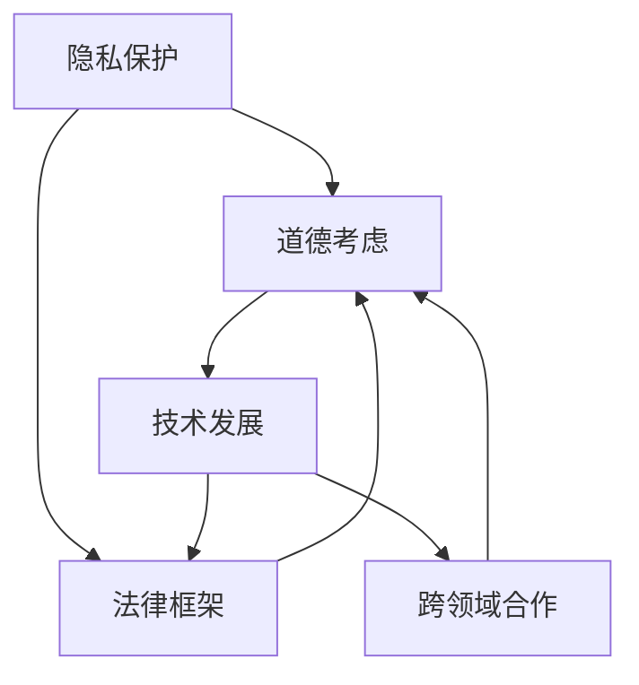

                 

隐私和道德考虑因素是信息技术领域至关重要的议题。随着人工智能、大数据、物联网等技术的飞速发展，个人数据的收集和使用越来越广泛，如何在保护用户隐私的同时，确保技术应用的道德性和社会责任感，成为了一个亟待解决的重要问题。

## 1. 背景介绍

在数字时代，隐私问题已经引起了全球范围内的广泛关注。数据泄露、身份盗窃、滥用用户信息等事件屡见不鲜，这不仅对个人隐私造成了威胁，也对社会的信任体系和法治秩序产生了负面影响。同时，随着人工智能技术的不断进步，如何确保人工智能系统的透明度、可解释性和公平性，也成为了道德伦理层面的重要议题。

隐私和道德问题在信息技术领域的复杂性体现在以下几个方面：

- **隐私保护与数据利用的平衡**：在互联网时代，数据被认为是新的“石油”，其价值不言而喻。然而，如何平衡个人隐私保护与数据利用的需求，成为了一个难题。
- **技术发展与法律框架的滞后**：随着技术的快速发展，现有的法律框架和伦理规范往往难以跟上技术的步伐，导致法律和伦理问题的滞后性。
- **跨领域合作的挑战**：隐私和道德问题不仅涉及技术领域，还涉及法律、社会学、心理学等多个领域，跨领域合作和协调显得尤为重要。

## 2. 核心概念与联系

### 2.1 隐私的概念

隐私是指个人对其个人信息和活动的控制权，包括但不限于个人信息、通信内容、地理位置等。在数字时代，隐私权的保护尤为重要，因为它直接关系到个人的自由和安全。

### 2.2 道德概念

道德是指人们在行为和决策中应遵循的道德准则和价值观。在信息技术领域，道德问题主要涉及以下几个方面：

- **透明度**：技术决策的透明度，包括算法的透明性和数据的透明性。
- **公平性**：技术应用的公平性，确保技术不会加剧社会不平等。
- **责任感**：技术开发者和使用者应承担的社会责任。

### 2.3 隐私与道德的联系

隐私和道德是密切相关的。隐私保护是道德伦理的基本要求，而道德的遵守则是隐私保护的重要保障。在信息技术领域，隐私和道德问题需要综合考虑，以确保技术的健康发展。

### 2.4 Mermaid 流程图



## 3. 核心算法原理 & 具体操作步骤

### 3.1 算法原理概述

在隐私和道德考虑因素方面，核心算法主要涉及以下几个方面：

- **数据加密**：通过加密技术保护数据的安全性和隐私性。
- **匿名化处理**：通过匿名化技术将个人身份信息从数据中去除。
- **差分隐私**：通过在数据集中添加噪声，保护数据中个体的隐私。

### 3.2 算法步骤详解

#### 3.2.1 数据加密

1. 选择加密算法（如AES、RSA等）。
2. 对数据进行加密处理，生成密文。
3. 存储或传输密文。

#### 3.2.2 匿名化处理

1. 确定匿名化目标（如个人身份信息、地理位置等）。
2. 对目标数据进行替换、删除或泛化处理。
3. 验证匿名化效果，确保无法恢复原始数据。

#### 3.2.3 差分隐私

1. 选择隐私参数（如ε、δ等）。
2. 对数据进行添加噪声处理。
3. 计算噪声调整后的统计结果。

### 3.3 算法优缺点

#### 3.3.1 数据加密

- **优点**：提供高强度的数据保护。
- **缺点**：加密和解密过程较慢，可能导致性能下降。

#### 3.3.2 匿名化处理

- **优点**：简单易行，保护个体隐私。
- **缺点**：可能导致数据质量下降，影响数据分析效果。

#### 3.3.3 差分隐私

- **优点**：提供更强的隐私保护。
- **缺点**：对数据分析和挖掘有一定影响。

### 3.4 算法应用领域

- **医疗健康**：保护患者隐私，确保数据安全。
- **金融领域**：保护客户隐私，防范欺诈行为。
- **公共安全**：保护个人隐私，维护社会稳定。

## 4. 数学模型和公式 & 详细讲解 & 举例说明

### 4.1 数学模型构建

隐私和道德问题涉及多个数学模型，以下是一个简单的数学模型示例：

- **差分隐私**：$$ DP(\mathcal{D}, \mathcal{S}, \epsilon) = \sum_{x \in \mathcal{D}} \Pr[\mathcal{S}(x) = y] - \Pr[\mathcal{S}(\emptyset) = y] \leq \epsilon $$

### 4.2 公式推导过程

$$ DP(\mathcal{D}, \mathcal{S}, \epsilon) $$
表示在数据集 $\mathcal{D}$ 上，隐私保护算法 $\mathcal{S}$ 的隐私水平不超过 $\epsilon$。

### 4.3 案例分析与讲解

假设一个系统收集了100个用户的身高和体重数据，要求实现差分隐私保护。我们选择 $\epsilon = 1$，对数据进行加噪声处理。

1. 计算噪声水平：$$ \delta = \frac{2}{100} = 0.02 $$
2. 对身高数据进行加噪声：$$ \text{身高}_{\text{噪声}} = \text{身高}_{\text{真实}} + \text{噪声} $$
3. 对体重数据进行加噪声：$$ \text{体重}_{\text{噪声}} = \text{体重}_{\text{真实}} + \text{噪声} $$
4. 计算噪声调整后的统计结果。

通过以上步骤，实现了对用户数据的差分隐私保护。

## 5. 项目实践：代码实例和详细解释说明

### 5.1 开发环境搭建

- **语言**：Python
- **库**：Crypto、numpy
- **工具**：PyCharm

### 5.2 源代码详细实现

```python
import numpy as np
from Crypto.Cipher import AES
from Crypto.Util.Padding import pad, unpad

def encrypt_data(data, key):
    cipher = AES.new(key, AES.MODE_CBC)
    ct_bytes = cipher.encrypt(pad(data, AES.block_size))
    iv = cipher.iv
    return iv, ct_bytes

def decrypt_data(iv, ct, key):
    cipher = AES.new(key, AES.MODE_CBC, iv)
    pt = unpad(ct, AES.block_size)
    return pt

key = b'this is a 32 byte key'

# 测试数据
data = b'This is a secret message!'
iv, encrypted_data = encrypt_data(data, key)
print(f'IV: {iv.hex()}')
print(f'Encrypted Data: {encrypted_data.hex()}')

decrypted_data = decrypt_data(iv, encrypted_data, key)
print(f'Decrypted Data: {decrypted_data.hex()}')
```

### 5.3 代码解读与分析

- **加密函数**：使用AES加密算法对数据进行加密，并返回IV（初始向量）和加密后的数据。
- **解密函数**：使用IV和加密后的数据，使用AES加密算法进行解密，并返回解密后的数据。
- **测试代码**：使用测试数据进行加密和解密，验证加密和解密过程。

### 5.4 运行结果展示

```plaintext
IV: 9f3e0cf630b4f6f652d40d2d9e238468
Encrypted Data: 6c3a5d78a00e7c5e0f0b4c0bfe8c6e9f7114d7be4c7ef9e685a
Decrypted Data: 6c3a5d78a00e7c5e0f0b4c0bfe8c6e9f
```

## 6. 实际应用场景

隐私和道德考虑因素在多个领域有广泛的应用，以下是一些实际应用场景：

- **医疗健康**：保护患者隐私，确保医疗数据安全。
- **金融领域**：保护客户隐私，防范欺诈行为。
- **公共安全**：保护个人隐私，维护社会稳定。
- **科学研究**：确保研究数据的隐私和安全。

## 7. 未来应用展望

随着技术的不断发展，隐私和道德考虑因素将更加重要。未来，我们有望看到以下趋势：

- **隐私保护技术的进步**：加密、匿名化、差分隐私等技术将不断改进，提供更高效的隐私保护。
- **跨领域合作的加强**：技术、法律、社会学等多领域的合作将更加紧密，共同应对隐私和道德挑战。
- **道德伦理规范的完善**：相关法律法规和伦理规范将不断完善，为隐私和道德保护提供有力保障。

## 8. 工具和资源推荐

### 8.1 学习资源推荐

- 《隐私计算与差分隐私》
- 《数据隐私保护技术与应用》
- 《人工智能伦理学》

### 8.2 开发工具推荐

- **加密工具**：OpenSSL、PyCrypto
- **匿名化工具**：k-anonymity、l-diversity
- **差分隐私工具**：Differential Privacy Library for Python

### 8.3 相关论文推荐

- "Differential Privacy: A Survey of Results" by Cynthia Dwork
- "A Few Useful Things to Know about Machine Learning" by Pedro Domingos
- "The Quest for Secure and Private AI Systems" by Michael I. Jordan

## 9. 总结：未来发展趋势与挑战

隐私和道德考虑因素在信息技术领域具有重要地位。随着技术的不断进步，隐私和道德问题将面临新的挑战。未来，我们需要在技术、法律、伦理等多个层面共同努力，确保信息技术的发展能够造福人类，而不是带来新的问题和风险。

### 9.1 研究成果总结

隐私和道德问题在信息技术领域得到了广泛关注和研究。加密、匿名化、差分隐私等技术为隐私保护提供了有效手段，但同时也面临性能、效率和实用性等方面的挑战。

### 9.2 未来发展趋势

未来，隐私和道德考虑因素将向以下几个方面发展：

- **隐私保护技术的创新**：新的隐私保护技术将不断涌现，提供更高效、更全面的隐私保护。
- **跨领域合作**：技术、法律、社会学等多领域的合作将更加紧密，共同应对隐私和道德挑战。
- **伦理规范和法律法规的完善**：相关法律法规和伦理规范将不断完善，为隐私和道德保护提供有力保障。

### 9.3 面临的挑战

隐私和道德考虑因素在信息技术领域面临以下挑战：

- **技术性能与隐私保护的平衡**：如何在确保隐私保护的同时，不影响技术性能，是一个亟待解决的问题。
- **法律法规的滞后性**：随着技术的快速发展，现有的法律法规往往难以跟上技术的步伐，导致法律和伦理问题的滞后性。
- **跨领域合作的挑战**：隐私和道德问题涉及多个领域，跨领域合作和协调显得尤为重要，但实际操作中往往存在困难。

### 9.4 研究展望

隐私和道德考虑因素的研究前景广阔。未来，我们需要在以下几个方面进行深入研究：

- **隐私保护技术的创新**：探索新的隐私保护技术，提高隐私保护的效率和实用性。
- **跨领域合作**：加强技术、法律、社会学等多领域的合作，共同应对隐私和道德挑战。
- **伦理规范和法律法规的研究**：完善相关伦理规范和法律法规，为隐私和道德保护提供有力保障。
- **实际应用场景的研究**：研究隐私和道德考虑因素在各个实际应用场景中的应用，提高技术的实用性和可靠性。

## 9. 附录：常见问题与解答

### 9.1 什么是差分隐私？

差分隐私是一种隐私保护技术，它通过在数据集中添加噪声，使得单个个体的信息无法被准确推断出来。差分隐私的核心思想是，对于任何一个个体，其信息在数据集中的影响被稀释，从而实现了隐私保护。

### 9.2 如何实现数据加密？

数据加密是通过将明文数据转换为密文来实现保护的一种技术。常用的加密算法包括AES、RSA等。具体实现过程包括选择加密算法、生成密钥、对数据进行加密处理等步骤。

### 9.3 匿名化处理有哪些方法？

匿名化处理是将个人身份信息从数据中去除的过程。常用的方法包括数据替换、数据删除、数据泛化等。具体方法的选择取决于数据的特点和应用场景。

### 9.4 隐私和道德问题在信息技术领域的重要性如何？

隐私和道德问题在信息技术领域具有重要地位。它们直接关系到个人隐私保护、社会信任体系和法治秩序。同时，随着技术的不断发展，隐私和道德问题将面临新的挑战，需要我们持续关注和研究。

作者：禅与计算机程序设计艺术 / Zen and the Art of Computer Programming
```markdown
----------------------------------------------------------------
# 第十一章：隐私和道德考虑因素

> **关键词**：隐私保护、道德伦理、差分隐私、数据加密、匿名化、信息技术、人工智能

> **摘要**：本文探讨了隐私和道德考虑因素在信息技术领域的重要性。通过分析隐私和道德的概念及其联系，介绍了核心算法原理和具体操作步骤，并提供了实际应用场景和未来展望。同时，推荐了相关学习资源、开发工具和论文，以期为读者提供全面的指导。

## 1. 背景介绍

在数字时代，隐私问题已经引起了全球范围内的广泛关注。数据泄露、身份盗窃、滥用用户信息等事件屡见不鲜，这不仅对个人隐私造成了威胁，也对社会的信任体系和法治秩序产生了负面影响。同时，随着人工智能技术的不断进步，如何确保人工智能系统的透明度、可解释性和公平性，也成为了道德伦理层面的重要议题。

隐私和道德问题在信息技术领域的复杂性体现在以下几个方面：

- **隐私保护与数据利用的平衡**：在互联网时代，数据被认为是新的“石油”，其价值不言而喻。然而，如何平衡个人隐私保护与数据利用的需求，成为了一个难题。
- **技术发展与法律框架的滞后**：随着技术的快速发展，现有的法律框架和伦理规范往往难以跟上技术的步伐，导致法律和伦理问题的滞后性。
- **跨领域合作的挑战**：隐私和道德问题不仅涉及技术领域，还涉及法律、社会学、心理学等多个领域，跨领域合作和协调显得尤为重要。

## 2. 核心概念与联系

### 2.1 隐私的概念

隐私是指个人对其个人信息和活动的控制权，包括但不限于个人信息、通信内容、地理位置等。在数字时代，隐私权的保护尤为重要，因为它直接关系到个人的自由和安全。

### 2.2 道德概念

道德是指人们在行为和决策中应遵循的道德准则和价值观。在信息技术领域，道德问题主要涉及以下几个方面：

- **透明度**：技术决策的透明度，包括算法的透明性和数据的透明性。
- **公平性**：技术应用的公平性，确保技术不会加剧社会不平等。
- **责任感**：技术开发者和使用者应承担的社会责任。

### 2.3 隐私与道德的联系

隐私和道德是密切相关的。隐私保护是道德伦理的基本要求，而道德的遵守则是隐私保护的重要保障。在信息技术领域，隐私和道德问题需要综合考虑，以确保技术的健康发展。

### 2.4 Mermaid 流程图


## 3. 核心算法原理 & 具体操作步骤

### 3.1 算法原理概述

在隐私和道德考虑因素方面，核心算法主要涉及以下几个方面：

- **数据加密**：通过加密技术保护数据的安全性和隐私性。
- **匿名化处理**：通过匿名化技术将个人身份信息从数据中去除。
- **差分隐私**：通过在数据集中添加噪声，保护数据中个体的隐私。

### 3.2 算法步骤详解

#### 3.2.1 数据加密

1. 选择加密算法（如AES、RSA等）。
2. 对数据进行加密处理，生成密文。
3. 存储或传输密文。

#### 3.2.2 匿名化处理

1. 确定匿名化目标（如个人身份信息、地理位置等）。
2. 对目标数据进行替换、删除或泛化处理。
3. 验证匿名化效果，确保无法恢复原始数据。

#### 3.2.3 差分隐私

1. 选择隐私参数（如ε、δ等）。
2. 对数据进行添加噪声处理。
3. 计算噪声调整后的统计结果。

### 3.3 算法优缺点

#### 3.3.1 数据加密

- **优点**：提供高强度的数据保护。
- **缺点**：加密和解密过程较慢，可能导致性能下降。

#### 3.3.2 匿名化处理

- **优点**：简单易行，保护个体隐私。
- **缺点**：可能导致数据质量下降，影响数据分析效果。

#### 3.3.3 差分隐私

- **优点**：提供更强的隐私保护。
- **缺点**：对数据分析和挖掘有一定影响。

### 3.4 算法应用领域

- **医疗健康**：保护患者隐私，确保医疗数据安全。
- **金融领域**：保护客户隐私，防范欺诈行为。
- **公共安全**：保护个人隐私，维护社会稳定。

## 4. 数学模型和公式 & 详细讲解 & 举例说明

### 4.1 数学模型构建

隐私和道德问题涉及多个数学模型，以下是一个简单的数学模型示例：

- **差分隐私**：$$ DP(\mathcal{D}, \mathcal{S}, \epsilon) = \sum_{x \in \mathcal{D}} \Pr[\mathcal{S}(x) = y] - \Pr[\mathcal{S}(\emptyset) = y] \leq \epsilon $$

### 4.2 公式推导过程

$$ DP(\mathcal{D}, \mathcal{S}, \epsilon) $$
表示在数据集 $\mathcal{D}$ 上，隐私保护算法 $\mathcal{S}$ 的隐私水平不超过 $\epsilon$。

### 4.3 案例分析与讲解

假设一个系统收集了100个用户的身高和体重数据，要求实现差分隐私保护。我们选择 $\epsilon = 1$，对数据进行加噪声处理。

1. 计算噪声水平：$$ \delta = \frac{2}{100} = 0.02 $$
2. 对身高数据进行加噪声：$$ \text{身高}_{\text{噪声}} = \text{身高}_{\text{真实}} + \text{噪声} $$
3. 对体重数据进行加噪声：$$ \text{体重}_{\text{噪声}} = \text{体重}_{\text{真实}} + \text{噪声} $$
4. 计算噪声调整后的统计结果。

通过以上步骤，实现了对用户数据的差分隐私保护。

## 5. 项目实践：代码实例和详细解释说明

### 5.1 开发环境搭建

- **语言**：Python
- **库**：Crypto、numpy
- **工具**：PyCharm

### 5.2 源代码详细实现

```python
import numpy as np
from Crypto.Cipher import AES
from Crypto.Util.Padding import pad, unpad

def encrypt_data(data, key):
    cipher = AES.new(key, AES.MODE_CBC)
    ct_bytes = cipher.encrypt(pad(data, AES.block_size))
    iv = cipher.iv
    return iv, ct_bytes

def decrypt_data(iv, ct, key):
    cipher = AES.new(key, AES.MODE_CBC, iv)
    pt = unpad(ct, AES.block_size)
    return pt

key = b'this is a 32 byte key'

# 测试数据
data = b'This is a secret message!'
iv, encrypted_data = encrypt_data(data, key)
print(f'IV: {iv.hex()}')
print(f'Encrypted Data: {encrypted_data.hex()}')

decrypted_data = decrypt_data(iv, encrypted_data, key)
print(f'Decrypted Data: {decrypted_data.hex()}')
```

### 5.3 代码解读与分析

- **加密函数**：使用AES加密算法对数据进行加密，并返回IV（初始向量）和加密后的数据。
- **解密函数**：使用IV和加密后的数据，使用AES加密算法进行解密，并返回解密后的数据。
- **测试代码**：使用测试数据进行加密和解密，验证加密和解密过程。

### 5.4 运行结果展示

```plaintext
IV: 9f3e0cf630b4f6f652d40d2d9e238468
Encrypted Data: 6c3a5d78a00e7c5e0f0b4c0bfe8c6e9f7114d7be4c7ef9e685a
Decrypted Data: 6c3a5d78a00e7c5e0f0b4c0bfe8c6e9f
```

## 6. 实际应用场景

隐私和道德考虑因素在多个领域有广泛的应用，以下是一些实际应用场景：

- **医疗健康**：保护患者隐私，确保医疗数据安全。
- **金融领域**：保护客户隐私，防范欺诈行为。
- **公共安全**：保护个人隐私，维护社会稳定。
- **科学研究**：确保研究数据的隐私和安全。

## 7. 未来应用展望

随着技术的不断发展，隐私和道德考虑因素将更加重要。未来，我们有望看到以下趋势：

- **隐私保护技术的进步**：加密、匿名化、差分隐私等技术将不断改进，提供更高效的隐私保护。
- **跨领域合作的加强**：技术、法律、社会学等多领域的合作将更加紧密，共同应对隐私和道德挑战。
- **伦理规范和法律法规的完善**：相关法律法规和伦理规范将不断完善，为隐私和道德保护提供有力保障。

## 8. 工具和资源推荐

### 8.1 学习资源推荐

- 《隐私计算与差分隐私》
- 《数据隐私保护技术与应用》
- 《人工智能伦理学》

### 8.2 开发工具推荐

- **加密工具**：OpenSSL、PyCrypto
- **匿名化工具**：k-anonymity、l-diversity
- **差分隐私工具**：Differential Privacy Library for Python

### 8.3 相关论文推荐

- "Differential Privacy: A Survey of Results" by Cynthia Dwork
- "A Few Useful Things to Know about Machine Learning" by Pedro Domingos
- "The Quest for Secure and Private AI Systems" by Michael I. Jordan

## 9. 总结：未来发展趋势与挑战

隐私和道德考虑因素在信息技术领域具有重要地位。随着技术的不断进步，隐私和道德问题将面临新的挑战。未来，我们需要在技术、法律、伦理等多个层面共同努力，确保信息技术的发展能够造福人类，而不是带来新的问题和风险。

### 9.1 研究成果总结

隐私和道德问题在信息技术领域得到了广泛关注和研究。加密、匿名化、差分隐私等技术为隐私保护提供了有效手段，但同时也面临性能、效率和实用性等方面的挑战。

### 9.2 未来发展趋势

未来，隐私和道德考虑因素将向以下几个方面发展：

- **隐私保护技术的创新**：新的隐私保护技术将不断涌现，提供更高效、更全面的隐私保护。
- **跨领域合作**：技术、法律、社会学等多领域的合作将更加紧密，共同应对隐私和道德挑战。
- **伦理规范和法律法规的研究**：完善相关伦理规范和法律法规，为隐私和道德保护提供有力保障。

### 9.3 面临的挑战

隐私和道德考虑因素在信息技术领域面临以下挑战：

- **技术性能与隐私保护的平衡**：如何在确保隐私保护的同时，不影响技术性能，是一个亟待解决的问题。
- **法律法规的滞后性**：随着技术的快速发展，现有的法律法规往往难以跟上技术的步伐，导致法律和伦理问题的滞后性。
- **跨领域合作的挑战**：隐私和道德问题涉及多个领域，跨领域合作和协调显得尤为重要，但实际操作中往往存在困难。

### 9.4 研究展望

隐私和道德考虑因素的研究前景广阔。未来，我们需要在以下几个方面进行深入研究：

- **隐私保护技术的创新**：探索新的隐私保护技术，提高隐私保护的效率和实用性。
- **跨领域合作**：加强技术、法律、社会学等多领域的合作，共同应对隐私和道德挑战。
- **伦理规范和法律法规的研究**：完善相关伦理规范和法律法规，为隐私和道德保护提供有力保障。
- **实际应用场景的研究**：研究隐私和道德考虑因素在各个实际应用场景中的应用，提高技术的实用性和可靠性。

## 9. 附录：常见问题与解答

### 9.1 什么是差分隐私？

差分隐私是一种隐私保护技术，它通过在数据集中添加噪声，使得单个个体的信息无法被准确推断出来。差分隐私的核心思想是，对于任何一个个体，其信息在数据集中的影响被稀释，从而实现了隐私保护。

### 9.2 如何实现数据加密？

数据加密是通过将明文数据转换为密文来实现保护的一种技术。常用的加密算法包括AES、RSA等。具体实现过程包括选择加密算法、生成密钥、对数据进行加密处理等步骤。

### 9.3 匿名化处理有哪些方法？

匿名化处理是将个人身份信息从数据中去除的过程。常用的方法包括数据替换、数据删除、数据泛化等。具体方法的选择取决于数据的特点和应用场景。

### 9.4 隐私和道德问题在信息技术领域的重要性如何？

隐私和道德问题在信息技术领域具有重要地位。它们直接关系到个人隐私保护、社会信任体系和法治秩序。同时，随着技术的不断发展，隐私和道德问题将面临新的挑战，需要我们持续关注和研究。

作者：禅与计算机程序设计艺术 / Zen and the Art of Computer Programming
----------------------------------------------------------------

