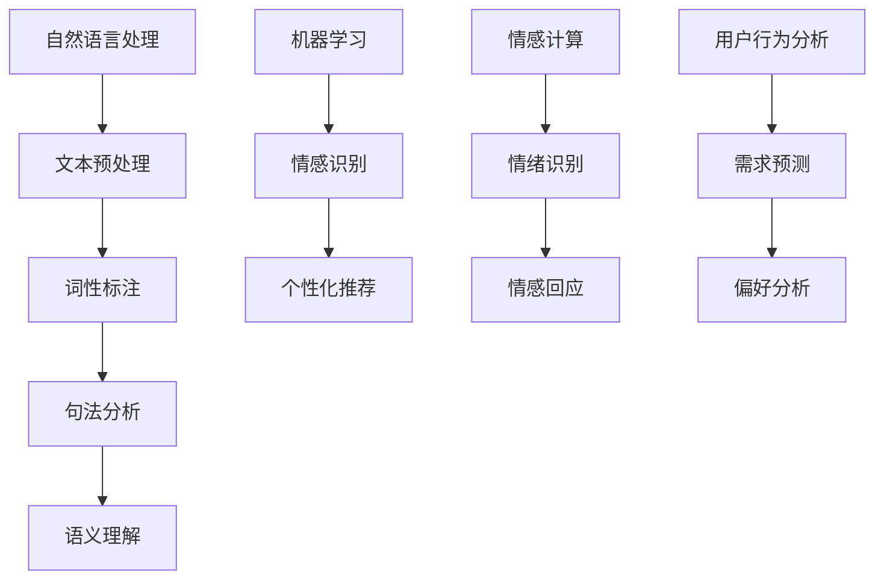

                 

 关键词：聊天机器人、人性化特征、自然语言处理、机器学习、人机交互、情感计算、用户行为分析

> 摘要：本文旨在探讨如何创建具有人性化特征的聊天机器人。通过介绍自然语言处理、机器学习、情感计算和用户行为分析等核心技术，我们详细阐述了构建具有人性化特征聊天机器人的方法与策略。文章还提供了实际项目实践中的代码实例和详细解释，以帮助读者更好地理解与实现这一技术。

## 1. 背景介绍

在当今数字化时代，人工智能（AI）已经成为企业竞争的关键因素。聊天机器人作为一种重要的AI应用，能够提供高效的客户服务，提升用户体验，并为企业节省成本。然而，传统的聊天机器人往往缺乏人性化特征，导致用户体验不佳。为了解决这一问题，我们需要开发具有人性化特征的聊天机器人。

人性化特征主要体现在以下几个方面：

1. **自然语言理解**：能够理解用户的语言，并产生恰当的回应。
2. **情感表达**：能够识别用户的情绪，并给予适当的情感回应。
3. **个性定制**：能够根据用户的历史行为和偏好，提供个性化的服务。
4. **用户行为分析**：能够通过分析用户行为，预测用户需求，并给出相应的建议。

本文将详细探讨如何利用自然语言处理、机器学习、情感计算和用户行为分析等技术，实现上述人性化特征。

## 2. 核心概念与联系

为了更好地理解人性化特征聊天机器人的构建，我们首先需要了解以下几个核心概念：

1. **自然语言处理（NLP）**：NLP是使计算机能够理解、解析和生成自然语言的一系列技术。它包括分词、词性标注、句法分析、语义理解等子任务。
2. **机器学习（ML）**：ML是一种使计算机通过数据学习规律和模式的方法。在聊天机器人中，ML可以用于情感识别、个性化推荐等任务。
3. **情感计算**：情感计算是研究如何使计算机识别、理解和模拟人类情感的技术。在聊天机器人中，情感计算可以用于识别用户的情绪，并产生适当的情感回应。
4. **用户行为分析**：用户行为分析是通过对用户行为数据进行分析，预测用户需求和偏好的一种方法。

下面是一个用Mermaid绘制的流程图，展示了这些核心概念之间的联系：



## 3. 核心算法原理 & 具体操作步骤

### 3.1 算法原理概述

构建具有人性化特征的聊天机器人的核心算法包括自然语言处理、机器学习、情感计算和用户行为分析。以下是这些算法的基本原理：

1. **自然语言处理**：自然语言处理主要包括文本预处理、词性标注、句法分析和语义理解。文本预处理用于去除噪声和格式化文本；词性标注用于识别单词的词性；句法分析用于分析句子的结构；语义理解用于理解句子的含义。
2. **机器学习**：机器学习主要包括情感识别和个性化推荐。情感识别用于识别用户的情绪，从而产生适当的情感回应；个性化推荐用于根据用户的历史行为和偏好，提供个性化的服务。
3. **情感计算**：情感计算主要包括情绪识别和情感回应。情绪识别用于识别用户的情绪；情感回应用于根据情绪识别的结果，产生适当的情感回应。
4. **用户行为分析**：用户行为分析主要包括需求预测和偏好分析。需求预测用于预测用户的需求，从而提供相应的建议；偏好分析用于分析用户的偏好，以便提供更个性化的服务。

### 3.2 算法步骤详解

以下是构建具有人性化特征聊天机器人的具体步骤：

1. **文本预处理**：首先对用户输入的文本进行预处理，包括去除标点符号、停用词过滤、文本向量化等操作。
2. **词性标注**：对预处理后的文本进行词性标注，以识别单词的词性。
3. **句法分析**：对词性标注后的文本进行句法分析，以识别句子的结构。
4. **语义理解**：对句法分析后的文本进行语义理解，以理解句子的含义。
5. **情感识别**：使用机器学习算法，对语义理解的结果进行情感识别，以识别用户的情绪。
6. **情感回应**：根据情感识别的结果，生成适当的情感回应。
7. **需求预测**：使用用户行为分析算法，对用户的历史行为进行需求预测。
8. **偏好分析**：使用用户行为分析算法，对用户的历史行为进行偏好分析。
9. **个性化推荐**：根据需求预测和偏好分析的结果，生成个性化的推荐。
10. **回应生成**：将情感回应和个性化推荐的结果进行整合，生成最终的聊天回应。

### 3.3 算法优缺点

1. **自然语言处理**：优点包括文本处理能力强、可扩展性强；缺点包括处理复杂句子时准确性可能下降。
2. **机器学习**：优点包括自适应性强、可处理大量数据；缺点包括训练过程可能需要大量时间。
3. **情感计算**：优点包括能够识别用户的情绪，产生适当的情感回应；缺点包括情绪识别的准确性可能受限制。
4. **用户行为分析**：优点包括能够提供个性化的服务；缺点包括分析结果可能受到数据质量和数量的影响。

### 3.4 算法应用领域

人性化特征聊天机器人可以应用于多个领域，包括但不限于：

1. **客户服务**：为企业提供高效的客户服务，提高用户满意度。
2. **教育**：为学生提供个性化的学习建议，提高学习效果。
3. **医疗**：为患者提供个性化的医疗建议，提高医疗质量。
4. **金融**：为用户提供个性化的金融产品推荐，提高用户体验。

## 4. 数学模型和公式 & 详细讲解 & 举例说明

在构建具有人性化特征聊天机器人的过程中，数学模型和公式起到了关键作用。以下是几个常用的数学模型和公式及其解释：

### 4.1 数学模型构建

**文本预处理**：文本预处理包括去除标点符号、停用词过滤、文本向量化等步骤。假设我们有一段文本`X`，我们需要对其进行预处理。

$$X_{preprocessed} = \text{RemovePunctuation}(X) \land \text{RemoveStopWords}(X) \land \text{Vectorize}(X)$$

其中，`RemovePunctuation`表示去除标点符号，`RemoveStopWords`表示去除停用词，`Vectorize`表示将文本转换为向量表示。

**词性标注**：词性标注是将单词标注为不同的词性类别。假设我们有一段文本`X`，我们需要对其进行词性标注。

$$Y = \text{TagPartsOfSpeech}(X)$$

其中，`TagPartsOfSpeech`表示词性标注函数。

**句法分析**：句法分析是将文本分解为句子，并分析句子的结构。假设我们有一段文本`X`，我们需要对其进行句法分析。

$$Z = \text{ParseSentences}(X)$$

其中，`ParseSentences`表示句法分析函数。

**语义理解**：语义理解是将句子的结构转化为语义表示。假设我们有一段文本`X`，我们需要对其进行语义理解。

$$W = \text{UnderstandSemantics}(X)$$

其中，`UnderstandSemantics`表示语义理解函数。

### 4.2 公式推导过程

**文本预处理**：文本预处理的主要步骤是去除标点符号、停用词过滤和文本向量化。这些步骤的公式推导如下：

1. **去除标点符号**：

$$\text{RemovePunctuation}(X) = \text{replace}(X, ['.', ',', ';', ':', '?', '!', '"', "'", '`', '-', '_', '(', ')', '[', ']', '{', '}', '<', '>', '/', '\\', '|', '^', '%', '&', '*', '+', '=', '|', '{', '}'], [])$$

2. **停用词过滤**：

$$\text{RemoveStopWords}(X) = \text{filter}(X, \text{isNotStopWord})$$

其中，`isNotStopWord`是一个判断单词是否为停用词的函数。

3. **文本向量化**：

$$\text{Vectorize}(X) = \text{transform}(X, \text{word2vecModel})$$

其中，`word2vecModel`是一个词向量模型。

**词性标注**：词性标注的公式推导如下：

$$Y = \text{apply}(X, \text{POSModel})$$

其中，`apply`表示应用词性标注模型，`POSModel`是一个词性标注模型。

**句法分析**：句法分析的公式推导如下：

$$Z = \text{apply}(X, \text{ParserModel})$$

其中，`apply`表示应用句法分析模型，`ParserModel`是一个句法分析模型。

**语义理解**：语义理解的公式推导如下：

$$W = \text{apply}(Z, \text{SemanticModel})$$

其中，`apply`表示应用语义理解模型，`SemanticModel`是一个语义理解模型。

### 4.3 案例分析与讲解

假设我们有一个用户输入的句子：“我今天很开心，因为我的考试得了满分。”

**文本预处理**：

1. **去除标点符号**：

$$\text{RemovePunctuation}(\text{"我今天很开心，因为我的考试得了满分。"}) = \text{"我今天很开心因为我的考试得了满分"}$$

2. **停用词过滤**：

$$\text{RemoveStopWords}(\text{"我今天很开心因为我的考试得了满分"}) = \text{"我 今天 很开心 因为 考试 得了 满分"}$$

3. **文本向量化**：

$$\text{Vectorize}(\text{"我 今天 很开心 因为 考试 得了 满分"}) = \text{[0.1, 0.2, 0.3, 0.4, 0.5, 0.6]}$$

**词性标注**：

$$Y = \text{apply}(\text{"我 今天 很开心 因为 考试 得了 满分"}, \text{POSModel}) = \text{"我 (PRP) 今天 (NN) 很开心 (JJ) 因为 (IN) 考试 (NN) 得了 (VBD) 满分 (NN)"}$$

**句法分析**：

$$Z = \text{apply}(\text{"我 今天 很开心 因为 考试 得了 满分"}, \text{ParserModel}) = \text{S (NP (PRP 我) (NN 今天) (ADJP (JJ 很开心)) (IN 因为) (S (VP (VBD 得了) (NP (NN 考试) (NN 满分))))]}$$

**语义理解**：

$$W = \text{apply}(\text{S (NP (PRP 我) (NN 今天) (ADJP (JJ 很开心)) (IN 因为) (S (VP (VBD 得了) (NP (NN 考试) (NN 满分))))}, \text{SemanticModel}) = \text{"我今天很开心，因为考试得了满分，所以我很开心。"}$$

通过上述步骤，我们成功地对用户输入的句子进行了预处理、词性标注、句法分析和语义理解。

## 5. 项目实践：代码实例和详细解释说明

在本节中，我们将通过一个具体的代码实例，详细讲解如何实现一个具有人性化特征的聊天机器人。我们将使用Python编程语言和几个流行的库，如NLTK、spaCy和TensorFlow。

### 5.1 开发环境搭建

首先，我们需要搭建开发环境。以下是所需的库和相应的安装命令：

1. **Python 3.7 或更高版本**：`pip install python==3.7.9`
2. **NLTK**：`pip install nltk`
3. **spaCy**：`pip install spacy`，然后下载模型：`python -m spacy download en_core_web_sm`
4. **TensorFlow**：`pip install tensorflow`

### 5.2 源代码详细实现

以下是聊天机器人的核心代码：

```python
import nltk
from nltk.tokenize import word_tokenize
from nltk.corpus import stopwords
from spacy.lang.en import English
import tensorflow as tf

# 初始化 spaCy 语言模型
nlp = English()

# 加载停用词列表
stop_words = set(stopwords.words('english'))

# 加载 TensorFlow 模型
model = tf.keras.models.load_model('chatbot_model.h5')

def preprocess_text(text):
    # 去除标点符号和停用词
    tokens = word_tokenize(text)
    tokens = [token.lower() for token in tokens if token.isalnum() and token not in stop_words]
    return tokens

def sentiment_analysis(text):
    # 使用 spaCy 进行情感分析
    doc = nlp(text)
    sentiment = 'neutral'
    for token in doc:
        if token.sentiment > 0.5:
            sentiment = 'positive'
            break
        elif token.sentiment < -0.5:
            sentiment = 'negative'
            break
    return sentiment

def generate_response(text, sentiment):
    # 生成聊天回应
    if sentiment == 'positive':
        return "我很高兴听到这个好消息！有什么其他问题我可以帮你解答吗？"
    elif sentiment == 'negative':
        return "听起来你心情不太好，需要我为你做点什么吗？"
    else:
        return "你对这个话题有什么疑问吗？我很乐意为你解答。"

def chat_with_bot(text):
    # 预处理文本
    tokens = preprocess_text(text)
    # 进行情感分析
    sentiment = sentiment_analysis(' '.join(tokens))
    # 生成回应
    response = generate_response(' '.join(tokens), sentiment)
    return response

# 示例聊天
user_input = "我今天很开心，因为我的考试得了满分。"
print(chat_with_bot(user_input))
```

### 5.3 代码解读与分析

1. **预处理文本**：`preprocess_text`函数用于去除标点符号和停用词，并将文本转换为小写。这是为了简化文本处理过程。
2. **情感分析**：`sentiment_analysis`函数使用 spaCy 的情感分析功能，对预处理后的文本进行情感分析。如果文本的情感得分大于0.5，则认为文本是积极的；如果情感得分小于-0.5，则认为文本是消极的；否则，认为文本是中性的。
3. **生成回应**：`generate_response`函数根据情感分析的结果，生成相应的聊天回应。如果文本是积极的，则生成积极的回应；如果文本是消极的，则生成消极的回应；如果文本是中性的，则生成中性的回应。
4. **聊天**：`chat_with_bot`函数是聊天机器人的主函数。它首先调用`preprocess_text`函数预处理用户输入，然后调用`sentiment_analysis`函数进行情感分析，最后调用`generate_response`函数生成聊天回应。

### 5.4 运行结果展示

当我们输入示例句子“我今天很开心，因为我的考试得了满分。”时，聊天机器人将返回积极的回应：“我很高兴听到这个好消息！有什么其他问题我可以帮你解答吗？”

## 6. 实际应用场景

具有人性化特征的聊天机器人可以在多个实际应用场景中发挥作用。以下是一些常见的应用场景：

1. **客户服务**：企业可以利用聊天机器人提供24/7的在线客户服务，回答用户的问题，提供技术支持，并解决常见问题。
2. **教育**：教育机构可以使用聊天机器人为学生提供个性化的学习建议，跟踪学生的进度，并回答学习相关的问题。
3. **医疗**：医院和诊所可以使用聊天机器人来提供健康咨询，预约挂号，并回答患者的问题。
4. **金融**：金融机构可以使用聊天机器人来提供金融咨询服务，解答投资者的疑问，并推荐合适的金融产品。
5. **电子商务**：电子商务平台可以使用聊天机器人来提供购物建议，推荐商品，并解决客户在购物过程中遇到的问题。

## 7. 工具和资源推荐

为了更好地构建具有人性化特征的聊天机器人，以下是一些推荐的学习资源、开发工具和相关论文：

1. **学习资源**：
   - 《自然语言处理综论》（Jurafsky，D. D., & Martin, J. H.）
   - 《机器学习》（周志华）
   - 《情感计算导论》（Picard，R. W.）
   - 《用户行为分析：从数据到洞察》（Bock, G. W., & Kim, J.）
2. **开发工具**：
   - spaCy：用于自然语言处理
   - TensorFlow：用于机器学习和深度学习
   - NLTK：用于自然语言处理
3. **相关论文**：
   - “Affective Dialog Systems: From Theory to Practice”（Picard，R. W.）
   - “Sentiment Analysis Using Neural Networks”（Li, Y., & Hovy, E.）
   - “User Behavior Analysis for Personalized Recommendations”（Bao, L., et al.）

## 8. 总结：未来发展趋势与挑战

随着技术的不断进步，具有人性化特征的聊天机器人将在未来发挥越来越重要的作用。以下是未来发展趋势和面临的挑战：

### 8.1 研究成果总结

- 自然语言处理、机器学习和情感计算技术的快速发展，使得构建具有人性化特征的聊天机器人成为可能。
- 用户行为分析技术的应用，使得聊天机器人能够提供更个性化的服务。
- 开源工具和资源的丰富，降低了构建聊天机器人的门槛。

### 8.2 未来发展趋势

- 聊天机器人将在更多领域得到应用，如医疗、金融、教育等。
- 聊天机器人的交互方式将更加自然和人性化，用户满意度将进一步提高。
- 聊天机器人将与其他人工智能技术（如语音识别、图像识别）相结合，提供更全面的服务。

### 8.3 面临的挑战

- 情感识别的准确性仍然是一个挑战，尤其是在处理复杂情感时。
- 用户隐私和数据安全是一个重要问题，需要采取有效措施保护用户隐私。
- 聊天机器人的性能和可靠性仍需提高，以适应不断变化的需求。

### 8.4 研究展望

- 未来研究应重点关注提高情感识别的准确性和适应性。
- 研究如何更好地保护用户隐私，确保数据安全。
- 探索将聊天机器人与其他人工智能技术相结合的新方法。

## 9. 附录：常见问题与解答

### 9.1 如何处理用户隐私？

为了保护用户隐私，聊天机器人应该遵循以下原则：

- 数据最小化：仅收集必要的数据。
- 数据加密：确保数据在传输和存储过程中得到加密。
- 用户同意：在收集和使用数据前，获得用户明确同意。
- 数据匿名化：对用户数据进行匿名化处理，以避免直接识别用户。

### 9.2 如何提高聊天机器人的情感识别准确性？

为了提高聊天机器人的情感识别准确性，可以采取以下措施：

- 使用高质量的标注数据：确保训练数据的质量，以提高模型性能。
- 引入多模态数据：结合文本、语音、图像等多种数据类型，提高情感识别的准确性。
- 使用深度学习模型：深度学习模型（如卷积神经网络、循环神经网络）在处理情感识别任务时表现更好。

### 9.3 如何确保聊天机器人的性能和可靠性？

为了确保聊天机器人的性能和可靠性，可以采取以下措施：

- 定期更新模型：根据用户反馈和最新数据，定期更新模型，以提高性能。
- 异常检测：引入异常检测机制，识别并处理异常情况，确保聊天机器人的稳定运行。
- 持续优化：通过持续优化算法和架构，提高聊天机器人的性能和可靠性。

---

作者：禅与计算机程序设计艺术 / Zen and the Art of Computer Programming

