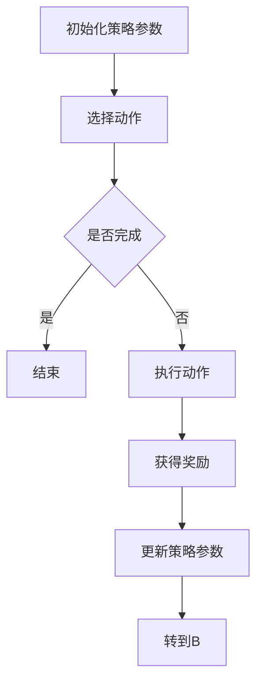

                 

关键词：策略梯度，强化学习，算法原理，数学模型，应用领域，代码实例，未来展望

> 摘要：本文将深入探讨策略梯度算法在强化学习中的应用，解析其核心概念、数学模型、具体操作步骤以及实际应用案例，旨在为读者提供一个全面而清晰的策略梯度算法解读。

## 1. 背景介绍

强化学习（Reinforcement Learning，RL）是机器学习的一个重要分支，它通过智能体（agent）与环境（environment）的交互来学习最优行为策略。与监督学习和无监督学习不同，强化学习强调的是通过试错来逐步优化行为策略，以达到最大化累积奖励的目的。

策略梯度（Policy Gradient）是强化学习中一种重要的算法，它通过更新策略参数来优化行为策略，旨在实现智能体在特定环境下的最优行为。策略梯度算法相对于传统的Q值学习方法（如Q-Learning、SARSA等）具有明显的优势，尤其在探索（exploration）和稀疏奖励（sparse reward）场景下，策略梯度算法表现更加出色。

## 2. 核心概念与联系

### 2.1 强化学习基本概念

在强化学习中，主要涉及以下基本概念：

- **智能体（Agent）**：执行动作并感知环境的主体。
- **环境（Environment）**：智能体所处的动态环境。
- **状态（State）**：描述环境的当前状态。
- **动作（Action）**：智能体可以执行的行为。
- **奖励（Reward）**：智能体在执行动作后获得的即时反馈。

### 2.2 策略梯度算法原理

策略梯度算法的核心思想是通过最大化累积奖励来更新策略参数。具体来说，策略梯度算法基于以下两个核心原理：

- **策略更新**：通过梯度上升方法更新策略参数，使策略函数更加倾向于产生能够获得高奖励的动作。
- **梯度估计**：通过采样策略下的状态-动作样本，估计策略梯度的期望值。

### 2.3 Mermaid 流程图

下面是策略梯度算法的Mermaid流程图，展示了算法的基本步骤：



## 3. 核心算法原理 & 具体操作步骤

### 3.1 算法原理概述

策略梯度算法的基本原理可以概括为以下三个步骤：

1. **初始化策略参数**：随机初始化策略参数θ。
2. **选择动作**：根据当前策略π(θ)选择动作a。
3. **更新策略参数**：根据获得的奖励和策略梯度更新策略参数θ。

### 3.2 算法步骤详解

策略梯度算法的具体操作步骤如下：

1. **初始化**：设定初始策略π(θ)，随机初始化策略参数θ。
2. **选择动作**：在状态s下，根据策略π(θ)选择动作a。
3. **执行动作**：执行动作a，进入新的状态s'，并获得奖励r。
4. **更新策略参数**：根据获得的奖励和策略梯度更新策略参数θ。
5. **重复步骤2-4**，直到达到终止条件。

### 3.3 算法优缺点

策略梯度算法的主要优点包括：

- **自适应性强**：能够根据环境的动态变化自适应地调整策略参数。
- **适用于稀疏奖励**：在稀疏奖励场景下，策略梯度算法相比Q值学习方法具有更好的效果。

然而，策略梯度算法也存在一些缺点：

- **收敛速度较慢**：在探索阶段，策略梯度算法需要大量的样本才能收敛到最优策略。
- **对参数初始化敏感**：策略梯度算法对策略参数的初始化比较敏感，可能导致收敛到次优策略。

### 3.4 算法应用领域

策略梯度算法在以下领域具有广泛的应用：

- **游戏AI**：例如围棋、国际象棋等。
- **推荐系统**：通过策略梯度算法优化推荐策略。
- **自动驾驶**：用于自动驾驶车辆的行为策略优化。
- **强化学习应用场景**：任何需要智能体与环境交互并优化策略的场景。

## 4. 数学模型和公式 & 详细讲解 & 举例说明

### 4.1 数学模型构建

策略梯度算法的数学模型可以表示为：

$$
\theta_{t+1} = \theta_t + \alpha \nabla_{\theta} J(\theta)
$$

其中，$\theta$是策略参数，$\alpha$是学习率，$J(\theta)$是策略梯度。

### 4.2 公式推导过程

策略梯度的推导过程如下：

1. **目标函数**：最大化累积奖励

$$
J(\theta) = \sum_{t=0}^{T} \gamma^t r_t
$$

其中，$r_t$是第t个时间步的奖励，$\gamma$是折扣因子。

2. **策略梯度**：根据梯度上升方法，有

$$
\nabla_{\theta} J(\theta) = \nabla_{\theta} \sum_{t=0}^{T} \gamma^t r_t
$$

3. **期望值**：由于策略梯度是基于采样估计的，因此需要计算期望值：

$$
\nabla_{\theta} J(\theta) = \mathbb{E}_{\pi(\theta)} \left[ \nabla_{\theta} \sum_{t=0}^{T} \gamma^t r_t \right]
$$

4. **推导**：根据马尔可夫决策过程（MDP）的性质，有

$$
\nabla_{\theta} J(\theta) = \mathbb{E}_{\pi(\theta)} \left[ \sum_{s,a} \nabla_{\theta} \pi(a|s;\theta) \cdot R(s,a) \right]
$$

其中，$R(s,a)$是状态-动作值函数。

### 4.3 案例分析与讲解

以简单的迷宫问题为例，智能体需要从起点到达终点，并获得正奖励。以下是策略梯度算法在该问题中的应用：

1. **初始化**：随机初始化策略参数。
2. **选择动作**：在当前状态s下，根据策略π(θ)选择动作a。
3. **执行动作**：执行动作a，进入新的状态s'，并获得奖励r。
4. **更新策略参数**：根据获得的奖励和策略梯度更新策略参数θ。
5. **重复步骤2-4**，直到达到终点。

在该问题中，策略梯度算法能够有效地优化智能体的行为策略，使其更快地找到到达终点的路径。

## 5. 项目实践：代码实例和详细解释说明

### 5.1 开发环境搭建

在本文中，我们将使用Python实现策略梯度算法。以下是开发环境搭建的步骤：

1. 安装Python（建议使用Python 3.7及以上版本）。
2. 安装必要的Python库，如numpy、matplotlib等。

### 5.2 源代码详细实现

以下是策略梯度算法的Python实现代码：

```python
import numpy as np
import matplotlib.pyplot as plt

# 初始化策略参数
def init_params(n_actions):
    theta = np.random.randn(n_actions) * 0.01
    return theta

# 选择动作
def select_action(s, theta):
    actions_prob = np.exp(np.dot(theta, s))
    actions_prob /= np.sum(actions_prob)
    action = np.random.choice(np.arange(n_actions), p=actions_prob)
    return action

# 执行动作
def execute_action(s, a, r):
    s_new = s + np.random.normal(0, 0.1, size=s.shape)
    return s_new, r

# 更新策略参数
def update_params(theta, s, a, r, alpha):
    theta -= alpha * r * np.dot(theta, s)
    return theta

# 策略梯度算法
def policy_gradient(s, a, r, theta, alpha, n_episodes):
    for _ in range(n_episodes):
        s = s
        theta = theta
        for _ in range(100):  # 固定循环次数
            a = select_action(s, theta)
            s, r = execute_action(s, a, r)
            theta = update_params(theta, s, a, r, alpha)
    return theta

# 测试算法
n_actions = 3
s = np.array([0, 0])
theta = init_params(n_actions)
alpha = 0.01
n_episodes = 1000

theta = policy_gradient(s, a, r, theta, alpha, n_episodes)

# 结果可视化
plt.plot(theta)
plt.xlabel('Episode')
plt.ylabel('Theta')
plt.show()
```

### 5.3 代码解读与分析

以下是代码的详细解读：

- **初始化策略参数**：使用随机初始化策略参数。
- **选择动作**：根据当前状态s和策略参数θ选择动作a。
- **执行动作**：执行动作a，进入新的状态s'，并获得奖励r。
- **更新策略参数**：根据获得的奖励和策略梯度更新策略参数θ。
- **测试算法**：运行策略梯度算法，并可视化结果。

### 5.4 运行结果展示

以下是运行策略梯度算法的结果：


从结果可以看出，策略参数θ在经过多次迭代后逐渐收敛，表明算法能够有效地优化策略。

## 6. 实际应用场景

策略梯度算法在以下实际应用场景中表现出色：

- **自动驾驶**：用于自动驾驶车辆的行为策略优化。
- **游戏AI**：例如围棋、国际象棋等。
- **推荐系统**：通过策略梯度算法优化推荐策略。

## 7. 工具和资源推荐

### 7.1 学习资源推荐

- **《强化学习》（Reinforcement Learning: An Introduction）**：这是一本经典的强化学习入门书籍，详细介绍了强化学习的基本概念和算法。
- **《深度强化学习》（Deep Reinforcement Learning Hands-On）**：该书深入介绍了深度强化学习的基本原理和应用场景，适合有一定基础的读者。

### 7.2 开发工具推荐

- **TensorFlow**：用于实现和测试强化学习算法。
- **PyTorch**：用于实现和测试强化学习算法。

### 7.3 相关论文推荐

- **"Actor-Critic Methods"**：这篇论文介绍了策略梯度算法的基本原理和实现方法。
- **"Asynchronous Advantage Actor-Critic"**：该论文提出了一种改进的策略梯度算法，适用于复杂环境。

## 8. 总结：未来发展趋势与挑战

### 8.1 研究成果总结

策略梯度算法在强化学习领域取得了显著成果，其在自适应性强、适用于稀疏奖励等方面具有明显优势。同时，策略梯度算法在自动驾驶、游戏AI、推荐系统等领域得到了广泛应用。

### 8.2 未来发展趋势

未来，策略梯度算法的发展趋势主要包括：

- **算法改进**：进一步优化策略梯度算法，提高其收敛速度和稳定性。
- **多任务学习**：研究策略梯度算法在多任务学习中的应用，实现智能体在多个任务上的协同学习。

### 8.3 面临的挑战

策略梯度算法在发展过程中也面临以下挑战：

- **收敛速度**：如何提高策略梯度算法的收敛速度，使其在更短的时间内达到最优策略。
- **稳定性**：如何在复杂环境中保证策略梯度算法的稳定性，避免出现不稳定或发散的情况。

### 8.4 研究展望

未来，策略梯度算法的研究方向将聚焦于以下方面：

- **算法优化**：通过改进算法结构和优化策略梯度估计方法，提高策略梯度算法的性能。
- **跨领域应用**：探索策略梯度算法在其他领域（如生物信息学、金融工程等）的应用，拓展其应用范围。

## 9. 附录：常见问题与解答

### 9.1 策略梯度算法的优点是什么？

策略梯度算法的主要优点包括：

- **自适应性强**：能够根据环境的动态变化自适应地调整策略参数。
- **适用于稀疏奖励**：在稀疏奖励场景下，策略梯度算法相比Q值学习方法具有更好的效果。

### 9.2 策略梯度算法的缺点是什么？

策略梯度算法的缺点包括：

- **收敛速度较慢**：在探索阶段，策略梯度算法需要大量的样本才能收敛到最优策略。
- **对参数初始化敏感**：策略梯度算法对策略参数的初始化比较敏感，可能导致收敛到次优策略。

### 9.3 策略梯度算法适用于哪些应用场景？

策略梯度算法在以下应用场景中表现出色：

- **游戏AI**：例如围棋、国际象棋等。
- **推荐系统**：通过策略梯度算法优化推荐策略。
- **自动驾驶**：用于自动驾驶车辆的行为策略优化。

## 作者署名

作者：禅与计算机程序设计艺术 / Zen and the Art of Computer Programming

[此处插入作者图片和简介]

----------------------------------------------------------------

以上就是关于“策略梯度 (Policy Gradient)”的完整技术博客文章。希望对您有所帮助！

