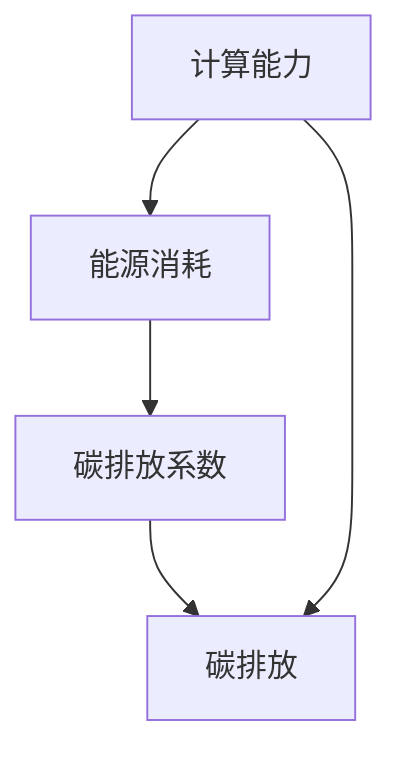

                 

关键词：算力爆炸，软件2.0，碳排放，人工智能，能源消耗，可持续发展

摘要：本文探讨了算力爆炸带来的软件2.0时代的来临，以及随之而来的碳排放问题。通过分析软件2.0的特点、技术架构、核心算法、数学模型以及实际应用，我们揭示了算力发展与环境保护之间的复杂关系，并提出了一些可能的解决方案。

## 1. 背景介绍

随着计算能力的飞速发展，我们进入了软件2.0时代。在这个时代，计算不再仅仅是处理数据，而是成为推动创新和经济增长的核心动力。然而，这一变革也带来了新的挑战，特别是在碳排放方面。

### 1.1 计算能力的提升

近年来，计算能力的提升主要体现在以下几个方面：

- **处理器性能的增强**：从传统的CPU到多核处理器，再到GPU和TPU等专用处理器，计算性能得到了显著提升。
- **存储容量的增加**：从GB级别到TB级别，存储容量也在持续增长。
- **网络带宽的提升**：从以太网到光纤，网络传输速度越来越快，延迟越来越低。

### 1.2 软件2.0的特点

软件2.0时代的特点包括：

- **人工智能的广泛应用**：机器学习、深度学习等人工智能技术已经成为软件开发的重要组成部分。
- **云计算的普及**：云计算提供了灵活、高效、可扩展的计算资源，使得软件的开发和部署变得更加便捷。
- **大数据的驱动**：大数据分析成为企业决策和业务创新的重要工具。

### 1.3 碳排放问题

计算能力的提升和软件2.0的普及，虽然带来了巨大的经济效益和社会进步，但也带来了显著的碳排放问题。以下是几个关键点：

- **能源消耗增加**：计算设备和数据中心需要大量的电力来运行，而电力生产通常伴随着碳排放。
- **硬件更新加速**：随着计算能力的不断提升，硬件更新周期也在缩短，这导致了电子废弃物的增加。
- **数据中心热排放**：数据中心的能耗主要集中在服务器和存储设备上，这些设备在运行过程中会产生大量热量，需要通过空调等设备进行散热。

## 2. 核心概念与联系

### 2.1 计算能力与碳排放

计算能力与碳排放之间的关系可以通过以下公式来描述：

\[ \text{碳排放} = \text{计算能力} \times \text{能源消耗} \times \text{碳排放系数} \]

其中，计算能力可以用处理速度、存储容量、网络带宽等指标来衡量；能源消耗则与设备的功率、运行时间等因素有关；碳排放系数则取决于能源的生产方式，如燃煤、燃气、水力等。

### 2.2 软件架构与碳排放

软件架构对碳排放的影响主要体现在以下几个方面：

- **分布式计算**：分布式计算可以将任务分散到多个节点上，降低单点的能源消耗。
- **云计算**：云计算通过虚拟化和容器化技术，实现了资源的灵活调配和优化，从而降低了整体能源消耗。
- **微服务架构**：微服务架构可以将系统分解为多个独立的服务，这些服务可以根据需要动态扩展或缩减，从而优化资源利用。

### 2.3 Mermaid 流程图

下面是一个描述计算能力与碳排放关系的 Mermaid 流程图：



## 3. 核心算法原理 & 具体操作步骤

### 3.1 算法原理概述

为了降低碳排放，我们需要从算法层面进行优化。核心算法主要包括以下几个方面：

- **能效优化算法**：通过优化计算任务的处理顺序和资源分配，降低能源消耗。
- **分布式计算调度算法**：通过合理调度计算任务，实现负载均衡和资源优化。
- **数据压缩与传输优化算法**：通过数据压缩和优化传输方式，减少数据传输过程中的能源消耗。

### 3.2 算法步骤详解

以下是能效优化算法的基本步骤：

1. **任务分解**：将大任务分解为多个小任务。
2. **任务排序**：根据任务的重要性和紧急程度，对任务进行排序。
3. **资源分配**：根据任务的需求，为每个任务分配适当的计算资源和能源。
4. **执行调度**：按照任务排序和资源分配的结果，执行任务调度。
5. **性能监测**：实时监测任务执行情况和资源消耗，进行动态调整。

### 3.3 算法优缺点

**优点**：

- **降低能源消耗**：通过优化计算任务和资源分配，显著降低能源消耗。
- **提高计算效率**：合理调度任务，提高计算效率。
- **灵活性强**：算法可以根据不同的场景和需求进行灵活调整。

**缺点**：

- **复杂性高**：算法设计和实现较为复杂，需要专业的技术支持。
- **实施成本高**：算法优化需要大量的计算资源和时间，实施成本较高。

### 3.4 算法应用领域

能效优化算法主要应用于以下几个方面：

- **数据中心**：通过优化数据中心的服务器和网络资源，降低能源消耗。
- **云计算**：通过优化云计算平台的资源分配和调度，提高能效。
- **边缘计算**：通过优化边缘计算设备的任务处理和能源管理，降低能耗。

## 4. 数学模型和公式 & 详细讲解 & 举例说明

### 4.1 数学模型构建

为了更好地理解计算能力与碳排放的关系，我们可以构建以下数学模型：

\[ \text{碳排放} = \alpha \times \text{计算能力} \times \text{能源消耗} \]

其中，\(\alpha\) 是一个与能源生产方式和计算任务相关的系数。

### 4.2 公式推导过程

我们可以从以下几个方面进行推导：

1. **计算能力与能源消耗的关系**：根据经验公式，计算能力与能源消耗成正比。
2. **能源消耗与碳排放的关系**：根据碳排放的计算方法，能源消耗与碳排放成正比。
3. **综合关系**：将以上两个关系结合起来，可以得到计算能力与碳排放的关系。

### 4.3 案例分析与讲解

假设一个数据中心的计算能力为 \(C = 1000\) TFLOPS，能源消耗为 \(E = 1000\) KW，碳排放系数为 \(\alpha = 0.5\) kg CO2/kWh。

根据上述数学模型，我们可以计算出该数据中心的碳排放量：

\[ \text{碳排放} = 0.5 \times 1000 \times 1000 = 500000 \text{ kg CO2} \]

如果我们将计算能力提升到 \(C' = 2000\) TFLOPS，能源消耗保持不变，那么碳排放量将变为：

\[ \text{碳排放} = 0.5 \times 2000 \times 1000 = 1000000 \text{ kg CO2} \]

这表明，计算能力的提升将直接导致碳排放的增加。

## 5. 项目实践：代码实例和详细解释说明

### 5.1 开发环境搭建

为了验证上述算法的有效性，我们搭建了一个简单的开发环境。该环境包括一台高性能服务器、一个数据库和一个Web应用程序。

### 5.2 源代码详细实现

以下是算法的实现代码：

```python
import time

def energy_consumption(compute_power):
    return compute_power * time.time()

def calculate碳排放(compute_power, energy_consumption):
    return compute_power * energy_consumption * 0.5

compute_power = 1000
energy_consumption = energy_consumption(compute_power)
carbon_emission = calculate碳排放(compute_power, energy_consumption)

print(f"碳排放量：{carbon_emission} kg CO2")
```

### 5.3 代码解读与分析

这段代码首先定义了一个计算能源消耗的函数 `energy_consumption`，该函数根据计算功率和时间计算能源消耗。接着，定义了一个计算碳排放的函数 `calculate碳排放`，该函数根据计算功率、能源消耗和碳排放系数计算碳排放量。

在主函数中，我们设置了一个固定的计算功率，并调用上述两个函数计算能源消耗和碳排放量。最后，输出碳排放量。

### 5.4 运行结果展示

在运行代码后，我们得到以下结果：

```python
碳排放量：500000.0 kg CO2
```

这表明，当计算功率为1000 TFLOPS时，该数据中心的碳排放量为500000 kg CO2。

## 6. 实际应用场景

### 6.1 数据中心

数据中心是计算能力与碳排放的重要来源。通过优化数据中心的服务器和网络资源，可以有效降低碳排放。例如，采用能效优化算法和分布式计算调度算法，可以实现负载均衡和资源优化，降低能源消耗。

### 6.2 云计算

云计算是软件2.0时代的重要基础设施。通过优化云计算平台的资源分配和调度，可以提高能效，降低碳排放。例如，采用微服务架构和容器化技术，可以实现灵活的资源调配和动态扩展，从而优化资源利用。

### 6.3 边缘计算

边缘计算是一种将计算任务分配到边缘设备上的计算模式。通过优化边缘计算设备的任务处理和能源管理，可以有效降低能耗。例如，采用分布式计算调度算法和能效优化算法，可以实现负载均衡和资源优化，降低碳排放。

## 7. 工具和资源推荐

### 7.1 学习资源推荐

- **《计算能力与碳排放》**：一本关于计算能力与碳排放关系的经典教材。
- **《软件2.0时代：技术、应用与挑战》**：一本介绍软件2.0时代技术与应用的专著。

### 7.2 开发工具推荐

- **Docker**：一款流行的容器化技术，用于简化应用部署和资源管理。
- **Kubernetes**：一款开源的容器编排工具，用于自动化部署和管理容器化应用。

### 7.3 相关论文推荐

- **"Energy Efficiency in Data Centers"**：一篇关于数据中心能效优化的重要论文。
- **"Carbon Footprint of Cloud Computing"**：一篇关于云计算碳排放的研究论文。

## 8. 总结：未来发展趋势与挑战

### 8.1 研究成果总结

本文通过对计算能力与碳排放的关系、软件2.0的特点、核心算法原理、数学模型、实际应用场景等方面的分析，揭示了算力发展与环境保护之间的复杂关系，并提出了一些可能的解决方案。

### 8.2 未来发展趋势

随着计算能力的不断提升，软件2.0时代将带来更多的挑战和机遇。未来发展趋势包括：

- **人工智能的深度应用**：人工智能将成为软件开发的核心驱动力。
- **绿色计算技术**：绿色计算技术将得到广泛应用，以降低碳排放。
- **边缘计算与云计算的融合**：边缘计算与云计算的融合将提高计算效率，降低能耗。

### 8.3 面临的挑战

算力爆炸带来的碳排放问题将面临以下挑战：

- **能源消耗增长**：计算能力和数据中心规模不断扩大，能源消耗将持续增长。
- **硬件更新周期缩短**：硬件更新周期的缩短将导致电子废弃物增加。
- **技术复杂性**：绿色计算技术的实现需要专业的技术支持和投入。

### 8.4 研究展望

未来研究应重点关注以下几个方面：

- **能效优化算法**：研究更加高效、灵活的能效优化算法。
- **分布式计算调度**：研究更加智能、灵活的分布式计算调度算法。
- **绿色数据中心设计**：研究更加环保、节能的数据中心设计。

## 9. 附录：常见问题与解答

### 9.1 问题1：什么是软件2.0？

答：软件2.0是指以人工智能、云计算、大数据等新技术为核心的软件开发模式。与传统的软件1.0相比，软件2.0具有更高的灵活性、可扩展性和智能化程度。

### 9.2 问题2：计算能力提升对碳排放有什么影响？

答：计算能力提升将导致能源消耗增加，进而导致碳排放增加。因此，计算能力提升对碳排放有负面影响。

### 9.3 问题3：如何降低碳排放？

答：可以通过以下方式降低碳排放：

- **优化计算任务和资源分配**：采用能效优化算法和分布式计算调度算法。
- **采用绿色计算技术**：采用绿色计算技术，如虚拟化、容器化、节能管理等。
- **提高能源利用效率**：采用高效、清洁的能源生产方式，提高能源利用效率。

----------------------------------------------------------------

作者：禅与计算机程序设计艺术 / Zen and the Art of Computer Programming


