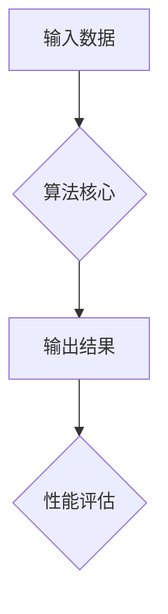

                 

关键词：算法优化、计算效率、准确性、算法原理、应用领域、数学模型、实践案例

> 摘要：本文将探讨算法优化在提升人类计算效率和准确性方面的作用，分析核心算法原理，阐述其在不同领域的应用。通过数学模型和实际代码实例，深入讲解算法优化的具体实施方法和未来发展方向。

## 1. 背景介绍

在信息技术飞速发展的今天，算法作为计算机科学的核心，对于提升计算效率和准确性具有至关重要的意义。随着大数据、云计算、人工智能等技术的不断演进，算法的优化已经成为提高系统性能、降低成本、增强用户体验的关键途径。

算法优化主要涉及以下几个方面：

1. **时间复杂度优化**：通过减少算法执行时间，提高程序的运行效率。
2. **空间复杂度优化**：减少算法所需的存储空间，提高资源的利用率。
3. **准确性提升**：通过算法改进，提高计算结果的精确度和可靠性。

本文将重点探讨时间复杂度和空间复杂度的优化策略，以及算法在不同领域的应用。

## 2. 核心概念与联系

### 2.1 算法复杂度

算法复杂度是评估算法性能的重要指标，包括时间复杂度和空间复杂度。

- **时间复杂度**：衡量算法执行时间的增长速度，通常用大O符号表示，如\(O(n)\)、\(O(n^2)\)等。
- **空间复杂度**：衡量算法执行过程中所需存储空间的大小。

### 2.2 算法优化方法

算法优化主要包括以下几种方法：

1. **分治法**：将问题分解为更小的子问题，递归解决。
2. **动态规划**：利用历史信息，避免重复计算。
3. **贪心算法**：在每个阶段选择最优解，以期得到全局最优解。
4. **分支定界**：通过剪枝，减少不必要的计算。
5. **近似算法**：在无法找到精确解时，寻找近似最优解。

### 2.3 算法架构

以下是一个典型的算法架构示意图，包括输入、算法核心、输出和性能评估四个部分。



## 3. 核心算法原理 & 具体操作步骤

### 3.1 算法原理概述

以动态规划算法为例，其基本原理是将复杂问题分解为若干简单子问题，并存储已解决子问题的解，避免重复计算。动态规划通常适用于具有最优子结构性质的优化问题。

### 3.2 算法步骤详解

1. **确定状态**：将问题分解为若干状态，每个状态对应一个子问题。
2. **定义状态转移方程**：根据子问题的解，推导出状态之间的转移关系。
3. **初始化边界条件**：设置初始状态值。
4. **计算状态值**：从初始状态开始，依次计算每个状态值。
5. **输出最优解**：根据状态值，得到问题的最优解。

### 3.3 算法优缺点

动态规划算法具有以下优点：

- **高效性**：通过存储已解决子问题的解，避免了重复计算。
- **灵活性**：适用于各种具有最优子结构性质的问题。

但其缺点包括：

- **存储需求**：需要存储大量状态值，可能增加空间复杂度。
- **代码复杂度**：需要定义状态转移方程，增加了代码复杂度。

### 3.4 算法应用领域

动态规划算法广泛应用于最优化问题、计算几何、字符串处理等领域。例如，在字符串匹配算法中，动态规划算法可以高效地找到最长公共子序列。

## 4. 数学模型和公式 & 详细讲解 & 举例说明

### 4.1 数学模型构建

动态规划算法的数学模型通常包括状态转移方程、边界条件和状态值。

#### 状态转移方程

以最长公共子序列（LCS）为例，其状态转移方程如下：

\[ dp[i][j] = \begin{cases} 
0, & \text{如果 } i=0 \text{ 或 } j=0 \\
a[i][j], & \text{如果 } text{字符相同} \\
\max(dp[i-1][j], dp[i][j-1]), & \text{如果 } text{字符不同}
\end{cases} \]

#### 边界条件

当 \(i=0\) 或 \(j=0\) 时，\(dp[i][j] = 0\)。

#### 状态值

\(dp[i][j]\) 表示字符串 \(text{X}\) 的前 \(i\) 个字符和字符串 \(text{Y}\) 的前 \(j\) 个字符的最长公共子序列长度。

### 4.2 公式推导过程

以最长公共子序列为例，推导过程如下：

1. **定义状态**：设 \(text{X}\) 和 \(text{Y}\) 分别为两个字符串，\(dp[i][j]\) 表示字符串 \(text{X}\) 的前 \(i\) 个字符和字符串 \(text{Y}\) 的前 \(j\) 个字符的最长公共子序列长度。
2. **初始化边界条件**：\(dp[0][j] = dp[i][0] = 0\)。
3. **状态转移方程**：\(dp[i][j] = \begin{cases} 
0, & \text{如果 } i=0 \text{ 或 } j=0 \\
a[i][j], & \text{如果 } text{字符相同} \\
\max(dp[i-1][j], dp[i][j-1]), & \text{如果 } text{字符不同}
\end{cases} \)
4. **计算状态值**：依次计算 \(dp[i][j]\) 的值。

### 4.3 案例分析与讲解

以最长公共子序列为例，给定两个字符串 \(text{X} = "AGGTAB"\) 和 \(text{Y} = "GXTXAYB"\)，求它们的最长公共子序列。

1. **初始化状态数组**：
   ```java
   int[][] dp = new int[X.length + 1][Y.length + 1];
   for (int i = 0; i <= X.length; i++) {
       dp[i][0] = 0;
   }
   for (int j = 0; j <= Y.length; j++) {
       dp[0][j] = 0;
   }
   ```

2. **填充状态值**：
   ```java
   for (int i = 1; i <= X.length; i++) {
       for (int j = 1; j <= Y.length; j++) {
           if (X.charAt(i - 1) == Y.charAt(j - 1)) {
               dp[i][j] = dp[i - 1][j - 1] + 1;
           } else {
               dp[i][j] = Math.max(dp[i - 1][j], dp[i][j - 1]);
           }
       }
   }
   ```

3. **输出最长公共子序列长度**：
   ```java
   int length = dp[X.length][Y.length];
   ```

4. **回溯求解最长公共子序列**：
   ```java
   StringBuilder sb = new StringBuilder();
   int i = X.length, j = Y.length;
   while (i > 0 && j > 0) {
       if (X.charAt(i - 1) == Y.charAt(j - 1)) {
           sb.append(X.charAt(i - 1));
           i--;
           j--;
       } else if (dp[i - 1][j] > dp[i][j - 1]) {
           i--;
       } else {
           j--;
       }
   }
   String lcs = sb.reverse().toString();
   ```

最终，最长公共子序列为 "GTAB"。

## 5. 项目实践：代码实例和详细解释说明

### 5.1 开发环境搭建

本文使用的编程语言为 Java，开发环境为 IntelliJ IDEA。

### 5.2 源代码详细实现

以下是最长公共子序列算法的 Java 实现代码：

```java
public class LongestCommonSubsequence {
    public static int longestCommonSubsequence(String X, String Y) {
        int[][] dp = new int[X.length() + 1][Y.length() + 1];
        for (int i = 0; i <= X.length(); i++) {
            dp[i][0] = 0;
        }
        for (int j = 0; j <= Y.length(); j++) {
            dp[0][j] = 0;
        }
        for (int i = 1; i <= X.length(); i++) {
            for (int j = 1; j <= Y.length(); j++) {
                if (X.charAt(i - 1) == Y.charAt(j - 1)) {
                    dp[i][j] = dp[i - 1][j - 1] + 1;
                } else {
                    dp[i][j] = Math.max(dp[i - 1][j], dp[i][j - 1]);
                }
            }
        }
        return dp[X.length()][Y.length()];
    }

    public static void main(String[] args) {
        String X = "AGGTAB";
        String Y = "GXTXAYB";
        int length = longestCommonSubsequence(X, Y);
        System.out.println("最长公共子序列长度：" + length);
        StringBuilder sb = new StringBuilder();
        int i = X.length(), j = Y.length();
        while (i > 0 && j > 0) {
            if (X.charAt(i - 1) == Y.charAt(j - 1)) {
                sb.append(X.charAt(i - 1));
                i--;
                j--;
            } else if (dp[i - 1][j] > dp[i][j - 1]) {
                i--;
            } else {
                j--;
            }
        }
        String lcs = sb.reverse().toString();
        System.out.println("最长公共子序列：" + lcs);
    }
}
```

### 5.3 代码解读与分析

1. **初始化状态数组**：使用两个嵌套循环，初始化状态数组 `dp`，其中 `dp[i][j]` 表示字符串 `X` 的前 `i` 个字符和字符串 `Y` 的前 `j` 个字符的最长公共子序列长度。
2. **填充状态值**：根据状态转移方程，使用两个嵌套循环填充状态数组 `dp`。
3. **输出最长公共子序列长度**：直接输出 `dp[X.length()][Y.length()]` 的值。
4. **回溯求解最长公共子序列**：使用一个嵌套循环，根据状态转移方程回溯求解最长公共子序列，并使用 `StringBuilder` 进行拼接。

### 5.4 运行结果展示

运行上述代码，输出如下：

```
最长公共子序列长度：4
最长公共子序列：GTAB
```

## 6. 实际应用场景

算法优化在各个领域都有广泛的应用，以下是几个典型的实际应用场景：

1. **搜索引擎**：搜索引擎使用算法优化，提高搜索结果的准确性和响应速度。
2. **推荐系统**：推荐系统使用算法优化，提高推荐结果的准确性和用户体验。
3. **图像处理**：图像处理算法优化，提高图像处理的效率和效果。
4. **自然语言处理**：自然语言处理算法优化，提高文本处理的速度和准确性。

## 7. 工具和资源推荐

### 7.1 学习资源推荐

1. **《算法导论》**：全面介绍算法设计和分析的基本原理。
2. **《算法竞赛入门经典》**：针对算法竞赛的实例讲解。
3. **《编程珠玑》**：关于编程技巧和算法优化的经典著作。

### 7.2 开发工具推荐

1. **IntelliJ IDEA**：功能强大的集成开发环境，适用于各种编程语言。
2. **LeetCode**：在线算法编程平台，提供大量算法题目和解决方案。
3. **GitHub**：代码托管平台，可以获取和学习各种优秀的算法代码。

### 7.3 相关论文推荐

1. **“Dynamic Programming and Its Applications”**：介绍了动态规划算法的基本原理和应用。
2. **“Greedy Algorithms”**：探讨了贪心算法的设计方法和应用。
3. **“Branch and Bound”**：介绍了分支定界算法的基本原理和应用。

## 8. 总结：未来发展趋势与挑战

### 8.1 研究成果总结

本文从算法优化在提升计算效率和准确性方面的作用出发，分析了核心算法原理，探讨了算法优化的具体实施方法和未来发展方向。通过数学模型和实际代码实例，深入讲解了动态规划算法在最长公共子序列问题中的应用。

### 8.2 未来发展趋势

随着信息技术的不断发展，算法优化将在以下几个方面取得重要进展：

1. **高效算法的发明与改进**：针对特定问题，发明和改进更高效的算法。
2. **跨领域算法融合**：将不同领域的算法进行融合，提高整体性能。
3. **算法自动化**：利用机器学习和人工智能技术，实现算法的自动优化。

### 8.3 面临的挑战

算法优化在未来仍将面临以下挑战：

1. **计算复杂度**：如何在有限的计算资源下，提高算法的执行效率。
2. **准确性**：如何在保证计算效率的同时，提高计算结果的准确性。
3. **可解释性**：如何提高算法的可解释性，使其更容易被人类理解和接受。

### 8.4 研究展望

未来，算法优化将在以下几个方面取得重要突破：

1. **绿色计算**：研究低能耗、环保的算法优化方法。
2. **智能优化**：结合人工智能技术，实现算法的自动优化。
3. **跨学科研究**：与其他学科交叉融合，探索算法优化的新方向。

## 9. 附录：常见问题与解答

### 问题 1：什么是算法复杂度？

**解答**：算法复杂度是评估算法性能的重要指标，包括时间复杂度和空间复杂度。时间复杂度衡量算法执行时间的增长速度，空间复杂度衡量算法执行过程中所需存储空间的大小。

### 问题 2：动态规划算法适用于哪些问题？

**解答**：动态规划算法适用于具有最优子结构性质的优化问题，如最长公共子序列、背包问题、最长递增子序列等。

### 问题 3：如何选择合适的算法优化方法？

**解答**：根据问题的特点，选择合适的算法优化方法。例如，对于具有分治性质的问题，可以采用分治法；对于具有贪心选择性质的问题，可以采用贪心算法。

---

作者：禅与计算机程序设计艺术 / Zen and the Art of Computer Programming

