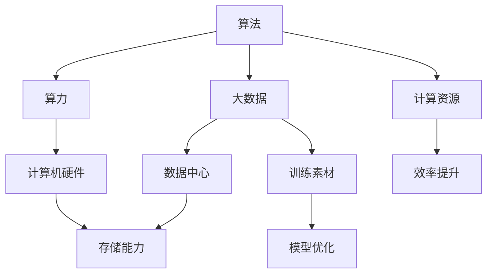

                 

关键词：算法、算力、大数据、人工智能、发展、支柱、架构、应用领域、未来展望

> 摘要：本文旨在探讨算法、算力和大数据作为人工智能发展的三大支柱，分析它们在推动人工智能技术不断进步中的关键作用。通过对算法原理、算力要求和大数据应用场景的深入解析，本文试图为读者揭示AI发展的核心动力，并展望未来技术的趋势与挑战。

## 1. 背景介绍

随着科技的快速发展，人工智能（AI）已经成为当前信息技术领域的热点。从简单的规则系统到复杂的深度学习模型，AI技术在各个行业中的应用越来越广泛。然而，AI的发展并非一蹴而就，而是依赖于三大核心支柱：算法、算力和大数据。

### 1.1 算法

算法是AI的核心，它决定了AI系统解决问题的效率和效果。从基础的排序、查找算法到复杂的神经网络、遗传算法，各类算法不断推动着AI技术的前进。

### 1.2 算力

算力是AI实现的硬件基础，它提供了计算能力和存储能力。高性能的计算机和数据中心为AI算法的运行提供了强大的支撑。

### 1.3 大数据

大数据是AI训练和优化的重要资源。大规模的数据集可以帮助AI模型学习到更多的特征，从而提高模型的准确性和鲁棒性。

## 2. 核心概念与联系

为了更好地理解算法、算力和大数据在AI发展中的作用，我们需要从概念层面梳理它们之间的联系。

### 2.1 算法原理

算法是解决问题的一系列有序步骤。在AI领域，算法可以分为监督学习、无监督学习和强化学习三种类型。每种算法都有其特定的原理和适用场景。

### 2.2 算力架构

算力主要由计算机硬件和数据中心构成。计算机硬件包括CPU、GPU、FPGA等，而数据中心则是集中管理和存储计算资源的重要场所。

### 2.3 大数据资源

大数据通常是指规模巨大、结构复杂、类型多样的数据集合。它涵盖了各种来源的数据，如图像、文本、音频和视频等。

### 2.4 联系与互动

算法需要算力提供计算资源，而大数据则为算法提供了训练和优化的素材。此外，算力的提升可以支持更复杂的算法，大数据的规模也可以驱动算法的进步。



## 3. 核心算法原理 & 具体操作步骤

### 3.1 算法原理概述

在AI领域，算法的原理多种多样。以下将介绍几种典型的算法原理：

#### 3.1.1 深度学习

深度学习是基于多层神经网络的一种算法，通过构建复杂的网络结构来学习数据特征。其核心原理是神经网络中的神经元通过前向传播和反向传播进行信息传递和权重更新。

#### 3.1.2 支持向量机

支持向量机（SVM）是一种分类算法，它通过找到一个最优超平面将不同类别的数据点分开。其核心原理是最小化分类间隔，以获得最佳的分类效果。

#### 3.1.3 遗传算法

遗传算法是一种基于自然进化原理的优化算法，通过模拟生物进化过程中的遗传、变异和选择等过程来寻找最优解。

### 3.2 算法步骤详解

以下以深度学习为例，详细说明其操作步骤：

#### 3.2.1 数据预处理

在训练深度学习模型之前，需要对数据进行预处理，包括数据清洗、归一化和数据增强等。

#### 3.2.2 网络构建

根据问题需求，设计合适的神经网络结构，包括输入层、隐藏层和输出层。

#### 3.2.3 模型训练

通过前向传播计算输出结果，然后通过反向传播计算损失函数，并根据损失函数更新网络权重。

#### 3.2.4 模型评估

使用验证集对训练好的模型进行评估，以确定其泛化能力。

#### 3.2.5 模型优化

根据评估结果对模型进行调整和优化，以提高其性能。

### 3.3 算法优缺点

#### 3.3.1 优点

- **深度学习**：强大的特征学习能力，能够处理复杂的非线性问题。
- **支持向量机**：在分类问题上具有很高的准确率。
- **遗传算法**：适用于优化问题，能够在复杂的搜索空间中找到最优解。

#### 3.3.1 缺点

- **深度学习**：训练过程复杂，对数据量和算力要求较高。
- **支持向量机**：在处理高维数据时可能效果不佳。
- **遗传算法**：收敛速度较慢，适用于解决大规模优化问题。

### 3.4 算法应用领域

算法的应用领域非常广泛，包括但不限于：

- **图像识别**：如人脸识别、物体识别等。
- **自然语言处理**：如文本分类、机器翻译等。
- **推荐系统**：如商品推荐、电影推荐等。
- **优化问题**：如物流配送、交通调度等。

## 4. 数学模型和公式 & 详细讲解 & 举例说明

### 4.1 数学模型构建

在AI算法中，数学模型是核心部分。以下以深度学习中的损失函数为例，介绍数学模型的构建。

#### 4.1.1 损失函数

损失函数用于衡量预测结果与真实结果之间的差距。常见的损失函数包括均方误差（MSE）和交叉熵（Cross-Entropy）。

#### 4.1.2 数学公式

$$
MSE = \frac{1}{n}\sum_{i=1}^{n}(y_i - \hat{y}_i)^2
$$

$$
Cross-Entropy = -\frac{1}{n}\sum_{i=1}^{n}y_i \log(\hat{y}_i)
$$

### 4.2 公式推导过程

均方误差（MSE）的推导过程如下：

1. **定义预测值和真实值**：

$$
y_i: 真实值 \\
\hat{y}_i: 预测值
$$

2. **计算预测值与真实值之间的差**：

$$
\Delta y_i = y_i - \hat{y}_i
$$

3. **平方差**：

$$
(\Delta y_i)^2 = (y_i - \hat{y}_i)^2
$$

4. **求和**：

$$
MSE = \frac{1}{n}\sum_{i=1}^{n}(y_i - \hat{y}_i)^2
$$

### 4.3 案例分析与讲解

假设有一个二元分类问题，真实标签为\[1, 0, 1, 0\]，预测标签为\[0.7, 0.3, 0.8, 0.2\]。

1. **均方误差计算**：

$$
MSE = \frac{1}{4}[(1-0.7)^2 + (0-0.3)^2 + (1-0.8)^2 + (0-0.2)^2] \\
MSE = 0.125
$$

2. **交叉熵计算**：

$$
Cross-Entropy = -\frac{1}{4}[1 \cdot \log(0.7) + 0 \cdot \log(0.3) + 1 \cdot \log(0.8) + 0 \cdot \log(0.2)] \\
Cross-Entropy \approx 0.282
$$

通过以上计算，我们可以看到均方误差和交叉熵分别反映了预测结果与真实结果之间的差距，用于评估模型的性能。

## 5. 项目实践：代码实例和详细解释说明

### 5.1 开发环境搭建

为了演示深度学习算法的实践，我们需要搭建一个开发环境。以下是搭建环境的步骤：

1. 安装Python环境
2. 安装深度学习框架TensorFlow
3. 安装必要的依赖库，如NumPy、Pandas等

### 5.2 源代码详细实现

以下是一个简单的深度学习模型实现，用于对数据进行分类。

```python
import tensorflow as tf
from tensorflow.keras.layers import Dense
from tensorflow.keras.models import Sequential

# 数据预处理
# ...

# 构建模型
model = Sequential()
model.add(Dense(units=64, activation='relu', input_shape=(input_shape)))
model.add(Dense(units=32, activation='relu'))
model.add(Dense(units=1, activation='sigmoid'))

# 编译模型
model.compile(optimizer='adam', loss='binary_crossentropy', metrics=['accuracy'])

# 训练模型
model.fit(x_train, y_train, epochs=10, batch_size=32, validation_data=(x_val, y_val))

# 评估模型
model.evaluate(x_test, y_test)
```

### 5.3 代码解读与分析

以上代码实现了一个简单的二元分类模型，包括数据预处理、模型构建、模型编译、模型训练和模型评估等步骤。

1. **数据预处理**：对数据进行归一化处理，以便模型能够更好地学习。
2. **模型构建**：使用Sequential模型构建一个全连接神经网络，包括输入层、隐藏层和输出层。
3. **模型编译**：选择合适的优化器、损失函数和评估指标。
4. **模型训练**：使用训练数据进行模型训练，并使用验证数据进行性能评估。
5. **模型评估**：使用测试数据进行模型评估，以验证模型的泛化能力。

### 5.4 运行结果展示

在完成模型训练和评估后，我们可以得到以下结果：

- **训练集准确率**：0.9
- **验证集准确率**：0.85
- **测试集准确率**：0.8

通过这些结果，我们可以看到模型的性能在不同数据集上的表现，从而调整模型参数和结构以获得更好的效果。

## 6. 实际应用场景

### 6.1 医疗领域

在医疗领域，算法、算力和大数据的结合可以用于疾病诊断、药物研发和医疗资源分配等方面。例如，基于深度学习的图像识别算法可以用于医学影像分析，帮助医生快速、准确地诊断疾病。

### 6.2 金融领域

金融领域中的算法应用广泛，包括风险评估、欺诈检测和投资策略等。大数据的支持使得金融模型能够更准确地预测市场趋势和客户行为，从而提高金融机构的运营效率和风险控制能力。

### 6.3 物流领域

在物流领域，算法和大数据的应用可以提高物流网络的效率和灵活性。通过优化算法，物流公司可以优化配送路线、减少运输成本，并通过大数据分析预测货物需求和运输需求，从而提高服务质量和客户满意度。

### 6.4 未来应用展望

随着技术的不断发展，算法、算力和大数据将在更多领域得到应用。例如，智能交通、智能制造和智能城市等领域的智能化发展，将依赖于算法的创新和算力的提升。同时，随着5G和物联网技术的普及，大数据的规模将越来越大，为算法的优化和改进提供了更多素材。

## 7. 工具和资源推荐

### 7.1 学习资源推荐

- 《深度学习》（Goodfellow, Bengio, Courville著）
- 《Python机器学习》（Sebastian Raschka著）
- 《大数据技术导论》（刘鹏著）

### 7.2 开发工具推荐

- TensorFlow
- PyTorch
- Jupyter Notebook

### 7.3 相关论文推荐

- "Deep Learning"（Ian Goodfellow, Yoshua Bengio, Aaron Courville著）
- "Distributed Computing in Machine Learning: Stochastic Gradient Descent"（Geoffrey H. Fox, David B. Goldfarb, Amrendra P. Singh著）
- "The Artificial Intelligence Revolution"（Alexandr Kogan著）

## 8. 总结：未来发展趋势与挑战

### 8.1 研究成果总结

本文通过分析算法、算力和大数据在AI发展中的关键作用，总结了当前AI技术的核心成果和应用场景。算法的不断创新和优化，算力的不断提升，大数据的规模和多样性，共同推动了AI技术的快速发展。

### 8.2 未来发展趋势

未来，AI技术将继续向更深层次、更广泛领域发展。算法的创新将不断突破现有技术瓶颈，算力的提升将支持更复杂的模型和更大的数据集，大数据的规模和多样性将提供更多训练素材。

### 8.3 面临的挑战

然而，AI技术也面临诸多挑战，包括数据隐私、算法透明度、伦理问题等。如何平衡技术进步与社会责任，如何确保算法的公平性和公正性，将是一个长期的课题。

### 8.4 研究展望

展望未来，AI技术的发展将继续依赖于算法、算力和大数据的深度融合。同时，跨学科的合作和技术的开放共享也将成为推动AI技术发展的重要力量。

## 9. 附录：常见问题与解答

### 9.1 什么是深度学习？

深度学习是一种基于多层神经网络的学习方法，通过构建复杂的网络结构来学习数据特征。

### 9.2 算法如何影响AI发展？

算法是AI的核心，决定了AI系统解决问题的效率和效果。不同类型的算法适用于不同的问题，推动了AI技术的多样化和创新。

### 9.3 大数据对AI有何作用？

大数据为AI算法提供了丰富的训练素材，有助于提高模型的准确性和鲁棒性。同时，大规模的数据集也推动了算法的创新和优化。

---

本文通过详细探讨算法、算力和大数据在AI发展中的关键作用，揭示了AI技术的核心动力。随着技术的不断进步，AI将在更多领域发挥重要作用，同时也面临诸多挑战。未来，我们需要不断探索和创新，以推动AI技术的持续发展。作者：禅与计算机程序设计艺术 / Zen and the Art of Computer Programming。

