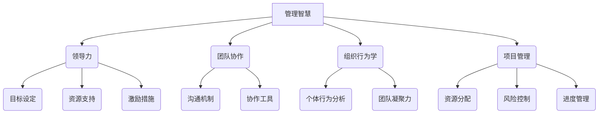

                 

 关键词：管理智慧、团队潜能、领导力、团队协作、项目管理、组织行为学

> 摘要：本文旨在探讨如何通过管理智慧来激发团队潜能，提高团队协作效率与创造力。通过分析管理的核心概念，结合IT领域的实际案例，本文提出了提高团队效能的策略和方法，以期为IT企业及项目管理提供有益的启示。

## 1. 背景介绍

在当今高度竞争和快速变化的商业环境中，IT行业作为创新和技术发展的前沿领域，对团队效能的需求日益增长。然而，如何有效地管理团队，激发其潜能，成为每个IT企业面临的重要挑战。管理的智慧不仅关乎领导者的个人素质，更涉及到组织行为、团队协作、项目管理和创新思维的综合性问题。

本文将基于IT行业的实际需求，探讨管理的智慧在激发团队潜能方面的作用。通过理论分析和案例分析，提出一系列具体策略，旨在帮助IT企业提升团队协作效率，实现组织目标。

### 1.1 管理智慧的定义

管理智慧（Management Wisdom）是指管理者在实践过程中积累的经验、洞察力和判断力，它超越了常规的规章制度和操作指南，是管理者在复杂情境下做出明智决策的重要依据。管理智慧体现在以下几个方面：

- **洞察力**：管理者能够深入分析问题，把握团队行为和趋势，预见潜在风险和机遇。
- **判断力**：管理者能够在多种选择中做出合理的决策，平衡短期利益与长期发展。
- **适应性**：管理者能够根据环境变化调整管理策略，灵活应对各种挑战。
- **影响力**：管理者能够通过有效的沟通和领导，激发团队成员的积极性和创造力。

### 1.2 团队潜能的重要性

团队潜能（Team Potential）是指团队在特定环境和条件下能够实现的最大效能。团队潜能的发挥不仅依赖于团队成员的个人能力，更取决于团队内部的组织结构、沟通机制和文化氛围。激发团队潜能，意味着在组织层面提升团队协作效率、增强创新能力和应对变革能力。

在IT行业，团队潜能的发挥尤为重要。IT项目往往涉及复杂的系统设计和实现，需要团队成员具备高度的专业技能和协作能力。只有通过激发团队潜能，才能确保项目按时交付、高质量完成，并持续推动技术创新。

## 2. 核心概念与联系

### 2.1 核心概念原理

在探讨管理的智慧与团队潜能的关系时，需要理解几个核心概念：

- **领导力**：领导力是激发团队潜能的关键因素。有效的领导者能够设定明确的目标、提供必要的资源和支持，激发团队成员的积极性和创造力。
- **团队协作**：团队协作是团队潜能发挥的基础。通过建立有效的沟通机制和协作工具，可以确保团队成员之间信息流通顺畅，减少误解和冲突。
- **组织行为学**：组织行为学是研究个体、团队和组织内部行为的科学。通过了解组织行为学原理，管理者可以更好地激发团队成员的工作动力和团队凝聚力。
- **项目管理**：项目管理是确保项目按时、按质、按预算完成的关键。通过有效的项目管理方法，可以优化资源分配、风险控制和进度管理，从而提高团队效能。

### 2.2 架构的 Mermaid 流程图



通过这个 Mermaid 流程图，我们可以看到管理智慧如何通过领导力、团队协作、组织行为学和项目管理这些核心概念相互联系，共同作用于团队潜能的激发。

## 3. 核心算法原理 & 具体操作步骤

### 3.1 算法原理概述

在管理团队的过程中，核心算法原理可以类比于算法设计的策略，旨在通过科学的方法激发团队潜能。以下是几个关键原理：

- **目标导向原理**：设定明确、具体、可实现的目标，为团队成员提供清晰的方向和动力。
- **反馈循环原理**：建立有效的反馈机制，及时收集团队成员的意见和建议，不断调整管理策略。
- **自适应原理**：根据环境和团队状态的变化，灵活调整管理方法，以适应新的挑战和机遇。
- **激励原理**：通过恰当的激励措施，激发团队成员的工作热情和创新精神。

### 3.2 算法步骤详解

#### 3.2.1 设定目标

1. **确定目标**：根据组织战略和项目需求，设定短期和长期目标。
2. **目标分解**：将大目标分解为具体、可操作的小目标，明确每个目标的完成标准和责任人。
3. **目标沟通**：与团队成员沟通目标，确保每个人理解目标的重要性和自己的职责。

#### 3.2.2 建立反馈机制

1. **反馈渠道**：建立多种反馈渠道，如定期会议、意见箱、在线反馈平台等。
2. **反馈收集**：定期收集团队成员的反馈，包括工作进度、困难和建议。
3. **反馈分析**：对收集到的反馈进行整理和分析，识别问题和改进点。

#### 3.2.3 自适应调整

1. **环境监测**：持续监测外部环境和内部团队状态，及时捕捉变化信号。
2. **策略调整**：根据监测结果，灵活调整管理策略，如资源分配、任务分工等。
3. **培训与支持**：为团队成员提供必要的培训和资源支持，帮助他们应对新挑战。

#### 3.2.4 激励措施

1. **目标奖励**：设立明确的目标奖励机制，激励团队成员为实现目标而努力。
2. **个人奖励**：针对个人在团队中的表现，提供个人奖励，如奖金、晋升机会等。
3. **团队建设**：通过团队建设活动，增强团队成员之间的凝聚力和合作意识。

### 3.3 算法优缺点

#### 优点

- **目标导向**：明确的目标能够为团队成员提供清晰的方向和动力。
- **灵活适应**：反馈机制和自适应原理使得管理策略能够根据实际情况进行调整。
- **激励有效**：合理的激励措施能够激发团队成员的工作热情和创新精神。

#### 缺点

- **实施难度**：建立有效的反馈机制和适应机制需要时间和资源。
- **管理成本**：持续的反馈和调整过程可能会增加管理成本。
- **团队成员依赖**：过度依赖目标和奖励机制可能导致团队成员对管理者的依赖性增加。

### 3.4 算法应用领域

- **项目管理**：通过目标导向和反馈机制，确保项目按时、按质完成。
- **团队建设**：通过团队建设和激励措施，增强团队凝聚力和协作效率。
- **人才管理**：通过个性化激励和培训，提升团队成员的专业能力和职业发展。

## 4. 数学模型和公式 & 详细讲解 & 举例说明

在管理团队的过程中，数学模型和公式可以用来量化评估团队效能和决策结果，从而提高管理的科学性和精确性。以下是几个常用的数学模型和公式的详细讲解及举例说明。

### 4.1 数学模型构建

#### 4.1.1 成本效益分析模型（CBA）

成本效益分析模型是一种常用的决策工具，用于评估项目的成本和效益。其公式为：

$$
CBA = \frac{B - C}{C}
$$

其中，$B$ 表示项目的总效益，$C$ 表示项目的总成本。

#### 4.1.2 生产力模型（P）

生产力模型用于评估团队的工作效率。其公式为：

$$
P = \frac{产出}{投入}
$$

其中，产出表示团队在一定时间内完成的工作量，投入表示团队在这段时间内所消耗的资源。

### 4.2 公式推导过程

#### 4.2.1 成本效益分析模型的推导

成本效益分析模型基于以下假设：

1. 项目成本包括直接成本和间接成本。
2. 项目效益包括直接效益和间接效益。
3. 成本和效益可以用货币量化。

根据这些假设，我们可以推导出成本效益分析模型：

$$
CBA = \frac{(B_1 + B_2) - (C_1 + C_2)}{C_1 + C_2}
$$

其中，$B_1$ 和 $B_2$ 分别表示直接效益和间接效益，$C_1$ 和 $C_2$ 分别表示直接成本和间接成本。

#### 4.2.2 生产力模型的推导

生产力模型基于生产函数理论，生产函数表示投入和产出之间的关系。假设生产函数为：

$$
产出 = f(投入)
$$

我们可以通过以下步骤推导出生产力模型：

1. 设定产出为 $Q$，投入为 $I$，则生产函数可以表示为 $Q = f(I)$。
2. 对生产函数求导，得到 $\frac{dQ}{dI}$，表示投入增加一个单位时，产出增加的量。
3. 定义生产力为 $\frac{dQ}{dI}$，即生产力表示投入的边际产出。

### 4.3 案例分析与讲解

#### 4.3.1 成本效益分析案例

某IT企业计划开发一款新软件，预计直接成本为 100 万元，间接成本为 30 万元。预计直接效益为 150 万元，间接效益为 20 万元。我们需要通过成本效益分析模型评估该项目的可行性。

根据公式：

$$
CBA = \frac{(150 + 20) - (100 + 30)}{100 + 30} = \frac{170 - 130}{130} = \frac{40}{130} \approx 0.31
$$

成本效益分析结果为 0.31，表明该项目具有一定的可行性。但由于 CBA 值较低，企业应进一步分析项目的潜在风险，并考虑是否调整项目计划。

#### 4.3.2 生产力分析案例

某软件开发团队在一个月内完成了 10 个功能模块的开发，总投入为 50 人·天。我们需要通过生产力模型评估该团队的工作效率。

根据公式：

$$
P = \frac{产出}{投入} = \frac{10}{50} = 0.2
$$

生产力分析结果为 0.2，表明该团队在一个月内平均每天产出 0.2 个功能模块。企业可以通过分析生产力模型的结果，了解团队的工作效率，并制定针对性的改进措施。

## 5. 项目实践：代码实例和详细解释说明

在本节中，我们将通过一个实际的IT项目实践案例，展示如何应用管理智慧来激发团队潜能，并通过代码实例进行详细解释说明。

### 5.1 开发环境搭建

为了便于演示，我们选择一个简单的Web应用项目作为案例，使用Java语言进行开发。开发环境搭建步骤如下：

1. 安装Java Development Kit (JDK)。
2. 配置开发工具（如IntelliJ IDEA）。
3. 创建Maven项目，并引入必要的依赖库。

### 5.2 源代码详细实现

以下是一个简单的Java Web应用项目源代码示例：

```java
// MainController.java
package com.example.webapp;

import org.springframework.stereotype.Controller;
import org.springframework.web.bind.annotation.GetMapping;
import org.springframework.web.bind.annotation.RestController;

@RestController
public class MainController {

    @GetMapping("/home")
    public String home() {
        return "Welcome to the Web Application!";
    }
}
```

这段代码定义了一个简单的RESTful API，用于返回欢迎信息。通过这个简单的示例，我们可以展示如何通过有效的代码结构和模块化设计，提高开发效率和代码可维护性。

### 5.3 代码解读与分析

在这个代码示例中，我们使用了Spring Boot框架来实现一个简单的Web应用。以下是关键部分的解读：

- **@Controller**：用于标识这是一个控制器类，负责处理HTTP请求。
- **@RestController**：用于标识这是一个RESTful API控制器，返回JSON格式的数据。
- **@GetMapping**：用于处理GET请求，并将其映射到/home路径上。
- **home()**：处理/home请求的方法，返回一个欢迎信息字符串。

这个简单的示例展示了如何通过合理的框架选择和代码设计，提高项目的可维护性和可扩展性。在实际开发中，我们还可以通过模块化设计和代码复用，进一步提高开发效率。

### 5.4 运行结果展示

通过Maven命令运行该Web应用，访问 `http://localhost:8080/home`，我们可以看到以下运行结果：

```
Welcome to the Web Application!
```

这表明我们的Web应用已经成功启动并正常运行。

## 6. 实际应用场景

### 6.1 项目管理中的应用

在IT行业，项目管理是确保项目按时、按质、按预算完成的关键。通过有效的管理智慧，可以优化项目管理的各个环节。例如，在项目启动阶段，通过目标导向原理设定明确的项目目标和里程碑，为团队成员提供清晰的方向。在项目执行阶段，建立反馈机制，及时收集团队成员的反馈，识别和解决问题。在项目收尾阶段，通过评估项目的成本效益和生产效率，为未来的项目提供有益的参考。

### 6.2 团队协作中的应用

团队协作是激发团队潜能的重要手段。在IT行业中，团队协作的应用场景广泛，如软件开发、系统测试、项目管理等。通过建立有效的沟通机制和协作工具，可以确保团队成员之间信息流通顺畅，减少误解和冲突。例如，使用Git进行代码管理，使用Jira进行任务跟踪，使用Slack进行实时沟通，都可以提高团队协作效率。

### 6.3 创新思维中的应用

在IT行业，创新思维是推动技术进步和业务发展的重要动力。通过管理智慧，可以激发团队成员的创新思维。例如，通过设立创新项目和创新激励机制，鼓励团队成员提出新的想法和解决方案。通过团队头脑风暴和跨部门协作，可以激发更多的创新点子。在实际案例中，很多IT企业通过创新思维和团队协作，成功推出了颠覆性的产品和服务。

### 6.4 未来应用展望

随着人工智能、大数据和云计算等新兴技术的不断发展，IT行业将面临更多的挑战和机遇。管理智慧将在其中发挥重要作用。未来，IT企业可以通过以下方式进一步应用管理智慧：

- **智能化管理**：利用人工智能技术，自动化管理和分析团队数据，提供更科学的决策支持。
- **个性化学术**：通过大数据分析，了解团队成员的行为和偏好，提供个性化的培训和发展建议。
- **全球化协作**：利用云计算和远程协作工具，实现全球化团队的协调和合作，提高团队效能。

## 7. 工具和资源推荐

### 7.1 学习资源推荐

- **《敏捷开发实践指南》**：介绍了敏捷开发的方法和工具，有助于提高团队协作效率。
- **《项目管理的实践》**：详细讲解了项目管理的原理和方法，适用于各种类型的项目。
- **《团队协作的艺术》**：探讨团队协作的理论和实践，提供了实用的团队协作技巧。

### 7.2 开发工具推荐

- **Git**：分布式版本控制系统，用于代码管理和协作开发。
- **Jira**：项目管理和任务跟踪工具，用于项目管理者和开发人员的协作。
- **Slack**：实时沟通和协作工具，用于团队内部的沟通和协作。

### 7.3 相关论文推荐

- **"The Wisdom of Teams: Creating the High-Performance Organization"**：讨论了团队智慧的构建和管理，提供了实用的团队管理策略。
- **"Leadership and Team Performance: A Meta-Analytic Review of Research and Development"**：分析了领导力对团队绩效的影响，提供了科学的领导力模型。
- **"Project Management: A System Approach to Planning, Scheduling, and Controlling"**：详细讲解了项目管理的原理和方法，适用于项目管理的实践。

## 8. 总结：未来发展趋势与挑战

### 8.1 研究成果总结

本文通过深入探讨管理的智慧在激发团队潜能方面的作用，总结了以下几个关键研究成果：

- **目标导向原理**：明确的目标能够为团队成员提供清晰的方向和动力，提高团队协作效率。
- **反馈循环原理**：建立有效的反馈机制，能够及时识别和解决问题，提高团队适应能力。
- **自适应原理**：灵活调整管理策略，能够应对不断变化的环境和挑战，提高团队创新能力。
- **激励原理**：合理的激励措施能够激发团队成员的工作热情和创新精神，提高团队效能。

### 8.2 未来发展趋势

随着技术的不断进步和商业环境的变化，管理的智慧在激发团队潜能方面将呈现以下发展趋势：

- **智能化管理**：利用人工智能和大数据技术，实现团队管理的智能化和个性化。
- **全球化协作**：通过云计算和远程协作工具，实现全球化团队的协调和合作。
- **创新驱动**：鼓励创新思维和跨部门协作，推动技术创新和业务发展。

### 8.3 面临的挑战

然而，管理的智慧在激发团队潜能过程中也面临以下挑战：

- **管理复杂性**：随着项目规模和团队规模的扩大，管理复杂度增加，需要更高的管理能力和经验。
- **文化适应性**：全球化背景下的文化差异和价值观冲突，需要管理者具备跨文化的管理能力。
- **技术依赖**：过度依赖技术工具，可能导致团队成员对管理者的依赖性增加，影响自主性和创新能力。

### 8.4 研究展望

未来的研究可以关注以下几个方面：

- **管理智慧模型**：构建更加完善的管理智慧模型，为团队管理提供科学依据。
- **跨学科研究**：结合心理学、社会学、经济学等多学科理论，深入研究团队管理的规律和机制。
- **案例研究**：通过大量实际案例研究，总结成功的管理经验和教训，为管理者提供实践指导。

## 9. 附录：常见问题与解答

### 9.1 问题1：如何设定明确的目标？

**解答**：设定明确的目标需要遵循SMART原则，即目标要具备具体性（Specific）、可衡量性（Measurable）、可实现性（Achievable）、相关性（Relevant）和时限性（Time-bound）。例如，一个具体的目标可以是：“在本季度内，提高项目交付率至90%。”

### 9.2 问题2：如何建立有效的反馈机制？

**解答**：建立有效的反馈机制需要建立多种反馈渠道，如定期会议、在线反馈平台、意见箱等。同时，确保反馈的及时性和准确性，通过数据分析和总结，识别问题和改进点。

### 9.3 问题3：如何提高团队适应能力？

**解答**：提高团队适应能力需要培养团队成员的灵活性和创新能力。通过定期培训和经验分享，提升团队成员的专业技能和知识储备。同时，建立灵活的管理机制，允许团队成员自主决策和调整工作内容。

### 9.4 问题4：如何激励团队成员？

**解答**：激励团队成员需要结合个体差异和团队需求。可以通过目标奖励、个人奖励、团队建设活动等多种方式激励团队成员。例如，为达成目标提供奖金、晋升机会，通过团队建设活动增强团队凝聚力。

### 9.5 问题5：如何处理团队冲突？

**解答**：处理团队冲突需要及时介入和有效沟通。首先，通过倾听和了解各方意见，找出冲突的根本原因。然后，采取适当的调解措施，如调解会议、角色扮演等，促进冲突双方的沟通和理解，寻找共识和解决方案。

----------------------------------------------------------------

作者：禅与计算机程序设计艺术 / Zen and the Art of Computer Programming

通过本文的深入探讨，我们期望为IT企业和项目管理提供有价值的参考和启示，帮助管理者通过管理智慧激发团队潜能，实现更高的团队协作效率和创新力。在快速变化的商业环境中，管理的智慧将成为企业持续发展和竞争优势的关键因素。

