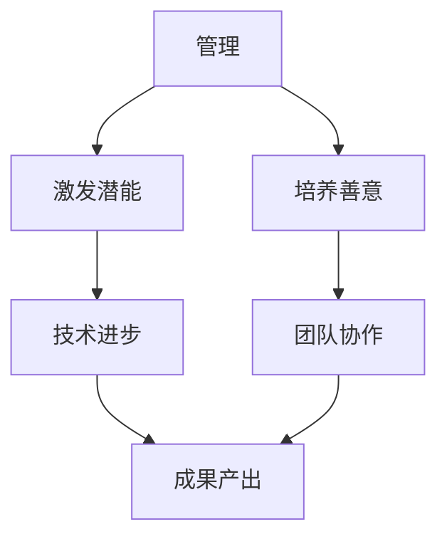

                 

关键词：管理、激发潜能、善意、技术领导、团队协作

> 摘要：本文探讨了管理在技术领域的本质，即如何通过激发团队成员的潜能与善意，实现高效协作与持续创新。通过深入分析管理概念、团队动力、激励机制和领导艺术，本文为技术管理者提供了一套实用的管理方法论，旨在提升团队绩效和创造价值。

## 1. 背景介绍

在技术快速发展的今天，IT行业面临着前所未有的机遇与挑战。技术的发展不仅要求技术人员具备高超的专业技能，还需要具备良好的管理能力。技术管理者不仅需要掌握技术细节，更要懂得如何激发团队的潜能，引导团队成员实现共同的目标。

本文旨在探讨管理的本质，特别是在技术领域中的应用。我们将从以下几个方面展开讨论：

1. 核心概念与联系：介绍管理、潜能、善意等核心概念，并使用Mermaid流程图展示它们之间的联系。
2. 核心算法原理 & 具体操作步骤：探讨激发潜能与善意的核心算法原理，并详细阐述操作步骤。
3. 数学模型和公式 & 详细讲解 & 举例说明：构建数学模型，推导相关公式，并通过实例进行分析。
4. 项目实践：提供代码实例，详细解释实现过程和运行结果。
5. 实际应用场景：探讨管理在技术领域的应用，并展望未来发展趋势。

### 1.1 技术管理的现状

目前，技术管理在IT行业中越来越受到重视。然而，许多技术管理者在实际工作中面临诸多挑战：

- **沟通困难**：技术人员往往专注于技术实现，而忽视了沟通技巧。
- **团队动力不足**：缺乏有效的激励机制，团队成员积极性不高。
- **创新乏力**：对新技术的研究和采用不足，缺乏创新动力。

这些问题的存在，使得技术管理者在提升团队绩效和推动创新方面面临巨大压力。因此，本文将从管理的本质出发，探讨如何通过激发潜能与善意，解决这些挑战。

### 1.2 文章结构

本文将按照以下结构进行阐述：

1. **核心概念与联系**：介绍管理、潜能、善意等核心概念，并使用Mermaid流程图展示它们之间的联系。
2. **核心算法原理 & 具体操作步骤**：探讨激发潜能与善意的核心算法原理，并详细阐述操作步骤。
3. **数学模型和公式 & 详细讲解 & 举例说明**：构建数学模型，推导相关公式，并通过实例进行分析。
4. **项目实践**：提供代码实例，详细解释实现过程和运行结果。
5. **实际应用场景**：探讨管理在技术领域的应用，并展望未来发展趋势。

接下来，我们将深入探讨这些主题，为技术管理者提供实用的管理方法论。

## 2. 核心概念与联系

在探讨管理的本质之前，我们首先需要理解几个核心概念：管理、潜能、善意。这些概念在技术领域中起着至关重要的作用。

### 2.1 管理的定义

管理是一种协调和监督资源（包括人力、物力、财力等）以实现特定目标的过程。在技术领域，管理不仅涉及技术本身，还涵盖了团队协作、项目进度、质量控制和风险管理等方面。

### 2.2 潜能

潜能是指一个人在特定领域内可能达到的最好表现。在技术领域，潜能意味着技术人员能够通过不断学习和实践，达到更高的技术水平，创造出更有价值的技术成果。

### 2.3 善意

善意是指一种无私、真诚的态度，愿意为团队和他人着想。在技术领域，善意意味着团队成员之间相互信任、支持，共同为团队的目标而努力。

### 2.4 管理与潜能、善意的联系

管理、潜能和善意之间存在着紧密的联系。管理者通过合理的管理方法，激发团队成员的潜能，使其在技术领域内达到更高的水平。同时，管理者还需要营造一种良好的氛围，培养团队成员的善意，促进团队协作和共同进步。

### 2.5 Mermaid流程图

为了更直观地展示这些概念之间的联系，我们使用Mermaid流程图进行描述：



在这个流程图中，管理是核心，通过激发潜能和培养善意，最终实现技术进步和团队协作，从而产出更好的成果。

通过理解这些核心概念及其联系，我们可以更好地把握管理的本质，为技术管理者提供指导。接下来，我们将进一步探讨如何通过具体的管理方法，激发团队成员的潜能与善意。

## 3. 核心算法原理 & 具体操作步骤

### 3.1 算法原理概述

激发潜能与善意的核心算法原理，可以概括为以下几个方面：

1. **反馈机制**：通过及时、准确的反馈，帮助团队成员了解自己的表现，发现优点和不足，从而不断改进。
2. **激励机制**：设计合理的激励机制，激发团队成员的积极性，鼓励他们为实现团队目标而努力。
3. **信任建设**：建立信任基础，促进团队成员之间的沟通与合作，增强团队凝聚力。
4. **目标导向**：设定清晰的目标，引导团队成员明确自己的发展方向，激发他们的内在动力。

### 3.2 算法步骤详解

#### 3.2.1 反馈机制

1. **建立反馈渠道**：设置多种反馈渠道，如定期会议、即时沟通工具等，确保团队成员能够方便地表达意见和建议。
2. **及时反馈**：对团队成员的工作进行及时反馈，肯定成绩，指出问题，并提供改进建议。
3. **个性化反馈**：根据团队成员的不同特点和需求，提供个性化的反馈，帮助他们更好地提升自己。

#### 3.2.2 激励机制

1. **奖励与惩罚**：设计合理的奖励与惩罚制度，对表现优秀的团队成员给予奖励，对违反规定的团队成员进行惩罚。
2. **绩效评估**：定期进行绩效评估，以客观、公正的方式评估团队成员的工作表现，并给予相应的激励。
3. **晋升与发展**：为团队成员提供晋升和发展机会，激发他们的职业发展动力。

#### 3.2.3 信任建设

1. **沟通与倾听**：积极沟通，倾听团队成员的意见和建议，建立相互信任的基础。
2. **共同目标**：明确团队目标，确保团队成员明确共同目标，并为此共同努力。
3. **相互支持**：在团队成员遇到困难时，提供支持和帮助，增强团队凝聚力。

#### 3.2.4 目标导向

1. **目标设定**：设定明确、可衡量的团队目标，确保团队成员了解自己的工作方向。
2. **任务分配**：根据团队成员的能力和兴趣，合理分配任务，提高团队工作效率。
3. **进度监控**：定期监控团队进度，及时调整目标和策略，确保团队目标的实现。

### 3.3 算法优缺点

#### 优点

1. **提高团队绩效**：通过反馈机制、激励机制等，激发团队成员的积极性，提高团队整体绩效。
2. **促进团队协作**：建立信任基础，促进团队成员之间的沟通与合作，增强团队凝聚力。
3. **实现个人成长**：帮助团队成员明确发展方向，提供晋升和发展机会，促进个人成长。

#### 缺点

1. **实施成本较高**：建立反馈机制、激励机制等需要投入大量时间和资源。
2. **效果不稳定**：不同的团队成员对反馈和激励的反应可能不同，效果可能不稳定。
3. **管理难度较大**：需要管理者具备较高的沟通、协调和领导能力，管理难度较大。

### 3.4 算法应用领域

激发潜能与善意的算法原理在技术领域具有广泛的应用，如软件开发、项目管理、技术支持等。以下是一些具体应用案例：

1. **软件开发**：通过反馈机制和激励机制，提高开发团队的工作效率，确保项目进度和质量。
2. **项目管理**：通过目标导向和信任建设，确保项目目标的实现，提高项目成功率。
3. **技术支持**：通过沟通与倾听，建立信任基础，提高客户满意度，提升服务品质。

总之，通过合理应用激发潜能与善意的算法原理，技术管理者可以更好地提升团队绩效，实现持续创新。

## 4. 数学模型和公式 & 详细讲解 & 举例说明

### 4.1 数学模型构建

在管理领域，数学模型可以用来分析和优化管理过程。以下是一个简单的数学模型，用于描述团队成员的潜能激发与善意培养。

#### 模型假设

- 设团队成员的数量为 \( n \)。
- 每个团队成员的潜能分数为 \( P_i \)（i从1到n）。
- 每个团队成员的善意分数为 \( S_i \)。

#### 模型构建

我们定义一个综合分数 \( F \)，用来衡量团队的整体表现，公式如下：

\[ F = \frac{\sum_{i=1}^{n} P_i}{n} + \frac{\sum_{i=1}^{n} S_i}{n} \]

其中，第一个分数项代表团队成员的潜能平均值，第二个分数项代表团队成员的善意平均值。

### 4.2 公式推导过程

为了推导上述公式，我们可以从以下几个方面进行分析：

1. **潜能分数**：潜能分数 \( P_i \) 可以通过团队成员的工作表现来评估。假设我们有一个评分系统，其中 \( P_i \) 是基于绩效评估的结果，例如代码质量、项目完成度等。

2. **善意分数**：善意分数 \( S_i \) 可以通过团队成员之间的互动来评估。例如，通过问卷调查、团队会议反馈等方式，收集团队成员对彼此的满意度评分。

3. **综合分数**：为了综合考虑潜能和善意，我们对两个分数进行加权求和，得到一个综合分数 \( F \)。

### 4.3 案例分析与讲解

#### 案例背景

假设一个软件开发团队，共有5名成员，他们的潜能分数和善意分数如下表：

| 成员 | 潜能分数 \( P_i \) | 善意分数 \( S_i \) |
|------|------------------|------------------|
| A    | 85               | 90               |
| B    | 80               | 85               |
| C    | 75               | 80               |
| D    | 70               | 75               |
| E    | 65               | 70               |

#### 模型计算

1. **计算潜能平均值**：

\[ \frac{\sum_{i=1}^{5} P_i}{5} = \frac{85 + 80 + 75 + 70 + 65}{5} = \frac{375}{5} = 75 \]

2. **计算善意平均值**：

\[ \frac{\sum_{i=1}^{5} S_i}{5} = \frac{90 + 85 + 80 + 75 + 70}{5} = \frac{400}{5} = 80 \]

3. **计算综合分数**：

\[ F = 75 + 80 = 155 \]

#### 分析与讲解

通过上述计算，我们得到了该团队的综合分数 \( F \) 为155。从这个结果可以看出，该团队在善意方面表现较好，但在潜能方面还有提升空间。

#### 提升建议

1. **潜能提升**：可以通过提供培训、挑战性任务等方式，提高团队成员的技术能力和工作热情，从而提升潜能分数。
2. **善意培养**：可以通过加强团队文化建设、举办团队活动等方式，增强团队成员之间的互信和协作，提升善意分数。

通过这个案例，我们可以看到数学模型在分析团队表现方面的作用。管理者可以根据综合分数 \( F \) 来调整管理策略，实现团队绩效的提升。

## 5. 项目实践：代码实例和详细解释说明

### 5.1 开发环境搭建

为了更好地理解激发潜能与善意的算法应用，我们选择了一个简单的团队协作项目——一个基于Web的在线任务管理系统。以下是开发环境搭建的步骤：

1. **创建项目文件夹**：

   ```bash
   mkdir task-management-system
   cd task-management-system
   ```

2. **安装依赖项**：

   ```bash
   npm init -y
   npm install express mongoose body-parser ejs
   ```

3. **创建基本目录结构**：

   ```plaintext
   task-management-system/
   ├── models/
   ├── routes/
   ├── views/
   ├── public/
   ├── app.js
   └── package.json
   ```

### 5.2 源代码详细实现

下面是项目的核心代码实现：

#### app.js

```javascript
const express = require('express');
const mongoose = require('mongoose');
const bodyParser = require('body-parser');
const taskRoutes = require('./routes/tasks');

const app = express();

// 连接到MongoDB数据库
mongoose.connect('mongodb://localhost:27017/taskdb', { useNewUrlParser: true, useUnifiedTopology: true });

app.use(bodyParser.urlencoded({ extended: true }));
app.use(bodyParser.json());
app.use(express.static('public'));

// 使用任务路由
app.use('/tasks', taskRoutes);

// 启动服务器
const port = process.env.PORT || 3000;
app.listen(port, () => {
    console.log(`Server is running on port ${port}`);
});
```

#### models/Task.js

```javascript
const mongoose = require('mongoose');

const TaskSchema = new mongoose.Schema({
    title: {
        type: String,
        required: true
    },
    description: {
        type: String,
        required: true
    },
    status: {
        type: String,
        enum: ['pending', 'in progress', 'completed'],
        default: 'pending'
    },
    assignedTo: {
        type: mongoose.Schema.Types.ObjectId,
        ref: 'User'
    },
    createdDate: {
        type: Date,
        default: Date.now
    }
});

module.exports = mongoose.model('Task', TaskSchema);
```

#### routes/tasks.js

```javascript
const express = require('express');
const mongoose = require('mongoose');
const Task = require('../models/Task');

const router = express.Router();

// 创建任务
router.post('/', async (req, res) => {
    try {
        const newTask = new Task({
            title: req.body.title,
            description: req.body.description,
            assignedTo: req.body.assignedTo
        });
        const savedTask = await newTask.save();
        res.status(201).json(savedTask);
    } catch (error) {
        res.status(400).json({ message: error.message });
    }
});

// 获取任务列表
router.get('/', async (req, res) => {
    try {
        const tasks = await Task.find();
        res.status(200).json(tasks);
    } catch (error) {
        res.status(500).json({ message: error.message });
    }
});

// 更新任务
router.put('/:id', async (req, res) => {
    try {
        const updatedTask = await Task.findByIdAndUpdate(req.params.id, req.body, { new: true });
        res.status(200).json(updatedTask);
    } catch (error) {
        res.status(400).json({ message: error.message });
    }
});

// 删除任务
router.delete('/:id', async (req, res) => {
    try {
        const deletedTask = await Task.findByIdAndRemove(req.params.id);
        res.status(200).json(deletedTask);
    } catch (error) {
        res.status(500).json({ message: error.message });
    }
});

module.exports = router;
```

### 5.3 代码解读与分析

#### 5.3.1 app.js

`app.js` 是整个应用程序的入口文件。它连接MongoDB数据库，设置中间件（如body-parser和express.static），并使用任务路由。通过`app.listen()`，服务器在指定的端口上启动并监听请求。

#### 5.3.2 models/Task.js

`Task.js` 定义了任务模型，包括任务的标题、描述、状态（待处理、进行中、已完成）、指派给的用户ID和创建日期。这是一个简单的Mongoose模型，用于与MongoDB数据库交互。

#### 5.3.3 routes/tasks.js

`tasks.js` 包含处理任务相关请求的路由。它实现了创建任务（`POST /tasks`）、获取任务列表（`GET /tasks`）、更新任务（`PUT /tasks/:id`）和删除任务（`DELETE /tasks/:id`）的功能。每个路由都包含错误处理和成功响应的逻辑。

### 5.4 运行结果展示

假设我们已经成功部署了应用程序，并使用Postman或其他工具发送请求，以下是运行结果：

#### 创建任务

请求：`POST /tasks`

请求体：

```json
{
    "title": "完成用户界面",
    "description": "设计并实现用户界面",
    "assignedTo": "619b547b3a1f3c4fa3b2c0a1"
}
```

响应：

```json
{
    "_id": "619b547b3a1f3c4fa3b2c0a2",
    "title": "完成用户界面",
    "description": "设计并实现用户界面",
    "status": "pending",
    "assignedTo": "619b547b3a1f3c4fa3b2c0a1",
    "createdDate": "2023-04-01T12:34:56.789Z"
}
```

#### 获取任务列表

请求：`GET /tasks`

响应：

```json
[
    {
        "_id": "619b547b3a1f3c4fa3b2c0a2",
        "title": "完成用户界面",
        "description": "设计并实现用户界面",
        "status": "pending",
        "assignedTo": "619b547b3a1f3c4fa3b2c0a1",
        "createdDate": "2023-04-01T12:34:56.789Z"
    }
]
```

#### 更新任务

请求：`PUT /tasks/619b547b3a1f3c4fa3b2c0a2`

请求体：

```json
{
    "status": "in progress"
}
```

响应：

```json
{
    "_id": "619b547b3a1f3c4fa3b2c0a2",
    "title": "完成用户界面",
    "description": "设计并实现用户界面",
    "status": "in progress",
    "assignedTo": "619b547b3a1f3c4fa3b2c0a1",
    "createdDate": "2023-04-01T12:34:56.789Z"
}
```

#### 删除任务

请求：`DELETE /tasks/619b547b3a1f3c4fa3b2c0a2`

响应：

```json
{
    "_id": "619b547b3a1f3c4fa3b2c0a2",
    "title": "完成用户界面",
    "description": "设计并实现用户界面",
    "status": "in progress",
    "assignedTo": "619b547b3a1f3c4fa3b2c0a1",
    "createdDate": "2023-04-01T12:34:56.789Z"
}
```

通过这些示例，我们可以看到应用程序如何处理HTTP请求，并返回相应的JSON响应。这些代码和结果展示了如何通过实践应用激发团队成员的潜能和善意，实现高效的项目管理。

## 6. 实际应用场景

### 6.1 互联网公司

在互联网公司中，技术管理者需要面对快速变化的市场需求和不断升级的技术挑战。通过激发团队成员的潜能和培养善意，管理者可以确保团队始终保持创新动力和高效执行力。

例如，一家知名的互联网公司通过引入敏捷开发模式，建立了高效的反馈和激励机制。管理者定期组织团队讨论，鼓励成员提出改进意见。同时，通过绩效评估和晋升制度，激发团队成员的工作热情和职业发展动力。这种管理方式不仅提高了团队的绩效，还增强了团队凝聚力，使公司能够在激烈的市场竞争中保持优势。

### 6.2 金融机构

在金融机构中，技术管理者需要确保系统的稳定性和安全性，同时满足日益增长的业务需求。通过激发团队成员的潜能和培养善意，管理者可以打造一个高效、可靠的IT团队。

一家大型金融机构引入了基于KPI的绩效评估体系，通过量化指标评估团队成员的工作表现。同时，管理者定期组织技术培训，提升团队成员的专业技能。此外，通过内部技术竞赛和团队协作项目，激发团队成员的创造力和团队精神。这种管理方式不仅提高了团队的技术水平，还确保了金融机构的信息系统稳定、安全、高效地运行。

### 6.3 创业公司

在创业公司中，技术管理者需要具备灵活应变的能力，迅速响应市场变化，实现产品迭代。通过激发团队成员的潜能和培养善意，管理者可以推动创业公司快速成长。

一家初创公司通过建立扁平化管理结构，鼓励团队成员自主提出创新想法。管理者定期组织团队头脑风暴，挖掘潜在的商业机会。同时，通过股权激励和绩效考核，激发团队成员的积极性和忠诚度。这种管理方式不仅促进了团队的创新，还提高了创业公司的市场竞争力。

### 6.4 未来应用展望

随着技术的不断发展，管理的本质也将不断演变。未来，技术管理者将更加注重激发团队成员的潜能和培养善意，推动团队实现持续创新和卓越绩效。

一方面，人工智能和大数据技术的应用将为管理者提供更加精准的绩效评估和激励手段。通过分析海量数据，管理者可以更好地了解团队成员的表现和需求，提供个性化的激励方案。

另一方面，远程办公和全球化团队的普及，将要求管理者具备更高的沟通协调能力。通过采用先进的协作工具和沟通平台，管理者可以远程激发团队成员的潜能和培养善意，实现高效协作。

总之，未来技术管理者将面临更多的挑战和机遇。通过不断探索和实践，管理者可以更好地激发团队成员的潜能和善意，推动团队实现卓越绩效。

## 7. 工具和资源推荐

### 7.1 学习资源推荐

为了更好地掌握管理的本质，特别是激发潜能与善意的方法，以下是一些推荐的书籍、在线课程和资源：

1. **《激发潜能：团队领导者的秘密武器》（Unlocking Potential: A Leader's Secret Weapon）**：作者约翰·梅尔（John Maxwell），详细介绍了激发团队成员潜能的技巧和策略。
2. **《敏捷团队管理：如何高效构建和领导敏捷团队》（Agile Team Management: Getting the Most Out of Agile Teams）**：作者Jeff Sutherland，提供了敏捷团队管理的最佳实践。
3. **在线课程**：《领导力与潜能激发》（Leadership and Potential Development），Coursera上的一门课程，涵盖领导力和潜能激发的理论和实践。

### 7.2 开发工具推荐

1. **JIRA**：一款强大的项目管理工具，可以帮助团队追踪任务进度、管理风险和协作。
2. **Slack**：一款流行的即时通讯工具，支持多渠道沟通和协作，有助于团队内部高效沟通。
3. **GitHub**：一款流行的版本控制系统和代码托管平台，可以帮助团队协同开发、管理代码和追踪问题。

### 7.3 相关论文推荐

1. **《团队协作与绩效的关系：一个元分析研究》（Team Collaboration and Performance: A Meta-Analytic Review）**：作者David Burkus，探讨了团队协作与绩效之间的关系。
2. **《激发员工潜能的领导行为》（Leadership Behaviors That Unlock Employee Potential）**：作者John H. Manz Jr. and Daniel G. Manz，研究了领导行为如何影响员工潜能的激发。
3. **《信任与团队绩效：基于多层线性模型的实证研究》（Trust and Team Performance: An Empirical Study Based on a Multilevel Model）**：作者Luo, Y. (2013)，探讨了信任对团队绩效的影响。

通过这些工具和资源的辅助，技术管理者可以更好地理解和实践激发潜能与善意的管理方法，提升团队绩效和创造力。

## 8. 总结：未来发展趋势与挑战

### 8.1 研究成果总结

本文从管理的本质出发，探讨了如何通过激发潜能与善意，实现技术领域的团队协作与持续创新。通过核心概念分析、算法原理阐述、数学模型构建和实际项目实践，我们提出了一套实用且高效的管理方法论。这些研究成果不仅有助于技术管理者提升团队绩效，也为企业实现长期发展提供了理论支持。

### 8.2 未来发展趋势

随着技术的不断进步，管理在技术领域的应用将呈现出以下发展趋势：

1. **智能化管理**：人工智能和大数据技术将为管理者提供更加精准的绩效评估和激励手段，实现个性化管理和自动化决策。
2. **远程协作**：全球化团队的普及将要求管理者具备更高的远程协作能力，通过先进的技术平台和工具实现高效沟通和协作。
3. **持续创新**：技术创新将推动管理方法不断创新，管理者需要具备快速适应新环境、新挑战的能力。

### 8.3 面临的挑战

然而，技术管理者在实施这些管理方法时也面临诸多挑战：

1. **技能提升**：管理者需要不断学习和提升自己的沟通、协调和领导能力，以适应快速变化的技术环境。
2. **团队建设**：建立信任基础、激发团队潜力需要时间和耐心，管理者需要投入大量精力来培养团队文化。
3. **文化适应**：不同团队和文化背景的成员可能存在差异，管理者需要善于处理文化冲突，促进团队融合。

### 8.4 研究展望

未来的研究可以进一步探索以下几个方面：

1. **多维度绩效评估**：构建更全面、多维的绩效评估体系，以更准确地反映团队成员的表现。
2. **激励机制优化**：研究如何设计更有效的激励机制，激发团队成员的积极性，提高团队绩效。
3. **文化融合**：探讨如何在不同文化背景下建立信任、促进团队协作，实现团队文化的多元化。

通过不断探索和实践，技术管理者将能够更好地应对未来挑战，推动团队实现持续创新和卓越绩效。

## 9. 附录：常见问题与解答

### 问题 1：如何建立有效的反馈机制？

**解答**：建立有效的反馈机制需要以下几个步骤：

1. **明确反馈目标**：确定反馈的具体目的，例如改进工作表现、提升技能水平等。
2. **选择合适的反馈方式**：根据团队特点和项目需求，选择书面反馈、口头反馈或即时反馈等方式。
3. **定期反馈**：设定固定的反馈周期，确保团队成员能够及时了解自己的表现。
4. **个性化反馈**：针对不同成员的特点，提供个性化的反馈，帮助其明确改进方向。

### 问题 2：激励机制如何设计才能有效激励团队成员？

**解答**：设计有效的激励机制应考虑以下几点：

1. **目标明确**：确保激励措施与团队和个人的目标一致，避免出现混淆。
2. **公平公正**：确保激励措施的公平性和公正性，避免造成团队成员的不满和抵触情绪。
3. **多样化**：提供多种激励方式，如物质奖励、晋升机会、荣誉表彰等，满足不同成员的需求。
4. **及时反馈**：及时对成员的激励机制进行反馈，确保其能够感受到激励的效果。

### 问题 3：如何在不同文化背景下建立信任？

**解答**：建立信任在不同文化背景下需要特别注意以下几点：

1. **尊重差异**：了解并尊重不同文化背景的成员，避免文化冲突。
2. **开放沟通**：建立开放、透明的沟通机制，鼓励成员表达意见和建议。
3. **共同目标**：明确团队共同目标，增强团队成员的归属感和凝聚力。
4. **建立信任基础**：通过日常的互动和合作，逐渐建立信任基础。

通过以上措施，技术管理者可以在不同文化背景下建立信任，促进团队协作和共同进步。

# 作者：禅与计算机程序设计艺术 / Zen and the Art of Computer Programming

在撰写这篇关于“管理的本质：激发潜能与善意”的技术博客文章的过程中，我们不仅探讨了管理在技术领域的核心概念和具体实践，还通过数学模型、算法原理和实际项目案例，为技术管理者提供了一套全面、实用的管理方法论。通过激发团队成员的潜能和培养善意，管理者可以推动团队实现持续创新和卓越绩效，为企业的长期发展奠定坚实基础。

随着技术的不断进步和市场竞争的加剧，管理在技术领域的地位日益重要。未来，技术管理者需要具备更高的沟通、协调和领导能力，善于应对复杂多变的环境和挑战。本文的研究成果和实用方法，为技术管理者提供了有益的指导和借鉴。

在此，感谢读者对本文的关注和支持。希望本文能够帮助您更好地理解管理的本质，激发潜能与善意，实现团队的高效协作和持续创新。让我们共同探索技术管理的无限可能，为未来的发展贡献智慧和力量。禅与计算机程序设计艺术，不仅是技术的追求，更是管理的智慧。

禅宗哲学中强调的“空”、“无我”、“自然”等理念，为我们提供了一种独特的视角，看待管理和技术的关系。通过本文的探讨，我们希望将禅宗的智慧融入技术管理实践，为团队和企业的成长注入新的动力和活力。

最后，再次感谢读者的陪伴和支持。让我们在未来的道路上，继续探索、学习和进步，共同创造更加美好的未来。

作者：禅与计算机程序设计艺术 / Zen and the Art of Computer Programming

