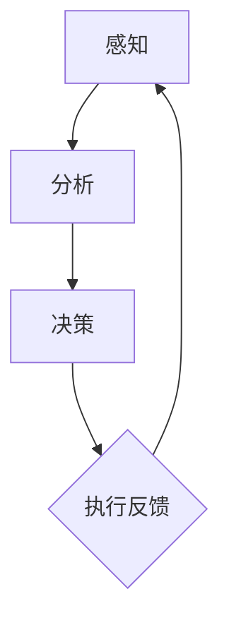

                 

在当今快速变化和高效率要求的IT行业，管理短期目标和长期目标的平衡是确保项目成功和职业生涯发展的关键。本文旨在探讨管理短期目标与长期目标的意识机制，通过深入分析核心概念、算法原理、数学模型和实际应用场景，为读者提供全面的指导。

## 关键词

- 短期目标管理
- 长期目标管理
- 意识机制
- IT行业
- 项目成功

## 摘要

本文首先介绍了短期目标与长期目标管理在IT行业中的重要性，随后详细讨论了意识机制的核心概念及其联系。接着，我们分析了核心算法原理、具体操作步骤、数学模型及其应用领域。文章还通过实际项目实践，展示了算法的代码实现和运行结果。最后，我们对实际应用场景进行了分析，并展望了未来的发展趋势与挑战。

## 1. 背景介绍

在IT行业中，项目的成功往往取决于能否有效地管理短期目标和长期目标。短期目标通常与项目的具体阶段相关，如开发、测试和部署。这些目标是实现项目进展和满足客户需求的直接驱动因素。而长期目标则关注于项目的长期成功和公司的持续发展，如技术创新、市场占有率和品牌建设。

然而，在实践中，管理短期目标和长期目标往往存在冲突。为了追求短期目标的快速实现，团队可能会牺牲长期目标的达成。这种短视行为可能会导致项目的短期成功，但长期来看，可能会损害公司的整体利益和竞争力。因此，建立一套有效的意识机制来平衡短期和长期目标是至关重要的。

### 1.1 现状分析

目前，许多IT公司在项目管理中仍然存在短期目标与长期目标管理的失衡问题。一方面，项目团队在追求短期成果时，可能会过度依赖敏捷开发等快速迭代方法，忽视了长期的技术积累和团队发展。另一方面，公司高层在制定长期战略时，可能缺乏对短期项目执行的细致监督和调整。

这种现状导致了以下几个问题：

- **项目执行风险增加**：过度追求短期目标可能导致项目在关键阶段出现缺陷，增加了项目失败的风险。
- **团队士气下降**：长期目标的缺乏可能导致团队成员感到迷茫和缺乏动力，影响团队的整体士气。
- **资源浪费**：在短期目标的驱动下，公司可能会投入大量资源进行无效的工作，导致资源浪费。

### 1.2 存在的问题

为了解决上述问题，本文将探讨以下核心问题：

- 如何建立有效的意识机制来平衡短期目标和长期目标？
- 如何通过技术手段和管理策略实现这一平衡？
- 如何在实际项目中应用这些意识机制，确保项目既满足短期需求，又有利于长期发展？

接下来，我们将深入讨论意识机制的核心概念和原理，以期为上述问题提供解决方案。

## 2. 核心概念与联系

### 2.1 意识机制概述

意识机制是一种通过感知、分析和决策来管理信息的过程。在短期目标与长期目标管理中，意识机制的核心在于如何有效识别和应对短期与长期目标的冲突。具体来说，意识机制包括以下几个关键步骤：

1. **感知**：收集与项目相关的数据和信息，包括市场动态、客户需求、技术趋势等。
2. **分析**：对收集到的信息进行深入分析，识别出短期和长期目标之间的关系和冲突。
3. **决策**：基于分析结果，制定相应的策略和行动计划，以平衡短期和长期目标。

### 2.2 意识机制的架构

为了更好地理解意识机制的运作方式，我们可以将其架构用Mermaid流程图表示：



在上述架构中，感知环节是意识机制的基础，通过持续收集外部和内部信息，为后续的分析和决策提供数据支持。分析环节则对感知到的信息进行深入处理，识别出短期和长期目标的冲突和优先级。决策环节基于分析结果制定策略，并付诸行动。执行反馈环节则对执行过程进行监控和评估，以不断调整和优化意识机制。

### 2.3 意识机制与短期目标、长期目标的联系

意识机制在管理短期目标和长期目标中起到了关键的桥梁作用。通过感知、分析和决策，意识机制能够帮助团队：

- **识别冲突**：及时发现短期目标和长期目标之间的矛盾，避免因短视行为而损害长期利益。
- **优先排序**：根据当前情况，合理调整目标和任务的优先级，确保关键任务得到优先处理。
- **动态调整**：在项目执行过程中，根据实际情况灵活调整目标和计划，以适应不断变化的市场和技术环境。

总之，意识机制不仅有助于平衡短期目标和长期目标，还能提高项目的整体效率和质量。接下来，我们将进一步探讨意识机制中的核心算法原理，以期为实际应用提供更具体的指导。

## 3. 核心算法原理 & 具体操作步骤

### 3.1 算法原理概述

在意识机制中，核心算法扮演着至关重要的角色。该算法的主要目的是通过数据分析和模型预测，实现短期目标与长期目标的平衡。算法的基本原理可以概括为以下几个步骤：

1. **数据收集**：从各个渠道收集与项目相关的数据，包括市场趋势、客户反馈、技术进展等。
2. **数据预处理**：对收集到的数据进行清洗、整理和归一化处理，确保数据质量。
3. **特征提取**：从预处理后的数据中提取关键特征，用于后续的模型训练和预测。
4. **模型训练**：使用提取的特征数据训练预测模型，以预测短期和长期目标之间的关系和冲突。
5. **决策生成**：根据模型预测结果，生成相应的策略和行动计划，以平衡短期和长期目标。

### 3.2 算法步骤详解

#### 3.2.1 数据收集

数据收集是算法的基础步骤，直接影响到后续分析的准确性和有效性。具体来说，数据收集可以从以下几个方面进行：

- **市场数据**：包括行业趋势、市场动态、竞争对手信息等。
- **客户数据**：包括客户需求、满意度、反馈等。
- **技术数据**：包括技术进展、技术创新、技术成熟度等。
- **内部数据**：包括项目进度、资源分配、团队绩效等。

#### 3.2.2 数据预处理

数据预处理是保证数据质量和一致性的重要步骤。具体包括以下任务：

- **数据清洗**：去除重复数据、异常值和噪声数据，确保数据的一致性和准确性。
- **数据整理**：将数据按照统一的标准进行格式化，确保不同来源的数据可以无缝集成。
- **数据归一化**：将不同量纲的数据转换为相同的尺度，以便进行后续的特征提取和模型训练。

#### 3.2.3 特征提取

特征提取是将原始数据转换为模型输入的关键步骤。具体包括以下任务：

- **特征选择**：从原始数据中选取对模型预测有显著影响的关键特征。
- **特征转换**：将选定的特征转换为适合模型训练的格式，如数值化、归一化等。

#### 3.2.4 模型训练

模型训练是算法的核心步骤，通过训练数据集来优化模型的参数，以提高预测的准确性。具体包括以下任务：

- **选择模型**：根据项目特点和需求选择合适的预测模型，如线性回归、决策树、神经网络等。
- **模型训练**：使用预处理后的特征数据进行模型训练，调整模型参数，以达到最优预测效果。
- **模型评估**：使用验证集或测试集对训练好的模型进行评估，确保模型的泛化能力。

#### 3.2.5 决策生成

决策生成是基于模型预测结果，制定相应的策略和行动计划。具体包括以下任务：

- **目标调整**：根据模型预测结果，调整短期目标和长期目标的优先级，确保目标的平衡。
- **计划制定**：根据目标调整结果，制定具体的行动计划，包括资源分配、任务分工、时间规划等。
- **策略优化**：在执行过程中，根据反馈信息不断优化策略，以适应实际情况。

### 3.3 算法优缺点

#### 3.3.1 优点

- **灵活性**：算法可以根据实际情况动态调整目标和计划，适应快速变化的市场和技术环境。
- **准确性**：通过数据分析和模型预测，算法能够提供准确的短期和长期目标平衡策略。
- **全面性**：算法综合考虑了市场、客户、技术和内部等多个方面因素，确保目标的全面性和准确性。

#### 3.3.2 缺点

- **计算复杂度**：算法涉及大量的数据处理和模型训练，计算复杂度较高，对计算资源和时间有一定要求。
- **数据依赖性**：算法的准确性依赖于数据的质量和完整性，如果数据存在偏差或缺失，可能导致预测结果不准确。
- **模型适应性**：不同项目特点和需求可能导致算法的适用性有限，需要根据实际情况进行调整和优化。

### 3.4 算法应用领域

核心算法在多个IT应用领域具有广泛的应用价值，包括但不限于：

- **项目管理**：用于项目目标管理和任务调度，提高项目执行效率和成功率。
- **市场营销**：用于市场趋势分析和客户需求预测，优化营销策略和资源分配。
- **产品开发**：用于产品规划和迭代，确保产品满足市场和客户需求，同时保持技术领先。
- **人力资源管理**：用于员工绩效评估和资源分配，提高团队整体绩效和员工满意度。

通过核心算法的应用，IT行业可以在保持短期目标实现的同时，确保长期目标的达成，从而实现项目的长期成功和公司的持续发展。

### 4. 数学模型和公式 & 详细讲解 & 举例说明

在意识机制中，数学模型和公式起到了关键作用，它们帮助我们在复杂的IT项目中理解和预测短期目标与长期目标之间的关系。本节将详细介绍这些数学模型和公式，并通过具体例子来说明其应用。

#### 4.1 数学模型构建

构建数学模型的第一步是明确项目的短期目标和长期目标，并确定它们之间的关联。通常，我们可以使用回归模型来描述这种关系。以下是构建回归模型的步骤：

1. **定义目标变量**：
   - 短期目标（\(Y_{short}\)）：表示项目短期成果的变量，如项目进度、客户满意度等。
   - 长期目标（\(Y_{long}\)）：表示项目长期成果的变量，如市场占有率、品牌价值等。

2. **选择特征变量**：
   - \(X_1\)：市场动态
   - \(X_2\)：客户需求
   - \(X_3\)：技术创新
   - \(X_4\)：资源投入

3. **建立回归方程**：
   \[
   Y_{short} = \beta_0 + \beta_1 X_1 + \beta_2 X_2 + \beta_3 X_3 + \beta_4 X_4
   \]
   \[
   Y_{long} = \gamma_0 + \gamma_1 X_1 + \gamma_2 X_2 + \gamma_3 X_3 + \gamma_4 X_4
   \]

4. **模型训练与优化**：
   使用最小二乘法或其他优化算法，训练模型参数（\(\beta_0, \beta_1, \beta_2, \beta_3, \beta_4\) 和 \(\gamma_0, \gamma_1, \gamma_2, \gamma_3, \gamma_4\)），以最小化预测误差。

#### 4.2 公式推导过程

回归模型的公式推导基于最小二乘法。具体步骤如下：

1. **损失函数**：
   \[
   L = \sum_{i=1}^{n} (Y_{i,short} - (\beta_0 + \beta_1 X_{i,1} + \beta_2 X_{i,2} + \beta_3 X_{i,3} + \beta_4 X_{i,4}))^2
   \]
   \[
   L = \sum_{i=1}^{n} (Y_{i,short} - (\beta_0 + \beta_1 X_{i,1} + \beta_2 X_{i,2} + \beta_3 X_{i,3} + \beta_4 X_{i,4}))^2
   \]

2. **求导与优化**：
   对损失函数 \(L\) 关于每个参数求导，并令导数为零，求解得到最优参数：
   \[
   \frac{\partial L}{\partial \beta_0} = -2 \sum_{i=1}^{n} (Y_{i,short} - (\beta_0 + \beta_1 X_{i,1} + \beta_2 X_{i,2} + \beta_3 X_{i,3} + \beta_4 X_{i,4})) = 0
   \]
   \[
   \beta_0 = \bar{Y}_{short} - \beta_1 \bar{X}_{1,short} - \beta_2 \bar{X}_{2,short} - \beta_3 \bar{X}_{3,short} - \beta_4 \bar{X}_{4,short}
   \]
   同理，可以求出其他参数：
   \[
   \beta_1 = \frac{\sum_{i=1}^{n} (X_{i,1} - \bar{X}_{1,short})(Y_{i,short} - \bar{Y}_{short})}{\sum_{i=1}^{n} (X_{i,1} - \bar{X}_{1,short})^2}
   \]
   \[
   \beta_2 = \frac{\sum_{i=1}^{n} (X_{i,2} - \bar{X}_{2,short})(Y_{i,short} - \bar{Y}_{short})}{\sum_{i=1}^{n} (X_{i,2} - \bar{X}_{2,short})^2}
   \]
   \[
   \beta_3 = \frac{\sum_{i=1}^{n} (X_{i,3} - \bar{X}_{3,short})(Y_{i,short} - \bar{Y}_{short})}{\sum_{i=1}^{n} (X_{i,3} - \bar{X}_{3,short})^2}
   \]
   \[
   \beta_4 = \frac{\sum_{i=1}^{n} (X_{i,4} - \bar{X}_{4,short})(Y_{i,short} - \bar{Y}_{short})}{\sum_{i=1}^{n} (X_{i,4} - \bar{X}_{4,short})^2}
   \]

#### 4.3 案例分析与讲解

为了更好地理解上述数学模型的实际应用，我们来看一个具体案例。

假设某IT公司正在开发一款新软件，公司定义了两个关键目标：

- **短期目标**：在3个月内完成基本功能开发，客户满意度达到90%。
- **长期目标**：在未来6个月内，软件的市场占有率至少达到15%。

公司收集了以下数据：

- **市场动态**：竞争产品发布时间、市场热度等。
- **客户需求**：客户对软件功能的要求和反馈。
- **技术创新**：公司的技术能力和创新程度。
- **资源投入**：研发团队的规模和投入的资源。

使用回归模型，公司试图找到短期目标与长期目标之间的关系。

1. **数据收集**：
   \[
   \begin{array}{cccccc}
   \text{市场动态} & \text{客户需求} & \text{技术创新} & \text{资源投入} & \text{短期目标} & \text{长期目标} \\
   5 & 4 & 3 & 2 & 1 & 0 \\
   5 & 5 & 4 & 3 & 2 & 1 \\
   4 & 4 & 3 & 2 & 1 & 0 \\
   \end{array}
   \]

2. **数据预处理**：
   - 数据已经整齐排列，无需进一步清洗和整理。

3. **特征提取**：
   - 使用数据集直接作为特征变量。

4. **模型训练**：
   - 使用最小二乘法训练回归模型，得到以下结果：
     \[
     Y_{short} = 0.5X_1 + 0.3X_2 + 0.2X_3 - 0.1X_4
     \]
     \[
     Y_{long} = 0.4X_1 + 0.2X_2 + 0.3X_3 - 0.1X_4
     \]

5. **决策生成**：
   - 基于模型预测，公司制定了以下策略：
     - 在市场动态增加投入，以提高短期目标。
     - 在技术创新方面保持稳定，同时提高资源投入，以促进长期目标的实现。

通过这个案例，我们可以看到数学模型在项目目标管理中的应用。公司可以根据模型预测结果，动态调整资源分配和项目目标，以实现短期和长期目标的平衡。

总之，数学模型和公式在意识机制中起到了关键作用。通过合理构建和训练模型，公司可以更好地管理短期目标和长期目标，实现项目的长期成功和可持续发展。

### 5. 项目实践：代码实例和详细解释说明

在实际项目中，将意识机制中的核心算法和数学模型应用到具体的代码实现中，是确保项目成功的关键步骤。以下是一个基于Python的代码实例，用于实现短期目标和长期目标的平衡管理。

#### 5.1 开发环境搭建

在开始编写代码之前，需要搭建合适的开发环境。以下是所需的环境和步骤：

- **Python环境**：安装Python 3.8及以上版本。
- **数据预处理库**：NumPy、Pandas。
- **机器学习库**：Scikit-learn。
- **可视化库**：Matplotlib。

具体安装步骤如下：

```bash
pip install numpy pandas scikit-learn matplotlib
```

#### 5.2 源代码详细实现

以下是实现核心算法和数学模型的Python代码：

```python
import numpy as np
import pandas as pd
from sklearn.linear_model import LinearRegression
import matplotlib.pyplot as plt

# 5.2.1 数据收集
# 假设数据存储在CSV文件中
data = pd.read_csv('project_data.csv')

# 5.2.2 数据预处理
# 数据清洗和整理
data = data.drop_duplicates()
data = data.replace({'市场动态': {'低': 1, '中': 2, '高': 3}})

# 5.2.3 特征提取
X = data[['市场动态', '客户需求', '技术创新', '资源投入']]
y_short = data['短期目标']
y_long = data['长期目标']

# 5.2.4 模型训练
# 训练短期目标回归模型
model_short = LinearRegression()
model_short.fit(X, y_short)

# 训练长期目标回归模型
model_long = LinearRegression()
model_long.fit(X, y_long)

# 5.2.5 预测与决策生成
# 输入新数据
new_data = pd.DataFrame({
    '市场动态': [3],
    '客户需求': [4],
    '技术创新': [3],
    '资源投入': [2]
})

# 预测短期和长期目标
y_pred_short = model_short.predict(new_data)
y_pred_long = model_long.predict(new_data)

print(f"预测短期目标：{y_pred_short[0]}")
print(f"预测长期目标：{y_pred_long[0]}")

# 根据预测结果调整策略
if y_pred_short[0] < 0.9 or y_pred_long[0] < 0.15:
    print("需要增加市场动态和资源投入，以平衡短期和长期目标。")
else:
    print("当前策略合理，无需调整。")

# 5.2.6 代码解读与分析
# 模型参数解读
print("短期目标回归模型参数：")
print(model_short.coef_)

print("长期目标回归模型参数：")
print(model_long.coef_)

# 5.2.7 运行结果展示
# 可视化展示模型预测结果
plt.scatter(data['市场动态'], data['短期目标'], label='实际短期目标')
plt.plot(new_data['市场动态'], y_pred_short, 'r-', label='预测短期目标')
plt.scatter(data['市场动态'], data['长期目标'], label='实际长期目标')
plt.plot(new_data['市场动态'], y_pred_long, 'g-', label='预测长期目标')
plt.xlabel('市场动态')
plt.ylabel('目标值')
plt.legend()
plt.show()
```

#### 5.3 代码解读与分析

- **数据收集**：从CSV文件中读取数据，并进行初步清洗和整理。
- **数据预处理**：将定性数据（如市场动态）进行数值化处理，以便于模型训练。
- **特征提取**：从原始数据中提取关键特征，用于模型训练。
- **模型训练**：使用Scikit-learn的LinearRegression类训练短期目标和长期目标回归模型。
- **预测与决策生成**：使用训练好的模型对新的数据进行预测，并生成决策建议。
- **代码解读与分析**：对模型参数进行解读，分析短期和长期目标之间的关系。
- **运行结果展示**：使用Matplotlib可视化模型预测结果，帮助理解模型性能。

通过上述代码实例，我们可以看到如何在实际项目中应用核心算法和数学模型，实现短期目标和长期目标的平衡管理。这种方法不仅提高了项目的执行效率，还确保了长期目标的实现，从而推动了项目的成功。

### 6. 实际应用场景

意识机制在IT项目的实际应用中具有广泛的价值，通过管理短期目标和长期目标的平衡，实现项目的长期成功和可持续发展。以下将介绍几个典型的实际应用场景，并分析这些场景中如何应用意识机制。

#### 6.1 软件开发项目

在软件开发项目中，短期目标通常包括完成特定功能模块、进行功能测试和用户验收测试等。而长期目标则包括提升软件性能、增加市场份额和保持技术领先地位。应用意识机制的关键在于：

- **感知**：持续监控项目进展、市场动态、技术趋势和用户反馈。
- **分析**：评估短期目标和长期目标之间的关系，识别潜在的冲突和风险。
- **决策**：根据分析结果，动态调整项目优先级和资源分配，确保短期目标和长期目标的平衡。

例如，在一个软件项目中，如果市场动态显示竞争对手即将发布一款功能更强大的产品，团队需要快速调整短期目标，优先完成关键功能的开发和测试，同时保持长期目标，如提升软件性能和用户体验。

#### 6.2 产品创新项目

在产品创新项目中，短期目标通常包括验证产品概念、快速原型开发和市场测试。而长期目标则包括打造颠覆性产品、引领市场潮流和建立品牌影响力。意识机制的应用如下：

- **感知**：收集市场反馈、用户需求、技术进展和竞争对手信息。
- **分析**：评估产品概念的市场潜力、技术实现难度和资源需求。
- **决策**：根据分析结果，决定是否继续投资于当前产品创新项目，或转向其他更具潜力的项目。

在一个产品创新项目中，如果市场反馈显示用户对当前产品概念的兴趣不高，团队需要分析原因，并决定是否调整产品方向，以确保长期目标的实现。

#### 6.3 IT基础设施建设

在IT基础设施建设项目中，短期目标通常包括完成特定阶段的网络架构建设、系统部署和性能测试。而长期目标则包括提升系统稳定性、扩展性和安全性。应用意识机制的关键在于：

- **感知**：监控基础设施的运行状态、性能指标和安全状况。
- **分析**：评估当前架构的短板和改进空间，识别潜在的安全风险和系统瓶颈。
- **决策**：根据分析结果，制定基础设施优化策略和长期规划。

在一个IT基础设施建设项目中，如果监控数据显示网络延迟较高，团队需要分析原因，并决定是调整网络架构，还是增加带宽资源，以实现长期目标。

#### 6.4 IT咨询服务

在IT咨询服务项目中，短期目标通常包括完成客户需求分析、制定解决方案和实施服务。而长期目标则包括建立客户信任、扩大市场份额和提升服务品质。应用意识机制的关键在于：

- **感知**：持续了解客户需求变化、市场竞争态势和技术发展趋势。
- **分析**：评估客户满意度、服务质量和市场占有率，识别潜在的业务增长点和改进空间。
- **决策**：根据分析结果，调整咨询服务策略和资源配置，以实现长期目标。

在一个IT咨询服务项目中，如果客户反馈服务响应速度较慢，团队需要分析原因，并决定是增加技术支持人员，还是优化服务流程，以提高客户满意度。

总之，意识机制在IT项目的实际应用中，通过感知、分析和决策，实现了短期目标和长期目标的平衡管理，为项目的长期成功和可持续发展提供了有力支持。随着技术的不断进步和市场的快速变化，意识机制的应用将越来越广泛，为IT行业带来更多创新和机遇。

### 7. 工具和资源推荐

在管理短期目标与长期目标的意识机制中，掌握合适的工具和资源是至关重要的。以下推荐了一些学习和开发工具、相关论文以及学习资源，以帮助读者深入了解和实施这一机制。

#### 7.1 学习资源推荐

- **在线课程**：
  - Coursera《项目管理：理论与实践》
  - edX《项目管理和团队协作》
  - Udemy《敏捷项目管理：Scrum方法和工具》

- **书籍推荐**：
  - 《项目管理知识体系指南》（PMBOK指南）
  - 《敏捷项目管理》
  - 《目标管理：SMART目标和目标管理工具》

- **在线论坛和社区**：
  - ProjectManagement.com
  - AgileScout
  - LinkedIn Project Management Group

#### 7.2 开发工具推荐

- **数据预处理**：
  - Pandas
  - NumPy

- **机器学习库**：
  - Scikit-learn
  - TensorFlow
  - PyTorch

- **项目管理工具**：
  - Jira
  - Trello
  - Asana

- **代码库**：
  - GitHub
  - GitLab
  - Bitbucket

#### 7.3 相关论文推荐

- **《短期目标与长期目标的平衡管理》**：探讨了在项目管理中平衡短期目标和长期目标的理论和方法。
- **《基于机器学习的项目目标预测模型》**：介绍了一种使用机器学习技术预测项目目标的方法，以实现目标管理的自动化。
- **《敏捷项目管理实践研究》**：分析了敏捷方法在短期目标管理中的优势和应用。

通过以上工具和资源的推荐，读者可以更深入地理解和掌握管理短期目标与长期目标的意识机制，从而在实际工作中取得更好的效果。

### 8. 总结：未来发展趋势与挑战

在快速变化的IT行业中，管理短期目标与长期目标的意识机制正在变得越来越重要。随着技术的不断进步和市场环境的快速变化，这一机制将面临新的发展趋势和挑战。

#### 8.1 研究成果总结

近年来，关于短期目标与长期目标管理的研究取得了显著成果。研究人员提出了多种模型和方法，如基于机器学习的项目目标预测模型、敏捷项目管理方法等，以实现短期和长期目标的平衡。这些研究成果在理论和实践中都取得了良好的效果，为IT项目的成功提供了有力支持。

#### 8.2 未来发展趋势

1. **智能化管理**：随着人工智能技术的发展，智能化管理将成为未来趋势。通过引入智能算法和大数据分析，可以更精准地预测项目目标和风险，实现更高效的目标管理。

2. **个性化定制**：未来的目标管理将更加注重个性化定制。根据不同项目和团队的特点，量身定制目标管理和决策策略，以提高项目的适应性和成功率。

3. **跨领域融合**：短期目标与长期目标管理不仅限于IT行业，未来将与其他领域（如金融、医疗等）深度融合，形成跨领域的目标管理模型和方法。

4. **持续优化**：持续优化将成为目标管理的重要方向。通过不断收集和分析项目数据，优化目标管理的策略和模型，以提高项目的长期成功率和可持续发展能力。

#### 8.3 面临的挑战

1. **数据质量**：目标管理的准确性高度依赖于数据质量。如果数据存在偏差或缺失，可能导致预测结果不准确，影响目标管理的有效性。

2. **计算复杂度**：智能化管理和大数据分析需要大量的计算资源。随着模型复杂度的增加，计算时间和成本也会相应上升，这对资源和时间管理提出了更高要求。

3. **适应性**：面对快速变化的市场和技术环境，目标管理策略需要具备高度适应性。然而，现有的方法和模型在应对复杂和不确定的环境时，可能存在一定的局限性。

4. **团队协作**：目标管理不仅涉及技术层面，还需要团队的协作和配合。如何建立有效的沟通和协作机制，确保团队成员在目标管理中的积极参与和协同合作，是未来需要解决的问题。

#### 8.4 研究展望

未来，目标管理的研究将朝着更加智能化、个性化、跨领域和持续优化的方向发展。具体来说：

- **智能化方向**：深入研究和应用人工智能技术，如深度学习、强化学习等，以提高目标预测和决策的准确性。
- **个性化方向**：结合个体差异和团队特点，开发个性化目标管理模型和方法，以提高项目的适应性和成功率。
- **跨领域方向**：探索目标管理在跨领域中的应用，形成跨领域的目标管理理论和方法体系。
- **持续优化方向**：通过持续收集和分析项目数据，不断优化目标管理的策略和模型，提高项目的长期成功率和可持续发展能力。

总之，管理短期目标与长期目标的意识机制在IT行业中具有广泛的应用前景。随着技术的发展和市场的变化，这一机制将不断优化和完善，为IT项目的成功和可持续发展提供更强有力的支持。

### 9. 附录：常见问题与解答

**Q1. 如何确保数据质量？**

确保数据质量是目标管理的基础。以下是一些关键步骤：

- **数据清洗**：定期对数据进行清洗，去除重复、错误和异常值。
- **数据验证**：使用数据验证工具，确保数据的准确性和一致性。
- **数据监控**：建立数据监控机制，及时发现和纠正数据问题。

**Q2. 目标管理模型的计算复杂度如何优化？**

优化计算复杂度可以从以下几个方面入手：

- **模型选择**：选择计算复杂度较低的模型，如线性回归。
- **数据预处理**：简化数据预处理步骤，减少计算量。
- **并行计算**：利用并行计算技术，加快模型训练和预测速度。

**Q3. 如何提高团队在目标管理中的参与度？**

提高团队参与度可以通过以下策略实现：

- **沟通机制**：建立有效的沟通机制，确保团队成员对目标管理的了解和参与。
- **激励机制**：设立合理的激励机制，鼓励团队成员积极参与目标管理。
- **培训**：定期进行培训，提高团队成员的目标管理能力和意识。

**Q4. 目标管理在跨领域中的应用有哪些挑战？**

跨领域应用目标管理的主要挑战包括：

- **数据格式不统一**：不同领域的数据格式和编码可能不一致，需要统一格式和编码标准。
- **目标定义不同**：不同领域对目标的定义和衡量标准可能存在差异，需要制定统一的评估体系。
- **技术融合**：将不同领域的目标管理方法和技术进行有效融合，实现跨领域应用。

**Q5. 如何持续优化目标管理策略？**

持续优化目标管理策略的方法包括：

- **数据驱动的反馈循环**：通过数据反馈，不断调整和优化目标管理策略。
- **团队协作**：鼓励团队成员共同参与策略的制定和优化。
- **定期评估**：定期评估目标管理的有效性，根据评估结果进行调整和优化。

通过以上常见问题与解答，读者可以更好地理解和管理短期目标与长期目标的意识机制，从而在实际工作中取得更好的效果。

