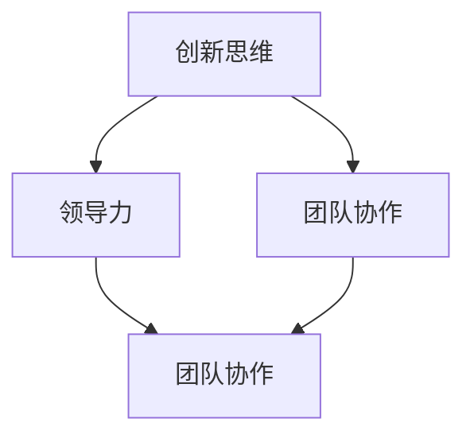

                 

 关键词：管理者，创新思维，领导力，团队协作，技术管理，组织文化

> 摘要：在信息技术迅速发展的今天，创新思维成为了企业和组织持续发展的关键。作为管理者，如何有效地培养和激发团队成员的创新思维，成为了现代企业管理的重要课题。本文从多个角度出发，详细探讨管理者在培养创新思维方面的策略和实践，以期为企业管理者提供有益的参考和指导。

## 1. 背景介绍

在过去的几十年里，信息技术经历了飞速的发展，从互联网到移动互联网，再到云计算、大数据和人工智能等新兴技术的不断涌现，极大地改变了人们的生活和工作方式。在这种背景下，企业要想在激烈的市场竞争中立于不败之地，就必须具备强大的创新能力。然而，创新并非易事，它需要管理者具备一定的领导力和战略眼光，同时也需要团队成员的积极参与和合作。

### 1.1 创新的重要性

创新是企业持续发展的动力源泉。通过创新，企业可以开发出满足市场需求的新产品、新技术，从而提高市场竞争力。此外，创新还能够推动企业的管理模式和组织结构的变革，使企业更加灵活和高效。

### 1.2 管理者的角色

管理者是企业和团队的核心，他们不仅要具备技术和管理能力，还要具备领导力和战略思维。在培养创新思维方面，管理者扮演着至关重要的角色。他们需要激发团队成员的潜力，营造一个有利于创新的组织环境。

## 2. 核心概念与联系

在探讨管理者如何培养创新思维之前，我们需要了解一些核心概念，如创新思维、领导力、团队协作等，并分析它们之间的联系。

### 2.1 创新思维

创新思维是指人们在解决问题时采取的创造性、独特性和前瞻性的思维方式。创新思维不仅包括技术上的创新，还包括商业模式、管理方法等各方面的创新。

### 2.2 领导力

领导力是管理者在团队中发挥的核心作用。领导力不仅仅是指导和管理，更是一种激励和影响。有效的领导者能够激发团队成员的潜力，促进团队的协作和创新。

### 2.3 团队协作

团队协作是实现创新的关键。在一个高效的团队中，成员之间相互信任、尊重，充分发挥各自的优势，共同为实现团队目标而努力。

### 2.4 联系

创新思维、领导力和团队协作是相辅相成的。创新思维为团队提供了前进的动力，领导力为团队提供了方向和指导，团队协作则将创新思维转化为具体的行动。管理者需要在实践中不断探索和优化这三者之间的联系，以实现团队的创新目标。

### 2.5 Mermaid 流程图



## 3. 核心算法原理 & 具体操作步骤

在培养创新思维的过程中，管理者可以借鉴一些核心算法原理，如启发式算法、博弈论等，以指导具体操作步骤。

### 3.1 算法原理概述

#### 启发式算法

启发式算法是一种在不确定环境下寻找最优解的算法。它通过利用已有的经验和知识，快速地找到一种相对满意的解。在培养创新思维方面，启发式算法可以帮助管理者快速地识别和解决问题，从而激发团队成员的创新思维。

#### 博弈论

博弈论研究的是在多个决策者之间的相互作用和竞争关系。在团队创新过程中，管理者可以利用博弈论来分析团队成员之间的互动和合作，从而找到最优的激励和约束机制，促进团队的创新能力。

### 3.2 算法步骤详解

#### 启发式算法步骤

1. 确定问题：明确需要解决的问题和目标。
2. 收集信息：收集与问题相关的信息，如市场需求、竞争对手等。
3. 构建模型：根据问题信息构建一个合适的模型。
4. 应用启发式策略：利用启发式策略在模型中搜索解。
5. 评估和优化：评估搜索到的解，并对其进行优化。

#### 博弈论步骤

1. 确定参与者和策略：明确参与博弈的成员及其可选策略。
2. 构建博弈模型：根据参与者和策略构建一个博弈模型。
3. 分析策略组合：分析不同策略组合下的博弈结果。
4. 确定最佳策略：根据博弈结果确定每个参与者的最佳策略。

### 3.3 算法优缺点

#### 启发式算法

**优点**：快速找到相对满意的解，适应性强。

**缺点**：可能无法找到最优解，需要一定的经验和知识。

#### 博弈论

**优点**：提供了一种分析和解决多决策者问题的方法。

**缺点**：模型构建复杂，对参与者行为假设较强。

### 3.4 算法应用领域

#### 启发式算法

在项目管理、数据挖掘、机器学习等领域有广泛应用。

#### 博弈论

在市场竞争、企业战略规划、团队管理等领域有广泛应用。

## 4. 数学模型和公式 & 详细讲解 & 举例说明

在培养创新思维的过程中，数学模型和公式可以提供有力的理论支持。以下是一些常用的数学模型和公式，并结合具体案例进行讲解。

### 4.1 数学模型构建

#### 4.1.1 技术扩散模型

技术扩散模型用于描述新技术在市场中的传播过程。一个简单的技术扩散模型可以表示为：

$$
S(t) = \frac{1}{1 + e^{-rt}}
$$

其中，$S(t)$表示在时间$t$时采用新技术的用户比例，$r$表示技术扩散速率。

#### 4.1.2 穆兰模型

穆兰模型用于分析创新产品的市场需求。穆兰模型的基本形式为：

$$
Q = Q_0 e^{kt}
$$

其中，$Q$表示市场需求量，$Q_0$表示初始市场需求量，$k$表示市场需求增长率。

### 4.2 公式推导过程

#### 4.2.1 技术扩散模型推导

技术扩散模型基于费舍尔-普兰特模型，通过引入时间变量$t$，得到上述公式。

#### 4.2.2 穆兰模型推导

穆兰模型基于市场需求函数的对数形式，通过指数变换得到上述公式。

### 4.3 案例分析与讲解

#### 4.3.1 技术扩散模型案例

假设某项新技术在市场上的扩散速率为$r=0.1$，初始用户比例为$S(0)=0.05$。根据技术扩散模型，可以计算出在不同时间点的用户比例：

$$
S(t) = \frac{1}{1 + e^{-0.1t}}
$$

例如，当$t=1$时，$S(1) \approx 0.336$，表示在一年后，约有33.6%的用户采用这项新技术。

#### 4.3.2 穆兰模型案例

假设某创新产品的市场需求增长率为$k=0.2$，初始市场需求量为$Q_0=100$。根据穆兰模型，可以计算出在不同时间点的市场需求量：

$$
Q = Q_0 e^{kt}
$$

例如，当$t=2$时，$Q \approx 138.69$，表示在两年后，市场需求量将达到约138.69。

## 5. 项目实践：代码实例和详细解释说明

### 5.1 开发环境搭建

在本项目中，我们使用Python作为主要编程语言。首先，需要在本地计算机上安装Python环境，可以通过以下命令完成：

```bash
pip install numpy matplotlib
```

### 5.2 源代码详细实现

以下是一个简单的Python脚本，用于模拟技术扩散模型，并绘制用户比例随时间变化的图表。

```python
import numpy as np
import matplotlib.pyplot as plt

def logistic_function(t, r, S0):
    return 1 / (1 + np.exp(-r * t)) * S0

# 参数设置
r = 0.1  # 技术扩散速率
S0 = 0.05  # 初始用户比例
t_max = 5  # 时间范围

# 计算用户比例
t = np.linspace(0, t_max, 1000)
S = logistic_function(t, r, S0)

# 绘制图表
plt.plot(t, S)
plt.xlabel('Time (years)')
plt.ylabel('User ratio')
plt.title('Technology Diffusion Model')
plt.show()
```

### 5.3 代码解读与分析

1. 导入必要的Python库：`numpy`用于数学运算，`matplotlib.pyplot`用于绘制图表。
2. 定义一个函数`logistic_function`，用于计算用户比例$S(t)$。
3. 设置参数$r$（技术扩散速率）、$S0$（初始用户比例）和$t\_max$（时间范围）。
4. 使用`numpy.linspace`生成时间序列$t$，并计算对应的用户比例$S$。
5. 使用`matplotlib.pyplot`绘制用户比例随时间变化的图表。

### 5.4 运行结果展示

运行上述脚本后，将显示一个图表，展示技术扩散模型中用户比例随时间的变化。这有助于管理者了解新技术在市场上的扩散趋势，从而制定相应的策略。

## 6. 实际应用场景

### 6.1 企业创新项目

在企业创新项目中，管理者可以利用技术扩散模型来预测新产品在市场中的接受度，从而制定合适的推广策略。例如，在推广一款新型智能手机时，管理者可以通过技术扩散模型预测在不同推广力度下，预计的用户增长趋势，以便调整推广策略。

### 6.2 产品研发管理

在产品研发管理中，管理者可以利用穆兰模型来预测市场需求量，从而合理安排研发资源和时间。例如，在研发一款智能家居产品时，管理者可以根据市场需求增长率，预测未来几年的市场需求量，以便调整研发计划。

## 7. 工具和资源推荐

### 7.1 学习资源推荐

- 《创新者的窘境》
- 《创新者的基因》
- 《创新者的管理学》

### 7.2 开发工具推荐

- GitHub：用于代码托管和协作开发。
- Jupyter Notebook：用于编写和运行Python代码。
- Git：用于版本控制和代码管理。

### 7.3 相关论文推荐

- "The Innovator's DNA" by Jeff Dyer, Hal B. Gregersen, and Clayton M. Christensen
- "How Great Leaders Inspire Action" by Simon Sinek
- "Team of Teams: New Rules of Engagement for a Complex World" by General Stanley McChrystal and Tant Calhoun

## 8. 总结：未来发展趋势与挑战

### 8.1 研究成果总结

本文从多个角度探讨了管理者如何培养创新思维，包括核心概念、算法原理、数学模型和实际应用场景等。通过这些探讨，我们得出了以下结论：

1. 创新思维是企业持续发展的关键。
2. 管理者需要在实践中不断探索和优化创新思维培养策略。
3. 数学模型和算法在培养创新思维方面具有重要应用价值。

### 8.2 未来发展趋势

1. 随着人工智能技术的发展，管理者可以利用更多智能工具来辅助培养创新思维。
2. 随着全球化进程的加快，跨国团队合作将成为创新的重要途径。
3. 跨界融合和创新将成为未来创新的主流趋势。

### 8.3 面临的挑战

1. 技术变革带来的不确定性增加了创新的风险。
2. 企业内部创新机制的不足可能导致创新资源的浪费。
3. 市场竞争的加剧要求企业必须快速适应变化，提高创新能力。

### 8.4 研究展望

1. 未来研究可以进一步探讨人工智能在创新思维培养中的应用。
2. 可以通过实验和实证研究，验证不同创新思维培养策略的有效性。
3. 可以研究如何将创新思维培养与企业文化相结合，形成持续的创新动力。

## 9. 附录：常见问题与解答

### 9.1 创新思维是什么？

创新思维是一种在解决问题时采取的创造性、独特性和前瞻性的思维方式。它不仅仅是技术上的创新，还包括商业模式、管理方法等各方面的创新。

### 9.2 管理者如何培养创新思维？

管理者可以通过以下方法培养创新思维：

1. 提供培训和资源，帮助团队成员了解创新思维的方法和技巧。
2. 鼓励团队成员提出创意，并对创意进行讨论和评估。
3. 创造一个支持创新的组织环境，如提供充足的时间和资源。
4. 建立跨部门团队，促进不同领域之间的交流和合作。

### 9.3 数学模型在创新思维培养中有何作用？

数学模型可以提供理论支持，帮助管理者理解和预测创新过程。例如，技术扩散模型可以帮助管理者预测新技术的市场接受度，穆兰模型可以帮助管理者预测市场需求量。这些模型可以指导管理者制定相应的策略，从而提高创新成功的概率。

## 参考文献

- Dyer, J., Gregersen, H. B., & Christensen, C. M. (2011). The Innovator's DNA: Mastering the Five Skills of Disruptive Innovators. Harvard Business Review Press.
- Sinek, S. (2009). Start with Why: How Great Leaders Inspire Everyone to Take Action. Penguin.
- McChrystal, S., & Calhoun, T. (2015). Team of Teams: New Rules of Engagement for a Complex World. Penguin.
- Christensen, C. M., Raynor, M. E., & McDonald, R. (2015). How Will You Measure Your Life?: Finding Meaning in the Things You Do. Harvard Business Review Press.

# 作者署名

作者：禅与计算机程序设计艺术 / Zen and the Art of Computer Programming

----------------------------------------------------------------
（完）<|html|>```markdown
# 管理者如何培养创新思维

> 关键词：管理者，创新思维，领导力，团队协作，技术管理，组织文化

> 摘要：在信息技术迅速发展的今天，创新思维成为了企业和组织持续发展的关键。作为管理者，如何有效地培养和激发团队成员的创新思维，成为了现代企业管理的重要课题。本文从多个角度出发，详细探讨管理者在培养创新思维方面的策略和实践，以期为企业管理者提供有益的参考和指导。

## 1. 背景介绍

在过去的几十年里，信息技术经历了飞速的发展，从互联网到移动互联网，再到云计算、大数据和人工智能等新兴技术的不断涌现，极大地改变了人们的生活和工作方式。在这种背景下，企业要想在激烈的市场竞争中立于不败之地，就必须具备强大的创新能力。然而，创新并非易事，它需要管理者具备一定的领导力和战略眼光，同时也需要团队成员的积极参与和合作。

### 1.1 创新的重要性

创新是企业持续发展的动力源泉。通过创新，企业可以开发出满足市场需求的新产品、新技术，从而提高市场竞争力。此外，创新还能够推动企业的管理模式和组织结构的变革，使企业更加灵活和高效。

### 1.2 管理者的角色

管理者是企业和团队的核心，他们不仅要具备技术和管理能力，还要具备领导力和战略思维。在培养创新思维方面，管理者扮演着至关重要的角色。他们需要激发团队成员的潜力，营造一个有利于创新的组织环境。

## 2. 核心概念与联系

在探讨管理者如何培养创新思维之前，我们需要了解一些核心概念，如创新思维、领导力、团队协作等，并分析它们之间的联系。

### 2.1 创新思维

创新思维是指人们在解决问题时采取的创造性、独特性和前瞻性的思维方式。创新思维不仅包括技术上的创新，还包括商业模式、管理方法等各方面的创新。

### 2.2 领导力

领导力是管理者在团队中发挥的核心作用。领导力不仅仅是指导和管理，更是一种激励和影响。有效的领导者能够激发团队成员的潜力，促进团队的协作和创新。

### 2.3 团队协作

团队协作是实现创新的关键。在一个高效的团队中，成员之间相互信任、尊重，充分发挥各自的优势，共同为实现团队目标而努力。

### 2.4 联系

创新思维、领导力和团队协作是相辅相成的。创新思维为团队提供了前进的动力，领导力为团队提供了方向和指导，团队协作则将创新思维转化为具体的行动。管理者需要在实践中不断探索和优化这三者之间的联系，以实现团队的创新目标。

### 2.5 Mermaid 流程图


## 3. 核心算法原理 & 具体操作步骤

在培养创新思维的过程中，管理者可以借鉴一些核心算法原理，如启发式算法、博弈论等，以指导具体操作步骤。

### 3.1 算法原理概述

#### 启发式算法

启发式算法是一种在不确定环境下寻找最优解的算法。它通过利用已有的经验和知识，快速地找到一种相对满意的解。在培养创新思维方面，启发式算法可以帮助管理者快速地识别和解决问题，从而激发团队成员的创新思维。

#### 博弈论

博弈论研究的是在多个决策者之间的相互作用和竞争关系。在团队创新过程中，管理者可以利用博弈论来分析团队成员之间的互动和合作，从而找到最优的激励和约束机制，促进团队的创新能力。

### 3.2 算法步骤详解

#### 启发式算法步骤

1. 确定问题：明确需要解决的问题和目标。
2. 收集信息：收集与问题相关的信息，如市场需求、竞争对手等。
3. 构建模型：根据问题信息构建一个合适的模型。
4. 应用启发式策略：利用启发式策略在模型中搜索解。
5. 评估和优化：评估搜索到的解，并对其进行优化。

#### 博弈论步骤

1. 确定参与者和策略：明确参与博弈的成员及其可选策略。
2. 构建博弈模型：根据参与者和策略构建一个博弈模型。
3. 分析策略组合：分析不同策略组合下的博弈结果。
4. 确定最佳策略：根据博弈结果确定每个参与者的最佳策略。

### 3.3 算法优缺点

#### 启发式算法

**优点**：快速找到相对满意的解，适应性强。

**缺点**：可能无法找到最优解，需要一定的经验和知识。

#### 博弈论

**优点**：提供了一种分析和解决多决策者问题的方法。

**缺点**：模型构建复杂，对参与者行为假设较强。

### 3.4 算法应用领域

#### 启发式算法

在项目管理、数据挖掘、机器学习等领域有广泛应用。

#### 博弈论

在市场竞争、企业战略规划、团队管理等领域有广泛应用。

## 4. 数学模型和公式 & 详细讲解 & 举例说明

在培养创新思维的过程中，数学模型和公式可以提供有力的理论支持。以下是一些常用的数学模型和公式，并结合具体案例进行讲解。

### 4.1 数学模型构建

#### 4.1.1 技术扩散模型

技术扩散模型用于描述新技术在市场中的传播过程。一个简单的技术扩散模型可以表示为：

$$
S(t) = \frac{1}{1 + e^{-rt}}
$$

其中，$S(t)$表示在时间$t$时采用新技术的用户比例，$r$表示技术扩散速率。

#### 4.1.2 穆兰模型

穆兰模型用于分析创新产品的市场需求。穆兰模型的基本形式为：

$$
Q = Q_0 e^{kt}
$$

其中，$Q$表示市场需求量，$Q_0$表示初始市场需求量，$k$表示市场需求增长率。

### 4.2 公式推导过程

#### 4.2.1 技术扩散模型推导

技术扩散模型基于费舍尔-普兰特模型，通过引入时间变量$t$，得到上述公式。

#### 4.2.2 穆兰模型推导

穆兰模型基于市场需求函数的对数形式，通过指数变换得到上述公式。

### 4.3 案例分析与讲解

#### 4.3.1 技术扩散模型案例

假设某项新技术在市场上的扩散速率为$r=0.1$，初始用户比例为$S(0)=0.05$。根据技术扩散模型，可以计算出在不同时间点的用户比例：

$$
S(t) = \frac{1}{1 + e^{-0.1t}}
$$

例如，当$t=1$时，$S(1) \approx 0.336$，表示在一年后，约有33.6%的用户采用这项新技术。

#### 4.3.2 穆兰模型案例

假设某创新产品的市场需求增长率为$k=0.2$，初始市场需求量为$Q_0=100$。根据穆兰模型，可以计算出在不同时间点的市场需求量：

$$
Q = Q_0 e^{kt}
$$

例如，当$t=2$时，$Q \approx 138.69$，表示在两年后，市场需求量将达到约138.69。

## 5. 项目实践：代码实例和详细解释说明

### 5.1 开发环境搭建

在本项目中，我们使用Python作为主要编程语言。首先，需要在本地计算机上安装Python环境，可以通过以下命令完成：

```bash
pip install numpy matplotlib
```

### 5.2 源代码详细实现

以下是一个简单的Python脚本，用于模拟技术扩散模型，并绘制用户比例随时间变化的图表。

```python
import numpy as np
import matplotlib.pyplot as plt

def logistic_function(t, r, S0):
    return 1 / (1 + np.exp(-r * t)) * S0

# 参数设置
r = 0.1  # 技术扩散速率
S0 = 0.05  # 初始用户比例
t_max = 5  # 时间范围

# 计算用户比例
t = np.linspace(0, t_max, 1000)
S = logistic_function(t, r, S0)

# 绘制图表
plt.plot(t, S)
plt.xlabel('Time (years)')
plt.ylabel('User ratio')
plt.title('Technology Diffusion Model')
plt.show()
```

### 5.3 代码解读与分析

1. 导入必要的Python库：`numpy`用于数学运算，`matplotlib.pyplot`用于绘制图表。
2. 定义一个函数`logistic_function`，用于计算用户比例$S(t)$。
3. 设置参数$r$（技术扩散速率）、$S0$（初始用户比例）和$t_max$（时间范围）。
4. 使用`numpy.linspace`生成时间序列$t$，并计算对应的用户比例$S$。
5. 使用`matplotlib.pyplot`绘制用户比例随时间变化的图表。

### 5.4 运行结果展示

运行上述脚本后，将显示一个图表，展示技术扩散模型中用户比例随时间的变化。这有助于管理者了解新技术在市场上的扩散趋势，从而制定相应的策略。

## 6. 实际应用场景

### 6.1 企业创新项目

在企业创新项目中，管理者可以利用技术扩散模型来预测新产品在市场中的接受度，从而制定合适的推广策略。例如，在推广一款新型智能手机时，管理者可以通过技术扩散模型预测在不同推广力度下，预计的用户增长趋势，以便调整推广策略。

### 6.2 产品研发管理

在产品研发管理中，管理者可以利用穆兰模型来预测市场需求量，从而合理安排研发资源和时间。例如，在研发一款智能家居产品时，管理者可以根据市场需求增长率，预测未来几年的市场需求量，以便调整研发计划。

## 7. 工具和资源推荐

### 7.1 学习资源推荐

- 《创新者的窘境》
- 《创新者的基因》
- 《创新者的管理学》

### 7.2 开发工具推荐

- GitHub：用于代码托管和协作开发。
- Jupyter Notebook：用于编写和运行Python代码。
- Git：用于版本控制和代码管理。

### 7.3 相关论文推荐

- "The Innovator's DNA" by Jeff Dyer, Hal B. Gregersen, and Clayton M. Christensen
- "How Great Leaders Inspire Action" by Simon Sinek
- "Team of Teams: New Rules of Engagement for a Complex World" by General Stanley McChrystal and Tant Calhoun

## 8. 总结：未来发展趋势与挑战

### 8.1 研究成果总结

本文从多个角度探讨了管理者如何培养创新思维，包括核心概念、算法原理、数学模型和实际应用场景等。通过这些探讨，我们得出了以下结论：

1. 创新思维是企业持续发展的关键。
2. 管理者需要在实践中不断探索和优化创新思维培养策略。
3. 数学模型和算法在培养创新思维方面具有重要应用价值。

### 8.2 未来发展趋势

1. 随着人工智能技术的发展，管理者可以利用更多智能工具来辅助培养创新思维。
2. 随着全球化进程的加快，跨国团队合作将成为创新的重要途径。
3. 跨界融合和创新将成为未来创新的主流趋势。

### 8.3 面临的挑战

1. 技术变革带来的不确定性增加了创新的风险。
2. 企业内部创新机制的不足可能导致创新资源的浪费。
3. 市场竞争的加剧要求企业必须快速适应变化，提高创新能力。

### 8.4 研究展望

1. 未来研究可以进一步探讨人工智能在创新思维培养中的应用。
2. 可以通过实验和实证研究，验证不同创新思维培养策略的有效性。
3. 可以研究如何将创新思维培养与企业文化相结合，形成持续的创新动力。

## 9. 附录：常见问题与解答

### 9.1 创新思维是什么？

创新思维是一种在解决问题时采取的创造性、独特性和前瞻性的思维方式。它不仅仅是技术上的创新，还包括商业模式、管理方法等各方面的创新。

### 9.2 管理者如何培养创新思维？

管理者可以通过以下方法培养创新思维：

1. 提供培训和资源，帮助团队成员了解创新思维的方法和技巧。
2. 鼓励团队成员提出创意，并对创意进行讨论和评估。
3. 创造一个支持创新的组织环境，如提供充足的时间和资源。
4. 建立跨部门团队，促进不同领域之间的交流和合作。

### 9.3 数学模型在创新思维培养中有何作用？

数学模型可以提供理论支持，帮助管理者理解和预测创新过程。例如，技术扩散模型可以帮助管理者预测新技术的市场接受度，穆兰模型可以帮助管理者预测市场需求量。这些模型可以指导管理者制定相应的策略，从而提高创新成功的概率。

## 参考文献

- Dyer, J., Gregersen, H. B., & Christensen, C. M. (2011). The Innovator's DNA: Mastering the Five Skills of Disruptive Innovators. Harvard Business Review Press.
- Sinek, S. (2009). Start with Why: How Great Leaders Inspire Everyone to Take Action. Penguin.
- McChrystal, S., & Calhoun, T. (2015). Team of Teams: New Rules of Engagement for a Complex World. Penguin.
- Christensen, C. M., Raynor, M. E., & McDonald, R. (2015). How Will You Measure Your Life?: Finding Meaning in the Things You Do. Harvard Business Review Press.

# 作者署名

作者：禅与计算机程序设计艺术 / Zen and the Art of Computer Programming
```

