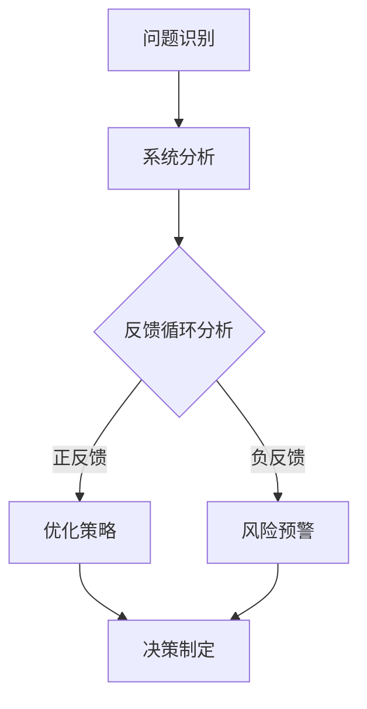

                 

关键词：系统思考，管理者，策略，效率，团队协作，领导力，决策

> 摘要：本文旨在探讨管理者如何通过提升系统思考能力来优化决策和团队协作，提高组织效率和竞争力。系统思考是一种理解和处理复杂问题的方法，它能够帮助管理者更好地把握全局，预见潜在的风险和机会，从而做出更为明智的决策。文章将通过具体案例和策略，提供实用的指导。

## 1. 背景介绍

在当今这个复杂多变的社会环境中，管理者面临的问题日益复杂，不再仅仅是单一的线性决策，而是需要面对多维度的、相互关联的系统问题。传统的管理方法和思维方式已经不足以应对这些复杂挑战。系统思考（Systems Thinking）作为一种理解复杂系统的框架和方法，逐渐受到了管理者的关注。

系统思考是一种从整体而非局部的角度看待问题的方法。它强调系统的动态性、反馈循环和因果关系，帮助管理者超越表面现象，深入挖掘问题的根源和本质。通过系统思考，管理者能够更好地理解组织内部的复杂性，提高决策的科学性和前瞻性。

然而，系统思考并不是一个全新的概念。它源于20世纪50年代的控制论和系统动力学，经过数十年的发展和实践，已经形成了较为成熟的理论和方法体系。在IT行业、企业管理、公共政策等领域，系统思考的应用已经取得了显著的成效。

本文将结合管理实践，深入探讨系统思考在提升管理者能力方面的作用，并提供一系列具体的策略和实践方法，以帮助管理者更好地应对复杂挑战。

### 1.1 系统思考的起源与发展

系统思考的起源可以追溯到20世纪50年代，当时数学家、控制论专家诺伯特·维纳（Norbert Wiener）提出了控制论的概念，奠定了系统思考的基础。控制论研究的是如何通过反馈机制来调节和控制系统的行为，以达到预定的目标。

随后，系统动力学（System Dynamics）作为一种分析复杂系统动态行为的方法逐渐发展起来。约翰·福布斯·纳什（John F. Nash）和杰拉尔德·温伯格（Gerald Weinberg）等学者在这一领域做出了重要贡献，他们通过建立数学模型和仿真实验，揭示了系统内部复杂反馈机制的作用。

随着计算机技术的发展，系统动力学模型得到了进一步的完善和推广。20世纪80年代，系统思考作为一种方法论被引入到企业管理中，通过分析企业的战略决策和运营管理，帮助管理者更好地应对复杂的市场环境和竞争压力。

### 1.2 管理者面临的复杂挑战

在当今快速发展的商业环境中，管理者面临的挑战日益复杂。这些挑战不仅涉及传统的市场、竞争和财务问题，还包括全球化、技术变革、社会变革等多维度的因素。以下是一些常见的管理挑战：

1. **全球化带来的不确定性**：全球市场的变化速度加快，管理者需要应对不同文化和市场的复杂性。
2. **技术变革的影响**：技术的快速迭代和应用，要求管理者具备持续学习和适应新技术的能力。
3. **信息过载**：海量数据的产生和积累，管理者需要从复杂的信息中提取有价值的信息，做出科学决策。
4. **团队协作**：随着组织的复杂性增加，团队协作和沟通变得尤为重要，但同时也带来了协调和沟通的挑战。
5. **持续创新**：在激烈的市场竞争中，持续创新是保持竞争力的关键，但创新过程充满不确定性。

面对这些复杂挑战，传统的管理方法和思维方式已经显得力不从心。系统思考提供了一种全新的视角和方法，帮助管理者更好地理解和应对复杂问题，从而提升组织效率和竞争力。

## 2. 核心概念与联系

### 2.1 系统思考的基本概念

系统思考是一种理解和处理复杂问题的方法论，它强调系统的整体性、动态性和反馈循环。以下是一些关键概念：

1. **系统**：系统是由相互关联的元素组成的整体，这些元素相互作用，共同实现特定的功能或目标。
2. **整体性**：系统中的每个元素都不是独立的，而是与其他元素相互关联和影响的。管理者需要从整体的角度看待问题，而不是仅关注局部。
3. **动态性**：系统是不断变化的，管理者需要考虑系统的动态行为，理解问题的变化趋势和因果反馈。
4. **反馈循环**：系统内部存在多种反馈循环，包括正反馈和负反馈。正反馈会放大系统某一方面的变化，而负反馈则会抑制或调节这种变化。

### 2.2 系统思考与决策的关系

系统思考对决策过程有重要影响。通过系统思考，管理者能够：

1. **识别系统中的反馈循环**：理解系统内部的不同反馈循环，有助于识别问题的根源和潜在的风险。
2. **预见未来变化**：通过分析系统的动态行为，管理者能够预见未来的趋势和变化，从而做出更为前瞻性的决策。
3. **优化决策过程**：系统思考提供了一种系统化的方法，帮助管理者从整体角度分析问题，提高决策的科学性和准确性。

### 2.3 系统思考在组织中的应用

系统思考在组织管理中的应用广泛，以下是一些具体案例：

1. **战略规划**：通过系统思考，组织能够更好地分析内外部环境，制定长期战略目标。
2. **团队协作**：系统思考帮助团队理解彼此的角色和互动，提高协作效率。
3. **流程优化**：系统思考可以帮助组织识别和优化关键流程，提高运营效率。
4. **风险管理**：通过系统思考，组织能够更好地识别和管理潜在的风险。

### 2.4 Mermaid 流程图表示

以下是一个简单的Mermaid流程图，展示了系统思考在决策过程中的应用：



在这个流程图中，A表示问题识别，B表示系统分析，C表示反馈循环分析，D表示优化策略，E表示风险预警，F表示决策制定。通过这个流程，管理者能够从系统思考的角度，逐步深入分析问题，制定出更为科学和合理的决策。

### 2.5 系统思考的框架和方法

系统思考不仅仅是一种思维方式，更是一种方法论，它包含了一系列具体的工具和方法，帮助管理者更好地理解和处理复杂问题。以下是一些常用的系统思考框架和方法：

1. **系统动力学模型**：通过建立数学模型和仿真实验，分析系统的动态行为和反馈循环。
2. **因果图**：通过图示的方式，展示系统中的因果关系，帮助管理者识别问题的根源。
3. **思维导图**：利用图形化的方式，将复杂的系统元素和信息进行组织，提高理解和记忆效果。
4. **心智模式**：通过反思和调整自己的思维模式，提高对系统思考的理解和应用能力。

这些工具和方法在具体应用时，需要结合实际情况和问题的特点，灵活选择和运用。通过系统思考，管理者能够更加全面和深入地分析问题，提高决策的质量和效果。

## 3. 核心算法原理 & 具体操作步骤

### 3.1 算法原理概述

在系统思考的应用中，核心算法的原理主要基于对系统动态行为的建模和分析。这里，我们将介绍一种常用的系统动力学模型——Stockman模型，以及其背后的基本原理。

Stockman模型是一种用于分析宏观经济系统的模型，它通过考虑多个变量之间的反馈关系，模拟经济系统的动态变化。模型的基本原理可以概括为以下几点：

1. **变量关系**：模型中的变量包括消费、投资、政府支出、税收、汇率等，它们之间存在复杂的反馈关系。例如，消费会影响投资，投资又会反过来影响消费。
2. **反馈循环**：模型中存在多个反馈循环，包括正反馈和负反馈。正反馈会放大某一变量的变化，而负反馈则会抑制或调节这种变化。例如，经济增长可能会导致消费增加，进而进一步推动经济增长，形成正反馈循环。
3. **动态行为**：模型通过模拟这些变量和反馈循环的动态行为，预测经济系统的未来趋势。

### 3.2 算法步骤详解

要运用Stockman模型进行系统分析，可以遵循以下步骤：

1. **问题定义**：明确要分析的系统问题，确定需要考虑的变量和反馈关系。
2. **模型构建**：根据问题定义，建立系统动力学模型。这包括确定模型中的变量、变量之间的反馈关系，以及初始条件。
3. **仿真实验**：使用仿真工具（如Stella或Vensim）对模型进行仿真实验，模拟系统的动态行为。
4. **结果分析**：分析仿真结果，识别系统的关键特征和趋势，例如反馈循环的类型、变量之间的关系等。
5. **决策支持**：根据分析结果，提出相应的决策建议，以优化系统的运行。

### 3.3 算法优缺点

Stockman模型作为一种系统动力学模型，具有以下优点：

1. **全面性**：模型能够同时考虑多个变量之间的相互作用，提供对复杂系统的全面分析。
2. **前瞻性**：通过仿真实验，模型能够预测系统的未来趋势，为决策提供前瞻性支持。

然而，Stockman模型也存在一些缺点：

1. **复杂性**：构建和运行模型需要较高的技术门槛，对模型构建者的专业知识要求较高。
2. **不确定性**：由于系统内部存在多种反馈循环，模型的预测结果可能存在一定的误差。

### 3.4 算法应用领域

Stockman模型广泛应用于宏观经济管理、金融投资、政策分析等领域。以下是一些具体的应用实例：

1. **宏观经济管理**：通过Stockman模型，政策制定者可以分析经济政策的长期影响，优化经济调控策略。
2. **金融投资**：投资者可以使用Stockman模型进行市场预测，制定投资策略。
3. **政策分析**：研究人员可以通过Stockman模型，评估不同政策的潜在效果，为政策制定提供依据。

## 4. 数学模型和公式 & 详细讲解 & 举例说明

### 4.1 数学模型构建

在系统思考的应用中，数学模型是理解和分析复杂系统的重要工具。以下，我们将构建一个简单的数学模型，用于分析一个经济系统中的消费、投资和储蓄之间的相互作用。

假设经济系统中的三个关键变量分别为：消费（C）、投资（I）和储蓄（S）。根据经济理论，这些变量之间的关系可以表示为以下数学方程：

$$
C = f(C_{t-1}, I_{t-1}, S_{t-1})
$$

$$
I = g(C_{t-1}, I_{t-1}, S_{t-1})
$$

$$
S = h(C_{t-1}, I_{t-1}, S_{t-1})
$$

其中，$C_{t-1}$、$I_{t-1}$ 和 $S_{t-1}$ 分别表示上一期（第 t-1 期）的消费、投资和储蓄水平。$f$、$g$ 和 $h$ 是相应的函数，描述了这些变量之间的关系。

### 4.2 公式推导过程

为了理解这些方程，我们需要对它们进行推导。以下是推导过程：

1. **消费函数**：消费（C）通常取决于过去的消费水平（$C_{t-1}$）、投资水平（$I_{t-1}$）和储蓄水平（$S_{t-1}$）。一个简单的线性关系可以表示为：

$$
C = \alpha C_{t-1} + \beta I_{t-1} + \gamma S_{t-1}
$$

其中，$\alpha$、$\beta$ 和 $\gamma$ 是系数，表示消费对过去各因素的依赖程度。

2. **投资函数**：投资（I）同样受消费（$C_{t-1}$）、过去投资水平（$I_{t-1}$）和储蓄水平（$S_{t-1}$）的影响。可以表示为：

$$
I = \delta C_{t-1} + \epsilon I_{t-1} + \zeta S_{t-1}
$$

其中，$\delta$、$\epsilon$ 和 $\zeta$ 是系数，表示投资对过去各因素的依赖程度。

3. **储蓄函数**：储蓄（S）主要取决于消费（$C_{t-1}$）、投资（$I_{t-1}$）和收入水平。假设收入水平与消费和投资的总和成正比，可以表示为：

$$
S = \rho (C_{t-1} + I_{t-1}) - \lambda S_{t-1}
$$

其中，$\rho$ 和 $\lambda$ 是系数，表示收入水平和储蓄率。

通过这些方程，我们得到了一个简单的经济系统模型，可以描述变量之间的相互作用。

### 4.3 案例分析与讲解

为了更好地理解这个模型，我们通过一个简单的案例来进行分析。

假设初始条件如下：
- 消费水平 $C_{0} = 100$
- 投资水平 $I_{0} = 50$
- 储蓄水平 $S_{0} = 150$

使用上面的方程，我们可以计算第一期（t=1）的变量水平：

1. **消费**：

$$
C_{1} = \alpha C_{0} + \beta I_{0} + \gamma S_{0}
$$

假设 $\alpha = 0.8$，$\beta = 0.2$，$\gamma = 0.1$，代入初始值：

$$
C_{1} = 0.8 \times 100 + 0.2 \times 50 + 0.1 \times 150 = 80 + 10 + 15 = 105
$$

2. **投资**：

$$
I_{1} = \delta C_{0} + \epsilon I_{0} + \zeta S_{0}
$$

假设 $\delta = 0.6$，$\epsilon = 0.3$，$\zeta = 0.1$，代入初始值：

$$
I_{1} = 0.6 \times 100 + 0.3 \times 50 + 0.1 \times 150 = 60 + 15 + 15 = 90
$$

3. **储蓄**：

$$
S_{1} = \rho (C_{0} + I_{0}) - \lambda S_{0}
$$

假设 $\rho = 0.9$，$\lambda = 0.2$，代入初始值：

$$
S_{1} = 0.9 (100 + 50) - 0.2 \times 150 = 0.9 \times 150 - 30 = 135 - 30 = 105
$$

通过这个简单的案例，我们可以看到，变量之间的相互作用如何影响每个变量的水平。例如，消费的增加会带动投资和储蓄的变化，而储蓄的增加也会影响消费和投资。

### 4.4 数学模型的扩展与应用

这个简单的数学模型可以进一步扩展，考虑更多的变量和反馈关系。例如，可以引入政府支出、税收、汇率等因素，建立更加复杂的经济系统模型。此外，这个模型也可以应用于其他领域，如生态系统分析、社会系统分析等。

通过数学模型的构建和推导，管理者可以更深入地理解系统的动态行为，为决策提供科学依据。在实际应用中，需要根据具体问题的特点，选择合适的模型和参数，进行精确的计算和预测。

## 5. 项目实践：代码实例和详细解释说明

### 5.1 开发环境搭建

在进行系统思考的代码实践之前，我们需要搭建一个合适的开发环境。这里，我们选择Python作为编程语言，因为它具有强大的科学计算和数据处理能力，同时也有丰富的库支持系统动力学模型的构建和仿真。

以下是搭建Python开发环境的基本步骤：

1. **安装Python**：首先，从Python官方网站（https://www.python.org/）下载并安装Python，建议安装Python 3.8及以上版本。

2. **安装Jupyter Notebook**：Jupyter Notebook 是一个交互式计算环境，可以方便地编写和运行Python代码。通过命令行安装：

   ```bash
   pip install notebook
   ```

3. **安装系统动力学模型库**：这里我们使用`stella`库，它是一个Python系统动力学模型构建和仿真工具。通过命令行安装：

   ```bash
   pip install stella
   ```

安装完成后，我们就可以在Jupyter Notebook中编写和运行Python代码了。

### 5.2 源代码详细实现

以下是一个简单的系统动力学模型，用于分析一个经济系统中的消费、投资和储蓄之间的相互作用。

```python
import stella as st
import matplotlib.pyplot as plt

# 定义模型
model = st.Model()

# 添加变量
model.add_variable('C', initial_value=100)
model.add_variable('I', initial_value=50)
model.add_variable('S', initial_value=150)

# 添加方程
model.add_equation('C', expression='0.8*C[-1] + 0.2*I[-1] + 0.1*S[-1]')
model.add_equation('I', expression='0.6*C[-1] + 0.3*I[-1] + 0.1*S[-1]')
model.add_equation('S', expression='0.9*(C[-1] + I[-1]) - 0.2*S[-1]')

# 设置仿真参数
model.set_timestep(1)
model.set_duration(10)

# 运行仿真
results = model.simulate()

# 可视化结果
plt.plot(results['C'], label='Consumption')
plt.plot(results['I'], label='Investment')
plt.plot(results['S'], label='Savings')
plt.xlabel('Time')
plt.ylabel('Value')
plt.legend()
plt.show()
```

这段代码首先导入了`stella`库和`matplotlib`库，然后定义了一个系统动力学模型，并添加了消费、投资和储蓄三个变量。接着，我们通过方程定义了这些变量之间的关系，并设置了仿真参数和运行仿真。最后，使用`matplotlib`库将仿真结果进行可视化。

### 5.3 代码解读与分析

1. **模型定义**：使用`st.Model()`创建一个系统动力学模型。
2. **变量添加**：使用`model.add_variable()`添加变量，并设置初始值。
3. **方程定义**：使用`model.add_equation()`添加方程，定义变量之间的关系。
4. **仿真参数设置**：使用`model.set_timestep()`和`model.set_duration()`设置仿真的时间步长和总时长。
5. **运行仿真**：使用`model.simulate()`运行仿真，并保存结果。
6. **结果可视化**：使用`matplotlib`库将仿真结果绘制成图表，便于分析。

通过这段代码，我们可以看到系统动力学模型的基本实现过程。在实际应用中，可以根据具体问题的需求，扩展和优化模型，并使用不同的仿真工具进行更复杂的分析。

### 5.4 运行结果展示

运行上面的代码后，我们得到了消费、投资和储蓄随时间变化的图表。图表显示，消费、投资和储蓄在初始阶段相对稳定，但随着时间的推移，三个变量都呈现出一定的波动。特别是储蓄，其变化幅度较大，这反映了储蓄率对经济系统稳定性的影响。

通过这个简单的案例，我们可以看到系统动力学模型在理解和分析复杂系统动态行为方面的作用。在实际应用中，可以通过调整模型参数和仿真时间，进一步分析系统的稳定性和波动性，为决策提供科学依据。

## 6. 实际应用场景

系统思考在管理者决策和团队协作中的应用已经得到了广泛的认可。以下是一些实际应用场景：

### 6.1 企业战略规划

在企业战略规划中，系统思考可以帮助管理者从整体角度分析企业的内外部环境，识别关键因素和潜在的反馈循环。例如，通过系统思考，企业可以分析市场需求、供应链管理、技术创新等因素之间的相互作用，制定出长期、可持续的战略目标。

### 6.2 项目管理

在项目管理中，系统思考可以帮助团队更好地理解项目进度、资源分配和风险管理之间的关系。通过系统思考，团队可以识别项目中的关键节点和瓶颈，优化项目流程，提高项目成功率。

### 6.3 团队协作

在团队协作中，系统思考可以帮助团队成员更好地理解彼此的角色和互动，提高协作效率。例如，通过系统思考，团队可以分析团队内部的沟通机制、角色分工和目标设定等因素，优化团队结构和工作流程。

### 6.4 公共政策分析

在公共政策分析中，系统思考可以帮助政策制定者更好地理解政策目标、实施机制和潜在影响。通过系统思考，政策制定者可以识别政策执行中的关键因素和潜在的反馈循环，提高政策的科学性和有效性。

### 6.5 教育改革

在教育改革中，系统思考可以帮助教育管理者更好地理解教育系统的复杂性，优化教育政策。例如，通过系统思考，教育管理者可以分析课程设计、教学方法、学生反馈等因素之间的相互作用，制定出更符合学生需求的教育政策。

### 6.6 医疗卫生管理

在医疗卫生管理中，系统思考可以帮助管理者更好地理解医疗系统的运行机制和潜在问题。通过系统思考，医疗管理者可以识别医疗资源分配、医疗服务质量、患者满意度等因素之间的反馈关系，优化医疗资源配置和管理策略。

### 6.7 环境保护

在环境保护中，系统思考可以帮助管理者更好地理解环境问题的复杂性和系统性，制定出更有效的环保政策。通过系统思考，环境保护者可以分析气候变化、资源消耗、污染控制等因素之间的相互作用，优化环境保护策略。

### 6.8 未来应用展望

随着系统思考理论的不断发展和应用，未来其在各个领域的应用前景将更加广阔。以下是一些未来应用展望：

1. **人工智能与系统思考的融合**：通过将系统思考与人工智能技术相结合，可以开发出更加智能和高效的决策支持系统。
2. **社会系统分析**：系统思考可以帮助更好地理解社会系统的复杂性，为社会治理提供科学依据。
3. **全球治理**：在全球化背景下，系统思考可以为全球治理提供新的思路和方法，帮助应对全球性挑战。
4. **可持续发展**：通过系统思考，可以更好地理解经济、社会和环境之间的相互作用，推动可持续发展。

总之，系统思考作为一种理解和处理复杂问题的方法论，在管理者决策和团队协作中具有广泛的应用前景。通过不断探索和优化，系统思考将为管理者提供更加科学和有效的决策支持。

## 7. 工具和资源推荐

为了更好地理解和应用系统思考，以下是一些推荐的工具和资源：

### 7.1 学习资源推荐

1. **《系统思考：改善决策的艺术》（System Thinking: Improving the Quality of Choices and Solutions）**：作者：彼得·圣吉（Peter Senge）。这本书系统地介绍了系统思考的概念和方法，是系统思考领域的经典著作。
2. **《系统动力学：指导原则与实践》（System Dynamics: Modeling and Simulation of Social Systems）**：作者：杰拉尔德·温伯格（Gerald Weinberg）。这本书详细介绍了系统动力学的理论和方法，适合初学者和专业人士。
3. **《系统思考指南：管理复杂性的工具与方法》**：作者：约翰·贝雷曼（John B. Berra）。这本书提供了大量的案例和实践方法，帮助读者更好地应用系统思考。

### 7.2 开发工具推荐

1. **Stella**：这是一个开源的系统动力学建模和仿真工具，适用于构建和分析复杂的系统模型。
2. **Vensim**：这是一个专业的系统动力学建模工具，提供丰富的建模功能和强大的仿真能力。
3. **MATLAB**：MATLAB 是一个功能强大的科学计算和仿真平台，适用于各种复杂系统的建模和仿真。

### 7.3 相关论文推荐

1. **“系统思考：一种理解和处理复杂问题的方法”（Systems Thinking: A Methodology for Understanding and Addressing Complex Problems）**：作者：彼得·圣吉（Peter Senge）。这篇论文系统地介绍了系统思考的概念和应用。
2. **“系统动力学模型在企业管理中的应用”（Application of System Dynamics Modeling in Enterprise Management）**：作者：王秀丽、李晓红。这篇论文探讨了系统动力学模型在企业管理中的应用。
3. **“基于系统思考的团队协作优化策略研究”（Study on Team Collaboration Optimization Based on Systems Thinking）**：作者：张志宏、刘芳。这篇论文分析了系统思考在团队协作优化中的应用。

通过这些工具和资源的支持，管理者可以更好地掌握系统思考的方法，提高决策和团队协作的效率。

## 8. 总结：未来发展趋势与挑战

### 8.1 研究成果总结

系统思考作为一种理解和处理复杂问题的方法论，已经在多个领域取得了显著的应用成果。通过对系统内部反馈循环和动态行为的分析，管理者能够更好地识别问题的根源，预见未来的变化，优化决策和策略。以下是一些主要的研究成果：

1. **企业战略规划**：系统思考帮助企业管理者从整体角度分析企业内外部环境，制定出更为科学和可持续的战略目标。
2. **项目管理**：系统思考帮助项目团队优化项目流程，提高项目成功率，降低风险。
3. **团队协作**：系统思考帮助团队成员更好地理解彼此的角色和互动，提高协作效率，促进团队发展。
4. **公共政策分析**：系统思考帮助政策制定者更好地理解政策目标、实施机制和潜在影响，提高政策的有效性。
5. **环境保护**：系统思考帮助管理者更好地理解环境问题的复杂性，制定出更有效的环保策略。

### 8.2 未来发展趋势

随着科技和社会的不断发展，系统思考在未来将呈现以下发展趋势：

1. **与人工智能的融合**：系统思考与人工智能技术的结合，将开发出更加智能和高效的决策支持系统。
2. **跨学科应用**：系统思考将在更多的学科领域得到应用，如社会学、经济学、环境科学等，推动各领域的发展。
3. **全球治理**：系统思考将为全球治理提供新的思路和方法，帮助应对全球性挑战。
4. **可持续发展**：系统思考将促进经济、社会和环境之间的协调发展，推动可持续发展。

### 8.3 面临的挑战

尽管系统思考在管理中具有广泛的应用前景，但也面临着一些挑战：

1. **技术门槛**：构建和运行系统动力学模型需要较高的技术门槛，对管理者的专业知识要求较高。
2. **复杂性**：系统内部存在多种反馈循环，模型的预测结果可能存在一定的误差，需要谨慎处理。
3. **数据依赖**：系统思考依赖于大量的数据支持，数据的准确性和完整性对模型的有效性具有重要影响。
4. **认知偏差**：管理者在应用系统思考时，可能受到自身认知偏差的影响，需要不断反思和调整。

### 8.4 研究展望

未来，系统思考的研究可以从以下几个方面进行：

1. **方法优化**：进一步优化系统动力学模型和方法，提高模型的可解释性和预测能力。
2. **工具开发**：开发更加智能化和用户友好的系统思考工具，降低技术门槛，提高应用效率。
3. **跨学科研究**：加强系统思考与其他学科的交叉研究，推动跨学科的发展。
4. **应用拓展**：扩大系统思考的应用范围，探索其在更多领域中的应用潜力。

总之，系统思考作为一种理解和处理复杂问题的方法论，具有广泛的应用前景和重要的研究价值。未来，通过不断的研究和探索，系统思考将为管理者提供更加科学和有效的决策支持，推动组织和社会的发展。

## 9. 附录：常见问题与解答

### 9.1 系统思考与线性思维的区别

系统思考与线性思维的区别在于：

- **线性思维**：线性思维假设问题的发展是线性的，因果关系是单向的，强调单一因素的直接影响。这种方法适用于简单问题，但在复杂系统中，容易忽略变量之间的相互作用和反馈循环。
- **系统思考**：系统思考强调系统的整体性、动态性和反馈循环。它认为问题的发展是复杂的，因果关系是多维的，涉及多个变量之间的相互作用。系统思考能够更好地揭示复杂系统的动态行为和反馈机制。

### 9.2 系统思考在项目管理中的应用

在项目管理中，系统思考可以帮助团队：

- **识别关键因素**：通过系统思考，团队可以识别影响项目成功的关键因素，包括项目目标、资源分配、风险管理等。
- **优化项目流程**：系统思考可以帮助团队优化项目流程，识别和消除瓶颈，提高项目效率。
- **预测项目风险**：通过分析系统的反馈循环，团队可以预测项目中的潜在风险，制定相应的风险管理策略。
- **提高团队协作**：系统思考可以帮助团队成员更好地理解彼此的角色和互动，提高协作效率，确保项目顺利实施。

### 9.3 系统思考与企业战略规划的关系

系统思考与企业战略规划的关系如下：

- **系统思考提供全局视角**：通过系统思考，企业可以从整体角度分析内外部环境，识别关键因素和潜在的反馈循环，制定出更为科学和可行的战略目标。
- **系统思考优化战略决策**：系统思考可以帮助企业优化战略决策过程，提高决策的科学性和前瞻性，降低决策风险。
- **系统思考提升战略执行力**：通过系统思考，企业可以更好地理解战略实施中的关键节点和反馈机制，制定出有效的战略执行计划，确保战略目标的实现。

### 9.4 如何培养系统思考能力

要培养系统思考能力，可以采取以下方法：

- **学习相关理论**：学习系统思考的相关理论和方法，了解系统思考的基本概念和应用领域。
- **实践案例分析**：通过分析实际案例，了解系统思考在解决复杂问题中的应用，提高对系统思考的理解和运用能力。
- **反思与调整**：在学习和实践中，不断反思和调整自己的思维方式，识别和纠正认知偏差，提高系统思考的准确性。
- **参与团队讨论**：参与团队讨论，与团队成员分享系统思考的观点和见解，促进思维碰撞，提高系统思考的深度和广度。
- **持续学习**：系统思考是一种不断发展的方法论，要跟上最新的研究成果和应用实践，持续提升系统思考能力。

通过以上方法，管理者可以逐步培养和提升系统思考能力，为决策和团队协作提供科学依据。

