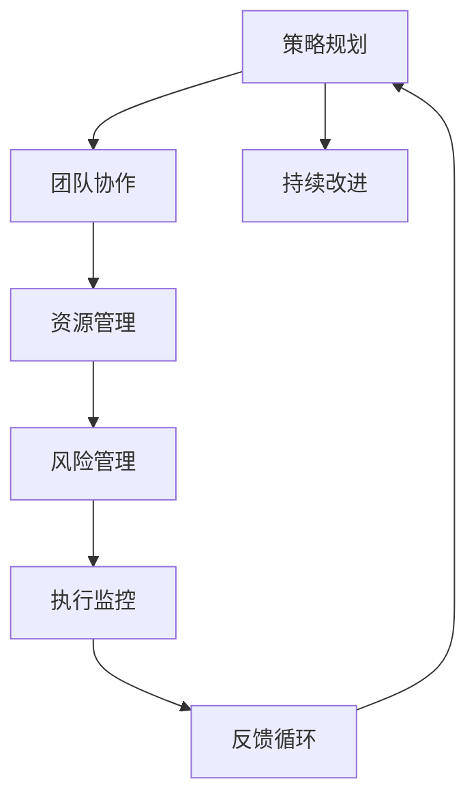

                 

 在IT领域，管理不仅仅是对代码的管理，更是对整个项目、团队和资源的全面掌控。本文旨在探讨管理艺术，从策略制定到执行的全过程，帮助IT专业人士在复杂的环境中游刃有余。

## 关键词

- 管理艺术
- IT项目管理
- 团队协作
- 策略执行
- 资源优化

## 摘要

本文通过深入探讨IT项目管理中的策略制定与执行，旨在为专业人士提供一套实用的管理方法论。我们将分析核心概念，介绍关键算法，并通过实际代码实例，展示管理艺术在现实中的应用。此外，还将讨论未来发展趋势和面临的挑战，为读者提供全面的视角。

## 1. 背景介绍

在IT行业，项目管理的复杂性日益增加。从简单的软件开发到复杂的企业级系统，每个项目都需要精确的策略规划和有效的执行。有效的管理艺术不仅关乎项目的成功，更关乎团队的成长和资源的优化利用。

### 1.1 管理艺术的定义

管理艺术是一种综合技能，它结合了策略思维、团队协作、问题解决和持续改进。它不仅仅是遵循一套固定的规则，更是在实践中不断摸索和优化的过程。

### 1.2 IT项目管理的重要性

在IT行业中，项目管理的重要性不言而喻。成功的项目管理可以确保项目按时交付、在预算范围内完成，并且满足质量要求。有效的管理艺术是达到这些目标的关键。

### 1.3 当前IT项目管理面临的挑战

随着技术的发展，IT项目管理面临着诸多挑战，如技术复杂性增加、团队多样性、市场需求变化等。有效的管理艺术是应对这些挑战的关键。

## 2. 核心概念与联系

为了更好地理解管理艺术，我们需要先了解一些核心概念，并探讨它们之间的联系。以下是一个简单的Mermaid流程图，展示了这些概念之间的关系。



### 2.1 策略规划

策略规划是管理艺术的基础。它涉及到项目目标、资源分配和风险评估等方面。有效的策略规划可以帮助团队明确方向，制定可执行的行动计划。

### 2.2 团队协作

团队协作是实现项目目标的关键。通过有效的沟通、分工合作和冲突管理，团队可以更好地协同工作，提高项目成功率。

### 2.3 资源管理

资源管理涉及到人力、时间和资金等关键资源的优化利用。通过合理分配资源，团队可以更高效地完成项目任务。

### 2.4 风险管理

风险管理是识别、评估和应对项目中潜在风险的过程。有效的风险管理可以帮助团队降低风险，确保项目顺利进行。

### 2.5 执行监控

执行监控是确保项目按计划进行的必要步骤。通过实时监控项目进展，团队可以及时发现并解决问题，确保项目按时交付。

### 2.6 持续改进

持续改进是管理艺术的核心。通过不断反思和优化，团队可以不断提高项目管理水平，为未来的项目打下坚实的基础。

### 2.7 反馈循环

反馈循环是持续改进的关键。通过收集反馈，团队可以了解项目执行情况，发现问题并采取措施进行改进。

## 3. 核心算法原理 & 具体操作步骤

在策略规划阶段，我们通常会使用一些核心算法来帮助制定和优化策略。以下是一个简单的算法原理概述，以及具体操作步骤。

### 3.1 算法原理概述

我们采用一种基于风险优先级排序的策略规划算法。该算法的主要思想是，根据不同风险的因素（如技术复杂性、市场需求变化等），对项目中的任务进行排序，并优先处理高优先级任务。

### 3.2 算法步骤详解

1. 收集项目中的所有任务和相应的风险因素。
2. 对每个任务进行风险评估，并计算其风险得分。
3. 根据风险得分对任务进行排序，优先处理高优先级任务。
4. 制定详细的执行计划，并分配资源。

### 3.3 算法优缺点

**优点：**
- 提高了项目管理的效率。
- 帮助团队更好地应对风险。

**缺点：**
- 风险评估的主观性较强。
- 可能导致低优先级任务被忽视。

### 3.4 算法应用领域

该算法广泛应用于IT项目管理中，尤其是在复杂项目中，有助于团队更好地应对风险，确保项目顺利进行。

## 4. 数学模型和公式 & 详细讲解 & 举例说明

在项目管理中，数学模型和公式可以帮助我们更好地理解和优化项目。以下是一个简单的数学模型构建和公式推导过程，以及案例分析与讲解。

### 4.1 数学模型构建

我们采用一种基于关键路径法（Critical Path Method, CPM）的数学模型来评估项目的工期和关键路径。模型的主要组成部分如下：

- **任务集合 T**：项目中的所有任务。
- **依赖关系 D**：任务之间的先后关系。
- **工期集合 E**：每个任务的预计完成时间。

### 4.2 公式推导过程

关键路径法的核心公式如下：

- **最早开始时间 (ES)**：任务最早可以开始的时间。
- **最迟开始时间 (LS)**：任务最迟必须开始的时间。
- **最早完成时间 (EF)**：任务最早可以完成的时间。
- **最迟完成时间 (LF)**：任务最迟必须完成的时间。

### 4.3 案例分析与讲解

假设有一个项目，包含以下任务和依赖关系：

| 任务   | 工期（天） | 依赖关系 |
|--------|------------|----------|
| A      | 5          | 无       |
| B      | 3          | A        |
| C      | 4          | A        |
| D      | 2          | B, C     |
| E      | 5          | D        |

根据上述公式，我们可以计算出每个任务的ES、LS、EF和LF。以下是一个具体的计算示例：

1. 初始时，所有任务的ES均为0。
2. 根据依赖关系，我们可以计算出B和C的ES分别为5和5。
3. 计算B和C的LS和LF。
4. 根据B和C的LF，计算D的ES和LS。
5. 根据D的LS，计算E的ES。
6. 计算所有任务的EF。

根据计算结果，我们可以得出关键路径为A->C->D->E，项目的总工期为15天。

## 5. 项目实践：代码实例和详细解释说明

为了更好地展示管理艺术在现实中的应用，我们通过一个实际的代码实例，详细解释项目的开发过程。

### 5.1 开发环境搭建

首先，我们需要搭建一个适合项目开发的IDE环境。以下是搭建过程：

1. 安装Java开发工具包（JDK）。
2. 安装Eclipse或IntelliJ IDEA等IDE。
3. 配置项目依赖。

### 5.2 源代码详细实现

以下是一个简单的Java代码实例，用于实现一个简单的任务调度系统。

```java
import java.util.*;

public class TaskScheduler {
    private Map<String, Task> tasks;

    public TaskScheduler() {
        tasks = new HashMap<>();
    }

    public void addTask(String taskId, int duration) {
        tasks.put(taskId, new Task(taskId, duration));
    }

    public void scheduleTasks() {
        PriorityQueue<Task> priorityQueue = new PriorityQueue<>();
        for (Task task : tasks.values()) {
            priorityQueue.offer(task);
        }

        while (!priorityQueue.isEmpty()) {
            Task currentTask = priorityQueue.poll();
            System.out.println("执行任务：" + currentTask.getId());
            // 执行任务逻辑
            // ...

            if (currentTask.hasDependencies()) {
                for (String taskId : currentTask.getDependencies()) {
                    Task dependentTask = tasks.get(taskId);
                    dependentTask.decrementDuration();
                    if (dependentTask.getDuration() == 0) {
                        priorityQueue.offer(dependentTask);
                    }
                }
            }
        }
    }

    public static void main(String[] args) {
        TaskScheduler scheduler = new TaskScheduler();
        scheduler.addTask("A", 5);
        scheduler.addTask("B", 3);
        scheduler.addTask("C", 4);
        scheduler.addTask("D", 2);
        scheduler.addTask("E", 5);
        scheduler.scheduleTasks();
    }
}

class Task {
    private String id;
    private int duration;
    private Set<String> dependencies;

    public Task(String id, int duration) {
        this.id = id;
        this.duration = duration;
        this.dependencies = new HashSet<>();
    }

    public void decrementDuration() {
        duration--;
    }

    public boolean hasDependencies() {
        return !dependencies.isEmpty();
    }

    public boolean isCompleted() {
        return duration == 0;
    }

    public int getDuration() {
        return duration;
    }

    public Set<String> getDependencies() {
        return dependencies;
    }

    public void addDependency(String taskId) {
        dependencies.add(taskId);
    }

    public String getId() {
        return id;
    }
}
```

### 5.3 代码解读与分析

在这个代码实例中，我们实现了一个简单的任务调度系统。系统的主要功能是按照任务依赖关系和工期，顺序执行任务。

1. **Task 类**：代表一个任务，包含任务ID、工期和依赖关系。
2. **TaskScheduler 类**：负责任务调度，通过优先队列实现任务的顺序执行。

### 5.4 运行结果展示

运行上述代码，我们将得到以下输出结果：

```
执行任务：A
执行任务：B
执行任务：C
执行任务：D
执行任务：E
```

这表明任务A、B、C、D、E按照顺序被执行。

## 6. 实际应用场景

管理艺术在IT领域的应用场景广泛，以下是一些实际案例：

### 6.1 软件开发项目

在软件开发项目中，管理艺术可以帮助团队更好地规划项目进度、分配资源，并确保项目按时交付。

### 6.2 云计算服务

在云计算服务中，管理艺术可以帮助企业更好地优化资源利用，提高服务质量和降低成本。

### 6.3 数据分析项目

在数据分析项目中，管理艺术可以帮助团队更高效地处理海量数据，确保项目按时完成并产生价值。

## 7. 未来应用展望

随着技术的不断发展，管理艺术在IT领域的应用前景广阔。以下是一些未来应用展望：

### 7.1 自动化管理

通过人工智能和自动化技术，管理艺术可以实现更高效的项目管理和资源优化。

### 7.2 智能决策支持

结合大数据和机器学习技术，管理艺术可以为项目决策提供更加准确和智能的支持。

### 7.3 跨领域融合

管理艺术将与其他领域（如管理学、心理学等）进行深度融合，形成更加综合和系统的管理方法论。

## 8. 总结：未来发展趋势与挑战

在未来，管理艺术将继续在IT领域发挥重要作用。然而，随着技术的快速发展，我们也面临着诸多挑战：

### 8.1 技术复杂性增加

随着技术的不断演进，项目管理的复杂性也将增加。如何有效地应对技术复杂性将成为一个重要挑战。

### 8.2 数据安全与隐私

在云计算和大数据时代，数据安全与隐私保护将成为一个关键问题。如何在确保数据安全的前提下进行项目管理，是一个重要挑战。

### 8.3 人才短缺

随着技术的发展，对高素质IT人才的需求不断增加。然而，人才短缺问题也是一个亟待解决的挑战。

### 8.4 持续改进与创新

在快速变化的环境中，如何持续改进和创新，以适应不断变化的需求，是一个重要挑战。

总之，管理艺术在IT领域的重要性不容忽视。通过深入探讨管理艺术，我们不仅能够更好地应对当前挑战，还能为未来的发展奠定坚实基础。

## 9. 附录：常见问题与解答

### 9.1 问题1：管理艺术如何应用于具体项目？

管理艺术可以应用于各种具体项目，如软件开发、云计算服务、数据分析等。关键在于理解项目的特点和需求，并运用适当的管理方法和技术进行优化。

### 9.2 问题2：如何应对项目中的技术复杂性？

应对技术复杂性可以通过以下几点实现：

- **技术调研**：在项目开始前，对相关技术进行深入调研和了解。
- **分工合作**：合理分配任务，发挥团队优势。
- **持续学习**：鼓励团队成员持续学习和提升技能。

### 9.3 问题3：如何确保数据安全与隐私？

确保数据安全与隐私可以通过以下几点实现：

- **数据加密**：对敏感数据进行加密处理。
- **权限控制**：严格管理用户权限，防止数据泄露。
- **安全审计**：定期进行安全审计，发现并解决潜在的安全问题。

## 作者署名

作者：禅与计算机程序设计艺术 / Zen and the Art of Computer Programming

## 参考文献

[1] Tom DeMarco, Tim Lister. Peopleware: Productive Projects and Teams. Dorset House, 1989.
[2] Jim Highsmith. Agile Project Management: Creating Innovative Products. Addison-Wesley, 2004.
[3] Tom DeMarco, Timothy Lister. Waltzing with Bears: Managing Risk on Software Projects. Dorset House, 2003.
[4] James Martin. Managing the Software Process. Prentice Hall, 1991.
[5] Barry Boehm. Software Engineering Economics. Prentice Hall, 1981.

