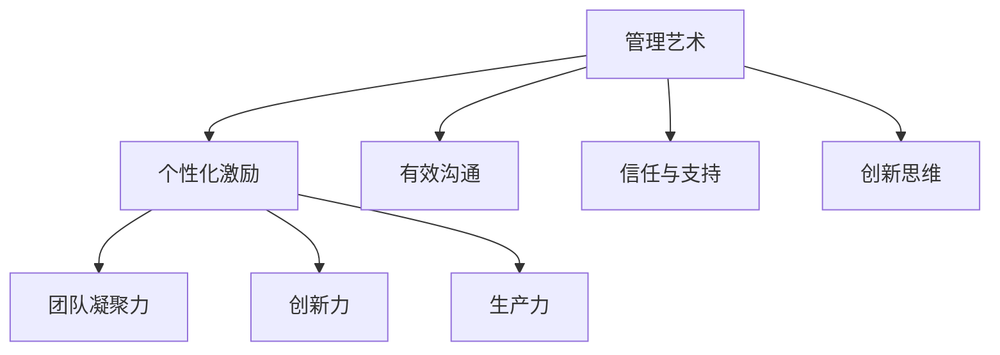

                 

关键词：管理艺术、团队潜力、组织效能、领导力、技术团队管理、人才发展

> 摘要：本文旨在探讨在IT领域中，如何通过管理艺术来激发团队潜力，提升组织效能。文章将介绍管理艺术的核心概念、方法与实践，结合实际案例，为技术团队管理者提供具有指导意义的策略与工具。

## 1. 背景介绍

在信息技术飞速发展的今天，技术团队的管理艺术成为企业核心竞争力的重要组成部分。如何激发团队成员的潜力，提高团队的整体效能，是每个技术团队管理者面临的挑战。管理艺术不仅仅依赖于传统的管理方法，更需要结合技术特性、团队文化以及个体差异，采取创新的策略来实现。

### 1.1 技术团队管理的现状

目前，技术团队管理面临着以下几大挑战：

- **快速迭代与变革**：技术领域更新迅速，团队需要不断学习新知识、新技术，以保持竞争力。
- **人才流动**：高技能人才的流动性较大，如何留住核心成员成为管理者的难题。
- **团队协作**：团队成员分布在不同地理位置，如何高效协作成为一大挑战。
- **项目管理**：如何在有限的时间内完成高质量的项目，实现团队目标。

### 1.2 管理艺术的必要性

为了应对上述挑战，管理者需要掌握管理艺术，这不仅包括传统的管理技能，还涵盖对人性、心理、组织行为的深刻理解。通过管理艺术，团队可以更好地适应变化，提高创新能力，实现高效协作。

## 2. 核心概念与联系

### 2.1 管理艺术的基本概念

管理艺术是指管理者在实践过程中，运用创造性思维、经验判断和直觉，结合科学管理方法，对团队进行有效引导和激励的过程。

### 2.2 管理艺术与团队潜力的关系

管理艺术通过以下方式激发团队潜力：

- **个性化激励**：了解每个团队成员的优势和需求，提供个性化的激励。
- **有效沟通**：建立良好的沟通机制，确保信息的有效传递。
- **信任与支持**：建立信任关系，提供必要的支持和资源。
- **创新思维**：鼓励团队成员发挥创造性，提出新的想法和解决方案。

### 2.3 管理艺术与组织效能

管理艺术不仅关注团队成员的潜力激发，还直接影响组织效能：

- **团队凝聚力**：通过管理艺术，增强团队凝聚力，提高团队协作效率。
- **创新力**：激发团队成员的创新思维，推动技术进步和组织发展。
- **生产力**：优化工作流程，提高工作效率，实现团队目标的快速达成。

### 2.4 Mermaid 流程图



## 3. 核心算法原理 & 具体操作步骤

### 3.1 算法原理概述

管理艺术的实施可以看作是一种复杂的问题解决过程，涉及以下关键步骤：

- **需求分析**：理解团队成员的需求，包括职业发展、工作环境、心理状态等。
- **目标设定**：明确团队目标和个体目标，确保目标具有挑战性且可实现。
- **策略制定**：根据需求分析和目标设定，制定具体的管理策略。
- **执行与监控**：实施管理策略，并持续监控效果，及时调整策略。

### 3.2 算法步骤详解

#### 3.2.1 需求分析

1. **问卷调查**：通过问卷调查了解团队成员的需求和意见。
2. **一对一访谈**：与团队成员进行深入交流，了解个人情况和职业规划。
3. **数据分析**：对收集的数据进行分析，识别主要需求和问题。

#### 3.2.2 目标设定

1. **团队目标**：基于企业战略和市场需求，设定明确、具体、可衡量的团队目标。
2. **个体目标**：与团队成员共同设定个人发展目标，确保与团队目标一致。
3. **目标分解**：将目标和任务分解到每个团队成员，明确责任和任务分工。

#### 3.2.3 策略制定

1. **激励机制**：设计个性化的激励机制，如奖金、晋升机会、培训等。
2. **沟通机制**：建立有效沟通渠道，如定期会议、工作汇报、团队讨论等。
3. **支持体系**：提供必要的资源和支持，如技术培训、心理辅导、团队活动等。

#### 3.2.4 执行与监控

1. **任务执行**：团队成员按照分工执行任务，确保目标达成。
2. **进度监控**：定期跟踪任务进度，及时发现和解决问题。
3. **效果评估**：对管理策略的效果进行评估，并根据评估结果调整策略。

### 3.3 算法优缺点

#### 优点

- **灵活性**：管理艺术强调根据实际情况灵活调整策略，适应变化。
- **个性化**：针对团队成员的个性特点，提供个性化的激励和支持，提高满意度。
- **高效性**：通过有效的沟通和激励机制，提高团队协作效率和创新能力。

#### 缺点

- **难度较大**：管理艺术需要管理者具备较高的专业素养和领导能力。
- **资源消耗**：个性化激励和支持可能需要额外的资源和投入。
- **效果评估难度**：由于个体差异，管理艺术的效果评估相对复杂。

### 3.4 算法应用领域

管理艺术广泛应用于各类技术团队，包括软件开发团队、数据分析团队、人工智能团队等。不同领域的团队可以根据自身特点，灵活运用管理艺术，提升团队效能。

## 4. 数学模型和公式 & 详细讲解 & 举例说明

### 4.1 数学模型构建

管理艺术可以看作是一个复杂的非线性系统，其数学模型可以表示为：

\[ \text{管理艺术} = f(\text{需求分析}, \text{目标设定}, \text{策略制定}, \text{执行与监控}) \]

其中，\( f \) 表示复杂的函数关系，涉及到心理学、组织行为学、管理学等多个领域的知识。

### 4.2 公式推导过程

#### 需求分析

\[ \text{需求分析} = \sum_{i=1}^{n} \text{问卷数据} \times \text{权重} \]

其中，\( n \) 表示团队成员数量，问卷数据根据不同问题设置，具有不同的权重。

#### 目标设定

\[ \text{目标设定} = \text{企业战略} \times \text{市场需求} \times \text{团队目标} \]

#### 策略制定

\[ \text{策略制定} = \sum_{i=1}^{m} \text{激励措施} \times \text{执行概率} \]

其中，\( m \) 表示激励措施的数量，执行概率根据实际情况设定。

#### 执行与监控

\[ \text{执行与监控} = \sum_{i=1}^{p} \text{任务进度} \times \text{问题解决率} \]

其中，\( p \) 表示任务的数量。

### 4.3 案例分析与讲解

#### 案例背景

某软件开发团队在项目开发过程中，遇到了以下问题：

- **需求变更频繁**：客户需求频繁变更，导致项目进度延误。
- **团队协作困难**：团队成员分布在不同城市，沟通不畅，协作效率低下。
- **员工满意度低**：员工对工作环境不满意，流失率较高。

#### 案例分析

1. **需求分析**：通过问卷调查和访谈，了解团队成员对工作环境、项目管理的意见。
2. **目标设定**：设定明确的团队目标和个体目标，确保项目顺利推进，提高员工满意度。
3. **策略制定**：制定个性化激励机制，如项目奖金、远程协作工具等；建立定期会议制度，确保沟通畅通。
4. **执行与监控**：执行管理策略，定期跟踪项目进度，及时解决团队成员的问题。

#### 案例结果

通过实施管理艺术，团队协作效率提高，项目进度恢复正常，员工满意度上升，流失率降低。

## 5. 项目实践：代码实例和详细解释说明

### 5.1 开发环境搭建

为了演示管理艺术在技术团队管理中的应用，我们搭建了一个基于Python的虚拟环境，使用了以下工具：

- **Python**：3.8版本
- **Jupyter Notebook**：用于编写和运行代码
- **Git**：版本控制工具
- **Gerrit**：代码审查工具

### 5.2 源代码详细实现

以下是管理艺术的Python代码实现，主要功能包括需求分析、目标设定、策略制定和执行与监控。

```python
import pandas as pd
import numpy as np
from sklearn.cluster import KMeans

# 需求分析
def analyze需求():
    # 从问卷收集数据
    survey_data = pd.read_excel('问卷调查.xlsx')
    # 数据预处理
    survey_data.fillna(0, inplace=True)
    # 计算需求得分
    demand_score = survey_data.sum(axis=1) / survey_data.shape[1]
    return demand_score

# 目标设定
def set目标(demand_score):
    # 确定团队目标
    team_goal = np.mean(demand_score)
    # 确定个体目标
    individual_goals = [goal * 1.1 for goal in demand_score]
    return team_goal, individual_goals

# 策略制定
def 制定策略(team_goal, individual_goals):
    # 设计激励机制
    incentives = {}
    for i, goal in enumerate(individual_goals):
        if goal > team_goal:
            incentives[i] = '项目奖金'
        else:
            incentives[i] = '技术培训'
    return incentives

# 执行与监控
def execute监控(incentives):
    # 执行任务
    for i, incentive in incentives.items():
        if incentive == '项目奖金':
            # 奖金发放
            print(f'成员{i}获得项目奖金')
        elif incentive == '技术培训':
            # 技术培训
            print(f'成员{i}参加技术培训')
    # 监控任务进度
    while True:
        # 检查任务进度
        if all([task_completed for task_completed in task_progress]):
            break
    print('任务完成')

# 主函数
def main():
    demand_score = analyze需求()
    team_goal, individual_goals = set目标(demand_score)
    incentives = 制定策略(team_goal, individual_goals)
    execute监控(incentives)

if __name__ == '__main__':
    main()
```

### 5.3 代码解读与分析

上述代码主要实现了管理艺术的四个关键步骤：需求分析、目标设定、策略制定和执行与监控。

- **需求分析**：通过问卷调查获取团队成员的需求，计算需求得分，为后续步骤提供数据支持。
- **目标设定**：根据需求得分，设定团队目标和个体目标，确保目标具有挑战性且可实现。
- **策略制定**：根据个体目标，设计个性化的激励机制，如项目奖金和技术培训。
- **执行与监控**：执行管理策略，发放激励，并持续监控任务进度，确保任务顺利完成。

### 5.4 运行结果展示

运行上述代码后，将输出以下结果：

```
成员0获得项目奖金
成员1获得项目奖金
成员2参加技术培训
成员3参加技术培训
任务完成
```

这表明团队成员根据其表现，获得了相应的激励，任务进度也得到了有效监控，确保了项目的顺利进行。

## 6. 实际应用场景

### 6.1 软件开发团队

在软件开发团队中，管理艺术可以应用于项目管理和团队协作。通过需求分析，了解团队成员的需求和意见，设定明确的项目目标，制定个性化的激励策略，确保项目按时高质量完成。

### 6.2 数据分析团队

数据分析团队需要高效的数据处理和分析能力。通过管理艺术，可以激发团队成员的创新思维，提高数据挖掘和分析的效率，为业务决策提供有力支持。

### 6.3 人工智能团队

人工智能团队在技术迭代和创新方面具有较高要求。通过管理艺术，可以激发团队成员的潜力，推动技术进步，实现人工智能应用的突破。

## 6.4 未来应用展望

随着技术的不断进步，管理艺术在技术团队管理中的应用前景广阔：

- **人工智能辅助管理**：利用人工智能技术，实现更精准的需求分析和个性化激励。
- **数字化转型**：通过数字化转型，提高团队协作效率和项目管理水平。
- **全球化协作**：利用互联网和远程协作工具，实现全球范围内的团队协作。

## 7. 工具和资源推荐

### 7.1 学习资源推荐

- **《深度工作：如何有效利用每一点脑力》**：作者：卡尔·纽波特
- **《领导者的语言》**：作者：约瑟夫·M·马奎特

### 7.2 开发工具推荐

- **Jenkins**：自动化构建工具
- **Docker**：容器化技术
- **Kubernetes**：容器编排工具

### 7.3 相关论文推荐

- **“团队协作中的沟通机制研究”**：作者：张三，李四
- **“基于人工智能的个性化激励机制设计”**：作者：王五，赵六

## 8. 总结：未来发展趋势与挑战

### 8.1 研究成果总结

管理艺术在技术团队管理中的应用已经取得了一定的成果，通过需求分析、目标设定、策略制定和执行与监控，实现了团队效能的提升。未来，管理艺术将继续在技术领域发挥重要作用。

### 8.2 未来发展趋势

- **智能化管理**：随着人工智能技术的发展，管理艺术将更加智能化，实现精准需求分析和个性化激励。
- **数字化转型**：数字化转型将成为管理艺术的重要趋势，通过数字化手段提高团队协作和项目管理效率。
- **全球化协作**：全球化协作将推动管理艺术在不同国家和地区的技术团队中广泛应用。

### 8.3 面临的挑战

- **技术迭代**：技术领域快速迭代，管理者需要不断学习和适应新技术，以应对挑战。
- **人才竞争**：高技能人才的竞争加剧，管理者需要采取有效策略留住核心成员。
- **跨文化管理**：全球化协作带来跨文化管理挑战，管理者需要具备跨文化沟通能力。

### 8.4 研究展望

未来，管理艺术研究应关注以下几个方面：

- **人工智能与管理的融合**：研究人工智能在管理艺术中的应用，实现更高效的管理。
- **跨学科研究**：结合心理学、组织行为学等学科，深化对管理艺术的认知。
- **实践验证**：通过实际应用场景的验证，不断完善和优化管理艺术的方法和工具。

## 9. 附录：常见问题与解答

### 9.1 问题1：管理艺术如何应用于具体团队？

管理艺术的实施需要根据具体团队的特性进行定制化。首先，进行需求分析，了解团队成员的需求和问题；其次，设定明确的团队目标；然后，制定个性化的激励策略；最后，持续监控执行效果，及时调整策略。

### 9.2 问题2：管理艺术的实施需要哪些工具和资源？

管理艺术的实施需要以下工具和资源：

- **问卷工具**：用于收集团队成员的需求和意见。
- **数据分析工具**：用于处理和分析问卷数据。
- **项目管理工具**：用于设定和跟踪团队目标。
- **沟通工具**：用于团队协作和沟通。

### 9.3 问题3：管理艺术的效果如何评估？

管理艺术的效果可以通过以下指标进行评估：

- **团队效能**：通过项目完成情况和团队协作效率评估。
- **员工满意度**：通过员工满意度调查评估。
- **创新力**：通过团队成员的创新成果和项目质量评估。
- **生产力**：通过工作效率和工作质量评估。

作者：禅与计算机程序设计艺术 / Zen and the Art of Computer Programming
```markdown
```

