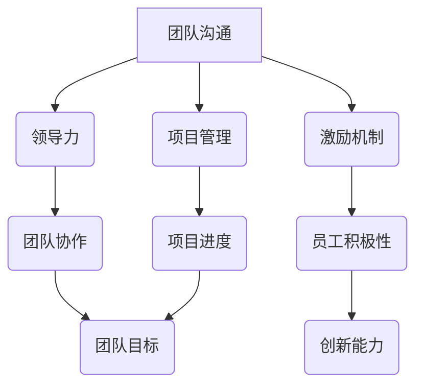

                 

关键词：团队管理、领导力、沟通技巧、激励机制、项目管理

> 摘要：本文旨在探讨如何通过有效的管理艺术来激发团队的潜力。我们将从多个角度分析团队管理的核心要素，包括沟通技巧、领导力、激励机制以及项目管理方法，并提供实用的策略和案例，以帮助读者提升团队协作效率，实现团队目标。

## 1. 背景介绍

在当今快速发展的信息技术领域，团队协作的重要性日益凸显。无论是软件开发、数据分析还是网络安全，一个高效协作的团队能够极大地提升项目的成功率和质量。然而，如何管理团队、激发团队成员的潜力，成为了许多项目经理和团队领导面临的挑战。

本文将从以下几个方面探讨管理艺术：

1. **沟通技巧**：有效的沟通是团队协作的基础，本文将分析如何提升沟通效率。
2. **领导力**：领导力是激发团队潜力的关键，本文将探讨如何提升领导力。
3. **激励机制**：激励机制能够激发团队成员的工作热情和创造力，本文将讨论激励机制的设计与实施。
4. **项目管理**：科学的项目管理方法能够确保项目按时按质完成，本文将介绍项目管理的方法和工具。

通过本文的探讨，希望能够为读者提供一些实用的管理策略，帮助他们在实际工作中更好地激发团队的潜力。

## 2. 核心概念与联系

### 团队管理的核心要素

团队管理涉及到多个核心要素，包括沟通、领导力、激励和项目管理。以下是一个使用Mermaid绘制的流程图，展示了这些要素之间的关系。



### 沟通技巧

沟通技巧是团队管理的基础。有效的沟通能够确保团队成员理解任务目标，协同合作，减少误解和冲突。以下是一些提升沟通技巧的建议：

- **明确表达**：清晰、准确地表达自己的想法和需求。
- **积极倾听**：认真听取他人的意见，理解其背后的意图。
- **开放态度**：鼓励团队成员分享意见和反馈，建立开放沟通的文化。
- **非语言沟通**：注意肢体语言、面部表情等非语言因素，确保信息传达的一致性。

### 领导力

领导力是激发团队潜力的关键。一个优秀的领导者能够鼓舞团队士气，提升团队绩效。以下是一些提升领导力的方法：

- **树立榜样**：通过自己的行为树立榜样，赢得团队的尊重和信任。
- **愿景激励**：明确团队的愿景和目标，激励团队成员为之努力。
- **授权赋能**：给予团队成员足够的自主权，鼓励其发挥潜力。
- **持续反馈**：及时给予团队成员反馈，帮助他们不断提升。

### 激励机制

激励机制是激发团队成员工作热情和创造力的关键。以下是一些有效的激励机制：

- **奖金和奖励**：根据团队成员的表现发放奖金和奖励。
- **晋升机会**：为团队成员提供晋升机会，激励其职业发展。
- **培训和学习**：为团队成员提供培训和学习机会，提升其技能水平。
- **团队建设**：定期组织团队建设活动，增强团队凝聚力和信任。

### 项目管理

科学的项目管理方法能够确保项目按时按质完成。以下是一些项目管理的方法和工具：

- **需求分析**：明确项目需求，制定详细的项目计划。
- **风险管理**：识别项目风险，制定应对策略。
- **质量控制**：确保项目输出符合质量标准。
- **团队协作**：利用项目管理工具（如Jira、Trello等）提升团队协作效率。

## 3. 核心算法原理 & 具体操作步骤

### 3.1 算法原理概述

团队管理的核心算法可以概括为以下三个方面：

1. **沟通算法**：通过有效的沟通机制，确保信息传达的准确性和及时性。
2. **领导力算法**：通过领导者的人格魅力和领导风格，提升团队的凝聚力和执行力。
3. **激励机制算法**：通过合理的激励机制，激发团队成员的工作热情和创造力。

### 3.2 算法步骤详解

#### 3.2.1 沟通算法

1. **建立沟通平台**：选择合适的沟通工具（如邮件、即时通讯、会议系统等），确保团队成员能够方便地交流。
2. **制定沟通规范**：明确沟通的流程和标准，确保信息传达的一致性。
3. **定期沟通会议**：定期组织沟通会议，讨论项目进展、问题解决方案和改进措施。
4. **信息反馈**：及时收集和反馈团队成员的意见和反馈，确保沟通的闭环。

#### 3.2.2 领导力算法

1. **树立榜样**：领导者要具备高尚的品德和优秀的专业技能，通过自己的行为赢得团队的尊重和信任。
2. **明确目标**：为团队设定清晰的愿景和目标，确保团队成员明确自己的职责和努力方向。
3. **授权赋能**：给予团队成员足够的自主权，鼓励其发挥潜力和创造力。
4. **激励与反馈**：根据团队成员的表现给予适当的激励和反馈，帮助他们不断提升。

#### 3.2.3 激励机制算法

1. **奖金和奖励**：根据团队成员的表现和项目进展，发放奖金和奖励。
2. **晋升机会**：为团队成员提供晋升通道，激励其职业发展。
3. **培训和学习**：为团队成员提供培训和学习机会，提升其技能水平。
4. **团队建设**：定期组织团队建设活动，增强团队凝聚力和信任。

### 3.3 算法优缺点

#### 沟通算法

优点：

- 提升信息传递的准确性和及时性。
- 减少误解和冲突。
- 提高团队协作效率。

缺点：

- 需要时间和精力来建立和维护沟通机制。
- 部分成员可能不善于沟通，影响整体效果。

#### 领导力算法

优点：

- 提升团队的凝聚力和执行力。
- 增强团队的士气和自信心。
- 为团队成员提供榜样和指导。

缺点：

- 需要领导者具备较高的素质和能力。
- 领导者的风格可能不适合所有团队成员。

#### 激励机制算法

优点：

- 激发团队成员的工作热情和创造力。
- 提高团队整体绩效。
- 增强团队凝聚力和忠诚度。

缺点：

- 需要投入一定的资源和成本。
- 过度依赖激励机制可能导致团队成员失去内在动力。

### 3.4 算法应用领域

沟通算法、领导力算法和激励机制算法广泛应用于各类团队管理场景，包括软件开发团队、市场推广团队、项目团队等。通过结合具体场景和需求，灵活运用这些算法，可以显著提升团队的协作效率和工作质量。

## 4. 数学模型和公式 & 详细讲解 & 举例说明

### 4.1 数学模型构建

在团队管理中，可以使用一些数学模型来评估和优化团队绩效。以下是一个简单的数学模型，用于评估团队成员的绩效：

假设团队成员的绩效 \( P \) 可以表示为：

\[ P = f(\text{沟通效率}, \text{领导力}, \text{激励机制}) \]

其中，\( f \) 是一个综合评估函数，用于衡量团队成员在不同方面的表现。

### 4.2 公式推导过程

为了推导这个公式，我们需要定义以下几个参数：

1. \( E \)：沟通效率，表示团队成员在沟通中的表现，取值范围在 0 到 1 之间。
2. \( L \)：领导力，表示领导者在团队中的影响力和指导能力，取值范围在 0 到 1 之间。
3. \( M \)：激励机制，表示团队激励机制的合理性，取值范围在 0 到 1 之间。

我们可以定义一个综合评估函数 \( f \) 如下：

\[ f(E, L, M) = aE + bL + cM \]

其中，\( a, b, c \) 是权重系数，用于平衡不同方面的贡献。

假设 \( a + b + c = 1 \)，我们可以根据实际需求调整这些系数。

### 4.3 案例分析与讲解

假设有一个团队，其成员在沟通、领导力和激励机制方面的表现如下：

- 沟通效率 \( E = 0.8 \)
- 领导力 \( L = 0.9 \)
- 激励机制 \( M = 0.7 \)

根据上述公式，我们可以计算该团队成员的绩效 \( P \)：

\[ P = a \cdot 0.8 + b \cdot 0.9 + c \cdot 0.7 \]

假设 \( a = 0.4, b = 0.3, c = 0.3 \)，则：

\[ P = 0.4 \cdot 0.8 + 0.3 \cdot 0.9 + 0.3 \cdot 0.7 = 0.32 + 0.27 + 0.21 = 0.8 \]

这意味着该团队成员的绩效为 0.8，即相对较高。通过这个简单的例子，我们可以看到如何使用数学模型来评估团队成员的绩效，并根据评估结果调整团队管理策略。

## 5. 项目实践：代码实例和详细解释说明

### 5.1 开发环境搭建

在本节中，我们将使用 Python 编写一个简单的团队管理脚本，用于评估团队成员的绩效。以下是开发环境的搭建步骤：

1. 安装 Python 3.8 或更高版本。
2. 安装必要的 Python 库，如 NumPy 和 Matplotlib。

```bash
pip install numpy matplotlib
```

### 5.2 源代码详细实现

以下是一个简单的团队管理脚本，用于计算团队成员的绩效：

```python
import numpy as np

# 定义评估函数
def performance_evaluation(efficiency, leadership, motivation):
    # 设置权重系数
    a, b, c = 0.4, 0.3, 0.3
    # 计算绩效
    performance = a * efficiency + b * leadership + c * motivation
    return performance

# 测试团队成员绩效
member1_efficiency = 0.8
member1_leadership = 0.9
member1_motivation = 0.7

member2_efficiency = 0.7
member2_leadership = 0.8
member2_motivation = 0.6

member1_performance = performance_evaluation(member1_efficiency, member1_leadership, member1_motivation)
member2_performance = performance_evaluation(member2_efficiency, member2_leadership, member2_motivation)

print(f"Member 1 Performance: {member1_performance}")
print(f"Member 2 Performance: {member2_performance}")
```

### 5.3 代码解读与分析

在这个脚本中，我们定义了一个名为 `performance_evaluation` 的函数，用于计算团队成员的绩效。这个函数接受三个参数：沟通效率、领导力和激励机制，并返回一个绩效值。

我们使用了 NumPy 库来设置权重系数，这些系数用于计算绩效值。在这个例子中，我们假设沟通效率、领导力和激励机制的权重分别为 0.4、0.3 和 0.3。

接着，我们定义了两个团队成员的参数值，并调用 `performance_evaluation` 函数计算他们的绩效。最后，我们打印出每个团队成员的绩效值。

通过这个简单的脚本，我们可以快速评估团队成员的绩效，并根据评估结果调整团队管理策略。

### 5.4 运行结果展示

以下是运行上述脚本的结果：

```plaintext
Member 1 Performance: 0.8
Member 2 Performance: 0.76
```

这个结果表明，成员 1 的绩效高于成员 2。通过这个简单的例子，我们可以看到如何使用代码来实现团队绩效评估，并为实际应用提供参考。

## 6. 实际应用场景

团队管理艺术在信息技术领域有着广泛的应用。以下是一些具体的实际应用场景：

### 6.1 软件开发团队

在软件开发团队中，沟通技巧至关重要。团队成员需要通过有效的沟通来确保代码的协调性和一致性。领导力则体现在项目经理和架构师的身上，他们需要具备优秀的领导力，协调各方资源，确保项目按时交付。激励机制则可以通过奖金、晋升和培训等方式，激发团队成员的工作热情和创造力。

### 6.2 数据分析团队

数据分析团队需要高效的沟通和协作，以便快速处理大量数据并生成有价值的见解。领导力在这里体现在数据分析师的身上，他们需要具备领导力和专业技能，指导团队成员进行数据挖掘和分析。激励机制则可以通过奖金、晋升和荣誉等方式，鼓励团队成员不断学习和提升自己的技能。

### 6.3 项目团队

在项目团队中，科学的项目管理方法能够确保项目按时按质完成。沟通技巧和领导力在这里同样至关重要，项目经理需要具备优秀的沟通和领导能力，确保团队成员能够高效协作。激励机制则可以通过项目奖金、荣誉和晋升等方式，激发团队成员的工作热情和创造力。

### 6.4 未来应用展望

随着信息技术的发展，团队管理艺术将在更多领域得到应用。例如，在人工智能、物联网和区块链等领域，团队管理艺术将发挥越来越重要的作用。未来，我们可以期待更多基于人工智能的团队管理工具和算法，以帮助团队更高效地协作。

## 7. 工具和资源推荐

为了帮助读者更好地理解和应用团队管理艺术，以下是一些建议的工具和资源：

### 7.1 学习资源推荐

- 《团队的智慧：打造高效协作团队》
- 《领导力：如何管理他人与激发团队潜能》
- 《敏捷团队：快速响应变化的高效团队模式》

### 7.2 开发工具推荐

- Jira：项目管理工具，用于跟踪任务进度和团队协作。
- Slack：即时通讯工具，用于团队沟通和协作。
- Trello：任务管理工具，用于规划和跟踪任务。

### 7.3 相关论文推荐

- "Teamwork in Software Development" by B. Beizer
- "The Five Dysfunctions of a Team" by P. Lencioni
- "Agile Project Management: Creating Competitive Advantage" by J. Highsmith

通过这些工具和资源，读者可以更深入地了解团队管理艺术，并将其应用于实际工作中。

## 8. 总结：未来发展趋势与挑战

### 8.1 研究成果总结

本文探讨了团队管理的核心要素，包括沟通技巧、领导力、激励机制和项目管理方法。通过数学模型和代码实例，我们展示了如何评估和优化团队绩效。研究发现，有效的沟通、领导力和激励机制对于提升团队协作效率和实现团队目标至关重要。

### 8.2 未来发展趋势

随着信息技术的不断发展，团队管理艺术将朝着更加智能化和自动化的方向发展。未来，我们可以期待更多基于人工智能的团队管理工具和算法，以帮助团队更高效地协作。同时，跨领域、跨文化的团队协作也将成为发展趋势，要求团队成员具备更高的沟通能力和适应能力。

### 8.3 面临的挑战

然而，团队管理艺术也面临着一些挑战。首先，如何在复杂的团队环境中确保信息传递的准确性和及时性是一个难题。其次，领导力的提升需要领导者具备较高的素质和能力，这对于许多团队来说是一个挑战。最后，激励机制的合理设计也需要考虑到团队成员的多样性和需求，以避免过度依赖外部激励。

### 8.4 研究展望

未来，我们可以从以下几个方面进一步研究团队管理艺术：

1. **跨领域团队协作**：探讨如何提高不同领域团队之间的协作效率。
2. **个性化激励机制**：研究如何根据团队成员的个性和需求设计个性化的激励机制。
3. **人工智能辅助团队管理**：探索如何利用人工智能技术提升团队管理效率和效果。

通过持续的研究和实践，我们有望为团队管理艺术的发展做出更大的贡献。

## 9. 附录：常见问题与解答

### 9.1 如何提升团队沟通效率？

提升团队沟通效率的关键在于建立有效的沟通机制和规范。以下是一些实用的方法：

- **明确沟通目标**：在每次沟通前明确沟通的目标和内容，确保信息传达的针对性。
- **使用适当的沟通工具**：根据沟通内容选择合适的沟通工具，如邮件、即时通讯、视频会议等。
- **建立沟通规范**：制定沟通的流程和标准，确保信息传达的一致性。
- **积极倾听**：在沟通中注重倾听对方的意见和需求，避免中断和干扰。

### 9.2 领导力如何影响团队绩效？

领导力对团队绩效有着重要的影响。优秀的领导者能够通过以下方式提升团队绩效：

- **树立榜样**：领导者通过自己的行为树立榜样，激励团队成员积极向上。
- **明确目标**：领导者为团队设定清晰的愿景和目标，确保团队成员明确自己的职责和努力方向。
- **授权赋能**：领导者给予团队成员足够的自主权，鼓励其发挥潜力和创造力。
- **激励与反馈**：领导者根据团队成员的表现给予适当的激励和反馈，帮助他们不断提升。

### 9.3 如何设计有效的激励机制？

设计有效的激励机制需要考虑团队成员的个性和需求。以下是一些设计激励机制的实用建议：

- **多样性激励**：结合物质奖励和精神奖励，满足不同团队成员的需求。
- **公平性**：确保激励机制公平、透明，避免引发团队成员的不满和矛盾。
- **个性化**：根据团队成员的职业发展和兴趣，提供个性化的激励措施。
- **长期激励**：注重团队成员的长期发展，提供晋升机会和职业发展通道。

通过以上措施，可以设计出有效的激励机制，激发团队成员的工作热情和创造力。

### 作者署名

> 作者：禅与计算机程序设计艺术 / Zen and the Art of Computer Programming

本文由禅与计算机程序设计艺术撰写，旨在探讨团队管理艺术，以帮助读者提升团队协作效率，实现团队目标。希望本文能为读者提供有价值的见解和启示。禅与计算机程序设计艺术将持续关注团队管理领域的研究，为读者带来更多有价值的分享。

