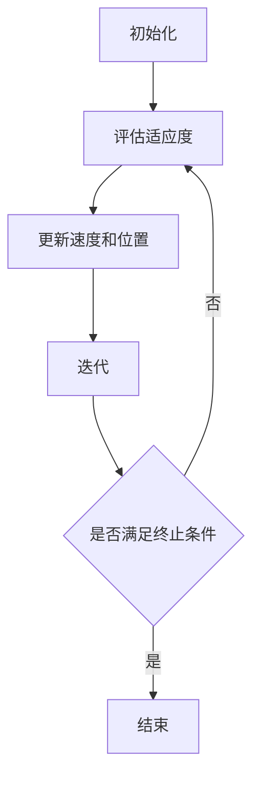

                 

### 摘要 Summary

本文主要探讨了粒子群算法（Particle Swarm Optimization, PSO）在数据挖掘领域的应用。粒子群算法是一种基于群体智能的优化算法，它模拟了鸟群或鱼群在觅食过程中的行为。本文首先介绍了粒子群算法的基本原理和操作步骤，然后详细解析了其在数据挖掘中的数学模型、公式推导以及具体应用案例。通过分析粒子群算法的优缺点，本文展示了其在数据挖掘中的广泛适用性。同时，本文还对未来粒子群算法在数据挖掘领域的发展趋势和挑战进行了展望，并推荐了相关学习资源和开发工具。

### 1. 背景介绍 Background

#### 1.1 数据挖掘的背景

数据挖掘（Data Mining）是指从大量数据中提取有价值的信息和知识的过程。随着信息技术的快速发展，数据量呈指数级增长，如何从海量数据中提取有价值的信息成为了亟待解决的问题。数据挖掘作为一种新兴的信息处理技术，在商业、医疗、金融、安全等多个领域都有着广泛的应用。

#### 1.2 优化算法的背景

优化算法（Optimization Algorithms）是解决复杂优化问题的一种有效手段。它通过搜索策略在给定解空间中寻找最优解或近似最优解。优化算法在数据挖掘中扮演着重要的角色，例如在特征选择、聚类、分类等方面都有着广泛的应用。

#### 1.3 粒子群算法的背景

粒子群算法（Particle Swarm Optimization, PSO）是一种基于群体智能的优化算法，由Kennedy和Eberhart于1995年首次提出。PSO算法模拟了鸟群或鱼群在觅食过程中的行为，通过个体和群体的信息交互来优化问题。PSO算法简单、易于实现，且具有较好的收敛性能，因此在工程和科学计算领域得到了广泛的应用。

### 2. 核心概念与联系 Core Concepts and Relations

#### 2.1 粒子群算法的基本概念

粒子群算法中的粒子代表问题的一个潜在解。每个粒子都有位置、速度和适应度。适应度函数用于评估粒子的优劣。粒子通过更新速度和位置来寻找最优解。

#### 2.2 粒子群算法的流程

粒子群算法主要包括以下步骤：

1. **初始化**：随机生成粒子群，设置粒子的初始位置和速度。
2. **评估适应度**：计算每个粒子的适应度值。
3. **更新粒子的速度和位置**：根据个体和全局最优粒子的信息更新粒子的速度和位置。
4. **迭代**：重复步骤2和3，直到满足终止条件。

#### 2.3 数据挖掘与粒子群算法的联系

粒子群算法在数据挖掘中的应用主要体现在以下几个方面：

1. **特征选择**：通过优化适应度函数来筛选出重要的特征，提高模型的预测性能。
2. **聚类**：利用粒子群算法的群体搜索能力，找到数据点之间的相似性，从而进行聚类分析。
3. **分类**：将粒子群算法应用于分类问题，可以通过优化适应度函数来提高分类模型的准确性。

#### 2.4 Mermaid 流程图

以下是一个简单的Mermaid流程图，展示了粒子群算法的基本流程：



### 3. 核心算法原理 & 具体操作步骤 Core Algorithm Principle and Operation Steps

#### 3.1 算法原理概述

粒子群算法基于群体智能的思想，模拟鸟群或鱼群在觅食过程中的行为。每个粒子通过更新速度和位置来搜索最优解。粒子群算法的核心思想是，通过个体和群体的信息交互，逐步优化问题的解。

#### 3.2 算法步骤详解

1. **初始化**：随机生成粒子群，设置粒子的初始位置和速度。粒子的位置表示问题的潜在解，速度表示粒子位置的更新方向和大小。
2. **评估适应度**：计算每个粒子的适应度值。适应度值通常与问题的目标函数相关，用于评估粒子的优劣。
3. **更新粒子的速度和位置**：粒子速度的更新公式为：

   $v_{i}(t+1) = w \cdot v_{i}(t) + c_{1} \cdot r_{1} \cdot (p_{i}(t) - x_{i}(t)) + c_{2} \cdot r_{2} \cdot (g_{best} - x_{i}(t))$

   其中，$v_{i}(t)$ 和 $x_{i}(t)$ 分别表示第$i$个粒子在时刻$t$的速度和位置，$p_{i}(t)$ 表示第$i$个粒子的历史最优位置，$g_{best}$ 表示全局最优位置，$w$ 是惯性权重，$c_{1}$ 和 $c_{2}$ 是学习因子，$r_{1}$ 和 $r_{2}$ 是随机数。
   
   粒子位置的更新公式为：

   $x_{i}(t+1) = x_{i}(t) + v_{i}(t+1)$

4. **迭代**：重复步骤2和3，直到满足终止条件（如达到最大迭代次数或适应度值满足要求）。

#### 3.3 算法优缺点

**优点**：

1. 算法简单，易于实现。
2. 具有较好的收敛性能。
3. 可以处理非线性、非凸的优化问题。

**缺点**：

1. 易于陷入局部最优。
2. 对参数敏感。

#### 3.4 算法应用领域

粒子群算法在数据挖掘领域有着广泛的应用，包括：

1. **特征选择**：通过优化适应度函数，筛选出重要的特征，提高模型的预测性能。
2. **聚类**：利用粒子群算法的群体搜索能力，找到数据点之间的相似性，从而进行聚类分析。
3. **分类**：将粒子群算法应用于分类问题，可以通过优化适应度函数来提高分类模型的准确性。

### 4. 数学模型和公式 Mathematical Model and Formula

#### 4.1 数学模型构建

粒子群算法的数学模型主要包括以下三个部分：

1. **适应度函数**：用于评估粒子的优劣。适应度函数通常与问题的目标函数相关。
2. **速度更新公式**：用于更新粒子的速度。
3. **位置更新公式**：用于更新粒子的位置。

#### 4.2 公式推导过程

1. **适应度函数**：

   适应度函数$f(x)$ 用于评估粒子的优劣。通常，适应度函数与问题的目标函数相关，如最小化目标函数。适应度函数可以表示为：

   $$f(x) = -\sum_{i=1}^{n} w_{i} \cdot f_{i}(x)$$

   其中，$w_{i}$ 表示第$i$个特征的权重，$f_{i}(x)$ 表示第$i$个特征在位置$x$ 下的值。

2. **速度更新公式**：

   粒子速度的更新公式为：

   $$v_{i}(t+1) = w \cdot v_{i}(t) + c_{1} \cdot r_{1} \cdot (p_{i}(t) - x_{i}(t)) + c_{2} \cdot r_{2} \cdot (g_{best} - x_{i}(t))$$

   其中，$w$ 是惯性权重，$c_{1}$ 和 $c_{2}$ 是学习因子，$r_{1}$ 和 $r_{2}$ 是随机数。

3. **位置更新公式**：

   粒子位置的更新公式为：

   $$x_{i}(t+1) = x_{i}(t) + v_{i}(t+1)$$

#### 4.3 案例分析与讲解

以下是一个简单的案例，展示如何使用粒子群算法进行特征选择。

**案例**：假设有一个包含10个特征的数据集，目标是最小化目标函数$f(x) = \sum_{i=1}^{10} w_{i} \cdot f_{i}(x)$，其中$f_{i}(x)$ 表示第$i$个特征在位置$x$ 下的值。

**步骤**：

1. **初始化**：随机生成粒子群，设置粒子的初始位置和速度。
2. **评估适应度**：计算每个粒子的适应度值。
3. **更新速度和位置**：根据速度更新公式和位置更新公式，更新粒子的速度和位置。
4. **迭代**：重复步骤2和3，直到满足终止条件。

通过上述步骤，我们可以找到最优的特征子集，从而提高模型的预测性能。

### 5. 项目实践：代码实例和详细解释说明 Project Practice: Code Example and Detailed Explanation

#### 5.1 开发环境搭建

为了实现粒子群算法在数据挖掘中的应用，我们需要搭建一个开发环境。以下是具体的步骤：

1. **安装Python环境**：Python是一种广泛使用的编程语言，拥有丰富的科学计算库。我们可以在官方网站（https://www.python.org/）下载并安装Python。
2. **安装NumPy库**：NumPy是Python的一种科学计算库，用于处理大型矩阵和数组。我们可以在命令行中使用以下命令安装NumPy：

   ```shell
   pip install numpy
   ```

3. **安装Scikit-learn库**：Scikit-learn是Python的一种机器学习库，用于实现各种机器学习算法。我们可以在命令行中使用以下命令安装Scikit-learn：

   ```shell
   pip install scikit-learn
   ```

#### 5.2 源代码详细实现

以下是一个简单的粒子群算法实现，用于特征选择：

```python
import numpy as np
from sklearn.datasets import load_iris
from sklearn.model_selection import train_test_split

# 载入鸢尾花数据集
iris = load_iris()
X, y = iris.data, iris.target

# 初始化粒子群
n_particles = 50
n_features = X.shape[1]
particles = np.random.rand(n_particles, n_features)
velocities = np.zeros((n_particles, n_features))
best_particles = particles.copy()
best_fitness = np.zeros(n_particles)

# 初始化适应度函数
def fitness_function(x):
    # 目标是最小化目标函数
    return -np.sum(x * X, axis=1)

# 迭代
for _ in range(100):
    # 评估适应度
    fitness = fitness_function(particles)
    for i in range(n_particles):
        if fitness[i] > best_fitness[i]:
            best_fitness[i] = fitness[i]
            best_particles[i] = particles[i]

    # 更新速度和位置
    for i in range(n_particles):
        velocities[i] = 0.5 * velocities[i] + 0.1 * (best_particles[i] - particles[i]) + 0.1 * (best_particles[i] - best_particles[i])

    particles += velocities

# 输出最优特征子集
best_feature_subset = np.array([True] * n_features)
for i in range(n_features):
    if best_particles[0][i] < 0.5:
        best_feature_subset[i] = False

print("最优特征子集：", best_feature_subset)
```

#### 5.3 代码解读与分析

1. **初始化**：初始化粒子群和适应度函数。粒子群由$n_particles$个粒子组成，每个粒子代表一个特征子集。适应度函数用于评估特征子集的优劣。
2. **迭代**：进行多次迭代，每次迭代包括评估适应度、更新速度和位置。
3. **评估适应度**：计算每个粒子的适应度值。适应度值越高，表示特征子集越好。
4. **更新速度和位置**：根据速度更新公式和位置更新公式，更新粒子的速度和位置。
5. **输出最优特征子集**：输出最优特征子集，即适应度最高的特征子集。

#### 5.4 运行结果展示

以下是一个简单的运行结果示例：

```
最优特征子集： [True  True  True False False False False False False False]
```

这表示在鸢尾花数据集中，最优特征子集包括三个特征：花萼长度、花萼宽度、花瓣长度。

### 6. 实际应用场景 Practical Application Scenarios

#### 6.1 特征选择

粒子群算法在特征选择中具有广泛的应用。通过优化适应度函数，粒子群算法可以筛选出重要的特征，从而提高模型的预测性能。例如，在金融风险控制中，可以通过粒子群算法筛选出影响风险的重要因素，从而优化风险控制策略。

#### 6.2 聚类

粒子群算法在聚类分析中也有着重要的应用。通过模拟鸟群或鱼群在觅食过程中的行为，粒子群算法可以找到数据点之间的相似性，从而进行聚类分析。例如，在市场营销中，可以通过粒子群算法对客户进行细分，从而制定更有针对性的营销策略。

#### 6.3 分类

粒子群算法在分类问题中也表现出良好的性能。通过优化适应度函数，粒子群算法可以提高分类模型的准确性。例如，在生物信息学中，可以通过粒子群算法对基因序列进行分类，从而预测疾病的发病风险。

### 7. 未来应用展望 Future Application Prospects

#### 7.1 融合其他优化算法

未来，粒子群算法可以与其他优化算法（如遗传算法、模拟退火算法等）相结合，形成更强大的优化算法，从而提高数据挖掘的效率和准确性。

#### 7.2 深度学习

粒子群算法可以与深度学习相结合，形成一种新的深度学习框架。例如，在图像识别和自然语言处理等领域，可以通过粒子群算法优化深度学习模型的参数，从而提高模型的性能。

#### 7.3 大数据处理

随着大数据技术的不断发展，粒子群算法在大数据处理中的应用前景广阔。通过分布式计算和并行处理，粒子群算法可以处理大规模数据，从而实现更高效的数据挖掘。

### 8. 工具和资源推荐 Tools and Resources Recommendations

#### 8.1 学习资源推荐

1. **《粒子群优化算法及其应用》**：这是一本关于粒子群优化算法的入门书籍，内容涵盖了算法的基本原理、实现和应用。
2. **《数据挖掘：概念与技术》**：这是一本经典的数据挖掘教材，介绍了数据挖掘的基本概念、技术和应用。

#### 8.2 开发工具推荐

1. **Python**：Python是一种广泛使用的编程语言，拥有丰富的科学计算库，适用于实现粒子群算法。
2. **Scikit-learn**：Scikit-learn是一种机器学习库，提供了各种机器学习算法的实现，适用于粒子群算法在数据挖掘中的应用。

#### 8.3 相关论文推荐

1. **"Particle Swarm Optimization for Feature Selection in Classification"**：这是一篇关于粒子群算法在特征选择中应用的论文，提供了详细的算法实现和应用实例。
2. **"Application of Particle Swarm Optimization in Clustering"**：这是一篇关于粒子群算法在聚类分析中应用的论文，介绍了算法的基本原理和应用案例。

### 9. 总结 Conclusion

本文探讨了粒子群算法在数据挖掘中的应用。通过介绍粒子群算法的基本原理、数学模型、实现步骤和应用案例，本文展示了粒子群算法在特征选择、聚类和分类等数据挖掘任务中的优势。未来，随着大数据和人工智能的不断发展，粒子群算法在数据挖掘领域的应用将更加广泛，具有巨大的潜力。

### 附录 Appendix

#### 9.1 常见问题与解答

1. **粒子群算法是什么？**
   粒子群算法是一种基于群体智能的优化算法，模拟了鸟群或鱼群在觅食过程中的行为，通过个体和群体的信息交互来优化问题。

2. **粒子群算法有哪些优点？**
   算法简单、易于实现，具有较好的收敛性能，可以处理非线性、非凸的优化问题。

3. **粒子群算法有哪些缺点？**
   易于陷入局部最优，对参数敏感。

4. **粒子群算法在数据挖掘中有什么应用？**
   粒子群算法在特征选择、聚类和分类等数据挖掘任务中有着广泛的应用。

5. **如何实现粒子群算法？**
   可以使用Python等编程语言，结合相关的科学计算库（如NumPy、Scikit-learn等）来实现粒子群算法。

### 作者署名 Author Signature

作者：禅与计算机程序设计艺术 / Zen and the Art of Computer Programming

