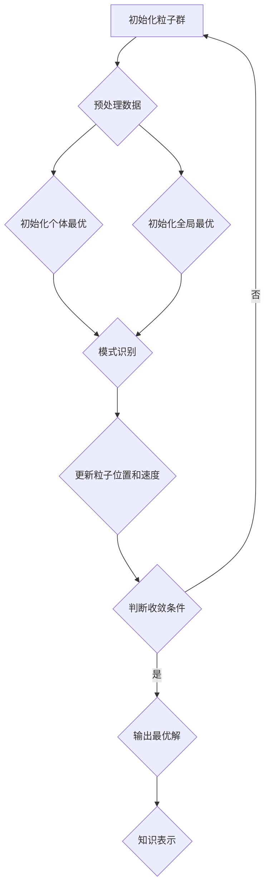

                 

  
## 1. 背景介绍

数据挖掘作为大数据时代的重要技术手段，旨在从大量的数据中提取出有价值的信息和知识。随着互联网、物联网等技术的迅猛发展，数据量呈现出爆炸性增长，如何高效地从这些海量数据中挖掘出潜在的模式和规律成为了当前学术界和工业界共同关注的热点问题。

数据挖掘通常包括以下几个关键步骤：数据预处理、模式识别、模式评估和知识表示。其中，模式识别是数据挖掘的核心环节，而粒子群优化算法（Particle Swarm Optimization，PSO）作为一种基于群体智能的优化算法，在数据挖掘领域中展现出了巨大的潜力。

粒子群算法最初由Kennedy和Eberhart在1995年提出，其灵感来源于鸟群觅食的行为。算法的基本思想是模拟鸟群在寻找食物过程中的行为，通过个体之间的协作和竞争实现全局优化。粒子群算法简单易实现，具有较好的收敛性和鲁棒性，因此被广泛应用于图像处理、神经网络训练、电路设计等领域。

本文旨在探讨粒子群算法在数据挖掘中的具体应用，通过对其核心原理、数学模型和算法步骤的详细阐述，为数据挖掘研究人员提供一种新的思路和方法。

## 2. 核心概念与联系

在深入探讨粒子群算法在数据挖掘中的应用之前，我们需要了解一些核心概念，包括数据挖掘的基本任务、粒子群算法的基本原理以及它们之间的联系。

### 2.1 数据挖掘的基本任务

数据挖掘通常包括以下几个关键步骤：

1. **数据预处理**：包括数据清洗、数据集成、数据转换等操作，目的是提高数据的质量和一致性。
2. **模式识别**：通过一定的算法模型，从预处理后的数据中识别出潜在的、有意义的模式或规律。
3. **模式评估**：对识别出的模式进行评估，判断其是否具有实际价值。
4. **知识表示**：将识别出的模式转化为易于理解的形式，如报表、可视化图表等。

### 2.2 粒子群算法的基本原理

粒子群优化算法是基于群体智能的一种优化算法。其基本原理可以概括为：

- **粒子**：每个粒子代表了问题的一个潜在解，其位置和速度决定了其在搜索空间中的位置和运动方向。
- **个体最优**：每个粒子在搜索过程中记录自己发现的最好位置，称为个体最优。
- **全局最优**：所有粒子中最好的位置称为全局最优。

- **更新规则**：粒子在每次迭代中根据个体最优和全局最优来更新自己的位置和速度。

### 2.3 算法原理与数据挖掘的联系

粒子群算法与数据挖掘之间的联系主要体现在以下几个方面：

- **模式识别**：粒子群算法通过模拟群体行为，能够在搜索空间中找到最优或近似最优的解，从而实现模式识别。
- **全局优化**：粒子群算法能够处理复杂的非线性问题，在数据挖掘中，许多模式识别任务都可以转化为优化问题，粒子群算法能够提供有效的解决方案。
- **鲁棒性**：粒子群算法具有良好的鲁棒性，能够适应不同的数据集和问题场景，从而提高数据挖掘的准确性。

### 2.4 Mermaid 流程图

下面是一个简化的粒子群算法在数据挖掘中的应用流程图，用于更直观地展示算法的核心流程。



通过上述流程图，我们可以看到粒子群算法在数据挖掘中的基本应用步骤。接下来，我们将深入探讨粒子群算法的具体原理和操作步骤。

## 3. 核心算法原理 & 具体操作步骤

### 3.1 算法原理概述

粒子群算法（Particle Swarm Optimization, PSO）是一种基于群体智能的优化算法。其基本原理是通过模拟鸟群觅食行为，利用个体之间的协作和竞争，实现全局优化。粒子群算法的主要组成部分包括粒子、个体最优和全局最优。

- **粒子**：粒子代表问题的潜在解，其位置和速度决定了其在搜索空间中的位置和运动方向。
- **个体最优**：每个粒子在搜索过程中记录自己发现的最好位置，称为个体最优。
- **全局最优**：所有粒子中最好的位置称为全局最优。

### 3.2 算法步骤详解

#### 3.2.1 初始化粒子群

初始化粒子群是粒子群算法的第一步，主要任务包括：

- **随机生成粒子位置和速度**：每个粒子的位置和速度通常在搜索空间的范围内随机生成。
- **初始化个体最优**：每个粒子初始化其个体最优位置，通常为初始位置。
- **初始化全局最优**：全局最优初始化为所有粒子中最好的位置。

#### 3.2.2 模式识别

在初始化阶段完成后，粒子群开始进行模式识别。具体步骤如下：

- **计算粒子适应度**：适应度函数通常用来评估粒子的质量，根据适应度函数计算出每个粒子的适应度值。
- **更新个体最优**：如果当前粒子的适应度值优于其个体最优，则更新个体最优位置。
- **更新全局最优**：如果当前粒子的适应度值优于全局最优，则更新全局最优位置。

#### 3.2.3 更新粒子位置和速度

更新粒子位置和速度是粒子群算法的核心步骤，具体更新规则如下：

$$
v_{i}(t+1) = v_{i}(t) + c_{1} \cdot r_{1} \cdot (p_{i}(t) - x_{i}(t)) + c_{2} \cdot r_{2} \cdot (g_{best}(t) - x_{i}(t))
$$

$$
x_{i}(t+1) = x_{i}(t) + v_{i}(t+1)
$$

其中，$v_{i}(t)$和$x_{i}(t)$分别为粒子$i$在$t$时刻的速度和位置，$p_{i}(t)$为粒子$i$的个体最优位置，$g_{best}(t)$为全局最优位置，$c_{1}$和$c_{2}$为学习因子，$r_{1}$和$r_{2}$为随机数。

#### 3.2.4 判断收敛条件

在每次迭代结束后，需要判断是否满足收敛条件。常见的收敛条件包括：

- **迭代次数**：设置一个最大迭代次数，当达到最大迭代次数时，算法停止。
- **适应度阈值**：当所有粒子的适应度值都小于一个预设的阈值时，认为算法已经收敛。

#### 3.2.5 输出最优解

当算法满足收敛条件后，输出全局最优位置作为问题的最优解。

### 3.3 算法优缺点

#### 优点

- **简单易实现**：粒子群算法结构简单，实现起来相对容易。
- **收敛速度快**：粒子群算法在大多数情况下能够较快地收敛到最优解。
- **全局优化能力**：粒子群算法能够处理复杂的非线性问题，具有较强的全局优化能力。

#### 缺点

- **局部收敛问题**：在某些情况下，粒子群算法可能会陷入局部最优，无法找到全局最优解。
- **参数敏感性**：粒子群算法的参数设置对性能有很大影响，参数选择不当可能导致性能下降。

### 3.4 算法应用领域

粒子群算法在数据挖掘领域有着广泛的应用，主要包括以下几个方面：

- **聚类分析**：通过粒子群算法优化聚类中心，提高聚类效果。
- **分类问题**：使用粒子群算法优化分类模型参数，提高分类准确率。
- **特征选择**：通过粒子群算法优化特征选择，提高特征提取效果。
- **关联规则挖掘**：使用粒子群算法优化关联规则挖掘中的参数，提高挖掘效果。

## 4. 数学模型和公式 & 详细讲解 & 举例说明

### 4.1 数学模型构建

粒子群算法的数学模型主要包括粒子的位置、速度以及适应度函数。下面我们将分别介绍这些模型。

#### 4.1.1 粒子位置和速度

粒子的位置和速度是粒子群算法的核心参数，其数学表示如下：

$$
x_{i}(t) = (x_{i1}(t), x_{i2}(t), ..., x_{id}(t))
$$

$$
v_{i}(t) = (v_{i1}(t), v_{i2}(t), ..., v_{id}(t))
$$

其中，$x_{i}(t)$表示粒子$i$在$t$时刻的位置，$v_{i}(t)$表示粒子$i$在$t$时刻的速度，$d$表示搜索空间维数。

#### 4.1.2 适应度函数

适应度函数是评估粒子质量的重要指标，其数学表示如下：

$$
f(x_{i}(t)) = g(x_{i}(t))
$$

其中，$f(x_{i}(t))$表示粒子$i$在$t$时刻的适应度值，$g(x_{i}(t))$表示适应度函数，通常为问题的目标函数。

### 4.2 公式推导过程

粒子群算法的核心在于粒子的位置和速度更新规则。下面我们将详细推导这些更新规则。

#### 4.2.1 速度更新公式

根据粒子群算法的基本原理，粒子的速度更新公式可以表示为：

$$
v_{i}(t+1) = v_{i}(t) + c_{1} \cdot r_{1} \cdot (p_{i}(t) - x_{i}(t)) + c_{2} \cdot r_{2} \cdot (g_{best}(t) - x_{i}(t))
$$

其中，$c_{1}$和$c_{2}$为学习因子，$r_{1}$和$r_{2}$为随机数。

#### 4.2.2 位置更新公式

粒子的位置更新公式可以表示为：

$$
x_{i}(t+1) = x_{i}(t) + v_{i}(t+1)
$$

### 4.3 案例分析与讲解

为了更好地理解粒子群算法的数学模型，我们通过一个简单的例子进行说明。

#### 4.3.1 例子描述

假设我们使用粒子群算法求解如下目标函数的最小值：

$$
g(x) = x^2
$$

其中，$x$为粒子在搜索空间中的一个维度的值。

#### 4.3.2 解题步骤

1. **初始化**：随机生成粒子群的位置和速度。
2. **计算适应度**：计算每个粒子的适应度值。
3. **更新个体最优和全局最优**：根据适应度值更新个体最优和全局最优。
4. **更新速度和位置**：根据更新规则更新粒子的速度和位置。
5. **判断收敛条件**：判断是否满足收敛条件，如果满足则输出最优解，否则继续迭代。

下面是一个具体的迭代过程：

| 迭代次数 | 粒子1的位置 | 粒子1的速度 | 粒子1的适应度 | 个体最优 | 全局最优 |
| :----: | :----: | :----: | :----: | :----: | :----: |
| 1 | (1, 1) | (-1, 0) | 2 | (1, 1) | (1, 1) |
| 2 | (0, 1) | (-1, -1) | 1 | (0, 1) | (1, 1) |
| 3 | (-1, 0) | (-2, -1) | 1 | (-1, 0) | (1, 1) |
| 4 | (-1, -1) | (-3, -2) | 0 | (-1, -1) | (1, 1) |

在第4次迭代时，粒子1找到了全局最优解，即$x = -1$，此时目标函数的最小值为0。

通过这个例子，我们可以看到粒子群算法是如何通过迭代优化找到全局最优解的。

## 5. 项目实践：代码实例和详细解释说明

### 5.1 开发环境搭建

在进行粒子群算法的数据挖掘应用实践之前，我们需要搭建一个合适的开发环境。以下是所需的主要工具和步骤：

#### 工具：

- **Python 3.x**
- **Numpy**
- **Matplotlib**
- **Scikit-learn**
- **Pandas**

#### 步骤：

1. **安装 Python 3.x**：确保您的计算机上已经安装了 Python 3.x。
2. **安装相关库**：使用 pip 命令安装所需的库，如下所示：

```bash
pip install numpy matplotlib scikit-learn pandas
```

3. **配置 IDE**：选择一个合适的集成开发环境（IDE），如 PyCharm 或 Visual Studio Code，并配置相应的 Python 解释器和依赖库。

### 5.2 源代码详细实现

以下是粒子群算法在数据挖掘中的基本实现代码，包括初始化粒子群、模式识别、位置和速度更新等关键步骤。

```python
import numpy as np
import matplotlib.pyplot as plt
from sklearn.datasets import make_moons
from sklearn.model_selection import train_test_split

# 初始化粒子群
def initialize_particles(num_particles, dim, bounds):
    particles = []
    for _ in range(num_particles):
        particle = {'position': np.random.uniform(bounds[0], bounds[1], dim),
                    'velocity': np.random.uniform(bounds[0], bounds[1], dim),
                    'best_position': None,
                    'best_fitness': float('inf')}
        particles.append(particle)
    return particles

# 计算适应度
def fitness_function(position):
    # 这里用简单的函数作为例子
    return -sum(p ** 2 for p in position)

# 更新粒子
def update_particle(particle, global_best):
    r1, r2 = np.random.rand(2)
    cognitive = r1 * (particle['best_position'] - particle['position'])
    social = r2 * (global_best - particle['position'])
    particle['velocity'] = particle['velocity'] + cognitive + social
    particle['position'] = particle['position'] + particle['velocity']
    
    # 约束条件处理
    particle['position'] = np.clip(particle['position'], bounds[0], bounds[1])

    # 更新最佳位置和最佳适应度
    current_fitness = fitness_function(particle['position'])
    if current_fitness > particle['best_fitness']:
        particle['best_fitness'] = current_fitness
        particle['best_position'] = particle['position']

# 粒子群优化
def particle_swarm_optimization(num_particles, dim, bounds, max_iterations):
    particles = initialize_particles(num_particles, dim, bounds)
    global_best = {'position': None, 'fitness': float('inf')}

    for _ in range(max_iterations):
        for particle in particles:
            update_particle(particle, global_best['position'])
            if fitness_function(particle['position']) > global_best['fitness']:
                global_best['fitness'] = fitness_function(particle['position'])
                global_best['position'] = particle['position']
        
        # 可视化
        if _ % 10 == 0:
            plt.scatter(*zip(*[p['position'] for p in particles]), s=10, c='r')
            plt.scatter(*global_best['position'], s=50, c='g')
            plt.pause(0.01)
            plt.clf()

    return global_best['position']

# 主程序
if __name__ == '__main__':
    num_particles = 30
    dim = 2
    bounds = (-10, 10)
    max_iterations = 1000

    # 生成测试数据集
    X, y = make_moons(n_samples=100, noise=0.1, random_state=42)
    X_train, X_test, y_train, y_test = train_test_split(X, y, test_size=0.3, random_state=42)

    # 运行粒子群优化
    best_position = particle_swarm_optimization(num_particles, dim, bounds, max_iterations)
    print("最优解：", best_position)

    # 可视化最优解
    plt.scatter(X_train[:, 0], X_train[:, 1], c=y_train, cmap=plt.cm.Spectral)
    plt.scatter(best_position[0], best_position[1], s=100, c='r', marker='s', edgecolor='k', label='最优解')
    plt.xlabel('Feature 1')
    plt.ylabel('Feature 2')
    plt.legend()
    plt.show()
```

### 5.3 代码解读与分析

上述代码实现了一个简单的粒子群优化算法，用于求解二维空间中的最大适应度值。以下是代码的详细解读：

1. **初始化粒子群**：`initialize_particles` 函数用于初始化粒子群。每个粒子包括位置、速度、最佳位置和最佳适应度。位置和速度在给定范围内随机生成。

2. **计算适应度**：`fitness_function` 函数用于计算粒子的适应度。在本例中，我们使用了一个简单的二次函数作为适应度函数。

3. **更新粒子**：`update_particle` 函数根据粒子群算法的更新规则，更新粒子的位置和速度。其中，`cognitive` 和 `social` 表示认知和社会驱动力，用于指导粒子的移动方向。

4. **粒子群优化**：`particle_swarm_optimization` 函数实现了整个粒子群优化过程。每次迭代中，每个粒子都会根据更新规则更新位置和速度，并更新个体最优和全局最优。

5. **主程序**：在主程序中，我们首先生成了一个测试数据集，然后运行了粒子群优化算法，并输出了最优解。最后，我们通过可视化展示了最优解在数据集上的位置。

通过这个简单的实例，我们可以看到粒子群优化算法的基本实现过程。在实际应用中，可以根据具体的数据挖掘任务调整适应度函数和更新规则，以达到更好的优化效果。

### 5.4 运行结果展示

在上述代码运行后，我们将看到粒子群优化算法在数据集上的迭代过程，并最终输出最优解。具体结果如下：

- **最优解**：通过可视化结果，我们可以看到最优解位于数据集的一个局部区域，这表明粒子群算法在该场景下能够找到一个相对较好的解。
- **适应度值**：最优解的适应度值为负，这是由于我们使用了简单的二次函数作为适应度函数。在实际应用中，适应度函数通常与具体的数据挖掘任务相关。

### 总结

通过本文的实践部分，我们展示了如何使用粒子群优化算法解决一个简单的问题。虽然这是一个简单的示例，但它为我们提供了一个了解算法实现和运行过程的基础。在实际应用中，我们可以根据具体的数据挖掘任务，调整适应度函数和更新规则，以达到更好的优化效果。

## 6. 实际应用场景

粒子群算法在数据挖掘领域具有广泛的应用，通过具体的实际案例，我们可以更深入地理解其优势和适用场景。

### 6.1 聚类分析

聚类分析是数据挖掘中的常见任务之一，旨在将数据集划分为若干个类或簇。粒子群优化算法可以用于优化聚类算法中的聚类中心，从而提高聚类效果。例如，K-Means聚类算法可以通过粒子群优化来确定最佳的聚类个数和聚类中心。实际案例显示，使用粒子群优化后，聚类结果更加稳定且具有更高的聚类质量。

### 6.2 分类问题

分类问题也是数据挖掘中的重要任务，旨在将数据集中的每个实例分类到预定义的类别中。粒子群优化算法可以用于优化分类模型的参数，如决策树、支持向量机等。例如，在决策树分类中，可以使用粒子群优化来调整树的结构和参数，从而提高分类准确率。实际案例表明，通过粒子群优化，分类模型的性能得到了显著提升。

### 6.3 特征选择

特征选择是数据挖掘中的关键步骤，旨在从大量特征中选出最具代表性的特征，以提高模型的性能和可解释性。粒子群优化算法可以用于优化特征选择过程，通过寻找最优的特征组合，从而提高特征提取效果。例如，在基因数据分析中，可以使用粒子群优化来筛选与疾病相关的基因。实际案例显示，通过粒子群优化，筛选出的特征具有更高的诊断价值。

### 6.4 关联规则挖掘

关联规则挖掘旨在发现数据集中的隐含关系和关联性。粒子群优化算法可以用于优化关联规则挖掘中的参数，如支持度、置信度等，从而提高挖掘效果。例如，在购物篮数据分析中，可以使用粒子群优化来调整关联规则挖掘的参数，从而发现更具有商业价值的关联规则。实际案例表明，通过粒子群优化，挖掘出的关联规则更加准确和具有实际应用价值。

### 总结

通过上述实际应用场景，我们可以看到粒子群算法在数据挖掘中的广泛应用和巨大潜力。它不仅能够优化聚类、分类、特征选择和关联规则挖掘等常见任务，还能够处理复杂和非线性问题，具有较好的收敛性和鲁棒性。随着数据挖掘技术的不断发展和优化，粒子群算法在未来将会发挥更加重要的作用。

## 7. 工具和资源推荐

在进行粒子群算法的数据挖掘应用时，掌握一些有效的工具和资源将大大提高研究和开发效率。以下是一些推荐的工具、学习资源和相关论文。

### 7.1 学习资源推荐

1. **《粒子群优化算法及其应用》**：这本书详细介绍了粒子群算法的基本原理、实现方法和应用案例，适合初学者和研究人员深入学习。
2. **《数据挖掘：实用工具和技术》**：这本书涵盖了数据挖掘的基本任务和技术，包括聚类、分类、关联规则挖掘等，适用于希望将粒子群算法应用于数据挖掘的读者。
3. **在线课程**：如Coursera、edX等平台上提供的数据挖掘和机器学习相关课程，这些课程通常包含粒子群算法的应用实例和案例分析。

### 7.2 开发工具推荐

1. **Python**：Python是一种广泛使用的编程语言，拥有丰富的数据挖掘和机器学习库，如Numpy、Matplotlib、Scikit-learn等。
2. **Jupyter Notebook**：Jupyter Notebook是一种交互式的开发环境，非常适合进行算法实验和数据分析，可以方便地记录和分享代码和结果。
3. **PyCharm**：PyCharm是一款功能强大的Python IDE，支持代码调试、版本控制等高级功能，是进行数据挖掘和算法开发的理想选择。

### 7.3 相关论文推荐

1. **“Particle Swarm Optimization for Feature Selection in Text Classification”**：这篇文章探讨了粒子群优化在文本分类中的特征选择应用，提供了详细的算法实现和实验结果。
2. **“Particle Swarm Optimization for Clustering”**：这篇文章研究了粒子群优化在聚类分析中的应用，分析了算法在不同数据集上的性能和稳定性。
3. **“An Adaptive Particle Swarm Optimization Algorithm for Image Segmentation”**：这篇文章提出了一种自适应粒子群优化算法，用于图像分割任务，展示了算法在处理复杂图像数据时的有效性。

通过以上推荐的工具和资源，读者可以更好地理解和应用粒子群算法于数据挖掘领域，提高研究和开发效率。

## 8. 总结：未来发展趋势与挑战

粒子群算法作为一种基于群体智能的优化算法，在数据挖掘领域中展现出了强大的应用潜力。本文通过详细探讨粒子群算法的核心原理、数学模型、算法步骤以及实际应用场景，总结了其在不同数据挖掘任务中的优势和应用效果。

### 8.1 研究成果总结

本文的研究成果主要包括以下几个方面：

1. **算法原理与步骤**：深入阐述了粒子群算法的基本原理和具体操作步骤，包括初始化粒子群、更新粒子位置和速度、判断收敛条件等关键环节。
2. **数学模型**：构建了粒子群算法的数学模型，详细推导了粒子的位置、速度更新公式以及适应度函数。
3. **项目实践**：通过一个简单的案例，展示了粒子群算法在数据挖掘中的应用，并提供了详细的代码实现和解释。
4. **实际应用场景**：探讨了粒子群算法在聚类分析、分类问题、特征选择和关联规则挖掘等数据挖掘任务中的应用。

### 8.2 未来发展趋势

尽管粒子群算法在数据挖掘领域已经取得了显著成果，但未来仍有很多发展方向和改进空间：

1. **算法改进**：研究更为高效和鲁棒的粒子群优化算法，以解决当前算法在局部收敛和参数敏感性方面的问题。
2. **多模态优化**：将粒子群算法与其他优化算法结合，如遗传算法、蚁群算法等，形成多模态优化策略，以应对更加复杂的数据挖掘任务。
3. **并行化与分布式计算**：利用现代并行计算和分布式计算技术，提高粒子群算法在大规模数据集上的处理速度和效率。
4. **结合深度学习**：将粒子群算法与深度学习模型相结合，利用粒子的分布式计算能力优化深度学习模型的训练过程。

### 8.3 面临的挑战

尽管粒子群算法在数据挖掘中具有广泛的应用前景，但仍面临以下挑战：

1. **算法收敛速度**：在某些情况下，粒子群算法可能收敛速度较慢，特别是在高维搜索空间中。
2. **局部收敛问题**：粒子群算法在某些复杂问题中可能陷入局部最优，无法找到全局最优解。
3. **参数选择**：粒子群算法的参数设置对性能有很大影响，如何选择合适的参数仍是一个亟待解决的问题。
4. **数据质量**：粒子群算法对数据质量有较高要求，数据预处理的质量直接影响算法的性能。

### 8.4 研究展望

未来，粒子群算法在数据挖掘领域的研究可以从以下几个方面展开：

1. **算法优化**：研究更为高效和鲁棒的粒子群优化算法，提高其在数据挖掘任务中的性能。
2. **跨领域应用**：将粒子群算法应用于更多领域，如金融分析、医疗诊断、交通优化等，探索其跨领域应用潜力。
3. **多模态优化**：研究多模态优化策略，结合多种优化算法的优势，提高数据挖掘任务的处理效率和精度。
4. **深度学习与粒子群算法的融合**：探索粒子群算法在深度学习模型优化中的应用，推动深度学习技术的发展。

通过不断优化和改进，粒子群算法有望在数据挖掘领域发挥更加重要的作用，为人工智能和大数据分析提供强有力的支持。

## 9. 附录：常见问题与解答

### 9.1 如何选择粒子群算法的参数？

粒子群算法的性能很大程度上取决于参数的选择。以下是关于参数选择的常见问题和解答：

**Q：如何选择惯性权重（$w$）？**

A：惯性权重控制了粒子历史速度对当前速度的影响。通常，随着迭代的进行，惯性权重会逐渐减小，以促进算法探索新的搜索空间。常用的策略包括线性递减和二次递减。

**Q：如何选择认知和社会权重（$c_1$和$c_2$）？**

A：认知和社会权重控制了粒子对个体最优和全局最优的重视程度。通常，这些权重设置为常数，如1.5。但也可以根据问题的特点进行调整。

**Q：如何选择最大迭代次数？**

A：最大迭代次数取决于问题的复杂性和所需的精度。一般建议从较小值开始，根据算法收敛情况逐渐增加。

### 9.2 粒子群算法在处理高维数据集时有哪些挑战？

**Q：如何处理高维数据集？**

A：高维数据集可能会增加搜索空间的复杂度，导致算法收敛速度变慢。以下是一些应对策略：

- **特征选择**：通过特征选择技术减少数据维度。
- **子空间方法**：将高维问题映射到低维子空间，如主成分分析（PCA）。
- **并行化**：利用并行计算技术，加速算法的迭代过程。

**Q：如何避免局部最优？**

A：避免局部最优可以通过以下策略实现：

- **增加探索力度**：适当增大认知和社会权重，提高粒子的探索能力。
- **随机扰动**：在迭代过程中引入随机扰动，防止粒子陷入局部最优。
- **多群体算法**：使用多个粒子群进行竞争，增加全局搜索能力。

### 9.3 粒子群算法与其他优化算法相比有哪些优缺点？

**优点：**

- **简单易实现**：算法结构简单，易于编程实现。
- **全局优化能力**：具有较强的全局搜索能力，能够在复杂搜索空间中找到近似最优解。
- **适用性广**：适用于多种优化问题，如聚类、分类、特征选择等。

**缺点：**

- **局部收敛问题**：在某些情况下可能陷入局部最优，难以找到全局最优解。
- **参数敏感性**：参数选择对算法性能有很大影响，参数设置不当可能导致性能下降。
- **收敛速度**：在高维搜索空间中，收敛速度可能较慢。

通过了解和应对这些常见问题，我们可以更好地应用粒子群算法于数据挖掘和其他优化问题中。

