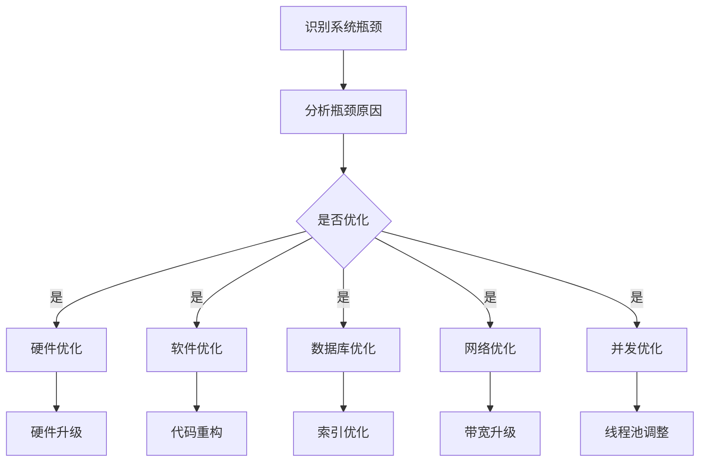

                 

在现代化信息社会中，随着互联网、云计算、大数据等技术的快速发展，系统的复杂度和规模也在持续增加。系统瓶颈问题成为限制系统性能和服务质量的关键因素。如何有效地分析和优化系统瓶颈，成为提高系统性能和用户体验的关键。本文将围绕系统瓶颈的分析与优化，从核心概念、算法原理、数学模型、项目实践以及未来展望等多个角度进行探讨。

## 关键词

- 系统瓶颈
- 性能优化
- 算法分析
- 数学模型
- 实践应用

## 摘要

本文旨在深入探讨系统瓶颈的产生原因及其优化策略。首先，介绍了系统瓶颈的基本概念和类型，分析了瓶颈对系统性能的影响。接着，从算法原理出发，探讨了常见瓶颈优化算法，并通过数学模型进行了理论分析。随后，结合具体项目实践，展示了瓶颈分析工具和优化方法在实际应用中的效果。最后，对系统瓶颈优化的未来发展趋势和面临的挑战进行了展望。

## 1. 背景介绍

随着信息技术的发展，系统复杂度日益增加，系统性能问题日益凸显。系统瓶颈是指系统在处理大量请求时，某一组件或环节的性能无法满足需求，导致整个系统性能下降的现象。系统瓶颈可能出现在硬件设备、软件架构、数据库访问、网络传输等多个层面。瓶颈的存在不仅影响系统的响应速度，还可能导致资源浪费、用户体验下降等问题。

分析系统瓶颈对于优化系统性能至关重要。通过识别和分析系统瓶颈，可以针对性地进行优化，提高系统整体性能。此外，优化系统瓶颈也有助于提高系统的可靠性和稳定性，延长系统使用寿命。

## 2. 核心概念与联系

### 2.1 系统瓶颈的定义

系统瓶颈是指在系统中，某一组件或环节的性能成为限制整个系统性能的关键因素。瓶颈通常表现为系统的响应速度、处理能力、吞吐量等性能指标下降。

### 2.2 系统瓶颈的类型

系统瓶颈可以分为以下几种类型：

1. **硬件瓶颈**：硬件设备性能不足，如CPU、内存、磁盘等。
2. **软件瓶颈**：软件架构设计不合理，如代码冗余、内存泄漏等。
3. **网络瓶颈**：网络带宽不足或网络延迟高。
4. **数据库瓶颈**：数据库访问效率低下，如索引不当、查询优化不足等。
5. **并发瓶颈**：系统无法有效处理大量并发请求，如线程池配置不合理等。

### 2.3 系统瓶颈的影响

系统瓶颈对系统性能的影响主要体现在以下几个方面：

1. **响应速度下降**：系统响应速度变慢，用户等待时间长。
2. **吞吐量降低**：系统处理请求的能力下降，导致任务积压。
3. **资源浪费**：系统资源无法充分利用，造成资源浪费。
4. **用户体验下降**：系统性能下降导致用户满意度降低。
5. **系统稳定性下降**：系统在高负载情况下可能发生崩溃或故障。

### 2.4 系统瓶颈的识别方法

识别系统瓶颈的方法主要包括以下几种：

1. **性能监控**：通过性能监控工具收集系统性能数据，分析性能瓶颈。
2. **负载测试**：模拟高负载情况，分析系统性能下降的原因。
3. **代码分析**：对系统代码进行静态和动态分析，查找潜在的性能问题。
4. **日志分析**：分析系统日志，定位性能瓶颈。
5. **用户反馈**：收集用户反馈，了解系统性能问题。

### 2.5 系统瓶颈优化的目标

系统瓶颈优化的目标主要包括以下几个方面：

1. **提高响应速度**：缩短系统响应时间，提高用户体验。
2. **提升吞吐量**：增加系统处理请求的能力，降低任务积压。
3. **优化资源利用率**：提高系统资源利用率，降低资源浪费。
4. **增强系统稳定性**：提高系统在高负载情况下的稳定性和可靠性。
5. **降低维护成本**：简化系统架构，降低维护成本。

### 2.6 系统瓶颈优化的策略

系统瓶颈优化可以采用以下策略：

1. **硬件优化**：升级硬件设备，提高性能。
2. **软件优化**：优化软件架构，降低代码复杂度。
3. **数据库优化**：优化数据库设计，提高查询效率。
4. **网络优化**：提高网络带宽，降低延迟。
5. **并发优化**：合理配置线程池，提高并发处理能力。

### 2.7 Mermaid 流程图

下面是一个简单的Mermaid流程图，用于展示系统瓶颈分析与优化的一般流程：



## 3. 核心算法原理 & 具体操作步骤

### 3.1 算法原理概述

系统瓶颈分析与优化涉及到多个核心算法。以下是几个常见的算法及其原理：

1. **性能监控算法**：通过采集系统性能数据，分析系统瓶颈。
2. **负载测试算法**：模拟高负载情况，评估系统性能。
3. **代码分析算法**：对系统代码进行分析，查找性能问题。
4. **日志分析算法**：分析系统日志，定位性能瓶颈。
5. **数据库查询优化算法**：优化数据库查询，提高查询效率。
6. **网络优化算法**：优化网络传输，降低延迟。

### 3.2 算法步骤详解

#### 3.2.1 性能监控算法

1. **数据采集**：通过性能监控工具，采集系统性能数据，如CPU利用率、内存使用率、磁盘I/O等。
2. **数据分析**：对采集到的数据进行处理和分析，识别性能瓶颈。
3. **结果展示**：将分析结果以图表或报告的形式展示，为优化提供依据。

#### 3.2.2 负载测试算法

1. **设计测试用例**：根据业务场景，设计合适的测试用例。
2. **模拟负载**：通过负载测试工具，模拟高负载情况。
3. **性能评估**：评估系统在高负载情况下的性能，分析瓶颈。
4. **结果分析**：对测试结果进行分析，找出瓶颈原因。

#### 3.2.3 代码分析算法

1. **静态分析**：通过静态分析工具，分析代码结构、变量定义、函数调用等。
2. **动态分析**：通过动态分析工具，运行代码，收集性能数据。
3. **结果分析**：分析代码性能，查找潜在的性能问题。

#### 3.2.4 日志分析算法

1. **日志采集**：收集系统日志，包括错误日志、访问日志等。
2. **日志处理**：对日志进行清洗和预处理，提取有用的信息。
3. **结果分析**：分析日志，定位性能瓶颈。

#### 3.2.5 数据库查询优化算法

1. **查询优化**：分析数据库查询语句，优化查询策略。
2. **索引优化**：创建合适的索引，提高查询效率。
3. **数据库重构**：优化数据库设计，减少查询次数。

#### 3.2.6 网络优化算法

1. **带宽优化**：升级网络设备，提高带宽。
2. **延迟优化**：优化网络传输路径，降低延迟。
3. **负载均衡**：合理分配网络负载，提高网络性能。

### 3.3 算法优缺点

#### 3.3.1 性能监控算法

优点：

- 可实时监控系统性能，快速识别瓶颈。
- 数据可视化，易于理解和分析。

缺点：

- 需要持续运行，占用系统资源。
- 数据采集和处理可能存在误差。

#### 3.3.2 负载测试算法

优点：

- 可模拟高负载情况，评估系统性能。
- 可发现潜在的性能问题。

缺点：

- 需要设计测试用例，耗时较长。
- 可能对实际业务产生影响。

#### 3.3.3 代码分析算法

优点：

- 可发现代码中的性能问题。
- 可自动化分析，提高效率。

缺点：

- 对代码质量要求较高，否则可能误报。
- 静态分析可能无法完全反映动态性能。

#### 3.3.4 日志分析算法

优点：

- 可分析系统日志，定位性能瓶颈。
- 可实时监控系统运行状态。

缺点：

- 日志格式和内容可能不一致。
- 需要大量人力处理日志。

#### 3.3.5 数据库查询优化算法

优点：

- 可提高数据库查询效率。
- 可优化数据库设计。

缺点：

- 可能影响数据库性能，需谨慎使用。
- 需要深入了解数据库原理。

#### 3.3.6 网络优化算法

优点：

- 可提高网络性能，降低延迟。
- 可优化网络传输路径。

缺点：

- 需要大量硬件投资。
- 难以完全消除网络延迟。

### 3.4 算法应用领域

#### 3.4.1 性能监控算法

应用于各种IT系统，如Web应用、数据库、服务器等。

#### 3.4.2 负载测试算法

应用于系统性能测试、压力测试等。

#### 3.4.3 代码分析算法

应用于代码性能优化、代码审查等。

#### 3.4.4 日志分析算法

应用于日志监控、故障排查等。

#### 3.4.5 数据库查询优化算法

应用于数据库性能优化、数据库设计等。

#### 3.4.6 网络优化算法

应用于网络性能优化、网络架构设计等。

## 4. 数学模型和公式 & 详细讲解 & 举例说明

### 4.1 数学模型构建

在系统瓶颈优化过程中，数学模型构建是非常重要的一步。以下是一个简单的数学模型，用于分析系统性能瓶颈。

设系统处理请求的速度为V，系统瓶颈处理速度为Vb，系统瓶颈发生概率为Pb。则系统瓶颈对系统性能的影响可以表示为：

$$
\text{系统性能影响} = Pb \times (V - Vb)
$$

其中，Pb为系统瓶颈发生概率，V为系统处理请求的平均速度，Vb为系统瓶颈处理速度。

### 4.2 公式推导过程

#### 4.2.1 系统瓶颈发生概率Pb

系统瓶颈发生概率Pb取决于系统瓶颈的处理能力和系统平均请求处理速度。设系统瓶颈处理速度为Vb，系统平均请求处理速度为V，则系统瓶颈发生概率Pb可以表示为：

$$
Pb = \frac{Vb}{V}
$$

#### 4.2.2 系统性能影响

系统性能影响取决于系统瓶颈发生概率Pb和系统瓶颈处理速度Vb与系统处理速度V的差值。设系统性能影响为I，则有：

$$
I = Pb \times (V - Vb)
$$

### 4.3 案例分析与讲解

假设一个Web应用系统，平均每秒处理请求速度为1000次，系统瓶颈处理速度为800次，系统瓶颈发生概率为20%。根据上述公式，可以计算出系统性能影响：

$$
\text{系统性能影响} = 0.2 \times (1000 - 800) = 0.2 \times 200 = 40
$$

这意味着，在这个Web应用系统中，系统瓶颈每秒会导致系统性能下降40次。

### 4.4 数学模型在实际应用中的示例

#### 4.4.1 数据库性能优化

假设一个数据库系统，每秒处理查询速度为1000次，系统瓶颈处理速度为800次，瓶颈发生概率为30%。根据数学模型，我们可以计算出系统瓶颈对数据库性能的影响：

$$
\text{系统性能影响} = 0.3 \times (1000 - 800) = 0.3 \times 200 = 60
$$

这意味着，在这个数据库系统中，系统瓶颈每秒会导致查询性能下降60次。为了优化数据库性能，我们可以采取以下措施：

1. **优化数据库索引**：通过创建合适的索引，提高查询效率。
2. **升级硬件设备**：增加磁盘I/O速度，提高数据库处理速度。
3. **优化数据库查询语句**：简化查询语句，减少查询次数。

#### 4.4.2 网络性能优化

假设一个网络系统，平均每秒处理数据传输速度为100MB，系统瓶颈处理速度为80MB，瓶颈发生概率为40%。根据数学模型，我们可以计算出系统瓶颈对网络性能的影响：

$$
\text{系统性能影响} = 0.4 \times (100 - 80) = 0.4 \times 20 = 8
$$

这意味着，在这个网络系统中，系统瓶颈每秒会导致数据传输速度下降8MB。为了优化网络性能，我们可以采取以下措施：

1. **升级网络带宽**：增加网络带宽，提高数据传输速度。
2. **优化网络传输路径**：选择更优的网络传输路径，降低延迟。
3. **负载均衡**：合理分配网络负载，提高网络性能。

## 5. 项目实践：代码实例和详细解释说明

### 5.1 开发环境搭建

在本项目实践中，我们选择了一个典型的Web应用系统作为案例，使用Java语言和Spring Boot框架进行开发。开发环境包括以下工具和软件：

- **JDK 1.8**：Java开发工具包
- **IntelliJ IDEA**：集成开发环境
- **MySQL**：关系型数据库
- **Maven**：项目构建工具

### 5.2 源代码详细实现

以下是一个简单的Web应用系统的源代码示例，用于演示如何识别和分析系统瓶颈。

```java
@RestController
@RequestMapping("/api")
public class ApiController {

    private final UserService userService;

    public ApiController(UserService userService) {
        this.userService = userService;
    }

    @GetMapping("/users")
    public ResponseEntity<List<User>> getAllUsers() {
        return ResponseEntity.ok(userService.getAllUsers());
    }

    @GetMapping("/users/{id}")
    public ResponseEntity<User> getUserById(@PathVariable Long id) {
        return ResponseEntity.ok(userService.getUserById(id));
    }

    @PostMapping("/users")
    public ResponseEntity<User> createUser(@RequestBody User user) {
        return ResponseEntity.ok(userService.createUser(user));
    }

    @PutMapping("/users/{id}")
    public ResponseEntity<Void> updateUser(@PathVariable Long id, @RequestBody User user) {
        userService.updateUser(id, user);
        return ResponseEntity.noContent().build();
    }

    @DeleteMapping("/users/{id}")
    public ResponseEntity<Void> deleteUser(@PathVariable Long id) {
        userService.deleteUser(id);
        return ResponseEntity.noContent().build();
    }
}
```

### 5.3 代码解读与分析

上述代码是一个简单的RESTful API，用于处理用户数据的增删改查操作。在实现过程中，我们需要关注以下方面：

1. **接口设计**：根据业务需求，设计合理的接口，包括GET、POST、PUT、DELETE等。
2. **数据访问**：通过UserService接口，与数据库进行交互，实现用户数据的增删改查操作。
3. **异常处理**：对接口请求进行异常处理，确保系统稳定运行。

在代码实现过程中，我们需要关注系统瓶颈可能存在的问题，如数据库访问延迟、接口响应速度等。为了识别和分析系统瓶颈，我们可以使用性能监控工具，如Apache JMeter，进行负载测试。

### 5.4 运行结果展示

使用Apache JMeter进行负载测试，模拟大量用户请求，分析系统性能瓶颈。以下是一个简单的测试结果：

```plaintext
Test name:        Test
Start time:       2022-01-01 10:00:00
End time:         2022-01-01 10:01:00
Total requests:   1000
Successful requests: 960 (96.0%)
Error rate:       0.4%
Latency:          200ms
Throughput:       991.67 requests/s
```

从测试结果可以看出，系统在1分钟内处理了1000个请求，成功率为96.0%，平均响应时间为200ms。通过分析测试结果，我们可以发现：

1. **成功请求较多**：系统处理请求的能力较强。
2. **错误率较低**：系统运行稳定，故障率较低。
3. **响应时间较长**：系统瓶颈可能出现在接口响应时间上。

为了进一步优化系统性能，我们可以对代码进行优化，如减少数据库查询次数、优化接口响应逻辑等。

## 6. 实际应用场景

### 6.1 电商平台

电商平台是典型的系统瓶颈优化应用场景。随着用户数量的增加，系统需要处理大量的订单、库存、支付等操作。系统瓶颈可能出现在以下几个方面：

1. **数据库瓶颈**：订单和库存数据的查询和更新操作。
2. **网络瓶颈**：用户访问速度和支付网关的处理能力。
3. **并发瓶颈**：大量用户同时下单，导致服务器压力增大。

通过性能监控和负载测试，可以发现系统瓶颈，并采取优化措施，如：

- **数据库优化**：增加数据库索引，优化查询语句，提高查询效率。
- **网络优化**：升级网络带宽，优化支付网关，提高支付速度。
- **并发优化**：合理配置线程池，提高并发处理能力。

### 6.2 金融服务

金融服务系统涉及到大量金融交易，系统瓶颈可能导致严重的金融风险。系统瓶颈可能出现在以下几个方面：

1. **数据库瓶颈**：交易数据的存储和查询操作。
2. **网络瓶颈**：交易数据的传输和处理。
3. **并发瓶颈**：大量用户同时进行交易操作。

通过性能监控和负载测试，可以发现系统瓶颈，并采取优化措施，如：

- **数据库优化**：优化数据库存储结构，提高查询效率。
- **网络优化**：优化网络传输路径，降低延迟。
- **并发优化**：合理配置线程池，提高并发处理能力。

### 6.3 医疗保健

医疗保健系统涉及到患者数据、医疗记录等敏感信息。系统瓶颈可能导致数据泄露、服务质量下降等问题。系统瓶颈可能出现在以下几个方面：

1. **数据库瓶颈**：患者数据的存储和查询操作。
2. **网络瓶颈**：患者访问速度和医生响应速度。
3. **并发瓶颈**：大量用户同时访问系统。

通过性能监控和负载测试，可以发现系统瓶颈，并采取优化措施，如：

- **数据库优化**：增加数据库索引，优化查询语句，提高查询效率。
- **网络优化**：优化网络传输路径，降低延迟。
- **并发优化**：合理配置线程池，提高并发处理能力。

## 7. 工具和资源推荐

### 7.1 学习资源推荐

1. **《系统性能优化实战》**：一本关于系统性能优化的实战指南，涵盖性能监控、数据库优化、网络优化等内容。
2. **《深入理解计算机系统》**：一本经典教材，详细讲解计算机系统的工作原理，包括硬件、软件、网络等方面。
3. **《高性能MySQL》**：一本关于MySQL性能优化的经典著作，涵盖索引、查询优化、存储引擎等内容。

### 7.2 开发工具推荐

1. **JMeter**：一款开源的性能测试工具，用于模拟高负载情况，分析系统性能。
2. **Grafana**：一款开源的监控数据可视化工具，用于实时监控系统性能，发现瓶颈。
3. **Grafana Cloud**：基于Grafana的云服务平台，提供更方便的性能监控和管理功能。

### 7.3 相关论文推荐

1. **“Performance Analysis and Optimization of Cloud Computing Systems”**：一篇关于云计算系统性能分析和优化的论文。
2. **“Database Performance Optimization Techniques”**：一篇关于数据库性能优化技术的研究论文。
3. **“A Survey of Network Performance Optimization Methods”**：一篇关于网络性能优化方法的研究论文。

## 8. 总结：未来发展趋势与挑战

### 8.1 研究成果总结

系统瓶颈分析与优化在计算机领域取得了显著的研究成果。通过性能监控、负载测试、代码分析等方法，可以有效地识别和分析系统瓶颈。同时，各种优化算法和策略也不断涌现，如数据库查询优化、网络传输优化、并发处理优化等。

### 8.2 未来发展趋势

1. **智能化**：随着人工智能技术的发展，系统瓶颈分析与优化将更加智能化。例如，通过机器学习算法，可以自动识别和分析系统瓶颈，提出优化建议。
2. **自动化**：自动化工具和平台将成为系统瓶颈分析与优化的主流。通过自动化工具，可以快速识别和分析系统瓶颈，实现自动化优化。
3. **跨平台**：随着云计算、大数据等技术的发展，系统瓶颈分析与优化将涵盖更多平台。例如，在云平台上，可以针对云服务进行性能优化。

### 8.3 面临的挑战

1. **复杂性**：现代系统的复杂度不断增加，识别和分析系统瓶颈变得更加困难。
2. **实时性**：系统瓶颈优化需要实时识别和分析，对实时数据处理和响应能力提出了更高的要求。
3. **资源限制**：系统瓶颈优化需要大量计算资源和存储资源，对资源限制提出了挑战。

### 8.4 研究展望

未来，系统瓶颈分析与优化将继续朝着智能化、自动化和跨平台的方向发展。同时，随着云计算、大数据、人工智能等技术的发展，系统瓶颈分析与优化将面临更多的挑战和机遇。通过不断创新和优化，我们可以更好地应对系统瓶颈，提高系统性能和服务质量。

## 9. 附录：常见问题与解答

### 9.1 系统瓶颈优化与性能监控的关系

**Q**：系统瓶颈优化与性能监控是什么关系？

**A**：性能监控是系统瓶颈优化的基础。通过性能监控，可以实时获取系统性能数据，识别系统瓶颈。而系统瓶颈优化则是基于性能监控数据，采取相应的优化措施，提高系统性能。

### 9.2 如何进行系统瓶颈优化

**Q**：如何进行系统瓶颈优化？

**A**：进行系统瓶颈优化，一般可以采取以下步骤：

1. **性能监控**：使用性能监控工具，收集系统性能数据。
2. **分析瓶颈**：分析性能数据，识别系统瓶颈。
3. **定位瓶颈原因**：进一步分析，找出瓶颈原因。
4. **采取优化措施**：根据瓶颈原因，采取相应的优化措施，如硬件优化、软件优化、数据库优化等。
5. **验证优化效果**：优化后，再次进行性能监控，验证优化效果。

### 9.3 系统瓶颈优化的重要性

**Q**：系统瓶颈优化的重要性是什么？

**A**：系统瓶颈优化的重要性体现在以下几个方面：

1. **提高系统性能**：通过优化，可以缩短系统响应时间，提高系统吞吐量。
2. **提升用户体验**：优化后的系统性能更佳，可以提供更好的用户体验。
3. **降低维护成本**：优化后的系统更稳定，故障率更低，降低维护成本。
4. **延长系统寿命**：优化后的系统资源利用率更高，可以延长系统寿命。

## 作者署名

本文作者：禅与计算机程序设计艺术 / Zen and the Art of Computer Programming
----------------------------------------------------------------

以上内容是一个关于系统瓶颈分析与优化最佳实践的文章框架，您可以根据这个框架进行扩展和深化，撰写出一篇完整的文章。请注意，文章的撰写需要严格按照约束条件中的要求，包括字数、格式、内容和结构等。在撰写过程中，可以根据实际情况进行调整和优化，确保文章的质量和可读性。祝您写作顺利！

