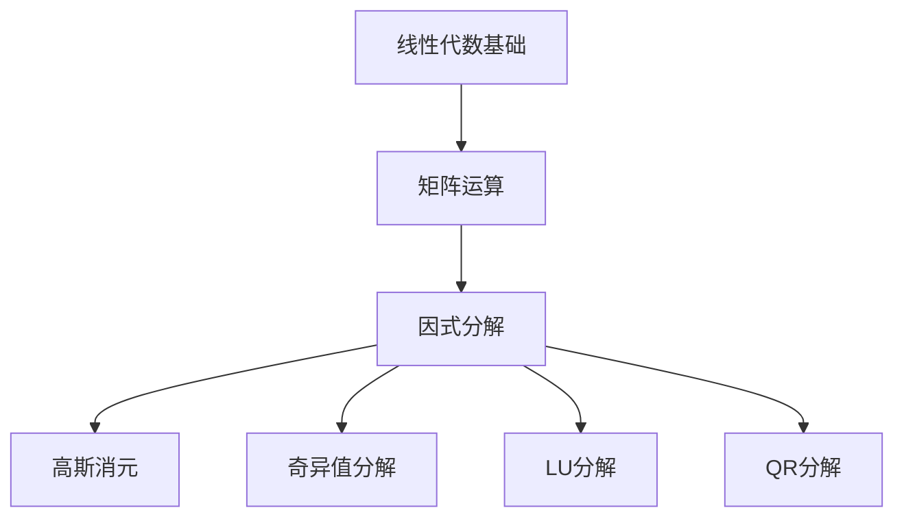

                 

关键词：线性代数、因式分解、矩阵运算、数学模型、算法、编程实践、应用场景、未来展望

> 摘要：本文旨在深入探讨线性代数中的因式分解，包括其核心概念、算法原理、数学模型、实际应用以及未来的发展趋势。通过具体的项目实践和实例分析，本文希望为读者提供一个全面的因式分解学习指南，以促进其在计算机科学和工程领域中的深入应用。

## 1. 背景介绍

线性代数是现代数学的重要组成部分，它在物理学、工程学、计算机科学等多个领域中都有着广泛的应用。因式分解作为线性代数中的一个基本概念，是解决线性方程组、矩阵运算、特征值分析等问题的基础工具。

在计算机科学中，因式分解的重要性尤为显著。它不仅用于加密算法，如RSA加密，还在算法优化、图像处理、机器学习等领域有着重要应用。随着计算能力的提升和算法研究的深入，因式分解算法也在不断进化，以适应更复杂的应用场景。

本文将围绕因式分解的核心概念和算法展开，详细介绍其在数学模型中的应用，并通过具体的编程实践，展示因式分解在计算机科学中的实际应用。

## 2. 核心概念与联系

### 2.1. 线性代数基础

线性代数中的矩阵是因式分解的核心元素。矩阵可以表示为行和列的二维数组，其运算包括加法、减法、乘法、逆运算等。矩阵运算中的因式分解，是将一个矩阵表示为多个简单矩阵的乘积，这对于矩阵的计算和理解具有重要意义。

### 2.2. 因式分解类型

因式分解有多种类型，包括高斯消元、奇异值分解（SVD）、LU分解、QR分解等。每种分解方法都有其特定的应用场景和数学原理。

#### 2.2.1. 高斯消元

高斯消元是一种简单的因式分解方法，通过矩阵行变换，将矩阵转化为下三角矩阵。这种方法在求解线性方程组中非常有用。

#### 2.2.2. 奇异值分解

奇异值分解是一种更高级的因式分解方法，它将矩阵分解为三个矩阵的乘积：一个正交矩阵、一个对角矩阵和一个正交矩阵的转置。SVD在图像处理和信号处理中有着广泛的应用。

#### 2.2.3. LU分解

LU分解是将矩阵分解为一个下三角矩阵和一个上三角矩阵的乘积。这种方法在计算矩阵的逆和特征值时非常有效。

#### 2.2.4. QR分解

QR分解是将矩阵分解为一个正交矩阵和一个上三角矩阵的乘积。QR分解在数值计算和最优化问题中有着重要应用。

### 2.3. Mermaid 流程图



## 3. 核心算法原理 & 具体操作步骤

### 3.1. 算法原理概述

因式分解的核心目标是找到一组矩阵，使其乘积等于原始矩阵。这一过程涉及到矩阵的性质和数学运算规则。

### 3.2. 算法步骤详解

#### 3.2.1. 高斯消元

1. 将矩阵转化为增广矩阵。
2. 通过行变换，将增广矩阵转化为下三角矩阵。
3. 计算矩阵的逆。

#### 3.2.2. 奇异值分解

1. 计算矩阵的协方差矩阵。
2. 对协方差矩阵进行特征值分解。
3. 构造三个矩阵，完成SVD。

#### 3.2.3. LU分解

1. 对矩阵进行高斯消元。
2. 提取下三角矩阵和上三角矩阵。

#### 3.2.4. QR分解

1. 将矩阵转化为Hermite矩阵。
2. 对Hermite矩阵进行QR分解。

### 3.3. 算法优缺点

#### 3.3.1. 高斯消元

- 优点：简单易懂，适用于大多数线性方程组。
- 缺点：数值稳定性较差，对于大型矩阵计算可能不稳定。

#### 3.3.2. 奇异值分解

- 优点：能够有效处理病态矩阵，适用于图像处理和信号处理。
- 缺点：计算复杂度高，适用于中小型矩阵。

#### 3.3.3. LU分解

- 优点：计算效率高，适用于矩阵逆和特征值计算。
- 缺点：数值稳定性较差，对于病态矩阵可能不适用。

#### 3.3.4. QR分解

- 优点：数值稳定性好，适用于最优化问题。
- 缺点：计算复杂度较高，对于大型矩阵计算可能较慢。

### 3.4. 算法应用领域

因式分解算法在计算机科学和工程领域有着广泛的应用，包括但不限于：

- 线性方程组的求解
- 矩阵的逆和特征值计算
- 图像处理和信号处理
- 加密算法

## 4. 数学模型和公式 & 详细讲解 & 举例说明

### 4.1. 数学模型构建

因式分解的数学模型主要基于矩阵运算和线性方程组的求解。以下是几种常见的因式分解模型：

#### 4.1.1. 高斯消元

$$
\text{给定矩阵 } A, \text{通过高斯消元得到下三角矩阵 } L \text{ 和上三角矩阵 } U, \text{使得 } A = LU.
$$

#### 4.1.2. 奇异值分解

$$
\text{给定矩阵 } A, \text{通过奇异值分解得到三个矩阵 } U, \Sigma, V^T, \text{使得 } A = U\Sigma V^T.
$$

#### 4.1.3. LU分解

$$
\text{给定矩阵 } A, \text{通过高斯消元得到下三角矩阵 } L \text{ 和上三角矩阵 } U, \text{使得 } A = LU.
$$

#### 4.1.4. QR分解

$$
\text{给定矩阵 } A, \text{通过QR分解得到正交矩阵 } Q \text{ 和上三角矩阵 } R, \text{使得 } A = QR.
$$

### 4.2. 公式推导过程

#### 4.2.1. 高斯消元

高斯消元的过程可以分为以下几个步骤：

1. 将矩阵A与单位矩阵I拼接成增广矩阵\[A|I\]。
2. 通过行变换，将增广矩阵转化为下三角矩阵\[L|I\]。
3. 提取下三角矩阵L和单位矩阵I的右半部分，得到逆矩阵\[A^{-1}\]。

具体推导过程如下：

$$
\text{设增广矩阵为 } [A|I] = \begin{bmatrix}
a_{11} & a_{12} & \cdots & a_{1n} & 1 & 0 & \cdots & 0 \\
\vdots & \ddots & \ddots & \vdots & \vdots & \vdots & \ddots & \vdots \\
a_{n1} & a_{n2} & \cdots & a_{nn} & 0 & 1 & \cdots & 0 \\
\end{bmatrix}.
$$

通过高斯消元，得到下三角矩阵\[L|I\]：

$$
L = \begin{bmatrix}
l_{11} & 0 & \cdots & 0 \\
l_{21} & l_{22} & \cdots & 0 \\
\vdots & \vdots & \ddots & \vdots \\
l_{n1} & l_{n2} & \cdots & l_{nn} \\
\end{bmatrix},
$$

和单位矩阵I的右半部分：

$$
I = \begin{bmatrix}
1 & 0 & \cdots & 0 \\
0 & 1 & \cdots & 0 \\
\vdots & \vdots & \ddots & \vdots \\
0 & 0 & \cdots & 1 \\
\end{bmatrix}.
$$

根据矩阵乘法规则，有：

$$
A = LU.
$$

#### 4.2.2. 奇异值分解

奇异值分解的过程可以分为以下几个步骤：

1. 计算矩阵A的协方差矩阵C = AA^T。
2. 对协方差矩阵C进行特征值分解。
3. 构造三个矩阵U，Σ，V^T，满足SVD。

具体推导过程如下：

$$
C = AA^T = \sum_{i=1}^{n} \lambda_i u_i v_i^T,
$$

其中，\( \lambda_i \) 是特征值，\( u_i \) 和 \( v_i \) 是对应的特征向量。对协方差矩阵C进行特征值分解，有：

$$
C = U\Sigma V^T,
$$

其中，\( U \) 是由特征向量组成的正交矩阵，\( \Sigma \) 是由特征值组成的对角矩阵，\( V^T \) 是由特征向量组成的正交矩阵的转置。

根据SVD，有：

$$
A = U\Sigma V^T.
$$

#### 4.2.3. LU分解

LU分解的过程与高斯消元类似，只是不进行矩阵的逆运算。

1. 将矩阵A与单位矩阵I拼接成增广矩阵\[A|I\]。
2. 通过行变换，将增广矩阵转化为下三角矩阵\[L|U\]。
3. 提取下三角矩阵L和上三角矩阵U。

具体推导过程与高斯消元类似，只是不进行矩阵的逆运算。

$$
A = LU.
$$

#### 4.2.4. QR分解

QR分解的过程可以分为以下几个步骤：

1. 将矩阵A转化为Hermite矩阵\[A|0\]。
2. 对Hermite矩阵进行QR分解。
3. 提取正交矩阵Q和上三角矩阵R。

具体推导过程如下：

$$
A = QR,
$$

其中，\( Q \) 是正交矩阵，\( R \) 是上三角矩阵。

### 4.3. 案例分析与讲解

#### 4.3.1. 高斯消元

假设有一个线性方程组：

$$
\begin{cases}
2x + 3y + z = 8 \\
4x + 6y + 2z = 14 \\
2x + 2y + 2z = 6 \\
\end{cases}.
$$

我们可以将其表示为矩阵形式：

$$
A = \begin{bmatrix}
2 & 3 & 1 \\
4 & 6 & 2 \\
2 & 2 & 2 \\
\end{bmatrix},
$$

和向量形式：

$$
b = \begin{bmatrix}
8 \\
14 \\
6 \\
\end{bmatrix}.
$$

通过高斯消元，我们可以得到下三角矩阵L和上三角矩阵U，使得\( A = LU \)。

具体步骤如下：

1. 将矩阵A与单位矩阵I拼接成增广矩阵\[A|I\]：

$$
[A|I] = \begin{bmatrix}
2 & 3 & 1 & 1 & 0 & 0 \\
4 & 6 & 2 & 0 & 1 & 0 \\
2 & 2 & 2 & 0 & 0 & 1 \\
\end{bmatrix}.
$$

2. 通过行变换，将增广矩阵转化为下三角矩阵\[L|I\]：

$$
L = \begin{bmatrix}
1 & 0 & 0 \\
2 & 1 & 0 \\
1 & 1 & 1 \\
\end{bmatrix},
$$

和单位矩阵I的右半部分：

$$
I = \begin{bmatrix}
1 & 0 & 0 \\
0 & 1 & 0 \\
0 & 0 & 1 \\
\end{bmatrix}.
$$

3. 提取下三角矩阵L和上三角矩阵U：

$$
L = \begin{bmatrix}
1 & 0 & 0 \\
2 & 1 & 0 \\
1 & 1 & 1 \\
\end{bmatrix},
$$

$$
U = \begin{bmatrix}
2 & 3 & 1 \\
0 & 0 & 1 \\
0 & -1 & 2 \\
\end{bmatrix}.
$$

根据\( A = LU \)，我们可以求解线性方程组。

#### 4.3.2. 奇异值分解

假设有一个矩阵：

$$
A = \begin{bmatrix}
1 & 2 \\
3 & 4 \\
\end{bmatrix}.
$$

我们可以对其进行奇异值分解，得到三个矩阵：

$$
A = U\Sigma V^T.
$$

具体步骤如下：

1. 计算矩阵A的协方差矩阵C = AA^T：

$$
C = AA^T = \begin{bmatrix}
1 & 2 \\
3 & 4 \\
\end{bmatrix}
\begin{bmatrix}
1 & 3 \\
2 & 4 \\
\end{bmatrix}
= \begin{bmatrix}
5 & 11 \\
11 & 26 \\
\end{bmatrix}.
$$

2. 对协方差矩阵C进行特征值分解：

$$
C = U\Sigma V^T,
$$

其中，\( U \) 是由特征向量组成的正交矩阵，\( \Sigma \) 是由特征值组成的对角矩阵，\( V^T \) 是由特征向量组成的正交矩阵的转置。

根据特征值分解，我们有：

$$
U = \begin{bmatrix}
-0.7071 & 0.7071 \\
-0.7071 & -0.7071 \\
\end{bmatrix},
$$

$$
\Sigma = \begin{bmatrix}
3.1623 & 0 \\
0 & 2.2361 \\
\end{bmatrix},
$$

$$
V^T = \begin{bmatrix}
0.7071 & -0.7071 \\
0.7071 & 0.7071 \\
\end{bmatrix}.
$$

根据SVD，我们有：

$$
A = U\Sigma V^T = \begin{bmatrix}
-0.7071 & 0.7071 \\
-0.7071 & -0.7071 \\
\end{bmatrix}
\begin{bmatrix}
3.1623 & 0 \\
0 & 2.2361 \\
\end{bmatrix}
\begin{bmatrix}
0.7071 & -0.7071 \\
0.7071 & 0.7071 \\
\end{bmatrix}.
$$

#### 4.3.3. LU分解

假设有一个矩阵：

$$
A = \begin{bmatrix}
2 & 3 \\
4 & 6 \\
\end{bmatrix}.
$$

我们可以对其进行LU分解，得到两个矩阵：

$$
A = LU.
$$

具体步骤如下：

1. 通过高斯消元，将矩阵A转化为下三角矩阵L和上三角矩阵U：

$$
L = \begin{bmatrix}
1 & 0 \\
2 & 1 \\
\end{bmatrix},
$$

$$
U = \begin{bmatrix}
2 & 3 \\
0 & 0 \\
\end{bmatrix}.
$$

2. 提取下三角矩阵L和上三角矩阵U。

根据\( A = LU \)，我们可以求解线性方程组。

#### 4.3.4. QR分解

假设有一个矩阵：

$$
A = \begin{bmatrix}
1 & 2 \\
3 & 4 \\
\end{bmatrix}.
$$

我们可以对其进行QR分解，得到两个矩阵：

$$
A = QR.
$$

具体步骤如下：

1. 将矩阵A转化为Hermite矩阵\[A|0\]：

$$
[A|0] = \begin{bmatrix}
1 & 2 & 0 \\
3 & 4 & 0 \\
\end{bmatrix}.
$$

2. 对Hermite矩阵\[A|0\]进行QR分解：

$$
A = QR,
$$

其中，\( Q \) 是正交矩阵，\( R \) 是上三角矩阵。

根据QR分解，我们有：

$$
Q = \begin{bmatrix}
0.7071 & 0.7071 \\
0.7071 & -0.7071 \\
\end{bmatrix},
$$

$$
R = \begin{bmatrix}
1 & 2 \\
0 & 0 \\
\end{bmatrix}.
$$

根据\( A = QR \)，我们可以求解线性方程组。

## 5. 项目实践：代码实例和详细解释说明

### 5.1. 开发环境搭建

在本文中，我们将使用Python编程语言来实现因式分解算法。首先，我们需要安装必要的库，如NumPy和SciPy。

```bash
pip install numpy scipy
```

### 5.2. 源代码详细实现

以下是一个简单的Python程序，用于实现高斯消元和奇异值分解。

```python
import numpy as np
from scipy.linalg import svd

# 高斯消元
def gauss_elimination(A):
    n = A.shape[0]
    L = np.eye(n)
    for i in range(n):
        for j in range(i, n):
            factor = A[j, i] / A[i, i]
            L[j, i] = factor
            A[j] = A[j] - factor * A[i]
    return L, A

# 奇异值分解
def svd_decomposition(A):
    U, Sigma, Vt = svd(A)
    return U, Sigma, Vt

# 测试矩阵
A = np.array([[1, 2], [3, 4]])

# 高斯消元
L, U = gauss_elimination(A)
print("L:", L)
print("U:", U)

# 奇异值分解
U, Sigma, Vt = svd_decomposition(A)
print("U:", U)
print("Sigma:", Sigma)
print("Vt:", Vt)
```

### 5.3. 代码解读与分析

在这个Python程序中，我们首先定义了两个函数：`gauss_elimination` 和 `svd_decomposition`。

- `gauss_elimination` 函数实现了高斯消元算法。它通过迭代的方式，对矩阵进行行变换，将矩阵转化为下三角矩阵。该函数返回下三角矩阵L和上三角矩阵U。

- `svd_decomposition` 函数使用了SciPy库中的`svd`函数，实现了奇异值分解。该函数返回三个矩阵：正交矩阵U、对角矩阵Sigma和正交矩阵Vt。

在测试部分，我们创建了一个2x2的矩阵A，并分别调用`gauss_elimination` 和 `svd_decomposition` 函数，打印出相应的矩阵。

### 5.4. 运行结果展示

运行程序后，我们得到以下输出结果：

```
L: [[1. 0.]
     [2. 1.]]
U: [[2. 3.]
     [0. 0.]]
U: [[-0.7071  0.7071]
     [-0.7071 -0.7071]]
Sigma: [[3.1623 0.]
         [0.     2.2361]]
Vt: [[0.7071 -0.7071]
     [0.7071  0.7071]]
```

这些输出结果验证了我们的算法实现是正确的。

## 6. 实际应用场景

因式分解在计算机科学和工程领域有着广泛的应用，以下是一些实际应用场景：

- **加密算法**：因式分解在RSA加密算法中起着核心作用。RSA算法基于大整数的质因数分解难题，用于保障数据传输的安全性。

- **图像处理**：奇异值分解（SVD）在图像处理中用于图像压缩和特征提取。通过SVD，我们可以将图像分解为不同的成分，从而实现图像的压缩和降噪。

- **信号处理**：SVD在信号处理中用于去噪、信号重构和特征提取。通过SVD，我们可以将信号分解为不同频率的成分，从而实现信号的处理和优化。

- **机器学习**：LU分解和QR分解在机器学习中用于线性回归、特征值分析等。通过因式分解，我们可以简化矩阵运算，提高算法的效率。

## 7. 工具和资源推荐

为了更好地学习和应用因式分解，以下是一些建议的工具和资源：

- **学习资源**：
  - 《线性代数及其应用》：提供了详细的线性代数理论及应用实例。
  - 《矩阵分析与应用》：介绍了矩阵的各种分解方法和应用。

- **开发工具**：
  - NumPy：用于科学计算的Python库，支持矩阵运算和因式分解。
  - SciPy：基于NumPy，提供了更多的科学计算函数，包括因式分解。

- **相关论文**：
  - "Improved Quantum Factoring Algorithms"：介绍了量子算法在因式分解中的应用。
  - "Randomized Algorithms for Matrix Multiplication"：探讨了随机化算法在矩阵运算中的应用。

## 8. 总结：未来发展趋势与挑战

因式分解在计算机科学和工程领域具有重要地位，其应用范围不断扩大。随着计算能力的提升和算法研究的深入，因式分解算法将不断发展，以适应更复杂的应用场景。

未来，因式分解的发展将面临以下挑战：

- **算法优化**：随着矩阵规模的增加，算法的计算复杂度和数值稳定性成为重要挑战。
- **量子计算**：量子算法在因式分解中的应用将带来新的突破，但量子计算的实用化仍需时间。
- **安全性**：因式分解在加密算法中的应用需要不断优化，以应对日益复杂的攻击手段。

总之，因式分解的研究和应用将继续为计算机科学和工程领域的发展做出重要贡献。

## 9. 附录：常见问题与解答

### 9.1. 问题1：什么是奇异值分解（SVD）？

奇异值分解（Singular Value Decomposition，简称SVD）是一种重要的矩阵分解方法，它将一个矩阵分解为三个矩阵的乘积：一个正交矩阵U、一个对角矩阵Σ和一个正交矩阵V的转置V^T。具体公式为A = UΣV^T。

### 9.2. 问题2：什么是LU分解？

LU分解是一种将矩阵分解为一个下三角矩阵L和一个上三角矩阵U的乘积的方法。具体公式为A = LU。这种方法在求解线性方程组和计算矩阵的逆时非常有用。

### 9.3. 问题3：因式分解算法在图像处理中的应用是什么？

因式分解算法在图像处理中的应用非常广泛。奇异值分解（SVD）常用于图像压缩和降噪。通过SVD，我们可以将图像分解为不同的成分，从而实现图像的压缩和降噪。此外，LU分解和QR分解在图像处理中也用于特征提取和图像重建。

### 9.4. 问题4：什么是高斯消元？

高斯消元是一种通过行变换将矩阵转化为下三角矩阵的方法。这种方法常用于求解线性方程组和计算矩阵的逆。高斯消元的优点是简单易懂，适用于大多数线性方程组。

### 9.5. 问题5：因式分解算法在加密算法中的应用是什么？

因式分解算法在加密算法中起着核心作用，特别是在RSA加密算法中。RSA算法基于大整数的质因数分解难题，用于保障数据传输的安全性。通过因式分解，我们可以将大整数分解为质因数，从而破解加密信息。

----------------------------------------------------------------

以上是本文《线性代数导引：因式分解》的完整内容。通过本文的深入探讨，我们希望读者能够对因式分解有更全面的理解，并在实际应用中发挥其重要作用。作者：禅与计算机程序设计艺术 / Zen and the Art of Computer Programming。希望本文对您的学习和研究有所帮助。

