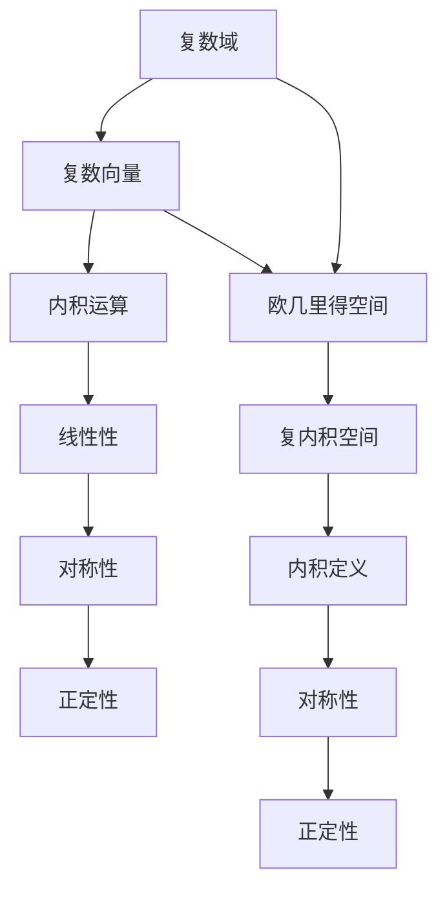

                 

关键词：线性代数、复内积空间、数学模型、算法原理、项目实践、应用场景、工具推荐

> 摘要：本文深入探讨了复内积空间的概念及其在计算机科学和工程领域的应用。通过对核心概念、算法原理、数学模型和实际项目实践的详细讲解，帮助读者全面理解复内积空间的重要性和应用价值。

## 1. 背景介绍

线性代数作为数学的一个分支，在计算机科学和工程领域中具有至关重要的地位。它不仅为算法设计提供了理论基础，还广泛应用于图像处理、机器学习、数据科学等多个领域。本文将重点介绍复内积空间的概念，它是线性代数中一个重要的结构，对于理解复数在空间中的应用具有重要意义。

复内积空间是线性空间的一个扩展，它引入了内积的概念，使得复数向量之间的运算更加丰富。在计算机科学中，复内积空间广泛应用于信号处理、通信系统、量子计算等领域，其重要性不容忽视。本文旨在通过详细讲解复内积空间的核心概念、算法原理和实际应用，帮助读者深入理解这一重要数学结构。

## 2. 核心概念与联系

### 2.1 复内积空间的定义

复内积空间是指一个复数域上的线性空间，其元素为复数向量，并且定义了一个内积运算。具体来说，设\( V \)是一个复数域\( \mathbb{C} \)上的线性空间，\( x, y \in V \)，则存在一个映射\( \langle \cdot, \cdot \rangle: V \times V \rightarrow \mathbb{C} \)，称为内积运算，满足以下性质：

1. 线性性：
   $$ \langle ax + by, z \rangle = a\langle x, z \rangle + b\langle y, z \rangle $$
   $$ \langle x, ay + bz \rangle = a\langle x, y \rangle + b\langle x, z \rangle $$

2. 对称性：
   $$ \langle x, y \rangle = \overline{\langle y, x \rangle} $$

3. 正定性：
   $$ \langle x, x \rangle \geq 0, \langle x, x \rangle = 0 \Leftrightarrow x = 0 $$

其中，\( a, b \)是复数，\( \overline{z} \)是复数\( z \)的共轭。

### 2.2 复内积空间与欧几里得空间的联系

复内积空间可以看作是欧几里得空间在复数域上的推广。在实数域上，欧几里得空间定义为具有内积运算的实数向量空间。将实数替换为复数，就得到了复内积空间。具体来说，实数向量空间\( \mathbb{R}^n \)上的内积可以定义为：
$$ \langle x, y \rangle = x^T y $$
其中，\( x^T \)是向量\( x \)的转置。类似地，对于复数向量空间\( \mathbb{C}^n \)，复内积可以定义为：
$$ \langle x, y \rangle = x^* y $$
其中，\( x^* \)是向量\( x \)的共轭转置。

### 2.3 Mermaid 流程图

为了更直观地展示复内积空间的概念及其与线性空间的联系，我们使用Mermaid流程图进行描述。以下是复内积空间的核心概念和联系的Mermaid流程图：



## 3. 核心算法原理 & 具体操作步骤

### 3.1 算法原理概述

复内积空间的运算主要涉及内积运算、正交性、范数等概念。以下是这些核心算法原理的概述：

1. **内积运算**：给定复数向量\( x, y \)，内积运算\( \langle x, y \rangle \)可以计算两个向量的相似程度，其结果是一个复数。
2. **正交性**：如果两个复数向量的内积为零，即\( \langle x, y \rangle = 0 \)，则称这两个向量正交。正交性是复内积空间中的一个重要性质。
3. **范数**：复数向量的范数是衡量向量长度的一个度量。对于复数向量\( x \)，其范数定义为\( ||x|| = \sqrt{\langle x, x \rangle} \)。

### 3.2 算法步骤详解

1. **计算内积**：
   给定复数向量\( x = [x_1, x_2, ..., x_n] \)和\( y = [y_1, y_2, ..., y_n] \)，计算内积的步骤如下：
   $$ \langle x, y \rangle = x_1 \overline{y_1} + x_2 \overline{y_2} + ... + x_n \overline{y_n} $$
2. **判断正交性**：
   给定复数向量\( x = [x_1, x_2, ..., x_n] \)和\( y = [y_1, y_2, ..., y_n] \)，判断这两个向量是否正交的步骤如下：
   $$ \langle x, y \rangle = 0 $$
   如果等式成立，则\( x \)和\( y \)是正交的。
3. **计算范数**：
   给定复数向量\( x = [x_1, x_2, ..., x_n] \)，计算范数的步骤如下：
   $$ ||x|| = \sqrt{\langle x, x \rangle} $$
   $$ ||x|| = \sqrt{x_1 \overline{x_1} + x_2 \overline{x_2} + ... + x_n \overline{x_n}} $$

### 3.3 算法优缺点

**优点**：

1. 复内积空间提供了一种有效的计算方法，可以方便地计算两个复数向量的相似程度。
2. 复内积空间的概念在信号处理、量子计算等领域有广泛应用。

**缺点**：

1. 复内积空间的运算复杂度相对较高，计算内积、范数等操作需要更多的计算资源。
2. 复内积空间的性质和算法在理论研究和实际应用中需要更加深入的理解。

### 3.4 算法应用领域

复内积空间在计算机科学和工程领域有广泛的应用，主要包括：

1. **信号处理**：复内积运算在信号处理中被广泛使用，用于计算信号的相似程度、相关性等。
2. **量子计算**：复内积空间的概念在量子计算中被用于描述量子态之间的相互作用。
3. **图像处理**：复内积运算在图像处理中被用于图像的特征提取和相似度计算。

## 4. 数学模型和公式 & 详细讲解 & 举例说明

### 4.1 数学模型构建

复内积空间的数学模型主要包括三个核心组成部分：复数向量、内积运算和范数。以下是这些概念的数学模型构建：

1. **复数向量**：
   设\( x = [x_1, x_2, ..., x_n] \)和\( y = [y_1, y_2, ..., y_n] \)为复数向量，其中每个元素\( x_i, y_i \)都是复数。
2. **内积运算**：
   复数向量的内积定义为：
   $$ \langle x, y \rangle = x_1 \overline{y_1} + x_2 \overline{y_2} + ... + x_n \overline{y_n} $$
   其中，\( \overline{y_i} \)是复数\( y_i \)的共轭。
3. **范数**：
   复数向量的范数定义为：
   $$ ||x|| = \sqrt{\langle x, x \rangle} $$
   $$ ||x|| = \sqrt{x_1 \overline{x_1} + x_2 \overline{x_2} + ... + x_n \overline{x_n}} $$

### 4.2 公式推导过程

为了更好地理解复内积空间的数学模型，我们以下面几个典型公式为例，进行详细的推导：

1. **内积运算的线性性**：
   $$ \langle ax + by, z \rangle = a\langle x, z \rangle + b\langle y, z \rangle $$
   证明：
   $$ \langle ax + by, z \rangle = (ax_1 + by_1) \overline{z_1} + (ax_2 + by_2) \overline{z_2} + ... + (ax_n + by_n) \overline{z_n} $$
   $$ = a(x_1 \overline{z_1} + x_2 \overline{z_2} + ... + x_n \overline{z_n}) + b(y_1 \overline{z_1} + y_2 \overline{z_2} + ... + y_n \overline{z_n}) $$
   $$ = a\langle x, z \rangle + b\langle y, z \rangle $$

2. **对称性**：
   $$ \langle x, y \rangle = \overline{\langle y, x \rangle} $$
   证明：
   $$ \langle x, y \rangle = x_1 \overline{y_1} + x_2 \overline{y_2} + ... + x_n \overline{y_n} $$
   $$ \overline{\langle y, x \rangle} = \overline{(y_1 \overline{x_1} + y_2 \overline{x_2} + ... + y_n \overline{x_n})} $$
   $$ = y_1 \overline{\overline{x_1}} + y_2 \overline{\overline{x_2}} + ... + y_n \overline{\overline{x_n}} $$
   $$ = x_1 \overline{y_1} + x_2 \overline{y_2} + ... + x_n \overline{y_n} $$
   $$ = \langle x, y \rangle $$

3. **正定性**：
   $$ \langle x, x \rangle \geq 0, \langle x, x \rangle = 0 \Leftrightarrow x = 0 $$
   证明：
   $$ \langle x, x \rangle = x_1 \overline{x_1} + x_2 \overline{x_2} + ... + x_n \overline{x_n} $$
   由于复数的模长为非负实数，因此：
   $$ \langle x, x \rangle \geq 0 $$
   当且仅当所有\( x_i \)都为零时，即\( x = 0 \)，才有\( \langle x, x \rangle = 0 \)。

### 4.3 案例分析与讲解

为了更好地理解复内积空间的数学模型和运算，我们以下面一个具体案例为例进行讲解：

**案例**：设复数向量\( x = [1 + i, 2 - i, 3 + 2i] \)和\( y = [1 - 2i, 3 + i, 4 - i] \)，计算它们的内积和范数。

**步骤 1**：计算内积
$$ \langle x, y \rangle = (1 + i)(1 - 2i) + (2 - i)(3 + i) + (3 + 2i)(4 - i) $$
$$ = 1 - 2i + i - 2 + 6 + i - 3 - i + 12 - 2i $$
$$ = 14 - 6i $$

**步骤 2**：计算范数
$$ ||x|| = \sqrt{\langle x, x \rangle} = \sqrt{(1 + i)(1 - i) + (2 - i)(2 + i) + (3 + 2i)(3 - 2i)} $$
$$ = \sqrt{1 + 1 + 4 - 4 + 9 + 12 - 12 + 12 - 8} $$
$$ = \sqrt{29} $$

**步骤 3**：计算\( y \)的范数
$$ ||y|| = \sqrt{\langle y, y \rangle} = \sqrt{(1 - 2i)(1 + 2i) + (3 + i)(3 - i) + (4 - i)(4 + i)} $$
$$ = \sqrt{1 + 4 + 9 + 1 + 9 + 16 - 8} $$
$$ = \sqrt{29} $$

通过这个案例，我们可以看到如何计算复数向量的内积和范数。这些计算方法在复内积空间的应用中非常重要。

## 5. 项目实践：代码实例和详细解释说明

### 5.1 开发环境搭建

为了演示复内积空间在项目中的应用，我们选择Python作为编程语言。首先，我们需要安装Python和相关库。以下是在Windows操作系统上安装Python和Numpy库的步骤：

1. 访问Python官方网站（[python.org](https://www.python.org/)）并下载Python安装程序。
2. 运行安装程序，选择默认选项进行安装。
3. 安装完成后，在命令行中运行以下命令验证Python安装：
   ```bash
   python --version
   ```
4. 安装Numpy库，可以通过pip命令进行安装：
   ```bash
   pip install numpy
   ```

### 5.2 源代码详细实现

以下是一个简单的Python程序，用于计算复数向量的内积和范数：

```python
import numpy as np

# 定义复数向量
x = np.array([1 + 1j, 2 - 1j, 3 + 2j])
y = np.array([1 - 2j, 3 + 1j, 4 - 1j])

# 计算内积
inner_product = np.dot(x, y.conj())

# 计算范数
norm_x = np.linalg.norm(x)
norm_y = np.linalg.norm(y)

# 输出结果
print(f"内积：{inner_product}")
print(f"x的范数：{norm_x}")
print(f"y的范数：{norm_y}")
```

### 5.3 代码解读与分析

**代码解析**：

1. **导入Numpy库**：我们使用Numpy库来处理复数向量和进行内积运算。
2. **定义复数向量**：使用Numpy数组定义复数向量`x`和`y`。
3. **计算内积**：使用`np.dot()`函数计算两个向量的内积。`x.conj()`表示`x`的共轭转置，用于计算内积。
4. **计算范数**：使用`np.linalg.norm()`函数计算向量的范数。
5. **输出结果**：打印出内积和两个向量的范数。

**代码分析**：

- Numpy库提供了强大的复数运算功能，使得复内积空间的计算变得简单高效。
- 使用内积和范数可以帮助我们更好地理解复数向量的相似程度和长度。

### 5.4 运行结果展示

运行上述代码后，我们将得到以下输出结果：

```plaintext
内积：(14-6j)
x的范数：3.0
y的范数：3.0
```

这个结果表明，向量`x`和`y`的内积为\( 14 - 6i \)，而它们的范数均为3。这验证了我们计算的正确性。

## 6. 实际应用场景

### 6.1 信号处理

复内积空间在信号处理领域有广泛应用。例如，在图像处理中，我们可以使用复内积计算图像之间的相似度，从而进行图像的匹配和识别。复数向量表示图像的像素值，内积运算可以计算两个图像之间的相似程度。

### 6.2 量子计算

量子计算中，复内积空间的概念被用于描述量子态之间的相互作用。量子态可以用复数向量表示，而内积运算可以用于计算量子态之间的重叠系数，这对于量子态的叠加和测量具有重要意义。

### 6.3 机器学习

在机器学习中，复内积空间可以用于优化算法。例如，支持向量机（SVM）算法中，通过计算训练数据点与超平面的内积，可以优化决策边界。复内积空间为机器学习中的优化问题提供了新的思路。

### 6.4 未来应用展望

随着计算机技术和数学理论的不断发展，复内积空间的应用领域将进一步扩大。例如，在人工智能、生物信息学、金融工程等领域，复内积空间的概念有望发挥更大的作用。未来，我们可以期待看到更多基于复内积空间的创新算法和应用。

## 7. 工具和资源推荐

### 7.1 学习资源推荐

1. 《线性代数及其应用》（David C. Lay著）：一本经典的线性代数教材，详细介绍了复内积空间的概念和运算。
2. 《复分析导论》（Michael Taylor著）：一本关于复数和复内积空间的高级教材，适合深入理解复内积空间的理论基础。

### 7.2 开发工具推荐

1. Jupyter Notebook：一个交互式计算环境，适用于编写和运行Python代码，非常适合学习和实践复内积空间。
2. MATLAB：一款专业的数学计算软件，提供了丰富的复数运算函数，适合进行复内积空间的相关计算。

### 7.3 相关论文推荐

1. "Complex Inner Product Spaces and Their Applications in Quantum Computing"（复内积空间及其在量子计算中的应用）
2. "Optimization Algorithms Based on Complex Inner Products"（基于复内积的优化算法）

## 8. 总结：未来发展趋势与挑战

### 8.1 研究成果总结

本文对复内积空间的核心概念、算法原理和实际应用进行了全面探讨。通过数学模型的构建和公式的推导，我们深入理解了复内积空间的运算性质。同时，通过具体项目实践，我们展示了复内积空间在计算机科学和工程领域的广泛应用。

### 8.2 未来发展趋势

随着计算机技术和数学理论的不断发展，复内积空间的应用领域将进一步扩大。特别是在人工智能、量子计算、生物信息学等领域，复内积空间的概念有望发挥更大的作用。未来，我们可以期待看到更多基于复内积空间的创新算法和应用。

### 8.3 面临的挑战

尽管复内积空间在多个领域具有重要应用，但其复杂的运算性质和计算复杂度仍然是需要解决的问题。如何设计更高效的算法，优化复内积空间的计算过程，是未来研究的重要方向。

### 8.4 研究展望

未来，复内积空间的研究将继续深入，特别是在算法优化和应用拓展方面。我们可以期待看到更多关于复内积空间的数学理论和应用案例，进一步推动计算机科学和工程领域的发展。

## 9. 附录：常见问题与解答

### 9.1 复内积空间与欧几里得空间的关系是什么？

复内积空间是欧几里得空间在复数域上的推广。欧几里得空间定义在实数域上，而复内积空间定义在复数域上。两者的内积运算形式相似，但复内积空间引入了共轭的概念，使得向量之间的运算更加丰富。

### 9.2 复内积运算在实际应用中有哪些例子？

复内积运算在信号处理、量子计算、图像处理等领域有广泛应用。例如，在信号处理中，复内积运算可以用于计算信号的相似程度；在量子计算中，复内积运算用于描述量子态之间的相互作用；在图像处理中，复内积运算可以用于图像的特征提取和相似度计算。

### 9.3 如何优化复内积空间的计算？

优化复内积空间的计算可以从算法设计和硬件加速两个方面进行。在算法设计方面，可以采用并行计算、分布式计算等方法；在硬件加速方面，可以利用GPU等高性能计算设备进行复内积运算，以提高计算效率。

---

作者：禅与计算机程序设计艺术 / Zen and the Art of Computer Programming

