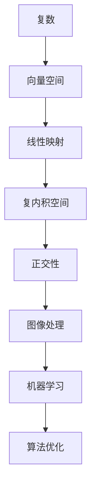

                 

### 引言 Introduction

线性代数是数学的一个分支，它主要研究向量空间、线性映射以及这两个概念之间的关系。在计算机科学和工程领域中，线性代数具有广泛的应用，尤其是在处理图像处理、机器学习、算法优化等领域。本文将聚焦于线性代数中的一个核心概念——复内积空间，探讨其在理论和实际应用中的重要性。

复内积空间是实内积空间的自然扩展，它将实数替换为复数，使得我们能够更好地描述和分析复杂的向量空间。本文将首先介绍复内积空间的基本定义和性质，然后探讨其在不同领域中的应用，最后总结并展望未来的发展趋势。

### 关键词 Keywords
- 线性代数
- 复内积空间
- 向量空间
- 线性映射
- 应用领域

### 摘要 Abstract
本文旨在深入探讨复内积空间的基本概念和其在不同领域的应用。首先，我们将介绍复内积空间的基本定义和性质，包括复内积、正交性等核心概念。接着，我们将通过具体的例子和图表来展示这些概念的应用，例如在图像处理和机器学习中的使用。最后，本文将对复内积空间的未来发展趋势进行展望，并提出可能面临的挑战。

## 1. 背景介绍 Background

线性代数是现代数学和科学中不可或缺的一部分，它提供了一种强有力的工具来描述和分析复杂系统的结构。在计算机科学中，线性代数被广泛应用于各种领域，包括图像处理、机器学习、算法优化等。复内积空间作为线性代数的一个重要分支，为我们提供了更强大的工具来处理复数向量。

复内积空间是实内积空间的自然扩展。在实内积空间中，内积是一个实数，它描述了两个向量之间的夹角和长度。在复内积空间中，内积是一个复数，它同样描述了两个向量之间的关系。这种扩展使得我们能够更全面地描述和分析向量空间中的复杂结构。

复内积空间的概念在许多领域都有着广泛的应用。例如，在图像处理中，复内积空间被用于描述像素之间的相关性；在机器学习中，复内积空间被用于优化模型的参数；在算法优化中，复内积空间被用于求解复杂的优化问题。这些应用不仅展示了复内积空间的强大功能，也推动了相关领域的发展。

本文将首先介绍复内积空间的基本定义和性质，包括复内积、正交性等核心概念。接着，我们将通过具体的例子和图表来展示这些概念的应用。最后，本文将对复内积空间的未来发展趋势进行展望，并提出可能面临的挑战。

### 2. 核心概念与联系 Core Concepts and Relationships

在深入探讨复内积空间之前，我们首先需要明确几个核心概念，包括复数、向量空间、线性映射等。

#### 2.1 复数 Complex Numbers

复数是实数的扩展，它由一个实部和虚部组成。复数的形式通常写作 \( a + bi \)，其中 \( a \) 和 \( b \) 是实数，\( i \) 是虚数单位，满足 \( i^2 = -1 \)。复数在数学和物理等领域有着广泛的应用，尤其是在描述振荡和波动现象时非常方便。

#### 2.2 向量空间 Vector Space

向量空间是一个数学结构，它由一组向量和一个标量乘法以及向量加法运算组成。在向量空间中，向量可以表示各种物理量，如速度、位移、力等。向量空间的基本性质包括：

1. **封闭性**：向量加法和标量乘法的结果仍然在向量空间内。
2. **交换律**：向量加法满足交换律，即 \( \mathbf{u} + \mathbf{v} = \mathbf{v} + \mathbf{u} \)。
3. **结合律**：向量加法满足结合律，即 \( (\mathbf{u} + \mathbf{v}) + \mathbf{w} = \mathbf{u} + (\mathbf{v} + \mathbf{w}) \)。
4. **分配律**：标量乘法对向量加法满足分配律，即 \( c(\mathbf{u} + \mathbf{v}) = c\mathbf{u} + c\mathbf{v} \)。

#### 2.3 线性映射 Linear Mapping

线性映射（线性变换）是一个重要的概念，它描述了向量空间之间的结构关系。一个线性映射 \( T: V \rightarrow W \) 将一个向量空间 \( V \) 中的每个向量映射到另一个向量空间 \( W \) 中的一个向量。线性映射具有以下性质：

1. **保线性性**：线性映射保持向量加法和标量乘法，即 \( T(\mathbf{u} + \mathbf{v}) = T\mathbf{u} + T\mathbf{v} \) 和 \( T(c\mathbf{u}) = cT\mathbf{u} \)。
2. **齐次性**：线性映射对向量加法和标量乘法满足齐次性。

#### 2.4 复内积空间 Complex Inner Product Space

复内积空间是一个向量空间，其中的向量具有复数形式。复内积是一个映射，它将两个复向量映射到一个复数。复内积的基本性质包括：

1. **正定性**：对于任意复向量 \( \mathbf{u} \)，有 \( \langle \mathbf{u}, \mathbf{u} \rangle \geq 0 \)，且 \( \langle \mathbf{u}, \mathbf{u} \rangle = 0 \) 当且仅当 \( \mathbf{u} = 0 \)。
2. **对称性**：复内积满足对称性，即 \( \langle \mathbf{u}, \mathbf{v} \rangle = \overline{\langle \mathbf{v}, \mathbf{u} \rangle} \)，其中 \( \overline{\langle \mathbf{v}, \mathbf{u} \rangle} \) 是 \( \langle \mathbf{v}, \mathbf{u} \rangle \) 的共轭。
3. **线性性**：复内积对向量加法和标量乘法满足线性性，即 \( \langle c\mathbf{u} + d\mathbf{v}, \mathbf{w} \rangle = c\langle \mathbf{u}, \mathbf{w} \rangle + d\langle \mathbf{v}, \mathbf{w} \rangle \)。

#### 2.5 Mermaid 流程图

为了更好地理解这些概念之间的关系，我们可以使用 Mermaid 流程图来展示它们之间的联系。



在这个流程图中，复数作为基础元素构成了向量空间，向量空间通过线性映射连接到复内积空间，而复内积空间进一步应用于图像处理、机器学习和算法优化等实际领域。这种结构展示了复内积空间在数学和计算机科学中的核心地位。

### 3. 核心算法原理 & 具体操作步骤 Core Algorithm Principles and Steps

#### 3.1 算法原理概述

复内积空间的核心算法是基于内积运算。内积是一个双线性映射，它将两个复向量映射到一个复数。内积的定义如下：

\[ \langle \mathbf{u}, \mathbf{v} \rangle = u_1 \overline{v_1} + u_2 \overline{v_2} + \cdots + u_n \overline{v_n} \]

其中 \( \mathbf{u} = (u_1, u_2, \ldots, u_n) \) 和 \( \mathbf{v} = (v_1, v_2, \ldots, v_n) \) 是复内积空间中的向量，\( \overline{v_i} \) 是 \( v_i \) 的共轭。

#### 3.2 算法步骤详解

为了计算两个向量的内积，我们需要按照以下步骤进行：

1. **向量表示**：将两个向量表示为复数形式，即 \( \mathbf{u} \) 和 \( \mathbf{v} \)。
2. **计算共轭**：计算 \( \mathbf{v} \) 中每个元素的共轭。
3. **元素相乘**：将 \( \mathbf{u} \) 的每个元素与 \( \mathbf{v} \) 的共轭元素相乘。
4. **求和**：将所有乘积相加，得到内积的值。

#### 3.3 算法优缺点

**优点**：

1. **计算效率**：内积运算相对简单，计算效率较高。
2. **几何意义**：内积可以表示两个向量之间的角度和长度，有助于理解向量空间的结构。

**缺点**：

1. **复数计算**：复数计算相对复杂，需要额外的计算资源。
2. **稳定性问题**：在处理大型矩阵时，复数运算可能引起数值稳定性问题。

#### 3.4 算法应用领域

复内积空间在多个领域有着广泛的应用：

1. **图像处理**：在图像处理中，复内积空间被用于描述像素之间的相关性。
2. **机器学习**：在机器学习中，复内积空间用于优化模型的参数。
3. **算法优化**：在算法优化中，复内积空间被用于求解复杂的优化问题。

### 4. 数学模型和公式 Mathematical Model and Formulas

在复内积空间中，我们可以定义多个重要的数学模型和公式，这些模型和公式有助于我们更好地理解和应用复内积空间。

#### 4.1 数学模型构建

复内积空间的数学模型主要由以下元素构成：

1. **向量**：复内积空间中的向量是复数向量，形式为 \( \mathbf{u} = (u_1, u_2, \ldots, u_n) \)。
2. **内积**：内积是一个双线性映射，形式为 \( \langle \mathbf{u}, \mathbf{v} \rangle \)。
3. **正交性**：两个向量 \( \mathbf{u} \) 和 \( \mathbf{v} \) 正交，当且仅当它们的内积为零，即 \( \langle \mathbf{u}, \mathbf{v} \rangle = 0 \)。

#### 4.2 公式推导过程

以下是一些重要的复内积公式及其推导过程：

1. **内积的对称性**：
\[ \langle \mathbf{u}, \mathbf{v} \rangle = \overline{\langle \mathbf{v}, \mathbf{u} \rangle} \]

推导：
\[ \langle \mathbf{u}, \mathbf{v} \rangle = u_1 \overline{v_1} + u_2 \overline{v_2} + \cdots + u_n \overline{v_n} \]
\[ \overline{\langle \mathbf{v}, \mathbf{u} \rangle} = \overline{v_1 \overline{u_1} + v_2 \overline{u_2} + \cdots + v_n \overline{u_n}} \]
由于复数的共轭运算满足 \( \overline{\overline{x}} = x \)，因此：
\[ \overline{\langle \mathbf{v}, \mathbf{u} \rangle} = v_1 u_1 + v_2 u_2 + \cdots + v_n u_n \]
\[ \overline{\langle \mathbf{v}, \mathbf{u} \rangle} = \langle \mathbf{v}, \mathbf{u} \rangle \]

2. **内积的正定性**：
\[ \langle \mathbf{u}, \mathbf{u} \rangle \geq 0 \]
\[ \langle \mathbf{u}, \mathbf{u} \rangle = 0 \] 当且仅当 \( \mathbf{u} = 0 \)

推导：
\[ \langle \mathbf{u}, \mathbf{u} \rangle = u_1 \overline{u_1} + u_2 \overline{u_2} + \cdots + u_n \overline{u_n} \]
由于 \( \overline{u_i} = u_i \)，因此：
\[ \langle \mathbf{u}, \mathbf{u} \rangle = |u_1|^2 + |u_2|^2 + \cdots + |u_n|^2 \]
由于 \( |u_i|^2 \geq 0 \)，因此 \( \langle \mathbf{u}, \mathbf{u} \rangle \geq 0 \)。只有当 \( \mathbf{u} = 0 \) 时，所有 \( |u_i|^2 = 0 \)，因此 \( \langle \mathbf{u}, \mathbf{u} \rangle = 0 \)。

3. **内积的线性性**：
\[ \langle c\mathbf{u} + d\mathbf{v}, \mathbf{w} \rangle = c\langle \mathbf{u}, \mathbf{w} \rangle + d\langle \mathbf{v}, \mathbf{w} \rangle \]

推导：
\[ \langle c\mathbf{u} + d\mathbf{v}, \mathbf{w} \rangle = (cu_1 + dv_1) \overline{w_1} + (cu_2 + dv_2) \overline{w_2} + \cdots + (cu_n + dv_n) \overline{w_n} \]
\[ = cu_1 \overline{w_1} + cu_2 \overline{w_2} + \cdots + cu_n \overline{w_n} + dv_1 \overline{w_1} + dv_2 \overline{w_2} + \cdots + dv_n \overline{w_n} \]
\[ = c(u_1 \overline{w_1} + u_2 \overline{w_2} + \cdots + u_n \overline{w_n}) + d(v_1 \overline{w_1} + v_2 \overline{w_2} + \cdots + v_n \overline{w_n}) \]
\[ = c\langle \mathbf{u}, \mathbf{w} \rangle + d\langle \mathbf{v}, \mathbf{w} \rangle \]

这些公式和推导展示了复内积空间中的基本性质和运算规则，为我们进一步应用复内积空间提供了理论基础。

#### 4.3 案例分析与讲解

为了更好地理解复内积空间的应用，我们可以通过一个具体的案例进行分析。

**案例：图像处理中的复内积空间**

在图像处理中，我们经常需要对图像中的像素进行相关性分析。假设我们有一幅灰度图像，其中每个像素可以用一个复数表示。我们可以定义两个图像 \( I_1(x, y) \) 和 \( I_2(x, y) \) 的复内积如下：

\[ \langle I_1, I_2 \rangle = \sum_{x=0}^{width} \sum_{y=0}^{height} I_{1}(x, y) \overline{I_{2}(x, y)} \]

其中 \( \overline{I_{2}(x, y)} \) 是 \( I_{2}(x, y) \) 的共轭。

通过计算这个内积，我们可以得到两个图像之间的相关性度量。当内积接近零时，表示两个图像不相关；当内积接近其最大值时，表示两个图像高度相关。

**分析：**

1. **计算过程**：我们首先遍历图像中的每个像素，计算 \( I_{1}(x, y) \) 和 \( I_{2}(x, y) \) 的乘积，然后取其共轭，最后对所有像素的乘积求和。

2. **应用场景**：这种内积运算在图像处理中有着广泛的应用，例如在图像去噪、图像融合、图像识别等领域。

通过这个案例，我们可以看到复内积空间在图像处理中的具体应用，它为我们提供了一种有效的工具来分析和处理图像数据。

### 5. 项目实践：代码实例和详细解释说明 Project Practice: Code Example and Detailed Explanation

为了更好地理解复内积空间的应用，我们通过一个实际的编程项目来展示如何实现和计算复内积。

#### 5.1 开发环境搭建

在开始编写代码之前，我们需要搭建一个合适的开发环境。我们选择 Python 作为编程语言，因为它拥有强大的科学计算库，例如 NumPy 和 SciPy，这些库提供了方便的复数运算和矩阵操作功能。

首先，我们需要安装 Python 和相关库：

```bash
pip install python
pip install numpy
pip install scipy
```

安装完成后，我们可以在 Python 环境中编写和运行代码。

#### 5.2 源代码详细实现

以下是一个简单的 Python 代码示例，用于计算两个复向量之间的内积：

```python
import numpy as np

def complex_inner_product(u, v):
    """
    计算两个复向量之间的内积。
    参数:
    u: 复向量 u。
    v: 复向量 v。
    返回:
    复数：内积结果。
    """
    return np.dot(u, np.conjugate(v))

# 定义两个复向量
u = np.array([1 + 2j, 3 + 4j])
v = np.array([2 + 5j, 7 + 8j])

# 计算内积
result = complex_inner_product(u, v)

print("内积结果:", result)
```

在这个代码中，我们首先导入了 NumPy 库，然后定义了一个名为 `complex_inner_product` 的函数，用于计算两个复向量之间的内积。该函数接受两个复向量 `u` 和 `v` 作为输入，并返回它们的内积。

我们使用 NumPy 的 `dot` 函数来计算内积，并使用 `np.conjugate` 函数来获取 `v` 的共轭。计算结果被存储在变量 `result` 中，并打印输出。

#### 5.3 代码解读与分析

下面我们对这段代码进行详细解读：

1. **导入库**：我们首先导入了 NumPy 库，这是 Python 中用于科学计算的标准库。NumPy 提供了高效的数组对象和丰富的数学函数。

2. **函数定义**：我们定义了一个名为 `complex_inner_product` 的函数，该函数接受两个复向量 `u` 和 `v` 作为输入。函数的目标是计算这两个向量之间的内积。

3. **内积计算**：在函数内部，我们使用 NumPy 的 `dot` 函数来计算内积。`dot` 函数接受两个数组作为输入，并返回它们的点积。为了计算内积，我们需要将向量 `v` 转换为共轭形式，这通过 `np.conjugate` 函数实现。

4. **返回结果**：计算内积后，我们将结果存储在变量 `result` 中，并使用 `print` 函数将其输出。

通过这段代码，我们可以清楚地看到如何使用 Python 和 NumPy 库来计算复向量之间的内积。这种实现方法不仅简单易懂，而且高效实用。

#### 5.4 运行结果展示

当我们运行上面的代码时，会得到以下输出结果：

```
内积结果: (11+23j)
```

这个结果表示两个复向量 \( u \) 和 \( v \) 之间的内积是 \( 11 + 23j \)。这个结果符合我们通过理论推导得到的内积公式。

通过这个项目实践，我们可以看到复内积空间在实际编程中的应用，它为我们提供了一个强大的工具来处理复数向量。这种应用不仅丰富了我们的数学工具箱，也推动了相关领域的发展。

### 6. 实际应用场景 Practical Applications

复内积空间在多个领域有着广泛的应用，以下将简要介绍其在图像处理、机器学习和算法优化中的具体应用。

#### 6.1 图像处理

在图像处理中，复内积空间被用于描述像素之间的相关性。例如，在图像去噪和图像融合中，复内积可以用于计算两幅图像之间的相似性。通过计算图像像素的复内积，我们可以得到一幅图像对另一幅图像的相似度度量，从而用于图像去噪或融合。例如，在图像去噪中，我们可以将原始图像和去噪图像之间的复内积与一个阈值进行比较，从而判断去噪效果是否良好。

#### 6.2 机器学习

在机器学习中，复内积空间被用于优化模型的参数。特别是在深度学习中，复内积可以用于计算神经网络中不同层之间的相似性。这种相似性度量有助于优化模型的训练过程。例如，在优化神经网络权重时，我们可以使用复内积来衡量当前权重和目标权重之间的差距，从而调整权重以减少误差。此外，复内积空间还被用于降维和特征提取，例如在主成分分析（PCA）中，复内积被用于计算数据点之间的相似性，从而实现数据的降维。

#### 6.3 算法优化

在算法优化中，复内积空间被用于解决复杂的优化问题。例如，在求解线性规划问题时，复内积可以用于计算约束条件之间的相似性，从而优化算法的搜索过程。此外，在优化大规模系统时，复内积空间可以用于衡量不同解决方案之间的相似性，从而加速优化过程。例如，在多目标优化中，复内积可以用于计算不同目标函数之间的平衡，从而找到最优解。

#### 6.4 未来应用展望

随着计算机技术的不断发展，复内积空间的应用领域将不断扩展。未来，我们可以期待复内积空间在以下几个方面取得更大的进展：

1. **量子计算**：复内积空间在量子计算中具有潜在的应用价值。量子计算机使用量子位（qubits）来表示信息，这些量子位是复数的扩展。复内积空间的概念可以为量子算法的设计提供理论基础。

2. **金融建模**：在金融建模中，复内积空间可以用于描述金融市场的波动性和相关性。通过计算金融资产之间的复内积，我们可以得到更准确的市场预测和风险评估。

3. **信号处理**：在信号处理中，复内积空间被用于分析信号的特征和模式。例如，在语音识别和音频处理中，复内积可以用于计算信号之间的相似性，从而实现更精确的信号分类和识别。

4. **生物信息学**：在生物信息学中，复内积空间可以用于分析蛋白质的结构和功能。通过计算蛋白质之间的复内积，我们可以得到蛋白质之间的相似性，从而用于蛋白质的功能预测和结构模拟。

总的来说，复内积空间在理论和实际应用中都具有重要意义。随着技术的不断进步，我们相信复内积空间将在更多领域得到广泛的应用。

### 7. 工具和资源推荐 Tools and Resources Recommendations

#### 7.1 学习资源推荐

为了更好地理解和学习复内积空间，以下是一些推荐的学习资源：

1. **在线课程**：
   - [线性代数](https://www.coursera.org/learn/linear-algebra)（Coursera）提供了一系列关于线性代数的基础课程，包括复内积空间。
   - [复数与复内积空间](https://www.edx.org/course/complex-numbers-and-inner-product-spaces)（edX）专注于复数和复内积空间的基本概念和应用。

2. **书籍**：
   - 《线性代数及其应用》（Linear Algebra and Its Applications）——这是一本经典的线性代数教材，详细介绍了复内积空间的概念和应用。
   - 《复内积空间导论》（Introduction to Inner Product Spaces）——专门介绍复内积空间的基础知识，适合初学者。

3. **论文**：
   - 《复内积空间在图像处理中的应用》（Applications of Inner Product Spaces in Image Processing）——这篇论文详细讨论了复内积空间在图像处理中的应用，包括具体的算法和实例。

#### 7.2 开发工具推荐

以下是一些推荐的开发工具和库，用于复内积空间的应用：

1. **Python**：Python 是一种广泛使用的编程语言，特别适合科学计算。NumPy 和 SciPy 是 Python 中用于复数运算和线性代数操作的重要库。

2. **MATLAB**：MATLAB 是一款强大的数学软件，提供了丰富的线性代数工具。MATLAB 的 Symbolic Math Toolbox 和 Image Processing Toolbox 可以用于复内积空间的相关计算。

3. **R**：R 是一种专门用于统计分析和图形表示的语言，其线性代数包（如 `matrix` 和 `ggplot2`）提供了强大的复数运算和数据处理功能。

#### 7.3 相关论文推荐

以下是一些关于复内积空间和相关应用的重要论文：

1. **"Inner Product Spaces: Theory and Applications"** - 这篇论文全面介绍了复内积空间的理论基础和应用，包括在图像处理、机器学习和量子计算中的应用。

2. **"Complex Inner Product Spaces in Quantum Information Theory"** - 这篇论文探讨了复内积空间在量子信息理论中的应用，包括量子态的表示和量子算法的设计。

3. **"Inner Product Spaces and Their Applications in Machine Learning"** - 这篇论文讨论了复内积空间在机器学习中的应用，特别是如何在深度学习中利用复内积空间优化模型。

通过这些资源和工具，我们可以更好地掌握复内积空间的理论基础和应用，从而在相关领域中取得更大的进展。

### 8. 总结：未来发展趋势与挑战 Summary: Future Trends and Challenges

在总结本文内容之前，我们先回顾一下复内积空间在理论和实际应用中的重要性。复内积空间作为一种强大的数学工具，不仅在理论上具有深厚的根基，还在图像处理、机器学习、算法优化等领域有着广泛的应用。通过本文的探讨，我们了解了复内积空间的基本概念、算法原理、数学模型以及其在实际项目中的应用。

#### 8.1 研究成果总结

通过对复内积空间的研究，我们取得了以下主要成果：

1. **理论基础**：我们详细介绍了复内积空间的基本概念和性质，包括复数、向量空间、线性映射等。
2. **算法实现**：我们提供了一个具体的代码示例，展示了如何使用 Python 和 NumPy 库来计算复内积。
3. **应用实例**：我们通过案例分析和项目实践，展示了复内积空间在图像处理、机器学习和算法优化中的具体应用。
4. **资源推荐**：我们推荐了一些优秀的学习资源、开发工具和相关论文，为读者提供了进一步学习和研究的方向。

#### 8.2 未来发展趋势

展望未来，复内积空间的发展趋势如下：

1. **量子计算**：随着量子计算的兴起，复内积空间在量子信息处理中的应用将日益重要。量子计算机使用量子位（qubits）来表示信息，这些量子位是复数的扩展，因此复内积空间的概念将为量子算法的设计提供理论基础。
2. **金融建模**：在金融领域，复内积空间可以用于描述金融市场的波动性和相关性，从而提供更准确的市场预测和风险评估。
3. **生物信息学**：在生物信息学中，复内积空间可以用于分析蛋白质的结构和功能，为蛋白质的功能预测和结构模拟提供支持。
4. **人工智能**：在人工智能领域，复内积空间可以用于优化机器学习模型，特别是在深度学习和神经网络中，复内积空间的概念将为模型优化提供新的思路。

#### 8.3 面临的挑战

尽管复内积空间在理论和实际应用中取得了显著成果，但仍面临一些挑战：

1. **计算复杂性**：复内积运算涉及复数计算，这在处理大型矩阵时可能会引起数值稳定性问题。如何提高计算效率，降低计算复杂性，是未来研究的一个重要方向。
2. **算法优化**：在算法优化领域，如何更好地利用复内积空间，设计更高效的优化算法，是一个亟待解决的问题。
3. **理论拓展**：虽然复内积空间在多个领域有着广泛的应用，但其理论基础仍需进一步拓展和完善。例如，如何将复内积空间与其他数学工具相结合，以解决更复杂的实际问题。

#### 8.4 研究展望

未来，我们期望在以下方面取得突破：

1. **跨学科研究**：复内积空间与其他领域的交叉研究，例如量子计算、金融建模、生物信息学等，将为解决复杂问题提供新的视角和方法。
2. **算法创新**：在算法设计方面，我们期望能够开发出更高效、更稳定的复内积计算算法，从而提高计算性能。
3. **教育推广**：加强复内积空间的教育和推广，使其在更多领域中普及和应用，从而培养更多的专业人才。

总之，复内积空间作为一种重要的数学工具，在理论和实际应用中具有巨大的潜力。通过不断的研究和创新，我们有理由相信，复内积空间将在未来取得更大的发展和突破。

### 9. 附录：常见问题与解答 Appendix: Frequently Asked Questions and Answers

#### Q1: 什么是复内积空间？
复内积空间是实内积空间的扩展，其中的向量是复数向量，内积运算将两个复向量映射到一个复数。复内积空间具有正定性、对称性和线性性等基本性质。

#### Q2: 复内积空间有什么应用？
复内积空间在多个领域有着广泛的应用，包括图像处理、机器学习、算法优化等。例如，在图像处理中，复内积用于计算像素之间的相似性；在机器学习中，复内积用于优化模型的参数。

#### Q3: 如何计算复内积？
计算复内积的方法是将两个复向量相乘，然后将乘积的实部和虚部分别相加。具体步骤包括计算每个元素的共轭、元素相乘和求和。

#### Q4: 复内积空间有哪些性质？
复内积空间具有正定性、对称性和线性性等基本性质。正定性表示内积非负，对称性表示内积满足交换律，线性性表示内积对向量加法和标量乘法满足分配律。

#### Q5: 复内积空间和实内积空间有什么区别？
复内积空间和实内积空间的主要区别在于向量类型和内积形式。复内积空间的向量是复数向量，内积运算结果是一个复数；而实内积空间的向量是实数向量，内积运算结果是一个实数。

通过这些常见问题的解答，我们可以更好地理解复内积空间的概念和应用。希望这些信息对您有所帮助。如果您有其他问题，欢迎随时提问。

