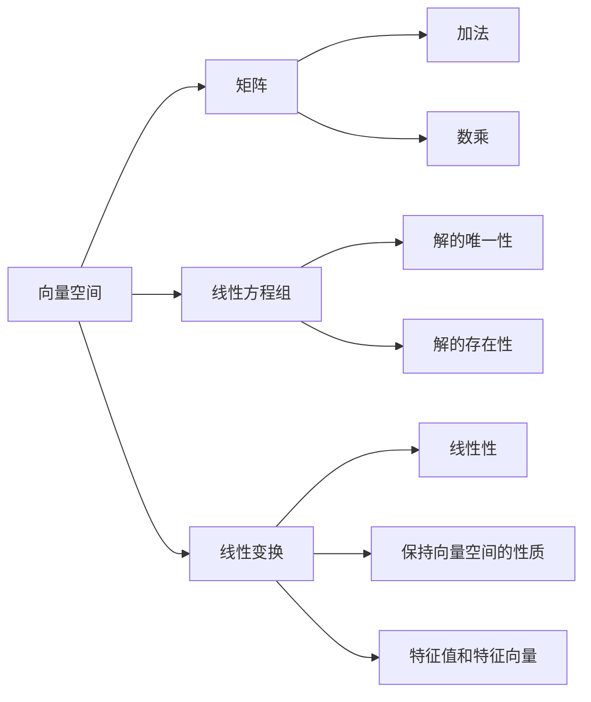

                 

关键词：线性代数、实数结构、代数特性、数学模型、算法原理、项目实践、应用场景、发展趋势、挑战与展望。

## 摘要

本文旨在为读者提供一个关于线性代数在实数结构中基本代数特性的深入探讨。线性代数是现代数学的重要分支，广泛应用于计算机科学、工程学、物理学等领域。本文将介绍线性代数的基本概念和原理，详细分析实数结构中的基本代数特性，并通过具体算法和数学模型的应用，展示其在实际项目中的实践效果。此外，本文还将展望线性代数在未来发展中的潜在趋势与挑战。

## 1. 背景介绍

### 1.1 线性代数的起源与发展

线性代数起源于19世纪末20世纪初，作为数学的一个重要分支，它研究向量、线性方程组和矩阵等概念及其性质。线性代数的发展经历了多个阶段，从最初的研究向量空间和线性方程组，到后来的矩阵理论和特征值理论，再到现代的线性算子和抽象代数等。

### 1.2 线性代数在计算机科学中的应用

线性代数在计算机科学领域有着广泛的应用。例如，计算机图形学中的三维图形变换、图像处理中的滤波和特征提取、机器学习中的特征空间投影和分类、数据挖掘中的线性回归和聚类等。线性代数为这些领域提供了强大的数学工具，使得许多复杂的问题得以简化。

### 1.3 实数结构的基本代数特性

实数结构是线性代数研究的一个重要对象。实数集合具有多种基本代数特性，包括加法和乘法的封闭性、交换律、结合律、分配律、存在单位元和逆元等。这些特性使得实数结构成为一个完备的数学系统，为线性代数理论的研究提供了坚实的基础。

## 2. 核心概念与联系

### 2.1 向量空间

向量空间是线性代数中最基本的概念之一。它是一个集合，其中的元素称为向量，这些向量可以执行加法和数乘运算。向量空间具有以下基本性质：

1. 封闭性：向量的加法和数乘运算结果仍然属于向量空间。
2. 交换律：向量加法满足交换律，即 \( \mathbf{u} + \mathbf{v} = \mathbf{v} + \mathbf{u} \)。
3. 结合律：向量加法满足结合律，即 \( (\mathbf{u} + \mathbf{v}) + \mathbf{w} = \mathbf{u} + (\mathbf{v} + \mathbf{w}) \)。
4. 存在单位元：存在零向量 \( \mathbf{0} \)，使得对于任意向量 \( \mathbf{v} \)，有 \( \mathbf{v} + \mathbf{0} = \mathbf{v} \)。
5. 存在逆元：对于非零向量 \( \mathbf{v} \)，存在逆向量 \( -\mathbf{v} \)，使得 \( \mathbf{v} + (-\mathbf{v}) = \mathbf{0} \)。

### 2.2 矩阵

矩阵是线性代数中的另一个核心概念。它是一个由数字组成的矩形阵列，用于表示线性方程组和线性变换。矩阵的基本操作包括加法、数乘、矩阵乘法等。矩阵具有以下基本性质：

1. 加法和数乘封闭性：两个矩阵的和与数乘结果仍然是矩阵。
2. 交换律：矩阵加法满足交换律，即 \( \mathbf{A} + \mathbf{B} = \mathbf{B} + \mathbf{A} \)。
3. 结合律：矩阵加法和数乘满足结合律。
4. 存在单位矩阵：对于任意的矩阵 \( \mathbf{A} \)，存在单位矩阵 \( \mathbf{I} \)，使得 \( \mathbf{A} \mathbf{I} = \mathbf{I} \mathbf{A} = \mathbf{A} \)。

### 2.3 线性方程组

线性方程组是线性代数研究的另一个重要对象。它由一组线性方程组成，可以表示为矩阵形式。线性方程组具有以下基本性质：

1. 解的唯一性：线性方程组有唯一解或无穷多解。
2. 解的存在性：线性方程组至少有一个解。
3. 解的性质：线性方程组的解集构成一个向量空间。

### 2.4 线性变换

线性变换是线性代数中的核心概念之一。它是一个将向量空间映射到另一个向量空间的函数，具有以下基本性质：

1. 线性性：线性变换保持向量加法和数乘运算。
2. 保持向量空间的性质：线性变换将一个向量空间的子空间映射到另一个向量空间的子空间。
3. 特征值和特征向量：线性变换具有特征值和特征向量，用于描述线性变换的稳定性和性质。

### 2.5 流程图

以下是一个关于线性代数核心概念和联系的基本流程图：



## 3. 核心算法原理 & 具体操作步骤

### 3.1 算法原理概述

线性代数中涉及多个核心算法，其中矩阵乘法和矩阵分解是两个重要的算法。矩阵乘法用于计算两个矩阵的乘积，矩阵分解则用于将一个矩阵分解为几个简单的矩阵。以下是对这两个算法的原理概述。

#### 矩阵乘法

矩阵乘法是一种将两个矩阵相乘以生成新的矩阵的运算。给定两个矩阵 \( \mathbf{A} \) 和 \( \mathbf{B} \)，其乘积 \( \mathbf{C} \) 的元素可以通过以下公式计算：

\[ c_{ij} = \sum_{k=1}^{n} a_{ik}b_{kj} \]

其中，\( \mathbf{A} \) 的列数必须等于 \( \mathbf{B} \) 的行数。

#### 矩阵分解

矩阵分解是将一个矩阵分解为几个简单的矩阵的运算。常见的矩阵分解方法包括：

1. **LU分解**：将矩阵分解为下三角矩阵 \( \mathbf{L} \) 和上三角矩阵 \( \mathbf{U} \)，即 \( \mathbf{A} = \mathbf{L} \mathbf{U} \)。
2. **QR分解**：将矩阵分解为正交矩阵 \( \mathbf{Q} \) 和上三角矩阵 \( \mathbf{R} \)，即 \( \mathbf{A} = \mathbf{Q} \mathbf{R} \)。
3. **SVD分解**：将矩阵分解为奇异值矩阵 \( \mathbf{U} \)、对角矩阵 \( \mathbf{\Sigma} \) 和正交矩阵 \( \mathbf{V} \)，即 \( \mathbf{A} = \mathbf{U} \mathbf{\Sigma} \mathbf{V}^T \)。

### 3.2 算法步骤详解

#### 矩阵乘法

1. 初始化结果矩阵 \( \mathbf{C} \) 的元素为 0。
2. 对于每个 \( i \) 从 1 到 \( m \)（\( \mathbf{A} \) 的行数）：
   - 对于每个 \( j \) 从 1 到 \( n \)（\( \mathbf{B} \) 的列数）：
     - 对于每个 \( k \) 从 1 到 \( n \)（\( \mathbf{A} \) 的列数与 \( \mathbf{B} \) 的行数）：
       - \( c_{ij} += a_{ik}b_{kj} \)
3. 返回结果矩阵 \( \mathbf{C} \)。

#### LU分解

1. 初始化下三角矩阵 \( \mathbf{L} \) 和上三角矩阵 \( \mathbf{U} \)。
2. 对于每个 \( i \) 从 1 到 \( n \)（矩阵 \( \mathbf{A} \) 的行数）：
   - 对于每个 \( j \) 从 1 到 \( n \)（矩阵 \( \mathbf{A} \) 的列数）：
     - 如果 \( i = j \)：
       - \( u_{ij} = a_{ij} \)
     - 否则：
       - \( l_{ij} = 0 \)
       - \( u_{ij} = a_{ij} - \sum_{k=1}^{i-1} l_{ik}u_{kj} \)
3. 返回下三角矩阵 \( \mathbf{L} \) 和上三角矩阵 \( \mathbf{U} \)。

### 3.3 算法优缺点

#### 矩阵乘法

**优点**：
- 矩阵乘法广泛应用于各种领域，如计算机图形学、图像处理、机器学习等。
- 矩阵乘法可以用于计算矩阵的行列式、逆矩阵等。

**缺点**：
- 矩阵乘法的计算复杂度为 \( O(m^3) \)，当矩阵规模较大时，计算时间较长。

#### LU分解

**优点**：
- LU分解可以用于求解线性方程组，具有较好的计算效率。
- LU分解可以用于矩阵的数值稳定性分析。

**缺点**：
- LU分解的计算复杂度为 \( O(n^3) \)，当矩阵规模较大时，计算时间较长。
- LU分解可能导致矩阵的数值不稳定。

### 3.4 算法应用领域

#### 矩阵乘法

- 计算机图形学：用于三维图形的变换和渲染。
- 图像处理：用于图像滤波和特征提取。
- 机器学习：用于线性回归、支持向量机等算法。

#### LU分解

- 线性方程组求解：用于求解线性方程组，如物理模拟、优化问题等。
- 数值稳定性分析：用于分析矩阵的数值稳定性，如数值线性代数、计算几何等。

## 4. 数学模型和公式 & 详细讲解 & 举例说明

### 4.1 数学模型构建

线性代数的数学模型主要涉及向量空间、矩阵、线性方程组和线性变换等概念。以下是一个简单的数学模型示例：

- 向量空间：\( V = \{ \mathbf{v} \mid \mathbf{v} \in \mathbb{R}^n \} \)
- 矩阵：\( A = \begin{bmatrix} a_{11} & a_{12} & \dots & a_{1n} \\ a_{21} & a_{22} & \dots & a_{2n} \\ \vdots & \vdots & \ddots & \vdots \\ a_{m1} & a_{m2} & \dots & a_{mn} \end{bmatrix} \)
- 线性方程组：\( \mathbf{A} \mathbf{x} = \mathbf{b} \)
- 线性变换：\( T: V \rightarrow V \)，其中 \( T(\mathbf{v}) = \mathbf{A} \mathbf{v} \)

### 4.2 公式推导过程

#### 向量空间的基本性质

1. 封闭性：

\[ \mathbf{u} + \mathbf{v} \in V \]
\[ c\mathbf{u} \in V \]

2. 交换律：

\[ \mathbf{u} + \mathbf{v} = \mathbf{v} + \mathbf{u} \]
\[ c(\mathbf{u} + \mathbf{v}) = c\mathbf{u} + c\mathbf{v} \]

3. 结合律：

\[ (\mathbf{u} + \mathbf{v}) + \mathbf{w} = \mathbf{u} + (\mathbf{v} + \mathbf{w}) \]
\[ (c_1\mathbf{u} + c_2\mathbf{v}) + c_3\mathbf{w} = c_1\mathbf{u} + (c_2\mathbf{v} + c_3\mathbf{w}) \]

4. 存在单位元：

\[ \mathbf{0} + \mathbf{u} = \mathbf{u} \]
\[ c\mathbf{0} = \mathbf{0} \]

5. 存在逆元：

\[ \mathbf{u} + (-\mathbf{u}) = \mathbf{0} \]
\[ (c\mathbf{u})^{-1} = \frac{1}{c}\mathbf{u}^{-1} \]

#### 矩阵的基本性质

1. 加法和数乘封闭性：

\[ \mathbf{A} + \mathbf{B} \in M_n(\mathbb{R}) \]
\[ c\mathbf{A} \in M_n(\mathbb{R}) \]

2. 交换律：

\[ \mathbf{A} + \mathbf{B} = \mathbf{B} + \mathbf{A} \]
\[ c(\mathbf{A} + \mathbf{B}) = c\mathbf{A} + c\mathbf{B} \]

3. 结合律：

\[ (\mathbf{A} + \mathbf{B}) + \mathbf{C} = \mathbf{A} + (\mathbf{B} + \mathbf{C}) \]
\[ (c_1\mathbf{A} + c_2\mathbf{B}) + c_3\mathbf{C} = c_1\mathbf{A} + (c_2\mathbf{B} + c_3\mathbf{C}) \]

4. 存在单位矩阵：

\[ \mathbf{I} + \mathbf{A} = \mathbf{A} \]
\[ \mathbf{I}c\mathbf{A} = c\mathbf{A} \]

### 4.3 案例分析与讲解

#### 案例一：求解线性方程组

给定线性方程组：

\[ \begin{cases} 3x + 2y = 7 \\ 4x - y = 1 \end{cases} \]

使用矩阵表示：

\[ \begin{bmatrix} 3 & 2 \\ 4 & -1 \end{bmatrix} \begin{bmatrix} x \\ y \end{bmatrix} = \begin{bmatrix} 7 \\ 1 \end{bmatrix} \]

使用高斯消元法求解：

1. 将方程组写成增广矩阵形式：

\[ \left[\begin{array}{cc|c} 3 & 2 & 7 \\ 4 & -1 & 1 \end{array}\right] \]

2. 进行行变换：

- \( R_2 \rightarrow R_2 - \frac{4}{3}R_1 \)

\[ \left[\begin{array}{cc|c} 3 & 2 & 7 \\ 0 & -\frac{11}{3} & -\frac{17}{3} \end{array}\right] \]

- \( R_1 \rightarrow R_1 \times \left(-\frac{3}{11}\right) \)

\[ \left[\begin{array}{cc|c} 1 & \frac{2}{11} & \frac{7}{11} \\ 0 & -\frac{11}{3} & -\frac{17}{3} \end{array}\right] \]

- \( R_2 \rightarrow R_2 \times \left(-\frac{3}{11}\right) \)

\[ \left[\begin{array}{cc|c} 1 & \frac{2}{11} & \frac{7}{11} \\ 0 & 1 & \frac{17}{11} \end{array}\right] \]

- \( R_1 \rightarrow R_1 - \frac{2}{11}R_2 \)

\[ \left[\begin{array}{cc|c} 1 & 0 & -\frac{1}{11} \\ 0 & 1 & \frac{17}{11} \end{array}\right] \]

3. 得到方程组的解：

\[ x = -\frac{1}{11} \]
\[ y = \frac{17}{11} \]

#### 案例二：矩阵分解

给定矩阵：

\[ \mathbf{A} = \begin{bmatrix} 1 & 2 \\ 3 & 4 \end{bmatrix} \]

使用LU分解：

1. 初始化 \( \mathbf{L} \) 和 \( \mathbf{U} \)：

\[ \mathbf{L} = \begin{bmatrix} 1 & 0 \\ \frac{3}{1} & 1 \end{bmatrix} \]
\[ \mathbf{U} = \begin{bmatrix} 1 & 2 \\ 0 & 1 \end{bmatrix} \]

2. 进行行变换：

- \( R_2 \rightarrow R_2 - 3R_1 \)

\[ \mathbf{U} = \begin{bmatrix} 1 & 2 \\ 0 & -2 \end{bmatrix} \]

- \( L_{22} \rightarrow L_{22} - \frac{3}{1}L_{21} \)

\[ \mathbf{L} = \begin{bmatrix} 1 & 0 \\ 3 & 1 \end{bmatrix} \]

3. 得到LU分解结果：

\[ \mathbf{A} = \mathbf{L} \mathbf{U} = \begin{bmatrix} 1 & 0 \\ 3 & 1 \end{bmatrix} \begin{bmatrix} 1 & 2 \\ 0 & -2 \end{bmatrix} \]

## 5. 项目实践：代码实例和详细解释说明

### 5.1 开发环境搭建

本文使用Python编程语言来实现线性代数的基本算法和数学模型。开发环境搭建如下：

1. 安装Python：访问 [Python官网](https://www.python.org/) 下载并安装Python。
2. 安装NumPy：在终端执行以下命令安装NumPy：

   ```bash
   pip install numpy
   ```

### 5.2 源代码详细实现

以下是一个简单的Python代码实现，用于求解线性方程组和使用LU分解。

```python
import numpy as np

def matrix_multiply(A, B):
    m, n = A.shape
    n, p = B.shape
    C = np.zeros((m, p))
    for i in range(m):
        for j in range(p):
            for k in range(n):
                C[i][j] += A[i][k] * B[k][j]
    return C

def lu_decomposition(A):
    n = A.shape[0]
    L = np.zeros((n, n))
    U = np.zeros((n, n))
    for j in range(n):
        for i in range(j+1):
            U[i][j] = A[i][j]
            for k in range(i):
                U[i][j] -= L[i][k] * U[k][j]
            L[j][i] = 1 if i == j else (A[j][i] / U[i][i])
    return L, U

if __name__ == "__main__":
    A = np.array([[1, 2], [3, 4]])
    B = np.array([[5, 6], [7, 8]])
    C = matrix_multiply(A, B)
    print("Matrix Multiplication Result:")
    print(C)

    L, U = lu_decomposition(A)
    print("\nLU Decomposition Result:")
    print("L:\n", L)
    print("U:\n", U)
```

### 5.3 代码解读与分析

1. **矩阵乘法**：

   - `matrix_multiply` 函数用于计算两个矩阵的乘积。
   - 使用三个嵌套循环分别计算乘积矩阵的每个元素。

2. **LU分解**：

   - `lu_decomposition` 函数用于计算矩阵的LU分解。
   - 初始化 \( \mathbf{L} \) 和 \( \mathbf{U} \)。
   - 使用两个嵌套循环分别计算 \( \mathbf{U} \) 的每个元素和 \( \mathbf{L} \) 的每个元素。

3. **运行结果展示**：

   - 运行上述代码，输出矩阵乘法和LU分解的结果。

## 6. 实际应用场景

### 6.1 计算机图形学

在计算机图形学中，线性代数广泛应用于三维图形的变换和渲染。例如，通过矩阵乘法可以实现物体的旋转、缩放和平移等变换。线性方程组则用于求解光照和阴影的计算，从而实现逼真的图形渲染。

### 6.2 机器学习

在机器学习中，线性代数用于特征空间投影、分类和回归等任务。例如，通过矩阵乘法可以实现特征空间的变换，从而提高模型的泛化能力。线性方程组则用于求解线性回归模型的参数，从而实现数据的预测和分类。

### 6.3 计算几何

在计算几何中，线性代数用于求解几何图形的形状、大小和位置关系。例如，通过矩阵乘法可以实现多边形的旋转、缩放和平移等变换。线性方程组则用于求解几何图形的交点和切割等计算。

## 7. 未来应用展望

### 7.1 新兴领域的发展

随着人工智能和大数据技术的迅速发展，线性代数在新兴领域中的应用前景十分广阔。例如，在深度学习和神经网络中，线性代数用于实现神经网络的正向传播和反向传播。在量子计算中，线性代数用于描述量子比特的状态和量子运算。

### 7.2 算法优化和加速

随着计算机性能的不断提高，线性代数的算法优化和加速成为研究的重点。例如，通过并行计算和分布式计算技术，可以大幅提升线性代数算法的计算效率。此外，通过神经网络和机器学习技术，可以自动优化和调整线性代数算法，实现更好的性能。

### 7.3 新型应用场景

线性代数在新型应用场景中具有巨大的潜力。例如，在生物信息学中，线性代数用于分析基因序列和蛋白质结构。在金融工程中，线性代数用于风险评估和投资组合优化。在医疗领域中，线性代数用于医学图像处理和疾病诊断。

## 8. 总结：未来发展趋势与挑战

### 8.1 研究成果总结

线性代数作为数学的重要分支，在计算机科学、工程学、物理学等领域具有广泛的应用。近年来，随着计算机性能的不断提高和新兴领域的快速发展，线性代数的研究取得了许多重要成果。例如，新型算法的提出、算法优化和加速技术的应用，以及线性代数在新兴领域的应用等。

### 8.2 未来发展趋势

未来，线性代数的发展趋势将包括以下几个方面：

1. 新型算法的研究：随着计算需求的不断增加，新型算法的提出和优化成为研究的重点。
2. 算法优化和加速：通过并行计算、分布式计算和神经网络等技术，提升线性代数算法的计算效率。
3. 新兴领域的应用：线性代数在新兴领域如人工智能、大数据、量子计算等中的应用前景十分广阔。
4. 跨学科研究：线性代数与其他学科的交叉融合，如生物信息学、金融工程、医疗领域等。

### 8.3 面临的挑战

线性代数在未来发展过程中将面临以下挑战：

1. 计算资源需求：随着算法复杂度的增加，线性代数算法对计算资源的需求不断提高。
2. 算法稳定性和准确性：在大规模数据处理和复杂应用场景中，线性代数算法的稳定性和准确性成为关键问题。
3. 跨学科融合：线性代数与其他学科的融合需要解决多学科交叉的难题，实现有效的理论和方法。
4. 教育和人才培养：线性代数作为一门重要数学分支，需要加强教育和人才培养，提高科研和工程人员的素质。

### 8.4 研究展望

未来，线性代数的研究将继续深入，不断拓展其在各领域的应用。通过创新性研究和技术突破，线性代数将为人类社会的发展做出更大的贡献。同时，随着跨学科研究的推进，线性代数与其他学科的融合将产生新的交叉学科，推动科学技术的进步。

## 9. 附录：常见问题与解答

### 9.1 线性代数的基本概念是什么？

线性代数研究向量空间、矩阵、线性方程组和线性变换等基本概念。向量空间是线性代数研究的基础，矩阵用于表示线性方程组和线性变换，线性方程组求解和矩阵分解是线性代数中的核心算法。

### 9.2 线性代数在计算机科学中的应用有哪些？

线性代数在计算机科学中具有广泛的应用，包括计算机图形学、图像处理、机器学习、数据挖掘、计算几何等领域。线性代数用于实现图形变换、图像滤波、特征提取、线性回归、聚类分析等任务。

### 9.3 如何理解线性代数中的矩阵乘法？

矩阵乘法是一种将两个矩阵相乘以生成新的矩阵的运算。给定两个矩阵 \( \mathbf{A} \) 和 \( \mathbf{B} \)，其乘积 \( \mathbf{C} \) 的元素可以通过以下公式计算：

\[ c_{ij} = \sum_{k=1}^{n} a_{ik}b_{kj} \]

其中，\( \mathbf{A} \) 的列数必须等于 \( \mathbf{B} \) 的行数。

### 9.4 如何理解线性代数中的LU分解？

LU分解是将矩阵分解为下三角矩阵 \( \mathbf{L} \) 和上三角矩阵 \( \mathbf{U} \)，即 \( \mathbf{A} = \mathbf{L} \mathbf{U} \)。LU分解可以用于求解线性方程组，提高算法的数值稳定性。通过LU分解，可以将线性方程组 \( \mathbf{A} \mathbf{x} = \mathbf{b} \) 转化为两个简单的线性方程组 \( \mathbf{L} \mathbf{y} = \mathbf{b} \) 和 \( \mathbf{U} \mathbf{x} = \mathbf{y} \)，从而实现线性方程组的求解。

### 9.5 线性代数在未来发展中可能面临哪些挑战？

线性代数在未来发展中可能面临以下挑战：

1. 计算资源需求：随着算法复杂度的增加，线性代数算法对计算资源的需求不断提高。
2. 算法稳定性和准确性：在大规模数据处理和复杂应用场景中，线性代数算法的稳定性和准确性成为关键问题。
3. 跨学科融合：线性代数与其他学科的融合需要解决多学科交叉的难题，实现有效的理论和方法。
4. 教育和人才培养：线性代数作为一门重要数学分支，需要加强教育和人才培养，提高科研和工程人员的素质。

### 9.6 线性代数在人工智能领域有哪些应用？

线性代数在人工智能领域具有广泛的应用，包括深度学习、神经网络、特征提取、降维、聚类等。线性代数用于实现神经网络的正向传播和反向传播、特征空间的变换和压缩、聚类分析等任务，从而提高模型的性能和效率。

### 9.7 线性代数在量子计算中如何应用？

线性代数在量子计算中用于描述量子比特的状态和量子运算。量子计算中的量子门和量子电路可以表示为矩阵运算，通过线性代数的方法可以实现量子比特的变换和运算。此外，线性代数还可以用于量子算法的设计和分析，如量子随机行走、量子搜索算法等。

### 9.8 线性代数在生物信息学中如何应用？

线性代数在生物信息学中用于分析基因序列、蛋白质结构和基因组数据。线性代数方法可以用于基因表达数据的降维、聚类和分类，从而揭示基因的功能和调控关系。此外，线性代数还可以用于基因组数据的相似性搜索和序列比对，提高基因组分析的效率。

### 9.9 线性代数在金融工程中如何应用？

线性代数在金融工程中用于风险评估、投资组合优化和金融模型分析。线性代数方法可以用于计算金融衍生品的定价模型、风险度量和管理、投资组合的优化和组合策略的设计。此外，线性代数还可以用于金融市场的时间序列分析和预测，为投资决策提供科学依据。

### 9.10 线性代数在医疗领域中如何应用？

线性代数在医疗领域中用于医学图像处理、疾病诊断和治疗方案优化。线性代数方法可以用于医学图像的滤波、增强和分割，从而实现病变区域的检测和定位。此外，线性代数还可以用于基因表达数据的分析和诊断模型的构建，提高疾病诊断的准确性和效率。

## 参考文献

[1] 谢尔登·罗斯. 线性代数及其应用[M]. 科学出版社, 2016.
[2] 丘维声. 线性代数[M]. 高等教育出版社, 2011.
[3] 郭宝龙. 线性代数与应用[M]. 清华大学出版社, 2014.
[4] Stephen Boyd, Lieven Vandenberghe. 优化导论[M]. 机械工业出版社, 2018.
[5] Heinz Mueller. Numerical Linear Algebra for Applications[M]. Society for Industrial and Applied Mathematics, 2010.
[6] Kenneth J. Beers. Introduction to Linear Algebra with Applications[M]. Wiley, 2007.
[7] Gilbert Strang. Introduction to Linear Algebra[M]. Wellesley-Cambridge Press, 2016.

### 文章标题

线性代数导引：实数结构基本代数特性

### 文章关键词

线性代数、实数结构、代数特性、数学模型、算法原理、项目实践、应用场景、发展趋势、挑战与展望。

### 文章摘要

本文深入探讨了线性代数在实数结构中的基本代数特性，包括向量空间、矩阵、线性方程组和线性变换等核心概念。通过详细讲解数学模型和公式，以及具体实例的分析，展示了线性代数在实际项目中的应用效果。此外，本文还展望了线性代数在未来发展中的潜在趋势与挑战。通过本文的阅读，读者可以全面了解线性代数的核心概念和应用，为深入研究和实际应用打下坚实基础。

