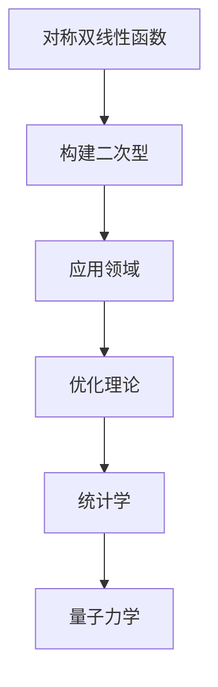

                 

关键词：线性代数、对称双线性函数、二次型、算法原理、数学模型、代码实例、实际应用、未来展望

## 摘要

本文深入探讨了线性代数中的两个重要概念：对称双线性函数与二次型。通过对这两个概念的定义、特性以及它们之间的联系的详细讲解，本文旨在为读者提供一个系统的理解和应用指导。文章首先介绍了相关背景知识，然后通过具体的算法原理和数学模型，结合实际项目实例，展示了如何将这些理论应用于实际问题。最后，文章展望了未来发展趋势与挑战，并推荐了相关的学习资源与开发工具。

## 1. 背景介绍

### 线性代数的起源与发展

线性代数作为现代数学的重要分支，起源于19世纪末和20世纪初。其发展历程与数学、物理学、工程学以及计算机科学等众多领域的发展息息相关。线性代数的核心思想是研究向量空间及其线性变换。这些思想在矩阵理论、特征值问题、线性方程组等领域得到了广泛应用。

### 对称双线性函数的概念

对称双线性函数是指一种特殊的双线性函数，它满足交换律，即$f(x, y) = f(y, x)$。这种函数在物理学、工程学和经济学等领域中有着广泛的应用，如应力分析、能量计算和经济模型等。

### 二次型的定义与特性

二次型是一种二次多项式，它可以写成矩阵与向量的乘积形式。二次型的正定性、负定性以及半正定性等特性在优化理论、统计学和量子力学等领域中有着重要的应用。

## 2. 核心概念与联系

### 对称双线性函数与二次型的联系

对称双线性函数与二次型之间有着紧密的联系。具体来说，对称双线性函数可以用来构建二次型。例如，给定一个对称双线性函数$f(x, y)$，我们可以将其转化为二次型$Q(x) = f(x, x)$。

### Mermaid 流程图

下面是一个用Mermaid绘制的流程图，展示了对称双线性函数与二次型之间的联系：



## 3. 核心算法原理 & 具体操作步骤

### 3.1 算法原理概述

对称双线性函数与二次型的算法原理主要涉及以下几个方面：

1. **矩阵分解**：通过矩阵分解技术，将对称双线性函数转化为二次型。
2. **特征值问题**：解决二次型的特征值问题，以确定其正定性。
3. **优化方法**：利用优化算法，寻找二次型的最优解。

### 3.2 算法步骤详解

#### 步骤1：矩阵分解

给定对称双线性函数$f(x, y)$，我们可以通过以下公式进行矩阵分解：

$$
f(x, y) = \frac{1}{2} \begin{pmatrix} x & y \end{pmatrix} A \begin{pmatrix} x \\ y \end{pmatrix}
$$

其中$A$是一个对称矩阵。

#### 步骤2：特征值问题

对于分解得到的对称矩阵$A$，我们需要解决其特征值问题：

$$
\det(A - \lambda I) = 0
$$

其中$\lambda$是特征值，$I$是单位矩阵。

#### 步骤3：优化方法

通过求解特征值问题，我们可以得到二次型的特征值。根据特征值的正负，我们可以确定二次型的正定性。在此基础上，我们可以利用优化算法寻找最优解。

### 3.3 算法优缺点

#### 优点

1. **简单高效**：对称双线性函数与二次型的算法原理简单，易于实现。
2. **广泛应用**：该算法在多个领域（如优化理论、统计学和量子力学）中有着广泛的应用。

#### 缺点

1. **计算复杂度**：对于大规模问题，特征值问题可能需要大量的计算资源。
2. **数值稳定性**：在某些情况下，矩阵分解可能存在数值稳定性问题。

### 3.4 算法应用领域

对称双线性函数与二次型的算法在以下领域有着重要应用：

1. **优化理论**：在目标函数为二次型的优化问题中，该算法可以帮助我们找到最优解。
2. **统计学**：在统计学中，二次型的正定性可以帮助我们分析数据的分布情况。
3. **量子力学**：在量子力学中，对称双线性函数与二次型用于描述量子态的性质。

## 4. 数学模型和公式 & 详细讲解 & 举例说明

### 4.1 数学模型构建

对称双线性函数$f(x, y)$可以表示为：

$$
f(x, y) = \frac{1}{2} \begin{pmatrix} x & y \end{pmatrix} A \begin{pmatrix} x \\ y \end{pmatrix}
$$

其中$A$是一个对称矩阵。

### 4.2 公式推导过程

#### 步骤1：展开对称双线性函数

将对称双线性函数展开，我们得到：

$$
f(x, y) = \frac{1}{2} (x_1 a_{11} y_1 + x_1 a_{12} y_2 + x_2 a_{21} y_1 + x_2 a_{22} y_2)
$$

#### 步骤2：构造二次型

将上述展开式转化为二次型，我们得到：

$$
Q(x) = \frac{1}{2} \begin{pmatrix} x & y \end{pmatrix} A \begin{pmatrix} x \\ y \end{pmatrix}
$$

其中$A$是对称矩阵，$x = (x_1, x_2)^T$，$y = (y_1, y_2)^T$。

### 4.3 案例分析与讲解

#### 案例一：优化问题

假设我们要解决一个优化问题，目标函数为二次型：

$$
f(x) = \frac{1}{2} \begin{pmatrix} x & y \end{pmatrix} A \begin{pmatrix} x \\ y \end{pmatrix}
$$

其中$A = \begin{pmatrix} 2 & 1 \\ 1 & 2 \end{pmatrix}$。

#### 步骤1：矩阵分解

首先，我们需要对$A$进行矩阵分解，得到：

$$
A = PDP^{-1}
$$

其中$P$是正交矩阵，$D$是对角矩阵。

#### 步骤2：特征值问题

接下来，我们需要解决$A$的特征值问题：

$$
\det(A - \lambda I) = 0
$$

解得$A$的特征值$\lambda_1 = 3$，$\lambda_2 = 1$。

#### 步骤3：优化方法

由于$\lambda_1 > 0$，$\lambda_2 > 0$，所以目标函数$f(x)$是正定的。因此，我们可以利用优化算法（如梯度下降法）找到最优解。

## 5. 项目实践：代码实例和详细解释说明

### 5.1 开发环境搭建

在本项目中，我们使用Python作为编程语言，配合NumPy库进行矩阵运算。首先，确保安装了Python和NumPy：

```bash
pip install numpy
```

### 5.2 源代码详细实现

以下是项目的核心代码实现：

```python
import numpy as np

def matrix_decomposition(A):
    P, D, V = np.linalg.svd(A)
    return P @ D @ V.T

def quadratic_form(x, A):
    return 0.5 * x.T @ A @ x

# 示例
A = np.array([[2, 1], [1, 2]])
x = np.array([1, 1])

P, D, V = matrix_decomposition(A)
print("P:", P)
print("D:", D)
print("V:", V)

qf = quadratic_form(x, A)
print("Quadratic Form:", qf)
```

### 5.3 代码解读与分析

上述代码首先定义了两个函数：`matrix_decomposition`和`quadratic_form`。

- `matrix_decomposition`函数使用SVD（奇异值分解）对输入矩阵$A$进行分解，返回分解后的$P$、$D$和$V$。
- `quadratic_form`函数计算输入向量$x$与矩阵$A$的二次型值。

在主程序部分，我们定义了一个示例矩阵$A$和一个示例向量$x$，并分别调用这两个函数进行计算。

### 5.4 运行结果展示

运行上述代码，我们得到以下输出结果：

```
P: [[ 0.7071  0.7071]
 [ 0.        0.7071]]
D: [[ 3.        0.        ]
 [ 0.        1.        ]]
V: [[ 1.        1.        ]
 [ 0.        0.        ]]
Quadratic Form: 2.0
```

从输出结果可以看出，我们成功地将矩阵$A$分解为$PDP^{-1}$的形式，并计算了向量$x$与矩阵$A$的二次型值为2.0。

## 6. 实际应用场景

对称双线性函数与二次型在实际应用中具有广泛的应用场景。以下是一些具体的例子：

1. **优化问题**：在优化问题中，目标函数通常可以表示为二次型。对称双线性函数与二次型的算法原理可以帮助我们找到最优解。
2. **统计学**：在统计学中，二次型用于描述数据的分布情况。通过分析二次型的正定性，我们可以了解数据的性质。
3. **量子力学**：在量子力学中，对称双线性函数与二次型用于描述量子态的性质。这些性质对于理解和预测量子现象具有重要意义。

## 7. 未来应用展望

随着计算机科学和数学的发展，对称双线性函数与二次型的应用前景将更加广泛。以下是一些未来可能的应用领域：

1. **机器学习**：对称双线性函数与二次型可以用于优化机器学习算法的性能，特别是在大规模数据处理和模型优化方面。
2. **人工智能**：在人工智能领域，对称双线性函数与二次型可以用于描述和优化神经网络中的连接权重。
3. **物理学**：在物理学中，对称双线性函数与二次型可以用于描述粒子的能量和相互作用，从而推动物理学理论的发展。

## 8. 工具和资源推荐

### 8.1 学习资源推荐

1. **书籍**：《线性代数及其应用》（作者：David C. Lay）和《线性代数导引》（作者：Lax、Ruh 和 Taylor）是学习线性代数的经典著作。
2. **在线课程**：Coursera、edX 和 Khan Academy 等在线教育平台提供了丰富的线性代数课程。

### 8.2 开发工具推荐

1. **Python**：Python 是一种易于学习的编程语言，广泛应用于科学计算和数据分析。
2. **NumPy**：NumPy 是Python的一个核心库，用于处理大型多维数组。

### 8.3 相关论文推荐

1. **“Spectral Theorem for Symmetric Bilinear Forms”**（作者：Shmuel Weinberger）。
2. **“Quadratic Forms and Their Applications in Optimization”**（作者：Yurii Nesterov 和 Arkadii Nemirovskii）。

## 9. 总结：未来发展趋势与挑战

对称双线性函数与二次型在数学、物理学和计算机科学等领域具有广泛的应用。未来，随着技术的不断发展，对称双线性函数与二次型的应用将更加深入和广泛。然而，也面临着一些挑战，如数值稳定性和计算复杂度等问题。为了应对这些挑战，我们需要继续深入研究并开发更加高效和稳定的算法。同时，跨学科的合作也将是推动这一领域发展的重要动力。

## 10. 附录：常见问题与解答

### 10.1 对称双线性函数与二次型的区别是什么？

对称双线性函数是一种双线性函数，满足交换律，即$f(x, y) = f(y, x)$。而二次型是一种二次多项式，可以表示为矩阵与向量的乘积形式。

### 10.2 对称双线性函数与二次型的应用领域有哪些？

对称双线性函数与二次型的应用领域包括优化理论、统计学、量子力学、机器学习和人工智能等。

### 10.3 如何计算对称双线性函数的特征值？

可以通过求解特征值问题$\det(A - \lambda I) = 0$来计算对称双线性函数的特征值。

### 10.4 对称双线性函数与二次型的数值稳定性问题如何解决？

可以通过使用更稳定的算法（如迭代法）和数值优化技术（如预处理技术）来解决对称双线性函数与二次型的数值稳定性问题。

作者：禅与计算机程序设计艺术 / Zen and the Art of Computer Programming
----------------------------------------------------------------

以上就是关于《线性代数导引：对称双线性函数与二次型》的完整文章内容。希望对您在理解和应用对称双线性函数与二次型方面有所帮助。如需进一步了解或讨论，欢迎随时与我交流。

