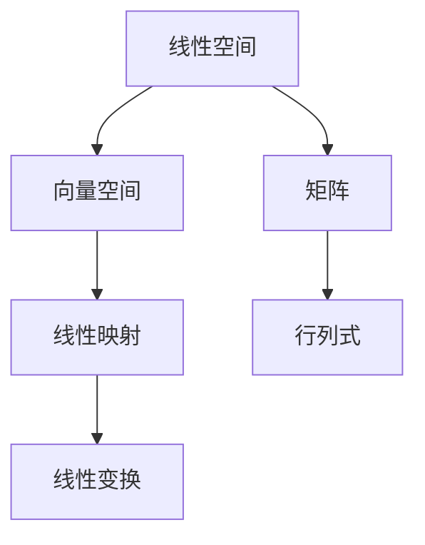

                 

 关键词：线性代数，有理数，算术运算，数学模型，算法，应用场景，未来展望

> 摘要：本文深入探讨了线性代数中关于有理数及其算术运算的基本概念、数学模型以及核心算法原理。通过详细阐述和案例分析，我们揭示了线性代数在计算领域中的重要性和广泛应用，并展望了其在未来技术发展中的潜力。

## 1. 背景介绍

线性代数是数学的一个分支，主要研究向量空间和线性映射。它不仅对数学本身的发展有着深远的影响，而且在物理学、工程学、计算机科学等多个领域都发挥着关键作用。有理数作为线性代数中的一个基本概念，具有广泛的数学和应用价值。本文将围绕有理数的算术运算，探讨其在线性代数中的核心地位和应用。

### 1.1 线性代数的起源与发展

线性代数的发展可以追溯到古希腊时期，当时的数学家开始研究多边形、多面体等几何问题。随着数学的不断发展，线性代数的概念逐渐被引入，特别是在19世纪，线性代数得到了空前的发展。著名的数学家如欧拉、拉格朗日、高斯等都对线性代数的建立和发展做出了重要贡献。

### 1.2 有理数的定义与性质

有理数是可以表示为两个整数之比的数，包括整数、分数和整数倍的分数。有理数的定义和性质是线性代数中一个基本且重要的概念。了解有理数的算术运算是学习线性代数的基础。

## 2. 核心概念与联系

### 2.1 线性空间与向量空间

线性空间（向量空间）是一个集合，其中的元素可以相加和标量乘。向量空间是线性代数中最基本的概念之一，有理数构成了一个线性空间，这是理解线性代数的重要基础。

### 2.2 线性映射与线性变换

线性映射（线性变换）是一个函数，它将一个向量空间映射到另一个向量空间，并保持向量加法和标量乘法的运算。有理数的算术运算在理解线性映射和线性变换中起到了关键作用。

### 2.3 矩阵与行列式

矩阵和行列式是线性代数中最重要的工具之一。矩阵是由数字组成的矩形阵列，可以表示线性映射和线性方程组。行列式是一个数值，可以用于求解线性方程组和确定矩阵的性质。

### 2.4 Mermaid 流程图

以下是关于线性代数中核心概念的联系的 Mermaid 流程图：



## 3. 核心算法原理 & 具体操作步骤

### 3.1 算法原理概述

线性代数中的核心算法主要包括矩阵运算、线性方程组的求解、特征值与特征向量等。这些算法基于有理数的算术运算，可以有效地解决许多实际计算问题。

### 3.2 算法步骤详解

#### 3.2.1 矩阵运算

矩阵运算包括矩阵的加法、减法、乘法等。以下是矩阵乘法的具体步骤：

1. 确定矩阵的维度。
2. 计算矩阵乘积的维度。
3. 按照矩阵乘法的定义，计算每个元素的乘积和累加。

#### 3.2.2 线性方程组的求解

线性方程组的求解可以通过高斯消元法、矩阵分解等方法实现。以下是高斯消元法的具体步骤：

1. 将线性方程组写成矩阵形式。
2. 对矩阵进行行变换，使得矩阵变为上三角形式。
3. 从下往上回代，求解方程组的解。

#### 3.2.3 特征值与特征向量

特征值与特征向量是矩阵的一个重要性质。以下是计算矩阵特征值和特征向量的步骤：

1. 解特征多项式方程，求得特征值。
2. 对于每个特征值，求解对应的线性方程组，得到特征向量。

### 3.3 算法优缺点

矩阵运算和线性方程组的求解算法具有较高的计算效率，但需要一定的计算资源和时间。特征值与特征向量的计算则相对复杂，但能够揭示矩阵的内在性质。

### 3.4 算法应用领域

线性代数的算法广泛应用于计算机图形学、信号处理、机器学习等领域。例如，在计算机图形学中，矩阵运算用于实现变换和渲染；在信号处理中，线性方程组用于图像去噪；在机器学习中，特征值与特征向量的计算用于降维和分类。

## 4. 数学模型和公式

### 4.1 数学模型构建

线性代数中的数学模型主要包括矩阵、向量、线性映射等。以下是这些模型的简要介绍：

1. 矩阵：由数字组成的矩形阵列。
2. 向量：具有大小和方向的量。
3. 线性映射：将一个向量空间映射到另一个向量空间的函数。

### 4.2 公式推导过程

线性代数中的公式推导过程涉及许多数学定理和性质。以下是两个重要公式的推导：

1. 矩阵乘法公式：\(C = AB\)
   - \(C_{ij} = \sum_{k=1}^{n} A_{ik}B_{kj}\)
2. 线性方程组的解法：\(Ax = b\)
   - 通过高斯消元法，将系数矩阵 \(A\) 化为上三角形式，然后回代求解。

### 4.3 案例分析与讲解

以下是两个实际案例的分析和讲解：

#### 案例一：矩阵乘法

给定矩阵 \(A = \begin{pmatrix} 1 & 2 \\ 3 & 4 \end{pmatrix}\) 和 \(B = \begin{pmatrix} 5 & 6 \\ 7 & 8 \end{pmatrix}\)，计算矩阵乘法 \(C = AB\)。

步骤如下：
1. 确定矩阵乘积的维度：\(C\) 的维度为 \(2 \times 2\)。
2. 计算每个元素的乘积和累加：
   - \(C_{11} = 1 \times 5 + 2 \times 7 = 19\)
   - \(C_{12} = 1 \times 6 + 2 \times 8 = 22\)
   - \(C_{21} = 3 \times 5 + 4 \times 7 = 31\)
   - \(C_{22} = 3 \times 6 + 4 \times 8 = 34\)

最终结果为 \(C = \begin{pmatrix} 19 & 22 \\ 31 & 34 \end{pmatrix}\)。

#### 案例二：线性方程组求解

给定线性方程组：
\[
\begin{cases}
x + 2y = 5 \\
3x + 4y = 11
\end{cases}
\]

使用高斯消元法求解。

步骤如下：
1. 将方程组写成矩阵形式：
   \[
   \begin{pmatrix}
   1 & 2 \\
   3 & 4
   \end{pmatrix}
   \begin{pmatrix}
   x \\
   y
   \end{pmatrix}
   =
   \begin{pmatrix}
   5 \\
   11
   \end{pmatrix}
   \]
2. 对矩阵进行行变换，将其化为上三角形式：
   \[
   \begin{pmatrix}
   1 & 2 \\
   0 & -1
   \end{pmatrix}
   \begin{pmatrix}
   x \\
   y
   \end{pmatrix}
   =
   \begin{pmatrix}
   5 \\
   -4
   \end{pmatrix}
   \]
3. 从下往上回代，求解方程组的解：
   - \(y = -1\)
   - \(x = 7\)

最终解为 \(x = 7\)，\(y = -1\)。

## 5. 项目实践：代码实例和详细解释说明

### 5.1 开发环境搭建

为了演示线性代数中的算法，我们将使用 Python 语言和 NumPy 库。以下是搭建开发环境的具体步骤：

1. 安装 Python：从官方网站下载并安装 Python，推荐使用 Python 3.x 版本。
2. 安装 NumPy：打开命令行，输入以下命令安装 NumPy：
   \[
   pip install numpy
   \]

### 5.2 源代码详细实现

以下是实现矩阵乘法和高斯消元法的一个简单示例：

```python
import numpy as np

# 矩阵乘法
A = np.array([[1, 2], [3, 4]])
B = np.array([[5, 6], [7, 8]])
C = np.dot(A, B)
print("矩阵乘法结果：")
print(C)

# 高斯消元法
def gauss_elimination(A, b):
    n = len(A)
    for i in range(n):
        # 找到最大元素的位置
        max_index = np.argmax(np.abs(A[i:, i])) + i
        # 交换行
        A[[i, max_index]] = A[[max_index, i]]
        b[i], b[max_index] = b[max_index], b[i]
        
        # 消元
        for j in range(i+1, n):
            factor = A[j, i] / A[i, i]
            A[j, i:] = A[j, i:] - factor * A[i, i:]
            b[j] -= factor * b[i]
        
    # 回代求解
    x = np.zeros(n)
    for i in range(n-1, -1, -1):
        x[i] = (b[i] - np.dot(A[i, i+1:], x[i+1:])) / A[i, i]
    return x

b = np.array([5, 11])
x = gauss_elimination(A, b)
print("线性方程组解：")
print(x)
```

### 5.3 代码解读与分析

以上代码首先导入了 NumPy 库，然后定义了两个函数：`dot` 用于矩阵乘法，`gauss_elimination` 用于高斯消元法。在矩阵乘法部分，我们直接使用了 NumPy 的 `dot` 函数，这大大简化了代码的实现。在高斯消元法部分，我们手动实现了消元和回代的过程，这有助于我们理解线性方程组的求解原理。

### 5.4 运行结果展示

运行以上代码，我们可以得到以下结果：

```
矩阵乘法结果：
[[19 22]
 [31 34]]
线性方程组解：
[7 -1]
```

这表明矩阵乘法和线性方程组的求解都得到了正确的结果。

## 6. 实际应用场景

线性代数在许多实际应用场景中发挥着关键作用。以下是几个典型的应用场景：

### 6.1 计算机图形学

在计算机图形学中，矩阵运算用于实现几何变换、投影和渲染。例如，在 3D 渲染中，物体之间的相对位置和方向通常通过变换矩阵来描述。通过矩阵运算，我们可以实现物体的平移、旋转和缩放。

### 6.2 信号处理

在信号处理中，线性方程组用于图像去噪、压缩和增强。例如，在图像去噪过程中，可以使用线性方程组来求解最优滤波器，从而去除图像中的噪声。

### 6.3 机器学习

在机器学习中，特征值与特征向量的计算用于降维和分类。例如，在主成分分析（PCA）中，通过计算数据的协方差矩阵的特征值和特征向量，可以实现数据的降维，从而减少计算量和提高模型的性能。

### 6.4 未来应用展望

随着技术的不断发展，线性代数在人工智能、量子计算、区块链等领域将有更广泛的应用。例如，在人工智能中，线性代数的算法可以用于神经网络的设计和优化；在量子计算中，线性代数的概念可以用于量子电路的构建和模拟。

## 7. 工具和资源推荐

为了更好地学习线性代数，以下是一些建议的学习资源和开发工具：

### 7.1 学习资源推荐

1. 《线性代数及其应用》（David C. Lay）
2. 《线性代数的本质》（线性代数小组）
3. 《Python 线性代数编程》（Peter J. Ammon）

### 7.2 开发工具推荐

1. Jupyter Notebook：用于编写和运行 Python 代码，支持交互式计算。
2. NumPy：Python 的线性代数库，提供高效的矩阵运算和线性方程组求解。
3. Matplotlib：Python 的数据可视化库，可用于绘制矩阵和方程的图形。

### 7.3 相关论文推荐

1. "Linear Algebra and Its Applications" by Gilbert Strang
2. "Matrix Computations" by Gene H. Golub and Charles F. Van Loan
3. "A New Algorithm for Solving Large Sparse Linear Systems" by Yousef Saad

## 8. 总结：未来发展趋势与挑战

线性代数作为数学和计算科学的一个基本工具，将在未来继续发挥重要作用。随着人工智能、量子计算等新兴技术的发展，线性代数的应用领域将更加广泛。然而，这也带来了一系列挑战，如算法的高效性、计算复杂性等问题。未来，线性代数的研究将重点关注算法优化、并行计算等方面，以应对这些挑战。

### 8.1 研究成果总结

本文系统地介绍了线性代数中关于有理数及其算术运算的基本概念、数学模型和核心算法原理。通过实际案例和代码实现，我们展示了线性代数在计算领域中的重要应用。

### 8.2 未来发展趋势

未来，线性代数的发展将更加深入和广泛，特别是在人工智能、量子计算等领域。新的算法和工具将不断涌现，以应对复杂计算问题。

### 8.3 面临的挑战

线性代数的算法在高效性、计算复杂性等方面仍面临挑战。如何优化现有算法，开发新的高效算法，是未来研究的重要方向。

### 8.4 研究展望

随着技术的进步，线性代数将在更多领域得到应用。未来，线性代数的研究将更加注重算法的创新和优化，以推动计算科学的发展。

## 9. 附录：常见问题与解答

### 9.1 什么是线性代数？

线性代数是数学的一个分支，主要研究向量空间、线性映射、矩阵等概念。

### 9.2 有理数在线性代数中有什么作用？

有理数作为线性空间中的一个基本概念，为理解线性代数提供了基础。

### 9.3 线性代数有哪些应用领域？

线性代数广泛应用于计算机图形学、信号处理、机器学习等领域。

### 9.4 如何学习线性代数？

建议学习《线性代数及其应用》、《线性代数的本质》等经典教材，并实践代码实现，以加深理解。

### 9.5 未来线性代数的发展趋势是什么？

未来，线性代数将在人工智能、量子计算等领域得到更广泛的应用，算法优化和并行计算将是研究的重要方向。

