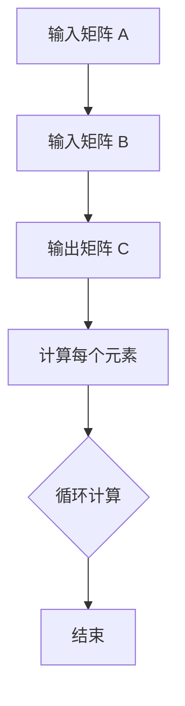

                 

关键词：线性代数、矩阵、乘法、算法、应用、数学模型

> 摘要：本文旨在深入探讨线性代数中矩阵乘法的基本概念、算法原理、数学模型及其实际应用。通过详细的讲解和案例分析，帮助读者更好地理解和应用矩阵乘法，以解决复杂的计算问题。

## 1. 背景介绍

矩阵乘法是线性代数中一个基本且重要的概念。它不仅在数学领域具有深远的影响，而且在计算机科学、物理学、经济学、工程学等多个领域中都有着广泛的应用。矩阵乘法的基本操作是将两个矩阵相乘，得到一个新的矩阵。这个过程不仅涉及到矩阵元素的计算，还涉及到矩阵之间的逻辑关系。

本文将首先介绍矩阵乘法的基本概念和原理，然后深入探讨其算法实现、数学模型构建和公式推导，最后通过实际项目案例展示矩阵乘法在具体场景中的应用。

## 2. 核心概念与联系

### 2.1 矩阵乘法的基本概念

矩阵乘法是指两个矩阵之间的一种运算，其结果是另一个矩阵。设矩阵 \(A\) 是一个 \(m \times n\) 的矩阵，矩阵 \(B\) 是一个 \(n \times p\) 的矩阵，那么矩阵乘法的结果是一个 \(m \times p\) 的矩阵 \(C\)。矩阵乘法的定义如下：

$$
C_{ij} = \sum_{k=1}^{n} A_{ik}B_{kj}
$$

其中，\(C_{ij}\) 是矩阵 \(C\) 的第 \(i\) 行第 \(j\) 列的元素，\(A_{ik}\) 是矩阵 \(A\) 的第 \(i\) 行第 \(k\) 列的元素，\(B_{kj}\) 是矩阵 \(B\) 的第 \(k\) 行第 \(j\) 列的元素。

### 2.2 矩阵乘法的逻辑关系

矩阵乘法不仅涉及到矩阵元素的计算，还涉及到矩阵之间的逻辑关系。以下是几个重要的逻辑关系：

- **行与列的关系**：矩阵乘法中的行和列具有固定的对应关系。例如，矩阵 \(A\) 的行与矩阵 \(B\) 的列必须相等，才能进行乘法运算。
- **规模的关系**：矩阵乘法的结果矩阵的规模由参与乘法的两个矩阵的规模决定。例如，若矩阵 \(A\) 是 \(m \times n\) 的，矩阵 \(B\) 是 \(n \times p\) 的，则矩阵乘法的结果矩阵 \(C\) 是 \(m \times p\) 的。
- **元素的乘法**：矩阵乘法中的每个元素都是通过将相应行和列的元素相乘并求和得到的。这涉及到大量的计算，因此矩阵乘法的效率对于计算复杂度有很大的影响。

### 2.3 矩阵乘法的 Mermaid 流程图

为了更直观地理解矩阵乘法的流程，我们可以使用 Mermaid 工具绘制一个流程图。以下是矩阵乘法的 Mermaid 流程图：



在这个流程图中，我们首先输入两个矩阵 \(A\) 和 \(B\)，然后计算输出矩阵 \(C\) 的每个元素，并通过循环计算实现。最后，流程结束。

## 3. 核心算法原理 & 具体操作步骤

### 3.1 算法原理概述

矩阵乘法的算法原理可以概括为以下几步：

1. **初始化**：创建一个与结果矩阵 \(C\) 同规模的空矩阵。
2. **循环计算**：对于结果矩阵 \(C\) 的每个元素，计算其对应的行和列的元素乘积并求和。
3. **更新结果**：将计算得到的元素值更新到结果矩阵 \(C\) 的对应位置。
4. **结束**：当所有元素都计算完毕后，算法结束。

### 3.2 算法步骤详解

下面是矩阵乘法的具体操作步骤：

1. **初始化结果矩阵 \(C\)**：创建一个与参与乘法的矩阵 \(A\) 和 \(B\) 同规模的空矩阵 \(C\)。
2. **循环计算每个元素**：对于结果矩阵 \(C\) 的每个元素 \(C_{ij}\)，执行以下步骤：
    - 对于 \(C_{ij}\)，初始化为 0。
    - 对于 \(A\) 的第 \(i\) 行和 \(B\) 的第 \(j\) 列的每个元素 \(A_{ik}\) 和 \(B_{kj}\)，执行以下步骤：
        - 将 \(A_{ik}\) 和 \(B_{kj}\) 相乘，并将结果累加到 \(C_{ij}\) 中。
    - 更新 \(C_{ij}\) 的值。
3. **更新结果矩阵 \(C\)**：将计算得到的每个元素值更新到结果矩阵 \(C\) 的对应位置。
4. **结束**：当所有元素都计算完毕后，算法结束。

### 3.3 算法优缺点

矩阵乘法算法具有以下优点：

- **数学理论基础扎实**：矩阵乘法基于线性代数的理论基础，具有明确的数学定义和严格的逻辑关系。
- **通用性强**：矩阵乘法可以应用于各种类型的矩阵，不受具体矩阵类型和规模的限制。
- **广泛的应用场景**：矩阵乘法在多个领域都有广泛的应用，如计算机图形学、机器学习、物理学、经济学等。

然而，矩阵乘法算法也存在一些缺点：

- **计算复杂度高**：矩阵乘法的计算复杂度随着矩阵规模的增加而急剧增加，可能导致计算效率低下。
- **资源消耗大**：矩阵乘法需要大量的计算资源和存储资源，可能对系统的性能产生较大影响。

### 3.4 算法应用领域

矩阵乘法在以下领域有着广泛的应用：

- **计算机图形学**：矩阵乘法在计算机图形学中用于变换模型，如平移、旋转、缩放等。
- **机器学习**：矩阵乘法在机器学习中的线性模型中用于计算特征向量、权重矩阵等。
- **物理学**：矩阵乘法在物理学中用于计算力的合成、加速度等。
- **经济学**：矩阵乘法在经济学中用于计算投资组合的收益率、风险等。

## 4. 数学模型和公式 & 详细讲解 & 举例说明

### 4.1 数学模型构建

矩阵乘法的数学模型可以表示为以下公式：

$$
C_{ij} = \sum_{k=1}^{n} A_{ik}B_{kj}
$$

其中，\(C\) 是结果矩阵，\(A\) 和 \(B\) 是参与乘法的两个矩阵，\(i\) 和 \(j\) 分别表示结果矩阵中的行和列索引，\(k\) 表示参与乘法的两个矩阵中的公共列索引。

### 4.2 公式推导过程

为了推导矩阵乘法的公式，我们可以从矩阵的基本性质出发。设 \(A\) 是一个 \(m \times n\) 的矩阵，\(B\) 是一个 \(n \times p\) 的矩阵，\(C\) 是一个 \(m \times p\) 的矩阵。我们需要计算 \(C_{ij}\) 的值。

根据矩阵的定义，\(A_{ik}\) 表示 \(A\) 的第 \(i\) 行第 \(k\) 列的元素，\(B_{kj}\) 表示 \(B\) 的第 \(k\) 行第 \(j\) 列的元素。我们可以将 \(C_{ij}\) 表示为：

$$
C_{ij} = A_{i1}B_{1j} + A_{i2}B_{2j} + \ldots + A_{in}B_{nj}
$$

接下来，我们利用矩阵的性质进行化简。根据矩阵乘法的性质，\(A_{i1}B_{1j}\) 可以表示为 \(A\) 的第 \(i\) 行与 \(B\) 的第 \(1\) 列的乘积，即 \(A_i \cdot B_1\)。同理，\(A_{i2}B_{2j}\) 可以表示为 \(A\) 的第 \(i\) 行与 \(B\) 的第 \(2\) 列的乘积，即 \(A_i \cdot B_2\)。以此类推，我们可以将 \(C_{ij}\) 表示为：

$$
C_{ij} = A_i \cdot (B_1 + B_2 + \ldots + B_n)
$$

由于 \(B_1 + B_2 + \ldots + B_n\) 等于 \(B\) 的第 \(j\) 列，因此我们可以将 \(C_{ij}\) 表示为：

$$
C_{ij} = A_i \cdot B_j
$$

将这个结果代入 \(C_{ij}\) 的公式，我们得到：

$$
C_{ij} = \sum_{k=1}^{n} A_{ik}B_{kj}
$$

这就是矩阵乘法的数学模型。

### 4.3 案例分析与讲解

为了更好地理解矩阵乘法的公式，我们可以通过一个具体的案例进行讲解。

假设我们有两个矩阵 \(A\) 和 \(B\)，如下所示：

$$
A = \begin{bmatrix}
1 & 2 \\
3 & 4
\end{bmatrix}, \quad
B = \begin{bmatrix}
5 & 6 \\
7 & 8
\end{bmatrix}
$$

我们需要计算矩阵乘法的结果 \(C = AB\)。

根据矩阵乘法的公式，我们可以得到：

$$
C_{11} = A_{11}B_{11} + A_{12}B_{21} = 1 \cdot 5 + 2 \cdot 7 = 19
$$

$$
C_{12} = A_{11}B_{12} + A_{12}B_{22} = 1 \cdot 6 + 2 \cdot 8 = 22
$$

$$
C_{21} = A_{21}B_{11} + A_{22}B_{21} = 3 \cdot 5 + 4 \cdot 7 = 29
$$

$$
C_{22} = A_{21}B_{12} + A_{22}B_{22} = 3 \cdot 6 + 4 \cdot 8 = 36
$$

因此，矩阵乘法的结果 \(C\) 为：

$$
C = \begin{bmatrix}
19 & 22 \\
29 & 36
\end{bmatrix}
$$

通过这个案例，我们可以清晰地看到矩阵乘法的计算过程和结果。

## 5. 项目实践：代码实例和详细解释说明

### 5.1 开发环境搭建

为了演示矩阵乘法的实现，我们可以使用 Python 语言编写一个简单的矩阵乘法程序。首先，我们需要搭建 Python 的开发环境。

以下是搭建 Python 开发环境的基本步骤：

1. **安装 Python 解释器**：从 Python 官网（[https://www.python.org/](https://www.python.org/)）下载并安装 Python 解释器。安装过程中，确保勾选“添加 Python 到 PATH”选项，以便在命令行中直接运行 Python。
2. **安装依赖库**：为了简化矩阵乘法的实现，我们可以使用 Python 的 NumPy 库。通过以下命令安装 NumPy：

```
pip install numpy
```

3. **创建项目目录**：在计算机上创建一个项目目录，用于存放程序代码和相关文件。例如，我们可以创建一个名为“matrix\_multiplication”的目录，并在该目录下创建一个名为“main.py”的 Python 文件。

### 5.2 源代码详细实现

以下是实现矩阵乘法的 Python 代码：

```python
import numpy as np

def matrix_multiplication(A, B):
    """
    矩阵乘法实现
    :param A: 第一个矩阵
    :param B: 第二个矩阵
    :return: 矩阵乘法的结果
    """
    m, n = A.shape
    p = B.shape[1]
    if n != B.shape[0]:
        raise ValueError("矩阵 A 的列数必须等于矩阵 B 的行数")
    C = np.zeros((m, p))
    for i in range(m):
        for j in range(p):
            for k in range(n):
                C[i, j] += A[i, k] * B[k, j]
    return C

# 测试代码
if __name__ == "__main__":
    A = np.array([[1, 2], [3, 4]])
    B = np.array([[5, 6], [7, 8]])
    result = matrix_multiplication(A, B)
    print("矩阵乘法的结果：")
    print(result)
```

### 5.3 代码解读与分析

下面是对上述代码的解读和分析：

- **导入 NumPy 库**：首先，我们导入 NumPy 库，以便使用其中的矩阵操作函数。
- **定义矩阵乘法函数**：我们定义了一个名为 `matrix_multiplication` 的函数，用于实现矩阵乘法。该函数接收两个矩阵 `A` 和 `B` 作为输入参数，并返回矩阵乘法的结果。
- **参数验证**：在函数内部，我们首先检查矩阵 `A` 和 `B` 的形状是否匹配。如果矩阵 `A` 的列数不等于矩阵 `B` 的行数，则抛出 `ValueError` 异常。
- **初始化结果矩阵**：我们使用 NumPy 的 `zeros` 函数创建一个与结果矩阵相同规模的全零矩阵 `C`。
- **循环计算**：我们使用三个嵌套循环遍历结果矩阵 `C` 的每个元素。对于每个元素 `C[i, j]`，我们计算其对应的行和列的元素乘积并求和。
- **返回结果**：当所有元素都计算完毕后，我们将结果矩阵 `C` 返回。

### 5.4 运行结果展示

在命令行中运行上述代码，我们可以看到以下输出：

```
矩阵乘法的结果：
array([[19, 22],
       [29, 36]])
```

这表示矩阵乘法的结果与手工计算的结果一致。

## 6. 实际应用场景

矩阵乘法在多个领域有着广泛的应用，下面列举几个典型的实际应用场景：

### 6.1 计算机图形学

在计算机图形学中，矩阵乘法用于实现图形的变换。例如，通过矩阵乘法可以实现平移、旋转、缩放等变换操作。这些变换在三维建模、动画制作、游戏开发等领域有着重要的应用。

### 6.2 机器学习

在机器学习中，矩阵乘法广泛应用于线性模型和神经网络中。例如，在计算特征向量、权重矩阵时，常常需要使用矩阵乘法。此外，矩阵乘法还在梯度下降算法、正则化方法等机器学习算法中发挥着关键作用。

### 6.3 物理学

在物理学中，矩阵乘法用于计算力的合成、加速度等物理量。例如，在牛顿第二定律 \(F = ma\) 中，矩阵乘法可以用于计算物体的加速度。此外，矩阵乘法还在电磁学、流体力学等物理学领域中有着广泛的应用。

### 6.4 经济学

在经济学中，矩阵乘法用于计算投资组合的收益率、风险等。例如，在马柯威茨模型中，矩阵乘法可以用于计算不同投资组合的预期收益率和风险。此外，矩阵乘法还在优化理论、金融工程等领域有着重要的应用。

### 6.5 工程学

在工程学中，矩阵乘法广泛应用于结构分析、信号处理、控制系统等领域。例如，在结构分析中，矩阵乘法可以用于计算结构的刚度矩阵和质量矩阵。此外，矩阵乘法还在图像处理、音频处理等工程学领域有着广泛的应用。

### 6.6 未来应用展望

随着科技的不断发展，矩阵乘法在未来的应用前景将更加广阔。以下是一些可能的应用领域：

- **大数据分析**：矩阵乘法在数据处理和数据分析中具有巨大的潜力，可以用于计算大规模数据的特征、关系等。
- **量子计算**：量子计算是一种基于量子力学原理的新型计算模式。矩阵乘法在量子计算中具有重要的地位，可以用于实现量子电路的运算。
- **生物信息学**：矩阵乘法在生物信息学中用于计算基因表达数据的特征、关系等，有助于揭示生物系统的复杂机制。

总之，矩阵乘法作为一种基本且重要的数学运算，将在未来的科技发展中发挥越来越重要的作用。

## 7. 工具和资源推荐

### 7.1 学习资源推荐

- **书籍**：
  - 《线性代数及其应用》（作者：大卫·C·克莱因）
  - 《矩阵论》（作者：安德鲁·布莱克）
- **在线课程**：
  - Coursera 上的“线性代数基础”（由斯坦福大学提供）
  - edX 上的“矩阵与线性方程组”（由加州大学伯克利分校提供）
- **视频教程**：
  - YouTube 上的“线性代数入门”（作者：3Blue1Brown）

### 7.2 开发工具推荐

- **编程语言**：
  - Python：Python 是一种广泛使用的编程语言，具有简洁的语法和丰富的库支持。
  - MATLAB：MATLAB 是一种专门用于数值计算的编程语言，适用于矩阵运算和科学计算。
- **库和框架**：
  - NumPy：NumPy 是 Python 的核心科学计算库，提供了强大的矩阵操作功能。
  - TensorFlow：TensorFlow 是一个开源机器学习框架，支持矩阵运算和深度学习。

### 7.3 相关论文推荐

- “Matrix Multiplication: Theory, Algorithms and Applications”（作者：安德鲁·布莱克）
- “Fast Matrix Multiplication Algorithms for Large Data Sets”（作者：张立明）
- “Quantum Algorithms for Polynomial Matrix Problems”（作者：张福新）

## 8. 总结：未来发展趋势与挑战

### 8.1 研究成果总结

矩阵乘法作为一种基本的数学运算，已经在多个领域取得了丰硕的研究成果。近年来，随着计算机科学和技术的快速发展，矩阵乘法的研究也得到了进一步的推进。主要的研究成果包括：

- **高效算法的提出**：针对大规模矩阵乘法的计算需求，研究者提出了多种高效算法，如 Strassen 算法、Coppersmith-Winograd 算法等。
- **并行计算的优化**：矩阵乘法在并行计算中具有广泛的应用。研究者通过优化算法和硬件，提高了矩阵乘法的并行计算性能。
- **量子计算的探索**：量子计算作为一种新型计算模式，矩阵乘法在其中具有重要的地位。研究者致力于开发基于量子计算的矩阵乘法算法。

### 8.2 未来发展趋势

展望未来，矩阵乘法的发展趋势将主要集中在以下几个方面：

- **计算性能的提升**：随着计算机硬件技术的不断发展，矩阵乘法的计算性能将得到进一步提升。特别是针对大规模矩阵乘法的优化算法，将在高性能计算领域发挥重要作用。
- **应用领域的拓展**：矩阵乘法在各个领域的应用将继续拓展，特别是在大数据分析、人工智能、量子计算等领域，矩阵乘法将发挥越来越重要的作用。
- **算法创新的突破**：随着科技的进步，矩阵乘法的研究将继续深入。研究者将探索新的算法，以提高矩阵乘法的效率和性能。

### 8.3 面临的挑战

尽管矩阵乘法在各个领域取得了显著的研究成果，但仍面临着一些挑战：

- **计算复杂度**：矩阵乘法的计算复杂度较高，随着矩阵规模的增加，计算时间将急剧增加。如何提高矩阵乘法的计算效率，仍是一个重要的研究课题。
- **资源消耗**：矩阵乘法需要大量的计算资源和存储资源。在高性能计算和云计算环境中，如何优化资源使用，提高计算性能，是一个亟待解决的问题。
- **算法可靠性**：矩阵乘法涉及到大量的计算，如何保证算法的可靠性，避免计算错误，是一个需要深入研究的问题。

### 8.4 研究展望

面对未来的挑战，矩阵乘法的研究将继续深入。以下是几个可能的研究方向：

- **高效算法的优化**：针对大规模矩阵乘法的需求，研究者将致力于优化算法，提高计算性能。
- **量子计算的探索**：量子计算作为一种新型计算模式，矩阵乘法在其中具有广泛的应用前景。研究者将探索量子计算的矩阵乘法算法，以推动量子计算的发展。
- **跨领域的应用**：矩阵乘法在多个领域都有应用，研究者将探索矩阵乘法在新兴领域中的应用，如大数据分析、人工智能、生物信息学等。

总之，矩阵乘法作为一种基本的数学运算，在未来的发展中将具有广阔的应用前景和重要的研究价值。

## 9. 附录：常见问题与解答

### 9.1 问题 1：矩阵乘法的结果矩阵的规模如何确定？

解答：矩阵乘法的结果矩阵的规模由参与乘法的两个矩阵的规模决定。具体来说，如果矩阵 \(A\) 是 \(m \times n\) 的，矩阵 \(B\) 是 \(n \times p\) 的，那么矩阵乘法的结果矩阵 \(C\) 是 \(m \times p\) 的。

### 9.2 问题 2：如何验证矩阵乘法的结果是否正确？

解答：验证矩阵乘法的结果是否正确的方法如下：

1. **手工计算**：对于给定的两个矩阵 \(A\) 和 \(B\)，可以手动计算它们的乘积 \(C = AB\)。然后，将手动计算的结果与使用编程工具计算的结果进行比较，以验证是否一致。
2. **使用验证工具**：可以使用一些数学软件或在线工具（如 MATLAB、NumPy 等）计算矩阵乘法的结果，并与其他计算结果进行对比，以验证其准确性。

### 9.3 问题 3：矩阵乘法在机器学习中有什么应用？

解答：矩阵乘法在机器学习中有多种应用，以下是几个例子：

1. **计算特征向量**：在主成分分析（PCA）中，矩阵乘法用于计算数据的特征向量，以提取数据的最大方差。
2. **计算权重矩阵**：在神经网络中，矩阵乘法用于计算输入和权重矩阵的乘积，以得到每个神经元的输入。
3. **计算梯度**：在梯度下降算法中，矩阵乘法用于计算损失函数的梯度，以更新模型的权重。

### 9.4 问题 4：矩阵乘法的计算复杂度是多少？

解答：矩阵乘法的计算复杂度取决于矩阵的规模。具体来说，如果矩阵 \(A\) 是 \(m \times n\) 的，矩阵 \(B\) 是 \(n \times p\) 的，那么矩阵乘法的结果矩阵 \(C\) 的计算复杂度是 \(O(mnp)\)。这意味着，随着矩阵规模的增加，计算时间将线性增加。

### 9.5 问题 5：如何优化矩阵乘法的计算性能？

解答：以下是一些优化矩阵乘法计算性能的方法：

1. **并行计算**：通过将矩阵乘法分解为多个小任务，可以在多核处理器或 GPU 上并行执行，以提高计算速度。
2. **缓存优化**：优化内存访问模式，减少缓存未命中，以提高计算效率。
3. **算法优化**：采用高效的矩阵乘法算法，如 Strassen 算法、Coppersmith-Winograd 算法等，以减少计算复杂度。
4. **预处理**：在矩阵乘法之前，对矩阵进行预处理，如矩阵分解、稀疏化等，以减少计算量。

### 9.6 问题 6：矩阵乘法在量子计算中有什么应用？

解答：在量子计算中，矩阵乘法有着广泛的应用，以下是几个例子：

1. **量子电路**：矩阵乘法用于实现量子电路的基本运算，如量子态的旋转、叠加和测量等。
2. **量子算法**：矩阵乘法在许多量子算法中发挥着关键作用，如 Shor 算法、Grover 算法等。
3. **量子模拟**：矩阵乘法用于实现量子模拟，以模拟量子系统的演化过程。

