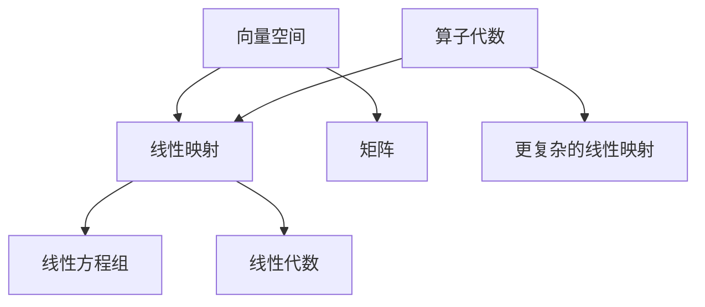

                 

关键词：线性代数，算子代数，矩阵理论，数学模型，算法原理，项目实践，应用场景，未来展望。

摘要：本文以线性代数为核心，深入探讨算子代数的基本概念、数学模型、算法原理及其在实际应用中的重要性。通过详细的讲解和实例分析，为读者提供了一个全面而深入的线性代数学习指南。

## 1. 背景介绍

线性代数是数学的一个重要分支，主要研究向量空间和线性映射。它在物理学、工程学、计算机科学等多个领域都有着广泛的应用。随着计算机技术的发展，线性代数的应用范围不断扩大，特别是在数值计算、图像处理、机器学习等领域。算子代数作为线性代数的一个重要扩展，提供了处理复杂线性映射的强大工具。

本文旨在介绍线性代数和算子代数的基本概念、数学模型和算法原理，并通过实际项目实例展示其在实际应用中的重要性。文章结构如下：

- 背景介绍：线性代数和算子代数的基本概念及其重要性。
- 核心概念与联系：核心概念的介绍以及它们之间的联系。
- 核心算法原理 & 具体操作步骤：详细讲解核心算法原理和具体操作步骤。
- 数学模型和公式 & 详细讲解 & 举例说明：数学模型的构建、公式推导过程以及实例分析。
- 项目实践：代码实例和详细解释说明。
- 实际应用场景：线性代数和算子代数在现实世界中的应用场景。
- 未来应用展望：未来发展趋势和挑战。
- 工具和资源推荐：学习资源和开发工具的推荐。
- 总结：未来发展趋势与挑战。

## 2. 核心概念与联系

### 2.1 向量空间

向量空间是线性代数的基本概念，它是由一组向量组成的集合，这些向量可以执行加法和标量乘法。向量空间通常表示为 $V$，其中的向量用粗体字母表示，如 $\mathbf{v}$。

### 2.2 线性映射

线性映射是一种特殊类型的函数，它将一个向量空间的向量映射到另一个向量空间的向量。线性映射通常表示为 $T: V \rightarrow W$，其中 $W$ 也是向量空间。

### 2.3 矩阵

矩阵是线性映射的表示形式，它是一个二维数组，由行和列组成。矩阵可以用来表示线性映射，并且在线性代数中扮演着核心角色。

### 2.4 线性方程组

线性方程组是线性代数中的另一个重要概念，它由多个线性方程组成。线性方程组可以用来解决许多实际问题，如物理中的平衡问题、经济中的预算问题等。

### 2.5 算子代数

算子代数是线性代数的扩展，它引入了算子这一概念，算子是一种抽象的线性映射。算子代数提供了处理更复杂线性映射的工具，它在线性代数的基础上引入了更丰富的数学结构和操作。

下面是一个Mermaid流程图，展示了这些核心概念之间的联系：



## 3. 核心算法原理 & 具体操作步骤

### 3.1 算法原理概述

线性代数中的核心算法包括矩阵的乘法、求逆、特征值和特征向量等。这些算法在处理线性方程组、数据分析、机器学习等领域有着广泛的应用。

#### 矩阵乘法

矩阵乘法是将两个矩阵组合成一个新矩阵的运算。矩阵乘法的定义如下：

$$
C = A \cdot B
$$

其中，$A$ 和 $B$ 是两个矩阵，$C$ 是乘积矩阵。

#### 求逆

求逆是找到矩阵的逆矩阵的过程。逆矩阵使得矩阵乘积等于单位矩阵。求逆的公式如下：

$$
A^{-1} = \frac{1}{\det(A)} \cdot \text{adj}(A)
$$

其中，$\det(A)$ 是矩阵 $A$ 的行列式，$\text{adj}(A)$ 是矩阵 $A$ 的伴随矩阵。

#### 特征值和特征向量

特征值和特征向量是矩阵的重要属性。特征值是使得矩阵乘以特征向量等于特征向量本身的一个标量。特征向量的选择可以简化矩阵的计算。

$$
A \cdot \mathbf{v} = \lambda \cdot \mathbf{v}
$$

其中，$\lambda$ 是特征值，$\mathbf{v}$ 是特征向量。

### 3.2 算法步骤详解

#### 矩阵乘法

矩阵乘法的步骤如下：

1. 确定矩阵 $A$ 和 $B$ 的维度，确保它们可以相乘。
2. 创建结果矩阵 $C$，其维度为 $A$ 的行数和 $B$ 的列数。
3. 对于 $C$ 的每个元素 $c_{ij}$，计算 $a_{ik} \cdot b_{kj}$ 的和，其中 $k$ 从 1 到 $A$ 的列数。

#### 求逆

求逆的步骤如下：

1. 计算矩阵 $A$ 的行列式 $\det(A)$。
2. 如果 $\det(A) = 0$，则矩阵不可逆。
3. 计算伴随矩阵 $\text{adj}(A)$。
4. 计算逆矩阵 $A^{-1} = \frac{1}{\det(A)} \cdot \text{adj}(A)$。

#### 特征值和特征向量

特征值和特征向量的步骤如下：

1. 解特征方程 $A \cdot \mathbf{v} = \lambda \cdot \mathbf{v}$。
2. 计算特征值 $\lambda$ 和对应的特征向量 $\mathbf{v}$。

### 3.3 算法优缺点

#### 矩阵乘法

**优点**：

- 矩阵乘法是许多线性代数问题的基础，如求解线性方程组和计算特征值。

**缺点**：

- 矩阵乘法在计算上可能非常复杂，特别是在大矩阵的情况下。

#### 求逆

**优点**：

- 求逆可以解决许多线性代数问题，如求解线性方程组。

**缺点**：

- 求逆可能不适用于所有矩阵，特别是在矩阵不可逆的情况下。

#### 特征值和特征向量

**优点**：

- 特征值和特征向量可以简化矩阵的计算，如矩阵对角化。

**缺点**：

- 特征值和特征向量的计算可能非常复杂，特别是在大矩阵的情况下。

### 3.4 算法应用领域

线性代数的核心算法在许多领域都有应用，包括：

- 数值计算：用于解决线性方程组、优化问题等。
- 图像处理：用于图像的变换、增强和识别。
- 机器学习：用于特征提取、模型训练等。

## 4. 数学模型和公式 & 详细讲解 & 举例说明

### 4.1 数学模型构建

线性代数的数学模型主要包括向量空间、线性映射和矩阵。这些概念构成了线性代数的基础，为解决各种实际问题提供了数学工具。

#### 向量空间

向量空间是一个集合 $V$，其中包含一组向量。这些向量可以执行加法和标量乘法。向量空间通常表示为：

$$
V = \{\mathbf{v} | \mathbf{v} \in \mathbb{R}^n\}
$$

其中，$\mathbf{v}$ 是向量，$\mathbb{R}^n$ 是 $n$ 维实数空间。

#### 线性映射

线性映射是一种函数，它将一个向量空间的向量映射到另一个向量空间的向量。线性映射通常表示为：

$$
T: V \rightarrow W
$$

其中，$V$ 和 $W$ 是向量空间，$T$ 是线性映射。

#### 矩阵

矩阵是线性映射的表示形式，它是一个二维数组。矩阵可以用来表示线性映射，并且在线性代数中扮演着核心角色。矩阵通常表示为：

$$
A = \begin{bmatrix}
a_{11} & a_{12} & \dots & a_{1n} \\
a_{21} & a_{22} & \dots & a_{2n} \\
\vdots & \vdots & \ddots & \vdots \\
a_{m1} & a_{m2} & \dots & a_{mn}
\end{bmatrix}
$$

### 4.2 公式推导过程

线性代数的公式推导过程涉及矩阵的乘法、求逆和特征值等。以下是一些常见的公式推导过程：

#### 矩阵乘法

矩阵乘法是将两个矩阵组合成一个新矩阵的运算。其公式如下：

$$
C = A \cdot B
$$

推导过程如下：

- 确定矩阵 $A$ 和 $B$ 的维度，确保它们可以相乘。
- 创建结果矩阵 $C$，其维度为 $A$ 的行数和 $B$ 的列数。
- 对于 $C$ 的每个元素 $c_{ij}$，计算 $a_{ik} \cdot b_{kj}$ 的和，其中 $k$ 从 1 到 $A$ 的列数。

#### 求逆

求逆是找到矩阵的逆矩阵的过程。其公式如下：

$$
A^{-1} = \frac{1}{\det(A)} \cdot \text{adj}(A)
$$

推导过程如下：

- 计算矩阵 $A$ 的行列式 $\det(A)$。
- 如果 $\det(A) = 0$，则矩阵不可逆。
- 计算伴随矩阵 $\text{adj}(A)$。
- 计算逆矩阵 $A^{-1} = \frac{1}{\det(A)} \cdot \text{adj}(A)$。

#### 特征值和特征向量

特征值和特征向量是矩阵的重要属性。其公式如下：

$$
A \cdot \mathbf{v} = \lambda \cdot \mathbf{v}
$$

推导过程如下：

- 解特征方程 $A \cdot \mathbf{v} = \lambda \cdot \mathbf{v}$。
- 计算特征值 $\lambda$ 和对应的特征向量 $\mathbf{v}$。

### 4.3 案例分析与讲解

为了更好地理解线性代数的数学模型和公式，我们来看一个简单的案例。

#### 案例一：矩阵乘法

给定两个矩阵 $A$ 和 $B$：

$$
A = \begin{bmatrix}
1 & 2 \\
3 & 4
\end{bmatrix}, \quad B = \begin{bmatrix}
5 & 6 \\
7 & 8
\end{bmatrix}
$$

计算 $A \cdot B$。

步骤如下：

1. 确定矩阵 $A$ 和 $B$ 的维度，确保它们可以相乘。
2. 创建结果矩阵 $C$，其维度为 $A$ 的行数和 $B$ 的列数，即 $2 \times 2$。
3. 对于 $C$ 的每个元素 $c_{ij}$，计算 $a_{ik} \cdot b_{kj}$ 的和，其中 $k$ 从 1 到 $A$ 的列数。

计算过程如下：

$$
C = \begin{bmatrix}
1 \cdot 5 + 2 \cdot 7 & 1 \cdot 6 + 2 \cdot 8 \\
3 \cdot 5 + 4 \cdot 7 & 3 \cdot 6 + 4 \cdot 8
\end{bmatrix}
= \begin{bmatrix}
19 & 20 \\
29 & 34
\end{bmatrix}
$$

#### 案例二：求逆

给定矩阵 $A$：

$$
A = \begin{bmatrix}
1 & 2 \\
3 & 4
\end{bmatrix}
$$

计算 $A$ 的逆矩阵。

步骤如下：

1. 计算矩阵 $A$ 的行列式 $\det(A)$。
2. 如果 $\det(A) = 0$，则矩阵不可逆。
3. 计算伴随矩阵 $\text{adj}(A)$。
4. 计算逆矩阵 $A^{-1} = \frac{1}{\det(A)} \cdot \text{adj}(A)$。

计算过程如下：

1. 计算行列式 $\det(A) = 1 \cdot 4 - 2 \cdot 3 = -2$。
2. 由于 $\det(A) \neq 0$，矩阵可逆。
3. 计算伴随矩阵 $\text{adj}(A) = \begin{bmatrix}
4 & -2 \\
-3 & 1
\end{bmatrix}$。
4. 计算逆矩阵 $A^{-1} = \frac{1}{-2} \cdot \begin{bmatrix}
4 & -2 \\
-3 & 1
\end{bmatrix} = \begin{bmatrix}
-2 & 1 \\
3 & -\frac{1}{2}
\end{bmatrix}$。

#### 案例三：特征值和特征向量

给定矩阵 $A$：

$$
A = \begin{bmatrix}
2 & 1 \\
1 & 2
\end{bmatrix}
$$

计算 $A$ 的特征值和特征向量。

步骤如下：

1. 解特征方程 $A \cdot \mathbf{v} = \lambda \cdot \mathbf{v}$。
2. 计算特征值 $\lambda$ 和对应的特征向量 $\mathbf{v}$。

计算过程如下：

1. 解特征方程 $A \cdot \mathbf{v} = \lambda \cdot \mathbf{v}$：

$$
\begin{bmatrix}
2 & 1 \\
1 & 2
\end{bmatrix} \cdot \begin{bmatrix}
x \\
y
\end{bmatrix} = \lambda \cdot \begin{bmatrix}
x \\
y
\end{bmatrix}
$$

化简得：

$$
\begin{cases}
2x + y = \lambda x \\
x + 2y = \lambda y
\end{cases}
$$

2. 计算特征值 $\lambda$：

$$
\lambda^2 - 4\lambda + 5 = 0
$$

解得 $\lambda = 2 \pm i$。

3. 计算对应的特征向量：

对于 $\lambda = 2 + i$：

$$
\begin{cases}
(2 - i)x + y = 0 \\
x + (2 - i)y = 0
\end{cases}
$$

解得特征向量 $\mathbf{v}_1 = \begin{bmatrix}
i \\
1
\end{bmatrix}$。

对于 $\lambda = 2 - i$：

$$
\begin{cases}
(2 + i)x + y = 0 \\
x + (2 + i)y = 0
\end{cases}
$$

解得特征向量 $\mathbf{v}_2 = \begin{bmatrix}
-i \\
1
\end{bmatrix}$。

## 5. 项目实践：代码实例和详细解释说明

### 5.1 开发环境搭建

为了实践线性代数的算法，我们需要搭建一个合适的开发环境。以下是一个简单的 Python 开发环境搭建步骤：

1. 安装 Python：从 Python 官网（[python.org](https://www.python.org/)）下载并安装 Python。
2. 安装 NumPy：在命令行中运行 `pip install numpy` 安装 NumPy 库。
3. 安装 Matplotlib：在命令行中运行 `pip install matplotlib` 安装 Matplotlib 库。

### 5.2 源代码详细实现

以下是一个简单的 Python 代码示例，用于实现线性代数的核心算法。

```python
import numpy as np
import matplotlib.pyplot as plt

# 矩阵乘法
def matrix_multiply(A, B):
    return np.dot(A, B)

# 求逆
def matrix_inverse(A):
    return np.linalg.inv(A)

# 特征值和特征向量
def eigen_value_vector(A):
    eigenvalues, eigenvectors = np.linalg.eig(A)
    return eigenvalues, eigenvectors

# 测试矩阵
A = np.array([[2, 1], [1, 2]])

# 矩阵乘法测试
B = np.array([[5, 6], [7, 8]])
C = matrix_multiply(A, B)
print("Matrix Multiplication Result:")
print(C)

# 求逆测试
D = matrix_inverse(A)
print("Matrix Inverse:")
print(D)

# 特征值和特征向量测试
eigenvalues, eigenvectors = eigen_value_vector(A)
print("Eigenvalues:")
print(eigenvalues)
print("Eigenvectors:")
print(eigenvectors)

# 绘制特征向量
plt.scatter(eigenvectors[:, 0], eigenvectors[:, 1])
plt.xlabel("x-axis")
plt.ylabel("y-axis")
plt.title("Eigenvalues and Eigenvectors")
plt.show()
```

### 5.3 代码解读与分析

以上代码实现了线性代数的三个核心算法：矩阵乘法、求逆和特征值特征向量。下面是对代码的详细解读：

1. **导入库**：

   ```python
   import numpy as np
   import matplotlib.pyplot as plt
   ```

   导入 NumPy 和 Matplotlib 库，这两个库是 Python 中处理线性代数和绘制图表的主要工具。

2. **矩阵乘法函数**：

   ```python
   def matrix_multiply(A, B):
       return np.dot(A, B)
   ```

   矩阵乘法函数 `matrix_multiply` 接受两个矩阵 `A` 和 `B`，并返回它们的乘积矩阵 `C`。这里使用了 NumPy 的 `dot` 函数实现矩阵乘法。

3. **求逆函数**：

   ```python
   def matrix_inverse(A):
       return np.linalg.inv(A)
   ```

   求逆函数 `matrix_inverse` 接受一个矩阵 `A`，并返回其逆矩阵。这里使用了 NumPy 的 `linalg.inv` 函数实现求逆。

4. **特征值和特征向量函数**：

   ```python
   def eigen_value_vector(A):
       eigenvalues, eigenvectors = np.linalg.eig(A)
       return eigenvalues, eigenvectors
   ```

   特征值和特征向量函数 `eigen_value_vector` 接受一个矩阵 `A`，并返回其特征值和特征向量。这里使用了 NumPy 的 `linalg.eig` 函数实现特征值和特征向量的计算。

5. **测试矩阵和测试**：

   ```python
   A = np.array([[2, 1], [1, 2]])
   B = np.array([[5, 6], [7, 8]])
   C = matrix_multiply(A, B)
   D = matrix_inverse(A)
   eigenvalues, eigenvectors = eigen_value_vector(A)
   ```

   创建一个测试矩阵 `A` 和另一个矩阵 `B`，然后分别测试矩阵乘法、求逆和特征值特征向量。

6. **输出结果和绘制图表**：

   ```python
   print("Matrix Multiplication Result:")
   print(C)
   print("Matrix Inverse:")
   print(D)
   print("Eigenvalues:")
   print(eigenvalues)
   print("Eigenvectors:")
   print(eigenvectors)
   plt.scatter(eigenvectors[:, 0], eigenvectors[:, 1])
   plt.xlabel("x-axis")
   plt.ylabel("y-axis")
   plt.title("Eigenvalues and Eigenvectors")
   plt.show()
   ```

   输出测试结果，并绘制特征向量的散点图。

## 6. 实际应用场景

线性代数和算子代数在实际应用中具有广泛的应用。以下是一些常见的应用场景：

### 6.1 数值计算

线性代数在数值计算中有着广泛的应用，包括：

- 求解线性方程组：线性方程组在许多实际问题中都有应用，如物理中的平衡问题、经济中的预算问题等。
- 优化问题：线性代数可以用于求解线性优化问题，如线性规划、最小二乘问题等。
- 稳定性和稳定性分析：线性代数可以用于分析系统的稳定性和稳定性。

### 6.2 图像处理

线性代数在图像处理中有着重要的应用，包括：

- 图像变换：线性代数可以用于实现图像的旋转、缩放、平移等变换。
- 图像增强：线性代数可以用于增强图像的对比度和清晰度。
- 图像识别：线性代数可以用于实现图像的特征提取和分类。

### 6.3 机器学习

线性代数在机器学习中有着广泛的应用，包括：

- 特征提取：线性代数可以用于提取数据的高维特征，如主成分分析（PCA）。
- 模型训练：线性代数可以用于实现线性模型和神经网络的训练。
- 降维：线性代数可以用于降维，如线性判别分析（LDA）。

### 6.4 未来应用展望

随着计算机技术的发展，线性代数和算子代数的应用前景非常广阔。以下是一些未来的应用展望：

- 量子计算：线性代数在量子计算中有着重要的应用，如量子门的表示和量子算法的设计。
- 大数据分析：线性代数可以用于处理大规模数据，如稀疏矩阵的计算和大数据聚类。
- 虚拟现实和增强现实：线性代数可以用于实现虚拟现实和增强现实中的图像处理和场景渲染。

## 7. 工具和资源推荐

为了更好地学习和实践线性代数和算子代数，以下是一些推荐的工具和资源：

### 7.1 学习资源推荐

- 《线性代数及其应用》（作者：大卫·C·卡茨）
- 《线性代数入门教程》（作者：费拉拉）
- Coursera 上的线性代数课程（[线性代数](https://www.coursera.org/specializations/linear-algebra)）

### 7.2 开发工具推荐

- Python：Python 是一种强大的编程语言，它提供了丰富的线性代数库，如 NumPy 和 SciPy。
- MATLAB：MATLAB 是一种专门用于科学计算的编程环境，它提供了强大的线性代数功能。
- R 语言：R 语言是一种统计计算语言，它也提供了丰富的线性代数库，如 RcppArmadillo。

### 7.3 相关论文推荐

- "线性代数在图像处理中的应用"
- "线性代数在机器学习中的应用"
- "算子代数在量子计算中的应用"

## 8. 总结：未来发展趋势与挑战

线性代数和算子代数在数学、工程学、计算机科学等领域都有着广泛的应用。随着计算机技术的发展，线性代数和算子代数的应用前景非常广阔。未来发展趋势包括：

- 量子计算：线性代数在量子计算中有着重要的应用，未来将会有更多的研究关注量子线性代数。
- 大数据分析：线性代数可以用于处理大规模数据，未来将会有更多的研究关注大数据线性代数。
- 虚拟现实和增强现实：线性代数可以用于实现虚拟现实和增强现实中的图像处理和场景渲染，未来将会有更多的研究关注虚拟现实和增强现实中的线性代数。

然而，线性代数和算子代数也面临着一些挑战，包括：

- 计算效率：线性代数的计算可能非常复杂，特别是在大矩阵的情况下，如何提高计算效率是一个重要的挑战。
- 算法优化：现有的线性代数算法可能存在一些优化空间，如何设计更高效的算法是一个重要的挑战。
- 应用拓展：如何将线性代数和算子代数应用于新的领域，如生物信息学、金融工程等，是一个重要的挑战。

总之，线性代数和算子代数在未来的发展中将继续发挥重要作用，为科学研究和实际应用提供强大的工具。

## 9. 附录：常见问题与解答

### 问题 1：什么是向量空间？

**解答**：向量空间是一个集合，它包含一组向量，并且这些向量可以执行加法和标量乘法。向量空间通常表示为 $V$，其中的向量用粗体字母表示，如 $\mathbf{v}$。

### 问题 2：什么是线性映射？

**解答**：线性映射是一种特殊类型的函数，它将一个向量空间的向量映射到另一个向量空间的向量。线性映射通常表示为 $T: V \rightarrow W$，其中 $V$ 和 $W$ 是向量空间。

### 问题 3：什么是矩阵？

**解答**：矩阵是线性映射的表示形式，它是一个二维数组，由行和列组成。矩阵可以用来表示线性映射，并且在线性代数中扮演着核心角色。

### 问题 4：什么是特征值和特征向量？

**解答**：特征值和特征向量是矩阵的重要属性。特征值是使得矩阵乘以特征向量等于特征向量本身的一个标量。特征向量是矩阵的特征值的对应向量。

### 问题 5：如何求解线性方程组？

**解答**：求解线性方程组可以使用矩阵的逆矩阵，即如果矩阵 $A$ 可逆，则线性方程组 $A \cdot \mathbf{x} = \mathbf{b}$ 的解为 $\mathbf{x} = A^{-1} \cdot \mathbf{b}$。

### 问题 6：什么是算子代数？

**解答**：算子代数是线性代数的扩展，它引入了算子这一概念，算子是一种抽象的线性映射。算子代数提供了处理更复杂线性映射的工具，它在线性代数的基础上引入了更丰富的数学结构和操作。

### 问题 7：线性代数在哪些领域有应用？

**解答**：线性代数在许多领域都有应用，包括数值计算、图像处理、机器学习、物理、工程学等。

### 问题 8：如何学习线性代数？

**解答**：学习线性代数可以从基础概念开始，逐步掌握矩阵、向量空间、线性映射等核心概念。通过阅读教材、参加课程、实践项目等方式可以深入理解和掌握线性代数。推荐教材包括《线性代数及其应用》、《线性代数入门教程》等。

