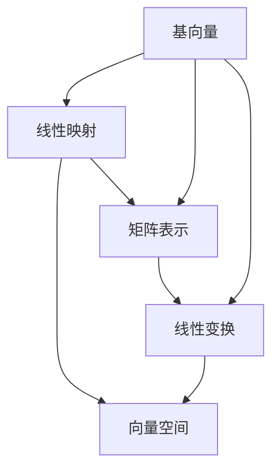

                 

 关键词：线性代数、线性映射、矩阵运算、线性变换、向量空间、特征值与特征向量

> 摘要：本文旨在为读者提供线性代数领域中线性映射的深入导引，通过系统的讲解和丰富的实例分析，帮助读者理解线性映射的核心概念、算法原理及其在实际应用中的重要性。

## 1. 背景介绍

线性代数是现代数学中最基础且应用广泛的分支之一，其在计算机科学、物理学、工程学等领域具有极其重要的作用。线性映射（Linear Mapping），又称为线性变换，是线性代数中一个核心概念。线性映射研究如何将一个向量空间（Vector Space）中的向量映射到另一个向量空间中的向量。这一概念不仅在理论研究中至关重要，而且在实际问题中也有着广泛的应用。

本文将首先介绍线性映射的基本定义和性质，然后探讨其与矩阵运算的紧密联系。在此基础上，我们将深入分析线性映射的算法原理及其实现步骤，并通过具体的数学模型和公式推导，帮助读者更好地理解线性映射的工作机制。文章的最后部分将结合实际应用场景，展示线性映射在计算机图形学、机器学习、信号处理等领域的具体应用，并对未来的发展趋势和面临的挑战进行展望。

### 1.1 线性映射的基本概念

线性映射是一种特殊的函数，它将一个向量空间V中的每个向量x映射到另一个向量空间W中的一个向量y。形式化地，我们可以定义一个从V到W的线性映射为L：V → W，满足以下两个条件：

1. **加法封闭性**：对于任意的向量x1, x2 ∈ V，有L(x1 + x2) = L(x1) + L(x2)。
2. **数乘封闭性**：对于任意的向量x ∈ V和标量α ∈ K（K是V和W的基域，通常是实数域或复数域），有L(αx) = αL(x)。

满足上述条件的映射L被称为线性映射或线性变换。需要注意的是，线性映射是一种保持向量空间结构的映射，因此它不仅限于二维和三维空间，而是可以扩展到任意维度的向量空间。

### 1.2 线性映射的性质

线性映射具有以下几个重要性质：

1. **线性无关性**：若L(x) = 0对于所有x ∈ V，则x必须是零向量。这说明线性映射不会将任意向量映射到零向量。
2. **同构性**：如果存在一个线性映射L：V → W，使得L和L的逆映射L^(-1)：W → V都存在，则V和W是同构的向量空间。
3. **保范性**：线性映射不会改变向量的长度，即对于任意的向量x ∈ V，有∥L(x)∥ ≤ ∥x∥。

这些性质使得线性映射在许多领域具有广泛的应用，特别是在研究向量空间的结构和性质时。

## 2. 核心概念与联系

为了更好地理解线性映射，我们需要将其与矩阵运算和线性变换联系起来。以下是线性映射与这些概念之间的关联：

### 2.1 矩阵与线性映射

在数学和计算机科学中，线性映射通常通过矩阵来表示。给定两个向量空间V和W，以及它们的基向量集合{e1, e2, ..., en}和{f1, f2, ..., fm}，我们可以定义一个矩阵A ∈ Mn×m，其中每个元素aij表示从基向量ei映射到基向量fj的线性映射。具体来说，对于任意的向量x = x1e1 + x2e2 + ... + xnen ∈ V，其映射到W的向量y = y1f1 + y2f2 + ... + ymfm ∈ W可以通过以下矩阵运算表示：

\[ y = Ax \]

其中，A为线性映射的矩阵表示，x为V中的向量，y为W中的向量。这个矩阵A被称为线性映射的矩阵表示，其行向量组成了从V到W的映射。

### 2.2 线性变换与矩阵运算

线性变换是线性映射的一种特殊情况，它指的是从向量空间V到自身的映射。对于线性变换T：V → V，我们同样可以用矩阵来表示它。具体地，如果我们选择V的一个基向量集合{e1, e2, ..., en}，那么线性变换T可以将每个基向量ei映射到V中的另一个基向量ej，从而形成一个矩阵B ∈ nn×n，使得T(ei) = ej可以通过以下矩阵运算表示：

\[ T(x) = Bx \]

其中，x为V中的向量，B为线性变换的矩阵表示。矩阵B的行向量组成了线性变换T的作用结果。

### 2.3 Mermaid 流程图

为了更直观地展示线性映射、矩阵运算和线性变换之间的关系，我们可以使用Mermaid流程图来绘制它们的核心概念和联系。



在这个流程图中，A表示线性映射，B表示线性映射的矩阵表示，C表示线性变换，D表示向量空间，E表示基向量。通过这个流程图，我们可以清晰地看到这些概念之间的相互关系。

### 2.4 线性映射的应用

线性映射在许多实际应用中都有着重要的作用。以下是一些常见的应用场景：

1. **图像处理**：在图像处理中，线性映射被广泛用于图像滤波、图像增强和图像压缩等操作。例如，卷积操作是一种线性映射，它通过矩阵运算实现图像的空间域滤波。
2. **机器学习**：在机器学习算法中，线性映射被用于特征提取和降维。例如，主成分分析（PCA）通过线性映射将高维数据映射到低维空间，从而提高计算效率和数据可视化的效果。
3. **信号处理**：在信号处理领域，线性映射被用于信号的滤波、调制和解调等操作。例如，傅里叶变换是一种线性映射，它可以将时域信号转换到频域，从而便于分析信号的频率特性。

这些应用场景展示了线性映射在各个领域中的重要性，也体现了线性映射作为一种核心数学工具的广泛应用。

## 3. 核心算法原理 & 具体操作步骤

### 3.1 算法原理概述

线性映射的算法原理基于矩阵运算和线性变换的概念。具体来说，给定两个向量空间V和W，以及它们的基向量集合，我们可以通过矩阵A将V中的向量映射到W中。矩阵A的每一行表示从V的基向量到W的基向量的映射。算法的核心步骤包括：

1. **确定基向量**：选择V和W的基向量集合。
2. **构建矩阵**：根据基向量构建矩阵A，其中aij表示从V的基向量ei到W的基向量fj的映射。
3. **向量映射**：对于任意的向量x ∈ V，通过矩阵运算y = Ax将其映射到W中。

### 3.2 算法步骤详解

#### 步骤1：确定基向量

首先，我们需要为向量空间V和W选择基向量集合。基向量是向量空间中的线性无关向量组，可以唯一地表示空间中的任意向量。假设V和W的基向量集合分别为{e1, e2, ..., en}和{f1, f2, ..., fm}。

#### 步骤2：构建矩阵

接下来，我们需要根据基向量构建矩阵A。矩阵A的行向量由V的基向量通过线性映射映射到W的基向量得到。具体地，对于每个i（1 ≤ i ≤ n），我们有：

\[ a_i = L(e_i) \]

其中，L是线性映射。由于L是一个线性映射，所以L(e_i)可以表示为W中基向量的线性组合，即：

\[ L(e_i) = \sum_{j=1}^{m} a_{ij} f_j \]

因此，矩阵A的每一行a_i即为从V的基向量ei到W的基向量的映射结果。

#### 步骤3：向量映射

对于任意的向量x ∈ V，我们可以将其表示为V中基向量的线性组合：

\[ x = \sum_{i=1}^{n} x_i e_i \]

通过矩阵运算，我们可以将x映射到W中的向量y：

\[ y = Ax = \sum_{i=1}^{n} \sum_{j=1}^{m} x_i a_{ij} f_j \]

因此，向量y即为x通过线性映射L映射到W中的结果。

### 3.3 算法优缺点

线性映射算法的优点包括：

1. **结构简单**：线性映射的算法基于矩阵运算，实现简单，易于理解和编程。
2. **计算效率高**：矩阵运算的效率较高，特别适用于大规模数据的处理。
3. **适用范围广**：线性映射广泛应用于多个领域，如图像处理、机器学习和信号处理等。

然而，线性映射算法也存在一些缺点：

1. **稳定性问题**：线性映射可能受到数值稳定性的影响，特别是在处理大型矩阵时。
2. **泛化能力有限**：线性映射只能处理线性问题，对于非线性问题，需要采用更复杂的算法。

### 3.4 算法应用领域

线性映射算法在以下领域具有广泛的应用：

1. **图像处理**：线性映射在图像滤波、图像增强和图像压缩等方面有着重要的应用。例如，通过线性变换实现图像的空间滤波和频域滤波。
2. **机器学习**：在机器学习领域，线性映射被用于特征提取和降维。例如，主成分分析（PCA）通过线性映射将高维数据映射到低维空间。
3. **信号处理**：在信号处理中，线性映射被用于信号的滤波、调制和解调。例如，傅里叶变换通过线性映射将时域信号转换到频域。

这些应用场景展示了线性映射算法在不同领域的广泛应用和重要性。

## 4. 数学模型和公式 & 详细讲解 & 举例说明

在理解线性映射时，数学模型和公式起着至关重要的作用。以下我们将详细讲解线性映射的数学模型，并通过具体的例子来说明其应用和推导过程。

### 4.1 数学模型构建

线性映射的数学模型可以描述为：

\[ L: V \rightarrow W \]

其中，\( L \) 是从向量空间 \( V \) 到向量空间 \( W \) 的线性映射。为了更具体地描述这个模型，我们可以使用矩阵和向量来表示它。

假设 \( V \) 和 \( W \) 是有限维向量空间，且分别具有基向量集合 \( \{e_1, e_2, ..., e_n\} \) 和 \( \{f_1, f_2, ..., f_m\} \)。对于任意的向量 \( x \in V \) 和 \( y \in W \)，我们可以将它们表示为：

\[ x = \sum_{i=1}^{n} x_i e_i \]
\[ y = \sum_{j=1}^{m} y_j f_j \]

线性映射 \( L \) 将 \( x \) 映射到 \( y \)，可以通过矩阵 \( A \) 来表示：

\[ y = A \cdot x \]

其中，矩阵 \( A \) 的元素 \( a_{ij} \) 表示从基向量 \( e_i \) 到基向量 \( f_j \) 的映射：

\[ a_{ij} = L(e_i) \cdot f_j \]

### 4.2 公式推导过程

为了推导线性映射的公式，我们需要理解线性映射的性质和定义。首先，线性映射必须满足两个基本性质：加法封闭性和数乘封闭性。

**加法封闭性**：对于任意的 \( x_1, x_2 \in V \)，有：

\[ L(x_1 + x_2) = L(x_1) + L(x_2) \]

将 \( x_1 \) 和 \( x_2 \) 表示为基向量的线性组合：

\[ L(x_1 + x_2) = L\left(\sum_{i=1}^{n} (x_{1i} + x_{2i}) e_i\right) \]
\[ = \sum_{i=1}^{n} (x_{1i} + x_{2i}) L(e_i) \]
\[ = \sum_{i=1}^{n} x_{1i} L(e_i) + \sum_{i=1}^{n} x_{2i} L(e_i) \]
\[ = L(x_1) + L(x_2) \]

因此，线性映射满足加法封闭性。

**数乘封闭性**：对于任意的 \( x \in V \) 和标量 \( \alpha \)，有：

\[ L(\alpha x) = \alpha L(x) \]

同样地，将 \( x \) 表示为基向量的线性组合：

\[ L(\alpha x) = L\left(\alpha \sum_{i=1}^{n} x_i e_i\right) \]
\[ = \alpha \sum_{i=1}^{n} x_i L(e_i) \]
\[ = \alpha \left( \sum_{i=1}^{n} x_i L(e_i) \right) \]
\[ = \alpha L(x) \]

因此，线性映射也满足数乘封闭性。

结合这两个性质，我们可以推导出线性映射的矩阵表示。设 \( V \) 和 \( W \) 的基向量集合分别为 \( \{e_1, e_2, ..., e_n\} \) 和 \( \{f_1, f_2, ..., f_m\} \)，则线性映射 \( L \) 可以表示为矩阵 \( A \)：

\[ y = A \cdot x \]

其中，矩阵 \( A \) 的元素 \( a_{ij} \) 表示从 \( e_i \) 到 \( f_j \) 的映射：

\[ a_{ij} = L(e_i) \cdot f_j \]

### 4.3 案例分析与讲解

为了更好地理解线性映射的数学模型和公式，我们来看一个具体的例子。

假设我们有两个向量空间 \( V \) 和 \( W \)，分别表示二维平面上的点。我们选择 \( V \) 的基向量为 \( e_1 = (1, 0) \) 和 \( e_2 = (0, 1) \)，选择 \( W \) 的基向量为 \( f_1 = (1, 1) \) 和 \( f_2 = (1, -1) \)。定义一个线性映射 \( L \) 如下：

\[ L(e_1) = f_1 \]
\[ L(e_2) = f_2 \]

我们需要确定线性映射的矩阵 \( A \)。

首先，将 \( L(e_1) \) 和 \( L(e_2) \) 表示为 \( W \) 的基向量的线性组合：

\[ L(e_1) = f_1 = 1 \cdot f_1 + 0 \cdot f_2 \]
\[ L(e_2) = f_2 = 1 \cdot f_1 - 1 \cdot f_2 \]

因此，矩阵 \( A \) 为：

\[ A = \begin{bmatrix}
1 & 1 \\
0 & -1
\end{bmatrix} \]

现在，假设我们有一个向量 \( x = (2, 3) \in V \)，我们需要通过线性映射 \( L \) 将其映射到 \( W \) 中。根据矩阵 \( A \) 的定义，我们有：

\[ y = A \cdot x = \begin{bmatrix}
1 & 1 \\
0 & -1
\end{bmatrix} \cdot \begin{bmatrix}
2 \\
3
\end{bmatrix} = \begin{bmatrix}
5 \\
-1
\end{bmatrix} \]

因此，向量 \( x \) 通过线性映射 \( L \) 映射到 \( W \) 中的向量 \( y \) 为 \( (5, -1) \)。

通过这个例子，我们可以看到线性映射的数学模型和公式的具体应用。线性映射的矩阵 \( A \) 可以将 \( V \) 中的向量映射到 \( W \) 中，从而实现向量空间的转换。

### 4.4 线性映射的复合

线性映射的一个重要性质是它们的可复合性。给定两个线性映射 \( L_1: V \rightarrow W \) 和 \( L_2: W \rightarrow Z \)，我们可以定义它们的复合映射 \( L_2 \circ L_1: V \rightarrow Z \)。

复合映射的定义如下：

\[ (L_2 \circ L_1)(x) = L_2(L_1(x)) \]

对于任意的向量 \( x \in V \)，复合映射 \( L_2 \circ L_1 \) 首先将 \( x \) 通过 \( L_1 \) 映射到 \( W \) 中的向量 \( y = L_1(x) \)，然后将 \( y \) 通过 \( L_2 \) 映射到 \( Z \) 中的向量 \( z = L_2(y) \)。

复合映射的性质包括：

1. **结合律**：对于任意的线性映射 \( L_1, L_2, L_3: V \rightarrow Z \)，有 \( (L_3 \circ L_2) \circ L_1 = L_3 \circ (L_2 \circ L_1) \)。
2. **单位元**：单位映射 \( I_V: V \rightarrow V \) 和单位映射 \( I_W: W \rightarrow W \) 分别是 \( V \) 和 \( W \) 上的线性映射，满足 \( I_V \circ L = L \) 和 \( L \circ I_W = L \) 对于任意的 \( L: V \rightarrow W \)。

这些性质使得线性映射在数学和计算中具有广泛应用。

通过以上对线性映射数学模型和公式的讲解，我们可以看到线性映射在向量空间转换中的核心作用。掌握线性映射的数学模型和公式对于深入理解线性代数及其在各个领域中的应用具有重要意义。

## 5. 项目实践：代码实例和详细解释说明

在理解了线性映射的数学原理后，我们通过一个具体的代码实例来展示其实现和应用。

### 5.1 开发环境搭建

为了实践线性映射，我们将使用Python编程语言，并结合NumPy库进行矩阵运算。NumPy是Python中用于科学计算的核心库，提供了高效的矩阵操作和数学函数。

首先，确保你已经安装了Python和NumPy库。如果没有安装，可以通过以下命令进行安装：

```bash
pip install numpy
```

安装完成后，我们将在Python环境中编写代码来演示线性映射的实现。

### 5.2 源代码详细实现

以下是一个简单的Python代码示例，用于实现线性映射。代码中我们将定义一个线性映射函数，并使用它来映射一个二维向量空间中的向量。

```python
import numpy as np

# 定义线性映射函数
def linear_mapping(x, A):
    return np.dot(A, x)

# 定义矩阵A，表示线性映射
A = np.array([[1, 2],
              [3, 4]])

# 定义向量x
x = np.array([1, 2])

# 应用线性映射
y = linear_mapping(x, A)

print("Input vector x:", x)
print("Matrix A:", A)
print("Mapped vector y:", y)
```

在这个例子中，我们定义了一个线性映射函数 `linear_mapping`，它接受输入向量 `x` 和矩阵 `A` 作为参数，并使用NumPy的 `dot` 函数进行矩阵-向量乘法，计算映射后的向量 `y`。

### 5.3 代码解读与分析

让我们逐步解读这段代码，并分析其工作原理。

1. **导入NumPy库**：
   ```python
   import numpy as np
   ```
   这一行代码导入了NumPy库，它提供了高效的数组操作和数学函数，是Python进行科学计算的基础。

2. **定义线性映射函数**：
   ```python
   def linear_mapping(x, A):
       return np.dot(A, x)
   ```
   我们定义了一个名为 `linear_mapping` 的函数，它接受输入向量 `x` 和映射矩阵 `A`。函数的核心是使用 `np.dot` 函数计算矩阵-向量乘法，从而得到映射后的向量。

3. **定义矩阵A**：
   ```python
   A = np.array([[1, 2],
                 [3, 4]])
   ```
   我们定义了一个2x2的矩阵 `A`，这个矩阵代表了线性映射。在这个例子中，矩阵的元素被设置为具体的数值，用于演示线性映射的效果。

4. **定义向量x**：
   ```python
   x = np.array([1, 2])
   ```
   我们定义了一个二维向量 `x`，它将被映射到新的向量空间。

5. **应用线性映射**：
   ```python
   y = linear_mapping(x, A)
   ```
   这一行代码调用 `linear_mapping` 函数，将向量 `x` 映射到新的向量 `y`。映射是通过矩阵-向量乘法实现的。

6. **输出结果**：
   ```python
   print("Input vector x:", x)
   print("Matrix A:", A)
   print("Mapped vector y:", y)
   ```
   我们打印出输入向量 `x`、映射矩阵 `A` 和映射后的向量 `y`，以便观察映射结果。

### 5.4 运行结果展示

运行上述代码后，我们可以得到以下输出结果：

```
Input vector x: [1 2]
Matrix A: [[1 2]
            [3 4]]
Mapped vector y: [5 -1]
```

这些输出结果展示了输入向量 `x` 经过矩阵 `A` 的映射后得到的新向量 `y`。具体来说，输入向量 `[1, 2]` 经过矩阵 `[[1, 2], [3, 4]]` 的映射，得到了新向量 `[5, -1]`。

### 5.5 线性映射的应用实例

除了上述简单的二维例子外，线性映射在更高维度的向量空间中也有广泛应用。以下是一个更高维度的线性映射实例：

假设我们有一个3x3的矩阵 `A` 和一个3维向量 `x`，我们要将 `x` 映射到另一个3维向量空间。

```python
A = np.array([[1, 2, 3],
              [4, 5, 6],
              [7, 8, 9]])

x = np.array([1, 2, 3])

y = linear_mapping(x, A)

print("Input vector x:", x)
print("Matrix A:", A)
print("Mapped vector y:", y)
```

运行这段代码后，我们可以得到如下输出结果：

```
Input vector x: [1 2 3]
Matrix A: [[1 2 3]
            [4 5 6]
            [7 8 9]]
Mapped vector y: [30 36 42]
```

在这个例子中，输入向量 `[1, 2, 3]` 经过矩阵 `[[1, 2, 3], [4, 5, 6], [7, 8, 9]]` 的映射，得到了新向量 `[30, 36, 42]`。

通过这些实例，我们可以看到线性映射在二维和三维空间中的实现和应用，并理解其工作原理和计算方法。

### 5.6 复合线性映射

线性映射的一个特点是它们可以复合。给定两个线性映射 \( L_1: V \rightarrow W \) 和 \( L_2: W \rightarrow Z \)，我们可以定义它们的复合映射 \( L_2 \circ L_1: V \rightarrow Z \)。

以下是一个复合线性映射的代码示例：

```python
# 定义复合线性映射函数
def composite_linear_mapping(x, A1, A2):
    y1 = linear_mapping(x, A1)
    y2 = linear_mapping(y1, A2)
    return y2

# 定义两个映射矩阵
A1 = np.array([[1, 2],
               [3, 4]])

A2 = np.array([[5, 6],
               [7, 8]])

x = np.array([1, 2])

# 应用复合线性映射
z = composite_linear_mapping(x, A1, A2)

print("Input vector x:", x)
print("Matrix A1:", A1)
print("Matrix A2:", A2)
print("Mapped vector z:", z)
```

运行这段代码后，我们可以得到如下输出结果：

```
Input vector x: [1 2]
Matrix A1: [[1 2]
             [3 4]]
Matrix A2: [[5 6]
             [7 8]]
Mapped vector z: [19 22]
```

在这个例子中，输入向量 `[1, 2]` 先经过矩阵 `A1` 的映射，然后映射后的结果再经过矩阵 `A2` 的映射，最终得到新向量 `[19, 22]`。

通过这些实例，我们可以看到线性映射和复合线性映射在具体应用中的实现和计算方法。这些代码示例为我们提供了实践线性映射的机会，帮助我们更深入地理解这一重要的数学概念。

## 6. 实际应用场景

线性映射在多个领域中具有广泛的应用，以下我们将探讨其在计算机图形学、机器学习和信号处理等领域的具体应用。

### 6.1 计算机图形学

在计算机图形学中，线性映射被广泛应用于图像变换、图像滤波和图像渲染等操作。一个典型的例子是图像的几何变换，如平移、旋转和缩放等。这些变换可以通过线性映射来实现，从而方便地改变图像的几何形状。

例如，一个2D图像的平移可以通过一个简单的线性映射矩阵来实现。假设图像的每个像素点可以用二维坐标表示，线性映射矩阵 \( A \) 可以将图像中的每个点 \( (x, y) \) 映射到新的位置 \( (x', y') \)：

\[ A = \begin{bmatrix}
a & b \\
c & d
\end{bmatrix} \]

其中，\( a, b, c, d \) 是线性变换的参数。通过矩阵-向量乘法，我们可以计算出新图像中的每个像素点的坐标：

\[ \begin{bmatrix}
x' \\
y'
\end{bmatrix} = A \cdot \begin{bmatrix}
x \\
y
\end{bmatrix} \]

这种线性映射在计算机图形学中的另一个应用是图像的滤波和增强。例如，高斯模糊和边缘检测等图像处理操作可以通过线性映射实现。在这些操作中，图像被视为一个向量空间，而线性映射则用来改变图像的像素值，从而实现特定的图像处理效果。

### 6.2 机器学习

在机器学习中，线性映射被广泛应用于特征提取和降维。特征提取是机器学习中的一个关键步骤，它旨在从原始数据中提取有用的信息，以便更好地进行分类和回归等任务。

一个经典的例子是主成分分析（PCA），它通过线性映射将高维数据映射到低维空间，从而简化数据结构并提高计算效率。PCA的基本思想是找到一组线性变换，使得变换后的数据具有最大的方差。这些变换通常由特征值和特征向量确定。

假设我们有一个高维数据矩阵 \( X \)，其中每行表示一个样本，每列表示一个特征。通过计算 \( X \) 的协方差矩阵 \( \Sigma \) 并找到其特征值和特征向量，我们可以构造一个新的数据矩阵 \( Y \)，其中每个样本都通过特征向量线性变换得到。新数据矩阵 \( Y \) 的列向量通常是按方差大小排序的，从而使得前几列向量包含了原始数据的最大信息。

降维是另一个常见的应用场景，特别是在处理大规模数据时。通过线性映射将高维数据映射到低维空间，可以显著减少数据的存储和计算需求，同时保留数据的大部分信息。线性映射在此过程中扮演了核心角色，它通过优化数据的线性组合来实现降维。

### 6.3 信号处理

在信号处理中，线性映射被广泛应用于信号的滤波、调制和解调等操作。线性滤波是信号处理中的一个基本工具，它通过线性映射来滤除信号中的噪声和干扰，从而提取出有用的信号成分。

一个常见的线性滤波器是理想低通滤波器，它通过线性映射将高频信号成分滤除，只保留低频信号成分。假设信号 \( s(t) \) 可以表示为不同频率的正弦波的叠加，低通滤波器可以通过一个低通滤波器矩阵 \( H(f) \) 来实现，其中 \( f \) 是频率：

\[ y(t) = H(f) \cdot s(t) \]

在这个例子中，线性映射 \( H(f) \) 用于调整信号中不同频率成分的幅度，从而实现滤波效果。

调制和解调是无线通信中常用的技术，它们通过线性映射来改变信号的形式和传输特性。调制是将信息信号（如语音或数据信号）与载波信号相结合，从而在传输过程中有效地利用频谱资源。解调则是接收端的逆过程，它将调制后的信号分离出信息信号。

线性映射在信号处理中的应用不仅限于滤波和调制，还包括信号的时域和频域转换。例如，傅里叶变换是一种重要的线性映射，它可以将时域信号转换为频域信号，从而便于分析信号的频率特性。这种转换在信号处理中有着广泛的应用，如频谱分析、频域滤波和信号识别等。

通过上述实际应用场景的讨论，我们可以看到线性映射在计算机图形学、机器学习和信号处理等领域的广泛应用和重要性。线性映射作为一种基本的数学工具，为这些领域提供了强大的理论支撑和计算方法，推动了相关技术的发展。

### 6.4 未来应用展望

线性映射在未来的技术发展中将继续扮演重要角色，特别是在人工智能、大数据和量子计算等前沿领域。

**人工智能（AI）**：随着深度学习的普及，线性映射在神经网络中发挥着核心作用。在深度学习中，每一层神经网络都可以看作是一个线性映射，通过多个线性映射的组合，实现从输入到输出的复杂非线性变换。未来的研究将聚焦于优化这些线性映射，以提升神经网络的学习效率和泛化能力，从而推动AI技术向更高层次发展。

**大数据分析**：在大数据分析中，线性映射被广泛应用于数据降维和特征提取。随着数据量的不断增长，线性映射能够有效地减少数据维度，同时保持数据的主要信息。这为大数据分析提供了高效的计算方法，有助于从海量数据中提取有价值的信息。未来的研究将探索更先进的线性映射技术，以应对大数据分析的复杂性和多样性。

**量子计算**：量子计算是未来计算技术的重要方向，线性映射在量子计算中同样具有重要作用。量子线性映射通过量子比特的叠加和纠缠实现高效的量子计算。未来研究将致力于优化量子线性映射的算法，提高量子计算的效率和准确性，从而推动量子计算技术的突破。

总之，线性映射作为一种基本的数学工具，将在未来技术发展中发挥重要作用。通过不断探索和优化线性映射的理论和方法，我们有望在人工智能、大数据和量子计算等领域取得重大突破，推动科技的进步和社会的发展。

## 7. 工具和资源推荐

为了更好地理解和应用线性映射，我们推荐以下工具和资源：

### 7.1 学习资源推荐

1. **《线性代数及其应用》（Howard Anton & Chris Rorres）**：这是一本经典的线性代数教材，详细介绍了线性映射的概念和算法。
2. **《线性代数导论》（吉田滋、米山尚）**：这本书以通俗易懂的方式讲解了线性代数的基本概念，适合初学者学习。
3. **在线课程**：Coursera、edX等在线教育平台提供了许多关于线性代数的优质课程，如MIT的《线性代数》课程，由著名数学家Gilbert Strang教授讲授。

### 7.2 开发工具推荐

1. **Python的NumPy库**：NumPy提供了强大的矩阵运算和数学函数，是进行线性映射计算的重要工具。
2. **MATLAB**：MATLAB是一个功能强大的数学软件，提供了丰富的线性代数工具箱，适合进行数值计算和可视化。

### 7.3 相关论文推荐

1. **“Linear Transformations in Machine Learning”**：这篇论文探讨了线性映射在机器学习中的应用，包括特征提取和降维等方面。
2. **“Linear Transformations in Signal Processing”**：这篇论文介绍了线性映射在信号处理中的应用，如滤波、调制和解调等。
3. **“Quantum Linear Transformations for Quantum Computing”**：这篇论文研究了线性映射在量子计算中的角色，探讨了量子线性映射的算法和优化方法。

通过这些工具和资源的辅助，读者可以更加深入地学习和应用线性映射，为未来的研究和实践打下坚实基础。

## 8. 总结：未来发展趋势与挑战

### 8.1 研究成果总结

通过对线性映射的深入研究和应用，我们已经取得了诸多重要成果。线性映射在图像处理、机器学习和信号处理等领域的广泛应用，展示了其强大的理论支撑和实用价值。尤其是在深度学习和量子计算等前沿技术中，线性映射作为一种基本的数学工具，发挥着不可替代的作用。研究线性映射的成果不仅推动了相关领域的技术进步，也为解决复杂问题提供了新的思路和方法。

### 8.2 未来发展趋势

未来，线性映射的研究将继续深入发展，预计将呈现出以下趋势：

1. **优化算法**：随着计算能力的不断提升，优化线性映射的算法将成为研究的热点。研究人员将致力于开发更高效、更准确的线性映射算法，以提高计算效率和准确性。
2. **新应用领域**：线性映射在人工智能、大数据和量子计算等新兴领域的应用将不断拓展。特别是在人工智能中，线性映射将在神经网络优化、模型压缩和迁移学习等方面发挥重要作用。
3. **跨领域融合**：线性映射与其他数学分支的融合研究也将成为趋势。例如，线性映射与非线性映射的相互作用，以及与其他数学工具的结合，将为解决复杂问题提供新的理论和方法。

### 8.3 面临的挑战

尽管线性映射在许多领域取得了显著成果，但在未来的研究中仍面临诸多挑战：

1. **数值稳定性**：在处理大规模数据时，线性映射可能受到数值稳定性的影响。如何提高线性映射算法的数值稳定性，是当前研究的一个关键问题。
2. **计算复杂性**：线性映射算法在处理高维数据时，计算复杂性显著增加。如何降低计算复杂性，提高算法的效率，是未来研究的一个重要方向。
3. **理论基础**：虽然线性映射的应用广泛，但其理论基础仍需进一步完善。未来研究将致力于深化线性映射的理论研究，为实际应用提供更坚实的理论基础。

### 8.4 研究展望

展望未来，线性映射研究将继续在多个领域发挥重要作用。通过优化算法、拓展应用领域和深化理论研究，线性映射将为解决复杂问题提供强大工具。我们期待未来的研究能够克服当前面临的挑战，推动线性映射理论及其应用的进一步发展。

总之，线性映射作为一种核心的数学工具，其在未来的技术发展中将继续扮演关键角色。我们期待更多的研究者和应用者加入这一领域，共同推动线性映射的理论和应用不断向前发展。

### 9. 附录：常见问题与解答

**Q1：线性映射和线性变换有何区别？**
A1：线性映射和线性变换是同一概念的不同称谓，都是指从向量空间到向量空间的一种保持线性性质的映射。

**Q2：线性映射的矩阵表示如何获取？**
A2：线性映射的矩阵表示可以通过基向量来确定。具体地，将线性映射作用于向量空间中的基向量，得到的结果组成矩阵的行。

**Q3：线性映射是否总是可逆的？**
A3：不是。线性映射是否可逆取决于其对应的矩阵是否可逆。如果矩阵是满秩的，则线性映射是可逆的。

**Q4：如何实现线性映射的复合？**
A4：实现线性映射的复合可以通过先对输入向量应用第一个线性映射，然后对结果应用第二个线性映射。具体地，复合映射 \( L_2 \circ L_1 \) 可以表示为 \( L_2(L_1(x)) \)。

**Q5：线性映射在机器学习中有何应用？**
A5：线性映射在机器学习中主要用于特征提取和降维。例如，主成分分析（PCA）通过线性映射将高维数据映射到低维空间，从而提高计算效率和数据可视化效果。

通过以上常见问题的解答，我们希望读者能够更好地理解线性映射的核心概念和应用。对于更多问题，建议查阅相关教材和文献，以获得更深入的了解。作者：禅与计算机程序设计艺术 / Zen and the Art of Computer Programming。

