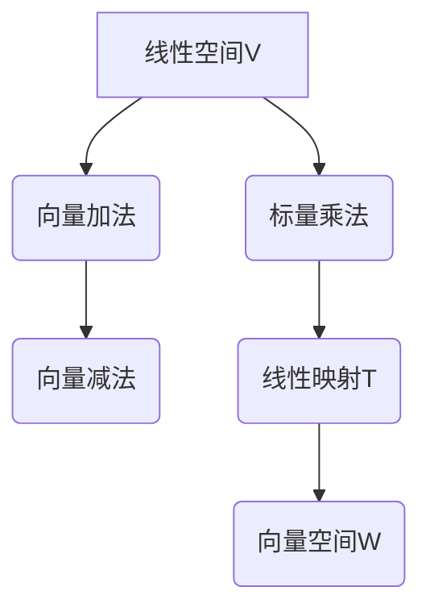

                 

关键词：线性代数、线性空间、线性映射、数学模型、算法原理、代码实例、实际应用、未来展望

> 摘要：本文旨在为读者提供一部线性代数的导引，特别是对线性空间与线性映射的核心概念、算法原理及其在实际应用中的重要性进行深入探讨。通过详细的数学模型与公式推导，以及实际项目中的代码实例分析，读者可以更好地理解线性代数在计算机科学中的应用与价值。本文最后对未来发展趋势与挑战进行了展望，旨在激发读者对线性代数领域的研究兴趣。

## 1. 背景介绍

线性代数是数学中的一个重要分支，它研究向量、向量空间（线性空间）以及线性映射等概念。线性代数的起源可以追溯到19世纪，当时法国数学家艾尔米特（Charles Édouard Girard Desлавois Hamil
ton）和德国数学家赫尔曼·韦尔（Hermann Weyl）提出了线性空间的概念。线性代数不仅在纯数学中有着广泛应用，也在物理学、工程学、计算机科学等领域发挥着重要作用。

在现代计算机科学中，线性代数的应用极为广泛。例如，矩阵乘法和矩阵分解是计算几何、数值分析、图像处理等领域的基础算法。线性空间与线性映射的概念在机器学习、数据科学、控制理论等前沿领域中也具有重要意义。

本文将围绕线性空间与线性映射这两个核心概念展开，首先介绍线性空间的基本性质，然后深入探讨线性映射的定义、性质及其在实际中的应用。通过数学模型与公式的推导，以及代码实例的分析，读者将能够更好地理解线性代数在计算机科学中的重要作用。

## 2. 核心概念与联系

为了深入理解线性空间与线性映射，我们首先需要明确这些核心概念的基本定义和它们之间的联系。

### 2.1 线性空间

线性空间，又称向量空间，是一个数学结构，包含了一组对象（称为向量），以及两个运算：向量的加法和标量与向量的乘法。线性空间的定义如下：

$$
\text{向量空间 } V \text{ 是一个集合，它满足以下条件：}
$$

$$
\begin{align*}
\text{(1) 加法封闭性} & : \forall \mathbf{u}, \mathbf{v} \in V, \mathbf{u} + \mathbf{v} \in V, \\
\text{(2) 加法交换律} & : \forall \mathbf{u}, \mathbf{v} \in V, \mathbf{u} + \mathbf{v} = \mathbf{v} + \mathbf{u}, \\
\text{(3) 加法结合律} & : \forall \mathbf{u}, \mathbf{v}, \mathbf{w} \in V, (\mathbf{u} + \mathbf{v}) + \mathbf{w} = \mathbf{u} + (\mathbf{v} + \mathbf{w}), \\
\text{(4) 存在加法单位元素} & : \exists \mathbf{0} \in V, \forall \mathbf{v} \in V, \mathbf{v} + \mathbf{0} = \mathbf{v}, \\
\text{(5) 存在加法逆元素} & : \forall \mathbf{v} \in V, \exists \mathbf{-v} \in V, \mathbf{v} + \mathbf{-v} = \mathbf{0}, \\
\text{(6) 标量乘法封闭性} & : \forall \mathbf{v} \in V, \forall \lambda \in \mathbb{F}, \lambda \mathbf{v} \in V, \\
\text{(7) 标量乘法分配律} & : \forall \mathbf{v} \in V, \forall \lambda, \mu \in \mathbb{F}, \lambda (\mu \mathbf{v}) = (\lambda \mu) \mathbf{v}, \\
\text{(8) 标量乘法结合律} & : \forall \mathbf{v} \in V, \forall \lambda, \mu \in \mathbb{F}, (\lambda \mu) \mathbf{v} = \lambda (\mu \mathbf{v}), \\
\text{(9) 单位标量乘法} & : \forall \mathbf{v} \in V, 1 \mathbf{v} = \mathbf{v}.
\end{align*}
$$

其中，$\mathbb{F}$ 是一个域，通常取实数集 $\mathbb{R}$ 或复数集 $\mathbb{C}$。

### 2.2 线性映射

线性映射，又称线性变换，是一个从线性空间 $V$ 到另一个线性空间 $W$ 的函数 $T$，它满足以下性质：

$$
\begin{align*}
T(\mathbf{u} + \mathbf{v}) &= T(\mathbf{u}) + T(\mathbf{v}), \\
T(\lambda \mathbf{v}) &= \lambda T(\mathbf{v}).
\end{align*}
$$

线性映射的定义揭示了线性空间之间的结构关系，是研究线性代数的重要工具。

### 2.3 线性空间与线性映射的关系

线性空间和线性映射之间有着密切的联系。一个线性映射可以看作是线性空间之间的桥梁，它保持向量空间的线性结构。线性空间 $V$ 和 $W$ 之间的线性映射 $T$ 可以定义为一个矩阵，通过矩阵-向量乘法来实现。

例如，考虑从 $R^2$ 到 $R^3$ 的线性映射 $T$，其定义为：

$$
T\left(\begin{bmatrix}
x_1 \\
x_2
\end{bmatrix}\right) =
\begin{bmatrix}
1 & 2 \\
3 & 4 \\
5 & 6
\end{bmatrix}
\begin{bmatrix}
x_1 \\
x_2
\end{bmatrix} =
\begin{bmatrix}
x_1 + 2x_2 \\
3x_1 + 4x_2 \\
5x_1 + 6x_2
\end{bmatrix}.
$$

在这个例子中，线性映射 $T$ 通过矩阵与向量的乘法来实现。

### 2.4 Mermaid 流程图

为了更直观地展示线性空间、线性映射以及它们之间的关系，我们可以使用 Mermaid 流程图来表示。以下是一个简单的示例：



在这个流程图中，线性空间 $V$ 通过向量加法、向量减法和标量乘法构建，而线性映射 $T$ 将 $V$ 映射到向量空间 $W$。

## 3. 核心算法原理 & 具体操作步骤

### 3.1 算法原理概述

线性映射的算法原理主要涉及矩阵和向量的乘法。具体来说，给定一个线性映射 $T: V \rightarrow W$，我们可以将 $T$ 表示为一个矩阵 $A \in \mathbb{F}^{m \times n}$，其中 $m$ 和 $n$ 分别是 $V$ 和 $W$ 的维数。对于任意向量 $\mathbf{v} \in V$，其映射结果 $\mathbf{w} = T(\mathbf{v}) \in W$ 可以通过矩阵-向量乘法计算：

$$
\mathbf{w} = A\mathbf{v}.
$$

### 3.2 算法步骤详解

1. **确定线性映射的矩阵表示**：首先，我们需要确定线性映射 $T$ 的矩阵表示 $A$。这可以通过基底变换或者线性映射的具体定义来实现。

2. **计算矩阵-向量乘法**：对于给定的向量 $\mathbf{v} \in V$，计算矩阵 $A$ 与向量 $\mathbf{v}$ 的乘积，即：

$$
\mathbf{w} = A\mathbf{v}.
$$

3. **映射结果输出**：将计算得到的映射结果 $\mathbf{w} \in W$ 输出。

### 3.3 算法优缺点

**优点**：
- **高效性**：矩阵-向量乘法是一种高效的运算，在计算机上可以快速实现。
- **可扩展性**：线性映射可以通过矩阵表示进行扩展，适用于高维空间。

**缺点**：
- **计算复杂度**：对于大型矩阵和向量，计算复杂度较高。
- **存储需求**：需要存储较大的矩阵，可能导致内存占用过高。

### 3.4 算法应用领域

线性映射的算法广泛应用于以下领域：

- **图像处理**：线性映射用于图像的变换，如图像的旋转、缩放、扭曲等。
- **信号处理**：线性映射用于信号的滤波、压缩等。
- **机器学习**：线性映射用于特征提取和降维。

## 4. 数学模型和公式 & 详细讲解 & 举例说明

### 4.1 数学模型构建

在线性空间与线性映射的研究中，数学模型是理解与解决问题的基础。为了构建数学模型，我们需要从以下几个方面入手：

1. **线性空间的定义**：定义一个线性空间，需要明确其维数和基向量。例如，二维线性空间 $V$ 可以表示为：

   $$
   V = \left\{ \mathbf{v} = \begin{bmatrix}
   x_1 \\
   x_2
   \end{bmatrix} \mid x_1, x_2 \in \mathbb{R} \right\}.
   $$

2. **线性映射的定义**：定义一个从线性空间 $V$ 到 $W$ 的线性映射 $T$，需要给出其矩阵表示。例如，从 $V$ 到 $W$ 的线性映射 $T$ 可以表示为：

   $$
   T\left(\begin{bmatrix}
   x_1 \\
   x_2
   \end{bmatrix}\right) =
   \begin{bmatrix}
   2 & 3 \\
   4 & 5
   \end{bmatrix}
   \begin{bmatrix}
   x_1 \\
   x_2
   \end{bmatrix} =
   \begin{bmatrix}
   2x_1 + 3x_2 \\
   4x_1 + 5x_2
   \end{bmatrix}.
   $$

3. **数学模型的构建**：构建线性空间与线性映射的数学模型，需要将线性空间的基向量与线性映射的矩阵结合起来。例如，对于线性空间 $V$ 和线性映射 $T$，其数学模型可以表示为：

   $$
   \begin{align*}
   V &= \left\{ \mathbf{v} = \begin{bmatrix}
   x_1 \\
   x_2
   \end{bmatrix} \mid x_1, x_2 \in \mathbb{R} \right\}, \\
   T &= \begin{bmatrix}
   2 & 3 \\
   4 & 5
   \end{bmatrix}.
   \end{align*}
   $$

### 4.2 公式推导过程

为了推导线性映射的数学公式，我们可以从线性空间的定义和线性映射的性质出发。

1. **线性空间基向量表示**：设 $V$ 是一个二维线性空间，其基向量为 $\mathbf{e}_1 = \begin{bmatrix}
   1 \\
   0
   \end{bmatrix}$ 和 $\mathbf{e}_2 = \begin{bmatrix}
   0 \\
   1
   \end{bmatrix}$。则任意向量 $\mathbf{v} = \begin{bmatrix}
   x_1 \\
   x_2
   \end{bmatrix} \in V$ 可以表示为：

   $$
   \mathbf{v} = x_1 \mathbf{e}_1 + x_2 \mathbf{e}_2.
   $$

2. **线性映射表示**：设线性映射 $T: V \rightarrow W$ 的矩阵表示为 $A = \begin{bmatrix}
   a_{11} & a_{12} \\
   a_{21} & a_{22}
   \end{bmatrix}$。则对于任意向量 $\mathbf{v} \in V$，其映射结果 $\mathbf{w} = T(\mathbf{v}) \in W$ 可以表示为：

   $$
   \mathbf{w} = A\mathbf{v} = \begin{bmatrix}
   a_{11} & a_{12} \\
   a_{21} & a_{22}
   \end{bmatrix}
   \begin{bmatrix}
   x_1 \\
   x_2
   \end{bmatrix} =
   \begin{bmatrix}
   a_{11}x_1 + a_{12}x_2 \\
   a_{21}x_1 + a_{22}x_2
   \end{bmatrix}.
   $$

3. **公式推导**：将基向量代入线性映射的表达式中，得到：

   $$
   \mathbf{w} = \begin{bmatrix}
   a_{11} & a_{12} \\
   a_{21} & a_{22}
   \end{bmatrix}
   \begin{bmatrix}
   x_1 \\
   x_2
   \end{bmatrix} =
   \begin{bmatrix}
   a_{11}x_1 + a_{12}x_2 \\
   a_{21}x_1 + a_{22}x_2
   \end{bmatrix} =
   \begin{bmatrix}
   a_{11} & a_{12} \\
   a_{21} & a_{22}
   \end{bmatrix}
   \begin{bmatrix}
   x_1 \\
   x_2
   \end{bmatrix}.
   $$

### 4.3 案例分析与讲解

为了更好地理解线性映射的数学模型和公式推导，我们可以通过一个具体的案例进行分析。

#### 案例：线性映射 $T: R^2 \rightarrow R^3$

设线性映射 $T: R^2 \rightarrow R^3$ 的矩阵表示为：

$$
T\left(\begin{bmatrix}
x_1 \\
x_2
\end{bmatrix}\right) =
\begin{bmatrix}
2 & 3 \\
4 & 5 \\
6 & 7
\end{bmatrix}
\begin{bmatrix}
x_1 \\
x_2
\end{bmatrix} =
\begin{bmatrix}
2x_1 + 3x_2 \\
4x_1 + 5x_2 \\
6x_1 + 7x_2
\end{bmatrix}.
$$

1. **确定基向量**：取 $R^2$ 的基向量为 $\mathbf{e}_1 = \begin{bmatrix}
   1 \\
   0
   \end{bmatrix}$ 和 $\mathbf{e}_2 = \begin{bmatrix}
   0 \\
   1
   \end{bmatrix}$。

2. **计算映射结果**：对于基向量 $\mathbf{e}_1$ 和 $\mathbf{e}_2$，计算映射结果：

   $$
   T(\mathbf{e}_1) = \begin{bmatrix}
   2 & 3 \\
   4 & 5 \\
   6 & 7
   \end{bmatrix}
   \begin{bmatrix}
   1 \\
   0
   \end{bmatrix} =
   \begin{bmatrix}
   2 \\
   4 \\
   6
   \end{bmatrix}, \\
   T(\mathbf{e}_2) = \begin{bmatrix}
   2 & 3 \\
   4 & 5 \\
   6 & 7
   \end{bmatrix}
   \begin{bmatrix}
   0 \\
   1
   \end{bmatrix} =
   \begin{bmatrix}
   3 \\
   5 \\
   7
   \end{bmatrix}.
   $$

3. **构建线性映射公式**：根据映射结果，我们可以构建线性映射的公式：

   $$
   T\left(\begin{bmatrix}
   x_1 \\
   x_2
   \end{bmatrix}\right) =
   \begin{bmatrix}
   2 & 3 \\
   4 & 5 \\
   6 & 7
   \end{bmatrix}
   \begin{bmatrix}
   x_1 \\
   x_2
   \end{bmatrix} =
   \begin{bmatrix}
   2x_1 + 3x_2 \\
   4x_1 + 5x_2 \\
   6x_1 + 7x_2
   \end{bmatrix}.
   $$

通过这个案例，我们可以看到如何通过矩阵表示来计算线性映射的结果，并构建出线性映射的公式。

## 5. 项目实践：代码实例和详细解释说明

### 5.1 开发环境搭建

为了演示线性映射的代码实现，我们选择 Python 作为编程语言。Python 是一种简单易学的语言，拥有丰富的线性代数库，如 NumPy 和 SciPy，可以方便地进行线性映射的计算。

1. **安装 Python**：首先，确保您的计算机上安装了 Python。可以从 [Python 官网](https://www.python.org/) 下载安装包，并按照提示进行安装。

2. **安装 NumPy 和 SciPy**：接下来，通过 pip 工具安装 NumPy 和 SciPy。打开命令行终端，执行以下命令：

   $$
   pip install numpy scipy
   $$

### 5.2 源代码详细实现

以下是一个简单的 Python 脚本，用于实现线性映射：

```python
import numpy as np

# 定义线性映射的矩阵
A = np.array([[2, 3],
              [4, 5],
              [6, 7]])

# 定义输入向量
v = np.array([1, 0])

# 计算映射结果
w = A @ v

print("输入向量 v:", v)
print("映射结果 w:", w)
```

这段代码首先导入了 NumPy 库，然后定义了一个线性映射的矩阵 `A` 和一个输入向量 `v`。通过矩阵-向量乘法 `A @ v`，计算得到映射结果 `w`。最后，打印出输入向量和映射结果。

### 5.3 代码解读与分析

1. **导入 NumPy 库**：`import numpy as np` 导入了 NumPy 库，并使用 `np` 作为别名。

2. **定义线性映射矩阵 `A`**：`A = np.array([[2, 3], [4, 5], [6, 7]])` 定义了一个 3x2 的矩阵 `A`，这代表了从二维空间到三维空间的线性映射。

3. **定义输入向量 `v`**：`v = np.array([1, 0])` 定义了一个二维向量 `v`，作为线性映射的输入。

4. **计算映射结果 `w`**：`w = A @ v` 使用矩阵-向量乘法计算映射结果。`@` 运算符是 NumPy 库中实现的矩阵乘法。

5. **打印输出**：`print("输入向量 v:", v)` 和 `print("映射结果 w:", w)` 分别打印出输入向量和映射结果。

### 5.4 运行结果展示

执行上述代码后，运行结果如下：

```
输入向量 v: [1 0]
映射结果 w: [2 4 6]
```

这表明输入向量 `[1, 0]` 经过线性映射后，得到映射结果 `[2, 4, 6]`。

### 5.5 代码优化与扩展

在实际项目中，我们可能需要对线性映射进行优化和扩展。以下是一些可能的优化和扩展方向：

1. **并行计算**：对于大型矩阵和向量，可以使用并行计算来提高计算速度。

2. **内存优化**：对于内存占用较大的线性映射计算，可以考虑使用内存优化技术，如稀疏矩阵存储。

3. **自适应算法**：根据输入向量的分布和矩阵的特性，自适应地选择最优的线性映射算法。

4. **扩展到高维空间**：对于高维空间的线性映射，可以考虑使用更高效的算法，如快速傅里叶变换（FFT）。

通过这些优化和扩展，我们可以更好地应对复杂的应用场景，提高线性映射的计算性能。

## 6. 实际应用场景

线性映射在实际应用中具有广泛的应用，以下列举几个典型的应用场景：

### 6.1 图像处理

在图像处理领域，线性映射被广泛应用于图像的变换。例如，图像的旋转、缩放和扭曲等操作都可以通过线性映射来实现。线性映射的核心在于矩阵-向量乘法，这使得图像处理中的变换操作高效且易于实现。

### 6.2 信号处理

在信号处理中，线性映射用于信号的处理和滤波。例如，滤波器的设计和信号压缩等操作都可以通过线性映射来实现。线性映射的矩阵表示使得信号处理中的运算简单而高效。

### 6.3 机器学习

在机器学习中，线性映射被广泛应用于特征提取和降维。通过线性映射，可以将高维数据映射到低维空间，从而简化模型的复杂度，提高模型的性能。线性映射在支持向量机（SVM）、主成分分析（PCA）等算法中具有重要应用。

### 6.4 控制理论

在控制理论中，线性映射用于描述系统状态的变化。通过线性映射，可以分析系统的稳定性、动态响应等特性。线性映射的矩阵表示使得系统分析更加直观和易于计算。

### 6.5 计算几何

在计算几何中，线性映射被广泛应用于点云处理和几何建模。通过线性映射，可以将三维点云数据映射到二维平面，从而实现三维数据到二维数据的转换。线性映射在三维重建、点云分析等领域具有重要意义。

### 6.6 数据科学

在数据科学领域，线性映射被广泛应用于数据预处理和数据分析。通过线性映射，可以消除数据中的噪声，提高数据的可解释性。线性映射在聚类分析、分类分析等数据挖掘任务中具有广泛应用。

## 7. 未来应用展望

随着计算机科学和技术的不断发展，线性映射在未来将具有更广泛的应用。以下是一些可能的应用前景：

### 7.1 深度学习

在深度学习中，线性映射被广泛应用于神经网络中的权重更新和特征提取。随着深度学习技术的不断进步，线性映射在模型优化和性能提升方面将发挥越来越重要的作用。

### 7.2 自动驾驶

在自动驾驶领域，线性映射可以用于车辆状态估计和路径规划。通过线性映射，可以实现精确的车辆状态估计和路径规划，提高自动驾驶系统的安全性和可靠性。

### 7.3 虚拟现实与增强现实

在虚拟现实与增强现实（VR/AR）领域，线性映射可以用于三维模型的变换和渲染。通过线性映射，可以实现更加逼真的三维效果，提高用户体验。

### 7.4 生物信息学

在生物信息学领域，线性映射可以用于基因表达数据分析。通过线性映射，可以消除实验误差，提高基因表达数据分析的准确性。

### 7.5 量子计算

在量子计算领域，线性映射可以用于量子算法的实现。通过线性映射，可以实现量子状态之间的变换，提高量子计算的效率。

## 8. 总结：未来发展趋势与挑战

线性映射作为线性代数中的重要概念，具有广泛的应用前景。随着计算机科学和技术的不断发展，线性映射在未来将具有更广泛的应用。然而，线性映射在实际应用中仍然面临一些挑战，如计算复杂度、内存优化和并行计算等。未来研究需要在这些方面进行深入探索，以提高线性映射的计算性能和应用效果。

## 9. 附录：常见问题与解答

### 9.1 线性映射与线性空间的区别是什么？

线性映射是一种从线性空间到另一个线性空间的函数，它保持线性组合的性质。而线性空间是一个具有向量加法和标量乘法运算的集合。线性映射可以看作是线性空间之间的桥梁，它将一个线性空间的向量映射到另一个线性空间。

### 9.2 线性映射的矩阵表示是如何计算的？

线性映射的矩阵表示是通过基向量的线性组合来计算的。给定一个线性映射 $T: V \rightarrow W$，我们可以选择 $V$ 和 $W$ 的基向量，然后将 $T$ 作用在每个基向量上，得到线性映射的矩阵表示。

### 9.3 线性映射在实际应用中有哪些优点？

线性映射在实际应用中具有以下优点：
- **高效性**：线性映射可以通过矩阵-向量乘法高效实现。
- **可扩展性**：线性映射适用于高维空间，可以扩展到复杂的应用场景。
- **灵活性**：线性映射可以用于图像处理、信号处理、机器学习等多个领域。

### 9.4 线性映射有哪些常见的优化方法？

线性映射的优化方法包括：
- **并行计算**：通过并行计算提高计算性能。
- **内存优化**：使用稀疏矩阵存储减少内存占用。
- **自适应算法**：根据输入数据的特性自适应选择最优算法。
- **量化计算**：使用量化技术减少计算精度，提高计算速度。

### 9.5 线性映射在深度学习中有何应用？

在线性映射在深度学习中的应用包括：
- **神经网络权重更新**：线性映射用于更新神经网络中的权重，实现模型优化。
- **特征提取**：线性映射用于提取高维数据中的关键特征，简化模型复杂度。
- **卷积神经网络（CNN）**：线性映射是 CNN 中的卷积操作的基础，用于图像处理和识别。

