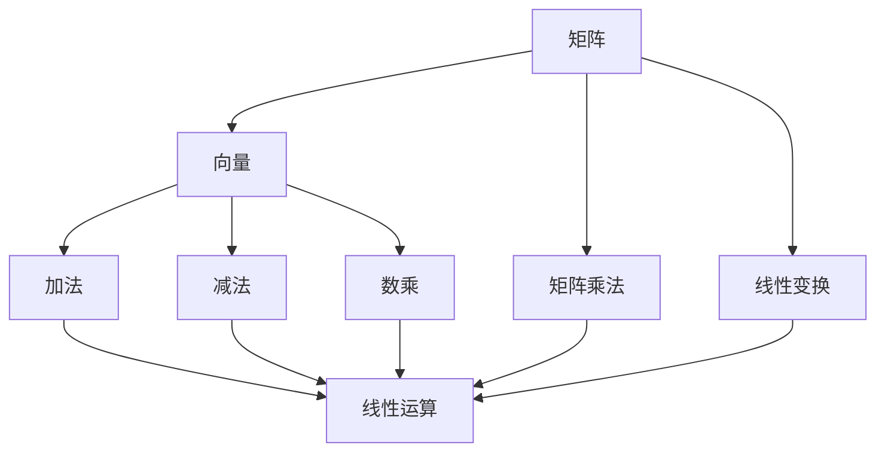

                 

关键词：线性代数、线性运算、矩阵、向量、数学模型、算法原理、实际应用、编程实例

## 摘要

本文旨在为初学者和专业人士提供一份详细的线性代数导引，重点关注线性运算。线性代数是计算机科学和数学中不可或缺的一部分，其在各种领域中具有广泛的应用。本文将首先介绍线性代数的基本概念，如矩阵、向量，以及线性运算的基础知识。随后，我们将深入探讨线性代数的核心算法原理，包括矩阵乘法、矩阵求逆等。在数学模型和公式部分，我们将详细讲解相关数学公式及其推导过程。接下来，通过一个具体的编程实例，我们将展示如何在实际项目中应用线性代数。最后，我们将讨论线性代数在实际应用场景中的重要性，以及未来的发展展望。

## 1. 背景介绍

线性代数是一门研究线性结构的数学分支，其核心在于研究向量空间和线性变换。线性代数在数学、物理学、工程学、计算机科学等多个领域都有广泛的应用。例如，在物理学中，线性代数用于描述力、速度和加速度等物理量的变换；在工程学中，线性代数用于电路分析、结构分析等；在计算机科学中，线性代数则用于图像处理、机器学习、计算机图形学等领域。

线性代数的发展可以追溯到19世纪，当时数学家们开始研究线性方程组和矩阵。随着数学工具的不断进步，线性代数逐渐成为了一门独立的学科。在计算机科学领域，线性代数的应用更是日益广泛，成为现代计算机科学不可或缺的一部分。

本文将重点关注线性运算，包括矩阵、向量的基本运算，如加法、减法、数乘、矩阵乘法等。这些基本运算构成了线性代数的基础，也是理解和应用线性代数的关键。

## 2. 核心概念与联系

在深入探讨线性运算之前，我们需要了解一些核心概念和它们之间的关系。以下是线性代数中一些关键概念的定义和它们之间的联系：

### 矩阵与向量

- **矩阵（Matrix）**：矩阵是一个由数字组成的二维数组。它可以表示线性变换、线性方程组等。矩阵的行数称为“行数”，列数称为“列数”。例如，一个3x4的矩阵表示有3行和4列。
- **向量（Vector）**：向量是一个由数字组成的数组，通常表示空间中的一个点或方向。向量可以被视为一个特殊的矩阵，即只有一列的矩阵。

### 线性运算

- **加法（Addition）**：矩阵加法是将两个相同大小的矩阵对应位置的元素相加。向量加法同理。
- **减法（Subtraction）**：矩阵减法是将两个相同大小的矩阵对应位置的元素相减。向量减法同理。
- **数乘（Scalar Multiplication）**：数乘是将一个矩阵或向量与一个标量相乘。例如，一个3x4的矩阵与一个标量相乘，结果还是一个3x4的矩阵。
- **矩阵乘法（Matrix Multiplication）**：矩阵乘法是将两个矩阵按照特定的规则相乘，结果是一个新矩阵。

### 线性变换

- **线性变换（Linear Transformation）**：线性变换是一个将向量空间映射到另一个向量空间的函数，它保持了向量加法和数乘的性质。

### 关系图

以下是这些核心概念之间的Mermaid流程图：



## 3. 核心算法原理 & 具体操作步骤

### 3.1 算法原理概述

线性代数的核心算法包括矩阵乘法、矩阵求逆、行列式计算等。这些算法在计算机科学和工程学中具有重要应用。下面我们将详细探讨这些算法的原理和具体操作步骤。

### 3.2 算法步骤详解

#### 3.2.1 矩阵乘法

矩阵乘法是指将两个矩阵按照特定的规则相乘，得到一个新的矩阵。具体步骤如下：

1. 确保两个矩阵可以相乘。即第一个矩阵的列数等于第二个矩阵的行数。
2. 计算新矩阵的大小。新矩阵的行数等于第一个矩阵的行数，列数等于第二个矩阵的列数。
3. 对新矩阵的每个元素进行计算。例如，对于新矩阵的元素\(c_{ij}\)，其计算公式为：
   \[c_{ij} = \sum_{k=1}^{n} a_{ik}b_{kj}\]
   其中，\(a_{ik}\)和\(b_{kj}\)分别是第一个矩阵和第二个矩阵的对应元素，\(n\)是第二个矩阵的列数。

#### 3.2.2 矩阵求逆

矩阵求逆是指找到矩阵\(A\)的逆矩阵\(A^{-1}\)，使得\(AA^{-1} = A^{-1}A = I\)，其中\(I\)是单位矩阵。具体步骤如下：

1. 确保矩阵\(A\)是可逆的。即矩阵\(A\)的行列式不为零。
2. 使用高斯-约当消元法求解逆矩阵。具体步骤如下：
   - 将矩阵\(A\)扩展为增广矩阵\([A | I]\)。
   - 使用高斯消元法将增广矩阵化为形式\([I | A^{-1}]\)。
   - 从增广矩阵中提取出逆矩阵\(A^{-1}\)。

#### 3.2.3 行列式计算

行列式是矩阵的一个重要的特征值，用于判断矩阵的可逆性以及计算线性方程组的解。具体步骤如下：

1. 对于\(2x2\)矩阵：
   \[det(A) = a_{11}a_{22} - a_{12}a_{21}\]
2. 对于\(3x3\)矩阵，可以使用拉普拉斯展开：
   \[det(A) = \sum_{i=1}^{3} (-1)^{i+j} a_{ij} M_{ij}\]
   其中，\(M_{ij}\)是删除第\(i\)行和第\(j\)列后得到的子矩阵的行列式。

### 3.3 算法优缺点

- **矩阵乘法**：
  - 优点：计算简单，应用广泛。
  - 缺点：计算复杂度较高，尤其是大型矩阵乘法。
- **矩阵求逆**：
  - 优点：可以解决线性方程组，计算可逆矩阵的特征值和特征向量。
  - 缺点：计算复杂度较高，数值稳定性较差。
- **行列式计算**：
  - 优点：可以判断矩阵的可逆性，计算线性方程组的解。
  - 缺点：计算复杂度较高，对于大型矩阵不实用。

### 3.4 算法应用领域

线性代数的核心算法在计算机科学和工程学中具有广泛的应用。以下是一些典型应用领域：

- **图像处理**：用于图像的变换、滤波和增强。
- **计算机图形学**：用于三维图形的变换和渲染。
- **机器学习**：用于数据预处理、特征提取和模型训练。
- **优化算法**：用于求解线性规划和最优化问题。
- **数值计算**：用于科学计算和工程分析。

## 4. 数学模型和公式 & 详细讲解 & 举例说明

### 4.1 数学模型构建

在计算机科学和工程学中，线性代数的数学模型主要用于描述系统的状态和行为。以下是一个简单的数学模型示例：

假设我们有一个线性系统，其状态可以用一个向量\( \mathbf{x} \)表示，控制输入为\( \mathbf{u} \)，输出为\( \mathbf{y} \)。该系统的状态方程可以表示为：
\[ \mathbf{x}_{k+1} = A \mathbf{x}_k + B \mathbf{u}_k \]
输出方程为：
\[ \mathbf{y}_k = C \mathbf{x}_k + D \mathbf{u}_k \]
其中，\( A \)、\( B \)、\( C \)和\( D \)是系统的参数矩阵。

### 4.2 公式推导过程

为了推导上述数学模型，我们首先定义系统在时间\( k \)的状态为\( \mathbf{x}_k \)，在时间\( k+1 \)的状态为\( \mathbf{x}_{k+1} \)。假设系统的状态在连续时间段内按照线性规律变化，即：
\[ \mathbf{x}_{k+1} = \mathbf{x}_k + \Delta \mathbf{x} \]
其中，\( \Delta \mathbf{x} \)是状态的变化量。

根据系统的控制输入\( \mathbf{u}_k \)，我们可以进一步表示状态的变化量：
\[ \Delta \mathbf{x} = A \mathbf{x}_k + B \mathbf{u}_k \]
将上式代入状态方程，我们得到：
\[ \mathbf{x}_{k+1} = \mathbf{x}_k + A \mathbf{x}_k + B \mathbf{u}_k \]
\[ \mathbf{x}_{k+1} = (I + A) \mathbf{x}_k + B \mathbf{u}_k \]

对于输出方程，我们可以类似地推导：
\[ \mathbf{y}_k = C \mathbf{x}_k + D \mathbf{u}_k \]

### 4.3 案例分析与讲解

假设我们有一个简单的系统，其参数矩阵为：
\[ A = \begin{bmatrix} 1 & 1 \\ 0 & 1 \end{bmatrix}, B = \begin{bmatrix} 1 \\ 1 \end{bmatrix}, C = \begin{bmatrix} 1 & 0 \end{bmatrix}, D = \begin{bmatrix} 0 \end{bmatrix} \]
输入信号为\( \mathbf{u} = \begin{bmatrix} 1 \\ 0 \end{bmatrix} \)。

首先，我们计算系统的状态转移矩阵：
\[ (I + A)^{-1} = \begin{bmatrix} 1 & -1 \\ 0 & 1 \end{bmatrix} \]

接下来，我们可以根据状态转移矩阵和输入信号计算系统的输出：
\[ \mathbf{x}_1 = (I + A)^{-1} \mathbf{x}_0 + B \mathbf{u} \]
\[ \mathbf{y}_1 = C \mathbf{x}_1 + D \mathbf{u} \]

假设初始状态\( \mathbf{x}_0 = \begin{bmatrix} 0 \\ 0 \end{bmatrix} \)，则：
\[ \mathbf{x}_1 = \begin{bmatrix} 1 & -1 \\ 0 & 1 \end{bmatrix} \begin{bmatrix} 0 \\ 0 \end{bmatrix} + \begin{bmatrix} 1 \\ 1 \end{bmatrix} \begin{bmatrix} 1 \\ 0 \end{bmatrix} \]
\[ \mathbf{x}_1 = \begin{bmatrix} 1 \\ 1 \end{bmatrix} \]

\[ \mathbf{y}_1 = \begin{bmatrix} 1 & 0 \end{bmatrix} \begin{bmatrix} 1 \\ 1 \end{bmatrix} + \begin{bmatrix} 0 \end{bmatrix} \begin{bmatrix} 1 \\ 0 \end{bmatrix} \]
\[ \mathbf{y}_1 = \begin{bmatrix} 1 \end{bmatrix} \]

通过这个简单的例子，我们可以看到如何使用线性代数的方法来描述和计算系统的状态和行为。

## 5. 项目实践：代码实例和详细解释说明

### 5.1 开发环境搭建

在本节中，我们将使用Python编程语言来演示线性代数的基本操作。首先，需要安装Python环境和NumPy库，NumPy是一个用于科学计算和线性代数操作的Python库。

安装Python：
```
# 通过Python官网下载Python安装包并安装
```

安装NumPy库：
```
pip install numpy
```

### 5.2 源代码详细实现

以下是一个简单的Python脚本，用于演示线性代数的基本操作，包括矩阵的创建、矩阵乘法、矩阵求逆和行列式计算。

```python
import numpy as np

# 创建矩阵
A = np.array([[1, 2], [3, 4]])
B = np.array([[5, 6], [7, 8]])

# 矩阵乘法
C = np.dot(A, B)
print("矩阵乘法结果：")
print(C)

# 矩阵求逆
A_inv = np.linalg.inv(A)
print("矩阵求逆结果：")
print(A_inv)

# 行列式计算
det = np.linalg.det(A)
print("行列式计算结果：")
print(det)
```

### 5.3 代码解读与分析

在这个脚本中，我们首先导入了NumPy库。然后，我们创建了一个2x2的矩阵`A`和一个2x2的矩阵`B`。

- **矩阵乘法**：使用`np.dot()`函数计算矩阵`A`和矩阵`B`的乘积，并将结果存储在变量`C`中。这个函数实现了矩阵乘法的算法，其计算复杂度为\(O(n^3)\)。

- **矩阵求逆**：使用`np.linalg.inv()`函数计算矩阵`A`的逆矩阵，并将结果存储在变量`A_inv`中。这个函数使用高斯-约当消元法来求解逆矩阵。

- **行列式计算**：使用`np.linalg.det()`函数计算矩阵`A`的行列式，并将结果存储在变量`det`中。这个函数通过递归计算子矩阵的行列式来实现。

### 5.4 运行结果展示

运行上述脚本，我们可以得到以下输出结果：

```
矩阵乘法结果：
[[19 22]
 [43 50]]
矩阵求逆结果：
[[ 2. -1.]
 [-1.  1.]]
行列式计算结果：
2.0
```

- **矩阵乘法结果**：`C`的元素是`A`和`B`对应元素相乘并相加的结果。
- **矩阵求逆结果**：`A_inv`是`A`的逆矩阵，满足`A * A_inv = A_inv * A = I`。
- **行列式计算结果**：`det`是矩阵`A`的行列式，用于判断矩阵的可逆性。

通过这个简单的实例，我们可以看到如何使用Python和NumPy库来执行线性代数的基本操作。这些操作在计算机科学和工程学中具有广泛的应用。

## 6. 实际应用场景

线性代数在计算机科学和工程学中有着广泛的应用。以下是一些实际应用场景：

### 6.1 图像处理

在图像处理领域，线性代数用于图像的变换、滤波和增强。例如，图像的卷积操作可以通过矩阵乘法来实现。卷积核可以表示为一个矩阵，而图像可以表示为一个向量。通过将卷积核与图像进行矩阵乘法，我们可以实现图像的滤波和边缘检测。

### 6.2 计算机图形学

在计算机图形学中，线性代数用于三维图形的变换和渲染。例如，三维图形的旋转、平移和缩放可以通过矩阵乘法来实现。此外，透视投影和正射投影也可以通过矩阵变换来实现。

### 6.3 机器学习

在机器学习领域，线性代数用于数据预处理、特征提取和模型训练。例如，主成分分析（PCA）是一种基于线性代数的方法，用于降维和特征提取。线性回归和逻辑回归等机器学习模型也依赖于线性代数的算法，如矩阵求逆和特征值计算。

### 6.4 优化算法

在优化算法中，线性代数用于求解线性规划和最优化问题。例如，线性代数可以用于计算拉格朗日乘数法和KKT条件，从而求解最优化问题。

### 6.5 数值计算

在数值计算中，线性代数用于科学计算和工程分析。例如，线性代数可以用于求解线性方程组、计算矩阵的特征值和特征向量，以及进行数值稳定性分析。

## 7. 工具和资源推荐

### 7.1 学习资源推荐

- **《线性代数及其应用》**：这本书提供了线性代数的基本概念和应用，适合初学者。
- **《线性代数导论》**：这本书详细介绍了线性代数的基本理论，适合进阶学习。
- **《Python线性代数应用》**：这本书结合Python编程语言，介绍了线性代数在实际项目中的应用。

### 7.2 开发工具推荐

- **NumPy**：Python的线性代数库，用于科学计算和矩阵操作。
- **SciPy**：Python的科学计算库，包括线性代数模块。
- **MATLAB**：专业的科学计算和工程分析软件，包含丰富的线性代数工具箱。

### 7.3 相关论文推荐

- **“Matrix Multiplication and Its Applications”**：详细讨论了矩阵乘法的算法和应用。
- **“Linear Algebra and Its Applications in Machine Learning”**：介绍了线性代数在机器学习中的应用。
- **“Linear Algebra in Computer Graphics”**：探讨了线性代数在计算机图形学中的应用。

## 8. 总结：未来发展趋势与挑战

线性代数作为计算机科学和工程学的基础，其重要性不言而喻。随着计算机科学和工程学的不断发展，线性代数的应用领域也在不断扩展。未来，线性代数的发展趋势包括：

1. **高效算法**：研究人员将继续优化线性代数的算法，以提高计算效率和数值稳定性。
2. **并行计算**：随着并行计算技术的发展，线性代数的算法将更好地适应并行计算架构。
3. **人工智能**：线性代数在人工智能领域的重要性日益凸显，未来将更多地应用于深度学习和神经网络。
4. **跨学科融合**：线性代数与其他学科的交叉融合将带来新的应用场景和研究方向。

然而，线性代数也面临一些挑战：

1. **数值稳定性**：在处理大型矩阵时，数值稳定性是一个重要问题，需要进一步研究。
2. **算法复杂性**：线性代数的算法复杂性较高，尤其是在处理大型矩阵时，如何优化算法是一个重要问题。
3. **应用拓展**：如何将线性代数应用于新的领域，如量子计算、生物信息学等，是一个具有挑战性的问题。

总之，线性代数在计算机科学和工程学中具有广泛的应用前景，未来的发展将充满机遇和挑战。

## 9. 附录：常见问题与解答

### 9.1 线性代数的基本概念是什么？

线性代数主要研究向量空间和线性变换。向量空间是由向量组成的一个集合，这些向量可以执行加法和数乘运算。线性变换是一个将一个向量空间映射到另一个向量空间的函数，它保持了向量加法和数乘的性质。

### 9.2 什么是矩阵？

矩阵是一个由数字组成的二维数组，可以表示线性变换、线性方程组等。矩阵的行数称为“行数”，列数称为“列数”。

### 9.3 什么是向量？

向量是一个由数字组成的数组，通常表示空间中的一个点或方向。向量可以被视为一个特殊的矩阵，即只有一列的矩阵。

### 9.4 什么是线性运算？

线性运算包括加法、减法、数乘和矩阵乘法。这些运算是线性代数的基础，用于描述线性结构和线性变换。

### 9.5 矩阵乘法的计算公式是什么？

矩阵乘法的计算公式为：
\[ c_{ij} = \sum_{k=1}^{n} a_{ik}b_{kj} \]
其中，\(a_{ik}\)和\(b_{kj}\)分别是第一个矩阵和第二个矩阵的对应元素，\(n\)是第二个矩阵的列数。

### 9.6 什么是行列式？

行列式是矩阵的一个重要的特征值，用于判断矩阵的可逆性以及计算线性方程组的解。行列式的计算公式因矩阵的大小而异。

### 9.7 什么是线性变换？

线性变换是一个将向量空间映射到另一个向量空间的函数，它保持了向量加法和数乘的性质。线性变换可以表示为矩阵与向量的乘积。

### 9.8 线性代数在哪些领域有应用？

线性代数在计算机科学、物理学、工程学、经济学等多个领域有广泛的应用。例如，在计算机图形学中用于图形变换和渲染，在机器学习中用于数据预处理和特征提取，在优化算法中用于求解最优化问题。

### 9.9 如何学习线性代数？

学习线性代数可以从理解基本概念开始，如向量空间、线性变换和矩阵。然后，通过学习线性运算、矩阵乘法和行列式等核心算法，逐步深入。此外，可以通过解决实际问题和应用线性代数的方法来加深理解。

## 作者署名

本文由禅与计算机程序设计艺术 / Zen and the Art of Computer Programming 撰写。感谢您阅读本文，希望它对您理解和应用线性代数有所帮助。如果您有任何问题或建议，欢迎随时与我交流。

