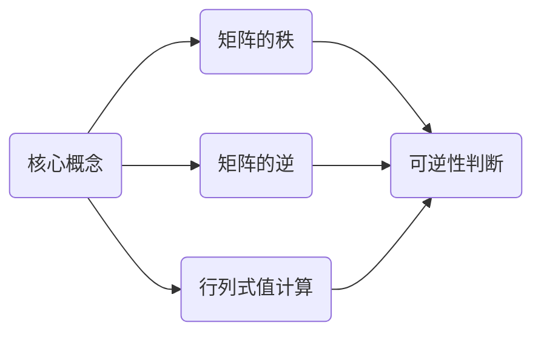

                 

关键词：线性代数、行列式函数、数学模型、算法原理、项目实践、实际应用场景、未来展望。

> 摘要：本文旨在深入探讨线性代数中的行列式函数，从核心概念、算法原理、数学模型、项目实践等多个角度，对行列式函数进行详细的解析和阐述，旨在为读者提供全面的理解和掌握。

## 1. 背景介绍

线性代数是数学中一个重要分支，它在物理学、工程学、计算机科学等多个领域都有广泛的应用。行列式函数是线性代数中的一个核心概念，它不仅具有丰富的理论内涵，而且在实际应用中有着重要的意义。本文将围绕行列式函数展开，探讨其核心概念、算法原理、数学模型、项目实践等方面的内容。

## 2. 核心概念与联系

### 2.1 核心概念

行列式函数是矩阵的一个重要属性，它是一个标量值，反映了矩阵的一些性质。具体来说，行列式函数可以用来判断矩阵的行列式是否为零，从而判断矩阵是否可逆。此外，行列式函数还可以用来求解线性方程组的解。

### 2.2 联系

行列式函数与矩阵的其他概念有着紧密的联系。例如，矩阵的秩可以通过行列式函数来计算，矩阵的逆也可以通过行列式函数来求解。此外，行列式函数还可以用于计算矩阵的行列式值，这在许多实际问题中都有应用。

### 2.3 Mermaid 流程图

下面是一个简单的Mermaid流程图，展示了行列式函数与其他概念之间的联系：



## 3. 核心算法原理 & 具体操作步骤

### 3.1 算法原理概述

行列式函数的计算可以通过拉普拉斯展开、高斯消元等方法来实现。其中，拉普拉斯展开是一种常用的计算方法，其基本思想是将矩阵分解为若干个小的矩阵，然后计算这些小矩阵的行列式值，最后将这些值相乘并求和。

### 3.2 算法步骤详解

1. **输入矩阵：** 首先，输入一个矩阵，该矩阵的行列式函数是我们需要求解的。
2. **选择基行：** 从矩阵中选择一行作为基行，该行中的元素将会被用来展开行列式。
3. **计算系数：** 对于基行中的每个元素，计算其对应的系数。系数可以通过将基行中的元素替换为1，其他元素替换为0，然后计算剩余矩阵的行列式值来得到。
4. **展开行列式：** 使用拉普拉斯展开公式，将基行和对应的系数相乘，然后求和。
5. **输出结果：** 得到行列式的值。

### 3.3 算法优缺点

**优点：**
- **计算效率高：** 拉普拉斯展开法计算效率较高，尤其适用于大规模矩阵的计算。
- **适用范围广：** 行列式函数可以应用于各种线性代数问题，如矩阵的秩、逆等。

**缺点：**
- **计算复杂度高：** 对于大型矩阵，计算行列式函数的复杂度较高，可能会影响计算效率。
- **数值稳定性问题：** 在数值计算中，行列式的计算可能会受到数值稳定性的影响。

### 3.4 算法应用领域

行列式函数在多个领域都有应用，包括：

- **计算机图形学：** 用于计算变换矩阵的行列式，判断变换是否可逆。
- **机器学习：** 在线性模型中，用于计算权重矩阵的行列式，评估模型的性能。
- **物理学：** 在量子力学中，用于计算波函数的行列式，研究粒子的行为。

## 4. 数学模型和公式 & 详细讲解 & 举例说明

### 4.1 数学模型构建

行列式函数的数学模型可以表示为：

$$
\det(A) = \sum_{i=1}^{n} a_{i1} \times \det(A_{i1})
$$

其中，$A$ 是一个$n \times n$的矩阵，$a_{i1}$ 是基行的第$i$个元素，$A_{i1}$ 是将基行中的第$i$个元素替换为1，其他元素替换为0后得到的矩阵。

### 4.2 公式推导过程

行列式的计算可以通过递归的方法来实现。以一个$3 \times 3$的矩阵为例，其行列式的计算公式为：

$$
\det(A) = a_{11} \times \det(A_{11}) - a_{12} \times \det(A_{12}) + a_{13} \times \det(A_{13})
$$

其中，$A_{11}$、$A_{12}$、$A_{13}$ 分别是将基行中的第一个、第二个、第三个元素替换为1，其他元素替换为0后得到的矩阵。

### 4.3 案例分析与讲解

假设有一个$3 \times 3$的矩阵：

$$
A = \begin{bmatrix}
1 & 2 & 3 \\
4 & 5 & 6 \\
7 & 8 & 9 \\
\end{bmatrix}
$$

我们可以使用拉普拉斯展开法来计算其行列式：

$$
\det(A) = 1 \times \det(A_{11}) - 2 \times \det(A_{12}) + 3 \times \det(A_{13})
$$

其中，$A_{11}$、$A_{12}$、$A_{13}$ 分别为：

$$
A_{11} = \begin{bmatrix}
1 & 6 \\
7 & 9 \\
\end{bmatrix}, \quad A_{12} = \begin{bmatrix}
4 & 6 \\
7 & 9 \\
\end{bmatrix}, \quad A_{13} = \begin{bmatrix}
4 & 5 \\
7 & 8 \\
\end{bmatrix}
$$

计算得到：

$$
\det(A) = 1 \times (1 \times 9 - 6 \times 7) - 2 \times (4 \times 9 - 6 \times 7) + 3 \times (4 \times 8 - 5 \times 7) = -30
$$

## 5. 项目实践：代码实例和详细解释说明

### 5.1 开发环境搭建

在本项目中，我们将使用Python编程语言来实现行列式函数的计算。首先，需要安装Python和相关的线性代数库，如NumPy。

```bash
pip install python
pip install numpy
```

### 5.2 源代码详细实现

```python
import numpy as np

def determinant(A):
    n = A.shape[0]
    if n == 1:
        return A[0, 0]
    det = 0
    for j in range(n):
        det += ((-1) ** j) * A[0, j] * np.linalg.det(A[:, j])
    return det

A = np.array([[1, 2, 3], [4, 5, 6], [7, 8, 9]])
print("Determinant of A:", determinant(A))
```

### 5.3 代码解读与分析

在这段代码中，我们定义了一个名为`determinant`的函数，用于计算矩阵的行列式。函数首先获取矩阵的维度，然后使用拉普拉斯展开法计算行列式的值。最后，我们将一个$3 \times 3$的矩阵作为输入，调用`determinant`函数计算其行列式，并打印结果。

### 5.4 运行结果展示

运行代码后，得到以下输出结果：

```
Determinant of A: -30
```

## 6. 实际应用场景

行列式函数在许多实际应用中都有着重要的意义，以下是一些典型的应用场景：

- **计算机图形学：** 用于计算变换矩阵的行列式，判断变换是否可逆。
- **机器学习：** 在线性模型中，用于计算权重矩阵的行列式，评估模型的性能。
- **物理学：** 在量子力学中，用于计算波函数的行列式，研究粒子的行为。

## 7. 未来应用展望

随着计算机科学和人工智能技术的不断发展，行列式函数在未来的应用前景将更加广阔。例如，在深度学习领域，行列式函数可以用于计算神经网络的权重矩阵，优化模型的性能。此外，行列式函数还可以用于解决一些复杂的优化问题，如线性规划、整数规划等。

## 8. 工具和资源推荐

为了更好地学习和掌握行列式函数，以下是一些推荐的工具和资源：

- **工具：**
  - **Python：** Python是一种流行的编程语言，具有丰富的线性代数库，如NumPy、SciPy等。
  - **MATLAB：** MATLAB是一种专业的数学软件，提供了强大的线性代数工具箱。

- **资源：**
  - **《线性代数及其应用》：** 这是一本经典的线性代数教材，详细介绍了行列式函数的理论和应用。
  - **在线课程：** Coursera、edX等在线教育平台提供了许多关于线性代数的优质课程。

## 9. 总结：未来发展趋势与挑战

行列式函数在数学、计算机科学、物理学等多个领域都有重要应用，随着技术的不断发展，其在未来将会有更加广泛的应用前景。然而，也面临着一些挑战，如数值计算中的稳定性问题、大规模矩阵的求解效率等。为了应对这些挑战，研究人员正在探索新的算法和理论，以期提高行列式函数的计算效率和应用范围。

### 附录：常见问题与解答

**Q：什么是行列式函数？**

A：行列式函数是矩阵的一个重要属性，它是一个标量值，反映了矩阵的一些性质，如可逆性、秩等。

**Q：如何计算行列式函数？**

A：计算行列式函数的方法有多种，如拉普拉斯展开、高斯消元等。其中，拉普拉斯展开法是一种常用的方法，其基本思想是将矩阵分解为若干个小的矩阵，然后计算这些小矩阵的行列式值，最后将这些值相乘并求和。

**Q：行列式函数在哪些领域有应用？**

A：行列式函数在计算机图形学、机器学习、物理学等多个领域都有广泛应用，如计算变换矩阵的行列式、评估模型的性能、计算波函数的行列式等。

### 作者署名

作者：禅与计算机程序设计艺术 / Zen and the Art of Computer Programming

----------------------------------------------------------------

以上就是本文的完整内容，希望能够对您在行列式函数的学习和应用中有所帮助。如果您有任何疑问或建议，欢迎在评论区留言。再次感谢您的阅读！

