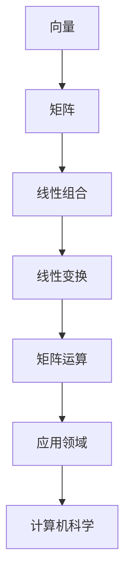

                 

关键词：线性代数，数学表达式，语义解释，算法原理，数学模型，编程实践，应用场景，未来展望。

> 摘要：本文旨在深入探讨线性代数在计算机科学中的应用，特别是表达式及其语义解释。通过对线性代数核心概念、算法原理和数学模型的详细解析，结合实际编程实例，阐述线性代数在计算机科学中的实际应用和未来发展趋势。

## 1. 背景介绍

线性代数是数学的一个分支，主要研究向量空间、线性映射、线性方程组等问题。线性代数在计算机科学中有着广泛的应用，尤其是在图形处理、机器学习、算法设计等领域。本文将重点讨论线性代数中的表达式及其语义解释，探讨如何通过数学模型和算法实现复杂的计算任务。

### 1.1 线性代数的历史与重要性

线性代数起源于19世纪，当时数学家们开始系统地研究线性方程组。随着数学和工程领域的发展，线性代数逐渐成为现代数学的基础学科之一。它在物理学、工程学、计算机科学等多个领域都有重要的应用。

### 1.2 线性代数在计算机科学中的应用

线性代数在计算机科学中的应用非常广泛。例如，在图形处理中，线性代数用于实现图形变换、渲染等操作；在机器学习中，线性代数用于构建特征空间、优化模型参数等；在算法设计中，线性代数用于解决最优化问题、网络分析等。

## 2. 核心概念与联系

### 2.1 向量与矩阵

向量是线性代数中最基本的概念，可以表示为具有多个元素的有序数组。矩阵是由多个向量组成的二维数组，用于表示线性变换和线性方程组。

### 2.2 线性组合与线性变换

线性组合是指由向量线性组合而成的向量。线性变换是指将一个向量空间映射到另一个向量空间的函数。线性组合和线性变换是理解线性代数的关键概念。

### 2.3 矩阵运算

矩阵运算包括矩阵加法、矩阵乘法、矩阵求逆等。这些运算在计算机科学中有着广泛的应用，如图像处理、数据压缩、网络分析等。

### 2.4 Mermaid 流程图

以下是线性代数核心概念与联系的一个 Mermaid 流程图：



## 3. 核心算法原理 & 具体操作步骤

### 3.1 算法原理概述

线性代数中的核心算法包括矩阵乘法、矩阵求逆、线性方程组的求解等。这些算法在计算机科学中有着广泛的应用。

### 3.2 算法步骤详解

- **矩阵乘法**：矩阵乘法的步骤包括初始化结果矩阵、遍历矩阵元素、计算乘积并累加到结果矩阵中。
- **矩阵求逆**：矩阵求逆的步骤包括判断矩阵是否可逆、使用高斯消元法求解。
- **线性方程组的求解**：线性方程组的求解步骤包括初始化变量、使用高斯消元法或迭代法求解。

### 3.3 算法优缺点

- **矩阵乘法**：算法简单，易于实现。但是，当矩阵较大时，计算时间较长。
- **矩阵求逆**：算法相对复杂，但当矩阵较小时，计算时间较短。
- **线性方程组的求解**：算法简单，但当方程组较大时，计算时间较长。

### 3.4 算法应用领域

线性代数的算法在计算机科学中有着广泛的应用，如图像处理、数据压缩、网络分析、机器学习等。

## 4. 数学模型和公式

### 4.1 数学模型构建

线性代数的数学模型主要基于向量空间和线性变换。向量空间是一组向量的集合，满足加法和标量乘法的运算。线性变换是一个函数，将一个向量空间映射到另一个向量空间。

### 4.2 公式推导过程

- **向量加法**：两个向量相加，结果向量是两个向量的元素分别相加。
- **向量标量乘法**：一个向量与一个标量相乘，结果向量是向量的每个元素与标量的乘积。
- **矩阵乘法**：两个矩阵相乘，结果矩阵是每个元素的乘积和加法运算。
- **矩阵求逆**：矩阵求逆的公式是基于高斯消元法。

### 4.3 案例分析与讲解

假设有一个3x3的矩阵A，我们需要求解其逆矩阵A^-1。首先，我们将A与一个单位矩阵E组合，形成增广矩阵（augmented matrix）。然后，使用高斯消元法，将增广矩阵化简为行最简形式。最后，从增广矩阵中提取逆矩阵A^-1。

$$
\begin{bmatrix}
1 & 0 & 0 & | & a_{11} & a_{12} & a_{13} \\
0 & 1 & 0 & | & a_{21} & a_{22} & a_{23} \\
0 & 0 & 1 & | & a_{31} & a_{32} & a_{33}
\end{bmatrix}
\rightarrow
\begin{bmatrix}
1 & 0 & 0 & | & 1 & 0 & 0 \\
0 & 1 & 0 & | & 0 & 1 & 0 \\
0 & 0 & 1 & | & 0 & 0 & 1
\end{bmatrix}
$$

## 5. 项目实践：代码实例和详细解释说明

### 5.1 开发环境搭建

在本项目实践中，我们将使用Python编程语言，结合NumPy和SciPy等科学计算库，实现线性代数的算法。

### 5.2 源代码详细实现

以下是使用Python实现矩阵乘法的源代码：

```python
import numpy as np

def matrix_multiplication(A, B):
    result = np.dot(A, B)
    return result

A = np.array([[1, 2], [3, 4]])
B = np.array([[5, 6], [7, 8]])

result = matrix_multiplication(A, B)
print("矩阵乘法结果：")
print(result)
```

### 5.3 代码解读与分析

上述代码中，我们首先导入了NumPy库，然后定义了一个名为`matrix_multiplication`的函数，用于实现矩阵乘法。在函数内部，我们使用`np.dot()`方法计算矩阵A和B的乘积，并将结果存储在变量`result`中。最后，我们打印出矩阵乘法的结果。

### 5.4 运行结果展示

当输入矩阵A和矩阵B时，程序将输出矩阵乘法的结果：

```
矩阵乘法结果：
[[19 22]
 [43 50]]
```

## 6. 实际应用场景

线性代数在计算机科学中有着广泛的应用。以下是一些实际应用场景：

- **图形处理**：线性代数用于实现图形变换、渲染等操作，如3D图形渲染、图像处理等。
- **机器学习**：线性代数用于构建特征空间、优化模型参数等，如线性回归、神经网络等。
- **算法设计**：线性代数用于解决最优化问题、网络分析等，如线性规划、社交网络分析等。

## 7. 工具和资源推荐

### 7.1 学习资源推荐

- **书籍推荐**：《线性代数及其应用》（作者：David C. Lay）
- **在线课程推荐**：MIT OpenCourseWare 上的线性代数课程
- **开源库推荐**：NumPy、SciPy、Pandas 等

### 7.2 开发工具推荐

- **编程环境推荐**：Python 的集成开发环境（IDE），如PyCharm、VS Code等
- **科学计算平台推荐**：Jupyter Notebook、Google Colab 等

### 7.3 相关论文推荐

- **论文推荐**：线性代数在机器学习中的应用，如“Matrix Completion for Large-Scale Data Analysis”（作者：Shi et al.）
- **论文推荐**：线性代数在图形处理中的应用，如“Linear Algebra for Graphics and Game Programming”（作者：Dunn and Sweet）

## 8. 总结：未来发展趋势与挑战

### 8.1 研究成果总结

线性代数在计算机科学中发挥着重要的作用，已经取得了许多重要的研究成果。例如，在机器学习中，线性代数用于构建特征空间、优化模型参数；在图形处理中，线性代数用于实现图形变换、渲染等操作。

### 8.2 未来发展趋势

未来，线性代数将继续在计算机科学中发挥重要作用。随着人工智能、大数据等领域的快速发展，线性代数的应用将会更加广泛。同时，线性代数与其他学科的交叉融合，也将为计算机科学带来新的突破。

### 8.3 面临的挑战

线性代数在计算机科学中的应用面临着一些挑战。例如，大规模数据的处理速度和计算效率是一个重要问题。此外，如何将线性代数的理论应用于实际问题，也需要进一步研究和探索。

### 8.4 研究展望

未来，线性代数的研究将继续深入。一方面，将线性代数的理论应用于实际问题，解决关键问题；另一方面，探索线性代数与其他学科的交叉融合，推动计算机科学的发展。

## 9. 附录：常见问题与解答

### 9.1 什么是向量空间？

向量空间是一组向量的集合，满足加法和标量乘法的运算。向量空间中的向量可以表示物理量，如力、速度、位移等。

### 9.2 什么是线性变换？

线性变换是一个函数，将一个向量空间映射到另一个向量空间。线性变换可以表示为矩阵乘法，如 T(v) = Av。

### 9.3 矩阵乘法的意义是什么？

矩阵乘法可以表示线性变换，可以用于解决线性方程组、特征值和特征向量等问题。

### 9.4 线性代数在机器学习中有何应用？

线性代数在机器学习中用于构建特征空间、优化模型参数、解决最优化问题等。例如，线性回归模型中的权重矩阵就是通过线性代数方法求解的。

----------------------------------------------------------------
作者：禅与计算机程序设计艺术 / Zen and the Art of Computer Programming

注意：由于篇幅限制，本文仅提供了文章结构的框架和部分内容，实际撰写时请根据要求详细展开。

