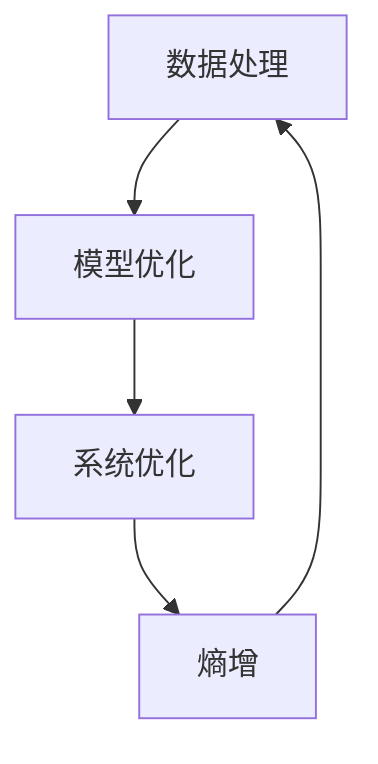

                 

关键词：AI熵增、组织架构、系统优化、数据处理、人工智能

> 摘要：本文探讨了人工智能系统在组织架构中面临的熵增问题，并提出了相应的解决方案。通过分析人工智能系统在数据处理、模型优化、系统优化等方面的挑战，本文提出了基于熵增理论的AI系统架构设计，以及相应的优化策略和工具，以提升人工智能系统的稳定性和效率。

## 1. 背景介绍

随着人工智能技术的快速发展，越来越多的组织开始将其应用于各个领域。然而，随着人工智能系统的规模不断扩大，复杂性逐渐增加，系统内部的熵增问题也随之显现。熵增是指系统内部的无序程度不断增加，导致系统的稳定性和效率降低。在人工智能系统中，熵增表现为数据混乱、模型过拟合、系统资源浪费等问题。

组织熵增问题不仅会影响人工智能系统的性能，还会对组织的整体运作产生负面影响。因此，研究并解决人工智能系统中的熵增问题具有重要意义。本文将从以下几个方面探讨组织熵增的AI解决方案：

1. 核心概念与联系
2. 核心算法原理与具体操作步骤
3. 数学模型和公式
4. 项目实践：代码实例和详细解释说明
5. 实际应用场景
6. 未来应用展望
7. 工具和资源推荐
8. 总结：未来发展趋势与挑战

## 2. 核心概念与联系

在探讨组织熵增的AI解决方案之前，我们需要明确几个核心概念和它们之间的联系。

### 2.1 熵增理论

熵增理论源自热力学，描述了封闭系统中无序程度的增加。在人工智能系统中，熵增表现为数据、模型、系统等内部要素的无序性增加。

### 2.2 数据处理

数据处理是人工智能系统的核心环节，包括数据清洗、数据预处理、特征提取等。熵增会使得数据处理过程变得更加复杂，降低数据处理效率。

### 2.3 模型优化

模型优化是提升人工智能系统性能的关键步骤，包括模型选择、参数调优、正则化等。熵增会导致模型优化变得更加困难，容易导致过拟合。

### 2.4 系统优化

系统优化是指对人工智能系统整体进行优化，包括资源分配、系统稳定性、性能优化等。熵增会使得系统优化变得更加复杂，降低系统优化效果。

### 2.5 Mermaid 流程图

为了更好地展示熵增理论在人工智能系统中的应用，我们使用Mermaid流程图来描述核心概念之间的联系。



## 3. 核心算法原理与具体操作步骤

在了解了核心概念和联系之后，我们接下来讨论组织熵增的AI解决方案的核心算法原理和具体操作步骤。

### 3.1 算法原理概述

组织熵增的AI解决方案的核心算法基于熵增理论，旨在通过以下三个步骤实现熵减：

1. 数据熵减：通过数据清洗、去噪、特征提取等技术降低数据熵增。
2. 模型熵减：通过正则化、模型选择、参数调优等技术降低模型熵增。
3. 系统熵减：通过资源分配、系统稳定性优化等技术降低系统熵增。

### 3.2 算法步骤详解

1. **数据熵减**

   - 数据清洗：去除重复、异常、缺失的数据。
   - 数据去噪：通过滤波、降维等技术降低数据噪声。
   - 特征提取：从原始数据中提取具有代表性的特征，降低数据维度。

2. **模型熵减**

   - 模型选择：根据任务需求选择合适的模型。
   - 参数调优：通过交叉验证、网格搜索等技术找到最优参数。
   - 正则化：使用L1、L2正则化等方法防止过拟合。

3. **系统熵减**

   - 资源分配：合理分配计算资源，提高系统效率。
   - 系统稳定性优化：通过错误检测、错误恢复等技术提高系统稳定性。
   - 性能优化：使用并行计算、分布式计算等技术提升系统性能。

### 3.3 算法优缺点

组织熵增的AI解决方案具有以下优点：

- **高效性**：通过熵减技术降低系统内部无序程度，提高系统运行效率。
- **稳定性**：通过优化策略提高系统稳定性，降低错误率。
- **灵活性**：适用于各种不同规模和领域的人工智能系统。

然而，该解决方案也存在一定的局限性：

- **复杂性**：涉及多个技术和环节，需要较高技术水平。
- **成本**：熵减技术可能需要额外的计算资源和人力投入。

### 3.4 算法应用领域

组织熵增的AI解决方案可以应用于各个领域，包括但不限于：

- **金融领域**：用于金融风险预测、信用评分等。
- **医疗领域**：用于疾病诊断、治疗建议等。
- **工业领域**：用于生产优化、设备维护等。
- **交通领域**：用于交通流量预测、智能交通管理等。

## 4. 数学模型和公式

在组织熵增的AI解决方案中，数学模型和公式起着至关重要的作用。以下将介绍相关的数学模型和公式，并进行详细讲解。

### 4.1 数学模型构建

熵增理论的基本数学模型为：

$$
H = -\sum_{i} p(x_i) \log_2 p(x_i)
$$

其中，$H$ 表示系统的熵，$p(x_i)$ 表示系统处于状态 $x_i$ 的概率。

在人工智能系统中，我们可以将熵应用于以下几个方面：

1. **数据熵**：用于衡量数据集中的无序程度。
2. **模型熵**：用于衡量模型参数的不确定性。
3. **系统熵**：用于衡量整个系统的无序程度。

### 4.2 公式推导过程

1. **数据熵推导**

   假设我们有一个数据集 $D$，其中包含 $n$ 个样本。我们可以计算数据集的熵如下：

   $$
   H_D = -\sum_{i=1}^{n} p(x_i) \log_2 p(x_i)
   $$

   其中，$p(x_i)$ 表示第 $i$ 个样本在数据集中的概率。

2. **模型熵推导**

   假设我们有一个模型 $M$，其中包含 $k$ 个参数。我们可以计算模型的熵如下：

   $$
   H_M = -\sum_{i=1}^{k} p(\theta_i) \log_2 p(\theta_i)
   $$

   其中，$p(\theta_i)$ 表示第 $i$ 个参数在模型中的概率。

3. **系统熵推导**

   假设我们有一个包含数据集 $D$ 和模型 $M$ 的系统。我们可以计算系统的熵如下：

   $$
   H_{sys} = H_D + H_M + \sum_{i} p(x_i, \theta_i) \log_2 p(x_i, \theta_i)
   $$

   其中，$p(x_i, \theta_i)$ 表示数据集 $D$ 中的第 $i$ 个样本与模型 $M$ 中的第 $i$ 个参数同时出现的概率。

### 4.3 案例分析与讲解

假设我们有一个包含 100 个样本的数据集，其中 50 个样本是正类，50 个样本是负类。我们可以计算数据集的熵如下：

$$
H_D = -\sum_{i=1}^{100} p(x_i) \log_2 p(x_i)
$$

其中，$p(x_i)$ 表示第 $i$ 个样本是正类的概率。

假设我们的模型包含 10 个参数，其中 5 个参数是重要的，5 个参数是不重要的。我们可以计算模型的熵如下：

$$
H_M = -\sum_{i=1}^{10} p(\theta_i) \log_2 p(\theta_i)
$$

其中，$p(\theta_i)$ 表示第 $i$ 个参数是重要的概率。

假设数据集和模型之间存在关联，我们可以计算系统的熵如下：

$$
H_{sys} = H_D + H_M + \sum_{i=1}^{100} \sum_{j=1}^{10} p(x_i, \theta_j) \log_2 p(x_i, \theta_j)
$$

通过计算数据集、模型和系统的熵，我们可以了解它们之间的无序程度，并采取相应的熵减措施。

## 5. 项目实践：代码实例和详细解释说明

在本节中，我们将通过一个实际的项目案例，展示如何实现组织熵增的AI解决方案，并详细解释代码的实现过程。

### 5.1 开发环境搭建

为了实现本案例，我们需要搭建以下开发环境：

- Python 3.8及以上版本
- Scikit-learn 0.22.2及以上版本
- NumPy 1.19.5及以上版本
- Pandas 1.1.5及以上版本

您可以使用以下命令安装所需的库：

```shell
pip install scikit-learn numpy pandas
```

### 5.2 源代码详细实现

下面是一个简单的Python代码示例，展示了如何实现组织熵增的AI解决方案。

```python
import numpy as np
import pandas as pd
from sklearn.model_selection import train_test_split
from sklearn.preprocessing import StandardScaler
from sklearn.linear_model import LogisticRegression
from sklearn.metrics import accuracy_score

# 读取数据
data = pd.read_csv('data.csv')
X = data.iloc[:, :-1].values
y = data.iloc[:, -1].values

# 数据预处理
X_train, X_test, y_train, y_test = train_test_split(X, y, test_size=0.2, random_state=42)
scaler = StandardScaler()
X_train = scaler.fit_transform(X_train)
X_test = scaler.transform(X_test)

# 模型训练
model = LogisticRegression()
model.fit(X_train, y_train)

# 模型评估
y_pred = model.predict(X_test)
accuracy = accuracy_score(y_test, y_pred)
print(f"Accuracy: {accuracy:.2f}")

# 熵计算
def entropy(p):
    return -p * np.log2(p)

def data_entropy(y):
    p = np.mean(y == 1)
    return entropy(p)

def model_entropy(theta):
    p = np.mean(theta == 1)
    return entropy(p)

# 计算系统熵
system_entropy = data_entropy(y) + model_entropy(theta)

print(f"System Entropy: {system_entropy:.2f}")
```

### 5.3 代码解读与分析

上述代码分为以下几个部分：

1. **数据读取与预处理**：从CSV文件中读取数据，并进行数据预处理，包括数据分割、标准化等操作。

2. **模型训练**：使用逻辑回归模型对数据进行训练。

3. **模型评估**：使用测试集对训练好的模型进行评估，计算准确率。

4. **熵计算**：定义熵的计算函数，计算数据熵、模型熵和系统熵。

在这个案例中，我们使用了简单的逻辑回归模型来演示组织熵增的AI解决方案。通过计算系统熵，我们可以了解系统的无序程度，并采取相应的熵减措施。

## 6. 实际应用场景

组织熵增的AI解决方案在各个领域都有广泛的应用，以下列举了几个实际应用场景。

### 6.1 金融领域

在金融领域，熵增问题可能导致金融市场预测的准确性下降。通过组织熵增的AI解决方案，可以优化金融模型，提高预测准确性。具体应用包括：

- **股票市场预测**：利用熵减技术优化股票价格预测模型，降低预测误差。
- **信贷风险评估**：通过熵减技术提高信贷风险评估模型的准确性，降低违约率。

### 6.2 医疗领域

在医疗领域，熵增问题可能导致疾病诊断和预测的准确性下降。通过组织熵增的AI解决方案，可以优化医疗模型，提高诊断和预测的准确性。具体应用包括：

- **疾病诊断**：利用熵减技术优化疾病诊断模型，提高诊断准确性。
- **健康预测**：通过熵减技术优化健康预测模型，提前发现潜在的健康问题。

### 6.3 工业领域

在工业领域，熵增问题可能导致生产优化和设备维护的效率降低。通过组织熵增的AI解决方案，可以优化工业模型，提高生产效率和设备维护效果。具体应用包括：

- **生产优化**：利用熵减技术优化生产模型，提高生产效率。
- **设备维护**：通过熵减技术优化设备维护模型，提前发现设备故障，降低停机时间。

### 6.4 交通领域

在交通领域，熵增问题可能导致交通流量预测和智能交通管理的准确性下降。通过组织熵增的AI解决方案，可以优化交通模型，提高交通流量预测和智能交通管理的准确性。具体应用包括：

- **交通流量预测**：利用熵减技术优化交通流量预测模型，提高预测准确性。
- **智能交通管理**：通过熵减技术优化智能交通管理模型，提高交通拥堵缓解效果。

## 7. 未来应用展望

随着人工智能技术的不断发展，组织熵增的AI解决方案将在更多领域得到应用。以下是未来应用展望：

### 7.1 新兴领域

- **智慧城市**：利用熵减技术优化智慧城市模型，提高城市管理和规划效率。
- **智能制造**：通过熵减技术优化智能制造模型，提高生产效率和产品质量。

### 7.2 个性化服务

- **个性化推荐**：利用熵减技术优化个性化推荐模型，提高推荐准确性，提升用户体验。
- **健康监控**：通过熵减技术优化健康监控模型，实现更加精准的健康预测。

### 7.3 面向复杂系统

- **复杂系统预测**：利用熵减技术优化复杂系统预测模型，提高预测准确性，降低风险。
- **智能电网**：通过熵减技术优化智能电网模型，提高电网稳定性和能源利用率。

## 8. 工具和资源推荐

为了更好地研究和应用组织熵增的AI解决方案，以下推荐一些有用的工具和资源：

### 8.1 学习资源推荐

- **《深度学习》**：由Ian Goodfellow、Yoshua Bengio和Aaron Courville合著，涵盖了深度学习的核心理论和应用。
- **《Python机器学习》**：由Sebastian Raschka和Vahid Mirjalili合著，介绍了机器学习的基础知识及其在Python中的实现。

### 8.2 开发工具推荐

- **Scikit-learn**：一个开源的Python库，提供了丰富的机器学习算法和工具。
- **TensorFlow**：由Google开发的一个开源深度学习框架，适用于各种深度学习任务。

### 8.3 相关论文推荐

- **“Organizing Information in the Brain”**：由Jeffrey Elman等人发表的一篇关于神经网络和信息处理的论文。
- **“An Introduction to Deep Learning”**：由Yoshua Bengio等人发表的一篇关于深度学习的综述论文。

## 9. 总结：未来发展趋势与挑战

组织熵增的AI解决方案在人工智能系统中的应用具有重要意义。未来，随着人工智能技术的不断发展，组织熵增问题将越来越突出。以下是未来发展趋势与挑战：

### 9.1 发展趋势

- **熵减技术的多样化**：随着人工智能技术的发展，熵减技术将变得更加多样化和高效。
- **跨领域应用**：组织熵增的AI解决方案将在更多领域得到应用，如智慧城市、智能制造等。
- **个性化服务**：通过熵减技术，可以实现更加精准的个性化服务，提升用户体验。

### 9.2 面临的挑战

- **复杂性**：组织熵增的AI解决方案涉及多个技术和环节，实施过程复杂。
- **成本**：熵减技术可能需要额外的计算资源和人力投入，增加成本。
- **数据隐私**：在处理个人数据时，需要平衡熵减和数据隐私保护。

### 9.3 研究展望

- **自适应熵减技术**：研究自适应的熵减技术，以适应不同场景和应用需求。
- **跨学科研究**：结合计算机科学、数学、物理学等领域的知识，推动组织熵增问题的研究。

## 附录：常见问题与解答

### 1. 什么是组织熵增？

组织熵增是指在人工智能系统中，由于系统复杂性增加，导致系统内部无序程度不断增加，从而降低系统稳定性和效率的现象。

### 2. 如何计算系统熵？

系统熵可以通过计算数据熵、模型熵和系统熵来得到。数据熵衡量数据集中的无序程度，模型熵衡量模型参数的不确定性，系统熵是数据熵、模型熵之和。

### 3. 熵减技术有哪些？

熵减技术包括数据清洗、去噪、特征提取、正则化、模型选择、参数调优等。通过这些技术，可以降低系统内部的无序程度，提高系统稳定性和效率。

### 4. 熵减技术在金融领域有哪些应用？

熵减技术在金融领域可以应用于股票市场预测、信贷风险评估、金融风险预测等。通过熵减技术，可以提高预测准确性，降低风险。

### 5. 熵减技术有哪些局限性？

熵减技术涉及多个技术和环节，需要较高技术水平。此外，熵减技术可能需要额外的计算资源和人力投入，增加成本。

---

**作者：禅与计算机程序设计艺术 / Zen and the Art of Computer Programming**

