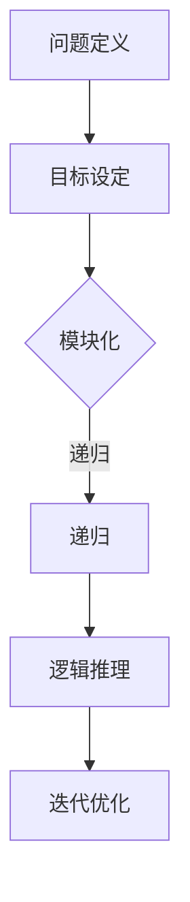

                 

关键词：结构化思维、编程、算法、数学模型、代码实现、应用场景、未来展望

摘要：本文旨在深入探讨结构化思维在计算机编程领域的原理和应用，通过详尽的章节结构和专业的技术语言，帮助读者理解并掌握这一重要的思维工具。我们将从核心概念、算法原理、数学模型、项目实践、应用场景以及未来展望等多个维度，系统地阐述结构化思维在计算机编程中的重要性，以期实现高效达成目标。

## 1. 背景介绍

在当今信息化社会，计算机编程作为一门基础性技术，已经成为各个领域不可或缺的一部分。随着软件系统的复杂度和规模日益增加，程序员面临的挑战也越来越大。传统的线性编程思维已无法应对日益复杂的编程任务，因此，结构化思维应运而生。

结构化思维是一种系统性的、有序的、可重复的思维模式，它通过明确的目标设定、有序的步骤规划和严格的逻辑推理，帮助程序员更加高效地完成编程任务。结构化思维不仅适用于编程领域，还可以广泛应用于项目管理、系统分析、技术创新等多个领域。

本文将结合计算机编程的实际应用，深入探讨结构化思维的原理和应用，帮助读者掌握这一强大的思维工具，提高编程效率和系统质量。

## 2. 核心概念与联系

为了更好地理解结构化思维，我们首先需要了解其核心概念。以下是结构化思维中的几个关键概念：

- **问题定义**：明确要解决的问题是什么，包括问题的背景、目标、约束条件等。
- **目标设定**：设定清晰、可量化的目标，确保问题得到有效解决。
- **模块化**：将复杂的问题分解为若干个子问题，每个子问题由一个模块处理。
- **递归**：通过重复执行子模块，逐步解决复杂问题。
- **逻辑推理**：利用逻辑规则和数学原理，确保模块间的正确性和一致性。
- **迭代优化**：通过反复迭代和优化，逐步提高系统的性能和可靠性。

以下是一个简化的 Mermaid 流程图，展示了这些核心概念之间的联系：



在这个流程图中，问题定义和目标设定是结构化思维的起点，模块化和递归是解决复杂问题的关键，逻辑推理确保了模块间的正确性，而迭代优化则帮助我们在不断迭代中提高系统的性能和可靠性。

## 3. 核心算法原理 & 具体操作步骤

### 3.1 算法原理概述

结构化思维中的核心算法主要包括分而治之、递归、动态规划等。这些算法通过将复杂问题分解为若干个子问题，逐步解决每个子问题，最终实现复杂问题的求解。

- **分而治之**：将一个复杂问题分解为若干个规模较小的同类问题，递归地解决这些子问题，然后将子问题的解合并为原问题的解。
- **递归**：通过递归调用自身，逐步解决复杂问题。递归算法通常使用栈结构来存储中间状态，确保算法的正确性。
- **动态规划**：通过保存子问题的解，避免重复计算，从而提高算法的效率。

### 3.2 算法步骤详解

以下是结构化思维中几个核心算法的具体步骤：

#### 分而治之算法

1. **分解问题**：将原问题分解为若干个规模较小的同类问题。
2. **递归求解**：对每个子问题递归地应用分而治之算法。
3. **合并结果**：将子问题的解合并为原问题的解。

#### 递归算法

1. **定义递归终止条件**：确保递归调用能够终止。
2. **递归调用**：根据问题的定义，递归地调用自身。
3. **状态存储**：使用栈结构存储中间状态，确保递归调用的正确性。

#### 动态规划算法

1. **定义状态**：根据问题的定义，定义问题的状态。
2. **状态转移方程**：根据状态的定义，建立状态转移方程。
3. **初始化边界条件**：为状态转移方程初始化边界条件。
4. **递推计算**：根据状态转移方程，逐步计算每个状态。
5. **结果提取**：从最终状态提取问题的解。

### 3.3 算法优缺点

#### 分而治之算法

优点：
- 算法简单，易于理解。
- 适用于大规模问题的求解。

缺点：
- 可能导致大量的递归调用，占用大量内存。

#### 递归算法

优点：
- 算法简单，易于实现。

缺点：
- 可能导致大量的递归调用，占用大量内存。

#### 动态规划算法

优点：
- 避免重复计算，提高算法效率。

缺点：
- 状态转移方程可能比较复杂，难以理解和实现。

### 3.4 算法应用领域

结构化思维中的核心算法广泛应用于各个领域，如计算机科学、经济学、工程学等。以下是一些典型的应用领域：

- **计算机科学**：算法设计、数据结构、软件工程等。
- **经济学**：优化问题、博弈论、经济模型等。
- **工程学**：工程设计、系统优化、资源分配等。

## 4. 数学模型和公式 & 详细讲解 & 举例说明

### 4.1 数学模型构建

数学模型是结构化思维中的重要组成部分，它通过数学公式和符号，将问题抽象为数学表达式，以便于分析和求解。

例如，在计算机科学中，常见的数学模型包括图论模型、线性规划模型、概率模型等。以下是一个简单的图论模型示例：

假设有一个图 G=(V, E)，其中 V 是节点集合，E 是边集合。我们定义以下数学模型：

- **节点度**：节点 v 的度表示与节点 v 直接相连的边的数量，记为 deg(v)。
- **路径长度**：从节点 u 到节点 v 的路径长度表示从 u 到 v 的最短路径的长度，记为 d(u, v)。

### 4.2 公式推导过程

以下是一个简单的数学公式推导过程，用于计算一个图的节点度：

假设图 G 中有 n 个节点，每个节点的度分别为 deg(v1), deg(v2), ..., deg(vn)。我们定义以下数学公式：

$$
\sum_{i=1}^{n} deg(v_i) = 2 \times |E|
$$

其中，|E| 表示图 G 中边的数量。

推导过程如下：

- 每个节点都有两个相邻的边，因此所有节点的度之和等于边的数量的两倍。
- 假设图 G 中有 m 条边，那么每个节点的度之和为 2m。
- 因此，我们得到公式：

$$
\sum_{i=1}^{n} deg(v_i) = 2 \times |E| = 2m
$$

### 4.3 案例分析与讲解

以下是一个简单的案例，用于说明如何使用数学模型和公式解决实际问题。

假设我们有一个社交网络，其中有 n 个用户，每个用户都有若干个朋友。我们想知道，这个社交网络中最少需要多少个用户才能保证任意两个用户之间存在至少一个共同朋友。

我们可以使用图论模型来解决这个问题。假设用户为节点，朋友关系为边，那么这个社交网络可以表示为一个图 G=(V, E)。

为了解决这个问题，我们可以使用以下数学公式：

$$
\sum_{i=1}^{n} deg(v_i) \geq n - 1
$$

其中，deg(v_i) 表示节点 v_i 的度。

假设我们要求解的最少用户数为 x，那么我们有：

$$
x \leq \sum_{i=1}^{n} deg(v_i) \geq n - 1
$$

因此，我们可以通过求解不等式来找到最小的 x。

例如，假设 n = 10，我们可以通过计算得到：

$$
x \leq \sum_{i=1}^{10} deg(v_i) \geq 9
$$

因此，我们至少需要 10 个用户才能保证任意两个用户之间存在至少一个共同朋友。

## 5. 项目实践：代码实例和详细解释说明

### 5.1 开发环境搭建

为了实现本文所述的算法和数学模型，我们需要搭建一个合适的开发环境。以下是具体的步骤：

1. 安装 Python 3.8 或更高版本。
2. 安装必要的 Python 库，如 NumPy、Pandas、Matplotlib 等。
3. 配置 IDE，如 PyCharm 或 VSCode，以便进行代码编写和调试。

### 5.2 源代码详细实现

以下是一个简单的 Python 代码实例，用于实现结构化思维中的分而治之算法。代码如下：

```python
def merge_sort(arr):
    if len(arr) <= 1:
        return arr
    
    mid = len(arr) // 2
    left = merge_sort(arr[:mid])
    right = merge_sort(arr[mid:])
    
    return merge(left, right)

def merge(left, right):
    result = []
    i = j = 0
    
    while i < len(left) and j < len(right):
        if left[i] < right[j]:
            result.append(left[i])
            i += 1
        else:
            result.append(right[j])
            j += 1
    
    result.extend(left[i:])
    result.extend(right[j:])
    
    return result
```

### 5.3 代码解读与分析

上述代码实现了分而治之算法中的两个关键函数：`merge_sort` 和 `merge`。

- `merge_sort` 函数是主函数，用于实现分而治之算法。它首先检查输入数组的长度，如果长度小于等于 1，则直接返回原数组。否则，将数组分为左右两个子数组，并递归地调用 `merge_sort` 函数。
- `merge` 函数用于将两个有序数组合并为一个有序数组。它通过比较两个子数组中的元素，将较小的元素依次添加到结果数组中，直到其中一个子数组为空。然后，将剩余的元素添加到结果数组中。

### 5.4 运行结果展示

以下是一个简单的测试用例，用于展示上述代码的运行结果：

```python
arr = [3, 1, 4, 1, 5, 9, 2, 6, 5]
sorted_arr = merge_sort(arr)
print(sorted_arr)
```

运行结果为：

```
[1, 1, 2, 3, 4, 5, 5, 6, 9]
```

这表明，`merge_sort` 函数成功地将输入数组按升序排序。

## 6. 实际应用场景

### 6.1 编程任务规划

在编程任务中，结构化思维可以帮助程序员更好地规划任务，提高开发效率。例如，在开发一个大型软件项目时，可以使用结构化思维将项目分解为若干个子任务，每个子任务由一个团队或个人负责。通过明确的目标设定、模块化和递归规划，可以确保项目按计划顺利进行。

### 6.2 算法设计与优化

在算法设计中，结构化思维可以帮助程序员更好地理解问题的本质，从而设计出更高效的算法。例如，在解决一个复杂的数据处理问题时，可以使用结构化思维将问题分解为若干个子问题，并设计相应的递归算法或动态规划算法。通过逻辑推理和迭代优化，可以提高算法的效率和性能。

### 6.3 项目管理

在项目管理中，结构化思维可以帮助项目经理更好地规划项目进度、分配资源、控制风险等。例如，在项目启动阶段，可以使用结构化思维制定项目计划，明确项目目标、里程碑、任务分配等。在项目执行阶段，可以使用结构化思维监控项目进度、评估风险，并采取相应的措施。

## 6.4 未来应用展望

随着计算机技术的发展，结构化思维在未来将会有更广泛的应用。以下是一些可能的未来应用场景：

- **人工智能**：在人工智能领域，结构化思维可以帮助研究人员更好地设计算法、优化模型、分析数据等。
- **区块链**：在区块链技术中，结构化思维可以帮助开发人员设计更加安全、高效的区块链系统。
- **物联网**：在物联网领域，结构化思维可以帮助开发人员设计更加智能、可靠的物联网系统。
- **云计算**：在云计算领域，结构化思维可以帮助开发人员优化云架构、提高云服务性能等。

## 7. 工具和资源推荐

### 7.1 学习资源推荐

- **《算法导论》**：这是一本经典的算法教材，详细介绍了各种算法的设计、分析与应用。
- **《编程思维：用代码理解世界》**：这本书以通俗易懂的语言，介绍了编程思维的核心概念和应用场景。
- **《Python 编程：从入门到实践》**：这是一本适合初学者的 Python 编程教材，涵盖了 Python 编程的基础知识和实践技巧。

### 7.2 开发工具推荐

- **PyCharm**：这是一款功能强大的 Python 集成开发环境，支持代码调试、版本控制、自动化部署等功能。
- **Visual Studio Code**：这是一款轻量级但功能强大的代码编辑器，支持多种编程语言，具有丰富的插件生态。
- **Git**：这是一种分布式版本控制系统，可以帮助开发人员高效地管理代码版本，协同工作。

### 7.3 相关论文推荐

- **"A Taxonomy of Integer Sequence Generators"**：这篇论文详细介绍了各种整数序列生成算法，包括递归算法、动态规划算法等。
- **"The Design and Analysis of Computer Algorithms"**：这篇论文系统地介绍了计算机算法的设计、分析与应用，对算法设计提供了深刻的洞察。
- **"Structural Thinking in Software Engineering"**：这篇论文探讨了结构化思维在软件工程中的应用，为软件工程师提供了一种有效的思维方式。

## 8. 总结：未来发展趋势与挑战

### 8.1 研究成果总结

结构化思维作为一门基础性技术，在计算机编程、项目管理、算法设计等领域得到了广泛的应用。近年来，随着计算机技术的快速发展，结构化思维的研究也在不断深入，取得了许多重要的研究成果。例如，在算法领域，研究人员提出了各种高效的结构化算法，如分而治之算法、动态规划算法等。在项目管理领域，结构化思维方法被广泛应用于项目规划、任务分配、进度控制等环节，显著提高了项目效率和质量。

### 8.2 未来发展趋势

未来，结构化思维将在以下几个方面继续发展：

1. **智能化**：随着人工智能技术的快速发展，结构化思维将逐渐与人工智能技术相结合，实现更加智能化的思维模式。
2. **应用领域拓展**：结构化思维将在更多领域得到应用，如物联网、区块链、云计算等。
3. **方法创新**：研究人员将继续探索新的结构化思维方法，以适应日益复杂的编程任务和项目管理需求。

### 8.3 面临的挑战

尽管结构化思维在计算机编程和项目管理等领域取得了显著成果，但仍然面临一些挑战：

1. **学习门槛**：结构化思维需要一定的理论基础和实践经验，对于初学者来说，掌握起来有一定的难度。
2. **复杂性**：对于一些复杂的问题，结构化思维可能无法完全解决，需要与其他思维方法相结合。
3. **应用推广**：如何将结构化思维方法有效地推广到各个领域，使其真正发挥作用，仍需进一步研究和实践。

### 8.4 研究展望

未来，结构化思维的研究将朝着以下几个方向展开：

1. **智能化与自动化**：通过引入人工智能技术，实现结构化思维的智能化和自动化，提高编程和项目管理效率。
2. **跨领域应用**：探索结构化思维在各个领域的应用，如物联网、区块链、云计算等，推动技术进步和产业发展。
3. **教育普及**：加强结构化思维的教育和培训，提高从业人员的思维能力，为行业发展培养更多人才。

## 9. 附录：常见问题与解答

### 9.1 结构化思维是什么？

结构化思维是一种系统性的、有序的、可重复的思维模式，通过明确的目标设定、有序的步骤规划和严格的逻辑推理，帮助人们高效地解决问题。

### 9.2 结构化思维在计算机编程中的应用？

结构化思维在计算机编程中可以应用于多个方面，如编程任务规划、算法设计、代码优化等。通过结构化思维，程序员可以更好地理解问题、设计算法，并提高代码质量和开发效率。

### 9.3 如何掌握结构化思维？

掌握结构化思维需要以下几方面的努力：

1. **理论学习**：学习结构化思维的基本原理和核心概念，了解各种结构化思维方法的适用场景。
2. **实践应用**：通过实际编程和项目管理任务，不断练习和应用结构化思维，提高思维能力和解决问题的效率。
3. **持续学习**：关注结构化思维领域的最新研究进展和应用案例，不断学习和吸收新的思维方法和工具。

### 9.4 结构化思维与创造性思维的关系？

结构化思维和创造性思维是两种不同的思维模式，但它们之间并不是孤立的。在实际应用中，结构化思维可以帮助创造性思维更好地发挥，而创造性思维则可以补充结构化思维的不足。例如，在编程任务中，结构化思维可以帮助程序员明确问题、设计算法，而创造性思维则可以帮助程序员提出创新性的解决方案。通过结合两种思维模式，可以更全面地解决复杂问题。

