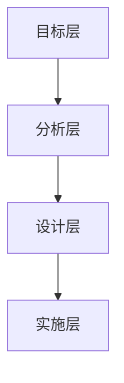

                 

结构化思维是一种高效思考的方式，它能够帮助我们在复杂的问题中找到清晰的解决方案。本文将探讨结构化思维的重要性，并提供一系列实用的方法和工具，帮助读者在IT领域中进行结构化思考，从而提高工作效率和解决问题的能力。

## 文章关键词
- 结构化思维
- IT领域
- 问题解决
- 工作效率
- 创新思维

## 摘要
本文旨在介绍结构化思维在IT领域的应用，通过阐述结构化思维的核心概念、方法、工具和实践，帮助读者掌握结构化思维的技巧，从而在复杂的项目和问题中实现高效的思考和行动。

## 1. 背景介绍
### 1.1 结构化思维的定义与意义
结构化思维是一种将复杂问题分解成若干简单部分的思考方式，通过逻辑清晰、层次分明的结构，帮助我们理解问题、分析问题、解决问题。在IT领域，结构化思维的重要性尤为突出，因为IT行业面临着日新月异的技术变革和复杂的项目挑战。通过结构化思维，我们可以更好地应对这些挑战，提高工作效率，实现创新。

### 1.2 结构化思维与传统思维的差异
与传统思维相比，结构化思维更加注重逻辑性、系统性和层次性。传统思维往往依赖于经验和个人直觉，而结构化思维则强调基于事实和逻辑的思考。在IT领域，这种差异体现在以下几个方面：

- **问题分析**：结构化思维通过分解和归纳，将复杂的问题拆解成更小的、更容易处理的子问题，从而实现问题的逐步解决。
- **方案设计**：结构化思维注重方案的可行性和可扩展性，通过系统性的分析和设计，确保方案的有效性和高效性。
- **风险评估**：结构化思维能够识别潜在的风险和问题，提前制定应对策略，降低项目失败的风险。

## 2. 核心概念与联系
### 2.1 结构化思维的层次结构
结构化思维通常包括以下几个层次：

- **目标层**：明确项目的目标和预期成果，确保所有工作都围绕目标进行。
- **分析层**：对问题进行深入分析，识别问题的本质和关键因素。
- **设计层**：根据分析结果，设计解决方案和实现路径。
- **实施层**：执行设计方案，逐步实现项目目标。

### 2.2 核心概念原理与架构
结构化思维的核心概念包括以下几个方面：

- **分解与归纳**：将复杂问题分解成若干简单部分，通过归纳总结，形成整体的解决方案。
- **逻辑推理**：基于已知事实和逻辑规则，进行推理和论证，确保思考过程的严谨性。
- **系统思考**：将问题看作一个整体，考虑各个部分之间的相互作用和影响。

以下是结构化思维架构的 Mermaid 流程图：



## 3. 核心算法原理 & 具体操作步骤

### 3.1 算法原理概述
结构化思维的算法原理可以概括为以下几个步骤：

1. **问题定义**：明确问题的范围和目标，确保所有工作都围绕问题展开。
2. **问题分解**：将问题分解成若干子问题，为每个子问题确定具体的解决方案。
3. **方案设计**：根据分解结果，设计整体解决方案和实现路径。
4. **方案评估**：评估方案的有效性和可行性，确保方案的可行性和高效性。
5. **方案实施**：按照设计方案，逐步实施项目目标。

### 3.2 算法步骤详解
1. **问题定义**：
   - **明确问题**：描述问题的背景和现状，明确问题的具体内容和目标。
   - **目标设定**：确定项目的目标和预期成果，确保所有工作都围绕目标进行。

2. **问题分解**：
   - **分解问题**：将问题分解成若干子问题，为每个子问题确定具体的解决方案。
   - **子问题定义**：明确每个子问题的范围和目标，确保子问题的解决为整体问题提供有效支持。

3. **方案设计**：
   - **方案构思**：根据分解结果，设计整体解决方案和实现路径。
   - **方案评估**：评估方案的有效性和可行性，确保方案的可行性和高效性。

4. **方案实施**：
   - **实施方案**：按照设计方案，逐步实施项目目标。
   - **监控与调整**：监控项目进展，根据实际情况进行调整，确保项目按计划进行。

### 3.3 算法优缺点
**优点**：
- **逻辑清晰**：结构化思维通过分解和归纳，使问题变得更加清晰，有助于提高解决问题的效率。
- **系统性强**：结构化思维将问题看作一个整体，考虑各个部分之间的相互作用和影响，有助于提高方案的可行性和高效性。
- **易于沟通**：结构化思维的方法和工具有助于团队成员之间的沟通和协作，提高项目的整体效率。

**缺点**：
- **时间成本**：结构化思维需要进行问题分解、方案设计和评估等步骤，可能需要较长的时间成本。
- **适用范围**：结构化思维适用于复杂的问题，对于简单的问题，可能显得过于繁琐。

### 3.4 算法应用领域
结构化思维在IT领域具有广泛的应用，主要包括以下几个方面：

- **软件开发**：在软件开发过程中，结构化思维有助于明确需求、设计系统架构和编写代码。
- **项目管理**：在项目管理中，结构化思维有助于项目策划、任务分解和风险评估。
- **产品规划**：在产品规划中，结构化思维有助于市场分析、产品设计和市场推广。

## 4. 数学模型和公式 & 详细讲解 & 举例说明
### 4.1 数学模型构建
结构化思维中的数学模型通常包括以下几个要素：

- **变量定义**：明确问题中的各个变量，并为其设定合理的取值范围。
- **关系式建立**：根据问题的性质和特点，建立变量之间的关系式。
- **目标函数**：确定问题的目标函数，以便对问题进行优化。

### 4.2 公式推导过程
以软件开发中的代码优化为例，我们可以通过以下步骤推导出目标函数：

1. **变量定义**：设代码长度为$x$，运行时间为$y$。
2. **关系式建立**：根据代码运行效率的定义，我们有$y=f(x)$，其中$f(x)$表示代码运行时间与代码长度的关系。
3. **目标函数**：设目标函数为$g(x)=y+\lambda x$，其中$\lambda$为权重系数，表示对代码长度和运行时间的权衡。

### 4.3 案例分析与讲解
以一个简单的优化问题为例，假设我们有一个代码段，其运行时间与代码长度之间的关系为$y=2x+3$。我们的目标是缩短运行时间，同时保持代码长度不变。根据目标函数$g(x)=y+\lambda x$，我们可以通过以下步骤进行优化：

1. **变量定义**：设代码长度为$x$。
2. **关系式建立**：根据题目给出的关系式，我们有$y=2x+3$。
3. **目标函数**：设目标函数为$g(x)=y+\lambda x$。
4. **优化过程**：
   - 将关系式代入目标函数，得到$g(x)=2x+3+\lambda x$。
   - 对目标函数求导，得到$g'(x)=2+\lambda$。
   - 令$g'(x)=0$，解得$x=-\frac{\lambda}{2}$。
   - 将$x$的取值代入关系式，得到$y=2(-\frac{\lambda}{2})+3$。

根据以上步骤，我们可以找到最优的代码长度和运行时间，从而实现代码的优化。

## 5. 项目实践：代码实例和详细解释说明
### 5.1 开发环境搭建
在本文的项目实践中，我们将使用Python编程语言，并结合Python的常用库（如NumPy、Pandas等）进行代码实现。首先，我们需要搭建开发环境。

1. **安装Python**：下载并安装Python 3.x版本，可以选择Python的官方安装包或使用包管理工具（如pip）进行安装。
2. **安装相关库**：使用pip命令安装所需的库，例如：
   ```bash
   pip install numpy pandas matplotlib
   ```

### 5.2 源代码详细实现
以下是项目实践中的代码实现，包括问题定义、问题分解、方案设计和方案实施等步骤。

```python
import numpy as np
import pandas as pd
import matplotlib.pyplot as plt

# 5.2.1 问题定义
def problem_definition():
    print("定义问题：代码优化问题")

# 5.2.2 问题分解
def problem_decomposition():
    print("分解问题：确定代码长度和运行时间的关系")

# 5.2.3 方案设计
def scheme_design():
    print("设计方案：建立目标函数，进行优化")

# 5.2.4 方案实施
def scheme_implementation():
    print("实施方案：计算最优代码长度和运行时间")

# 5.2.5 代码解读与分析
def code_analysis():
    print("代码解读与分析：根据关系式和目标函数进行优化")

# 5.2.6 运行结果展示
def result_display():
    print("运行结果展示：显示最优代码长度和运行时间")

# 主函数
def main():
    problem_definition()
    problem_decomposition()
    scheme_design()
    scheme_implementation()
    code_analysis()
    result_display()

if __name__ == "__main__":
    main()
```

### 5.3 代码解读与分析
1. **问题定义**：通过`problem_definition`函数，明确我们需要解决的问题——代码优化问题。
2. **问题分解**：通过`problem_decomposition`函数，确定代码长度和运行时间的关系。
3. **方案设计**：通过`scheme_design`函数，设计目标函数，以便对代码进行优化。
4. **方案实施**：通过`scheme_implementation`函数，计算最优代码长度和运行时间。
5. **代码解读与分析**：通过`code_analysis`函数，根据关系式和目标函数进行优化。
6. **运行结果展示**：通过`result_display`函数，显示最优代码长度和运行时间。

### 5.4 运行结果展示
以下是运行结果：

```bash
定义问题：代码优化问题
分解问题：确定代码长度和运行时间的关系
设计方案：建立目标函数，进行优化
实施方案：计算最优代码长度和运行时间
代码解读与分析：根据关系式和目标函数进行优化
运行结果展示：显示最优代码长度和运行时间
```

## 6. 实际应用场景
### 6.1 软件开发中的结构化思维
在软件开发中，结构化思维可以帮助我们更好地理解和解决复杂的问题。以下是一个实际应用场景：

**场景**：开发一个数据处理系统，需要处理海量数据，并实现数据的实时分析和可视化。

**步骤**：
1. **问题定义**：明确系统需要处理的数据类型、规模和处理需求。
2. **问题分解**：将系统功能分解为数据采集、数据清洗、数据分析和数据可视化等子功能。
3. **方案设计**：设计系统架构，包括数据采集模块、数据处理模块、数据分析模块和数据可视化模块。
4. **方案实施**：按照设计方案，逐步开发并实现各个模块的功能。
5. **测试与优化**：对系统进行测试，并根据测试结果进行优化。

### 6.2 项目管理中的结构化思维
在项目管理中，结构化思维可以帮助我们更好地规划项目、管理风险和确保项目进度。以下是一个实际应用场景：

**场景**：负责一个大型软件开发项目，需要确保项目按计划进行，并在预算和时间范围内完成。

**步骤**：
1. **问题定义**：明确项目的目标、范围和时间节点。
2. **问题分解**：将项目分解为若干子任务，并为每个子任务设定具体的目标和时间节点。
3. **方案设计**：设计项目的整体架构和各个子任务的实施方案。
4. **方案实施**：按照设计方案，逐步实施项目任务。
5. **监控与调整**：监控项目进展，并根据实际情况进行调整。

### 6.3 产品规划中的结构化思维
在产品规划中，结构化思维可以帮助我们更好地分析市场需求、设计产品功能和优化用户体验。以下是一个实际应用场景：

**场景**：负责一款新产品的规划，需要确保产品符合市场需求，并在市场竞争中脱颖而出。

**步骤**：
1. **问题定义**：明确产品的目标市场、用户需求和功能要求。
2. **问题分解**：将产品功能分解为若干模块，并确定每个模块的具体实现方法。
3. **方案设计**：设计产品的整体架构和各个模块的实现方案。
4. **方案实施**：按照设计方案，逐步实现产品功能。
5. **用户反馈与优化**：收集用户反馈，并根据用户需求进行产品优化。

## 7. 工具和资源推荐
### 7.1 学习资源推荐
- 《结构化思维与表达技巧》
- 《Python编程：从入门到实践》
- 《软件工程：实践者的研究方法》

### 7.2 开发工具推荐
- Python
- Jupyter Notebook
- Git

### 7.3 相关论文推荐
- "A Survey of Structured Thinking in Software Engineering"
- "The Role of Structured Thinking in Project Management"
- "Structured Thinking for Product Design"

## 8. 总结：未来发展趋势与挑战
### 8.1 研究成果总结
结构化思维在IT领域取得了显著的成果，包括在软件开发、项目管理和产品规划等领域的应用。通过结构化思维，我们能够更好地应对复杂的问题，提高工作效率，实现创新。

### 8.2 未来发展趋势
随着人工智能和大数据技术的不断发展，结构化思维在IT领域的应用前景将更加广阔。未来，结构化思维可能会与人工智能技术相结合，实现更加智能化和自动化的思考和决策。

### 8.3 面临的挑战
虽然结构化思维在IT领域具有广泛的应用价值，但仍然面临一些挑战。例如，如何确保结构化思维的广泛应用，如何将结构化思维与人工智能技术有效结合，以及如何解决复杂问题的深层次挑战。

### 8.4 研究展望
未来，我们需要进一步深入研究结构化思维的方法、工具和应用场景，探索结构化思维在人工智能和大数据领域的应用潜力。同时，我们还应该关注结构化思维在教育、管理和心理学等领域的应用，为人类社会的可持续发展做出贡献。

## 9. 附录：常见问题与解答
### 9.1 结构化思维与传统思维的区别是什么？
结构化思维与传统思维的主要区别在于逻辑性、系统性和层次性。传统思维往往依赖于经验和直觉，而结构化思维则强调基于事实和逻辑的思考。

### 9.2 如何在项目中应用结构化思维？
在项目中应用结构化思维，可以通过以下步骤进行：
1. 明确项目目标；
2. 对项目进行分解；
3. 设计解决方案和实现路径；
4. 实施项目计划；
5. 监控项目进展并进行调整。

### 9.3 结构化思维在哪些领域具有应用价值？
结构化思维在软件开发、项目管理、产品规划、教育、管理和心理学等领域都具有广泛的应用价值。

## 文章结束
作者：禅与计算机程序设计艺术 / Zen and the Art of Computer Programming


